> ### Graph Layouts

> | *`circo`*     | filter for circular layout of graphs       |
> | :------------ | :----------------------------------------- |
> | *`dot`*       | filter for drawing directed graphs         |
> | *`fdp`*       | filter for drawing undirected graphs       |
> | *`neato`*     | filter for drawing undirected graphs       |
> | *`osage`*     | filter for array-based layouts             |
> | *`patchwork`* | filter for squarified tree maps            |
> | *`sfdp`*      | filter for drawing large undirected graphs |
> | *`twopi`*     | filter for radial layouts of graphs        |

> ### Principle Graph Attributes

> | **Name**          | **Default**    | **Values**                                                   |
> | :---------------- | :------------- | :----------------------------------------------------------- |
> | *`aspect`*        |                | controls aspect ratio adjustment                             |
> | *`bgcolor`*       |                | background color for drawing, plus initial fill color        |
> | *`center`*        | `false`        | center drawing on `page`                                     |
> | *`clusterrank`*   | `local`        | may be `global` or `none`                                    |
> | *`color`*         | `black`        | for clusters, outline color, and fill color if `fillcolor` not defined |
> | *`clusterscheme`* | `X11`          | scheme for interpreting color names                          |
> | *`comment`*       |                | any string (format-dependent)                                |
> | *`compound`*      | `false`        | allow edges between clusters                                 |
> | *`concentrate`*   | `false`        | enables edge concentrators                                   |
> | *`dpi`*           | `96`           | dots per inch for image output                               |
> | *`fillcolor`*     | `black`        | cluster fill color                                           |
> | *`fontcolor`*     | `black`        | type face color                                              |
> | *`fontname`*      | `Times-Roman`  | font family                                                  |
> | *`fontnames`*     |                | `svg`, `ps`, `gd` (SVG only)                                 |
> | *`fontpath`*      |                | list of directories to search for fonts                      |
> | *`fontsize`*      | `14`           | point size of label                                          |
> | *`id`*            |                | any string (user-defined output object tags)                 |
> | *`label`*         |                | any string                                                   |
> | *`labeljust`*     | `centered`     | ”l” and ”r” for left- and right-justified cluster labels, respectively |
> | *`labelloc`*      | `top`          | ”t” and ”b” for top- and bottom-justified cluster labels, respectively |
> | *`landscape`*     |                | if true, means orientation=landscape                         |
> | *`layers`*        |                | `id:id:id...`                                                |
> | *`layersep`*      | `:`            | specifies separator character to split `layers`              |
> | *`margin`*        | `.5`           | margin included in `page`, inches                            |
> | *`mindist`*       | `1.0`          | minimum separation between all nodes (not dot)               |
> | *`nodesep`*       | `.25`          | separation between nodes, in inches.                         |
> | *`nojustify`*     | `false`        | if true, justify to label, not graph                         |
> | *`ordering`*      |                | if `out` out edge order is preserved                         |
> | *`orientation`*   | `portrait`     | if `rotate` is not used and the value is `landscape`, use landscape orientation |
> | *`outputorder`*   | `breadthfirst` | or `nodesfirst`, `edgesfirst`                                |
> | *`page`*          |                | unit of pagination, e.g. "`8.5,11`"                          |
> | *`pagedir`*       | `BL`           | traversal order of pages                                     |
> | *`pencolor`*      | `black`        | color for drawing cluster boundaries                         |
> | *`penwidth`*      | `1.0`          | width of pen for drawing boundaries, in points               |
> | *`peripheries`*   | `1`            | number of cluster boundaries                                 |
> | *`rank`*          |                | `same`, `min`, `max`, `source` or `sink`                     |
> | *`rankdir`*       | `TB`           | `LR` (left to right) or `TB` (top to bottom)                 |
> | *`ranksep`*       | `.75`          | separation between ranks, in inches.                         |
> | *`ratio`*         |                | approximate aspect ratio desired, `fill` or `auto`           |
> | *`minimization`*  |                |                                                              |
> | *`rotate`*        |                | If 90, set orientation to landscape                          |
> | *`samplepoints`*  | `8`            | number of points used to represent ellipses and circles on output |
> | *`searchsize`*    | `30`           | maximum edges with negative cut values to check when looking for a minimum one during network simplex |
> | *`size`*          |                | maximum drawing size, in inches                              |
> | *`splines`*       |                | draw edges as splines, polylines, lines                      |
> | *`style`*         |                | graphics options, e.g. `filled` for clusters                 |
> | *`stylesheet`*    |                | pathname or URL to XML style sheet for SVG                   |
> | *`target`*        |                | if `URL` is set, determines browser window for URL           |
> | *`tooltip`*       | `label`        | tooltip annotation for cluster                               |
> | *`truecolor`*     |                | if set, force 24 bit or indexed color in image output        |
> | *`viewport`*      |                | clipping window on output                                    |
> | *`URL`*           |                | `URL` associated with graph (format-dependent)               |

> ### Principle Node Attributes

> | **Name**         | **Default**       | **Values**                                                   |
> | :--------------- | :---------------- | :----------------------------------------------------------- |
> | *`color`*        | `black`           | node shape color                                             |
> | *`colorname`*    | `X11`             | scheme for interpreting color names                          |
> | *`comment`*      |                   | any string (format-dependent)                                |
> | *`distortion`*   | `0.0`             | node distortion for `shape=polygon`                          |
> | *`fillcolor`*    | `lightgrey/black` | node fill color                                              |
> | *`fixedsize`*    | `false`           | label text has no affect on node size                        |
> | *`fontcolor`*    | `black`           | type face color                                              |
> | *`fontname`*     | `Times-Roman`     | font family                                                  |
> | *`fontsize`*     | `14`              | point size of label                                          |
> | *`group`*        |                   | name of node’s horizontal alignment group                    |
> | *`height`*       | `.5`              | minimum height in inches                                     |
> | *`id`*           |                   | any string (user-defined output object tags)                 |
> | *`image`*        |                   | image file name                                              |
> | *`imagescale`*   | `false`           | true, width, height, both                                    |
> | *`label`*        | `node name`       | any string                                                   |
> | *`labelloc`*     | `c`               | node label vertical alignment                                |
> | *`layer`*        | `overlay range`   | `all`, `id` or `id:id`, or a comma-separated list of the former |
> | *`margin`*       | `0.11,0.55`       | space around label                                           |
> | *`nojustify`*    | `false`           | if true, justify to label, not node                          |
> | *`orientation`*  | `0.0`             | node rotation angle                                          |
> | *`penwidth`*     | `1.0`             | width of pen for drawing boundaries, in points               |
> | *`peripheries`*  | `shape-dependent` | number of node boundaries                                    |
> | *`regular`*      | `false`           | force polygon to be regular                                  |
> | *`samplepoints`* | `8` or `20`       | number vertices to convert circle or ellipse                 |
> | *`shape`*        | `ellipse`         | node shape                                                   |
> | *`sides`*        | `4`               | number of sides for `shape=polygon`                          |
> | *`skew`*         | `0.0`             | skewing of node for `shape=polygon`                          |
> | *`style`*        |                   | graphics options, e.g. `bold`, `dotted`, `filled`            |
> | *`target`*       |                   | if `URL` is set, determines browser window for `URL`         |
> | *`tooltip`*      | `label`           | tooltip annotation                                           |
> | *`URL`*          |                   | `URL` associated with node (format-dependent)                |
> | *`width`*        | `.75`             | minimum width in inches                                      |

> ### Principle Edge Attributes

> | **Name**           | **Default**     | **Values**                                                   |
> | :----------------- | :-------------- | :----------------------------------------------------------- |
> | *`arrowhead`*      | `normal`        | style of arrowhead at head end                               |
> | *`arrowsize`*      | `1.0`           | scaling factor for arrowheads                                |
> | *`arrowtail`*      | `normal`        | style of arrowhead at tail end                               |
> | *`color`*          | `black`         | edge stroke color                                            |
> | *`colorscheme`*    | `X11`           | scheme for interpreting color names                          |
> | *`comment`*        |                 | any string (format-dependent)                                |
> | *`constraint`*     | `true`          | use edge to affect node ranking                              |
> | *`decorate`*       |                 | if set, draws a line connecting labels with their edges      |
> | *`dir`*            | `forward`       | `forward`, `back`, `both`, or `none`                         |
> | *`edgeURL`*        |                 | URL attached to non-label part of edge                       |
> | *`edgehref`*       |                 | synonym for edgeURL                                          |
> | *`edgetarget`*     |                 | if URL is set, determines browser window for URL             |
> | *`edgetooltip`*    | `label`         | tooltip annotation for non-label part of edge                |
> | *`fontcolor`*      | `black`         | type face color                                              |
> | *`fontname`*       | `Times-Roman`   | font family                                                  |
> | *`fontsize`*       | `14`            | point size of label                                          |
> | *`headclip`*       | `true`          | if false, edge is not clipped to head node boundary          |
> | *`headhref`*       |                 | synonym for headURL                                          |
> | *`headlabel`*      |                 | label placed near head of edge                               |
> | *`headport`*       |                 | `n`,`ne`,`e`,`se`,`s`,`sw`,`w`,`nw`                          |
> | *`headtarget`*     |                 | if headURL is set, determines browser window for URL         |
> | *`headtooltip`*    | `label`         | tooltip annotation near head of edge                         |
> | *`headURL`*        |                 | URL attached to head label                                   |
> | *`href`*           |                 | alias for URL                                                |
> | *`id`*             |                 | any string (user-defined output object tags)                 |
> | *`label`*          |                 | edge label                                                   |
> | *`labelangle`*     | `-25.0`         | angle in degrees which head or tail label is rotated off edge |
> | *`labeldistance`*  | `1.0`           | scaling factor for distance of head or tail label from node  |
> | *`labelfloat`*     | `false`         | lessen constraints on edge label placement                   |
> | *`labelfontcolor`* | `black`         | type face color for head and tail labels                     |
> | *`labelfontname`*  | `Times-Roman`   | font family for head and tail labels                         |
> | *`labelfontsize`*  | `14`            | point size for head and tail labels                          |
> | *`labelhref`*      |                 | synonym for labelURL                                         |
> | *`labelURL`*       |                 | URL for label, overrides edge URL                            |
> | *`labeltarget`*    |                 | if URL or labelURL is set, determines browser window for URL |
> | *`labeltooltip`*   | `label`         | tooltip annotation near label                                |
> | *`layer`*          | `overlay range` | `all`, `id` or `id:id`, or a comma-separated list of the former |
> | *`lhead`*          |                 | name of cluster to use as head of edge                       |
> | *`ltail`*          |                 | name of cluster to use as tail of edge                       |
> | *`minlen`*         | `1`             | minimum rank distance between head and tail                  |
> | *`penwidth`*       | `1.0`           | width of pen for drawing edge stroke, in points              |
> | *`samehead`*       |                 | tag for head node; edge heads with the same tag are merged onto the same port |
> | *`sametail`*       |                 | tag for tail node; edge tails with the same tag are merged onto the same port |
> | *`style`*          |                 | graphics options, e.g. `bold`, `dotted`, `filled`            |
> | *`tailclip`*       | `true`          | if false, edge is not clipped to tail node boundary          |
> | *`tailhref`*       |                 | synonym for tailURL                                          |
> | *`taillabel`*      |                 | label placed near tail of edge                               |
> | *`tailport`*       |                 | `n`,`ne`,`e`,`se`,`s`,`sw`,`w`,`nw`                          |
> | *`tailtarget`*     |                 | if tailURL is set, determines browser window for URL         |
> | *`tailtooltip`*    | `label`         | tooltip annotation near tail of edge                         |
> | *`tailURL`*        |                 | URL attached to tail label                                   |
> | *`target`*         |                 | if URL is set, determines browser window for URL             |
> | *`tooltip`*        | `label`         | tooltip annotation                                           |
> | *`weight`*         | `1`             | integer cost of stretching an edge                           |

> ### Node Shapes

> |            |      |        |         |
> | :--------------------------------------------: | :------------------------------------------: | :--------------------------------------------: | :--------------------------------------------: |
> |                     *box*                      |                  *polygon*                   |                   *ellipse*                    |                    *circle*                    |
> |     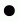     |          |       |      |
> |                    *point*                     |                    *egg*                     |                   *triangle*                   |                  *plaintext*                   |
> |        |    |  |     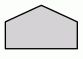     |
> |                   *diamond*                    |                 *trapezium*                  |                *parallelogram*                 |                    *house*                     |
> |        |      | 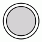  |  |
> |                   *hexagon*                    |                  *octagon*                   |                 *doublecircle*                 |                *doubleoctagon*                 |
> | 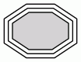 |  |   |       |
> |                *tripleoctagon*                 |                *invtriangle*                 |                 *invtrapezium*                 |                   *invhouse*                   |
> |   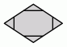    |      |        |     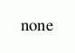      |
> |                   *Mdiamond*                   |                  *Msquare*                   |                   *Mcircle*                    |                     *none*                     |
> |    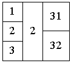     |   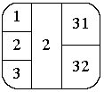   |                                                |                                                |
> |                    *record*                    |                  *Mrecord*                   |                                                |                                                |

> ### Arrow Types

> |  |    |      | 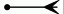 |
> | :---------------------------------------: | :--------------------------------------: | :----------------------------------------: | :-------------------------------------: |
> |                 *normal*                  |                  *dot*                   |                   *inv*                    |                 *crow*                  |
> |  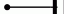   |  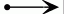  |  | 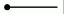 |
> |                   *tee*                   |                  *vee*                   |                 *diamond*                  |                 *none*                  |
> |  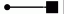   |  |   |  |
> |                   *box*                   |                 *curve*                  |                  *icurve*                  |                 *odot*                  |