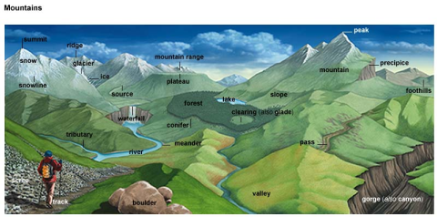

### Adjective

> + abundant / copious / plentiful / substantial
> + adequate / ample / enough / sufficient
> + ambipolar / bipolar 
> + apparent / conspicuous / obvious
> + believable / credible / dependable / plausible / reliable 
> + clear / lucid
> + committed / dedicated / devoted 
> + complex / complicated
> + consecutive / continual / continuous
> + conspicuous / eminent / preeminent / prominent / salient
> + contemporary / contemporaneous
> + critical / crucial
> + essential / necessary / vital
> + inborn / innate
> + inclusive / through
> + linear / rectilinear
> + omnipresent / pervasive / prevalent / ubiquitous / universal
> + perspective / prospective
> + rigid / strict / stringent
> + significant / important

### Noun

> + ancestor / progenitor
> + block / chunk / hunk / lump
> + caution / caveat / warning
> + cavity / hole / hollow
> + character / characteristic / feature / nature / quality / trait / personality
> + chart / diagram /figure / graph
> + clay / dirt / dust / earth / ground / land / mud / soil 
> + clump / cluster
> + complement / supplement
> + configuration / conformation
> + conjecture / speculation
> + correlation / relevance
> + dot / mark / patch / speck / speckle / spot 
> + earnings / income / pay / salary / wage
> + emptiness / void
> + excess / plethora
> + fibre / filament / thread
> + genesis / origin
> + growing / increasing / mounting
> + inclination / propensity
> + issue / problem / trouble
> + jargon / nomenclature / terminology
> + leftover / relic / remainder / remain / remnant / residual / rest 
> + matter / substance
> + notice / notification 
> + outline / synopsis
> + program / programme
> + range / scope
> + research / study / survey> + research / study / survey
> + resolution / solution
> + scheme / scenario
> + stone / rock
> 
> 

### Verb

> + advance / proceed / progress 
> + agglomerate / aggregate
> + aggregate / assemble / converge 
> + associate / connect / interlink / link
> + assume / postulate / presume / speculate / suppose
> + assure / ensure/ guarantee / insure
> + attain / reach
> + await / wait
> + breach / break / defy / violate
> + clean / cleanse
> + coagulate / condense
> + collide / ram
> + comment / note / observe / remark
> + deter / hamper / hinder / impede / inhibit / obstruct / prevent / prohibit / retard 
> + differentiate / discriminate / distinguish
> + disrupt / disturb / interrupt  / perturb  
> + elucidate / explain
> + emanate / emit / radiate
> + emulate / imitate / mimic / mock / simulate
> + enact / play out
> + encompass / encircle / surround
> + endeavour / strive 
> + fill / populate
> + incline / lean / slope / tilt 
> + justify / warrant
> + leverage / utilize
> + orbit / revolve / rotate
> + research / study / survey
> + transfer / transit / transmit / transport

### Other

> + additionally / also / as well / further more / in addition to / likewise / moreover / too
> + although / despite / even though / in spite of / though
> + because of / due to / on the account of / owing to
> + but / however / nevertheless / nonetheless
> + consequently / hence / thereby / therefore / thus 
> + eventually / finally / lastly / ultimately 
> + when / while / whilst
> + whereas / while / whilst