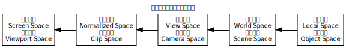

### 特别注意

```
右手旋坐标系指右手坐标系，左手旋坐标系指左手坐标系。
在右手旋坐标系中，+X轴与+Y轴的叉乘运算为+Z轴，在左手旋坐标系中，+X轴与+Y轴的叉乘运算为-Z轴。
计算机图形学采用空间3维右手旋坐标系，+X轴向右，+Y轴向上，+Z轴向外。OpenGL采用右手旋坐标系。
计算机视觉采用空间3维右手旋坐标系，但+X轴向右，+Y轴向下，+Z轴向里。OpenCV采用右手旋坐标系。
计算机操作系统均采用平面2维坐标系，但+X轴向右，+Y轴向下。计算机屏幕自上而下进行光栅化扫描。
本书强烈建议采用空间3维右手旋坐标系，+X轴向右，+Z轴向上，+Y轴向里。以与空间几何学相辅相成。
本书目前暂时采用计算机图形学的空间3维右手旋坐标系。
```

### 仿射变换的运算性质

线性变换前后原点保持重合，线性变换前后直线保持直线。

$$
\begin{aligned}
&线性变换的运算性质: \\
&\begin{aligned}
&\lbrack相似性\rbrack & f(c · \vec{v}) &= c · f(\vec{v}) \\
&\lbrack叠加性\rbrack & f(\vec{u} + \vec{v}) &= f(\vec{u}) + f(\vec{v}) \\
\end{aligned} \\
\end{aligned}
$$

仿射变换前后原点不必重合，仿射变换前后直线保持直线。注意：$3×3$元矩阵无法满足$3$维空间内仿射变换的运算性质。

$$
\begin{aligned}
仿射变换 &= 线性变换 + 平移变换。 \\
\vec{a}_{\mathrm{ffine}} &= L_{\mathrm{inear}} \mathop{\rlap{×}{+}} \vec{v} + \vec{t}_{\mathrm{ranslation}} \\
\left[\begin{matrix}
a_z \\
a_y \\
a_x \\
\end{matrix}\right] &= \left[\begin{matrix}
l_{3,1} & l_{3,2} & l_{3,3} \\
l_{2,1} & l_{2,2} & l_{2,3} \\
l_{1,1} & l_{1,2} & l_{1,3} \\
\end{matrix}\right] \rlap{×}{+} \left[\begin{matrix}
v_z \\
v_y \\
v_x \\
\end{matrix}\right] + \left[\begin{matrix}
t_z \\
t_y \\
t_x \\
\end{matrix}\right] \\
\left[\begin{matrix}
a_z \\
a_y \\
a_x \\
\hline
1 \\
\end{matrix}\right] &= \left[\begin{array}{c|ccc}
t_z & l_{3,1} & l_{3,2} & l_{3,3} \\
t_y & l_{2,1} & l_{2,2} & l_{2,3} \\
t_x & l_{1,1} & l_{1,2} & l_{1,3} \\
\hline
1 & 0 & 0 & 0 \\
\end{array}\right] \rlap{×}{+} \left[\begin{matrix}
v_z \\
v_y \\
v_x \\
\hline
1 \\
\end{matrix}\right] \\
\end{aligned}
$$

### 齐次变换 Homogen

若无特别的规定，约定齐次坐标为向量而非矢量，约定齐次坐标的各个分量均为实数而非复数。

对于齐次坐标，当其标量非零时表示矢量空间中的点，当其标量为零时表示矢量空间中的矢量。注意：矢量空间中的矢量为两点之差值。

$$
\begin{aligned}
\left[\begin{matrix}
v_z · v_w^{-1} \\
v_y · v_w^{-1} \\
v_x · v_w^{-1} \\
\hline
1 \\
\end{matrix}\right] &\mathop{≈≈≈}\limits_{0≠v_w} \left[\begin{matrix}
v_z \\
v_y \\
v_x \\
\hline
v_w \\
\end{matrix}\right] \\
\left[\begin{matrix}
u_z - v_z \\
u_y - v_y \\
u_x - v_x \\
\hline
0 \\
\end{matrix}\right] &\mathop{===}\limits_{1=v_w}^{1=u_w} \left[\begin{matrix}
u_z \\
u_y \\
u_x \\
\hline
1 \\
\end{matrix}\right] - \left[\begin{matrix}
v_z \\
v_y \\
v_x \\
\hline
1 \\
\end{matrix}\right] \\
\end{aligned}
$$

### 恒等变换 Identity

恒等变换的变换矩阵必为单位矩阵。

$$
\left[\begin{matrix}
v_z \\
v_y \\
v_x \\
\hline
1 \\
\end{matrix}\right] = \left[\begin{array}{c|ccc}
0 & 0 & 0 & 1 \\
0 & 0 & 1 & 0 \\
0 & 1 & 0 & 0 \\
\hline
1 & 0 & 0 & 0 \\
\end{array}\right] \rlap{×}{+} \left[\begin{matrix}
v_z \\
v_y \\
v_x \\
\hline
1 \\
\end{matrix}\right] \\
$$

### 缩放变换 Scaling

缩放变换对各分量的缩放未必一致。

$$
\left[\begin{matrix}
s_z · v_z \\
s_y · v_y \\
s_x · v_x \\
\hline
1 \\
\end{matrix}\right] = \left[\begin{array}{c|ccc}
0 & 0 & 0 & s_z \\
0 & 0 & s_y & 0 \\
0 & s_x & 0 & 0 \\
\hline
1 & 0 & 0 & 0 \\
\end{array}\right] \rlap{×}{+} \left[\begin{matrix}
v_z \\
v_y \\
v_x \\
\hline
1 \\
\end{matrix}\right] \\
$$

### 切变变换 Shearing

$$
\left[\begin{matrix}
v_z + s_{z:x} · v_x + s_{z:y} · v_y \\
v_y + s_{y:z} · v_z + s_{y:x} · v_x \\
v_x + s_{x:y} · v_y + s_{x:z} · v_z \\
\hline
1 \\
\end{matrix}\right] = \left[\begin{array}{c|ccc}
0 & s_{z:x} & s_{z:y} & 1 \\
0 & s_{y:x} & 1 & s_{y:z} \\
0 & 1 & s_{x:y} & s_{x:z} \\
\hline
1 & 0 & 0 & 0 \\
\end{array}\right] \rlap{×}{+} \left[\begin{matrix}
v_z \\
v_y \\
v_x \\
\hline
1 \\
\end{matrix}\right] \\
$$

### 平移变换 Translation

注意：$3×3$元矩阵无法满足$3$维空间内仿射变换的运算性质。

$$
\left[\begin{matrix}
v_z + t_z \\
v_y + t_y \\
v_x + t_x \\
\hline
1 \\
\end{matrix}\right] = \left[\begin{array}{c|ccc}
t_z & 0 & 0 & 1 \\
t_y & 0 & 1 & 0 \\
t_x & 1 & 0 & 0 \\
\hline
1 & 0 & 0 & 0 \\
\end{array}\right] \rlap{×}{+} \left[\begin{matrix}
v_z \\
v_y \\
v_x \\
\hline
1 \\
\end{matrix}\right] \\
$$

### 旋转变换 Rotation

以$3$维空间矢量$\vec{η}_x · n_x + \vec{η}_y · n_y + \vec{η}_z · n_z$为旋转轴，将$3$维空间的点$\vec{v}$按右手旋转角度$\varphi$。

$$
\begin{aligned}
&\left[\begin{matrix}
v_z · \cos\varphi + (v_y · n_x - v_x · n_y) · \sin\varphi + (v_x · n_x + v_y · n_y + v_z · n_z) · n_z · (1 - \cos\varphi) \\
v_y · \cos\varphi + (v_x · n_z - v_z · n_x) · \sin\varphi + (v_x · n_x + v_y · n_y + v_z · n_z) · n_y · (1 - \cos\varphi) \\
v_x · \cos\varphi + (v_z · n_y - v_y · n_z) · \sin\varphi + (v_x · n_x + v_y · n_y + v_z · n_z) · n_x · (1 - \cos\varphi) \\
\hline
1 \\
\end{matrix}\right] \\
&= \left[\begin{array}{c|ccc}
0 & -n_y · \sin\varphi + n_z · n_x · (1 - \cos\varphi) & +n_x · \sin\varphi + n_y · n_z · (1 - \cos\varphi) & \cos\varphi + n_z^2 · (1 - \cos\varphi) \\
0 & +n_z · \sin\varphi + n_x · n_y · (1 - \cos\varphi) & \cos\varphi + n_y^2 · (1 - \cos\varphi) & -n_x · \sin\varphi + n_y · n_z · (1 - \cos\varphi) \\
0 & \cos\varphi + n_x^2 · (1 - \cos\varphi) & -n_z · \sin\varphi + n_x · n_y · (1 - \cos\varphi) & +n_y · \sin\varphi + n_z · n_x · (1 - \cos\varphi) \\
\hline
1 & 0 & 0 & 0 \\
\end{array}\right] \rlap{×}{+} \left[\begin{matrix}
v_z \\
v_y \\
v_x \\
\hline
1 \\
\end{matrix}\right] \\
\end{aligned}
$$

以$3$维空间矢量$\vec{η}_x$为旋转轴，将$3$维空间的点$\vec{v}$按右手旋转角度$\varphi$。

$$
\left[\begin{matrix}
+ v_y · \sin\varphi + v_z · \cos\varphi \\
+ v_y · \cos\varphi - v_z · \sin\varphi \\
+ v_x \\
\hline
1 \\
\end{matrix}\right] = \left[\begin{array}{c|ccc}
0 & 0 & +\sin\varphi & +\cos\varphi \\
0 & 0 & +\cos\varphi & -\sin\varphi \\
0 & 1 & 0 & 0 \\
\hline
1 & 0 & 0 & 0 \\
\end{array}\right] \rlap{×}{+} \left[\begin{matrix}
v_z \\
v_y \\
v_x \\
\hline
1 \\
\end{matrix}\right]
$$

以$3$维空间矢量$\vec{η}_y$为旋转轴，将$3$维空间的点$\vec{v}$按右手旋转角度$\varphi$。

$$
\left[\begin{matrix}
- v_x · \sin\varphi + v_z · \cos\varphi \\
+ v_y \\
+ v_x · \cos\varphi + v_z · \sin\varphi \\
\hline
1 \\
\end{matrix}\right] = \left[\begin{array}{c|ccc}
0 & -\sin\varphi & 0 & +\cos\varphi \\
0 & 0 & 1 & 0 \\
0 & +\cos\varphi & 0 & +\sin\varphi \\
\hline
1 & 0 & 0 & 0 \\
\end{array}\right] \rlap{×}{+} \left[\begin{matrix}
v_z \\
v_y \\
v_x \\
\hline
1 \\
\end{matrix}\right] \\
$$

以$3$维空间矢量$\vec{η}_z$为旋转轴，将$3$维空间的点$\vec{v}$按右手旋转角度$\varphi$。

$$
\left[\begin{matrix}
+ v_z \\
+ v_x · \sin\varphi + v_y · \cos\varphi \\
+ v_x · \cos\varphi - v_y · \sin\varphi \\
\hline
1 \\
\end{matrix}\right] = \left[\begin{array}{c|ccc}
0 & 0 & 0 & 1 \\
0 & +\sin\varphi & +\cos\varphi & 0 \\
0 & +\cos\varphi & -\sin\varphi & 0 \\
\hline
1 & 0 & 0 & 0 \\
\end{array}\right] \rlap{×}{+} \left[\begin{matrix}
v_z \\
v_y \\
v_x \\
\hline
1 \\
\end{matrix}\right] \\
$$

### 镜像变换 Mirroring

以$3$维空间原点$O$为镜像点，将$3$维空间的点$\vec{v}$镜像化。

$$
\left[\begin{matrix}
- v_z \\
- v_y \\
- v_x \\
\hline
1 \\
\end{matrix}\right] = \left[\begin{array}{c|ccc}
0 & 0 & 0 & -1 \\
0 & 0 & -1 & 0 \\
0 & -1 & 0 & 0 \\
\hline
1 & 0 & 0 & 0 \\
\end{array}\right] \rlap{×}{+} \left[\begin{matrix}
v_z \\
v_y \\
v_x \\
\hline
1 \\
\end{matrix}\right] \\
$$

以$3$维空间直线$Ox$为镜像轴，将$3$维空间的点$\vec{v}$镜像化。以直线为镜像轴相当于绕直线旋转$180°$。

$$
\left[\begin{matrix}
- v_z \\
- v_y \\
+ v_x \\
\hline
1 \\
\end{matrix}\right] = \left[\begin{array}{c|ccc}
0 & 0 & 0 & -1 \\
0 & 0 & -1 & 0 \\
0 & +1 & 0 & 0 \\
\hline
1 & 0 & 0 & 0 \\
\end{array}\right] \rlap{×}{+} \left[\begin{matrix}
v_z \\
v_y \\
v_x \\
\hline
1 \\
\end{matrix}\right] \\
$$

以$3$维空间直线$Oy$为镜像轴，将$3$维空间的点$\vec{v}$镜像化。以直线为镜像轴相当于绕直线旋转$180°$。

$$
\left[\begin{matrix}
- v_z \\
+ v_y \\
- v_x \\
\hline
1 \\
\end{matrix}\right] = \left[\begin{array}{c|ccc}
0 & 0 & 0 & -1 \\
0 & 0 & +1 & 0 \\
0 & -1 & 0 & 0 \\
\hline
1 & 0 & 0 & 0 \\
\end{array}\right] \rlap{×}{+} \left[\begin{matrix}
v_z \\
v_y \\
v_x \\
\hline
1 \\
\end{matrix}\right] \\
$$

以$3$维空间直线$Oz$为镜像轴，将$3$维空间的点$\vec{v}$镜像化。以直线为镜像轴相当于绕直线旋转$180°$。

$$
\left[\begin{matrix}
+ v_z \\
- v_y \\
- v_x \\
\hline
1 \\
\end{matrix}\right] = \left[\begin{array}{c|ccc}
0 & 0 & 0 & +1 \\
0 & 0 & -1 & 0 \\
0 & -1 & 0 & 0 \\
\hline
1 & 0 & 0 & 0 \\
\end{array}\right] \rlap{×}{+} \left[\begin{matrix}
v_z \\
v_y \\
v_x \\
\hline
1 \\
\end{matrix}\right] \\
$$

以$3$维空间平面$yOz$为镜像面，将$3$维空间的点$\vec{v}$镜像化。

$$
\left[\begin{matrix}
+ v_z \\
+ v_y \\
- v_x \\
\hline
1 \\
\end{matrix}\right] = \left[\begin{array}{c|ccc}
0 & 0 & 0 & +1 \\
0 & 0 & +1 & 0 \\
0 & -1 & 0 & 0 \\
\hline
1 & 0 & 0 & 0 \\
\end{array}\right] \rlap{×}{+} \left[\begin{matrix}
v_z \\
v_y \\
v_x \\
\hline
1 \\
\end{matrix}\right] \\
$$

以$3$维空间平面$zOx$为镜像面，将$3$维空间的点$\vec{v}$镜像化。

$$
\left[\begin{matrix}
+ v_z \\
- v_y \\
+ v_x \\
\hline
1 \\
\end{matrix}\right] = \left[\begin{array}{c|ccc}
0 & 0 & 0 & +1 \\
0 & 0 & -1 & 0 \\
0 & +1 & 0 & 0 \\
\hline
1 & 0 & 0 & 0 \\
\end{array}\right] \rlap{×}{+} \left[\begin{matrix}
v_z \\
v_y \\
v_x \\
\hline
1 \\
\end{matrix}\right] \\
$$

以$3$维空间平面$xOy$为镜像轴，将$3$维空间的点$\vec{v}$镜像化。

$$
\left[\begin{matrix}
- v_z \\
+ v_y \\
+ v_x \\
\hline
1 \\
\end{matrix}\right] = \left[\begin{array}{c|ccc}
0 & 0 & 0 & -1 \\
0 & 0 & +1 & 0 \\
0 & +1 & 0 & 0 \\
\hline
1 & 0 & 0 & 0 \\
\end{array}\right] \rlap{×}{+} \left[\begin{matrix}
v_z \\
v_y \\
v_x \\
\hline
1 \\
\end{matrix}\right] \\
$$

### 反射变换 Reflection

$$

$$

### 折射变换 Refraction

$$

$$

### 右手旋坐标系与左手旋坐标系

右手旋坐标系与左手旋坐标系以$xOy$平面为镜像面互为镜像对称，$+X$轴与$+Y$轴相同，$+Z$轴互为镜像对称。

$$
\begin{aligned}
\left[\begin{matrix}
-1,+1 \\
-1,+1 \\
-1,+1 \\
\hline
1 \\
\end{matrix}\right] &\mathop{======}\limits_{z_{\mathrm{near}}<0}^{\mathrm{right-handed}} \mathrm{P}_{\mathrm{rojection}} \rlap{×}{+} \left[\begin{matrix}
z_{\mathrm{far}},z_{\mathrm{near}} \\
y_{\mathrm{bottom}},y_{\mathrm{top}} \\
x_{\mathrm{left}},x_{\mathrm{right}} \\
\hline
1 \\
\end{matrix}\right] \\
\left[\begin{matrix}
-1,+1 \\
-1,+1 \\
-1,+1 \\
\hline
1 \\
\end{matrix}\right] &\mathop{======}\limits_{0<z_{\mathrm{near}}}^{\mathrm{left-handed}} \mathrm{P}_{\mathrm{rojection}} \rlap{×}{+} \left[\begin{matrix}
z_{\mathrm{near}},z_{\mathrm{far}} \\
y_{\mathrm{bottom}},y_{\mathrm{top}} \\
x_{\mathrm{left}},x_{\mathrm{right}} \\
\hline
1 \\
\end{matrix}\right] \\
\left[\begin{matrix}
+z \\
-y \\
-x \\
\hline
-w \\
\end{matrix}\right] ≈ \left[\begin{matrix}
-z \\
+y \\
+x \\
\hline
+w \\
\end{matrix}\right] &\mathop{======}_{0<z_{\mathrm{near}}}^{\mathrm{left-handed}} \left[\begin{array}{c|ccc}
0 & 0 & 0 & -1 \\
0 & 0 & +1 & 0 \\
0 & +1 & 0 & 0 \\
\hline
+1 & 0 & 0 & 0 \\
\end{array}\right] \rlap{×}{+} \left[\begin{matrix}
z \\
y \\
x \\
\hline
w \\
\end{matrix}\right] ≈ \left[\begin{array}{c|ccc}
0 & 0 & 0 & +1 \\
0 & 0 & -1 & 0 \\
0 & -1 & 0 & 0 \\
\hline
-1 & 0 & 0 & 0 \\
\end{array}\right] \rlap{×}{+} \left[\begin{matrix}
z \\
y \\
x \\
\hline
w \\
\end{matrix}\right] \\
\end{aligned}
$$

### 计算机图形学中的坐标变换



$$
\begin{aligned}
\vec{c}_{\mathrm{lip}} &= \mathrm{P_{rojection}} \rlap{×}{+} \mathrm{V_{iew}} \rlap{×}{+} \mathrm{M_{odel}} \rlap{×}{+} \mathrm{L_{ocal}} \rlap{×}{+} \vec{v}_{\mathrm{ertex}} \\
\vec{s}_{\mathrm{creen}} &= \mathrm{V_{iewport}}(\vec{c}_{\mathrm{lip}}) \\
\end{aligned}
$$

### 视野变换 View Transformation

以摄像机作为新原点，视野变换将相对于场景原点的世界坐标变换为相对于摄像机的视野坐标。

$$
\begin{aligned}
\mathrm{p_{osition}} &\mathop{=====} \left[\begin{matrix}
p_z \\
p_y \\
p_x \\
\end{matrix}\right] \\
\mathrm{d_{irection}} &\mathop{=====}\limits_{-Z}^{\mathrm{normalized}} \left[\begin{matrix}
d_z \\
d_y \\
d_x \\
\end{matrix}\right] & \mathrm{u_p} &\mathop{=====}\limits_{+Y}^{\mathrm{normalized}} \left[\begin{matrix}
u_z \\
u_y \\
u_x \\
\end{matrix}\right] & \mathrm{r_{ight}} &\mathop{=====}\limits_{+X}^{\mathrm{normalized}} \left[\begin{matrix}
r_z \\
r_y \\
r_x \\
\end{matrix}\right] = \left[\begin{matrix}
d_z \\
d_y \\
d_x \\
\end{matrix}\right] \otimes \left[\begin{matrix}
u_z \\
u_y \\
u_x \\
\end{matrix}\right] = \left[\begin{matrix}
d_x · d_y - d_y · u_x \\
d_z · u_x - d_x · u_z \\
d_y · u_z - d_z · u_y \\
\end{matrix}\right] \\
\end{aligned}
$$

```
视野变换的步骤，共计2步：
[重原变换|平移变换] 将摄像机平移与世界坐标系的原点重合；
[配对变换|旋转变换] 将摄像机坐标轴旋转与世界坐标轴重合，摄像机的朝向与世界坐标轴-Z轴重合；注意：摄像机坐标系与世界坐标系均为规范正交坐标系。
```

$$
\begin{aligned}
\left[\begin{array}{c|ccc}
0 & 0 & 0 & 1 \\
0 & 0 & 1 & 0 \\
0 & 1 & 0 & 0 \\
\hline
1 & 0 & 0 & 0 \\
\end{array}\right] &= \mathrm{M_{atch}} \rlap{×}{+} \left[\begin{array}{c|ccc}
0 & r_z & u_z & -d_z \\
0 & r_y & u_y & -d_y \\
0 & r_x & u_x & -d_x \\
\hline
1 & 0 & 0 & 0 \\
\end{array}\right] = \mathrm{M_{atch}} \rlap{×}{+} \left[\begin{array}{c|ccc}
0 & d_x · u_y - d_y · u_x & +u_z & -d_z \\
0 & d_z · u_x - d_x · u_z & +u_y & -d_y \\
0 & d_y · u_z - d_z · u_y & +u_x & -d_x \\
\hline
1 & 0 & 0 & 0 \\
\end{array}\right] \\
\mathrm{M_{atch}} &= \mathrm{Inverse} \left[\begin{array}{c|ccc}
0 & d_x · u_y - d_y · u_x & +u_z & -d_z \\
0 & d_z · u_x - d_x · u_z & +u_y & -d_y \\
0 & d_y · u_z - d_z · u_y & +u_x & -d_x \\
\hline
1 & 0 & 0 & 0 \\
\end{array}\right] = \mathrm{Reverse} \left[\begin{array}{c|ccc}
0 & d_x · u_y - d_y · u_x & +u_z & -d_z \\
0 & d_z · u_x - d_x · u_z & +u_y & -d_y \\
0 & d_y · u_z - d_z · u_y & +u_x & -d_x \\
\hline
1 & 0 & 0 & 0 \\
\end{array}\right] \\
\mathrm{O_{riginate}} &= \left[\begin{array}{c|ccc}
-p_z & 0 & 0 & 0 \\
-p_y & 0 & 0 & 0 \\
-p_x & 0 & 0 & 0 \\
\hline
1 & 0 & 0 & 0 \\
\end{array}\right] \\
\mathrm{M_{atch}} &= \left[\begin{array}{c|ccc}
0 & -d_x & -d_y & -d_z \\
0 & +u_x & +u_y & +u_z \\
0 & d_y · u_z - d_z · u_y & d_z · u_x - d_x · u_z & d_x · u_y - d_y · u_x \\
\hline
1 & 0 & 0 & 0 \\
\end{array}\right] \\
\end{aligned}
$$

$$
\begin{aligned}
\mathrm{V_{iew}} &= \mathrm{M_{atch}} \rlap{×}{+} \mathrm{O_{riginate}} \\
&= \left[\begin{array}{c|ccc}
0 & -d_x & -d_y & -d_z \\
0 & +u_x & +u_y & +u_z \\
0 & d_y · u_z - d_z · u_y & d_z · u_x - d_x · u_z & d_x · u_y - d_y · u_x \\
\hline
1 & 0 & 0 & 0 \\
\end{array}\right] \rlap{×}{+} \left[\begin{array}{c|ccc}
-p_z & 0 & 0 & 1 \\
-p_y & 0 & 1 & 0 \\
-p_x & 1 & 0 & 0 \\
\hline
1 & 0 & 0 & 0 \\
\end{array}\right] \\
&= \left[\begin{array}{c|ccc}
+p_x · u_x + p_y · d_y + p_z · d_z & -d_x & -d_y & -d_z \\
-p_x · u_x - p_y · u_y - p_z · u_z & +u_x & +u_y & +u_z \\
-p_x · (d_y · u_z - d_z · u_y) - p_y · (d_z · u_x - d_x · u_z) - p_z · (d_x · u_y - d_y · u_x) & d_y · u_z - d_z · u_y & d_z · u_x - d_x · u_z & d_x · u_y - d_y · u_x \\
\hline
1 & 0 & 0 & 0 \\
\end{array}\right] \\
\end{aligned}
$$

### 透视投影变换 Perspective Projection

透视投影的投影空间为棱台体，透视投影将产生近大远小收敛的视觉效果。此处透视投影为斜透视投影，仅考虑单点透视投影。

注意：透视投影远近平面与$xOy$平面均平行，但其近平面中心未必在$-Z$轴。

```
透视投影变换的步骤，共计4步：透视投影变换与正交投影变换的后3步完全相同。
[正则变换|透视变换] 将棱台体的底部压缩形成长方体；注意：透视变换非仿射变换，透视变换使长方体的原中心发生非线性偏移。
[重原变换|平移变换] 将长方体现中心平移与原点重合；
[规范变换|缩放变换] 将长方体的三围缩放到[-1, +1]；
[左手变换|镜像变换] 将长方体按 xOy平面做镜像变换；
```

$$
\begin{aligned}
\left[\begin{matrix}
z_{\mathrm{far}},z_{\mathrm{near}} \\
y · \frac{z_{\mathrm{near}}}{z} \\
x · \frac{z_{\mathrm{near}}}{z} \\
\hline
1 \\
\end{matrix}\right] &\mathop{==========}\limits_{z_{\mathrm{far}}<z_{\mathrm{near}}<0}^{\mathrm{linearly}} \mathrm{R_{egularize}} \rlap{×}{+} \left[\begin{matrix}
z \\
y \\
x \\
\hline
1 \\
\end{matrix}\right] = \left[\begin{array}{c|ccc}
0 & 0 & 0 & 1 \\
0 & 0 & \frac{z_{\mathrm{near}}}{\rlap{z}{≡}} & 0 \\
0 & \frac{z_{\mathrm{near}}}{\rlap{z}{≡}} & 0 & 0 \\
\hline
1 & 0 & 0 & 0 \\
\end{array}\right] \rlap{×}{+} \left[\begin{matrix}
z \\
y \\
x \\
\hline
1 \\
\end{matrix}\right] \\
\left[\begin{matrix}
z_{\mathrm{far}},z_{\mathrm{near}} \\
y · \frac{z_{\mathrm{near}}}{z} \\
x · \frac{z_{\mathrm{near}}}{z} \\
\hline
1 \\
\end{matrix}\right] ≈ \left[\begin{matrix}
z_{\mathrm{far}}^2,z_{\mathrm{near}}^2 \\
y · z_{\mathrm{near}} \\
x · z_{\mathrm{near}} \\
\hline
z \\
\end{matrix}\right] &\mathop{==========}\limits_{z_{\mathrm{far}}<z_{\mathrm{near}}<0}^{\mathrm{non-linearly}} \mathrm{R_{egularize}} \rlap{×}{+} \left[\begin{matrix}
z \\
y \\
x \\
\hline
1 \\
\end{matrix}\right] = \left[\begin{array}{c|ccc}
r_{3,0} & 0 & 0 & r_{3,3} \\
0 & 0 & z_{\mathrm{near}} & 0 \\
0 & z_{\mathrm{near}} & 0 & 0 \\
\hline
0 & 0 & 0 & 1 \\
\end{array}\right] \rlap{×}{+} \left[\begin{matrix}
z \\
y \\
x \\
\hline
1 \\
\end{matrix}\right] &⇒\left\lbrace\begin{array}{cc}
z_{\mathrm{far}}^2 = r_{3,0} + r_{3,3} · z_{\mathrm{far}} \\
z_{\mathrm{near}}^2 = r_{3,0} + r_{3,3} · z_{\mathrm{near}} \\
\end{array}\right. \left\lbrace\begin{array}{cc}
r_{3,0} = - z_{\mathrm{far}} · z_{\mathrm{near}} \\
r_{3,3} = z_{\mathrm{far}} + z_{\mathrm{near}} \\
\end{array}\right. \\
\mathrm{R_{egularize}} &\mathop{==========}\limits_{[z_{\mathrm{far}},z_{\mathrm{near}}]} \left[\begin{array}{c|ccc}
- z_{\mathrm{far}} · z_{\mathrm{near}} & 0 & 0 & z_{\mathrm{far}} + z_{\mathrm{near}} \\
0 & 0 & z_{\mathrm{near}} & 0 \\
0 & z_{\mathrm{near}} & 0 & 0 \\
\hline
0 & 0 & 0 & 1 \\
\end{array}\right] \\
\mathrm{O_{riginate}} &\mathop{==========}\limits_{\left[ +\frac{z_{\mathrm{far}}+z_{\mathrm{near}}}{2},-\frac{z_{\mathrm{far}}+z_{\mathrm{near}}}{2} \right]} \left[\begin{array}{c|ccc}
- \frac{z_{\mathrm{far}} + z_{\mathrm{near}}}{2} & 0 & 0 & 1\\
- \frac{y_{\mathrm{top}} + y_{\mathrm{bottom}}}{2} & 0 & 1 & 0 \\
- \frac{x_{\mathrm{right}} + x_{\mathrm{left}}}{2} & 1 & 0 & 0 \\
\hline
1 & 0 & 0 & 0 \\
\end{array}\right] \\
\mathrm{N_{ormalize}} &\mathop{==========}\limits_{[-1,+1]} \left[\begin{array}{c|ccc}
0 & 0 & 0 & \frac{-2}{z_{\mathrm{far}} - z_{\mathrm{near}}} \\
0 & 0 & \frac{+2}{y_{\mathrm{top}} - y_{\mathrm{bottom}}} & 0 \\
0 & \frac{+2}{x_{\mathrm{right}} - x_{\mathrm{left}}} & 0 & 0 \\
\hline
1 & 0 & 0 & 0 \\
\end{array}\right] \\
\mathrm{L_{eft}} &\mathop{==========}\limits_{-z_{\mathrm{near}}}^{-z_{\mathrm{far}}} \left[\begin{array}{c|ccc}
0 & 0 & 0 & -1 \\
0 & 0 & +1 & 0 \\
0 & +1 & 0 & 0 \\
\hline
+1 & 0 & 0 & 0 \\
\end{array}\right] \mathop{≈} \left[\begin{array}{c|ccc}
0 & 0 & 0 & +1 \\
0 & 0 & -1 & 0 \\
0 & -1 & 0 & 0 \\
\hline
-1 & 0 & 0 & 0 \\
\end{array}\right] \\
\end{aligned}
$$

$$
\begin{aligned}
\mathrm{P_{erspect}} &\mathop{======}\limits_{[-1,+1]}^{\mathrm{right-handed}} \mathrm{N_{ormalize}} \rlap{×}{+} \mathrm{O_{riginate}} \rlap{×}{+} \mathrm{R_{egularize}} \\
&\mathop{======}\limits_{z_{\mathrm{far}}<z_{\mathrm{near}}<0} \left[\begin{array}{c|ccc}
0 & 0 & 0 & \frac{-2}{z_{\mathrm{far}} - z_{\mathrm{near}}} \\
0 & 0 & \frac{+2}{y_{\mathrm{top}} - y_{\mathrm{bottom}}} & 0 \\
0 & \frac{+2}{x_{\mathrm{right}} - x_{\mathrm{left}}} & 0 & 0 \\
\hline
1 & 0 & 0 & 0 \\
\end{array}\right] \rlap{×}{+} \left[\begin{array}{c|ccc}
- \frac{z_{\mathrm{far}} + z_{\mathrm{near}}}{2} & 0 & 0 & 1\\
- \frac{y_{\mathrm{top}} + y_{\mathrm{bottom}}}{2} & 0 & 1 & 0 \\
- \frac{x_{\mathrm{right}} + x_{\mathrm{left}}}{2} & 1 & 0 & 0 \\
\hline
1 & 0 & 0 & 0 \\
\end{array}\right] \rlap{×}{+} \left[\begin{array}{c|ccc}
- z_{\mathrm{far}} · z_{\mathrm{near}} & 0 & 0 & z_{\mathrm{far}} + z_{\mathrm{near}} \\
0 & 0 & z_{\mathrm{near}} & 0 \\
0 & z_{\mathrm{near}} & 0 & 0 \\
\hline
0 & 0 & 0 & 1 \\
\end{array}\right] \\
&\mathop{======}\limits_{z_{\mathrm{far}}<z_{\mathrm{near}}<0} \left[\begin{array}{c|ccc}
+\frac{z_{\mathrm{far}} + z_{\mathrm{near}}}{z_{\mathrm{far}} - z_{\mathrm{near}}} & 0 & 0 & \frac{-2}{z_{\mathrm{far}} - z_{\mathrm{near}}} \\
-\frac{y_{\mathrm{top}} + y_{\mathrm{bottom}}}{y_{\mathrm{top}} - y_{\mathrm{bottom}}} & 0 & \frac{+2}{y_{\mathrm{top}} - y_{\mathrm{bottom}}} & 0 \\
-\frac{x_{\mathrm{right}} + x_{\mathrm{left}}}{x_{\mathrm{right}} - x_{\mathrm{left}}} & \frac{+2}{x_{\mathrm{right}} - x_{\mathrm{left}}} & 0 & 0 \\
\hline
1 & 0 & 0 & 0 \\
\end{array}\right] \rlap{×}{+} \left[\begin{array}{c|ccc}
- z_{\mathrm{far}} · z_{\mathrm{near}} & 0 & 0 & z_{\mathrm{far}} + z_{\mathrm{near}} \\
0 & 0 & z_{\mathrm{near}} & 0 \\
0 & z_{\mathrm{near}} & 0 & 0 \\
\hline
0 & 0 & 0 & 1 \\
\end{array}\right] \\
&\mathop{======}\limits_{z_{\mathrm{far}}<z_{\mathrm{near}}<0} \left[\begin{array}{c|ccc}
\frac{2 · z_{\mathrm{far}} · z_{\mathrm{near}}}{z_{\mathrm{far}} - z_{\mathrm{near}}} & 0 & 0 & - \frac{z_{\mathrm{far}} + z_{\mathrm{near}}}{z_{\mathrm{far}} - z_{\mathrm{near}}} \\
0 & 0 & \frac{2 · z_{\mathrm{near}}}{y_{\mathrm{top}} - y_{\mathrm{bottom}}} & - \frac{y_{\mathrm{top}} + y_{\mathrm{bottom}}}{y_{\mathrm{top}} - y_{\mathrm{bottom}}} \\
0 & \frac{2 · z_{\mathrm{near}}}{x_{\mathrm{right}} - x_{\mathrm{left}}} & 0 & - \frac{x_{\mathrm{right}} + x_{\mathrm{left}}}{x_{\mathrm{right}} - x_{\mathrm{left}}} \\
\hline
0 & 0 & 0 & 1 \\
\end{array}\right] \\
&\mathop{======}\limits_{0=y_{\mathrm{top}}+y_{\mathrm{bottom}}}^{0=x_{\mathrm{right}}+x_{\mathrm{left}}} \left[\begin{array}{c|ccc}
\frac{2 · \mathrm{f_{ar}} · \mathrm{n_{ear}}}{\mathrm{f_{ar}} - \mathrm{n_{ear}}} & 0 & 0 & -\frac{\mathrm{f_{ar}} + \mathrm{n_{ear}}}{\mathrm{f_{ar}} - \mathrm{n_{ear}}} \\
0 & 0 & \frac{2 · \mathrm{n_{ear}}}{\mathrm{h_{eight}}} & 0 \\
0 & \frac{2 · \mathrm{n_{ear}}}{\mathrm{w_{idth}}} & 0 & 0 \\
\hline
0 & 0 & 0 & 1 \\
\end{array}\right] \mathop{============}\limits_{\mathrm{a_{spect}} = \frac{\mathrm{w_{idth}}}{\mathrm{h_{eight}}} = \frac{\mathrm{w_{idth}}}{-2·\mathrm{n_{ear}}·\tan\frac{\mathrm{f_{ield}}}{2}}}^{\tan\frac{\mathrm{f_{ield}}}{2} = \frac{\mathrm{h_{eight}}}{-2 · \mathrm{n_{ear}}}} \left[\begin{array}{c|ccc}
\frac{2 · \mathrm{f_{ar}} · \mathrm{n_{ear}}}{\mathrm{f_{ar}} - \mathrm{n_{ear}}} & 0 & 0 & -\frac{\mathrm{f_{ar}} + \mathrm{n_{ear}}}{\mathrm{f_{ar}} - \mathrm{n_{ear}}} \\
0 & 0 & \frac{-1}{\tan\frac{\mathrm{f_{ield}}}{2}} & 0 \\
0 & \frac{-1}{\mathrm{a_{spect}} · \tan\frac{\mathrm{f_{ield}}}{2}} & 0 & 0 \\
\hline
0 & 0 & 0 & 1 \\
\end{array}\right] \\
\end{aligned}
$$

$$
\begin{aligned}
\mathrm{P_{erspect}} &\mathop{======}\limits_{[+1,-1]}^{\mathrm{left-handed}} \mathrm{L_{eft}} \rlap{×}{+} \mathrm{N_{ormalize}} \rlap{×}{+} \mathrm{O_{riginate}} \rlap{×}{+} \mathrm{R_{egularize}} \\
&\mathop{======}\limits_{0<z_{\mathrm{near}}<z_{\mathrm{far}}} \left[\begin{array}{c|ccc}
0 & 0 & 0 & -1 \\
0 & 0 & +1 & 0 \\
0 & +1 & 0 & 0 \\
\hline
+1 & 0 & 0 & 0 \\
\end{array}\right] \mathop{\rlap{×}{+}}\limits_{-z_{\mathrm{near}}}^{-z_{\mathrm{far}}} \left[\begin{array}{c|ccc}
\frac{- 2 · z_{\mathrm{far}} · z_{\mathrm{near}}}{z_{\mathrm{far}} - z_{\mathrm{near}}} & 0 & 0 & - \frac{z_{\mathrm{far}} + z_{\mathrm{near}}}{z_{\mathrm{far}} - z_{\mathrm{near}}} \\
0 & 0 & \frac{-2 · z_{\mathrm{near}}}{y_{\mathrm{top}} - y_{\mathrm{bottom}}} & - \frac{y_{\mathrm{top}} + y_{\mathrm{bottom}}}{y_{\mathrm{top}} - y_{\mathrm{bottom}}} \\
0 & \frac{-2 · z_{\mathrm{near}}}{x_{\mathrm{right}} - x_{\mathrm{left}}} & 0 & - \frac{x_{\mathrm{right}} + x_{\mathrm{left}}}{x_{\mathrm{right}} - x_{\mathrm{left}}} \\
\hline
0 & 0 & 0 & 1 \\
\end{array}\right] \\
&\mathop{======}\limits_{0<z_{\mathrm{near}}<z_{\mathrm{far}}} \left[\begin{array}{c|ccc}
\frac{2 · z_{\mathrm{far}} · z_{\mathrm{near}}}{z_{\mathrm{far}} - z_{\mathrm{near}}} & 0 & 0 & + \frac{z_{\mathrm{far}} + z_{\mathrm{near}}}{z_{\mathrm{far}} - z_{\mathrm{near}}} \\
0 & 0 & \frac{-2 · z_{\mathrm{near}}}{y_{\mathrm{top}} - y_{\mathrm{bottom}}} & - \frac{y_{\mathrm{top}} + y_{\mathrm{bottom}}}{y_{\mathrm{top}} - y_{\mathrm{bottom}}} \\
0 & \frac{-2 · z_{\mathrm{near}}}{x_{\mathrm{right}} - x_{\mathrm{left}}} & 0 & - \frac{x_{\mathrm{right}} + x_{\mathrm{left}}}{x_{\mathrm{right}} - x_{\mathrm{left}}} \\
\hline
0 & 0 & 0 & 1 \\
\end{array}\right] \\
&\mathop{======}\limits_{0=y_{\mathrm{top}}+y_{\mathrm{bottom}}}^{0=x_{\mathrm{right}}+x_{\mathrm{left}}} \left[\begin{array}{c|ccc}
\frac{2 · \mathrm{f_{ar}} · \mathrm{n_{ear}}}{\mathrm{f_{ar}} - \mathrm{n_{ear}}} & 0 & 0 & + \frac{\mathrm{f_{ar}} + \mathrm{n_{ear}}}{\mathrm{f_{ar}} - \mathrm{n_{ear}}} \\
0 & 0 & \frac{-2 · \mathrm{n_{ear}}}{\mathrm{h_{eight}}} & 0 \\
0 & \frac{-2 · \mathrm{n_{ear}}}{\mathrm{w_{idth}}} & 0 & 0 \\
\hline
0 & 0 & 0 & 1 \\
\end{array}\right] \mathop{============}\limits_{\mathrm{a_{spect}} = \frac{\mathrm{w_{idth}}}{\mathrm{h_{eight}}} = \frac{\mathrm{w_{idth}}}{2·\mathrm{n_{ear}}·\tan\frac{\mathrm{f_{ield}}}{2}}}^{\tan\frac{\mathrm{f_{ield}}}{2} = \frac{\mathrm{h_{eight}}}{2 · \mathrm{n_{ear}}}} \left[\begin{array}{c|ccc}
\frac{2 · \mathrm{f_{ar}} · \mathrm{n_{ear}}}{\mathrm{f_{ar}} - \mathrm{n_{ear}}} & 0 & 0 & \frac{\mathrm{f_{ar}} + \mathrm{n_{ear}}}{\mathrm{f_{ar}} - \mathrm{n_{ear}}} \\
0 & 0 & \frac{-1}{\tan\frac{\mathrm{f_{ield}}}{2}} & 0 \\
0 & \frac{-1}{\mathrm{a_{spect}} · \tan\frac{\mathrm{f_{ield}}}{2}} & 0 & 0 \\
\hline
0 & 0 & 0 & 1 \\
\end{array}\right] \\
\end{aligned}
$$

$$
\begin{aligned}
\mathrm{P_{erspect}} &\mathop{======}\limits_{[+1,-1]}^{\mathrm{left-handed}} \mathrm{L_{eft}} \rlap{×}{+} \mathrm{N_{ormalize}} \rlap{×}{+} \mathrm{O_{riginate}} \rlap{×}{+} \mathrm{R_{egularize}} \\
&\mathop{======}\limits_{0<z_{\mathrm{near}}<z_{\mathrm{far}}} \left[\begin{array}{c|ccc}
0 & 0 & 0 & +1 \\
0 & 0 & -1 & 0 \\
0 & -1 & 0 & 0 \\
\hline
-1 & 0 & 0 & 0 \\
\end{array}\right] \mathop{\rlap{×}{+}}\limits_{-z_{\mathrm{near}}}^{-z_{\mathrm{far}}} \left[\begin{array}{c|ccc}
\frac{- 2 · z_{\mathrm{far}} · z_{\mathrm{near}}}{z_{\mathrm{far}} - z_{\mathrm{near}}} & 0 & 0 & - \frac{z_{\mathrm{far}} + z_{\mathrm{near}}}{z_{\mathrm{far}} - z_{\mathrm{near}}} \\
0 & 0 & \frac{-2 · z_{\mathrm{near}}}{y_{\mathrm{top}} - y_{\mathrm{bottom}}} & - \frac{y_{\mathrm{top}} + y_{\mathrm{bottom}}}{y_{\mathrm{top}} - y_{\mathrm{bottom}}} \\
0 & \frac{-2 · z_{\mathrm{near}}}{x_{\mathrm{right}} - x_{\mathrm{left}}} & 0 & - \frac{x_{\mathrm{right}} + x_{\mathrm{left}}}{x_{\mathrm{right}} - x_{\mathrm{left}}} \\
\hline
0 & 0 & 0 & 1 \\
\end{array}\right] \\
&\mathop{======}\limits_{0<z_{\mathrm{near}}<z_{\mathrm{far}}} \left[\begin{array}{c|ccc}
\frac{- 2 · z_{\mathrm{far}} · z_{\mathrm{near}}}{z_{\mathrm{far}} - z_{\mathrm{near}}} & 0 & 0 & - \frac{z_{\mathrm{far}} + z_{\mathrm{near}}}{z_{\mathrm{far}} - z_{\mathrm{near}}} \\
0 & 0 & \frac{2 · z_{\mathrm{near}}}{y_{\mathrm{top}} - y_{\mathrm{bottom}}} & \frac{y_{\mathrm{top}} + y_{\mathrm{bottom}}}{y_{\mathrm{top}} - y_{\mathrm{bottom}}} \\
0 & \frac{2 · z_{\mathrm{near}}}{x_{\mathrm{right}} - x_{\mathrm{left}}} & 0 & \frac{x_{\mathrm{right}} + x_{\mathrm{left}}}{x_{\mathrm{right}} - x_{\mathrm{left}}} \\
\hline
0 & 0 & 0 & -1 \\
\end{array}\right] \\
&\mathop{======}\limits_{0=y_{\mathrm{top}}+y_{\mathrm{bottom}}}^{0=x_{\mathrm{right}}+x_{\mathrm{left}}} \left[\begin{array}{c|ccc}
\frac{- 2 · \mathrm{f_{ar}} · \mathrm{n_{ear}}}{\mathrm{f_{ar}} - \mathrm{n_{ear}}} & 0 & 0 & - \frac{\mathrm{f_{ar}} + \mathrm{n_{ear}}}{\mathrm{f_{ar}} - \mathrm{n_{ear}}} \\
0 & 0 & \frac{2 · \mathrm{n_{ear}}}{\mathrm{h_{eight}}} & 0 \\
0 & \frac{2 · \mathrm{n_{ear}}}{\mathrm{w_{idth}}} & 0 & 0 \\
\hline
0 & 0 & 0 & -1 \\
\end{array}\right] \mathop{============}_{\mathrm{a_{spect}} = \frac{\mathrm{w_{idth}}}{\mathrm{h_{eight}}} = \frac{\mathrm{w_{idth}}}{2·\mathrm{n_{ear}}·\tan\frac{\mathrm{f_{ield}}}{2}}}^{\tan\frac{\mathrm{f_{ield}}}{2} = \frac{\mathrm{h_{eight}}}{2 · \mathrm{n_{ear}}}} \left[\begin{array}{c|ccc}
\frac{- 2 · \mathrm{f_{ar}} · \mathrm{n_{ear}}}{\mathrm{f_{ar}} - \mathrm{n_{ear}}} & 0 & 0 & - \frac{\mathrm{f_{ar}} + \mathrm{n_{ear}}}{\mathrm{f_{ar}} - \mathrm{n_{ear}}} \\
0 & 0 & \frac{1}{\tan\frac{\mathrm{f_{ield}}}{2}} & 0 \\
0 & \frac{1}{\mathrm{a_{spect}} · \tan\frac{\mathrm{f_{ield}}}{2}} & 0 & 0 \\
\hline
0 & 0 & 0 & -1 \\
\end{array}\right] \\
\end{aligned}
$$

在透视投影变换中，世界空间内点$Z$轴坐标值，以逆正比非线性的方式，透视投影映射到规范化空间内点$Z$轴深度值。注意：逆正比表示$f(z) = \dfrac{\frac{1}{z} - \frac{1}{z_0}}{\frac{1}{z_1} - \frac{1}{z_0}}$。

$$
\begin{aligned}
\left[\begin{matrix}
z_{\mathrm{depth}} \\
y_{\mathrm{screen}} \\
x_{\mathrm{screen}} \\
\hline
1 \\
\end{matrix}\right] = \left[\begin{matrix}
1 - 2 · \frac{\frac{1}{z} - \frac{1}{z_{\mathrm{near}}}}{\frac{1}{z_{\mathrm{far}}} - \frac{1}{z_{\mathrm{near}}}} \\
0 \\
0 \\
\hline
1 \\
\end{matrix}\right] \mathop{≈≈≈≈≈≈}\limits_{z_{\mathrm{far}}<z<z_{\mathrm{near}}<0}^{\mathrm{right-handed}} \left[\begin{matrix}
\frac{2 · z_{\mathrm{far}} · z_{\mathrm{near}} - z · (z_{\mathrm{far}} + z_{\mathrm{near}})}{z_{\mathrm{far}} - z_{\mathrm{near}}} \\
0 \\
0 \\
\hline
+ z \\
\end{matrix}\right] \mathop{======}\limits_{0=y_{\mathrm{top}}+y_{\mathrm{bottom}}}^{0=x_{\mathrm{right}} + x_{\mathrm{left}}} \left[\begin{array}{c|ccc}
\frac{2 · z_{\mathrm{far}} · z_{\mathrm{near}}}{z_{\mathrm{far}} - z_{\mathrm{near}}} & 0 & 0 & - \frac{z_{\mathrm{far}} + z_{\mathrm{near}}}{z_{\mathrm{far}} - z_{\mathrm{near}}} \\
0 & 0 & \frac{2 · z_{\mathrm{near}}}{y_{\mathrm{top}} - y_{\mathrm{bottom}}} & 0 \\
0 & \frac{2 · z_{\mathrm{near}}}{x_{\mathrm{right}} - x_{\mathrm{left}}} & 0 & 0 \\
\hline
0 & 0 & 0 & 1 \\
\end{array}\right] \rlap{×}{+} \left[\begin{matrix}
z \\
0 \\
0 \\
\hline
1 \\
\end{matrix}\right] \\
\end{aligned}
$$

在透视投影变换中，当点$Z$轴值趋近于近平面时，其深度值灵敏度较高；当点$Z$轴值趋近于远平面时，其深度值灵敏度较低，易产生深度检测冲突现象。


### 平行投影变换 Parallel Projection

平行投影的投影空间为方棱体，平行投影将产生远近大小一致的视觉效果。此处平行投影为斜平行投影，也包含正交平行投影。

注意：平行投影远近平面与$xOy$平面均平行，但其近平面中心未必在$-Z$轴。

```
平行投影变换的步骤，共计4步：平行投影变换与透视投影变换的后3步完全相同。
[正则变换|平行变换] 将方棱体的底部切变形成长方体；注意：平行变换是仿射变换，平行变换使长方体的原中心发生直线性偏移。
[重原变换|平移变换] 将长方体现中心平移与原点重合；
[规范变换|缩放变换] 将长方体的三围缩放到[-1, +1]；
[左手变换|镜像变换] 将长方体按 xOy平面做镜像变换；
```

$$
\begin{aligned}
\left[\begin{matrix}
z \\
y - (z - z_{\mathrm{near}}) · \frac{y_{\mathrm{top}} + y_{\mathrm{bottom}}}{2 · z_{\mathrm{near}}} \\
x - (z - z_{\mathrm{near}}) · \frac{x_{\mathrm{right}} + x_{\mathrm{left}}}{2 · z_{\mathrm{near}}} \\
\hline
1 \\
\end{matrix}\right] &= \mathrm{R_{egularize}} \rlap{×}{+} \left[\begin{matrix}
z \\
y \\
x \\
\hline
1 \\
\end{matrix}\right] = \left[\begin{array}{c|ccc}
0 & 0 & 0 & 1 \\
r_{y:w} & 0 & 1 & r_{y:z} \\
r_{x:w} & 1 & 0 & r_{x:z} \\
\hline
1 & 0 & 0 & 0 \\
\end{array}\right] \rlap{×}{+} \left[\begin{matrix}
z \\
y \\
x \\
\hline
1 \\
\end{matrix}\right] = \left[\begin{matrix}
z \\
r_{y:w} + y + z · r_{y:z} \\
r_{x:w} + x + z · r_{x:z} \\
\hline
1 \\
\end{matrix}\right] &⇒\left\lbrace\begin{array}{cc}
r_{y:w} = \frac{y_{\mathrm{top}} + y_{\mathrm{bottom}}}{2} & r_{y:z} = -\frac{y_{\mathrm{top}} + y_{\mathrm{bottom}}}{2 · z_{\mathrm{near}}} \\
r_{x:w} = \frac{x_{\mathrm{right}} + x_{\mathrm{left}}}{2} & r_{x:z} = -\frac{x_{\mathrm{right}} + x_{\mathrm{left}}}{2 · z_{\mathrm{near}}} \\
\end{array}\right. \\
\mathrm{R_{egularize}} &= \left[\begin{array}{c|ccc}
0 & 0 & 0 & 1 \\
\frac{y_{\mathrm{top}} + y_{\mathrm{bottom}}}{2} & 0 & 1 & -\frac{y_{\mathrm{top}} + y_{\mathrm{bottom}}}{2 · z_{\mathrm{near}}} \\
\frac{x_{\mathrm{right}} + x_{\mathrm{left}}}{2} & 1 & 0 & -\frac{x_{\mathrm{right}} + x_{\mathrm{left}}}{2 · z_{\mathrm{near}}} \\
\hline
1 & 0 & 0 & 0 \\
\end{array}\right] \\
\end{aligned}
$$

$$
\begin{aligned}
\mathrm{P_{arallel}} &\mathop{======}\limits_{[-1,+1]}^{\mathrm{right-handed}} \mathrm{N_{ormalize}} \rlap{×}{+} \mathrm{O_{riginate}} \rlap{×}{+} \mathrm{R_{egularize}} \\
&\mathop{======}\limits_{z_{\mathrm{far}}<z_{\mathrm{near}}<0} \left[\begin{array}{c|ccc}
0 & 0 & 0 & \frac{-2}{z_{\mathrm{far}} - z_{\mathrm{near}}} \\
0 & 0 & \frac{+2}{y_{\mathrm{top}} - y_{\mathrm{bottom}}} & 0 \\
0 & \frac{+2}{x_{\mathrm{right}} - x_{\mathrm{left}}} & 0 & 0 \\
\hline
1 & 0 & 0 & 0 \\
\end{array}\right] \rlap{×}{+} \left[\begin{array}{c|ccc}
-\frac{z_{\mathrm{far}} + z_{\mathrm{near}}}{2} & 0 & 0 & 1 \\
-\frac{y_{\mathrm{top}} + y_{\mathrm{bottom}}}{2} & 0 & 1 & 0 \\
-\frac{x_{\mathrm{right}} + x_{\mathrm{left}}}{2} & 1 & 0 & 0 \\
\hline
1 & 0 & 0 & 0 \\
\end{array}\right] \rlap{×}{+} \left[\begin{array}{c|ccc}
0 & 0 & 0 & 1 \\
\frac{y_{\mathrm{top}} + y_{\mathrm{bottom}}}{2} & 0 & 1 & -\frac{y_{\mathrm{top}} + y_{\mathrm{bottom}}}{2 · z_{\mathrm{near}}} \\
\frac{x_{\mathrm{right}} + x_{\mathrm{left}}}{2} & 1 & 0 & -\frac{x_{\mathrm{right}} + x_{\mathrm{left}}}{2 · z_{\mathrm{near}}} \\
\hline
1 & 0 & 0 & 0 \\
\end{array}\right] \\
&\mathop{======}\limits_{z_{\mathrm{far}}<z_{\mathrm{near}}<0} \left[\begin{array}{c|ccc}
+\frac{z_{\mathrm{far}} + z_{\mathrm{near}}}{z_{\mathrm{far}} - z_{\mathrm{near}}} & 0 & 0 & \frac{-2}{z_{\mathrm{far}} - z_{\mathrm{near}}} \\
-\frac{y_{\mathrm{top}} + y_{\mathrm{bottom}}}{y_{\mathrm{top}} - y_{\mathrm{bottom}}} & 0 & \frac{+2}{y_{\mathrm{top}} - y_{\mathrm{bottom}}} & 0 \\
-\frac{x_{\mathrm{right}} + x_{\mathrm{left}}}{x_{\mathrm{right}} - x_{\mathrm{left}}} & \frac{+2}{x_{\mathrm{right}} - x_{\mathrm{left}}} & 0 & 0 \\
\hline
1 & 0 & 0 & 0 \\
\end{array}\right] \rlap{×}{+} \left[\begin{array}{c|ccc}
0 & 0 & 0 & 1 \\
\frac{y_{\mathrm{top}} + y_{\mathrm{bottom}}}{2} & 0 & 1 & -\frac{y_{\mathrm{top}} + y_{\mathrm{bottom}}}{2 · z_{\mathrm{near}}} \\
\frac{x_{\mathrm{right}} + x_{\mathrm{left}}}{2} & 1 & 0 & -\frac{x_{\mathrm{right}} + x_{\mathrm{left}}}{2 · z_{\mathrm{near}}} \\
\hline
1 & 0 & 0 & 0 \\
\end{array}\right] \\
&\mathop{======}\limits_{z_{\mathrm{far}}<z_{\mathrm{near}}<0} \left[\begin{array}{c|ccc}
\frac{z_{\mathrm{far}} + z_{\mathrm{near}}}{z_{\mathrm{far}} - z_{\mathrm{near}}} & 0 & 0 & \frac{-2}{z_{\mathrm{far}} - z_{\mathrm{near}}} \\
0 & 0 & \frac{+2}{y_{\mathrm{top}} - y_{\mathrm{bottom}}} & -\frac{y_{\mathrm{top}} + y_{\mathrm{bottom}}}{(y_{\mathrm{top}} - y_{\mathrm{bottom}}) · z_{\mathrm{near}}} \\
0 & \frac{+2}{x_{\mathrm{right}} - x_{\mathrm{left}}} & 0 & -\frac{x_{\mathrm{right}} + x_{\mathrm{left}}}{(x_{\mathrm{right}} - x_{\mathrm{left}}) · z_{\mathrm{near}}} \\
\hline
1 & 0 & 0 & 0 \\
\end{array}\right] \\
\end{aligned}
$$

$$
\begin{aligned}
\mathrm{P_{arallel}} &\mathop{======}\limits_{[+1,-1]}^{\mathrm{left-handed}} \mathrm{L_{eft}} \rlap{×}{+} \mathrm{S_{cale}} \rlap{×}{+} \mathrm{T_{ranslate}} \\
&\mathop{======}\limits_{0<z_{\mathrm{near}}<z_{\mathrm{far}}} \left[\begin{array}{c|ccc}
0 & 0 & 0 & -1 \\
0 & 0 & +1 & 0 \\
0 & +1 & 0 & 0 \\
\hline
+1 & 0 & 0 & 0 \\
\end{array}\right] \mathop{\rlap{×}{+}}\limits_{-z_{\mathrm{near}}}^{-z_{\mathrm{far}}} \left[\begin{array}{c|ccc}
\frac{z_{\mathrm{far}} + z_{\mathrm{near}}}{z_{\mathrm{far}} - z_{\mathrm{near}}} & 0 & 0 & \frac{+2}{z_{\mathrm{far}} - z_{\mathrm{near}}} \\
0 & 0 & \frac{+2}{y_{\mathrm{top}} - y_{\mathrm{bottom}}} & \frac{y_{\mathrm{top}} + y_{\mathrm{bottom}}}{(y_{\mathrm{top}} - y_{\mathrm{bottom}}) · z_{\mathrm{near}}} \\
0 & \frac{+2}{x_{\mathrm{right}} - x_{\mathrm{left}}} & 0 & \frac{x_{\mathrm{right}} + x_{\mathrm{left}}}{(x_{\mathrm{right}} - x_{\mathrm{left}}) · z_{\mathrm{near}}} \\
\hline
1 & 0 & 0 & 0 \\
\end{array}\right] \\
&\mathop{======}\limits_{0<z_{\mathrm{near}}<z_{\mathrm{far}}} \left[\begin{array}{c|ccc}
-\frac{z_{\mathrm{far}} + z_{\mathrm{near}}}{z_{\mathrm{far}} - z_{\mathrm{near}}} & 0 & 0 & \frac{-2}{z_{\mathrm{far}} - z_{\mathrm{near}}} \\
0 & 0 & \frac{+2}{y_{\mathrm{top}} - y_{\mathrm{bottom}}} & \frac{y_{\mathrm{top}} + y_{\mathrm{bottom}}}{(y_{\mathrm{top}} - y_{\mathrm{bottom}}) · z_{\mathrm{near}}} \\
0 & \frac{+2}{x_{\mathrm{right}} - x_{\mathrm{left}}} & 0 & \frac{x_{\mathrm{right}} + x_{\mathrm{left}}}{(x_{\mathrm{right}} - x_{\mathrm{left}}) · z_{\mathrm{near}}} \\
\hline
1 & 0 & 0 & 0 \\
\end{array}\right] \\
\end{aligned}
$$

### 视窗变换 Viewport Transformation

视窗变换的投影平面为规范空间平面，视窗变换将还原投影变换时的缩放。规范空间的深度值信息，在深度检测缓冲区中处理。

```
视窗变换的步骤，共计2步：
[还原变换|缩放变换] 将规范空间平面缩放大小匹配视窗平面；注意：投影近平面与视窗平面的长宽比应当匹配，否则将产生场景被拉伸与缩放的视觉效果。
[居中变换|平移变换] 将视窗空间平面的中心平移到视窗中央；注意：视窗空间平面的原点在视窗平面的左下角，规范空间平面的中心应当位于视窗的中央。
```

$$
\begin{aligned}
\mathrm{R_{estore}} &= \left[\begin{array}{c|ccc}
0 & 0 & 0 & 1 \\
0 & 0 & \frac{s_{\mathrm{height}}}{2} & 0 \\
0 & \frac{s_{\mathrm{width}}}{2} & 0 & 0 \\
\hline
1 & 0 & 0 & 0 \\
\end{array}\right] \\
\mathrm{C_{enter}} &= \left[\begin{array}{c|ccc}
0 & 0 & 0 & 1 \\
\frac{s_{\mathrm{height}}}{2} & 0 & 1 & 0 \\
\frac{s_{\mathrm{width}}}{2} & 1 & 0 & 0 \\
\hline
1 & 0 & 0 & 0 \\
\end{array}\right] \\
\end{aligned}
$$

$$
\begin{aligned}
\mathrm{V_{iewport}} &\mathop{====}\limits_{[0,s_{\mathrm{height}}]}^{[0,s_{\mathrm{width}}]} \mathrm{C_{enter}} \rlap{×}{+} \mathrm{R_{estore}} \\
&\mathop{====}\limits_{[0,s_{\mathrm{height}}]}^{[0,s_{\mathrm{width}}]} \left[\begin{array}{c|ccc}
0 & 0 & 0 & 1 \\
\frac{s_{\mathrm{height}}}{2} & 0 & 1 & 0 \\
\frac{s_{\mathrm{width}}}{2} & 1 & 0 & 0 \\
\hline
1 & 0 & 0 & 0 \\
\end{array}\right] \rlap{×}{+} \left[\begin{array}{c|ccc}
0 & 0 & 0 & 1 \\
0 & 0 & \frac{s_{\mathrm{height}}}{2} & 0 \\
0 & \frac{s_{\mathrm{width}}}{2} & 0 & 0 \\
\hline
1 & 0 & 0 & 0 \\
\end{array}\right] \\
&\mathop{====}\limits_{[0,s_{\mathrm{height}}]}^{[0,s_{\mathrm{width}}]} \left[\begin{array}{c|ccc}
0 & 0 & 0 & 1 \\
\frac{s_{\mathrm{height}}}{2} & 0 & \frac{s_{\mathrm{height}}}{2} & 0 \\
\frac{s_{\mathrm{width}}}{2} & \frac{s_{\mathrm{width}}}{2} & 0 & 0 \\
\hline
1 & 0 & 0 & 0 \\
\end{array}\right] \\
\end{aligned}
$$
