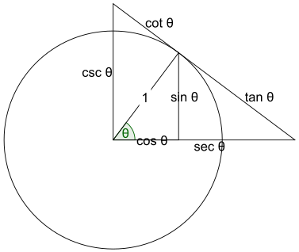
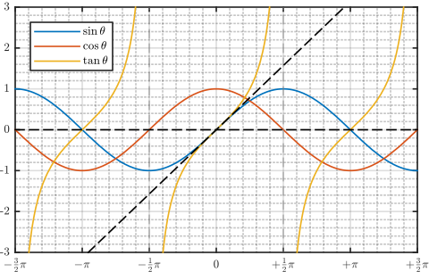
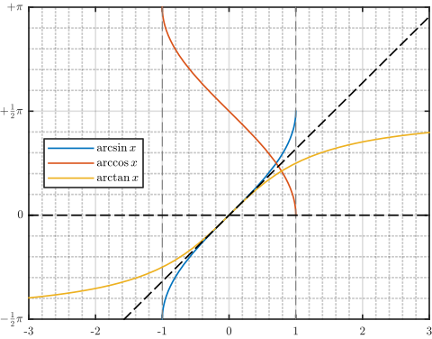
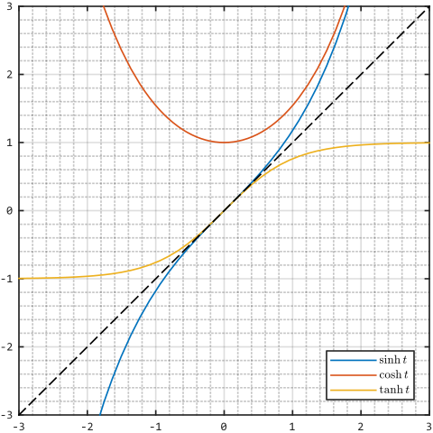

> ### 幂函数 $x^P$

> $$
> \begin{array}{l|l|l}
> \fbox{1} & 0^P = 0                                          & 1^P = 1 \\
> \fbox{2} & (x \cdot y)^P = x^P \cdot y^P \\
> \fbox{3} & \left( \dfrac{x}{y} \right)^P = \dfrac{x^P}{y^P} \\
> \end{array}
> $$
>

> 

> ### 指数函数 $\langle 0 \lt E \ne 1 \rangle^x$

> $$
> \begin{array}{l|l|l}
> \fbox{1} & E^0 = 1                     & E^1 = E \\
> \fbox{2} & E^{x + y} = E^x \cdot E^y   & E^{x - y} = \dfrac{E^x}{E^y} \\
> \fbox{3} & E^{x \cdot y} = (E^x)^y     & E^\frac{x}{y} = \sqrt[y]{E^x} \\
> \fbox{4} & x^{\log_L y} = y^{\log_L x} \\
> \end{array}
> $$
>

> 

> ### 对数函数 $\log_{\langle 0 \lt L \ne 1 \rangle} x$

> $$
> \begin{array}{l|l|l}
> \fbox{1} & \log_L 1 = 0                       & \log_L L = 1                                             & \log_L x = \frac{\log_B x}{\log_B r} \\
> \fbox{2} & \log_L (x y) = \log_L x + \log_L y & \log_L \left( \dfrac{x}{y} \right) = \log_L x - \log_L y \\
> \fbox{3} & \log_L x^y = y \log_L x \\
> \end{array}
> $$
>

> 

> ### 三角函数 $\sin \theta \; \cos \theta \; \tan \theta $

> $$
> \begin{array}{l|l|l|l}
> \fbox{1} & \sin \theta = \dfrac{e^{\imath \theta} - e^{- \imath \theta}}{2} & \cos \theta = \dfrac{e^{\imath \theta} + e^{- \imath \theta}}{2} & \tan \theta = \dfrac{\sin \theta}{\cos \theta} \\
> \fbox{2} & \sin (- \theta) = - \sin \theta                                  & \cos (- \theta) = \cos \theta                                    & \tan (- \theta) = - \tan \theta \\
> \fbox{3} & \sin \theta \cdot \csc \theta = 1                                & \cos \theta \cdot \sec \theta = 1                                & \tan \theta \cdot \cot \theta = 1 \\
> \fbox{4} &  \sin^2 \theta + \cos^2 \theta = 1                               & \tan^2 \theta + 1 = \sec^2 \theta                                & 1 + \cot^2 \theta = \csc^2 \theta \\
> \end{array}
> $$
>

> 

> 

> ### 反三角函数 $\mathop{\rm{arcsin}} x \; \mathop{\rm{arccos}} x \; \mathop{\rm{arctan}} x$

> $$
> \begin{array}{l|l|l|l}
> \fbox{1} & \sin (\arcsin x) = x & \cos (\arccos x) = x & \tan (\arctan x) = x \\
> \end{array}
> $$
>

> 

> ### 双曲函数 $\sinh t \; \cosh t \; \tanh t$

> $$
> \begin{array}{l|l|l|l}
> \fbox{1} & \sinh t = \dfrac{e^t - e^{- t}}{2}     & \cosh t = \dfrac{e^t + e^{- t}}{2}     & \tanh t = \dfrac{\sinh t}{\cosh t} \\
> \fbox{2} & \sinh (- t) = - \sinh t                & \cosh (-t) = \cosh t                   & \tanh (- t) = - \tanh t \\
> \fbox{3} & \sinh t \cdot \mathop{\rm{csch}} t = 1 & \cosh t \cdot \mathop{\rm{sech}} t = 1 & \tanh t \cdot \mathop{\rm{coth}} t = 1 \\
> \fbox{4} & \cosh^2 t - \sinh^2 t = 1              & \coth^2 t - 1 = \mathop{\rm{csch}}^2 t & 1 - \tanh^2 t = \mathop{\rm{sech}}^2 t \\
> \end{array}
> $$
>

> 

> ### 反双曲函数 $\mathop{\rm{arsinh}} x \; \mathop{\rm{arcosh}} x \; \mathop{\rm{artanh}} x$

> $$
> \begin{array}{l|l|l|l}
> \fbox{1} & \mathop{\rm{arsinh}} x = \ln (x + \sqrt{x^2 + 1})                                                  & \mathop{\rm{arcosh}} x = \ln (x + \sqrt{x^2 - 1})                                    & \mathop{\rm{artanh}} x = \dfrac{1}{2} \ln \dfrac{1 + x}{1 - x} \\
> \fbox{2} & \mathop{\rm{arcsch}} x = \ln \left( \dfrac{1}{x} + \dfrac{\sqrt{1 + x^2}}{\lvert x \rvert} \right) & \mathop{\rm{arsech}} x = \ln \left( \dfrac{1}{x} + \dfrac{\sqrt{1 - x^2}}{x} \right) & \mathop{\rm{arcoth}} x = \dfrac{1}{2} \ln \dfrac{1 + x}{1 - x} \\
> \fbox{3} & \sinh (\mathop{\rm{arsinh}} x) = x                                                                 & \cosh (\mathop{\rm{arcosh}} x) = x                                                   & \tanh (\mathop{\rm{artanh}} x) = x \\
> \end{array}
> $$
>

> 