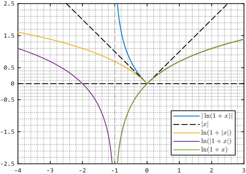

> ### 乘积不等式

> $$
> \begin{alignedat}{3}
> s_n \ge 0 \implies \prod_1^n (1 + s_n) \ge \sum_1^n s_n
> \end{alignedat}
> $$
>

> ### 范数不等式

> $$
> \begin{alignedat}{3}
> & \left\lVert \sum_1^m {^m v_m} \right\rVert \le \sum_1^m \lVert {^m v_m} \rVert \\
> & \left\lvert \sum_1^m {^1 v_m} \right\rvert \mathop{\le}\limits_{\langle {^1 v_m} \lesseqgtr 0 \rangle} \sum_1^m \lvert {^1 v_m} \rvert \\
> & \left| \int_x f (x) \mathrm{d} x \right| \mathop{\le}_{\langle f (x) \lesseqgtr 0 \rangle} \int_x |f (x)| \mathrm{d} x \\
> \end{alignedat}
> $$
>

> ### 复数不等式

> $$
> \begin{alignedat}{3}
> |e^{\imath x} - 1| \le |x|
> \end{alignedat}
> $$
>

> ### 对数不等式

> $$
> \begin{alignedat}{3}
> \fbox{1}\; && \ln (1 + x) \mathop{=}_{\langle -1 \lt x \rangle} \ln (|1 + x|) &\mathop{\le}_{\langle 0 \le x \rangle} \ln (1 + |x|) \mathop{\le}_{\langle 0 \le x \rangle} | \ln (1 + x)| \\
> \fbox{2}\; &&                                                               0 &\mathop{\le}_{\langle 0 = x \rangle} \ln (1 + \lvert x \rvert) \mathop{\le}_{\langle 0 = x \rangle} \lvert x \rvert \\
> \end{alignedat}
> $$
>

> 

> ### 三角不等式

> $$
> \begin{alignedat}{3}
> 0 \le \theta \le \dfrac{\pi}{2} \implies \dfrac{2}{\pi} \theta \mathop{\le}_{\langle \theta = 0, \frac{\pi}{2} \rangle} \sin \theta \mathop{\le}_{\langle \theta = 0 \rangle} \theta \mathop{\le}_{\langle \theta = 0 \rangle} \tan \theta \lt \dfrac{1}{\cos \theta} \\
> \end{alignedat}
> $$
>

> ### 二项式不等式

> $$
> \begin{alignedat}{3}
> \Uparrow\;   && x > - 1 &\implies \left\lbrace\begin{alignedat}{3}
>                                   (1 + x)^r &\mathop{\le}\limits_{\langle x = 0 \rangle} 1 + r x &&\;\Leftarrow\; r &\in [0, 1] \\
>                                   (1 + x)^r &\mathop{\ge}\limits_{\langle x = 0 \rangle} 1 + r x &&\;\Leftarrow\; r &\notin (0, 1) \\
>                                   \end{alignedat}\right. \\
> \Downarrow\; && x > - 1 &\implies \left\lbrace\begin{alignedat}{3}
>                                   (1 + x)^\frac{1}{n} &\mathop{\le}\limits_{\langle x = 0 \rangle} 1 + \dfrac{1}{n} x &&\;\Leftarrow\; n &\in \mathbb{N^+} \\
>                                             (1 + x)^n &\mathop{\ge}\limits_{\langle x = 0 \rangle} 1 + n x            &&\;\Leftarrow\; n &\in \mathbb{N^+} \\
>                                   \end{alignedat}\right. \\
> \end{alignedat}
> $$
>

> ### 凸函数不等式

> $$
> \begin{alignedat}{5}
> \Uparrow\;   && \sum_1^n \langle \lambda_n \gt 0 \rangle = 1 &\implies f \left( \sum_1^n \lambda_n x_n \right) \mathop{\le}\limits_{\langle f' (x) \equiv \mathrm{Const.} \rangle} \sum_1^n \lambda_n f (x_n) \\
> \Downarrow\; &&                                  \mu_n \gt 0 &\implies f \left( \dfrac{\sum\limits_1^n \mu_n x_n}{\sum\limits_1^n \mu_n} \right) \mathop{\le}\limits_{\langle f' (x) \equiv \mathrm{Const.} \rangle} \dfrac{\sum\limits_1^n \mu_n f (x_n)}{\sum\limits_1^n \mu_n} &&\;\Leftarrow\; \lambda_n &= \dfrac{\mu_n}{\sum\limits_1^n \mu_n} \\
> \end{alignedat}
> $$
>

> ### 权均值不等式

> $$
> \begin{alignedat}{3}
> \sum_1^n \langle \lambda_n \gt 0 \rangle = 1 \implies \prod_1^n x_n^{\lambda_n} \mathop{\le}\limits_{\langle x_n \equiv x \rangle} \sum_1^n \lambda_n x_n \\
> \end{alignedat}
> $$
>

> ### 平均值不等式

> $$
> \begin{alignedat}{3}
> x \gt 0 \implies H_n \le G_n \mathop{\le}\limits_{\langle x_n \equiv x \rangle} A_n \le Q_n &&\;\Leftarrow\;
> \left\lbrace\begin{alignedat}{3}
> H_n &= \dfrac{n}{\sum\limits_1^n \dfrac{1}{x_n}}       &&= \dfrac{n}{\dfrac{1}{x_1} + \dfrac{1}{x_2} + \cdots + \dfrac{1}{x_n}} \\
> G_n &= \left( \prod\limits_1^n x_n \right)^\frac{1}{n} &&= \left( x_1 x_2 \cdots x_n \right)^\frac{1}{n} \\
> A_n &= \dfrac{\sum\limits_1^n x_n}{n}                  &&= \dfrac{x_1 + x_2 + \cdots + x_n}{n} \\
> Q_n &= \sqrt{\dfrac{\sum\limits_1^n x_n^2}{n}}         &&= \sqrt{\dfrac{x_1^2 + x_2^2 + \cdots + x_n^2}{n}} \\
> \end{alignedat}\right. \\
> \end{alignedat}
> $$
>

> ### 互补项不等式

> $$
> \begin{alignedat}{3}
> \left\lbrace\begin{aligned}
>                        u, v &\gt 0 \\
> \dfrac{1}{p} + \dfrac{1}{q} &= 1 \\
> \end{aligned}\right. \implies \left\lbrace\begin{alignedat}{3}
>                               u^\frac{1}{p} v^\frac{1}{q} &\mathop{\le}\limits_{\langle u = v \rangle} \dfrac{u}{p} + \dfrac{v}{q} &&\;\Leftarrow\; p &\gt 1  \\
>                               u^\frac{1}{p} v^\frac{1}{q} &\mathop{\ge}\limits_{\langle u = v \rangle} \dfrac{u}{p} + \dfrac{v}{q} &&\;\Leftarrow\; p &\lt 1 \\
>                               \end{alignedat}\right. \\
> \end{alignedat}
> $$
>

> ### 向量积不等式

> $$
> \begin{alignedat}{3}
> \left\lbrace\begin{aligned}
>                    u_n, v_n &\ge 0 \\
> \dfrac{1}{p} + \dfrac{1}{q} &= 1 \\
> \end{aligned}\right. \implies \left\lbrace\begin{alignedat}{3}
>                               \sum_1^n u_n v_n &\mathop{\le}\limits_{\left\langle u_n^p \equiv \lambda v_n^q \right\rangle} \left( \sum_1^n u_n^p \right)^\frac{1}{p} \left( \sum_1^n v_n^q \right)^\frac{1}{q} &&\;\Leftarrow\; p &\gt 1 \\
>                               \sum_1^n u_n v_n &\mathop{\ge}\limits_{\left\langle u_n^p \equiv \lambda v_n^q \right\rangle} \left( \sum_1^n u_n^p \right)^\frac{1}{p} \left( \sum_1^n v_n^q \right)^\frac{1}{q} &&\;\Leftarrow\; p &\lt 1 \\
>                               \end{alignedat}\right.  \\
> \end{alignedat}
> $$
>

> ### 泛距离不等式

> $$
> \begin{alignedat}{3}
> u_n, v_n \ge 0 \implies \left\lbrace\begin{alignedat}{3}
>                         \left[ \sum_1^n (u_n + v_n)^p \right]^\frac{1}{p} &\mathop{\le}\limits_{\langle u_n \equiv \lambda v_n \rangle} \left( \sum_1^n u_n^p \right)^\frac{1}{p} + \left( \sum_1^n v_n^p \right)^\frac{1}{p} &&\;\Leftarrow\; p &> 1 \\
>                         \left[ \sum_1^n (u_n + v_n)^p \right]^\frac{1}{p} &\mathop{\ge}\limits_{\langle u_n \equiv \lambda v_n \rangle} \left( \sum_1^n u_n^p \right)^\frac{1}{p} + \left( \sum_1^n v_n^p \right)^\frac{1}{p} &&\;\Leftarrow\; p &\lt 1 \\
>                         \end{alignedat}\right. \\
> \end{alignedat}
> $$
>

> ### 概率不等式

> $$
> h \in \mathbb{N^+} \implies
> \left\lbrace\begin{alignedat}{3}
> P (|X| \ge \varepsilon) &\le \dfrac{\mathrm{Exp} [|X|]^h}{\varepsilon^h} \\
> P (|X| \lt \varepsilon) &\ge 1 - \dfrac{\mathrm{Var} [|X|]^h}{\varepsilon^h} \\
> \end{alignedat}\right. \\
> $$
>