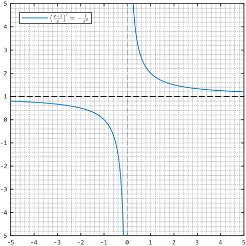
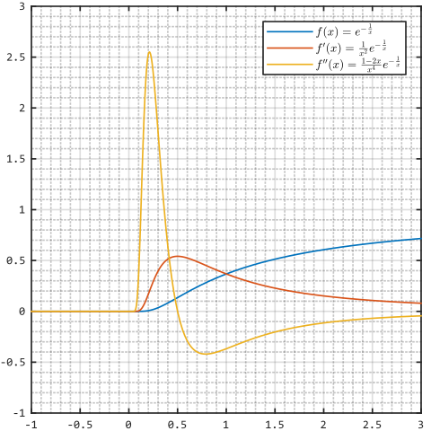
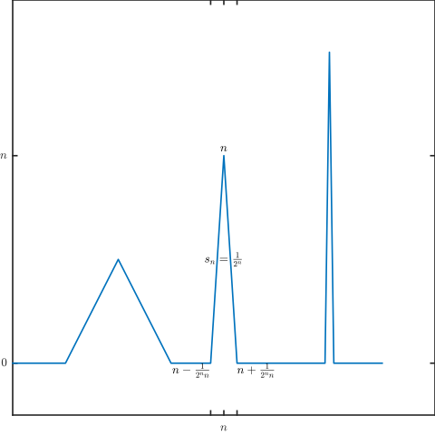

> ### 有瑕点的单调导数

> 

> ### 非一致收敛

> $$
> \begin{alignedat}{3}
> \fbox{1}\; & F_n (x) = x^n                   &&= 1 + \sum_1^n \left[ x^n - x^{n - 1} \right]                                         &&\;\Leftarrow\; x \in (0, 1) \\
> \fbox{2}\; & F_n (x) = n e^{- n x}           &&= 0 + \sum_1^n \left[ n e^{- n x} - (n - 1) e^{- (n - 1) x} \right]                   &&\;\Leftarrow\; x \in (0, 1) \\
> \fbox{3}\; & F_n (x) = e^{- n^2 x^2}         &&= 1 + \sum_1^n \left[ e^{- n^2 x^2} - e^{- (n - 1)^2 x^2} \right]                     &&\;\Leftarrow\; x \in (0, 1) \\
> \fbox{4}\; & F_n (x) = 2 n^2 x e^{- n^2 x^2} &&= 0 + \sum_1^n \left[ 2 n^2 x e^{- n^2 x^2} - 2 (n - 1)^2 x e^{- (n - 1) x^2} \right] &&\;\Leftarrow\; x \in (0, 1) \\
> \end{alignedat}
> $$
>

> ### 绝对收敛且一致收敛非绝对一致收敛

> $$
> \begin{alignedat}{3}
> & \sum_1^n \dfrac{(- 1)^{n - 1}}{n} x^n \;\Leftarrow\; x \in (0, 1) \\
> & \sum_1^n \left\lvert \dfrac{(- 1)^{n - 1}}{n} x^n \right\rvert \to \mathcal{Conv.}; \sum_1^n \dfrac{(- 1)^{n - 1}}{n} x^n \rightrightarrows \mathcal{Conv.}; \sum_1^n \left\lvert \dfrac{(- 1)^{n - 1}}{n} x^n \right\rvert \to \not\rightrightarrows \mathcal{Conv.} \\
> \end{alignedat}
> $$
>

> ### 发散的幂级数展开

> $$
> \begin{alignedat}{3}
> & f (x) = \sum_0^{+\infty} \dfrac{\sin 2^n x}{n !} = \sum_0^{+\infty} \dfrac{(- 1)^l e^{2^{2 l + 1}}}{(2 l + 1) !} x^{2 l + 1} \not\to \mathcal{Conv.} \quad\Leftarrow\quad \dfrac{s_{n + 1}}{s_n} \to +\infty \\
> & f^{(k)} (0) = \sum_0^{+\infty} \dfrac{(2^n)^k \sin \dfrac{k \pi}{2}}{n !} \xlongequal[]{k = 2 l + 1} \sum_0^{+\infty} \dfrac{(- 1)^l (2^{2 l + 1})^n}{n !} = (- 1)^l e^{2^{2 l + 1}} \\
> \end{alignedat}
> $$
>

> ### 非收敛于自身的幂级数展开

> $$
> \begin{alignedat}{3}
>       f (x) &= \left\lbrace\begin{alignedat}{3}
>                & 0                 &&\;\Leftarrow\; x \le 0 \\
>                & e^{- \frac{1}{x}} &&\;\Leftarrow\; x \gt 0 \\
>                \end{alignedat}\right. \\
> f^{(k)} (x) &= \left\lbrace\begin{alignedat}{3}
>                & 0                                                       &&\;\Leftarrow\; x \le 0 \\
>                & e^{- \frac{1}{x}} \cdot P_k \left( \dfrac{1}{x} \right) &&\;\Leftarrow\; x \gt 0 \\
>                \end{alignedat}\right. \\
> f^{(k)} (x) &= 0 \quad\Leftarrow\quad \lim_{0^+} \dfrac{f^{(k)} (x) - 0}{x - 0} \xlongequal{t = \frac{1}{x}} \lim_{+\infty} \dfrac{P_k (t)}{e^t} \to 0 \\
>       f (x) &\ne \sum_0^{+\infty} \dfrac{f^{(k)} (x)}{n !} x^n \\
> \end{alignedat}
> $$
>

> 

> ### 无穷积分被积函数不收敛

> $$
> \begin{alignedat}{3}
> & \left\lbrace\begin{alignedat}{3}
>         p \le 0 \;&\Rightarrow\; \int_\alpha^{+\infty} \dfrac{\sin x}{x^p} \not\to \mathcal{Conv.} \\
>   0 \lt p \le 1 \;&\Rightarrow\; \int_\alpha^{+\infty} \dfrac{\sin x}{x^p} \to \mathcal{Conv.} \;\land\; \int_\alpha^{+\infty} \left\lvert \dfrac{\sin x}{x^p} \right\rvert \not\to \mathcal{Conv.} \\
>         1 \le p \;&\Rightarrow\; \int_\alpha^{+\infty} \left\lvert \dfrac{\sin x}{x^p} \right\rvert \to \mathcal{Conv.} \\
>   \end{alignedat}\right. \\
> & \lim_{+\infty} \sin x^2 \not\to \mathcal{Conv.} \;\land\; \int_\alpha^{+\infty} \sin x^2 \mathrm{d} x \xlongequal{t = x^2} \dfrac{1}{2} \int_{\alpha^2}^{+\infty} \dfrac{\sin t}{t^\frac{1}{2}} \mathrm{d} t \to \mathcal{Conv.} \\
> \end{alignedat}
> $$
>

> ### 正项无穷积分被积函数不收敛

> $$
> \begin{alignedat}{3}
> & f (x) = \left\lbrace\begin{alignedat}{3}
>           & 2^n n^2 \left[ x - \left( n - \dfrac{1}{2^n n} \right) \right] \;&&\Leftarrow\; x \in \left[ n - \dfrac{1}{2^n n}, n \right] \\
>           & 2^n n^2 \left[ \left( n + \dfrac{1}{2^n n} \right) - x \right] \;&&\Leftarrow\; x \in \left[ n, n + \dfrac{1}{2^n n} \right] \\
>           & 0                                                              \;&&\Leftarrow\; x \not\in \left[ n - \dfrac{1}{2^n n}, n + \dfrac{1}{2^n n} \right] \\
>           \end{alignedat}\right. \\
> & f (x) \ge 0 \;\land \; \lim_{+\infty} f (n) = n \to +\infty \\
> & \int_\varepsilon^{+\infty} f (x) \mathrm{d} x = \sum_1^{+\infty} \dfrac{1}{2} \cdot \dfrac{1}{2^{n - 1} n} \cdot n = 1 \\
> \end{alignedat}
> $$
>

> 

> ### 多项式非一致逼近开区间连续函数

> $$
> \begin{alignedat}{3}
> \fbox{1}\; && f (x) = \dfrac{1}{x} \;&\Leftarrow\; x \in (0, \beta] \\
> \fbox{2}\; && f (x) = \dfrac{1}{x} \;&\Leftarrow\; x \in [\alpha, +\infty) \\
> \end{alignedat}
> $$
>