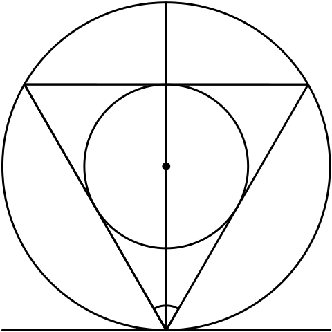

> ### Bertrand悖论

> 

> 在一圆内任取一条弦，问其长度超过该圆内接等边三角形的边长的概率是多少？
>
> 这是一个几何概率问题，它有三种解法，具体如下：
>
> **解法一**  由于对称性，可只考虑某指定的弦。作一条直径垂直于这个方向。显然，只有交直径于 $$1/4$$ 与 $$3/4$$ 之间的弦才能超过正三角形的边长，如此，所求概率为 $$1/2$$ 。
>
> **解法二**  由于对称性，可让弦的一端点固定，让另一端点在圆周上作随机移动。若在固定端点作一切线，则与此切线交角在 $$60^\circ$$ 与 $$120^\circ$$ 之间的弦才能超过正三角形的边长，如此，所求概率为 $$1/3$$ 。
>
> **解法三**  圆内弦的位置被其中点唯一确定。在圆内作一同心圆，其半径仅为大圆半径的一半，则大圆内弦的中点落在小圆内，此弦长才能超过正三角形的边长，如此，所求概率为 $$1/4$$ 。
>
> 同一问题有三种不同答案，究其原因在于圆内”取弦“时规定尚不够具体，不同的”等可能性假定“导致了不同的样本空间，具体如下：其中”均匀分布“应理解为”等可能取点“。
>
> 解法一中假定弦的中点在直径上均匀分布，直径上的点组成样本空间 $$\Omega_1$$。
>
> 解法二中假定弦的另一活动端点在圆周上均匀分布，圆周上的点组成样本空间 $$\Omega_2$$。
>
> 解法三中假定弦的中点在大圆内均匀分布，大圆内的点组成样本空间 $$\Omega_3$$。
>
> 可见，上述三个答案是针对三个不同样本空间引起的，它们都是正确的，Bertrand悖论引起人们注意，在定义概率时要事先明确指出样本空间是什么。

> ——《$\S$ 1.2 概率的定义及其确定方法》
> ——《概率论与数理统计教程(第二版)》茆诗松/程依明/濮晓龙/编著

> ### 依分布收敛

> 设随机变量序列 $\lbrace X_n \rbrace$ 服从如下的退化分布：
>
> $$
> P \left[ X_n = \dfrac{1}{n} \right] = 1 \quad\Leftarrow\quad n = 1, 2, \cdots \\
> $$
>
> 它们的分布函数分别为：
>
> $$
> F_n (x) = \left\lbrace\begin{alignedat}{3}
>           0 &\;\Leftarrow\; x \lt \dfrac{1}{n} \\
>           1 &\;\Leftarrow\; x \ge \dfrac{1}{n} \\
>           \end{alignedat}\right. 
> $$
>
> 首先我们指出：在点点收敛这个要求下，$\lbrace F_n (x) \rbrace$ 的极限函数：
>
> $$
> g (x) = \left\lbrace\begin{alignedat}{3}
>         0 \;\Leftarrow\; x \le 0 \\
>         1 \;\Leftarrow\; x \gt 0 \\
>         \end{alignedat}\right.
> $$
>
> 不满足右连续性，即 $g (x)$ 不是一个分布函数。
>
> 这说明对分布函数序列 $\lbrace F_n (x) \rbrace$ 而言，要求其点点收敛到一个极限分布函数是太苛刻了。如何把点点收敛这要求减弱一些呢？
>
> 因为 $F_n (x)$ 是在点 $x = \dfrac{1}{n}$ 处有跳跃，所以当 $n \to +\infty$ 时，跳跃点位置趋于 $0$，于是我们很自然地认为 $\lbrace F_n (x) \rbrace$ 应该收敛于点 $x = 0$ 处的退化分布，即：
>
> $$
> F (x) = \left\lbrace\begin{alignedat}{3}
> 0 &\;\Leftarrow\; x \lt 0 \\
> 1 &\;\Leftarrow\; x \ge 0 \\
> \end{alignedat}\right.
> $$
>
> 但是，对任意的 $n$，有 $F_n (0) = 0$，而 $F (0) = 1$，所以：
>
> $$
> \lim_{n \to +\infty} F_n (0) = 0 \ne 1 = F (0) 
> $$
>
> 从这个例子我们得到启示：收敛关系不成立的点 $x = 0$ 恰好是 $F (x)$ 的间断点。这就启示我们，可以撇开这些间断点而只考虑 $F (x)$ 的连续点。

> ——《$\S$ 4.1 随机变量序列的两种收敛性》
> ——《概率论与数理统计教程(第二版)》茆诗松/程依明/濮晓龙/编著

> ### 依分布收敛与依概率收敛不等价

> 设随机变量 $X$ 的分布列为：
>
> $$
> P [X = -1] = \dfrac{1}{2}, P [X = 1] = \dfrac{1}{2} 
> $$
>
> 令 $X_n - X$，则 $X_n$ 与 $X$ 同分布，即 $X_n$ 与 $X$ 有相同的分布函数，故 $X_n \mathop{\longrightarrow}\limits^{\mathcal{Weak}} X$。
>
> 但对于任意的 $0 \lt \varepsilon \lt 2$，有：
> 
> $$
> P [|X_n - X| \ge \varepsilon] = P [2 |X| \ge \varepsilon] = 1 \not\to 0
> $$
> 
> 即 $X_n$ 不是依概率收敛于 $X$。
>
> 一般按分布收敛与依概率收敛是不等价的。当极限随机变量为常数（服从退化分布）时，按分布收敛与依分布收敛是等价的。

> ——《$\S$ 4.1 随机变量的两种收敛性》
> ——《概率论与数理统计教程(第二版)》茆诗松/程依明/濮晓龙/编著

> ### 矩母函数不能唯一确定分布函数

> 考察如下分布函数 $F (x)$，其密度函数为：
>
> $$
> p (x) = k e^{- \alpha x^\lambda} \quad\Leftarrow\quad x \in (0, +\infty) 
> $$
>
> 其中 $\alpha >0, 0 < \lambda < \frac{1}{2}$，而常数 $k$ 由正则性条件决定。
>
> 记 $\beta = \alpha \tan \lambda \pi$，考察如下函数
>
> $$
> g (x) = k e^{- \alpha x^\lambda} [1 + \varepsilon \sin (\beta x^\lambda)] \quad\Leftarrow\quad |\varepsilon| < 1, x \in (0, +\infty)
> $$
>
> 显然 $g (x) \ge 0$。为了说明 $g (x)$ 是密度函数，且其 $n$ 阶矩与 $F$ 的 $n$ 阶矩相等，关键是要验证如下等式成立。
>
> $$
> \int_0^{+\infty} x^n e^{- \alpha x^\lambda} \sin \beta x^\lambda \mathrm{d} x = 0 \quad\Leftarrow\quad \forall n \ge 0
> $$
>
> 为此我们利用如下积分等式：对 $p > 0$ 和复数 $q$ 的实部 $\mathrm{Re\;} q > 0$，有：
>
> $$
> \int_0^{+\infty} t^{p - 1} e^{- q t} \mathrm{d} t = \dfrac{\Gamma (p)}{q^p}
> $$
>
> 若在上式中取 $p = \frac{(n + 1)}{\lambda}, q = \alpha + \imath \beta, t = x^\lambda$，则上式可改写为：
>
> $$
> \int_0^{+\infty} x^{\lambda \left( \frac{n + 1}{\lambda} - 1 \right)} e^{- (\alpha + \imath \beta) x^\lambda} \lambda x^{\lambda - 1} \mathrm{d} x = \dfrac{1}{(\alpha + \imath \beta)^{\frac{n + 1}{\lambda}}} \Gamma \left( \dfrac{n + 1}{\lambda} \right) 
> $$
>
> 上式右端的分母为：
>
> $$
> \begin{alignedat}{3}
> (\alpha + \imath \beta)^\frac{n + 1}{\lambda} &= (\alpha + \imath \alpha \tan \lambda \pi)^\frac{n + 1}{\lambda} \\
>                                               &= \alpha^\frac{n + 1}{\lambda} (1 + \imath \tan \lambda \pi)^\frac{n + 1}{\lambda} \\
>                                               &= \alpha^\frac{n + 1}{\lambda} (\cos \lambda \pi)^{- \frac{n + 1}{\lambda}} (\cos \lambda \pi + \imath \sin \lambda \pi)^\frac{n + 1}{\lambda} \\
>                                               &= \alpha^\frac{n + 1}{\lambda} (\cos \lambda \pi)^{- \frac{n + 1}{\lambda}} e^{\imath (n + 1) \pi} \\
>                                               &= \alpha^\frac{n + 1}{\lambda} (\cos \lambda \pi)^{- \frac{n + 1}{\lambda}} [\cos (n + 1) \pi + \imath \sin (n + 1) \pi] \\
>                                               &= \alpha^\frac{n + 1}{\lambda} (\cos \lambda \pi)^{- \frac{n + 1}{\lambda}} \cos (n + 1) \pi \\
> \end{alignedat}
> $$
>
> 其中 $\sin (n + 1) \pi = 0$，最后结果表明：上式右端是实的。
>
> 另一方面，上式左端可化简为：
>
> $$
> \lambda \int_0^{+\infty} x^n e^{- (\alpha + \imath \beta) x^\lambda} \mathrm{d} x = \lambda \int_0^{+\infty} x^n e^{- \alpha x^\lambda} \cos \beta x^\lambda \mathrm{d} x - \imath \lambda \int_0^{+\infty} x^n e^{- \alpha x^\lambda} \sin \beta x^\lambda \mathrm{d} x
> $$
>
> 由于上式右端只有实部，故左端的虚部必为 $0$，这就表明等式成立。故取 $g (x)$ 为分布函数 $G (x)$ 的密度函数，那么 $F$ 与 $G$ 的一切阶矩都相等，但其分布不同。
>
> ——《$\S$ 4.2 特征函数》
> ——《概率论与数理统计教程(第二版)》茆诗松/程依明/濮晓龙/编著

