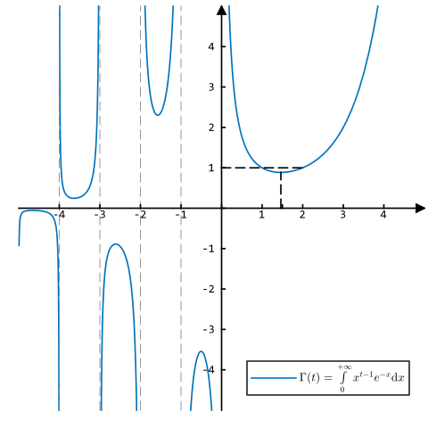

> ### 误差函数

> $$
> \begin{alignedat}{3}
>                           \mathrm{Err_{or}} (x) &= \dfrac{1}{\sqrt{\pi}} \int_{- x}^x e^{- x^2} \mathrm{d} x \\
>                                                 &= \dfrac{2}{\sqrt{\pi}} \int_0^x e^{- x^2} \mathrm{d} x \\
>                                        \Phi (u) &= \dfrac{1}{2} \left[ 1 + \mathrm{Err} \left( \dfrac{u}{\sqrt{2}} \right) \right] \\
> \mathrm{Err} \left( \dfrac{u}{\sqrt{2}} \right) &= 2 \Phi (u) - 1 \\
> \end{alignedat}
> $$
>

> ### $\Gamma (\langle u > 0 \rangle)$ 函数

> $$
> \begin{alignedat}{3}
> \fbox{1}\quad & \Gamma (u) = \int_0^{+\infty} x^{u - 1} e^{- x} \mathrm{d} x \\
> \fbox{2}\quad & \Gamma (u) = \lim_{+\infty} \dfrac{n^u \cdot n !}{\prod\limits_0^n (u + n)} \\
> \fbox{3}\quad & \Gamma (u) = \dfrac{1}{u} \prod_1^{+\infty} \dfrac{\left( 1 + \dfrac{1}{n} \right)^u}{1 + \dfrac{u}{n}} \\
> \end{alignedat}
> $$
>

> 

> ### $\Gamma$ 函数的唯一性

> $$
> \begin{alignedat}{3}
> \fbox{1}\quad & \Gamma (u) \ge 0, \Gamma (1) = 1 \\
> \fbox{2}\quad & \Gamma (u + 1) = u \Gamma (u) \\
> \fbox{3}\quad & \ln \Gamma \left( \dfrac{u_p}{p} + \dfrac{u_q}{q} \right) \le \dfrac{1}{p} \ln \Gamma (u_p) + \dfrac{1}{q} \ln \Gamma (u_q) &&\quad\Leftarrow\quad \dfrac{1}{p} + \dfrac{1}{q} = 1 \\
> \end{alignedat}
> $$
>

> ### $\Gamma$ 函数的性质

> $$
> \begin{alignedat}{3}
> \fbox{1}\quad & \Gamma (u + 1) = \prod_0^n (u - n) \cdot \Gamma (u - n)                                                           &&\quad\Rightarrow\quad \Gamma (n + 1) = n ! \\
> \fbox{2}\quad & \Gamma (u + 1) = \sqrt{2 \pi u} \left( \dfrac{u}{e} \right)^u e^{\frac{\langle 0 < \theta (u) < 1 \rangle}{12 u}} \\
> \fbox{2}\quad & \Gamma (u) \cdot \Gamma (1 - u) = \dfrac{\pi}{\sin (u \pi)}                                                       &&\quad\Rightarrow\quad \Gamma \left( \dfrac{1}{2} \right) = \sqrt{\pi} \\
> \fbox{3}\quad & \Gamma (2 u) = \dfrac{2^{2 u - 1}}{\sqrt{\pi}} \Gamma \left( u + \dfrac{1}{2} \right) \Gamma (u) \\
> \end{alignedat}
> $$
>

> ### $\Beta (\langle u > 0, v > 0 \rangle)$ 函数

> $$
> \begin{alignedat}{3}
> \fbox{1}\quad & \Beta (u, v) = \int_0^1 x^{u - 1} (1 - x)^{v - 1} \mathrm{d} x \\
> \fbox{2}\quad & \Beta (u, v) = \dfrac{\Gamma (u) \cdot \Gamma (v)}{\Gamma (u + v)} \\
> \fbox{3}\quad & \Beta (u, v) \xlongequal{y = \frac{x}{1 - x}} \int_0^{+\infty} \dfrac{y^{u - 1}}{(1 + y)^{u + v}} \mathrm{d} y \\
> \fbox{4}\quad & \Beta (u, v) \xlongequal{z = \frac{1}{y}} \int_0^1 \dfrac{y^{u - 1} + y^{v - 1}}{(1 + y)^{u + v}} \mathrm{d} y \\
> \fbox{5}\quad & \Beta (u, v) \xlongequal{x = \sin^2 \theta} 2 \int_0^\frac{\pi}{2} \sin^{2 u - 1} \theta \cos^{2 v - 1} \theta \mathrm{d} \theta \\
> \fbox{6}\quad & \Beta (u, v) \xlongequal{x = \cos^2 \theta} 2 \int_0^\frac{\pi}{2} \cos ^{2 u - 1} \theta \sin^{2 v - 1} \theta \mathrm{d} \theta \\
> \end{alignedat}
> $$
>

> ### $\Beta$ 函数的性质

> $$
> \begin{alignedat}{3}
> \fbox{1}\quad & \Beta (1, v) = \dfrac{1}{v} \\
> \fbox{2}\quad & \Beta (u, v) = \Beta (v, u) \\
> \fbox{3}\quad & \Beta (u, u) \xlongequal{\frac{1}{2} - x = \frac{1}{2} \sqrt{y}} \dfrac{1}{2^{2 u - 1}} \Beta \left( \dfrac{1}{2}, u \right) \\
> \fbox{4}\quad & \Beta (u, 1 - u) = \dfrac{\pi}{\sin \pi u}  \\
> \fbox{5}\quad & \Beta (u, v + 1) = \dfrac{v}{u + v} \Beta (u, v) \\
> \fbox{6}\quad & \Beta (u, n) = \dfrac{(n - 1) !}{\prod\limits_1^{n} (u + n - 1)} \\
> \fbox{7}\quad & \Beta (u + 1, v + 1) = \dfrac{u \cdot v}{(u + v + 1) \cdot (u + v)} \Beta (u, v) \\
> \end{alignedat}
> $$
>

> ### $\Rho$ 函数

> $$
> \begin{alignedat}{3}
> \Rho (p, q, m, n) &= \sum_{i = m}^n \dfrac{n !}{i ! (n - i) !} p^i (q - p)^{n - i} \\
>                   &= \dfrac{n !}{(m - 1) ! (n - m) !} \int_0^p t^{m - 1} \cdot (q - t)^{n - m} \mathrm{d} t \\
>                   &= \dfrac{n !}{m ! (n - m) !} + \dfrac{n !}{m ! (n - m - 1) !} \int_0^p t^m \cdot (q - t)^{n - m - 1} \mathrm{d} t \\
> \end{alignedat}
> $$
>

> ### $\Rho$ 函数的性质

> $$
> \begin{alignedat}{3}
> \fbox{1}\quad & \Rho (1, 1, m, n) = 1 \\
> \fbox{2}\quad & \Rho (p, q, n, n) = p^n \\
> \fbox{3}\quad & \Rho (p, q, m, n) = \dfrac{1}{\Beta (m, n - m + 1)} \int_0^p t^{m - 1} \cdot (q - t)^{n - m} \mathrm{d} t \\
> \end{alignedat}
> $$
>
