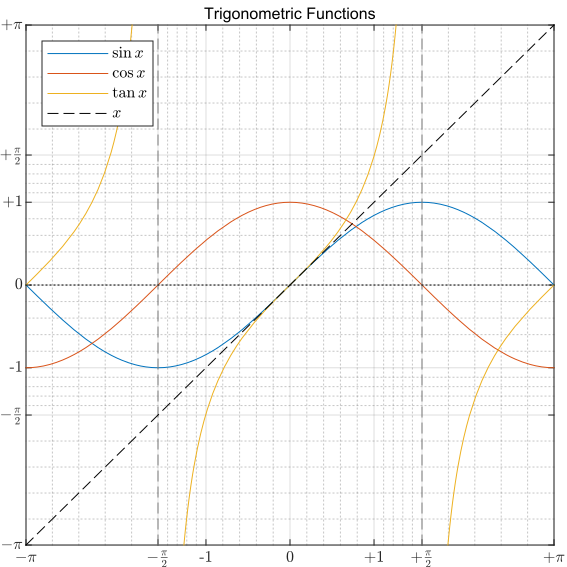
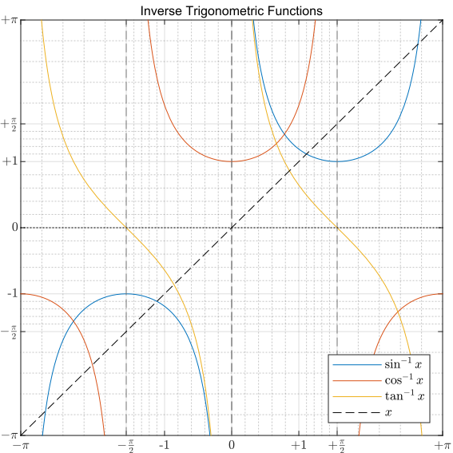
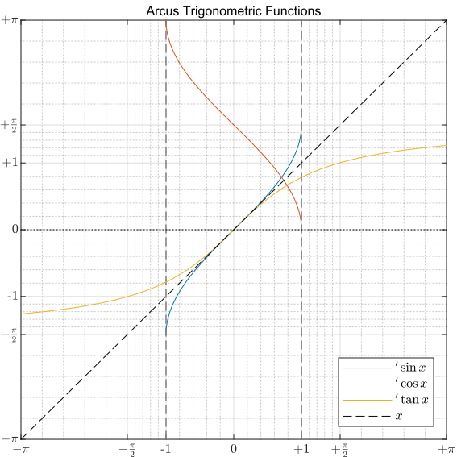
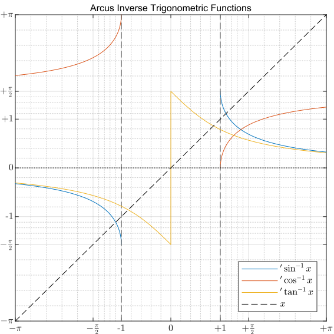
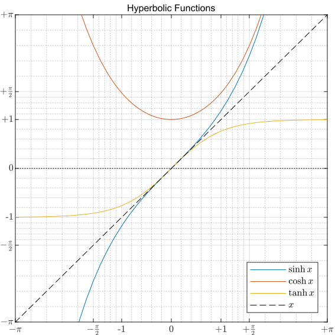
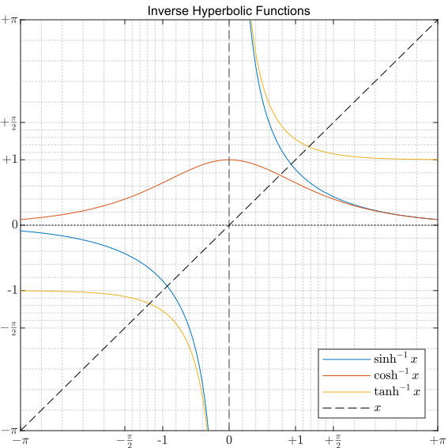
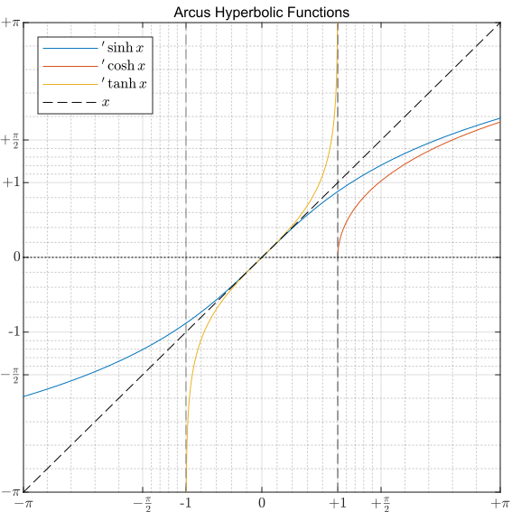
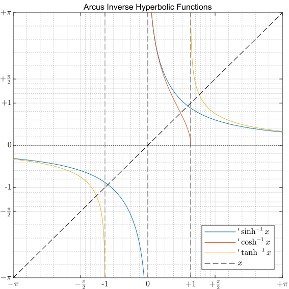

### 三角符号

| $\sin$                       | sine                 |      | $'\sin ≡ \arcsin$                                     | arcus sine                 |
| :--------------------------- | :------------------- | :--- | :---------------------------------------------------- | :------------------------- |
| $\cos$                       | cosine               |      | $'\cos ≡ \arccos$                                     | arcus cosine               |
| $\tan$                       | tangent              |      | $'\tan ≡ \arctan$                                     | arcus tangent              |
| $\tan^{-1} ≡ \cot$           | cotangent            |      | ${'}\tan^{-1} ≡ {'}\cot ≡ \mathrm{arccot}$            | arcus cotangent            |
| $\cos^{-1} ≡ \sec$           | secant               |      | ${'}\cos^{-1} ≡ {'}\sec ≡ \mathrm{arcsec}$            | arcus secant               |
| $\sin^{-1} ≡ \csc$           | cosecant             |      | ${'}\sin^{-1} ≡ {'}\csc ≡ \mathrm{arccsc}$            | arcus cosecant             |
|                              |                      |      |                                                       |                            |
| $\sinh$                      | hyperbolic sine      |      | $'\sinh ≡ \mathrm{arcsinh}$                           | arcus hyperbolic sine      |
| $\cosh$                      | hyperbolic cosine    |      | $'\cosh ≡ \mathrm{arccosh}$                           | arcus hyperbolic cosine    |
| $\tanh$                      | hyperbolic tangent   |      | $'\tanh ≡ \mathrm{arctanh}$                           | arcus hyperbolic tangent   |
| $\tanh^{-1} ≡ \mathrm{coth}$ | hyperbolic cotangent |      | ${'}\tanh^{-1} ≡ {'}\coth ≡ \mathrm{arccoth}$         | arcus hyperbolic cotangent |
| $\cosh^{-1} ≡ \mathrm{sech}$ | hyperbolic secant    |      | ${'}\cosh^{-1} ≡ {'}\mathrm{sech} ≡ \mathrm{arcsech}$ | arcus hyperbolic secant    |
| $\sinh^{-1} ≡ \mathrm{csch}$ | hyperbolic cosecant  |      | ${'}\sinh^{-1} ≡ {'}\mathrm{csch} ≡ \mathrm{arccsch}$ | arcus hyperbolic cosecant  |

典例：半径为$R$的圆，其面积$S$可视作该圆内接正$n$边形的面积$S_n$的极限值。

$S = \lim\limits_{n⇝∞^{+}} S_n = \lim\limits_{n⇝∞^{+}} \left[ n · \dfrac{1}{2} · R · R · \sin \dfrac{2 · π}{n} \right] = \lim\limits_{n⇝∞^{+}} π · R^2 · \dfrac{\sin \frac{2 · π}{n}}{\frac{2 · π}{n}} ⇝ π · R^2$

### 复数公式

| $\cos 0 = 1$                                                 | $\sin 0 = 0$                                                 |
| :----------------------------------------------------------- | :----------------------------------------------------------- |
| $\cosh x = \sum\limits_{i=0}^{∞^{+}} \dfrac{1}{(2 · i)!} · x^{2 · i}$ | $\sinh x = \sum\limits_{i=0}^{∞^{+}} \dfrac{1}{(2 · i + 1)!} · x^{2 · i + 1}$ |
| $ә^{x} = \cosh x + \sinh x$                                  | $ә^{x} = \sum\limits_{i=0}^{∞^{+}} \dfrac{1}{i!} · x^i = \sum\limits_{i=0}^{∞^{+}} \dfrac{1}{(2 · i)!} · x^{2 · i} + \sum\limits_{i=0}^{∞^{+}} \dfrac{1}{(2 · i + 1)!} · x^{2 · i + 1}$ |
|                                                              |                                                              |
| $\cosh 0 = 1$                                                | $\sinh 0 = 0$                                                |
| $\cos x = \sum\limits_{i=0}^{∞^{+}} \dfrac{(-1)^i}{(2 · i)!} · x^{2 · i}$ | $\sin x = \sum\limits_{i=0}^{∞^{+}} \dfrac{(-1)^{i}}{(2 · i + 1)!} · x^{2 · i + 1}$ |
| $ә^{τ·x} = \cos x + τ · \sin x$                              | $ә^{τ·x} = \sum\limits_{i=0}^{∞^{+}} \dfrac{τ^{i}}{i!} · x^i = \sum\limits_{i=0}^{∞^{+}} \dfrac{(-1)^i}{(2 · i)!} · x^{2 · i} + τ · \sum\limits_{i=0}^{∞^{+}} \dfrac{(-1)^{i}}{(2 · i + 1)!} · x^{2 · i + 1}$ |
| $ә^{+τ·k·π} = (-1)^k$                                        | $ә^{+τ·(k·π+\frac{π}{2})} = (-1)^{k} · τ$                    |

### 三角函数

| $\sin x = \dfrac{ә^{τ·x} - ә^{-τ·x}}{2 · τ}$                 | $\sin x = -τ · \sinh (τ · x)$           | $\sin (-x) = -\sin x$             |         $\mathop{2·k·π}\limits_{(-π,+π)}^{[-1,+1]}$          | $'\sin x = -τ · \ln\left( τ · x + \sqrt{1 - x^2} \right)$    | $\mathop{=====}\limits_{[-1,+1]}^{[-\frac{π}{2},+\frac{π}{2}]}$ |
| :----------------------------------------------------------- | :-------------------------------------- | :-------------------------------- | :----------------------------------------------------------: | :----------------------------------------------------------- | :----------------------------------------------------------: |
| $\cos x = \dfrac{ә^{τ·x} + ә^{-τ·x}}{2}$                     | $\cos x = \cosh (τ · x)$                | $\cos (-x) = +\cos x$             |         $\mathop{2·k·π}\limits_{(-π,+π)}^{[-1,+1]}$          | $'\cos x = -τ · \ln\left( x + \sqrt{x^2 - 1} \right)$        |    $\mathop{====}\limits_{[-1,+1]}^{\left[+0,+π \right]}$    |
| $\tan x = \dfrac{\sin x}{\cos x} = \dfrac{1}{τ} · \dfrac{ә^{2·τ·x} - 1}{ә^{2·τ·x} + 1}$ | $\tan x = -τ · \tanh (τ · x)$           | $\tan (-x) = -\tan x$             | $\mathop{k·π}\limits_{(-\frac{π}{2},+\frac{π}{2})}^{(∞^{-},∞^{+})}$ | $'\tan x = \dfrac{τ}{2} · \ln \dfrac{1 - τ · x}{1 + τ · x}$  | $\mathop{=====}\limits_{(∞^{-},∞^{+})}^{(-\frac{π}{2},+\frac{π}{2})}$ |
| $\tan^{-1} x = \dfrac{\cos x}{\sin x} = τ · \dfrac{ә^{2·τ·x} + 1}{ә^{2·τ·x} - 1}$ | $\tan^{-1} x = -τ · \tanh^{-1} (τ · x)$ | $\tan^{-1} (-x) = -\tan^{-1} x$   |        $\mathop{k·π}\limits_{(0,+π)}^{(∞^{-},∞^{+})}$        | ${'}\tan^{-1} x \mathop{====}\limits^{\left.'\tan y\right|_{x^{-1}}} \dfrac{τ}{2} · \ln \dfrac{x - τ}{x + τ}$ | $\mathop{====}\limits_{(∞^{-},0^{-})}^{(-\frac{π}{2},0^{-})};\mathop{====}\limits_{(0^{+},∞^{+})}^{(0^{+},+\frac{π}{2})}$ |
| $\cos^{-1} x = \dfrac{2}{ә^{τ·x} + ә^{-τ·x}}$                | $\cos^{-1} x = \cosh^{-1} (τ · x)$      | $\cos^{-1} (-x) = +\cos^{-1} x$   | $\mathop{2·k·π}\limits_{(-\frac{π}{2},+\frac{π}{2})}^{[+1,∞^{+})};\mathop{2·k·π}\limits_{(+\frac{π}{2},\frac{3·π}{2})}^{(∞^{-},-1]}$ | ${'}\cos^{-1} x \mathop{====}\limits^{\left.'\cos y\right|_{x^{-1}}} -τ · \ln \dfrac{1 + \sqrt{1 - x^2}}{x}$ | $\mathop{====}\limits_{(∞^{-},-1]}^{(+\frac{π}{2},+π]};\mathop{====}\limits_{[+1,∞^{+})}^{[+0,+\frac{π}{2})}$ |
| $\sin^{-1} x = \dfrac{2 · τ}{ә^{τ·x} - ә^{-τ·x}}$            | $\sin^{-1} x = +τ · \sin^{-1} (τ · x)$  | $\sin^{-1} (-x) = -\sin^{-1} x$   | $\mathop{2·k·π}\limits_{(-π,0)}^{(∞^{-},-1]};\mathop{2·k·π}\limits_{(0,+π)}^{[+1,∞^{+}]}$ | ${'}\sin^{-1} x \mathop{====}\limits^{\left.'\sin y\right|_{x^{-1}}} -τ · \ln \dfrac{τ + \sqrt{x^2 - 1}}{x}$ | $\mathop{====}\limits_{(∞^{-},-1]}^{(0^{-},-\frac{π}{2}]};\mathop{====}\limits_{[+1,∞^{+})}^{[+\frac{π}{2},0^{+})}$ |
|                                                              |                                         |                                   |                                                              |                                                              |                                                              |
| $\sinh x = \dfrac{ә^{x} - ә^{-x}}{2}$                        | $\sinh x = -τ · \sin (τ · x)$           | $\sinh (-x) = -\sinh x$           |    $\mathop{====}\limits_{(∞^{-},∞^{+})}^{(∞^{-},∞^{+})}$    | $'\sinh x = \ln\left( x + \sqrt{1 + x^2} \right)$            |    $\mathop{====}\limits_{(∞^{-},∞^{+})}^{(∞^{-},∞^{+})}$    |
| $\cosh x = \dfrac{ә^{x} + ә^{-x}}{2}$                        | $\cosh x = \cos (τ · x)$                | $\cosh (-x) = +\cosh x$           |     $\mathop{====}\limits_{(∞^{-},∞^{+})}^{[+1,∞^{+})}$      | $'\cosh x = \ln\left( x + \sqrt{x^2 - 1} \right)$            |       $\mathop{====}\limits_{[+1,∞^{+})}^{[+0,∞^{+})}$       |
| $\tanh x = \dfrac{\sinh x}{\cosh x} = \dfrac{ә^{2·x} - 1}{ә^{2·x} + 1}$ | $\tanh x = -τ · \tan (τ · x)$           | $\tanh (-x) = -\tanh x$           |       $\mathop{====}\limits_{(∞^{-},∞^{+})}^{(-1,+1)}$       | $'\tanh x = \dfrac{1}{2} · \ln \dfrac{1 + x}{1 - x}$         |       $\mathop{====}\limits_{(-1,+1)}^{(∞^{-},∞^{+})}$       |
| $\tanh^{-1} x = \dfrac{\cosh x}{\sinh x} = \dfrac{ә^{2·x} + 1}{ә^{2·x} - 1}$ | $\tanh^{-1} x = -τ · \tan^{-1} (τ · x)$ | $\tanh^{-1} (-x) = -\tanh^{-1} x$ | $\mathop{====}\limits_{(∞^{-},0^{-})}^{(∞^{-},-1)};\mathop{====}\limits_{(0^{+},∞^{+})}^{(+1,∞^{+})}$ | ${'}\tanh^{-1} x \mathop{=====}\limits^{\left.'\tanh y\right|_{x^{-1}}} \dfrac{1}{2} · \ln \dfrac{x + 1}{x - 1}$ | $\mathop{====}\limits_{(∞^{-},-1)}^{(∞^{-},0^{-})};\mathop{====}\limits_{(+1,∞^{+})}^{(0^{+},∞^{+})}$ |
| $\cosh^{-1} x = \dfrac{2}{ә^{x} + ә^{-x}}$                   | $\cosh^{-1} x = \cos^{-1} (τ · x)$      | $\cosh^{-1} (-x) = +\cosh^{-1} x$ |     $\mathop{====}\limits_{(∞^{-},∞^{+})}^{(0^{+},+1]}$      | ${'}\cosh^{-1} x \mathop{=====}\limits^{\left.'\cosh y\right|_{x^{-1}}} \ln \dfrac{1 + \sqrt{1 - x^2}}{x}$ |       $\mathop{====}\limits_{(0^{-},+1]}^{[0,∞^{+})}$        |
| $\sinh^{-1} x = \dfrac{2}{ә^{x} - ә^{-x}}$                   | $\sinh^{-1} x = +τ · \sin^{-1} (τ · x)$ | $\sinh^{-1} (-x) = -\sinh^{-1} x$ | $\mathop{====}\limits_{(∞^{-},0^{-})}^{(∞^{-},0^{-})};\mathop{====}\limits_{(0^{+},∞^{+})}^{(0^{+},∞^{+})}$ | ${'}\sinh^{-1} x \mathop{=====}\limits^{\left.'\sinh y\right|_{x^{-1}}} \ln \dfrac{1 + \sqrt{x^2 + 1}}{x}$ | $\mathop{====}\limits_{(∞^{-},0^{-})}^{(∞^{-},0^{-})};\mathop{====}\limits_{(0^{+},∞^{+})}^{(0^{+},∞^{+})}$ |

| $\sin (π - x) = +\sin x$           | $\sin \left( \frac{π}{2} - x \right) = \cos x$           | $\sin \left( x + \frac{π}{2} \right) = +\cos x$           | $\sin (x + π) = -\sin x$           | $\sin (x + 2 · k · π) = \sin x$           |
| :--------------------------------- | :------------------------------------------------------- | :-------------------------------------------------------- | :--------------------------------- | :---------------------------------------- |
| $\cos (π - x) = -\cos x$           | $\cos \left( \frac{π}{2} - x \right) = \sin x$           | $\cos \left( x + \frac{π}{2} \right) = -\sin x$           | $\cos (x + π) = -\cos x$           | $\cos (x + 2 · k · π) = \cos x$           |
| $\tan (π - x) = +\tan x$           | $\tan \left( \frac{π}{2} - x \right) = \tan^{-1} x$      | $\tan \left(x + \frac{π}{2} \right) = -\tan^{-1} x$       | $\tan (x + π) = +\tan x$           | $\tan (x + 1 · k · π) = \tan x$           |
| $\sin^{-1} (π - x) = +\sin^{-1} x$ | $\sin^{-1} \left( \frac{π}{2} - x \right) = \cos^{-1} x$ | $\sin^{-1} \left( x + \frac{π}{2} \right) = +\cos^{-1} x$ | $\sin^{-1} (x + π) = -\sin^{-1} x$ | $\sin^{-1} (x + 2 · k · π) = \sin^{-1} x$ |
| $\cos^{-1} (π - x) = -\cos^{-1} x$ | $\cos^{-1} \left( \frac{π}{2} - x \right) = \sin^{-1} x$ | $\cos^{-1} \left( x + \frac{π}{2} \right) = -\sin^{-1} x$ | $\cos^{-1} (x + π) = -\cos^{-1} x$ | $\cos^{-1} (x + 2 · k · π) = \cos^{-1} x$ |
| $\tan^{-1} (π - x) = +\tan^{-1} x$ | $\tan^{-1} \left( \frac{π}{2} - x \right) = \tan x$      | $\tan^{-1} \left( x + \frac{π}{2} \right) = -\tan x$      | $\tan^{-1} (x + π) = +\tan^{-1} x$ | $\tan^{-1} (x + 1 · k · π) = \tan^{-1} x$ |

### 和角公式

| $ә^{τ·(x+y)} = [\cos x + τ · \sin x] · [\cos y + τ · \sin y]$ | $\cos(2 · x) = 1 - 2 · \sin^2 x$                             | $\sin^{-2} x = \tan^{-2} x + 1$                              | $\cos(x + y) ·\cos(x - y) = \cos^2 x · \cos^2 y - \sin^2 x · \sin^2 y$ |
| :----------------------------------------------------------- | :----------------------------------------------------------- | ------------------------------------------------------------ | :----------------------------------------------------------- |
| $ә^{τ·(x-y)} = [\cos x - τ · \sin x] · [\cos y - τ · \sin y]$ | $\cos(2 · x) = = 2 · \cos^2 x - 1$                           | $\cos^{-2} x = 1 + \tan^2 x$                                 | $\sin(x + y) · \sin(x - y) = \sin^2 x · \cos^2 y - \cos^2 x · \sin^2 y$ |
| $\cos (x + y) = \cos x · \cos y - \sin x · \sin y$           | $\cos (2 · x) = \cos^2 x - \sin^2 x$                         | $\cos x · \cos y = \dfrac{\cos(x - y) + \cos(x + y)}{2}$     | $\cos x + \cos y \mathop{===}\limits_{α+β=y}^{α-β=x} 2 · \cos \dfrac{x + y}{2} · \cos \dfrac{y - x}{2}$ |
| $\cos (x - y) = \cos x · \cos y + \sin x · \sin y$           | $1 = \cos^2 x + \sin^2 x$                                    | $\sin x · \sin y = \dfrac{\cos(x - y) - \cos(x + y)}{2}$     | $\cos x - \cos y \mathop{===}\limits_{α+β=y}^{α-β=x} 2 · \sin \dfrac{x + y}{2} · \sin \dfrac{y - x}{2}$ |
| $\sin (x + y) = \sin x · \cos y + \cos x · \sin y$           | $\sin (2 · x) = 2 · \sin x · \cos x$                         | $\sin x · \cos y = \dfrac{\sin(x + y) + \sin(x - y)}{2}$     | $\sin x + \sin y \mathop{===}\limits_{α-β=y}^{α+β=x} 2 · \sin \dfrac{x + y}{2} · \cos \dfrac{x - y}{2}$ |
| $\sin (x - y) = \sin x · \cos y - \cos x · \sin y$           |                                                              | $\cos x · \sin y = \dfrac{\sin(x + y) - \sin(x- y)}{2}$      | $\sin x - \sin y \mathop{===}\limits_{α-β=y}^{α+β=x} 2 · \cos \dfrac{x + y}{2} · \sin \dfrac{x - y}{2}$ |
| $\tan (x + y) \mathop{====}\limits_{\cos(x+y)}^{\sin(x+y)} \dfrac{\tan x + \tan y}{1 - \tan x · \tan y}$ | $\tan (2 · x) = \dfrac{2 · \tan x}{1 - \tan^2 x}$            |                                                              | $\tan x + \tan y = \dfrac{\sin(x + y)}{\cos x · \cos y}$     |
| $\tan (x - y) \mathop{====}\limits_{\cos(x-y)}^{\sin(x-y)} \dfrac{\tan x - \tan y}{1 + \tan x · \tan y}$ | $\sin(2 · x) \mathop{===}\limits_{\cos^{-2} x}^{2·\tan x} \dfrac{2 · \tan x}{1 + \tan^2 x}$ | $\cos(2 · x) \mathop{====}\limits_{\cos^{-2} x}^{1-\tan^2 x} \dfrac{1 - \tan^2 x}{1 + \tan^2 x}$ | $\tan x - \tan y = \dfrac{\sin(x - y)}{\cos x · \cos y}$     |
|                                                              |                                                              |                                                              |                                                              |
| $\cos (τ · x) = \cosh x$                                     | $\cosh(2 · x) = 1 + 2 · \sinh^2 x$                           | $\sinh^{-2} x = \tanh^{-2} x - 1$                            | $\cosh(x + y)·\cosh(x - y) = \cosh^2 x · \cosh^2 y - \sinh^2 x · \sinh^2 y$ |
| $\sin (τ · x) = τ · \sinh x$                                 | $\cosh(2 · x) = 2 · \cosh^2 x - 1$                           | $\cosh^{-2} x = 1 - \tanh^2 x$                               | $\sinh(x + y) · \sinh(x - y) = \sinh^2 x · \cosh^2 y - \cosh^2 x · \sinh^2 y$ |
| $\cosh (x + y) = \cosh x · \cosh y + \sinh x · \sinh y$      | $\cosh (2 · x) = \cosh^2 x + \sinh^2 x$                      | $\cosh x · \cosh y = \dfrac{\cosh(x + y) + \cosh(x - y)}{2}$ | $\cosh x + \cosh y \mathop{===}\limits_{α-β=y}^{α+β=x} 2 · \cosh \dfrac{x + y}{2} · \cosh \dfrac{x - y}{2}$ |
| $\cosh (x - y) = \cosh x · \cosh y - \sinh x · \sinh y$      | $1 = \cosh^2 x - \sinh^2 x$                                  | $\sinh x · \sinh y = \dfrac{\cosh(x + y) - \cosh(x - y)}{2}$ | $\cosh x - \cosh y \mathop{===}\limits_{α-β=y}^{α+β=x} 2 · \sinh \dfrac{x + y}{2} · \sinh \dfrac{x - y}{2}$ |
| $\sinh (x + y) = \sinh x · \cosh y + \cosh x · \sinh y$      | $\sinh (2 · x) = 2 · \sinh x · \cosh x$                      | $\sinh x · \cosh y = \dfrac{\sinh(x + y) + \sinh(x - y)}{2}$ | $\sinh x + \sinh y \mathop{===}\limits_{α-β=y}^{α+β=x} 2 · \sinh \dfrac{x + y}{2} · \cosh \dfrac{x - y}{2}$ |
| $\sinh (x - y) = \sinh x · \cosh y - \cosh x · \sinh y$      |                                                              | $\cosh x · \sinh y = \dfrac{\sinh(x + y) - \sinh(x - y)}{2}$ | $\sinh x - \sinh y \mathop{===}\limits_{α-β=y}^{α+β=x} 2 · \cosh \dfrac{x + y}{2} · \sinh \dfrac{x - y}{2}$ |
| $\tanh(x + y) \mathop{====}\limits_{\cosh(x+y)}^{\sinh(x+y)} \dfrac{\tanh x + \tanh y}{1 + \tanh x · \tanh y}$ | $\tanh (2 · x) = \dfrac{2 · \tanh x}{1 + \tanh^2 x}$         |                                                              | $\tanh x + \tanh y = \dfrac{\sinh(x + y)}{\cosh x · \cosh y}$ |
| $\tanh (x - y) \mathop{====}\limits_{\cosh(x-y)}^{\sinh(x-y)} \dfrac{\tanh x - \tanh y}{1 - \tanh x · \tanh y}$ | $\sinh(2 · x) \mathop{====}\limits_{\cosh^{-2} x}^{2·\tanh x} \dfrac{2 · \tanh x}{1 - \tanh^2 x}$ | $\cosh(2 · x) \mathop{====}\limits_{\cosh^{-2} x}^{1+\tanh^2 x} \dfrac{1+\tanh^2 x}{1 - \tanh^2 x}$ | $\tanh x - \tanh y = \dfrac{\sinh(x - y)}{\cosh x · \cosh y}$ |

### 辐角公式

| $A · \sin x + B · \cos x = \sqrt{A^2 + B^2} · \left[ \dfrac{A}{\sqrt{A^2 + B^2}} · \sin x + \dfrac{B}{\sqrt{A^2 + B^2}} · \cos x \right] \mathop{=======}\limits_{\cosφ=\frac{B}{\sqrt{A^2+B^2}}}^{\sinφ=\frac{A}{\sqrt{A^2 + B^2}}} \sqrt{A^2 + B^2} · \sin\left( x + \arctan \dfrac{B}{A} \right)$ |
| :----------------------------------------------------------- |
| $A · \sin x + B · \cos x = \sqrt{A^2 + B^2} · \left[ \dfrac{A}{\sqrt{A^2 + B^2}} · \sin x + \dfrac{B}{\sqrt{A^2 + B^2}} · \cos x \right] \mathop{=======}\limits_{\cosφ=\frac{B}{\sqrt{A^2+B^2}}}^{\sinφ=\frac{A}{\sqrt{A^2+B^2}}} \sqrt{A^2 + B^2} · \cos\left( x - \arctan \dfrac{A}{B} \right)$ |

### 三角公式

|                         |                    | $\sin θ$                                        | $\cos θ$                                         | $\tan θ$                                        |
| :---------------------- | :----------------- | :---------------------------------------------- | :----------------------------------------------- | :---------------------------------------------- |
| $\sin θ = x$            | $θ = '\sin x$      | $\sin('\sin x) = x$                             | $\cos('\sin x) = \sqrt{1 - x^2}$                 | $\tan('\sin x) = \dfrac{x}{\sqrt{1 - x^2}}$     |
| $\cos θ = x$            | $θ = '\cos x$      | $\sin('\cos x) = \sqrt{1 - x^2}$                | $\cos('\cos x) = x$                              | $\tan('\cos x) = \dfrac{\sqrt{1 - x^2}}{x}$     |
| $\tan θ = x$            | $θ = '\tan x$      | $\sin('\tan x) = \dfrac{x}{\sqrt{1 + x^2}}$     | $\cos('\tan x) = \dfrac{1}{\sqrt{1 + x^2}}$      | $\tan('\tan x) = x$                             |
| $\sin θ = \dfrac{1}{x}$ | $θ = '\sin^{-1} x$ | $\sin('\sin^{-1} x) = \dfrac{1}{x}$             | $\cos('\sin^{-1} x) = \dfrac{\sqrt{x^2 - 1}}{x}$ | $\tan('\sin^{-1} x) = \dfrac{1}{\sqrt{x^2 -1}}$ |
| $\cos θ = \dfrac{1}{x}$ | $θ = '\cos^{-1} x$ | $\sin(\cos^{-1} x) = \dfrac{\sqrt{x^2 - 1}}{x}$ | $\cos(\cos^{-1} x) = \dfrac{1}{x}$               | $\tan(\cos^{-1} x) = \sqrt{x^2 - 1}$            |
| $\tan θ = \dfrac{1}{x}$ | $θ = '\tan^{-1} x$ | $\sin(\tan^{-1} x) = \dfrac{1}{\sqrt{x^2 + 1}}$ | $\cos(\tan^{-1} x) = \dfrac{x}{\sqrt{x^2 + 1}}$  | $\tan(\tan^{-1} x) = \dfrac{1}{x}$              |

### 反角公式

| $\tan \dfrac{π}{4} = 1$ | $\tan \left(\dfrac{π}{4} + y \right) = \dfrac{1 + \tan y}{1 - \tan y}$ | $\dfrac{π}{4} + {'}\tan x \mathop{====}\limits^{y={'}\tan x} {'}\tan \dfrac{1 + x}{1 - x}$ |
| :---------------------- | :----------------------------------------------------------- | :----------------------------------------------------------- |
|                         |                                                              |                                                              |
|                         |                                                              |                                                              |

