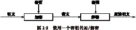
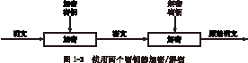

### 去中心化网络的共识问题

——摘录自《链接未来：迎接区块链与数字资产的新时代》ISBN:978-7-111-58684-5，许子敬/程剑波/魏久胜/常浩

**信息传播中的“拜占庭”难题**

互联网实现了信息点对点传播，即“去中心化”传播。但是去中心化却存在两个致命的问题，一是一致性问题，二是正确性问题。这就是著名的“拜占庭难题”。

什么是“拜占庭难题”？

我们都知道，过去的信息传递一直都是中心化的。例如，军队会有总指挥部，所有的信息都由总指挥部发出，再层层下达。那么，假如没有这个总指挥部呢？也就是说，假如信息传递是去中心化的呢？会变成什么样子？于是就有了著名的“拜占庭难题”。“拜占庭难题”并不是真实发生的历史事件，它只是科学家的一个假设。具体是这样的：

想象一下，在拜占庭时代有一个强大的城邦，它拥有巨大的财富，它的周围有10个城邦，它们都觊觎拜占庭的财富，想要侵略并占领它。

它们各自组织了一支军队，这10支军队之间彼此独立、各自为营，且各自派出一个联络员互相联系。在这种情况下，“中心”是不存在的，信息传递可以在任意两支军队之间进行。也就是说，此时的信息传递是“点对点的”。

假设这10支军队必须同时进攻才有胜算，那么要做到同时进攻，就必须确保所有的“点对点”信息传递都是正确无误的。但是这一点在实际操作中很难。因为在战争中，要做到信息同步几乎不可能，而且存在“他们当中有叛徒，故意传递错误信息”的可能。

这就是信息传递中的“拜占庭难题”。简单地说，“拜占庭难题”指的就是去中心化信息传播中的“同步”和“互信”难题。

我们进一步往深处探讨一下“拜占庭难题”：

很显然，这10支军队是一个由不互相信任的各方构成的网络，是一个去中心化的网络，但它们又必须一起努力完成共同的使命。它们之间唯一的联络方式就是信使。

如果每个城邦向其他9个城邦派出1名信使，那么就是10个城邦每个派出了9名信使，也就是说在任何一个时间有总计90次的传输，并且每个城邦分别收到9个信使，可能每一个信息都传达着不同的进攻时间。

假设这当中有几个城邦故意同时答应几个不同的进攻时间，或者它们重新向网络发起新的信息，都可能造成攻击时间上的混乱。

现在这个网络里是10个人，那么假如是20个呢，30个呢？我们稍加计算就可以发现：随着人数的增加，达成共识的希望会变得越来越渺茫。

把上面例子中的城邦换成计算机网络中的节点，把信使换成节点之间的通信，把进攻时间换成需要达成共识的信息，我们就可以理解“去中心化传播中的共识问题”是一个怎样的难题了。

达成共识对于信息传播的重要性不言而喻。例如，我们在一个去中心化（没有第三方做信用背书）的网络里交易，核实的时候系统告诉你“关于你的上一笔交易情况，我们的系统里有三个版本的记录”，那么这个系统显然是不可信的。在区块链出现之前，去中心化的共识问题是很难被完美解决的，要保证达成共识就必须采取中心化的系统。例如，两个不认识的人在网络上交易，A付了钱，B不承认，说自己没收到，A几乎是一点办法也没有的。在淘宝上交易，因为有了第三方——支付宝的存在，有支付宝做信用背书，交易才能顺利进行。所以我们会发现，在区块链出现之前，我们绝大多数商业行为都是去中心化的系统。

--------------------------------------------------------------------------------

### 区块链的共识机制

——摘录自《链接未来：迎接区块链与数字资产的新时代》ISBN:978-7-111-58684-5，许子敬/程剑波/魏久胜/常浩

***区块链的共识机制***

区块链系统会选取记账最快、最好的那个节点，以这个节点的账目为准，并发送备份给所有节点。那么，系统是凭什么来认定最快、最好的节点的？最快、最好的标准是什么？其他节点为什么会同意某个节点的记账？人人都参与记账，那么如何保证他们的账目都是正确的？会不会有些节点出于私利伪造或者篡改信息，会不会有节点恶意搞破坏？靠什么来保证节点数据的一致性和正确性？换句话说，靠什么达成共识？这就涉及区块链的共识机制。

**去中心化的共识难题**

在一个中心化的系统里，因为有权威化的中心存在，要达成共识是很容易的。例如，A跟B借10万元钱，传统的操作方式是双方去公证处公证，或者请一个颇具权威的中间人来进行担保。这样，想赖账就不可能了。

那么，在一个去中心化的系统里，没有权威中心的存在，没有公证人，没有担保公司，也没有中间人，A如果借了B的10万元钱，最后不承认不还钱怎么办？

为了方便大家对去中心化的理解，依然以刚才的借贷为例，我们来建一个最简单的去中心化模型。

如果A借了B有10万元钱，他们既不找公证，也不找中间人，其操作方法是：A在人群中喊一声，“我是A，我找B借了10万元钱！”B也公开承认，“我是B，我借了10万元钱给A！”此时整个系统里的人都听到了这个消息，大家各自在账本上记下“A找B借了10万元钱”。需要指出的是：在这个系统中，所有人都能收到A的信息，却并不知道其他人的存在。

这就是一个去中心化的系统，我们会发现，在这个系统中不需要公证，不需要证明人，甚至连借贷协议都不需要，也不需要人与人长久的信任关系。倘若A赖账，系统里的其他人就会翻出账本：ⅩⅩ时间，A找B借了10万元钱。

看起来是不是很简单？去中心化的记账是一个公开透明的系统，完全不需要第三方监督或者证明。但是，这当中存在两个致命的问题：

（1）由于是点对点的沟通，系统中有那么多人，他们都能接收到A的信息，但是所有节点之间却并不认识，也无法交流，如何能够保证所有人的记账都是同步的呢？

（2）假如有的人没有听清楚，把账记错了，或者包庇A，故意做假账，怎么办？

一个账本中，假如出现时间和账目不一致的情况，那它就是无效的。例如，上述例子中，C记载的是“A找B借了10万元钱”，D记载的是“A找B借了1万元钱”，后面记的账更是五花八门。那么这个账本就无效了，B完全可以赖账。

这就是去中心化系统所面临的两大难题：同步性问题和一致性问题。

同步和一致，在过去的技术下是做不到的。因为是点对点的通信，双方不可能在这种情况下达到信息的一致性。严谨一点，就是“在分布式计算上，试图在异步系统和不可靠的通信上达到一致性是不可能的”。

**比特币的共识机制：工作量证明**

区块链是靠什么达成共识的呢？这就是我们要讲的区块链共识机制。

区块链的共识机制，最为知名的就是PoW，即工作量证明，这是比特币系统中运用的共识机制。

*算力竞争*

迄今为止，人类社会最接近“去中心化”的就是市场经济，完全靠“背后看不见的手”在调节，这个背后看不见的手是供求关系，也就是竞争。

区块链的算力竞争有点类似于市场经济，靠和个人私利密切相关的机制去调节。

什么是算力竞争呢？

区块链系统中的每一台计算机都参与记账，但如果有节点出于私利篡改数据，造成不同节点的账目不一致该怎么办呢？以哪个节点记的账为准？

区块链是通过算力竞争来达成共识的。

所谓的算力竞争，就是以每个节点的计算能力（“算力”）来竞争记账的一种机制。在区块链系统中，大约每10分钟进行一轮算力竞争，竞争的胜利者获得一次记账的权利，即在区块链这个总账本中加入一个新区块的权利。如此周而复始，不断增加新的区块，也就是说。只有竞争的胜利者才能真正参与一轮记账并向其他节点同步更新账目信息。

*工作量证明*

工作量证明是算力竞争的延续，在算力竞争中，如何判定某个节点在一轮记账中获胜呢？其依据就是工作量证明。

什么是工作量证明呢？

工作量证明（proof of work, PoW），简单理解就是一份证明，用来确认你做过的一定量的工作。

我们都知道，监测工作的整个过程通常是极为低效的，而检测结果要高效得多。例如，要想知道一个学生是否每分每秒都在认真学习很难，但可以用毕业证来验证他的努力程度。现实生活中得各类证件，都是通过检验结果的方式（各类考试）所取得的证明。

工作量证明的原理，跟这个有点相似。

工作量证明系统（或者说协议、函数），是一种应对拒绝服务攻击和其他服务滥用的对策。它要求发起者进行一定量的运算，也就意味着需要消耗计算机一定的时间。

工作量证明系统主要特征是客户端需要做一定难度的工作得出一个结果，验证方却很容易通过结果来检查出客户端是不是做了相应的工作。

*不利原理*

生物学上有一个原理叫作不利原理（the handicap principle），该原理可以帮助我们解释工作量证明的过程。这个原理说，当两只动物有合作的动机时，为了打消对方的疑虑，它们向对方表达友好时必须附上自己的代价，使得自己背叛对方时不得不付出昂贵的代价。

区块链是一个去中心化的系统，也就是说它没有第三方监督。在这种情况下，每个节点都会存在潜在的道德问题，达成共识就会变得很困难。工作量证明和生物学中的“不利原理”有点类似，可以理解为：在这个系统中，如果你认真工作，你的账本被系统认可和接受，系统会对你的贡献给予一定的奖励；而如果你的记账被系统认为是不合格的，将会失去奖励。

*共识机制与比特币的诞生*

在工作量证明中，我们提到了奖励。而在中本聪的设计里，最初的奖励就是比特币。

如何理解？

区块链是一个去中心化的自治系统。正如我们前面所举的那个借贷的例子：A找B借了10万元钱，在区块链系统中，由于没有中心的存在，A向所有节点广播“我借了B的10万元钱”，然后系统所有节点都记下这笔帐，通过这样的方式来完成“公证”。

区块链是让所有节点参与记账，但是，这中间存在一个问题，记账是需要成本的，节点凭什么要这么做呢？没有奖励，节点就没有参与的动力。

同时，还存在下列问题：

（1）节点处理事务的能力不同，网络节点数据的吞吐量有差异。

（2）节点间通信的信道可能不安全。

（3）可能会有做恶节点出现。

那么，要如何解决这些问题呢？

在中本聪的设计里，每轮竞争胜出并完成记账的节点将获得系统给予的一定数量的比特币奖励，这个奖励的过程也是比特币的发行过程。

准确点讲，系统发放的奖励包含两部分：一部分是区块所包含交易的手续费，这部分不属于比特币的发行过程；另一部分是新币奖励，每四年减半，这是比特币的发行过程。目前所获得的奖励以新币奖励为主。

在这个系统下，为了获得系统发放的比特币，节点不停地进行计算和竞争，同时不断地有新区块产生。这个过程很像现实生活中挖矿的过程，因此获得比特币的过程被人们形象地称为“挖矿”。

我们可以看出：在这个系统中，每个节点只需要根据自身利益行事，出于“私利”的目的进行竞争，为了在“工作量证明”中获胜以得到比特币，不得不保持诚实。

这就是比特币的共识机制，比特币借助区块链打造了一个正向的循环系统。

**PoW的缺陷以及其他共识机制**

工作量证明使得区块链系统在没有中心的情况下也能达成共识，但是对工作量证明也有一些批判，一个常见的指责就是“浪费能源”，因为节点计算需要耗电，挖矿亦成为能源密集型产业。

出于对消耗能源的担忧，也有科学家在探索和实现新的共识机制。

*PoS（proof of stake）：权益证明机制*

一个典型的共识机制就是权益证明机制，以节点持有币的数量和实践来选择记账权。

如果把PoW理解为“干得越多，收获越多”，那么PoS就是“持有越多，获得越多”。

它的优点是：相对于PoW，一定程度上减少了数学运算带来的资源消耗。同时，它根据每个节点所持有的数字货币的比例和时间，等比例地降低挖矿难度，从而加快了寻找随机数的速度，在一定程度上缩短了共识达成的时间。

它的缺点是：还是需要挖矿，且所有的确认都只是一个概率上的表达，而不是一个确定性的事情，理论上有可能存在其他攻击影响。例如，以太坊的DAO攻击事件造成以太坊硬分叉。

*DPoS：股份授权证明机制*

它类似于董事会投票，持币者投出一定数量的节点，代理其进行验证和记账。它与PoS原理相同，只是选了一些“代表”。与PoS的主要区别在于节点选举若干代理人，由代理人验证和记账。

该模式可以每30秒钟产生一个新区块，并且在正常的网络条件下区块链分叉的可能性极其小，即使发生也可以在几分钟内得到解决。

其缺点是必须是在该区块链系统有一定影响力的人才有资格获得记账的权利。

还有燃烧证明、沉淀证明等。

不过，这些并没有从本质上达到节省能源的目的，当前工作量证明仍然是最可靠和最有效的去中心化共识机制。

--------------------------------------------------------------------------------

### 对称密钥与非对称密钥

——摘录自《应用密码学：协议、算法与C源程序（第2版）》ISBN:978-7-111-44533-3，Bruce Schneier

*算法和密钥*

~~~~~~~~~~~~~~~~~~~~~~~~~~~~~~~~~~~~~~~~~~~~~~~~~~~~~~~~~~~~~~~~~~~~~~~~~~~~~~~~
密码算法（cryptographic algorithm）也叫做密码（cipher），是用于加密和解密的数学函数（通常情况下，有两个相关的函数：一个用作加密，另一个用作解密。

如果算法的保密性是基于保持算法的秘密，这种算法称为受限制的（restricted）算法。受限制的算法具有历史意义，但按现在的标准，它们的保密性已远远不够。大的或经常变换的用户组织不能使用它们，因为如果有一个用户离开这个组织，其他的用户就必须改换另外不同的算法。如果有人无意泄露了这个秘密，所有人都必须改变他们的算法。

更糟的是，受限制的密码算法不可能进行质量控制或标准化。每个用户组织必须有他们自己的唯一算法。这样的组织不可能采用流行的硬件或软件产品，因为窃听者可以买到这些流行产品并学习算法，于是用户不得不自己编写算法并予以实现，如果这个组织中没有好的密码学家，那么他们就无法知道他们是否拥有安全的算法。

尽管有这些主要缺陷，但受限制的算法对低密级的应用来说还是很流行的，用户或者没有认识到或者不在乎他们系统中存在的问题。

现代密码学用密钥（key）解决了这个问题，密钥用K表示。K可以是很多数值里的任意值。密钥K的可能取值范围叫做密钥空间（keyspace）。加密和解密运算都使用这个密钥（即运算都依赖于密钥，并用K作为下标表示），这样，加/解密函数现在变成：

E_K(M) = C
D_K(C) = M

这些函数具有下面的特性：

D_K(E_K(M)) = M

有些算法使用不同的加密密钥，也就是说，加密密钥K_1与相应的解密密钥K_2不同，在这种情况下：

E_{K_1}(M) = C
D_{K_2}(C) = M
D_{K_2}(E_{K_1}(M)) = M

所有这些算法的安全性都基于密钥的安全性，而不是基于算法细节的安全性。这就意味着算法可以公开，可以分析。可以大量生产使用算法的产品。即使偷听者知道你的算法也没有关系。如果他不知道你使用的具体密钥，他就不可能阅读你的消息。

密码系统（crytosystem）由算法以及所有可能的明文、密文和密钥组成。
~~~~~~~~~~~~~~~~~~~~~~~~~~~~~~~~~~~~~~~~~~~~~~~~~~~~~~~~~~~~~~~~~~~~~~~~~~~~~~~~

*对称算法*

~~~~~~~~~~~~~~~~~~~~~~~~~~~~~~~~~~~~~~~~~~~~~~~~~~~~~~~~~~~~~~~~~~~~~~~~~~~~~~~~
基于密钥的算法通常有两类：对称算法和公开密钥算法。对称算法（symmetric algorithm）有时又叫做传统密码算法，就是加密密钥能够从解密密钥中推算出来，反过来也成立。在大多数对称算法中，加密/解密密钥是相同的。这些算法也叫做秘密密钥算法或单密钥算法，它要求发送者和接收者在安全通信之前，商定一个密钥。对称算法的安全性依赖于密钥，泄露密钥就意味着任何人都能对消息进行加/解密。只要通信需要保密，密钥就必须保密。

对称算法的加密和解密表示为：

E_K(M) = C
D_K(C) = M

对称算法可分为两类。一次只对明文中的单个位（有时对字节）运算的算法称为序列算法（stream algorithm）或序列密码（stream cipher）。另一类算法是对明文的一组位进行运算，这些位组称为分组（block），相应的算法称为分组算法（block algorithm）或分组密钥（block cipher）。现代计算机密码算法的典型分组长度为64位——这个长度达到足以防止分析破译，但又小到足以方便使用（在计算机出现前，算法普遍地每次只对明文的一个字符运算，可以认为序列密码是对序列字符的运算）。
~~~~~~~~~~~~~~~~~~~~~~~~~~~~~~~~~~~~~~~~~~~~~~~~~~~~~~~~~~~~~~~~~~~~~~~~~~~~~~~~

*公开密钥算法*

~~~~~~~~~~~~~~~~~~~~~~~~~~~~~~~~~~~~~~~~~~~~~~~~~~~~~~~~~~~~~~~~~~~~~~~~~~~~~~~~
公开密钥算法（public-key algorithm，也叫做非对称算法）是这样设计的：用作加密的密钥不同于用作解密的密钥，而且解密密钥不能根据加密计算出来（至少在合理假定的长时间内）。之所以叫做“公开密钥”算法，是因为加密密钥能够公开，即陌生者能用加密密钥加密信息，但只有用相应的解密密钥才能解密信息。在这些系统中，加密密钥叫做公开密钥（public-key，简称公钥），解密密钥叫做私人密钥（private-key，简称私钥）。私人密钥有时也叫秘密密钥。为了避免与对称算法混淆，此处不用秘密密钥这个名字。

用公开密钥K加密可表示为

E_K(M) = C

虽然公开密钥和私人密钥不同，但用相应的私人密钥解密可表示为：

D_K(C) = M

有时消息用私人密钥加密而用公开密钥解密，这用于数字签名。尽管可能产生混淆，但这些运算可分别表示为：

E_K(M) = C
D_K(C) = M
~~~~~~~~~~~~~~~~~~~~~~~~~~~~~~~~~~~~~~~~~~~~~~~~~~~~~~~~~~~~~~~~~~~~~~~~~~~~~~~~

*使用对称密码系统通信*

通信双方怎样安全地通信呢？当然，他们可以对通信加密。完整的协议比它更复杂，让我们来看看当Alice发送加密的消息给Bob时会发生什么情况。

（1）Alice和Bob协商用同一个密码系统。
（2）Alice和Bob协商同一个密钥。
（3）Alice用加密算法和选取的密钥加密她的明文消息，得到了密文消息。
（4）Alice发送密文消息给Bob。
（5）Bob用同样的算法和密钥解密密文，然后读它。

位于Alice和Bob之间的窃听者Eve监听这个协议，她能做什么呢？如果她听到的是在第（4）步中发送的密文，她必须设法分析密文，这是唯密文的被动攻击法。有很多算法能够阻止Eve，使她不可能得到问题的解答。

尽管如此，但Eve却不笨，她也想窃听第（1）步和第（2）步，这样她就知道了算法和密钥，她就和Bob知道的一样多。当第（4）步中的消息通过信道传送过来时，她所做的全部工作就是解密密文消息。

好的密码系统的全部安全性只与密钥有关，与算法没有任何关系。这就是为什么密钥管理在密码学中如此重要的原因。有了对称算法，Alice和Bob能够公开地实现第（1）步，但必须秘密地完成第（2）步。在协议执行前、执行过程中和执行后，只要消息必须保持秘密，密钥就必须保持秘密；否则，消息就将不再秘密了。（公开密钥密码学用另一种方法解决了这个问题）。

主动攻击者Mallory可能做其他一些事情，他可能企图破坏在第（4）步中使用的通信信道，使Alice和Bob根本不可能通信。他也可能截取Alice的消息并用他自己的消息替代它。如果他也知道密钥（通过截取第（2）步的通信或者破译密码系统），他可能加密自己的消息，然后发送给Bob，用来代替截取的消息。Bob没有办法知道接收到的消息不是来自Alice。如果Mallory不知道密钥，他所产生的代替消息，被解密出来是无意义的，Bob就会认为网络或者Alice有严重的问题。

总之，对称密码算法存在下面的问题：

（1）密钥必须秘密地分配。它们比任何加密的消息更有价值，因为知道了密钥就意味着知道了所有消息。对于遍及世界的加密系统，这可能是令人沮丧的任务，需经常派信使将密钥传递到目的地。
（2）如果密钥被泄露了（被偷窃、猜出来、被逼迫交出来、受贿等），那么Eve就能用该密钥去解密所有传送的消息，也能够假装是协议中的一方，产生虚假消息去愚弄另一方。
（3）假设网络中每对用户使用不同的密钥。那么密钥的总数随着用户数的增加迅速增加。n个用户的网络需要n(n-1)/2个密钥。例如，10个用户互相通信需要45个不同的密钥，100个用户需要4950个不同的密钥。这个问题可以通过将用户数量控制在较小数目来减轻，但这并不总是可能的。

*使用公开密钥密码系统通信*

对称算法可看成保险柜，密钥就是保险柜的号码组合。知道号码组合的人能够打开保险柜，放入文件，再关闭它。持有号码组合的其他人可以打开保险柜，取出文件。而不知道保险柜号码组合的就必须摸索打开保险柜的方法。

1976年，Whitfield Diffie和Martin Hellman永远改变了密码学的范例（NSA宣称早在1966年就有了这种概念的知识，但没有提供证据），他们提出了公开密钥密码学（public-key crytography）。他们使用两个不同的密钥：一个是公开的，另一个是秘密的。只有持有私人密钥的人才能解密。就好像有人把密码保存柜变成一个信箱，把邮件投进信箱相当于用公开密钥加密，任何人都可以做，只要打开窗口是，把它投进去。取出邮件相当于用私人密钥解密。一般情况下，打开它很难，你需要焊接机和火把。但如果你拥有私人密钥（开信箱的钥匙），就很容易从信箱中取出邮件。

从数学上来说，这个过程基于前面讨论过的单向陷门函数。加密很容易，加密指令就是公开密钥，任何人都能加密消息。解密非常困难，以至于如果不知道这个秘密，即使用Cray计算机和数百万年的时间都不能解开这个消息。这个秘密或陷门就是私人密钥。持有这个秘密，解密就和加密一样容易。

下面描述Alice怎样使用公开密钥密码发送消息给Bob：

（1）Alice和Bob选用一个公开密钥密码系统。
（2）Bob将他的公开密钥传送给Alice。
（3）Alice用Bob的公开密钥加密她的消息，然后传送给Bob。
（4）Bob用他的私人密钥解密Alice的消息。

注意公开密钥密码是怎样解决对称密码系统的密钥管理问题的。在对称密码系统中，Alice和Bob不得不选取同一密钥。Alice能够随机选取一个，但她不得不把选取的密钥传给Bob。她可能事先交给Bob，但那样做需要有先见之明。她也可以通过秘密信使把密钥送给Bob，但那样做太费时间。采用公开密钥密码，就很容易了，不用事先安排，Alice就能把消息安全地发送给Bob。整个交换过程一直都在窃听的Eve，即使有Bob的公开密钥和用公开密钥加密的消息，但却不能恢复Bob的私人密钥或者传送的消息。

更一般地说，网络中的用户约定一个公开密钥密码系统，每个用户有自己的公开密钥和私人密钥，并且公开密钥在某些地方的数据库中都是公开的，现在这个协议就更容易了：

（1）Alice从数据库中得到Bob的公开密钥。
（2）Alice用Bob的公开密钥加密消息，然后送给Bob。
（3）Bob用自己的私人密钥解密Alice发送的消息。

在第一个协议中，在Alice给Bob发送消息前，Bob必须将他的公开密钥传送给Alice；而第二个协议更像传统的邮件方式，直到Bob想读他的消息时，他才与协议有牵连。

### 哈希函数

——摘录自《应用密码学：协议、算法与C源程序（第2版）》ISBN:978-7-111-44533-3，Bruce Schneier

*单向散列函数*

单向散列函数（one-way hash function）有很多名字：压缩函数、收缩函数、消息摘要、指纹、密码校验和、信息完整性检验（Message Integrity Check, MIC）、操作检验码（Manipulation Detection Code, MDC）。不管你怎么叫，它都是现代密码学的中心。单向散列函数是许多协议的另一个结构模块。

散列函数长期以来一直在计算机科学中使用，无论从数学或其他角度看，散列函数就是把可变长度输入串（叫做预映射, pre-image）转换成固定长度（经常更短）输出串（叫做散列值, hash value）的一种函数。简单的散列函数就是对预映射的处理，并且返回由所有的输入字节异或组成的字节。

这里的关键就是采集预映射的指纹：产生一个值，这个值能够指出候选预映射与真实的预映射是否有相同的值。因为散列函数是典型的多到一的函数，所以不能用它来确定两个串一定相同，但可用它来得到准确性的合理保证。

单向散列函数是在一个方向上运算的散列函数，从预映射的值很容易计算其散列值，但要使其散列值等于一个特殊值却很难。前面提到的散列函数不是单向函数：已知一个特殊的字节值，要产生一个字节串使它的异或结果等于那个值是很容易的事情。用单向散列函数你不可能那样做。好的散列函数也是无冲突的（collision-free）：难于产生两个预映射的值，使它们的散列值相同。

散列函数是公开的，对处理过程不用保密。单向散列函数的安全性是它的单向性。其输出不依赖于输入。平均而言，预映射值单个位的改变，将引起散列值中一半位的改变。已知一个散列值，要找到预映射的值，使它的散列值等于已知的散列值在计算上是不可行的。

可把单向散列函数看做是构成指纹文件的一种方法。如果你想验证某人持有特定的文件（你同时也持有该文件），但你不想让他将文件传给你，那么就要求他将该文件的单向散列值传送给你。如果他传送的散列值是正确的，那么几乎可以肯定地说他持有那份文件。

### 数字签名

——摘录自《链接未来：迎接区块链与数字资产的新时代》ISBN:978-7-111-58684-5，许子敬/程剑波/魏久胜/常浩

**数字签名**

在文件上手写签名长期以来被用作作者身份的证明，或至少同意文件的内容。签名为什么会如此引人注目呢？

（1）签名是可信的。签名使文件的接收者相信签名者是慎重地在文件上签字的。
（2）签名不可伪造。签名证明是签字者而不是其他人慎重地在文件上签字。
（3）签名不可重用。签名是文件的一部分，不法之徒不可能将签名移到不同的文件上。
（4）签名的文件是不可改变的。在文件签名后，文件不能改变。
（5）签名是不可抵赖的。签名和文件是物理的东西。签名者事后不能声称他没有签过名。

在现实生活中，关于签名的这些陈述没有一个是完全真实的。签名能够被伪造，签名能够从一篇文章盗用移到另一篇文章中，文件在签名后能够被改变。然而，我们之所以愿意与这些问题纠缠在一起，是因为欺骗是困难的，并且还要冒被发现的危险。

我们或许愿意在计算机上做这种事情，但还存在一些问题。首先计算机文件易于复制，即使某人的签名难以伪造（例如，手写签名的图形），但是从一个文件到另一个文件剪裁和粘贴有效的签名都是很容易的。这种签名并没有什么意义；其次文件在签名后也易于修改，并且不会留下任何修改的痕迹。

*使用对称密码系统和仲裁者对文件签名*

~~~~~~~~~~~~~~~~~~~~~~~~~~~~~~~~~~~~~~~~~~~~~~~~~~~~~~~~~~~~~~~~~~~~~~~~~~~~~~~~
Alice想对数字消息签名，并送给Bob。在Trent和对称密码系统的帮助下，她能做到。

Trent是一个有权的、值得依赖的仲裁者。他能同时与Alice和Bob（也可以是其他相对数据文件签名的任何人）通信。他和Alice共享秘密密钥K_A，和Bob共享另一个不同的秘密密钥K_B。这些密钥在协议开始前就早已建好，并且为了多次签名可多次重复使用。

（1）Alice用K_A加密她准备发送给Bob的消息，并把它传给Trent。
（2）Trent用K_A解密消息。
（3）Trent把这个解密消息和他收到Alice消息的声明，一起用K_B加密。
（4）Trent把加密的消息包发送给Bob。
（5）Bob用K_B解密消息包，他就能读Alice所发的消息和Trent的证书，证明消息来自Alice。

Trent怎么知道消息是从Alice而不是从其他冒名顶替者那里来的呢？从消息的加密推断出来。由于只有他和Alice共享他们两人的秘密密钥，所以只有Alice能用这个密钥加密消息。

这和纸质签名一样好吗？来看我们需要的特点：

（1）这个签名是可信的。Trent是可信的仲裁者，并且知道消息是从Alice那里来的，Trent的证书对Bob起着证明的作用。
（2）这个签名是不可伪造的。只有Alice（和Trent，但每个人都相信他）知道K_A，因此只有Alice才能把用K_A加密的消息传给Trent。如果有人冒充Alice，Trent在第（2）步马上就会察觉，并且不会去证明它的可靠性。
（3）这个签名是不能重新使用的。如果Bob想把Trent的证书附加到另一个消息上，Alice可能就会大叫受骗了。仲裁者（可能是Trent，或者是可存取同一消息的完全不同的仲裁者）就会要求Bob同时提供消息和Alice加密后的消息，然后仲裁者就用K_A加密消息，他马上就会发现它与Bob提供的加密消息不相同。很显然，由于Bob不知道K_A，所以他不可能提供加密消息使它与用K_A加密的消息相同。
（4）签名文件是不能改变的。Bob在接收后尝试改变文件，Trent就可用刚才描述的同样办法证明Bob的愚蠢行为。
（5）签名是不能抵赖的。即使Alice以后声称她没有发消息给Bob，但Trent的证书会说明不是这样。记住，Trent是每个人都信任的，他说的都是正确的。

如果Bob想把Alice签名的文件给Carol阅读，他不能把自己的秘密密钥交给她，他还得通过Trent：

（1）Bob把消息和Trent关于消息是来自Alice的声明用K_B加密，然后送回给Trent。
（2）Trent用K_B解密消息包。
（3）Trent检查他的数据库，并确认原始消息是从Alice那里来的。
（4）Trent用他和Carol共享的密钥K_C重新加密消息包，把它送给Carol。
（5）Carol用K_C解密消息包，她就能阅读消息和Trent证实消息来自Alice的证书。

这些协议是可行的，但对Trent来说非常耗时。他不得不整天加密、解密消息，在彼此想发送签名文件的每一对人之间充当中间人。他必须备有消息数据库（虽然可以通过把发送者加密的消息副本发送给接收者来避免）。在任何通信系统中，即使他是毫无思想的软件程序，它都是通信的瓶颈。

更困难的是产生和保持像Trent那样的网络用户都信任的人。Trent必须是完美无缺的，即使他在100万次签名中只犯了一个错误，也将不会有人再信任他。Trent必须是完美安全的，如果他的秘密密钥数据库泄露了，或者有人能修改他的程序代码，那么所有人的签名都可能变得完全无用。一些声称是数年前签名的假文件便可能出现，这将引起混乱，政府可能倒台，混乱状态可能盛行。理论上这种协议或许是可行的，但实际上不能很好运转。
~~~~~~~~~~~~~~~~~~~~~~~~~~~~~~~~~~~~~~~~~~~~~~~~~~~~~~~~~~~~~~~~~~~~~~~~~~~~~~~~

*使用公开密钥密码系统对文件签名*

有几种公开密钥算法能用做数字签名。在某些算法中，例如RSA，公开密钥或私人密钥都可用做加密。用你的私人密钥加密文件，你就拥有安全的数字签名。在其他情况下，如DSA，算法便区分开来了数字签名算法不能用千加密。这种思想首先由Diffie和Hellman提出，并且在其他文章中得到进一步的发展。文献[1099]对这个领域做了很好的综述。

基本协议很简单：

（1）Alice用她的私人密钥对文件加密， 从而对文件签名。
（2）Alice将签名的文件传给Bob。
（3）Bob用Alice的公开密钥解密文件， 从而验证签名。

这个协议比以前的算法更好。不需要Trent去签名和验证。他只需要证明Alice的公开密钥的确是她的。甚至协议的双方不需要Trent来解决争端：如果Bob不能完成第（3）步，那么他知道签名是无效的。

这个协议也满足我们期待的特征：

（1）签名是可信的。当Bob用Alice的公开密钥验证消息时，他知道是由Alice签名的。
（2）签名是不可伪造的。只有Alice知道她的私人密钥。
（3）签名是不可重用的。签名是文件的函数，并且不可能转换成另外的文件。
（4）被签名的文件是不可改变的。如果文件有任何改变，文件就不可能用Alice的公开密钥验证。
（5）签名是不可抵赖的。Bob不用Alice的帮助就能验证Alice的签名。

*文件签名和时间标记*

实际上，Bob在某些情况下可以欺骗Alice。他可能把签名和文件一起重用。如果Alice在合同上签名，这种重用不会有什么问题。但如果Alice在一张数字支票上签名，那么这样做就令人兴奋了。

假若Alice交给Bob一张100美元的签名支票，Bob把支票拿到银行去验证签名，然后把前从Alice的账户转到自己的账户。Bob是一个无耻之徒，保存了数字支票的副本。过了一星期，他又把数字支票拿到银行（或者可能是另一家银行），银行验证数字支票并把钱转到他的账户。只要Alice不对支票本清账，Bob就可以一直干下去。

因此，数字签名经常包括时间标记。对日期和时间的签名附在消息中，并与消息中的其他部分一起签名。银行将时间标记存储在数据库中。现在，当Bob第二次想支取Alice的支票时，银行就要检查时间标记是否和数据库中的一样。由于银行已经从Alice的支票上支付了这一时间标记的支票，于是就叫警察。

*使用公开密钥密码系统和单向散列函数对文件签名*

~~~~~~~~~~~~~~~~~~~~~~~~~~~~~~~~~~~~~~~~~~~~~~~~~~~~~~~~~~~~~~~~~~~~~~~~~~~~~~~~
在实际的实现过程中，采用公开密钥密码算法对长文件签名效率太低。为了节约时间，数字签名协议经常和单向散列函数一起使用。Alice并不对整个文件签名，只对文件的散列值签名。在这个协议中，单向散列函数和数字签名算法是事先协商好的。

（1）Alice产生文件的单向散列值。
（2）Alice用她的私人密钥对散列值加密，由此对文件签名。
（3）Alice文件和签名的散列值送给Bob。
（4）Bob用Alice发送的文件产生文件的单向散列值，然后用数字签名算法对散列值进行运算，同时用Alice的公开密钥对签名的散列值解密。如果签名的散列值与自己产生的散列值匹配，签名就是有效的。

计算速度大大地提高了，因为两个不同文件有相同的160位散列值的概率为1/2^160，所以使用散列函数的签名和文件签名一样安全。如果使用非单向散列函数，就可能很容易产生多个文件的散列值相同，这样对特定的文件签名就可复制用于对大量的文件签名。

这个协议还有其他好处。首先，签名和文件可以分开保存。其次，接收者对文件和签名的存储量要求大大降低了。档案系统可用这类协议来验证文件的存在而无需保存它们的内容。中央数据库只需存储各个文件的散列值，根本不需要看文件。用户将文件的散列值传给数据库，然后数据库对提交的文件加上时间标记并保存。如果以后有人对某文件的存在发生争执。数据库可通过找到文件的散列值来解决争端。这里可能牵连到大量的隐秘：Alice可能有某文件的版权，但仍保持文件的秘密。只有当她想证明她的版权时，她才不得不把文件公开。
~~~~~~~~~~~~~~~~~~~~~~~~~~~~~~~~~~~~~~~~~~~~~~~~~~~~~~~~~~~~~~~~~~~~~~~~~~~~~~~~

*多重签名*

Alice和Bob怎么对同一个数字文件签名呢？不同单向散列函数，有两种选择：第一步选择是Alice和Bob分别对文件的副本签名，结果签名的消息是原文的两倍；第二种就是Alice首先签名，然后Bob对Alice的签名再进行签名。这是可行的，但是在不验证Bob签名的情况下就验证Alice的签名是不可能的。

采用单向散列函数，很容易实现多重签名：

（1）Alice对文件的散列签名。
（2）Bob对文件的散列签名。
（3）Bob将他的签名交给Alice。
（4）Alice把文件、她的签名和Bob的签名发给Carol。
（5）Carol验证Alice和Bob的签名。

Alice和Bob能同时或顺序地完成第（1）步和第（2）步；在第（5）步中Carol可以只验证其中一人的签名而不用验证另一人的签名。

### 社交网络中的六度分离理论

——摘录自《心理学导论：思想与行为的认识之路（第13版）》ISBN:978-7-5019-9346-8，Dennis Coon/John O. Mitterer

*六度分离*

社会网络所涵盖的内容远比那部获奖的同名电影要多得多。家庭、团队、人群、部落、公司、政党、军队、乐队、教派、团队、帮派、宗族、社区和国家：我们每个人都深陷在众多的社会网络之中。但是这些事情我们早已经耳熟能详了。大约400年前，诗人约翰·邓恩就说过：“没有人时孤岛，能够与世隔绝。”

最新的说法是，17世纪以来，世界变得越来越小了。让我们举个例子，想象一下让你给一位陌生人寄一封信。已知收信人的姓名、地址和职业，他住在地球上的某一个地方。你可以使用任何方式将这封信寄出去，但只能寄给你的一个熟人，如此传递下去，直到那位收信人收到这封信。

听起来不太可能吧？在约翰·邓恩的时代可能确实是这样。但是最近，社会心理学家Stanley Milgram（1967）让被试通过邮局按照这种方法寄信，结果发现，中间平均只需要通过6个人。设想一下：你与世界上几乎任何人之间都只隔着6个人。几十年之后，社会学家Duncan Watts使用电子邮件重复了这个研究，发现了同样的结果（Dodds, Muhamad, & Watts, 2003）

这是怎么实现的？每个人差不多至少知道一打人的名字，那些人又会认识一打甚至更多的人，以此类推。通过这些联结，你就可以和6层之外无数的人联系。最近，随着手机、短信以及脸谱这类社交网站的迅猛发展，我们的社会网络也在迅速扩张。至少已有报告推断我们将会降低到三度分离（Reisinger, 2008）。

--------------------------------------------------------------------------------

### 比特币

***《比特币：一种点对点电子货币系统》***

***《Bitcoin: A Peer-to-Peer Electronic Cash System》***

--------------------------------------------------------------------------------
