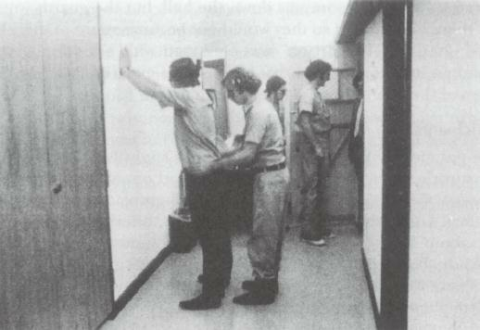
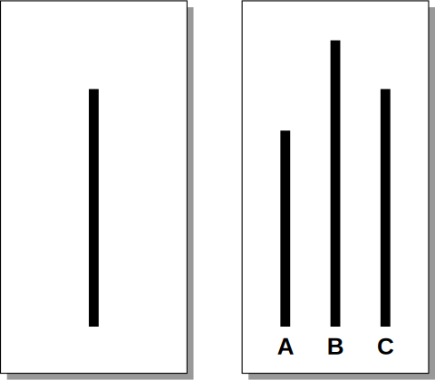
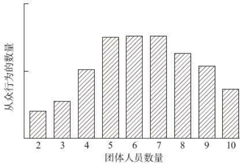
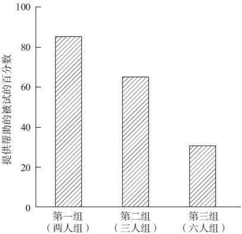
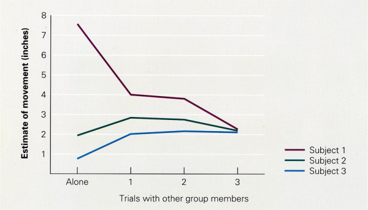
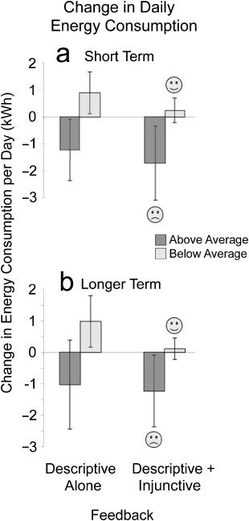

``` NOTICE
本篇文档中的案例，都是从书本中原文摘录下来的，为保证内容完整，我没有改动一个字。
有一些内容与观点，非常不利于美国政府，我个人并不乐意将这部分内容删除。
历史是不可以逆转的累积沉淀，人类的历史是经过一步步试错，才呈现出今天这个模样。
但是为了更好的未来，就需要人们将过去引以为戒，指责与诋毁无济于事。
如果这些案例早早就被人们知道是反面的，它们也就不会发生了。
```

--------------------------------------------------------------------------------

### 情境的力量

——摘录自《社会心理学（第三版）》ISBN:978-7-5184-1058-3，Thomas Gilovich/Dacher Keltner/Serena Chen/Richard E.Nisbett

我们每个人都有能力实施暴行吗？1963年，哲学家Hannah Arendt在她饱受争议的作品《艾希曼在耶路撒冷》（Eichmann in Jerusalem, 1963）中讨论了这个问题。Arendt叙述了对臭名昭著的阿道夫·艾希曼（Adolf Eichmann）的审判，此人是希特勒消灭欧洲以及纳粹占领区内犹太人的计划的实施者。在Arendt所提出的尖锐观点中，她将艾希曼描绘成一个仅仅是在完成本职工作的幕僚。尽管没有宽恕他的罪行（Arendt本人就是犹太人），Arendt认为艾希曼并不是人们所认为的（也是公诉人所宣称的）疯狂的、有虐待倾向的人，他不过是其所供职的机构里的一个无聊且没有想象力的零件，具备顺从的（虽然也可能是堕落的）责任感。更令人不安的是，根据Arendt理论的逻辑所得出的结论是，我们当中的每个人都可能做出残暴的行为。看一看现在坐得离你最近的人吧。你认为他有可能实施暴行吗？在你看来，会有足够强大的情境使得每个普通的人————甚至包括你自己————做出和艾希曼或阿布格莱布监狱中的看守们同样的行为吗？

Arendt的著述引起了一系列的反对浪潮，很多人认为她是在试图给一个恶魔辩解脱罪，并据此谴责她。但是一些研究结果却支持了被Arendt称为“平民之恶”的一端观点。这个研究提出了社会心理学研究中的一个关键问题：人们所处的情境是如何影响他们的行为的？

--------------------------------------------------------------------------------

### 斯坦福监狱实验

——摘录自《改变心理学的40项研究（第7版）》ISBN:978-7-115-47234-2，Roger R. Hock

***斯坦福监狱实验***

~~~~~~~~~~~~~~~~~~~~~~~~~~~~~~~~~~~~~~~~~~~~~~~~~~~~~~~~~~~~~~~~~~~~~~~~~~~~~~~~
Zimbardo, P.G.(1972).The pathology of imprisonment.Society, 9(6), 4–8.
Haney, C., Banks, W.C., & Zimbardo, P.G.(1973).Interpersonal dynamics in a simulated prison.International Journal of Criminology & Penology，1, 69–97.
~~~~~~~~~~~~~~~~~~~~~~~~~~~~~~~~~~~~~~~~~~~~~~~~~~~~~~~~~~~~~~~~~~~~~~~~~~~~~~~~

你曾经被监禁过吗？先假设你我的回答都是“没有”。那你认识在监狱里待过的人吗？可能吧。无论如何，我们大多数人都对在监狱中生活所产生的心理效应知之甚少。你可能读过一些关于监狱的文章、故事或者小说，而且几乎可以肯定你曾经在电影或电视中看到过描述监狱生活的场景。基于这些了解，大多数人都可以确定监狱一定不是我们愿意卷入的地方！我们知道坐牢是一种可怕的经历，犯人会产生一些激烈反应，甚至是病态的行为。而且我们中的大多数人还认为那些被选作监狱工作人员的人，例如看守和狱警，可能拥有一些独特的人格特征。但是，行为科学家们如何系统地研究对于监狱工作人员和犯人来说，监狱经历所产生的心理和情绪效应呢？

正如大多数复杂的现实生活情境，研究监狱生活的心理学对于研究者来说是个挑战，因为使用的方法必须是相关研究。这就是说，我们可以观察监狱环境，访谈犯人和看守，在犯人释放后收集他们的信息，然后试图基于这些分析形成假设。但是我们不能科学地控制监狱环境，因而对于我们所观察到的行为的真正原因无法得到清晰有效的结论。是监狱改变了人们，还是在监狱中的人原本就是与常人“不一样”？一种绕过这个研究困境的方法可能是创建一个模拟的“科研监狱”，然后把人们分为“囚犯”和“看守”置于其中。听起来不可能吗？如果现在来做一项这样的研究可能会很困难，但是在30年前，著名的心理学家菲利普·津巴多和他的同事克雷格·哈尼（Craig Haney）、柯蒂斯·班克斯（Curtis Banks）、戴夫·杰夫（Dave Jaffe）在斯坦福大学进行了这样的研究（在本节开头列出的两篇文章就是关于他们研究的最早论述）。他们想创建一个模拟的监狱，其中由一些大学生随机分配扮演“看守”和“囚犯”。他们的“监狱”建在斯坦福大学校园里心理学系大楼的地下室（有关细节稍后会详述）。

**理论假设**

津巴多在研究中验证的假设是，相对于你的内在性情和天性，周围的环境和情境会更强有力地影响你的行为。津巴多主张，尽管我们拥有某些特定的遗传或内在行为倾向，但是强大的环境会战胜这些内在倾向，并导致我们做出一些与平时的自己截然不同的行为。津巴多和他的同事们想要看看，如果把正常人置于一个对个人施加强大影响的情境中，即监狱中，会发生什么情况。

除了环境对我们的行为具有强大影响这一最初的信念以外，研究者们并没有建立其他特定的假设。为了检验情境力量的影响，他们将所有被试随机指派为“看守”或者“囚犯”。这种随机的指派会导致两种角色在模拟监狱环境中表现出显著不同的反应，例如，在交往方面的行为测量、在心境和病理学方面的情绪测量、对于自我的态度以及应对和适应这一新异情境的一些其他指标（Haney, Banks, & Zimbardo, 1973）。

**方法**

*设置*

津巴多的目标是创设一个尽可能类似于监狱的情境。他请来一位曾坐过15年牢的前罪犯作为顾问。尽管在这项研究中监狱并不是真实的，而且研究中的被试都知道这一点，但是津巴多希望确保这个过程模拟了真实的监狱体验。


津巴多监督着一组工作人员将斯坦福大学心理学系大楼地下室的一些房间和走廊改造为一所“监狱”。由于研究计划持续两个星期，所以这所监狱需要好好建设。走廊的两头都拓宽了，实验室的房间成为监狱的牢房。为了增强真实感，单个牢房的门都在小窗上装了竖栏并配有单独的牢房号码。沿着牢房的封闭走廊是“监狱院子”，囚犯被试可以从他们的牢房里出来到那里吃饭和活动。在走廊的尽头，是一间设计成单独囚禁的小黑屋，用来禁闭那些惹是生非、反抗和不尊重看守的，或者其他一些不合作的囚犯。浴室就在大厅里，但是守卫会把囚犯的眼睛蒙上把他们带过去，所以囚犯们并不知道他们的方位（Zimbardo，2007b）。“监狱”里装了一个隐藏的摄像机和内部通话系统，这样实验人员就可以保持对看守和囚犯行为的监督。

*被试*

如果你之前不熟悉这个研究，那么你接下来读到的内容可能会让你觉得很惊讶甚至是震惊。在你往下读的时候，试着把自己置于那些被试的心态。首先，研究者在位于斯坦福大学附近的加利福尼亚州帕洛阿尔托县的当地报纸上刊登广告，以每天15美元的报酬来招募志愿者参与有关监狱生活的实验研究（现在相应的被试报酬大概是每天75美元）。为了保证被试知情同意，研究者告诉这些志愿者该研究的大体性质，而且告诉他们在研究中可能会有一些违背他们个人隐私和公民权利的情况，他们获得的食物可能仅仅达到满足基本营养需要的最低限度。所有的志愿者都同意了以上各项条款。

研究者进行了大量的测试以排除有心理问题和犯罪前科的志愿者，最终从将近100名志愿者中选取了24名大学生。之后，通过投掷硬币的方式随机将这些人分成了“看守”和“囚犯”两组。要记得，津巴多在这个研究中的目标是将决定行为的内在人格因素和外部情境影响分离开来。所以，有必要确保这两组被试在开始的时候是尽可能同质的（Zimbardo，2005）。然后，没有任何的指导语、训练、或是对于接下来研究的准备，所有的被试都直接回到了自己的家。

*研究程序*

本研究的目标是观察、记录和分析囚犯和看守的行为。正如之前提到的，津巴多和他的同事们在寻找一些迹象，来说明这些年轻人所置身的情境和角色强度足以胜过他们每个人的人格特征和行为倾向。

“囚犯”：在初步筛选几天之后的一个星期天早上，分派到囚犯组的被试在自己家中被“突然袭击”，帕洛阿尔托警察局的一名（真正的）警官出人意料地敲响了被试的家门。所有的被试都以“抢劫罪”被逮捕，所有人都被搜查过、戴上手铐，被响着警笛、闪烁着警灯的警车迅速带离。所有囚犯都被登记在册、采集指纹，然后被蒙着眼睛关到单人牢房。之后，他们被告知将要被转移到“斯坦福县监狱”（也就是心理学系大楼地下室的那个模拟监狱）。

当这些囚犯到达监狱后，那些被分派充当守卫的被试对他们进行了搜身，脱光他们的衣服并用气雾喷雾器进行除虱。守卫们给每个“囚犯”发了以下物品：一件类似于罩衫的囚服，囚服上分别有四位数字的号码（这些号码将成为囚犯们在整个研究期间的代号）；橡胶拖鞋；需要一直套在头发上的尼龙袜（用来模拟大多数监狱中给囚犯剃光头的样子）；缠在脚踝上的加锁铁链（铁链并没有真的锁在什么东西上，只是为了提醒囚犯的身份）。津巴多指出，尽管这些程序与现实中的真实程序相比有所变化，但是这些程序背后的思想就是模拟羞辱、镇压，以及在真实监狱中囚犯的体验。这些囚犯每三个人被分在一个小囚室中，每人有一张简易床和一个薄床垫、一条毯子。三张简易床填满了整个空间，囚室里再没有空余的地方了。



“守卫”：与囚犯不同，守卫们不需要一直待在监狱里（毕竟他们没有被监禁），他们分为每组三个人，每组值8个小时班，不值班的时候他们仍然过自己的生活。他们领到了相同的监狱守卫制服、警棍（虽然不容许他们击打犯人）、反光墨镜（让他们看起来更有威慑力，而且外貌不太明显）。津巴多解释说他关于反光墨镜的想法来自保罗·纽曼（Paul Newman）在1967年主演的一部电影《铁窗喋血》（Cool HamdLuke）（Zimbardo，2007）。这些守卫没有受过任何关于他们所扮演的角色的专门训练，而且仅仅被告知他们的责任是让囚犯们守规矩和维持监狱的秩序。

**结果**

这是心理学史上被最多探究、讨论和分析的研究之一。守卫们和囚犯们身上发生的人格和行为变化是如此地意义深刻且令人震惊。为了在有限的篇幅内总结那些复杂的研究发现，在表格中简要列出了被试的一些典型行为。在这里更笼统地描述了接下来的几天里“斯坦福监狱”中所发生的事情。

出乎任何人的预料，这些囚犯和守卫身上的真正特性和人格似乎很快就消失了，取而代之的是他们被要求扮演的角色。在一天之内，“演戏”和现实生活之间界限就变得模糊，令人感到不安。正如津巴多在他的最初的研究中关于这些被试的描述（1972）：

~~~~~~~~~~~~~~~~~~~~~~~~~~~~~~~~~~~~~~~~~~~~~~~~~~~~~~~~~~~~~~~~~~~~~~~~~~~~~~~~
大多数人真的变成了“囚犯”和“守卫”，不再能区分角色扮演和自我……在不到一周的时间里，监禁的体验（暂时地）破坏了一生的学习；人类的价值被搁置，自我概念受到挑战，人类本性中最底层、最丑陋的病态面显露出来。我们觉得非常恐怖，因为我们看到一些男孩们（守卫）把其他人当作是卑劣的动物一样对待并且乐于享受那些残忍的行为；而另一些男孩们（囚犯）变成了卑屈顺从、失去人性的机器人，他们只能想到逃跑、自己个人的生存，以及对守卫们越来越多的仇恨。
~~~~~~~~~~~~~~~~~~~~~~~~~~~~~~~~~~~~~~~~~~~~~~~~~~~~~~~~~~~~~~~~~~~~~~~~~~~~~~~~

要记得，这是一个由高水平的专业研究者开展的一项科学研究，而且它很快就有了自己的生命力。参与的被试们，尤其是那些扮演囚犯的被试，似乎忘记了他们是具有自由意志的大学生。他们随时可以直接退出研究，但是并没有这么做。在几天以后，许多被试申请假释或释放，但是当释放请求被驳回后，他们仅仅是沮丧而顺从地回到牢房。囚犯组的被试中有五个人的情绪崩溃和应激反应非常强烈，他们变得抑郁、无法清晰思考甚至绝食。因此，研究者不得不在研究开始的最初几天就让他们退出了研究（或更确切地说，是让他们离开了这个监狱）。

其中一些守卫开始折磨囚犯，显然他们很享受由自己的地位所带来的权力。有些守卫不那么严厉，并且努力去保持公平，但是他们也一直没有干涉那些残暴专横的守卫，而且更重要的是，他们也从未提示实验者其他守卫可能超过了其角色的分寸。甚至津巴多本人也时常忘记他在负责一项科学研究，而是发现自己不自觉地进入“监狱主管”的角色。

| **囚犯们和守卫们在斯坦福监狱研究中的行为和反应               |                                                              |
| :----------------------------------------------------------- | :----------------------------------------------------------- |
| **守卫**                                                     | **囚犯**                                                     |
| 对囚犯使用一些贬损的、侮辱性的语言；骚扰和恐吓囚犯。         | 很快变得温顺、卑屈，遵守守卫们提出的规则。                   |
| 对囚犯进行羞辱性的评论。（例如，“2354号囚犯，你过去告诉2578号囚犯你爱他。”） | 表现出明显的创伤和抑郁的早期迹象，包括哭泣和深深的沮丧。     |
| （每天）半夜粗声喊醒所有囚犯以清点人数。                     | 乞求假释。                                                   |
| 经常把做俯卧撑作为对轻微过错的惩罚。（一个守卫在囚犯罚做俯卧撑的时候踩在他的背上） | 愿意放弃实验报酬来换取释放。                                 |
| 似乎很享受对囚犯们的虐待性控制。                             |                                                              |
| 为了镇压叛乱，用灭火器向囚犯们喷射干冰。                     | 情不自禁地哭泣、愤怒，思维混乱。                             |
| 整夜地关押囚犯单独囚禁。                                     | 筹划并实施了一次叛乱，脱掉丝袜头套、撕去囚犯上的编号、用床把牢房挡起来、诅咒和辱骂守卫。 |
| 把去卫生间作为一种特权，不时地拒绝囚犯上厕所的申请而在牢房里放置一只垃圾桶。 |                                                              |
| 在牢房里安置线人。（实验者的助手），用于监视犯人们逃跑迹象或叛乱迹象。 | 设计了详尽的逃跑计划，但一直没有实施。                       |
| 在囚犯们的逃跑计划暴露后脱光他们的衣服；移除囚犯们的床并强迫他们交出毯子。 | 最终完全放弃了反抗和相互支持。                               |
| 随即地给某些囚犯特权（更好的食物、可以刷牙、洗澡，等等），以求破坏囚犯们之间的友情、信任和团结并对其各个击破。 | 树立了人人为己的态度，并放弃与其他囚犯之间的团结。           |
| 为了惩罚囚犯们的逃跑尝试，强迫他们用手清洗马桶，将夜间点名延长几个小时、增加罚做俯卧撑的数量。 | 随着研究的进展，日益绝望地温顺地接受了守卫们的贬低和虐待。   |
| 不断想出新的方法来打击囚犯们的意志。                         | 在6天之后，所有的囚犯都变得消极被动、失去人性、如同机器人一般。 |

**近期应用**

如同米尔格莱姆关于服从的研究一样，津巴多开展的监狱研究在这三十多年来产生了全面的社会影响和政治影响。即便这不是不可能，但是要脱离研究的政治属性来讨论津巴多的研究结果是一件困难的事情。在美国以及世界上其他大多数国家，监狱改革都是最受争议的热点话题之一。在历史上，针对囚犯的系统化虐待是有文件记录的，而且这一情况延续至今。从津巴多开展研究的那个年代到今天，美国关于监狱暴动、叛乱、反叛、绑架及谋杀的历史充满了大量与斯坦福大学地下室所发生的那些事件类似的事情。美国监狱和拘留所中囚犯的数量从20世纪80年代的50万左右增加到2006年的220万人，这进一步加剧了虐囚事件发生的潜在可能（Bureau of Justice Statistics，2007）。美国在监人员的数量位于世界之首。而且，20世纪70年代中期以来，监狱的教育改造目标基本上被废弃了（尽管罪犯教养所的名称还在广泛使用），取而代之的是惩罚目标和将罪犯与公众隔离的目标（称为剥夺其能力）。在1998年，津巴多和哈尼分析了自从他们在斯坦福的研究以来，监狱系统是如何变化的。这里呈现的是津巴多关于他们分析结论的表述：

~~~~~~~~~~~~~~~~~~~~~~~~~~~~~~~~~~~~~~~~~~~~~~~~~~~~~~~~~~~~~~~~~~~~~~~~~~~~~~~~
监狱采用惩罚和将罪犯隔离的内在模式，而不是其他一些可能会降低高累犯率的基本改造措施，这仍然是失败的社会实验。我们的分析显示，监狱的条件在我们研究之后的几十年里显著恶化，这是监狱政治化的后果。媒体的夸大其词让选民们担心犯罪，而政治家、检察官、地方检察官及其他一些官员则对犯罪采取强硬立场，以此来获取选民的支持（Zimbardo，2005）。
~~~~~~~~~~~~~~~~~~~~~~~~~~~~~~~~~~~~~~~~~~~~~~~~~~~~~~~~~~~~~~~~~~~~~~~~~~~~~~~~

阅读到这里，你可能在思考津巴多的监狱研究与过去15年中美国参与的中东战争中发生的一些事件之间的可能联系。一些高度报道的事件，尤其是伊拉克阿布·格莱布监狱虐囚丑闻和关于古巴关塔那摩湾拘留营虐待拘留者的报道（参见Hooks & Mosher，2005；Keller，200），将“斯坦福监狱研究”重新带回公众关注的焦点。津巴多在其最近的著作《路西法效应：理解好人是如何变坏的》（The Lucifer Effect.Understanding How Good People Turn Evil，2007a）中，回顾了监狱研究并把他关于囚犯虐待的研究和评论从监狱拓展到人类罪恶这一更大的概念。我们不相信类似阿布格莱布监狱事件可能会真实地发生，不相信任何人，尤其是自由、民主社会中的公民可能会对其他人做出如此残酷的虐待。怎么会发生这样的事情呢？像津巴多一样的心理学家和其他社会科学家们试图帮助我们理解这种现象。正如一位研究这些虐待事件的作者指出：

~~~~~~~~~~~~~~~~~~~~~~~~~~~~~~~~~~~~~~~~~~~~~~~~~~~~~~~~~~~~~~~~~~~~~~~~~~~~~~~~
新闻记者们在寻找一些社会科学研究来理解在伊拉克、阿富汗以及世界上的其他地方发生的虐待事件。这些报告不再强调少数的“烂苹果”，转而质疑对于那些最底层士兵的惩罚。津巴多（1972）的研究在这些报告中很引人注意。他不同意“烂苹果”理论，而是主张是装苹果的木桶坏了。津巴多批评布什政府的“领导失败”，他着重指出那些对囚犯的虐待性审讯手段和严厉待遇得到了布什政府最高级官员和军队官员“由上而下的授权”（Hooks & Mosher，2005，P.1632~1633）。
~~~~~~~~~~~~~~~~~~~~~~~~~~~~~~~~~~~~~~~~~~~~~~~~~~~~~~~~~~~~~~~~~~~~~~~~~~~~~~~~

从来自伊拉克、阿富汗、关塔那摩的一份份报告当中，我们听闻并从图片细节中看到守卫和审讯官对囚犯实施的可怕的虐待和折磨。而在所有的报告中，这些守卫和审讯官们就像津巴多监狱实验中的被试们一样，并不是虐待成性的、残忍的人。他们在本质上就是普通人，可能和你我并没有什么不同，而他们却发生了戏剧性的转变。这可能最终源于所有罪恶中最强大的情境力量——战争。

**结论**

正如之前提到的，津巴多原计划进行两周的研究，但是他在第六天的时候就终止了实验，因为这个模拟的监狱情境太强大了，而且以惊人的方式变成了现实。实验人员和随机指派的大学生们不复存在，他们逐渐成为自己所扮演的角色，变成囚犯、守卫和监狱长。这些角色的力量是那么地强大，以至于个人身份消失了，被试甚至是实验人员都难以意识到在“斯坦福”监狱中的行为是多么危险。以下是津巴多对于他叫停研究的决定的表述：

~~~~~~~~~~~~~~~~~~~~~~~~~~~~~~~~~~~~~~~~~~~~~~~~~~~~~~~~~~~~~~~~~~~~~~~~~~~~~~~~
我终止实验不仅仅是因为暴力的持续升级和“守卫们”与“囚犯们”的敌对恶化，……而且是由于我自己意识到我自己所经历到的个人的转变。……我自己变成了监狱的负责人，而研究负责人的功能被置于第二位。我开始像一位严厉的机构负责人一样说话、走路和行动，我更多地考虑“我的监狱”的安全，而忽视了作为一位心理学研究者应当照顾的年轻人的需要。在某种意义上，我认为关于这个情境的力量的最深刻的评估正是它改变我自己的程度（Zimbardo，2005，P.40；及Zimbardo，Maslach，& Haney，1999）。
~~~~~~~~~~~~~~~~~~~~~~~~~~~~~~~~~~~~~~~~~~~~~~~~~~~~~~~~~~~~~~~~~~~~~~~~~~~~~~~~

--------------------------------------------------------------------------------

### 阿希从众实验（规范性社会影响）

——摘录自《改变心理学的40项研究（第7版）》ISBN:978-7-115-47234-2，Roger R. Hock

***从众的力量***

~~~~~~~~~~~~~~~~~~~~~~~~~~~~~~~~~~~~~~~~~~~~~~~~~~~~~~~~~~~~~~~~~~~~~~~~~~~~~~~~
Asch, S.E.(1955).Opinions and social pressure.Scientific American，193, 31-35.
~~~~~~~~~~~~~~~~~~~~~~~~~~~~~~~~~~~~~~~~~~~~~~~~~~~~~~~~~~~~~~~~~~~~~~~~~~~~~~~~

你觉得你是从众的人还是独立的人？我们大部分人更乐意别人认为自己是既从众又独立的，既不怪异、不叛逆，又有个性、有独立思考的能力。几十年以来，心理学家对从众这一概念始终非常感兴趣。如果你能想到心理学的研究不仅关注解释人类行为，而且更重要的是在于揭示其背后的原因，那么你也就理解为什么会这样了。人们愿意顺从他人的效应可以帮助我们理解人类行为的根源。

当心理学家谈到从众时，他们指的是当某一个体成为某个团体的成员时，其行为常追随团体的某种行为模式。通常，这种一个团体对其成员行为的不成文规定及约束被称为“社会规范”。认真思考一下，你或许会想起，在生活中有时你的行为与你的态度、信仰、道德并不同步或一致。很有可能，每当发生这种情况的时候，你正处于某一群体之中，群体中的每一个人都那样做，所以你也就跟随着那样做了。从众对于我们的行为而言是一种强大的力量，甚至可以说，这种力量在某些时候会使我们的行为偏离自身的内驱力，做出一些原本不可能做的事。所以，从众非常值得行为科学家投注兴趣并开展研究。然而，直到20世纪50年代初才有人对从众进行科学的研究，这个人就是所罗门·阿希（Solomon Asch）。他关于从众的系列实验为我们提供了有关从众行为的大量新信息，而且为未来的研究开辟了许多道路。

**理论假设**

假如，你与一群经常见到的人在一起，比如你的朋友或同事。他们正在讨论一些有争议的问题或政坛候选人。你很快发现，在这个群体中，其他人观点一致，而唯独你的观点与别人的恰恰相反。当他们询问你的意见时，你会怎么做呢？或是选择冒着被排斥的风险，不顾后果地坚持说出自己的真实想法；或是选择和群体保持一致，即使你并不同意这种观点；或者，如果有可能的话，你会完全回避这个问题。

阿希想要了解从众的需要对我们的行为到底有多大影响力。虽然从众经常会涉及一些笼统模糊的概念，如认同他人的态度、伦理、道德和信仰体系等，但是，阿希选择了集中研究一种更加显而易见的从众类型——知觉从众，即人们倾向于在多大程度上遵照他人关于世界的知觉（所看、所听、所尝、所闻和所触）。阿希通过一个简单的视觉比较任务来检验从众行为，这样他就可以在一种受控制的实验情境中研究这一现象。

如果从众所具有的影响力真如阿希以及其他一些人所认为的那样强大的话，那么研究人员就可以通过让群体给个人施加压力来操纵一个人的行为，这就是阿希所从事的研究。他设计出一系列非常巧妙的实验，采用相似的方法来验证从众的力量。

**方法**

视觉材料由成对卡片组成，每对卡片的其中一张上画有三条不同长度的垂直线（称为比较线）；另外一张卡片上画有一条垂直线（称为标准线），其长度与前一张卡片中三条线中的一条等长。接下来，便是实验的具体程序：假如你是自愿参加“视知觉研究”的一名被试，你到达了实验室，发现其他七名被试已经坐成一排。你坐在这一排的最后一个空位上。实验者呈现出一对卡片，要求你判断三条比较线中的哪一条与标准线的长度相等。你观察了一下卡片，并很快做出了正确的回答。从离你最远的那个被试开始，主试要求他们回答同样的问题。每个被试都给出了正确的答案，轮到你的时候，你也很清楚地给出了正确的答案。然后主试更换了卡片，又进行了同样的过程。毫无问题，你与其他成员一样，又一次给出了正确的答案。然而，在下一轮测试中，奇怪的事发生了——主试呈现卡片后，你立即想好了正确答案（毕竟，这并不困难），但是在其他被试回答这一问题时，他们却都选择了错误的答案，而且他们竟都选择了同样的错误线条。现在，轮到你作答了，你犹豫了，你简直不能相信眼前发生的一切。难道所有的人都瞎了眼吗？正确的答案是显而易见的，难道不是吗？你们到底是瞎了，还是疯了？现在你必须做一个决定。你是继续坚持你的观点（毕竟，正确的线条就在你的眼前），还是顺从其他人的意见？



现在你可能已经意识到了，在实验室中的其他七个“被试”根本就不是真正的被试，而是实验者的助手。他们从开始就知晓实验内容，而且回答也是规定好的，当然，这也是从众研究的关键。那么，在这项研究中，真正的被试是如何回答的呢？

**结果**

每位被试测试数次，其中约有75%的人至少有一次与团体的不正确共识保持了一致。综合所有实验结果，被试服从于团体做出错误回答的次数约占1/3。为了确保线条的长度可以准确判断，主试要求控制组中的被试单独写下他们对线条比较问题的判断，这些被试的正确率为98%。

**讨论与相关研究**

在阿希的研究中，团体压力对从众行为的有力影响得到了清楚的体现。如果个体愿意服从于团体，那么他们对明显的错误有时也不具判断力，而这种影响力在现实生活中究竟有多大？团体在何时会发挥更强大的作用？问题在何种情况下会变得更模棱两可呢？从众效应是影响人类行为的一个重要因素，这个多年来人们一直反复思索的问题现在已得到了科学证实。

在心理学领域中，阿希的研究结果在两个方面显得极为重要和关键。首先，如前所述，他首次清楚而科学地证明了社会压力对从众行为的影响力；其次，或许也是更重要的，即这项早期研究引起了大量后续研究，其作用持续至今。自阿希的早期研究开始，该类研究的数量急剧增加，它们极大地丰富了我们对从众效应的了解，也使我们明白究竟是哪些因素决定了从众效应对人类行为的影响。下面是其中的一些研究发现。

1. 社会支持。阿希在同样的实验上做了细微的变动，他对七名助手的回答进行改变，使其中一名助手在测试条件下给出正确的回答。在这种情况下，仅仅有5%的被试同意团体的一致性意见。很明显，你只需要一个同盟者就能“坚定立场”并抵抗从众效应的压力。这项研究发现还得到了后来几项研究的支持（例如，Morris & Miller，1975）。

2. 团体的吸引力及成员的归属感。后来的一些研究证明，个体越为某一团体所吸引，对这一团体越有归属感，那么他就越有可能顺应该团体的态度与行为（参见Forsyth，1983）。如果你喜欢某一团体而且觉得自己是他们的一员（他们是你的参照群体），那么你顺应于该团体的倾向性将是非常强烈的。

3. 团体的规模。首先，阿希和其他研究人员的研究都证明，从众的倾向性随团体规模的增加而提高。然而，进一步的研究发现，这种联系并非如此简单。确实，从众的倾向性随团体规模的增加而提高，但这仅限于人员数量为6到7人的团体。当其规模超出这个数字时，从众效应的水平不再增高，甚至在某种程度上有所降低。这一现象以图解的方式呈现出来了。阿希认为，这可能是由于随着团体成员数量的增多，人们可能会开始怀疑其他成员是有目的地合起伙来影响他人的行为，作为回应，他们开始抵抗这种显而易见的压力。



4. 性别。你认为男人和女人在从众的倾向性和自发性方面会有不同吗？继阿希的工作之后，有早期研究指出，女人似乎比男人更愿意从众。这种性别差异成为一种强有力的证据，频繁地出现在心理学文献之中。然而，近期的研究对这个结果提出了质疑。现在看来，许多早期研究（多由男性实施）无意中创造的一些实验条件，在当时对于男性比对于女性来说更熟悉、更舒适。心理学家明白，当人们处于那些不知如何表现才恰如其分的情境中，会表现出更多的从众倾向。因此，关于女性有较强从众倾向的结论也许只是一种系统误差，由方法上微小（且无意识）的偏差所致。在更好的控制条件下进行的一些研究并未发现从众行为有性别差异（关于性别问题的讨论参见Sistrunk & McDavid，1971）。

有关从众问题的研究还涉及其他众多领域，其中包括文化影响、在做出与从众相关的决定时的信息总量、社会规范、个人隐私，等等。

**批评**

阿希对从众效应的研究工作得到了广泛的支持和认可，此外该研究也在多种条件下被重复进行。对于这项研究的质疑则关注阿希的研究发现能否推广到实验室以外的现实生活中。换句话说，被试在实验室里对一些线条的回答与现实生活中的从众行为是否存在显著相关呢？这是对于所有在实验室控制条件下研究人类行为实验的效度的质疑。这种质疑的理由是：“也许被试可以在线段长度这种并不重要的琐事上与团体成员保持一致。但是，在现实生活中，特别是在重要事情上，他们不会那么轻易地表现出从众行为。”然而，虽然现实生活中的从众事件更有意义，但现实群体在从众事件上给予个体的压力也会相应增加。

**近期应用**

我们从以下这项研究中可以看出，阿希的工作对有关重大社会问题的研究依旧产生着重要影响。该文调查的是年轻人卷入不安全的性行为的原因（Cerwonka，Isbell & Hansen，2000）。大约有400名年龄在18~29岁之间的学生接受了不同方式的测验评估。测验内容包括AIDS/HIV高风险性行为知识（例如未使用安全套、多位性伙伴、酒精和其他药物滥用以及性经历等）。研究显示，众多因素能预测高风险性行为，其中包括基于同辈群体压力的从众。可以看出，对于从众如何影响人们选择性行为的理解可能成为我们对抗HIV持续传播的颇具价值的工具。

另一项引人关注的研究与阿希1955年发表的文章一脉相承，该研究考察为什么男性比女性更少寻求帮助，即使他们急需得到帮助（Mansfield等，2003）。这篇文章以下面这个（老）笑话引出：“为什么摩西用了40年时间在沙漠中徘徊，因为他不愿意问路（P.93）”。这个笑话之所以有趣，是因为它触及有关男性和寻求帮助行为的刻板印象。当然，不问路通常不会造成严重的问题，但是男性也倾向于拒绝寻求医疗和心理健康救助，这可能是危险的，甚至是致命的。作者指出，阻止男性寻求帮助的一个主要因素就是从众。“在需要帮助的情境中，男性可能会不愿意寻求帮助，如果他们认为这样做会受到羞辱……如果一个男性在生活中非常钦佩对寻求帮助持不赞成或者贬低观点的人，那么他自己就不太可能寻求帮助”。（P.101）

最后提到的一点是，文化在从众中起着特殊的重要作用（Bond & Smith，1996）。在具有集体主义文化的国家，比如日本、印度，所进行的从众研究发现，人们的从众行为都远远多于具有个人主义文化的国家的人民，如美国（参见研究28中川迪斯对集体主义和个人主义文化的研究）。这些发现再次证明心理学研究决不能忽视文化对人类行为的实际影响。

--------------------------------------------------------------------------------

### 米尔格拉姆服从实验（服从权威）

——摘录自《改变心理学的40项研究（第7版）》ISBN:978-7-115-47234-2，Roger R. Hock

***无条件服从***

~~~~~~~~~~~~~~~~~~~~~~~~~~~~~~~~~~~~~~~~~~~~~~~~~~~~~~~~~~~~~~~~~~~~~~~~~~~~~~~~
Milgram, S.(1963).Behavioral study of obedience.Journal of Abnormal and SocialPsychology, 67, 371-378.
~~~~~~~~~~~~~~~~~~~~~~~~~~~~~~~~~~~~~~~~~~~~~~~~~~~~~~~~~~~~~~~~~~~~~~~~~~~~~~~~

如果一个在你之上的权威人士命令你对另一个人施加电压为350伏电压的电击，原因仅是因为这个人在回答多项选择问题时答错了，你会听从命令吗？没有人会这样做。如果有人愿意去做这件事，你会认为他或她是一个残酷的人或是虐待狂。耶鲁大学的斯坦利·米尔格拉姆（Stanley Milgram）所做的这项研究，试图检验服从权威的想法，并得出了一些令人深感不安的结果。

米尔格拉姆的服从研究和津巴多的监狱研究在整个心理学史上极负盛名，受到人们的广泛认可。几乎在每一本普通心理学和社会心理学的教科书中都会提到该项研究。如果你与心理学专业的学生交谈，他们中的大多数人对这些研究要比对其他研究更熟悉。由这项研究引发米尔格拉姆写了一本关于服从心理的书，拍了一部与此相关的专题片，该片在大学心理学课上反复放映。这个实验不仅涉及有关服从行为的讨论，而且还影响了关于在心理学研究中采用人类被试的伦理问题的全部讨论。

米尔格拉姆的这项研究方案来自于他的一个想法，即他想用科学的方法调查人们怎么会仅仅因为别人的命令而对他人施加巨大的伤害。米尔格拉姆特别提到纳粹在二战期间犯下的可怕暴行，也在更广泛的意义上提及此前及现在因服从命令而发生的不人道行为。米尔格拉姆认为，在某些情况下，人类服从倾向是如此强烈而根深蒂固，它抵消了个人的道德、伦理，甚至是同情。

在行为科学家决定要研究某些人类行为复杂面的时候，他们的第一步就是要对发生行为的情境进行有效控制，以便能用科学的方法对它进行研究。这对于研究者而言是一个极大的挑战，因为要在实验环境中模拟现实生活是一件非常困难的事情。米尔格拉姆的问题是如何创设一个受控制的情境，在这个情境中一个人可以命令另一个人去体罚第三个人，且实际上并没有人真的受到伤害。这就是对研究者的一个挑战！

**理论假设**

米尔格拉姆最初的理论假设是，人类有一种服从权威命令的倾向性，即使这个命令违背他们自己的道德和伦理行为准则。例如，米尔格拉姆认为，虽然许多人从未有意伤害过别人，但在他们认为是权威人士的命令下，他们很有可能会对受害人做出伤害行为。

**方法**

也许这项研究最巧妙的部分就是米尔格拉姆开发的在实验室里验证服从力量的技术方法。米尔格拉姆设计了一个看起来非常骇人的电击装置，一个电子设备有30个调节开关，每个开关上贴着标签表示不同的电压，电压从30伏开始，每次以15伏为单位递增，一直增加到450伏。这些开关被分成三组，分别标着“轻微电击”、“中等电击”和“高压危险电击”。主试欲用这个装置让权威人士命令被试不断地增加电压去电击另外一个人。在你得出米尔格拉姆是一个施虐狂的结论前，请注意，那是一个非常逼真的模拟电击装置，它并不会让人真的受到任何痛苦的电击。

这项研究中的被试是40名年龄在20~50岁之间的男士，其中15人是熟练工人或不熟练工人，16人是售货员或商人，9人是专业人员。研究者通过报纸广告或直接发信的方式征集志愿者，邀请他们参加耶鲁大学的一项关于学习与记忆的有报酬研究。每位被试都是单独参加实验。为了获得较多的被试，研究者付给每位被试4.5美元（记住，这是1963年的美元，相当于现在的30美元），并清楚地告知所有被试，报酬在他们来到实验室后便付清，而且不管在他们到来之后发生什么事情，这些报酬都是他们的。这就确保被试知道他们可以随时退出研究，而且不会因担心得不到报酬而感觉被强迫以某种方式行事。

除了被试之外，研究中还有两位关键人物：一位是研究者的助手（一名47岁的会计），扮演另外一名被试；另一位是演员（穿着一件灰色的实验室工作服，看上去非常正式），扮演主试的角色。

当被试到达耶鲁大学社会互动实验室时，工作人员安排他坐在另一名被试（研究者的助手）的旁边。很明显，实验的真正目的是不能告诉被试的，因为那样将会彻底改变他们的行为。所以，实验者给被试讲了一个假故事，解释说这是一项对“学习中的惩罚”效应的研究。然后让被试通过从帽子里抽签来决定谁当老师，谁当学生。这个抽签是事先安排好的，因此真正的被试总是抽到老师，而研究者的助手则总是抽到学生。请记住，那名“学生”以及“主试”都是研究者的同伙。

然后，“学生”被带到隔壁房间，被试看到工作人员将他绑在椅子上，缠上电极（加入电极胶以“避免皮肤起泡或烧伤”），这些电极和邻近房间里的电击装置连在一起。虽然学生的手臂被绑着，但是他仍可以够得着标有A、B、C、D符号的按钮，并以此来回答隔壁房间里教师提出的问题。

主试向“老师”和“学生”清楚明了地交代了学习任务。简单地说，该任务是让学生对各种各样的单词配对进行联想记忆。单词表很长，因此这是一个并不简单的记忆任务，扮演老师角色的被试把每对单词读给学生听，然后检查学生的记忆情况。主试要求这些被试在学生作出错误的反应时给予电击惩罚。最重要的是，每增加一次错误反应，“老师”就要将电压强度提高一级。所有的这一切伪装得极为逼真，没有一名被试对电击的真假表示怀疑。

扮演学生的助手的反应是预先安排好的，所有的被试都以相同的顺序作正确或错误反应。而且，当电击总量随着错误的反应增加时，“学生”开始从另外一个房间发出痛苦的叫喊（这也是预先安排好的，包括其叫喊的话语内容及其心脏不舒服的事实）。当电压达到300伏时，“学生”会猛撞墙壁，要求工作人员放他出去。超过300伏电压之后，他变得完全沉默，拒绝回答任何问题。主试告诉“老师”，用对待错误反应的方式来处理不反应的情况并继续进行应有的电击程序。

大部分被试在电压达到某一点时会转向主试询问是否继续进行电击。当这种情况发生时，主试会命令被试继续，且在此过程中很有必要向被试发出一系列语气渐重的命令。

~~~~~~~~~~~~~~~~~~~~~~~~~~~~~~~~~~~~~~~~~~~~~~~~~~~~~~~~~~~~~~~~~~~~~~~~~~~~~~~~
命令01：请继续。
命令02：实验需要你继续。
命令03：继续进行是绝对必要的。
命令04：你别无选择，你必须继续。
~~~~~~~~~~~~~~~~~~~~~~~~~~~~~~~~~~~~~~~~~~~~~~~~~~~~~~~~~~~~~~~~~~~~~~~~~~~~~~~~

通过记录每位被试拒绝继续进行的电压水平，就可以对服从行为进行测量。在这个电击装置上有30个开关，每位被试的得分在0~30之间。进行完全部过程，获得满分的被试被称为“服从的被试”，而在较低电压水平就中断的被试被称为“对抗的被试”。

**结果**

被试会服从主试的命令吗？他们最多会用多高的电压？你预测的结果是什么？想想你自己、你的朋友和一些普通人。你认为有多少人会使用所有30个电压水平，达到最高的450伏——高压危险电击呢？在讨论这个实验的真正结果之前，米尔格拉姆让一组耶鲁大学心理学专业的四年级学生以及许多其他同事预测结果。人们的估计最低是0%，最高是3%，平均为1.2%。也就是说，一百个人中会对“学生”施加最高电压电击的不足三人。

表格展现了令人惊讶的实验结果。在主试的命令下，几乎所有被试都将电压提升到了300伏的水平，直到“学生”猛击墙壁，要求离开实验室，并拒绝回答问题为止。但是，最令人吃惊的是使用全部30个电压水平并使电压达到最大值的被试数量。

尽管有14名被试不服从命令，在达到最高电压之前中断了实验程序。但40名被试当中仍有26个，也就是65%的被试按照主试的命令继续进行实验，并使用了最高电压。这并不是说被试能心平气和或很高兴地去做这些事情，许多人表现出了极大的心理压力，并为受电击者的境况而担忧，甚至对主试非常愤怒。然而，他们还是服从了命令。

| **电压等级数（伏特）** | **拒绝在该电压等级上继续执行电击命令的人数** |
| :--------------------- | :------------------------------------------- |
| *轻微的电击*           |                                              |
| 15                     | 0                                            |
| 30                     | 0                                            |
| 45                     | 0                                            |
| 80                     | 0                                            |
| *中等的电击*           |                                              |
| 75                     | 0                                            |
| 90                     | 0                                            |
| 105                    | 0                                            |
| 120                    | 0                                            |
| *较强的电击*           |                                              |
| 135                    | 0                                            |
| 150                    | 0                                            |
| 165                    | 0                                            |
| 180                    | 0                                            |
| *很强的电击*           |                                              |
| 195                    | 0                                            |
| 210                    | 0                                            |
| 225                    | 0                                            |
| 240                    | 0                                            |
| *猛烈的电击*           |                                              |
| 255                    | 0                                            |
| 270                    | 0                                            |
| 285                    | 0                                            |
| 300                    | 5                                            |
| *极为猛烈的电击*       |                                              |
| 315                    | 4                                            |
| 330                    | 2                                            |
| 345                    | 1                                            |
| 360                    | 1                                            |
| *高压危险的电击*       |                                              |
| 375                    | 1                                            |
| 390                    | 0                                            |
| 405                    | 0                                            |
| 420                    | 0                                            |
| *XXX*                  |                                              |
| 435                    | 0                                            |
| 450                    | 26                                           |

研究者担心一些对他人施加电击酷刑的被试可能在心理上也遭受痛苦，尤其是在最后三次电击中，“学生”不再作出任何反应。为了帮助他们缓解这种焦虑，在被试完成实验后，研究者将这个实验的真正目的以及全部的实验程序，包括对他们的欺骗手段原原本本地告诉了他们。此外，研究者还对被试进行了访谈，了解他们在实验过程中的感受和想法。作为助手的“学生”也来与每位被试见了面。

**讨论**

米尔格拉姆对研究结果的讨论主要集中在两点上：首先是被试惊人的服从倾向。这些被试是同意参加一个关于学习的实验研究的普通人，绝不是冷酷的虐待狂。米尔格拉姆指出，从童年开始，他们就知道昧着良心去伤害别人是不道德的。那么他们为什么要那样做呢？主试是一个处在权威地位的人，但是你仔细想想，他到底有多少权力呢？他没有任何权力发号施令，被试若拒绝执行命令也不会有任何损失。很显然，是情境本身有一种力量，在一定程度上创设了服从的氛围。

第二个值得注意的关键是，在整个实验过程中，被试因执行了主试的命令而表现出极度的紧张和焦虑。研究者猜测，被试只要拒绝继续进行实验，这种不适感就会减轻。然而，这种情况并没有发生。米尔格拉姆引用了一个观察者的话（此人通过单向玻璃观察被试）：

~~~~~~~~~~~~~~~~~~~~~~~~~~~~~~~~~~~~~~~~~~~~~~~~~~~~~~~~~~~~~~~~~~~~~~~~~~~~~~~~
我看到一位成熟稳重的商人进入了实验室，他面带微笑，充满自信。但在20分钟内，他就变得痛苦不堪，说话结结巴巴，很快就近乎于一种神经崩溃的状态……有时候，他用自己拳头敲着自己的前额，喃喃自语道：“噢，上帝！让我们停止吧！”然而，他还是按主试的要求继续进行，直到进行完所有电压等级。”（P.377）
~~~~~~~~~~~~~~~~~~~~~~~~~~~~~~~~~~~~~~~~~~~~~~~~~~~~~~~~~~~~~~~~~~~~~~~~~~~~~~~~

在文章的结尾，米尔格拉姆列举了几点理由来解释为什么这种特殊的情境会产生如此强烈的服从倾向。从被试的角度来看，原因主要有以下几点：
（a）如果这项研究是由耶鲁大学发起的，那它一定是好事情，没有谁会怀疑这样的著名学校；
（b）实验的目的似乎很重要，因为我是志愿者，所以我会尽力完成我的任务来配合研究者实现这些目标；
（c）毕竟，“学生”也是自愿来这儿的，他对这项工作也有责任；
（d）嘿，我是老师，他是学生，这纯属巧合——我们是抽签决定的。其实另一种情况也很有可能出现，即我是学生，他是老师；
（e）他们为这事给我报酬，我要尽力做好；
（f）我完全不知道心理学家以及被试的权力，所以我将屈从于他们的安排；
（g）他们告诉我们，电击是痛苦的，但没有危险。

**研究发现的意义**

自从这项研究发表后的40多年以来，米尔格拉姆的研究仍占据着很重要的位置。米尔格拉姆本人用耶鲁大学以外的其他类似被试重复了这一实验过程，他们是义务参加实验的大学生志愿者和一些女性被试，每次得出的结果都是相似的。

另外，通过实施一系列的相关实验设计，米尔格拉姆进一步拓展了他的研究发现以揭示促进服从行为或限制服从行为的原因（参见Milgram，1974）。他发现，受害者（指“学生”）与“老师”的身体和情感距离的改变制约着服从倾向的强烈程度。当“学生”在另外一个房间，他与“老师”在彼此不见面也听不见对方的声音的情况下，出现了最高的服从率（93%的被试用了最高电压）。当“学生”与被试同在一个房间内，主试要求被试强迫“学生”把手放在电击板上，此时的服从率最低，只有30%。

米尔格拉姆还发现，权威人物（指主试）与被试的身体距离也会影响服从行为。被试离主试越近，其服从倾向越强烈。在一种实验条件下，主试离开房间，并用电话对被试发出指令，结果被试的服从率仅为21%。

最后，有一个现象较为令人乐观，即当主试允许被试用他们想用的电压水平惩罚“学生”时，没有一名被试使用的电压超过45伏。

**批评**

米尔格拉姆的研究不仅影响着我们对服从行为的理解，而且使人们对用人类作被试的道德问题进行深刻的思考。即使没有一个人受到电击，但当你认识到自己仅是因为一个身穿实验室工作服的人的命令而去残酷地电击别人（很可能致死），你会作何感想？人们对米尔格拉姆研究方法的批评主要是（参见Baumrind，1964；Miller，1986）在实验期间，被试所承受的压力是让人无法接受的。此外，他们还指出，这种潜在的消极影响可能会长期存在。当被试经历内心折磨后，主试告诉他们这是个骗局，他们会怎样？也许他们会感到自己受人利用，感到难堪，而且有可能在他们未来的生活中不再相信任何心理学家或是合法权威。

另外一种批评意见主要集中于米尔格拉姆研究结果的效度方面（如，Brief et al.，1995；Orne & Holland，1968）。这一批评经常被引用的基础是认为，被试与主试间的关系不仅有信任的成分，还有依赖的成分，并且实验室对于被试来说也是一种陌生的环境，在那里表现出的服从行为并不代表现实生活中的服从行为。因此，批评者声称米尔格拉姆的研究结果不仅效度低，而且由于其效度低下，实验对被试所实施的处理也就是不适当的。

通过在被试参加完实验后对他们进行的调查，米尔格拉姆对这些批评意见作出了回应。他发现84%的被试很高兴参加了这次活动，而只有1%的人对这次经历表现出后悔。另外，一个精神病专家访谈了40名被认为是在实验中感觉最不舒服的被试。他得出的结论是，这些人当中没有一个人遭受长时间的心理折磨。因批评者认为实验室并没有反映现实生活中的行为，米尔格拉姆的意见是：“来到实验室的被试是主动的、有选择权的成人，他有能力接受或拒绝在实验中给予他的命令。”（Milgram，1964，P.852）

这里所报告的米尔格拉姆的研究，引起了人们对以人类为被试的实验中道德问题的深刻思考。事实上，该研究是对心理学服从行为研究领域的影响更大，还是对心理学研究以人类为被试的道德政策问题影响更大，仍是极具争议的（正如在本书前言中所讨论的）。

**近期应用**

米尔格拉姆的服从研究继续对目前的研究发挥着广泛的影响，这一点可以在近期研究的不少注解中得到证明。这些研究主要是在米尔格拉姆早期实验方法和结果的启发下进行的。从20世纪60年代早期米尔格拉姆从事他的研究以来，每年都有与此有关的研究出现，这些研究可分为两类：一类是对米尔格拉姆理论的完善以及关于对权威人物服从倾向的详细阐释；另一类是关于在实验中对人类被试施行欺骗手段的道德问题的争论。

作为斯坦利·米尔格拉姆的研究和职业生涯的权威评述者以及米尔格拉姆传记《电醒人心》（The Man Who Shocked the World）的作者，托马斯·布拉斯（Thomas Blass）回顾了源于米尔格拉姆早期服从实验的所有研究及其社会意义（Blass，1999；2002）。总体上来看，布拉斯发现各种研究普遍支持米尔格拉姆最初的研究结果。更重要的是，在米尔格拉姆第一次发表他的结果之后的40多年里，服从率似乎并没有发生显著的改变。这与美国人的直觉判断相矛盾，一般而言，他们会认为自己已经不像40年前的美国人那样敬重权威，当权威人士命令他们做自己不同意的事时，他们会做出反抗。

另一个经常出现的问题是对米尔格拉姆早期研究中性别问题的关注。事实上以前所有的研究对象都是男性。仔细想想，总体而言，男性与女性谁更倾向于服从权威？布拉斯从米尔格拉姆的后期研究和其他人的研究中发现，男人和女人在服从率上并没有什么区别。（想要更详细地了解米尔格拉姆的研究工作所产生的历史影响，请参见布拉斯的网站，网址为：www.stanleymilgram.com。）

与米尔格拉姆的发现紧密衔接的一个研究，调查了路易斯安那州监狱负责执行死刑的“行刑小组”成员的心理体验（Osofsky & Ososky，2002）。研究者访问了50名直接参与行刑的警官，结果发现，尽管比大多数人更多地面对痛苦和死亡，这些被试并没有出现临床上的抑郁症状。被试报告说他们依靠宗教信仰、对同行群体的认同和对责任进行扩散的能力来应对痛苦情感。“然而，这些警官体验到矛盾的情感并且时常报告在执行社会‘终级处罚’时感觉很糟糕。”（P.358）

在伦理方面，一项研究使用米尔格拉姆的研究范式考察在互联网上进行的社会科学研究潜在的棘手的伦理问题（Pittenger，2003）。今天，大量的研究是通过国际互联网进行的，而且此类研究的数量在将来还会显著增加。皮滕杰（Pittenger）主张，研究者必须警惕侵犯隐私、未获得被试情同意，使用欺骗手段等潜在的违背道德伦理规范的情况。“互联网为研究者提出了独特的挑战，”皮滕杰写道，“其中包括需要清楚地界定在网上进行的个人行为与公众行为的区别，确保获得被试有效知情同意的机制以及对被试进行调查询问的机制，核实所收集到的数据的有效性。”（P.45）

一个重要的问题是，我们该如何保护被试在心理学研究中免遭不合理的欺骗手段的伤害，而又同时允许某些科学研究进行所必要的欺骗继续存在？温德勒（Wendler，1996）建议在研究涉及欺骗手段时，研究者应给予被试更高水平的知情同意权（参见本书前言部分对此概念的讨论）。这就意味着，在你同意成为实验被试之前，工作人员会告诉你在此实验中可能会用到欺骗手段，尽管你可能并不会意识到欺骗的确切内容。温德勒声称：“这种对于可接受的欺骗的二级许可给我们提供了最好的机会来协调二者的关系，即既要尊重被试，又要满足科学实验所偶尔需要的欺骗过程。”（P.87）

**结论**

研究米尔格拉姆的史学家托马斯·布拉斯（2002年）在其所著的关于米尔格拉姆生活和工作的传记中给本研究提供了一个适宜的结论：

~~~~~~~~~~~~~~~~~~~~~~~~~~~~~~~~~~~~~~~~~~~~~~~~~~~~~~~~~~~~~~~~~~~~~~~~~~~~~~~~
我们不需要米尔格拉姆告诉我们自己有服从他人命令的倾向。在米尔格拉姆的实验前，我们不知的是这种倾向的力量有多大。了解我们极强的遵从权威的倾向后，我们可以设法使自己提防不受欢迎或应受谴责的命令（Blass, 2002, P.73）。
~~~~~~~~~~~~~~~~~~~~~~~~~~~~~~~~~~~~~~~~~~~~~~~~~~~~~~~~~~~~~~~~~~~~~~~~~~~~~~~~

--------------------------------------------------------------------------------

### 责任扩散实验（旁观者效应）

——摘录自《改变心理学的40项研究（第7版）》ISBN:978-7-115-47234-2，Roger R. Hock

***你会伸出援手吗***

~~~~~~~~~~~~~~~~~~~~~~~~~~~~~~~~~~~~~~~~~~~~~~~~~~~~~~~~~~~~~~~~~~~~~~~~~~~~~~~~
Darley, J.M., & Latané, B.(1968).Bystander intervention in emergencies: Diffusion of responsibility.Journal of Personality and social Psychology, 8, 377-383.
~~~~~~~~~~~~~~~~~~~~~~~~~~~~~~~~~~~~~~~~~~~~~~~~~~~~~~~~~~~~~~~~~~~~~~~~~~~~~~~~

在心理学研究的历史上，最有影响的事件之一并不是某项研究，而是由美国新闻媒体所报道的一则发生在纽约市的暴力悲剧事件。1964年的一天，一位年轻女士凯蒂·吉诺维斯（Kitty Genovese）在她经营的曼哈顿酒吧营业结束后返回公寓，她的公寓在皇后大街的一个安静的中产阶层居住区内。当她下车朝公寓方向走去的时候，她遭到一个持刀男人的恶意袭击。那男人刺了她好几刀，她大声喊救命。一个邻居从窗口大声警告那男人：“放开这个女孩”，歹徒正欲图逃走，但后来他又返回来将吉诺维斯击倒在地，并继续刺杀她。袭击仍在继续，女孩一直呼救直到最后有人报警。警察接到报警后两分钟便赶到了现场，但吉诺维斯当时已经死了，袭击者也不知去向。袭击行为持续了35分钟。警察在调查这一事件中发现，公寓周围共有38个人目睹了这一袭击事件，但最终只有一人报了警。一对夫妇（他们说他们以为已经有人报了警）把两把椅子移到窗前去观看这一暴力事件。杀害吉诺维斯的人温斯顿·莫斯利（Winston Moseley），现年将近70岁，至今被关押在位于纽约北部戒备最森严的监狱里。在他47年的牢狱生涯中，他提请的14次假释都被否决了。在最近的2011年假释听证上，他的假释再一次被否决，直到2013年他才能再次提请假释。

如果有一个人能早些向吉诺维斯伸出援手的话，她也许就能幸免于难。这看上去似乎是邻居们漠不关心，没有试着阻止这场暴力事件，这令纽约市民和全体美国人感到震惊。人们想知道这其中的原因，同时他们谴责居住在大城市里的人们情感淡漠，谴责皇后大街的居民们，谴责人类的本性。

吉诺维斯的悲剧激发了心理学家的研究兴趣。作为科学家，他们不打算谴责谁，而是试图理解阻止所有的人对受害人伸出援助之手的心理因素。在心理学研究领域中有一个概念，行为科学家称之为“亲社会行为”，或者说是产生积极社会后果的行为。这个研究领域的内容包括利他、合作、抵御诱惑以及帮助行为。如果你目睹了某人需要帮助的紧急情境，有许多因素会影响你做出挺身而出并提供帮助的决定。纽约大学的约翰·达利（John Darley）和哥伦比亚的比勃·拉特内（Bibb Latané）就是两位研究这些影响因素的社会心理学家。他们把这种在突发事件中的帮助他人行为称为“旁观者干预”行为（而在吉诺维斯的案件则叫未干预行为）。

你曾经遭遇过真实的突发事件吗？与你在电视中看到的、报纸中读到的相反，突发事件并不常见。达利和拉特内估计，平均每个人一生中遇到的突发事件不多于六件。这既是好事，也不是好事，好的原因显而易见，不好的原因是因为当你发现自己正面对一个突发事件，而你又必须做出决定时，你却没有任何可利用的经验。社会要求我们在遇到突发事件时要伸出援手，但通常的情况就像著名的吉诺维斯事件那样，我们没有这么去做。是因为我们经历那样的事件太少，以致使我们只是不知道该做什么？是因为居住在城市里的人感情冷漠吗？或者是因为人的本性本身就是冷漠的？

自吉诺维斯谋杀事件发生之后，达利和拉特内分析了旁观者的反应。他们提出的理论是：正是由于观看事件的目击证人太多而降低了任何一个个体提供帮助的意愿。他们决定用实验的方法来验证这一理论。

**理论假设**

常识可能会告诉你，在一件突发事件发生时，在场的旁观者数量越多，他们干预的可能性就越大。达利和拉特内却提出了相反的假设：他们认为没有人前去帮助凯蒂·吉诺维斯的原因是存在一种被他们称为“责任扩散”的现象。也就是说，在突发事件中，旁观者越多，人们心里的某种想法就越强烈，即“有人会去帮助他（或她）的，我就不必去了。”你是否曾在繁忙的街道上看见过车祸，或者当车祸发生不久你恰好到达了出事地点？你很可能驾车驶离现场，并认为现在一定已经有人叫了警察或救护车，所以你不觉得自己有责任也这样做。但是，想象一下，假设你在荒郊野外，周围没有其他人，你遇到了同样的事件，此时你会有不同的反应吗？我们中的大多数人会回答“是的”。

责任扩散的概念是本项研究的理论基础。研究的挑战在于在一个可控的实验室情境中重新创设类似吉诺维斯事件情境，这样就可以操纵和系统检验各种变量。达利和拉特内精心设计了一系列实验来验证其理论观点。

**方法**

很显然，研究者不可能为了进行实验而重新创设一种与凯蒂·吉诺维斯谋杀案完全相同的情境。因此他们必须设计另一种与真实的突发事件非常相似的情境以便观察旁观者的干预行为。在这个实验中，达利和拉特内告诉纽约大学选修心理学课程的学生，他们两人对一些与大学生有关的话题非常感兴趣，想了解大学生是如何在激烈的竞争中适应大学生活、城市环境以及他们正面临着什么样的个人问题。他们要求学生坦诚地与其他学生讨论自己的问题，但为了避免难堪和不愉快情况的发生，学生们单独待在相互隔离的房间里，彼此之间通过内部通信联络系统进行交谈。研究者还告诉他们，这种内部装置每次仅允许一名学生讲话。每位学生有两分钟的讲话时间，之后下一位同学的麦克风就会开启。

所有这些隐藏了真实实验目的的设计，是为了能够从被试那里获得真实、自然的行为反应。这其中最主要的方法就是把这些参与研究的学生分在三种不同的实验条件下。第一组的被试相信他们仅仅能与另外一个人交谈；第二组的被试相信他们可以通过内部通信系统与另外两个人交谈；第三组的被试被告知，他们可以与线上的另外五个人交谈。事实上，每个被试都是独自一个人，他们从“内部通话系统”中听到的其他的声音都是事先准备好的录音。

现在，实验组的人数已安排好了，接下来就是要设计一些突发事件。研究人员决定非常逼真地设计一个被人们普遍认为是突发事件的癫痫发作场景。当被试们与其他“学生”在内部通信系统开始讲话时，被试听到的第一个说话者是男性，他提到他的困难主要集中在学习和适应纽约的生活氛围方面，然后他又尴尬地补充说，自己有时候也会发作严重的癫痫，特别是在压力过大的时候。然后，便轮到下一个学生讲话。在第一组中，被试听完第一个学生的谈话后，就立即开始讲话。而在其他两种条件下，被试在讲话之前会听到一个或多个其他学生的说话声。被试说完后，又轮到第一个学生。这时候突发事件发生了。第一个学生一开始声音很正常，不久癫痫开始发作（记住，这完全是录音机里发出的声音）。达利和拉特内在后来的报告中引用了“癫痫发作”的全部内容：

~~~~~~~~~~~~~~~~~~~~~~~~~~~~~~~~~~~~~~~~~~~~~~~~~~~~~~~~~~~~~~~~~~~~~~~~~~~~~~~~
“我、我……想，我需要……有……如果有人……能给我一点给我一点帮助的话……因为我……现在真的有麻烦，如……果有人能帮助……我的话，那……太感激……了。我的癫痫就要发作……我需……要一些……帮助，如果有人愿意帮助我……（哽咽声）我要死了，帮……助癫痫……（哽咽，然后就无声了）。”（pp.95–96）
~~~~~~~~~~~~~~~~~~~~~~~~~~~~~~~~~~~~~~~~~~~~~~~~~~~~~~~~~~~~~~~~~~~~~~~~~~~~~~~~

对于被试来说，这很显然是一个突发事件。毫无疑问，那名“学生”正处在危难之中，需要立即得到帮助。为了分析被试的反应，达利和拉特内测量了每一种实验条件下被试帮助危难学生的百分率（帮助行为指的是离开小房间，通知实验者有学生癫痫发作）。他们还测量了被试对突发事件的反应时间和提供帮助所花的时间。研究者给被试4分钟的时间作反应，之后实验停止，研究者询问被试相关情况。

**结果**

这项研究的结果对研究者的假设提供了强有力的支持。随着被试认为共同在场人数数量的增加，能够迅速向研究者报告癫痫发作的人数百分比大大减少（见图10—5）。而在所有最终提供帮助的人中间，时间拖延总量也随旁观者人数的增加而增加。第一组被试平均的反应时间不到一分钟，而第三组被试的平均反应时间却超过了三分钟。报告突发事件的被试总人数在各组间也有显著的变化。在四分钟内，第一组被试百分之百地报告了突发事件，第二组被试中只有85%的人报告，而第三组被试中只有60%的人作了报告。



**讨论**

就像凯蒂·吉诺维斯谋杀案这一现实生活事件一样，你也许会认为这项研究中的被试对癫痫发作者非常冷漠、令人心寒。然而达利和拉特内很快指出，第二组和第三组被试（或吉诺维斯的邻居们）实际上并不是这样的。所有的被试都报告了在事件发生时，他们感到极度的焦虑和不适，还有人出现了紧张的躯体症状（如手发抖、掌心出汗）。研究者得出的结论是，被试行为结果的不同一定与被试认为的在场人数的不同有关。别人的在场改变了你的行为，这就是大家所知道的“社会影响”心理学原理的作用。很显然，社会影响在本研究中扮演着一个重要的角色。但是，我们仍然有疑惑，为什么其他人的在场会对我们有如此巨大的影响？

达利和拉特内声称已有证据支持他们的“责任扩散”理论。随着团体内人数的增多，被试在突发事件中采取行动的个人责任就减少了。对于第二组和第三组的被试来说，他们很可能会认为有人已经解决了这个问题。此外，当其他人在场的时候，人们不仅仅感觉到责任的分散，而且会觉得如果不提供帮助所带来的内疚和良心责备也更少一些。在我们的文化中，帮助别人是积极的行为，拒绝或不肯帮助别人会带来羞愧感。如果在突发事件中只有你一个人在场，那么你不提供帮助所要承担的后果要比有其他人在场时大得多。

对这类社会影响的另一种解释是心理学家称之为“评价恐惧”的现象。达利和拉特内认为，当别人在场时，我们没有去帮助当事人的部分原因是我们害怕难堪或被嘲笑。设想一下，如果你有帮助别人的愿望，而别人并不需要或不想让你帮助时，你将感到多么尴尬。我记得在我年轻的时候，有一次我与一帮朋友在邻居家的游泳池内游泳，当我正准备从跳板上跳水时，我看见邻居13岁的女儿正躺在泳池的底部，我看了一下四周，似乎没有一个人意识到这个显而易见的紧急状况。她是溺水了还是在开玩笑？我无法确定。正当我准备大声呼喊并跳下去营救时，她懒洋洋地游出了水面。因为担心自己出错、害怕过度反应的尴尬，我犹豫了整整30秒。我们许多人都经历过这类事情。问题是这些经历教给我们的是一种错误的东西：帮助他人的行为很可能使你看上去很愚蠢。

**研究发现的意义**

由于本项研究以及一些其他研究，达利和拉特内在助人行为和旁观者干预领域内成了开创性的研究者。他们早期的大量研究收录在他们的著作《反应冷漠的旁观者——他为何不帮助？》（The Unresponsive Bystander：Why Doesn’t He Help）一书中（Latané和Darley，1970）。在该书中，他们所描绘的助人行为模型在被有关助人研究的心理学文献广泛认可。他们提出大多数人介入某一突发事件前一般要经历5个步骤。

1. 你——一个潜在的帮助者——必须首先意识到某一紧急事件正在发生。在本章的研究中，紧急情况的产生是毫无疑问的。但在真实的生活中，你也许行色匆匆或将注意力集中在另一件事上，可能完全没有注意到紧急情况的发生。

2. 你必须对情境作出判断，即某个人是否需要帮助。在这一点上，害怕难堪的心理发挥着作用。在本研究中，情境是清晰的，需要帮助也是非常明确的。然而，在现实中，大部分潜在的突发事件具有某种程度的不确定性和模糊性，如我在游泳池游泳的那个例子。或者想象一下，你看见一个人正步履蹒跚地穿过繁忙的人行道，你会想他是病了，心脏病发作，还是喝醉了？你对情境的判断会影响你对是否介入此事的决定。在吉诺维斯事件中，许多没有提供帮助的人声称，他们都以为这是情侣间的争吵而不想介入其中。

3. 你必须承担个人的责任。如果在突发事件中，你是唯一的旁观者，那么你会立即承担这种责任。然而，如果有其他人在场，你也许会让他们替你承担责任。这一步是本项实验所关注的重点。在突发事件中，在场的人越多，责任扩散就越严重，也就越有可能发生无人提供帮助的情况。

4. 如果你承担了责任，那么你必须决定你该采取什么行动。如果你不知道该做什么或者觉得自己没有采取适当行动的能力，你将不会提供帮助。在达利和拉特内的研究中，被试只需要向研究者报告有学生癫痫发作，完全不涉及能力问题。但如果有一群人看见一辆车撞倒了一个行人，这群人中有医生、护士或是其他护理人员，那么他（或她）比其他人更有可能介入其中，因为他们会更知道自己该做些什么。

5. 当你决定该采取什么行动之后，你必须去做。仅仅知道自己该做什么并不能保证你就一定会去做。现在，你必须掂量帮助别人的利与弊。你愿意独自介入有一人持刀或两个人都持刀的打斗中吗？对于车祸中的受害者，你是否能帮助他们还是可能会把事情弄得更糟呢（又是一个能力的问题）？如果你介入了，你会被起诉吗？如果你本想努力去帮助别人，但结果却像个傻子，又将如何？许多问题取决于情境，在你采取真正的行动以前，这些问题会在你的脑海里一一闪现。图10—6说明了助人行为是如何被中断的或在某一阶段被阻断的。


**后续发现与近期应用**

在凯蒂·吉诺维斯谋杀案和我们在这里讨论的这个实验中，所涉及的旁观者都是彼此无法交流的如果这些旁观者彼此能相互看见，并且可以相互交流的话，你认为后果会怎样？当他们可能被其他人评价时，是否会更可能介入其中？达利和拉特内认为，在某种情况下，即便是关系很近的群体也不比个人更乐意提供帮助。他们的理论认为，当突发事件在某种程度上比较模糊时，这种情况就更有可能发生。

举例来说，设想一下，你正坐在候车室里，然后通风口开始冒烟。你忧心忡忡地看了一下房间里的其他人。他们显得出奇地平静，对此毫不在意。你会觉得自己对冒烟的反应一定有些夸张，所以决定不采取任何行动。因为你若采取了行动，而却错了（也许它不是烟，而是从隔壁房间里冒出来的水蒸汽或其他什么东西），你将会感到羞愧和尴尬。然而，你并不知道，房间里的每一个人其实与你有同样的感受，并且他们也试图把这种感受隐藏起来，像你一样在避免难堪！而对于冒烟，却没有一个人采取任何行动。这听起来有些不可信，对吗？但事实确实如此。

拉特内和达利（1968）在随后的一项研究中设计了一个类似上述的情境来验证这一观点。一些心理学系的学生自愿来参加一项访谈，他们被告知将共同“讨论在城市大学中的一些生活问题”。他们为接受访谈来到预先约定的地点，并被安排在一个房间里等候，填写一份预备问卷。几分钟后，烟雾开始从某个通风口进入房间，研究中使用的烟雾是一种特殊的化学混合物，对被试不造成任何危险。不久，烟变得越来越浓，以致于房间里的视线开始变得模糊。主试开始计时，看被试会过多长时间才把冒烟的情况报告给主试。一些被试被安排在单独的房间里；还有一些被试与另外两个人（主试的助手）在一起，被试认为这两个人也是被试，当烟出现时，这两个人表现得若无其事；其余的被试则三人一组待在房间里。拉特内和达利的研究结果又一次支持了他们的理论：在单独组中，有55%的被试在两分钟之内报告了冒烟的情况；其余两个组仅有12%的被试报告了情况；另外，四分钟之后，单独组有75%的被试开始行动，而在其他组中，仍然没有被试报告冒烟一事。

关于害怕尴尬让人们对帮助他人犹豫不决的更多证据来自另外一项研究，在这项研究中综合考察了害羞人格测量、对负面评价的恐惧（FNE），以及被试帮助他人的意愿（Karakashian et al.，2006）。被试先填写测量害羞和恐惧负面评价的问卷。然后，他们会面临着帮助一位女性同伴的机会，有些被试是与这位女士单独在一个房间，另一些被试则除了这位女士以外还有另外两个同伴（研究助手）在一起。根据达利和拉特内的研究结果，无论被试人格测量的分数如何，与没有其他旁观者在场的条件相比，有两位旁观者的情境中被试的帮助行为会显著地减少。除此以外，在无旁观者条件下，那些在恐惧负面评价和害羞测量上得分高的被试比其他被试更少地提供帮助；而在有两位旁观者在场的条件下，不同被试提供帮助行为的可能性相同。这可能看起来与你的直觉相悖。通常人们直觉认为害怕被负面评价的或者是害羞的人在有其他人在场的时候可能更少会提供帮助，是吧？事实上并不完全如此。让我们这么考虑：当其他人在场的时候，一个害羞的人觉得提供帮助的压力更小（由于责任扩散），所以他（或她）其实有“理由”像其他旁观者一样避免提供帮助；另一方面，如果没有其他旁观者在场，对于（潜在的）负面评价的恐惧就生效了，害羞的人比不害羞的人提供帮助的可能性就更少。研究者对于此项研究的说明如下：

~~~~~~~~~~~~~~~~~~~~~~~~~~~~~~~~~~~~~~~~~~~~~~~~~~~~~~~~~~~~~~~~~~~~~~~~~~~~~~~~
由于在社会条件下（有其他人在场）存在责任扩散，被试面临较少的是否提供帮助的决策。这时由于提供帮助的想法本身不多，也就不用担心受到糟糕的评价，那么恐惧负面评价就不成问题了。而在非社会条件下（没有其他旁观者），被试是单独一个人，具有提供帮助的全部责任，这样他就必须要决定是否采取行动（Karakashian et al., 2006, P.30）。
~~~~~~~~~~~~~~~~~~~~~~~~~~~~~~~~~~~~~~~~~~~~~~~~~~~~~~~~~~~~~~~~~~~~~~~~~~~~~~~~

另一项研究揭示了在我们的想象中（而不是现实生活中）旁观者效应和责任扩散的力量。包括达利在内的一个研究小组进行了一项题为《群体思维：固有的旁观者效应》的研究，结果发现，仅仅是设想自己是群体的一员就会改变帮助行为（Garcia et al.，2002）。在这项研究中，要求被试将自己设想为群体的一员，或者是与另外一个人在一起。然后要求所有的被试为一个慈善机构捐款。想象自己是群体一员的个体比想象和另外一个人在一起的被试捐出更少的钱，而且感觉自己的个人责任更少。这些结果显示，当我们作为群体一员的时候，我们的大脑会立即把握机会，认为自己的个人责任变少。

**结论**

虽然，这项研究的结果看起来确实让我们对帮助他人的内在倾向有些悲观，但是你应该认识到，这些所涉及的都是人们未能伸出援手的一些极端特殊情况。生活中每天都会发生人们去帮助他人、利他甚至是英雄主义的行为。这项研究之所以重要，是因为它不仅解释了使人困惑的人类行为，而且还有助于改变这种行为。当人们更多地认识到旁观者效应的时候（正如你现在已经知道其中原理），即使有其他人在场，他们也会作出更多的努力去干预危急情况。事实上，有研究已经证明，当人们了解了旁观者效应后，他们会更乐意向危难中的人们伸出援手（Beaman et al.，1978）。关键在于，危急时刻，千万不要以为已经有人提供了帮助或者一定会有人提供帮助。我们应该永远像自己是唯一的旁观者一样去行动。

--------------------------------------------------------------------------------

### 谢里夫从众实验（信息性社会影响）

——摘录自《社会心理学（第七版）》ISBN:978-7-5100-4863-0，Elliot Aronson/Timothy D. Wilson/Robin M. Akert

***信息性社会影响：想知道“正确”情况的需要***

你会如何称呼你的心理学教授——是“伯曼博士”，“伯曼教授”，“伯曼女士”，还是“伯特里夏”？在即将进行的公投中，学校为了扩展对学生的服务将要提高学费，你会如何投票呢？你会将一片寿司切开吃还是整块一起吃？究竟你刚刚听到的从走廊传来的尖叫声是某人和朋友开玩笑还是来自被抢劫的受害者？

在上述情况以及其他许多情景中，我们常常无法确定应该如何思考或者如何反应。我们简直不知道怎样才是一个好的或者正确的选择。询问其他人的想法或者观察他们的行为能帮助我们界定情景（Kelley, 1955; Thomas, 1928）。当我们随即像其他人一样行动时，我们就是在从众，但不是因为我们是软弱的、没有勇气的人，不能依靠自己。相反，是其他人的影响在引导我们从众，因为我们把他们看作指导我们行为的信息来源。我们从众是因为我们相信其他人对一个模糊情境的解释比我们自己的解释更准确，而且可以帮助我们选择一个适当的行为方式。这被称为信息性社会影响（informational social influence）（Cialdini, 2000; Cialdini & Glodstein, 2004; Deutsch & Gerard, 1955）。

为了说明别人是如何成为信息来源的，请你想象一下你是穆扎费尔·谢里夫（Muzafer Sherif, 1936）下面这个实验的一个被试。在实验的第一阶段，你独自坐在一个暗房中，实验者要求你将注意力集中于约4.6米外的一个光点，然后要你估计光点移动了几厘米。你非常认真地盯着那个光点，是的，它移动了一点。你回答说：“大约5厘米。”虽然要准确地判断是很不容易的。光点消失了，然后又出现了；要求你还要再次做出判断。光点好像又多移动了一点，于是你回答道：“10厘米。”击刺测验之后，光点似乎每次都移动相同的长度了——大约5~10厘米。

这个测验的有趣之处是那个光点事实上一点都没有移动。它看起来好像是动了，是因为一种视觉错觉，叫做自动效应。如果你在一个完全漆黑的环境中盯着一个亮点（如，黑夜中的恒星），这个亮点就会看起来前后移动。这个现象的产生是因为你没有稳定的参照点来固定光点的位置。不同的人会感受到不同的移动距离，但一段时间以后，每个人感受到的移动距离就会一致。在谢里夫的实验中，实验的第一阶段，所有被试都达到了他们自己稳定的数字估计，但是这些估计因人而异。有人认为光点只移动了2.5厘米左右，而有些人则认为光点移动了差不多有25厘米。

谢里夫选择用自动效应做实验，是因为他希望能创造一个模棱两可的情境——被试不清楚情境的真实状况。实验的第二阶段，几天之后，实验被试会与其他两个都经历过第一阶段的人组成一个团体。现在，这是一个真正的社会情境了，因为三个人都必须大声说出他们的判断结果。请记住，自动效应的经验是因人而异的；有人看到很大的移动，而有人则只看到很少的移动。当人们听到他们的同伴给出与自己不同的判断结果后，他们会有什么反应呢？



经过几次测验后，人们达成了一个共同的估计数值，而且团体中的每个成员都遵从这个估计值。这个结果说明，人们都将他人作为信息的来源，从而相信团体的估计是正确的。信息性社会影响的一个重要特点就是它能导致私下接纳，也就是说，因为人们真诚地相信其他人的言行是正确的，因而顺应他人的行为。

如果人们只是公开地顺应团体，但私下仍坚持他们自己的信念，认为光点只是移动了一点点，这看起来同样是合理的。例如，也许有人私下认为光点移动了25厘米，但却按照团体的估计值报告说它只移动了7.5厘米，以避免看起来很愚蠢或很可笑。。这是公开顺从的一种情况，一个人虽然公开表现出顺从却不一定真正相信团体所做所言。然而，让被试在参加完团体判断后再次单独判断光点的移动距离，谢里夫对公开顺从这种解释产生怀疑。即使人们不用担心在其他被试面前看起来很愚蠢，他们仍然给出先前团体的估计值。一项研究甚至发现人们在一年后接受单独实验时，仍坚持团体的估计值。这些结果说明，人们依赖其他人来定义现实情况，并私下地接受团体估计。

在生活的许多领域，已经证实了信息性从众私下接纳的力量，包括节约能源。例如，杰西卡·诺兰（Jessica Nolan）和她的同事（2008）给加利福尼亚州居民的样本人群一些资料，以鼓励人们在家中节约电能。家庭成员受到四条信息中的一条。其中的三条信息写的是节约能源的基本原因：保护环境；造福社会；省钱。第四个则包含一条旨在促进信息性从众的信息：被试得知他们的邻居中大多数都节约电能。然后，研究者从这些家庭的电表上测量了他们的实际用电量。他们发现规范性信息（包括关于邻居的行为信息）相比其他三条信息，显著地引起人们节约更多的能源（Nolan, Schultz, Cialdini, Goldstein, & Griskevicius, 2008）。类似地，诺亚·戈尔茨坦、罗伯特·恰尔蒂尼和弗拉达斯·格利斯科维西斯（Noah Goldstein, Robert Cialdini, & Vladas Griskevicious, 2008）设法让酒店的顾客遵从“为了节约能源，请重复使用您的浴巾”的要求——一种被广泛使用的、却不受顾客欢迎的酒店管理技术。研究者发现浴室中的信息标志说明在这个房间中，大多数的顾客都重复使用他们的浴巾，这种方式比酒店的呼吁（“请保护环境”）更加有效（Goldstein et al., p.473）。

最后，在美国，几百所大学的行政人员利用信息性从众产生私下接纳的力量来防止学生群体中饮酒过度的现象。在过去的几年里，一种新的技术——“社会规范方法”已经取代了先前的“威吓”策略，以劝服学生们少量饮酒。这种社会规范方法直接引发信息性服从来减少饮酒量。研究者发现，一般的学生认为他或她的同学的饮酒量常常比真实的数量多得多。这种方法包括学生在校园中饮酒的真实水平（更低）的信息。通过减少饮酒规范的模糊性并提供给学生们关于环境的新定义，希望他们能顺应这些信息并减少自己酒精的饮用量。关于这种社会规范能否起作用，研究者们仍在争论当中（Lederman, Stewart, Goodhart, & Laitman et al., 2003; Schemo, 2003b）。

--------------------------------------------------------------------------------

### 顺从（基于规范的方法）

——摘录自《社会心理学（第三版）》ISBN:978-7-5184-1058-3，Thomas Gilovich/Dacher Keltner/Serena Chen/Richard E. Nisbett

***有效的基于规范的要求***

让人们知道其他人在做什么可以提升公共效益。设想一个在加利福尼亚州利用基于规范的方法对能源使用进行的研究。房主们收到的信息向他们显示了在过去几周内他们使用了多少能源（每天千瓦时），以及他们周围邻居的平均用电量。这种简单介入的效应很明显并且起效迅速：那些能量消耗高于平均水平的户主显著减少了他们的用电量。

但是用电量比平均水平低的户主呢？告诉他们邻居不够尽责会让他们更加浪费吗？是的，但是调查者有个简单的补救措施，使得高于平均水平的能耗减少了，同时又不造成对低能耗习惯的破坏。在给一半户主提供用电情况信息的同时，还会根据其用电量是高于还是低于平均水平，附上一个小小的表示支持或反对的标志（一个笑脸或一个悲伤的脸）。支持的标志足够维持那些人良好的节俭作风，否则他们也会变得更加浪费。



另外一个有生态性的想法的基于规范的方法是用来说服宾馆客户重复使用毛巾以节约水和能源的。调查者发现，当在督促客户重复使用毛巾的小卡片（你可能已经见过很多了）上声称以往绝大多数顾客都会选择重复使用毛巾时，顺从的比例会显著上升。有趣的是，如果卡片上再特别注明是“住在这个房间里”的绝大多数顾客会选择重复使用毛巾，甚至会进一步提升顺从率（Goldstein, Cialdini, & Griskevicius, 2008）。

当规范被误解时——也就是当人们高估了破坏性行为的普遍性或者低估了建设性行为的普遍性时，重新澄清规范可能是最有效的。学生饮酒就是这么一种案例，还记得第4章描述过的人众无知现象吗？再美国的大学里，虽然实际状况并不是这样的，但学生们还是认为喝酒狂欢是非常普遍的事情，很少有人“完全不喝酒”或者适度饮酒。在一项调查中，Deborah Prentice和Dale Miller在普林斯顿大学验证了关于酒的私人态度和公共规范之间的矛盾。他们认为，两者间之所以有矛盾可能是出于一下原因：

~~~~~~~~~~~~~~~~~~~~~~~~~~~~~~~~~~~~~~~~~~~~~~~~~~~~~~~~~~~~~~~~~~~~~~~~~~~~~~~~
在普林斯顿大学，酒在惯例和传统中扮演的中心角色恶化了这所大学的饮酒状况。比如，在大学生活的核心——饮食俱乐部里，会一周7天，一天24小时地供应酒水。在美国，在普林斯顿校友会中消耗的酒精量号称排在全国各种盛会的第二位，仅次于印第安纳波利斯500英里大奖赛。在这所大学里，饮酒的社会规范很清楚：学生必须适应饮酒，从而参与到普林斯顿大学的社交生活中（Prentice & Miller, p.244）。
~~~~~~~~~~~~~~~~~~~~~~~~~~~~~~~~~~~~~~~~~~~~~~~~~~~~~~~~~~~~~~~~~~~~~~~~~~~~~~~~

Prentice和Miller问普林斯顿的本科生对这所大学的饮酒习惯的舒适程度，以及他们认为他们的朋友和本科生整体对大学里饮酒习惯的舒适程度。如果学生在这个问题上正遭受人众无知，他们会表示，在他们看来，和大多数同学相比，自己更不能适应这种饮酒习惯。图中显示的结果表明，情况确实如此。学生普遍感觉周围人对饮酒文化十分支持，但自己心中隐藏着对酒精的不适感。

研究证实，把其他同学对饮酒的准确看法提供给学生们，能够非常有效地减少过多的酒精摄入（Neighbors, Larimer, & Lewis, 2004; Perkins & Craig, 2006; Schroeder & Prentice, 1998）。在一项研究中，研究者让参加常规俱乐部活动或者组织会议的学生在无线键盘中输入自己的饮酒行为信息和对同龄人饮酒习惯的想法。他们汇总的答案会马上展示给所有人看，从而纠正学生们对其他同学的饮酒频率和饮酒量的广泛误解。一两个月后进行的在线调查显示，和对照组相比，了解了这些信息的学生的饮酒量显著降低了。


--------------------------------------------------------------------------------
