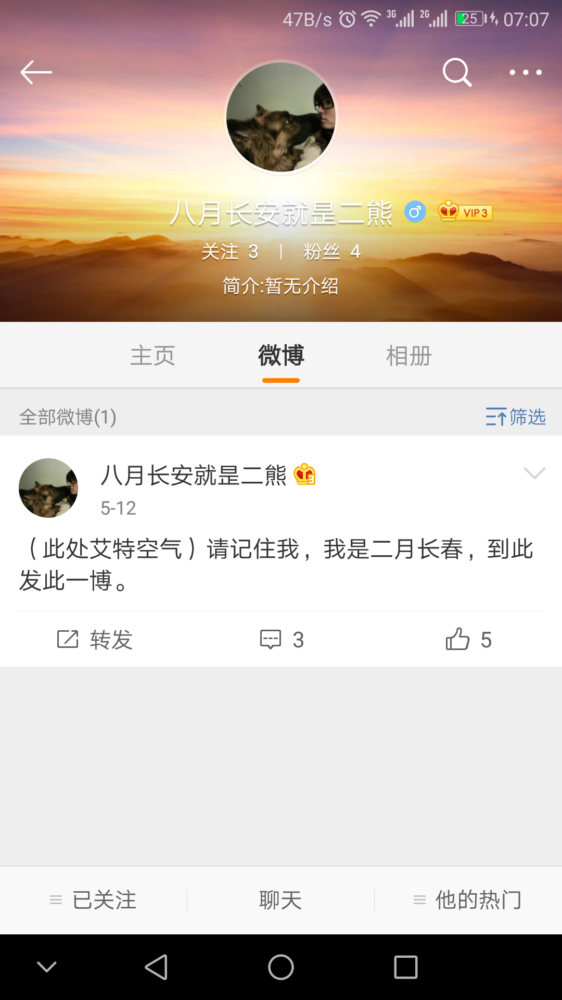

占位符。。。

这是一篇回忆录，主角是一只东北的熊，地点在南京。

昨天下午，文字我看过了，共鸣，原谅。

毕竟都是上过学的人，可以想象你今天的样子，是你过去的前向投影。

于2018年05月26日 02:13 +08 在乌鲁木齐 +06

--------------------------------------------------------------------------------

> 

我可能上了一个假的微博，我还可能每天都在上同一个假的微博。

警察不要出来吓人，我记住你了: 5-12， 二月长春。

这个国家是如此的惧惮其国民，它的各个机器部件马不停蹄地在运转。

可怜的人们，没什么好慌张。

于2018年05月27日 07:27 +08 在乌鲁木齐 +06

--------------------------------------------------------------------------------

这是我到达南京的第二天，时间是2018年02月28日。昨天晚上淋了一晚的雨，回到宾馆附近，商店都因我的脚步而被迫关门停业。那种感觉很落魄，就好像世界统治了你，你悄无声息的来临，反而会加快商店熄灯宁人。我最终在一家小的便利店，买了一盒巧克力风味的夹心派和瓶装水，带回房间，开启了那段小黄文的篇章。我和他们住在同一个宾馆，也许最开始仅仅是个意外。

这天早上9点半，我动身离开，我拉着旅行箱，直奔南京古生物博物馆和南京总统府两点一线的中点，位于东南大学东门的一家宾馆，昨天淋雨但没有洗澡，浑身难受。路上经过南京市外国语学校，这是我昨天选择稍远一点的宾馆的原因，也就是为什么会阴差阳错地和他们住在一起的原因。世界之大，无奇不有！

昨天坐地铁到达玄武区，一出地铁口，街道路标指示眼前的这条街居然是北京东路，南京外国语学校就在附近，我心里一阵莫名奇妙的欣喜，看到旁边确实有个学校的样子，也有穿着校服的中学生走在大街上，不过那个学校是小学。许多年前，我高三高考完毕，在聚会唱K的时候听到了这首歌《北京东路的日子》，作者便是南京外国语学校的高三毕业生。一群孩子，歌声清纯，回忆的是高中生活的点点滴滴，怀旧的是单纯无欺的同学情意，憧憬的是未来无限光明的前途。不过，我的高考一塌涂地，这首歌更加勾起我的思绪。南京外国语学校是全国有名的中学，不巧的是，她就读的郑州外国语中学，同样是全国有名的中学。第二天去郑州，首站便去了位于郑州高新区的郑州外国语中学，红墙白边，与她的穿衣风格一致。那个窝藏在心中的美人儿，总能在不经意的瞬间击中你，让你无处可逃。

我到达目的地宾馆，还未到中午12点，宾馆没退房，我不能即刻入住，交过订金，我出发去南京市古生物博物馆。早上没上厕所，肠胃难受得很，同样不幸的是，南京古生物博物馆在周末才开放，我的愿望落了个空，旁边的古鸡鸣寺外，算命的江湖先生挨上前来，死缠烂打。我买了张古鸡鸣寺的门票进去，这是一刹尼姑奄，香火依然旺盛。我在古鸡鸣寺里兜了一圈，烧香拜佛一个不落。我不信佛，如果我去寺庙，那一定是因为有她。

从鸡鸣寺出来，我又去了旁边的玄武湖风景区，有一座南京古城墙遗址，需要门票，因为肚子不舒服，我最终没上古城墙遗址。玄武湖风景区挺大的，风景不错，不过我没什么心情逛。我逗留了一会，肚子受不了，我就原路返回。

我在宾馆解决完肚子，洗漱完毕，就动身去南京总统府，先吃个午饭。此时是中午1点多，我在一排餐馆前打量，一个穿纯白色衣服的女孩向我靠近，目不转睛地盯着我看。当我回过神来，她已经与我近在咫尺，我不解的是她居然跟我穿同一款纯白色冲锋衣。短暂的目光交流过后，我注意到她染过色的泛黄的长头发，说不定是个意外呢！她欣赏的是我同款的衣服呢！我选了我眼前的第一家餐馆，牛肉锅巴什么的。

柜台的女生，样貌清纯，眉清目秀，有一头蜷曲的长头发。起初我以为她是附近东南大学/南京大学的学生，在这打工兼职，不过那天已经开课，这么好的女生不去上课学习，花大把时间在无聊的兼职上，实在是得不偿失。她侧着头在玩手机，而我不知道吃什么，于是便开始了我经典式的开场白：

```
“你有什么推荐的？”
“菜单上有。”
“你们的招牌是什么？”
“牛肉锅贴。”
（我并不知道锅贴是什么，没吃过来尝鲜便是赚。）
“那就这个。”
“几两锅贴？”
“。。。”
“那就二两吧，够你吃。你要什么汤。”
“有什么汤？”
“（巴拉巴拉。。。）”
“那就清汤吧。”
（我付款。）
“这是你的小票。到那边窗口取餐。”
```

一副突然凶巴巴而又迅速恢复平静的样子，我真有几分被镇住了。我找了最近的桌椅坐下，可以看到她的侧身，放下书包，我用眼角细细地打量着她。我不记得她当时有没有戴眼镜了，只记得她穿着黑色的衣服，黑色的保暖丝袜。根据腿部的圈径，我判断她的年龄段在大学生之上，似乎在30岁以上，难道是我判断错了？？？面部的皱纹显示，这应该是还在大学生的年龄段，然而头发又告诉我事情并没有那么简单。她一直低着头玩手机，知道我在看她，她显露出几分羞涩的遮掩。我慢吞吞地吃完锅巴，背上书包，头也不回地离开这家餐馆，去南京总统府。

现在我知道，你有30岁了，脸蛋保养得不错。蜷曲的披肩长头发，经典款一撇刘海，迷一样的微笑，会眨吧的眼睛，深情地耷拉脑袋。不过，那些爱笑的人，通常有一段难以接受的往事。

在南京总统府，我先是看了新中国的历史/人物展，宋庆龄。。。

在庭院转角的僻静处，一对情侣在深情热吻，显然我的靠近，更能激发他们的渴望。。。

本篇完毕。

于2018年05月30日 3:44 +08 在乌鲁木齐 +06

--------------------------------------------------------------------------------