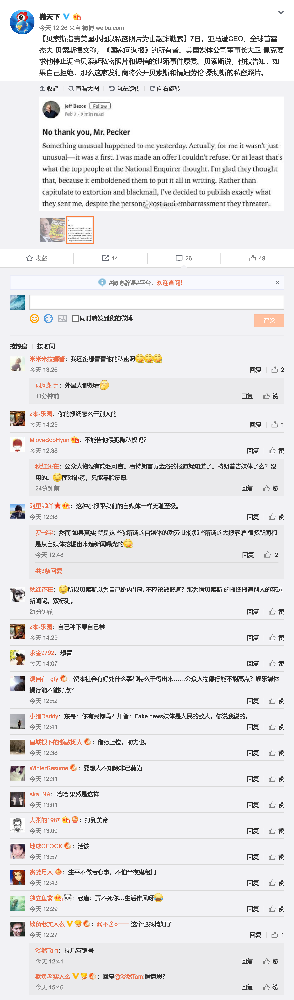

广义微表情(微行为)，是一门研究瞬时情绪的心理学，其核心研究内容便是[欺骗]。

在微行为研究者看来，没有什么东西是不可能造假的，微表情/微语音/微动作。

但除了一样东西，那便是，[内心情感]。

--------------------------------------------------------------------------------

在颜色性格理论中，人的性格由多种代表颜色组成，其中最能表征性格特点的颜色，被称为本征颜色。

本征颜色若有，那只有一种，而且一定是纯色。

本征颜色相近的人，能非常融合地感知到对方的行为动机，就好像自己的所作所为一样。

--------------------------------------------------------------------------------

惊闻霍金教授过世，有几分巧合事件，我有一种很复杂的觉察。

我打算花些时间好好整理一些东西，我要为自己攒足筹码。

下一篇文章不知在何时，也许是5天或者更多，这是一个占位符。

--------------------------------------------------------------------------------

谢谢某些人陪伴在左右，我都看在眼里了。

不过不必为我担心，其实担心也没什么用。

因为我还是一个学生，一个科研工作者，一个人。

--------------------------------------------------------------------------------

傍晚，寻找资料和视频，我又专门去研究了一下###的新浪博客。

她的十年前的博客，与她现在的状态是相符的。

不过，我毫不违和地看到了被打压的痕迹，那些发生在我身上的事历历在目。

还有什么好说的？

于2018年03月17日 21:06 +08 在乌鲁木齐 +06

--------------------------------------------------------------------------------

昨天晚上在南山，依然睡不着觉，脑袋里乱七八糟地想了一大堆东西，一篇文章就这么构思好了。

到了早上昏沉沉地一觉醒来，又翻了一下她的记录，看到她频繁的更新，我竟然打算放弃将构思写成文字，我做不到这么决绝。

我心里知道她及她的伙伴是监控我的人之一，非常难受。

我想要的是一个电话，无论如何。即便不是解释，也能将很多事情轻易摆平。

还在整理当中，拭目以待。

于2018年03月24日 01:52 +08 在乌鲁木齐 +06

--------------------------------------------------------------------------------

奋斗了一天一夜加小半夜的时间，我将一个非常重要的函数级数整理出来了！！！

很兴奋很满足！！！当灵感突然来临的时候，简直不要不要的。

感谢徐森林的《数学分析》第三册，给了我无穷无尽的灵感。这是站在巨人的肩膀上，超越地平线的高度，望尽无限可能！！！

不知道有没有前辈整理过这个级数，我在这将之命名为〔积分和级数〕，其重要应用就是可给出调和型级数的表达式，而且其本身也有一些特殊的性质，尤其是当自变量为整数时。

也就是，这个重要级数可以作为一个特殊函数，加以广泛应用！！！

我想将推导过程整理成一篇论文，现在先将其以预发布的形式放在我的空间上，别来抢我的饭碗！！！

我的第一篇论文？？？也不是很低端啊！！！虽然我不是数学大师。

于2018年03月30日 02:27 +08 在乌鲁木齐 +06

--------------------------------------------------------------------------------

你是上天的指派，来守护我的天使，将我温柔豢养。

于2018年03月31日 00:24 +08 在乌鲁木齐 +06

--------------------------------------------------------------------------------

昨天没更新什么东西，有点累。

感谢那些牵线搭桥的朋友，礼物我按自己的想法准备了。

顺其自然即[为]唯美。不打耳洞，别整头发，少用化妆品。

又是一年毕业季！

于2018年04月16日 01:15 +08 在乌鲁木齐 +06

--------------------------------------------------------------------------------

上山值班，下周一下山，不必挂念。

于2018年05月04日 02:41 +08 在乌鲁木齐 +06

--------------------------------------------------------------------------------

昨今天没有做到多少事。

我和###在值班室聊了一天的天，就在刚刚我们还在看人物纪录片，我不好意思继续手中推导的公式。

他是来自哈萨克斯坦的留学生，童年在新疆阿勒泰地区度过，汉语不怎么流利，我只好一字一句地解释，也算是增进友谊的一种方式吧。

他比我大5岁，是个善良的人，给我介绍了好多他的东西，我们就像小孩子一样说话。

好久没这么悠哉悠哉地度过一天了！

于2018年05月07日 02:27 +08 在乌鲁木齐 +06

--------------------------------------------------------------------------------

别删微博/微信朋友圈等等，这是可以回忆的历史，就相当于日记。

你们的微博我有时候看不到，或者延迟才可以看到，也不知道是微博被强制删除了，还是你们没有更新。

于2018年05月21日 03:12 +08 在乌鲁木齐 +06

--------------------------------------------------------------------------------

概率统计，整理到大数定理/中心极限定理了，这是很重要的内容，在这之后是估计和检验等方法，然后就没有然后了。

每天都很累，也很充实，我会尽早结束半夜三更的生活方式。

说好的六月，将是你们现阶段最想看到的东西。

亲爱的fangjia，稍安勿躁。

于2018年05月23日 02:43 +08 在乌鲁木齐 +06

--------------------------------------------------------------------------------

这是刚刚和同学聊天我才发现的，很抱歉，我很久没上网页看一眼我的网站了，然后看到网页内容停留在2018年05月07日左右，原因是编辑数学公式的某个符号与Github Pages的格式冲突了，结果Github Pages没能正常生成网页。

现在都正常了，我知道你们不是通过网页查看我网站的内容的，谢天谢地。

数学公式是用Typora按Latex格式编辑的，这是一款Markdown编辑器，免费软件。

于2018年05月25日 00:35 +08 在乌鲁木齐 +06

--------------------------------------------------------------------------------

谢谢那些过来看望我的人，虽然我们素未相识。

我暂时是好好的，我想你们也许是没地方可以去了，你们当前的处境我也看到了。

坚持。。。等我。。。

于2018年05月26日 02:18 +08 在乌鲁木齐 +06

--------------------------------------------------------------------------------

稍安勿躁。。。我太累了。。。

fangjia，我爱你。。。

于2018年06月02日 01:53 +08 在乌鲁木齐 +06

--------------------------------------------------------------------------------

我完成了概率统计中的大数定理和中心极限定理，而且我找到了一种异常简单的方法来证明中心极限定理，我并不清楚这种方法是否有差错，不过一切看起来异常和谐，如果这种方法是正确的，那么就意味着，我将概率统计由1935年进化到现在，整整穿越了80年。

这样，公理化人类社会的大厦还剩下最后一块砖，那就是估计与检验方法。

六月是多事之月，我可能要准备一下我的课题中期考核了，我有很久没动过我的课题了。

如何取舍，是个难题，我现在的情况也很糟糕。

于2018年06月05日 05:08 +08 在乌鲁木齐 +06

--------------------------------------------------------------------------------

2018年高考已经结束了，我打算在我们分开后整整11个月的那天，故地重游，同一时间，同一地点，亲爱的fangjia你愿意吗？如果可能，我想吃顿饭，一起看个电影。

数理统计学中的估计与检验方法，若要精读，看来时间是不够的了，我打算无论如何，也要在六月底给出公理化人类社会的首批论述。

还要准备一次报告，但我现在的心思不在报告上。我想如果有一天，我连混的心思都没有了，我就离开新疆。

于2018年06月09日 01:01 +08 在乌鲁木齐 +06

--------------------------------------------------------------------------------

我去北京一趟，有可能几天都不会更新。

于2018年06月13日 02:57 +08 在乌鲁木齐 +06

--------------------------------------------------------------------------------

我到达北京了，暂时在我的同学那里住一晚。

亲爱的fangjia，我明天就想见到你，不过你的闺蜜似乎很不乐意，我知道上面是不会轻易放过我的，所以我打算这样：

早上我会在宿舍楼的出入口等你一小段时间，我希望结果最好是我们可以见面，如果不能，那么我再去周围的院校逛逛，因为我知道过去这里发生了一些事情。

我的正式计划是在06月16日那天，大家都放假了，别让我失望！

我并不会制造什么东西，也请上面不要限制我的出行。

于2018年06月15日 00:05 +08 在北京 +08

--------------------------------------------------------------------------------

我从北京回乌鲁木齐，可能有两天不会更新。

过几天有一次报告，我会尽可能准备，虽然时间有点紧，但愿一切安好。

于2018年06月17日 11:09 +08 在北京 +08

--------------------------------------------------------------------------------

今天最后一次上山值班，22日下山。

于2018年06月20日 07:09 +08 在乌鲁木齐 +06

--------------------------------------------------------------------------------

我回到家了，在路上花了3天多的时间，感冒仍然不见好。

所有书本也都到家了，湛江多天连续非正常下暴雨。

fangjia，你凌晨写的文字，我看到并截图了，现在不知道为什么被删了。我还是想看到你每天都有动态，不打电话也罢。

于2018年06月27日 16:13 +08 在湛江 +08

--------------------------------------------------------------------------------

我想我的生命很可能会以这样一些方式结束，被抑郁/被癌症/被中毒/被折磨/被暴打/被失踪/被谋杀。

我并不很着急着去死，虽然我也不爱这个世界。但我不愿意看到，我的亲人会如此无情，尽做些伤天害理的勾当。

我所要做的事，就是在我死之前我要看到光明的到来。

于2018年07月25日 00:51 +08 在湛江 +08

--------------------------------------------------------------------------------

深圳佳士员工组建工会，遭到当局拘禁，大部分声援的人都是学生。我们还是太弱小了，名不正，言不顺。

每天都觉得很累，远处的工地一天到晚都在干活。进展缓慢是个硬伤，但是又加快不了。井底之蛙，不知道外面的世界到底有多可怕！

fangjia，如果有一天，你也能成为我们当中的一员？

我想，未来更可能的是，观念的转变带动制度的转变，当整个社会的人心都发生改变的时候，就是这个制度崩溃的时候。

未来的制度必将保障你们，为这个社会贡献自己的一份力量，无论你从事何种职业，甚至没有职业。

于2018年07月31日 +08 在湛江 15:31 +08

--------------------------------------------------------------------------------

今天大部分时间都在发呆，外边太吵了，未来可以预见却不可捉摸。

于2018年08月04日 18:13 +08 在湛江 +08

--------------------------------------------------------------------------------

如果有一天，我被迫离开中国，那么我最想去的国家是美国，当然前提是，由国家愿意接受我。

于2018年08月05日 23:23 +08 在湛江 +08

--------------------------------------------------------------------------------

今天看来，网络已经变得非常迟钝了，Google也用不了，翻墙工具失效。

我不知道什么时候会被断网，但无论如何，历史终究是会前进的。

我需要一点鼓励。

于2018年08月07日 14:30 +08 在湛江 +08

--------------------------------------------------------------------------------

P2P借贷难民从08月06日开始在北京大规模维权遭维稳，我想说的是，如果扎堆的方式不行，就采用分布式的方式，打一枪换一个地方，警力的调配不如人员流动得快。

于2018年08月08日 09:07 +08 在湛江 +08

--------------------------------------------------------------------------------

每次上网的网络链路，都要经过新加坡。

于2018年08月09日 20:05 +08 在湛江 +08

--------------------------------------------------------------------------------

真为佳士声援团感到揪心，许多事我都亲身经历过，让人非常难受。特别要注意食物！还有恶意误导观众的网络水军！

我的twitter/facebook账号是bss9395

于2018年08月10日 23:40 +08 在湛江 +08

--------------------------------------------------------------------------------

我想，深圳佳士声援团的shenmengyu女士，应该也早已意识到周围人员之复杂。

愿一切安好。

于2018年08月12日 13:31 +08 在湛江 +08

--------------------------------------------------------------------------------

听说Google内部正在讨论为进入中国而开发审查版的浏览器，我反对。中国大陆的网民只有两种选择，一种是老老实实地呆在网络长城内，另一种就是翻墙。我渴望的是第3种选择，把中国的网络审查机制销毁。

中国的微博/微信公众号都受到很严格的审查，我的这个空间是搭在Github上的，Github后台提供Jykell博客系统，我没花到钱，唯一花钱的地方就是域名，但域名的费用很低。

鼓励大家都使用Github搭建博客，如果你不知道怎么处理博客的界面，只需要将我的拿去用就行。

于2018年08月18日 14:23 +08 在湛江 +08

--------------------------------------------------------------------------------

佳士yuexin的账号（微信/微博）都被封了，Twitter账号也受限。只能通过别的方式知道他们的动态。

不知道沈梦雨女士现在怎样了？

于2018年08月22日 12:51 +08 在湛江 +08

--------------------------------------------------------------------------------

我越来越不想上知乎和微博了，我也很久很久不用QQ和微信了，中国的舆论环境让人心寒，大量底层民众被迫走上歧途，下三流的广告充斥各种应用，难道这还不是政府的佳作？

于2018年08月27日 14:15 +08 在湛江 +08

--------------------------------------------------------------------------------

我觉得，谈一场恋爱不如做一回朋友，爱情使人痛苦，友情使人温暖。

于2018年08月29日 00:57 +08 在湛江 +08

--------------------------------------------------------------------------------

这一个多月，湛江（可能广东都是）每天都会下雨，天空有几分阴郁。

退伍老兵和P2P难民继续维权，中国的社会问题仍然得不到改善，政府编织的谎言泡沫，也该破灭了吧。

于2018年09月01日 14:01 +08 在湛江 +08

--------------------------------------------------------------------------------

过去，我是个很忧郁很忧郁的人，看到蓝色（无论是深的还是浅的）以及灰色，都觉得很亲近。

后来，我意识到这是一个非常致命的颜色陷阱：我忧郁，我喜欢蓝色；我喜欢蓝色，我忧郁。

于是，我为改善自己做了一件事，研究颜色与性格是如何互相影响的，以及我该选择什么样的颜色，进而让自己摆脱忧郁。

最后，我发现如果我放弃深颜色（比如深蓝色/黑色），转向淡颜色（比如绿色/黄色/白色），我就能跳出那个颜色陷阱。

现在，我不会再留恋深颜色了，如果我觉得我感受深颜色带来的压抑，我会主动屏蔽这些深颜色，避免影响心情。

于2018年09月02日 16:09 +08 在湛江 +08

--------------------------------------------------------------------------------

我想起昨晚在我家电梯门口遇见的那个男子在哪见过了，就是在2017年07月15日/16日，北京中国科学院中关村校区宿舍某栋，同样也是在门口遇见。而在几天前的13日，2010年诺贝尔奖得主/08宪章发起人，刘晓波去世。那两天在楼下人口站立的那个一脸严肃的人，应该是王岐山。

DFJ，在我没有遇见你之前，我都不知道我有多痛苦，我也不可能知道那么多黑幕。你的出现，曾经带给我短暂的甜蜜，然后迅速将我拖入无底深渊。

于2018年09月04日 12:53 +08 在湛江 +08

--------------------------------------------------------------------------------

```
我特别欣赏两种人，
第一种是眼里无光的人，他们从一开始就站好了队，意志坚定而义无反顾。
第二种是与狼共舞的人，他们内心无比强大且充实，既得利益而乐此不疲。
当然此处应有第三种人，他们就如同狗尾巴草一样，坚韧不拔而随风逐雨。
```

于2018年09月05日 03:10 +08 在湛江 +08

--------------------------------------------------------------------------------

我25岁了。

如果我能活到75岁，那么我的生命已经过了三分之一；

如果我能活到50岁，那么我的生命已经过了二分之一；

我打算再花上一年，在明年6月之前，在那个我本该硕士毕业的月份之前，初步完成一项愿望。

永远也不要放弃初衷。

于2018年09月06日 17:00 +08 在湛江 +08

--------------------------------------------------------------------------------

我其实并不支持同性恋，因为同性恋确实违背自然选择的规律，但是在全世界人口负荷过重的条件下，同性恋不失为一种有效的抑制手段。如果人类少到不能维持种群的发展，那我们还支持同性恋干什么？另外，在公理化的社会里，我认为人生而自由，人们有自主能动性，必将做出符合自身状态的选择。

我其实也不支持女权运动，哪有什么女权！人生而平等，只不过现代社会是男人的天下。

于2018年09月06日 20:12 +08 在湛江 +08

--------------------------------------------------------------------------------

昨天拉了一天肚子，又开始一夜失眠，无论我有多困我都睡不着。总想着还有没看完的新闻，某人的微博还有更新。

我本来打算生日的时候写点东西，因为有一个多月没写了，但我没什么心情写。无论我写多少，我等待的那个女孩都不会给我打电话。

今天世界突然变得很安静很安静，过去几个月里的每一天我都是在嘈杂声中醒来，不是楼下的口号声，就是机器切割金属的声音，或者下雨声，让我突然变得很慌张。

于2018年09月07日 15:32 +08 在湛江 +08

--------------------------------------------------------------------------------

DFJ，有一年多时间了，我的情绪随着你而忐忑不安，不只是你，还有你的闺蜜们。

我心里也清楚，你们的目的就是要摧毁我的精神动力，我很感谢你最终肯定了我的推断，也很感谢你的闺蜜们的辛勤付出，还有我的家人们。

你的努力应当得到回报，我一无所有，除了你也没有什么特别留念的东西。在我死之前，我会拼尽全力完成我的愿望。

我打算离开你一段时间，我想这样你的工作也许能得到减轻，我也好受一点。

既然习近平的女儿也知道这么多秘密，我也没必要再多说什么了。

——曾经爱你的璀璨星辰。

于2018年09月08日 18:10 +08 在湛江 +08

--------------------------------------------------------------------------------

我突然想起我在广州大学城，可能是大四上学期？

有一天我玩飞盘时认识的两对夫妻约我出来吃饭，我想都没想就出来了，在广东工业大学第一饭堂门外等待，结果只有一对夫妻过来。这对夫妻，男的是美国人英语教师，女的是中国宁夏人英语在读研究生。两人在##大学相遇/相爱/结婚，已经生了一个孩子还是快要生第一个孩子？

吃过饭后，他们说要去附近的广东省中医院大学城分院看病。男的不会说也听不懂中文，女的告诉我，她丈夫天生只有一个肾脏，那天吃完饭需要去检查一下身体。一起玩飞盘的/一个广东外语外贸大学的/感情很好的男生将陪同他们去。我觉得我们的感情不怎么样，我也帮不了什么忙，我就没去。

那个时候玩飞盘的那群人已经分散成小组了，这对夫妻后来从广州大学城搬出到广州市城区住，所以我也不是每次都见得到这对夫妻过来玩飞盘。

我现在想起来，顿时就发现在广州大学城的那段日子，异常恐怖，只是我当时什么都不知道。

DFJ，我终于想明白了，你为什么会说这么狠毒的话，整个国家机器为什么会对我/我的家人/我的朋友/我的外教们下这么狠的毒手。

DFJ，我也终于想明白了，为什么你们这群人，只能用寓言的形式表达内心的想法，过着压抑/高强度/洗脑的生活。

DFJ，我还想明白了，为什么习近平会这么做，中共其实早就该灭亡了，所以这么多年来，中共只是在竭力维持着统治，连老百姓的死活都可以不管。

DFJ，你们都欠我一声对不起，但是你们什么都没有说，不仅如此，你们一而再再而三地迫害我。

难道你们就能问心无愧地安度晚年吗？

于2018年09月08日 21:09 +08 在湛江 +08

--------------------------------------------------------------------------------

马克思在揭露资本追逐利润的本性时曾引用了19世纪中叶英国评论家托·约·登宁的一段话，【资本害怕没有利润或利润太少，就像自然界害怕真空一样。一旦有适当的利润，资本就胆大起来。如果有10%的利润，它就保证到处被使用；有20%的利润，它就活跃起来；有50%的利润，它就铤而走险；为了100%的利润，它就敢践踏一切人间法律；有300%的利润，它就敢犯任何罪行，甚至冒绞首的危险。如果动乱和纷争能带来利润，它就会鼓励动乱和纷争。走私和贩卖奴隶就是证明。】

所以，社会主义/共产主义必将代替资本主义。

但是，如果资本暴利敢践踏一切人间法律，那么我们还要社会主义/共产主义干什么？！

于2018年09月09日 16:55 +08 在湛江 +08

--------------------------------------------------------------------------------

中国还有可能重新退回到类似于文革的那段历史中去，从这几个月的社会现象看，民间演的戏还不如官方演的戏真。

中国的社会已经变成虚伪的存在，每一个故事都有可能是伪造的。

但是，因为文革曾经在中国的历史里留下了不可磨灭的令人痛苦的痕迹，历史重演的可能性将大大降低。

于2018年09月11日 22:07 +08 在湛江 +08

--------------------------------------------------------------------------------

中国就像任何其他国家，从来就不缺乏优秀的人才，我们只是被枷锁禁锢住了。有一天当枷锁被撬开了，我们就可以全面施展个人的才华。

于2018年09月14日 15:05 +08 在湛江 +08

--------------------------------------------------------------------------------

这是我高三的一位男同学说的话，就是那位让我特别难受的男同学，我今生今世都不可能忘记他，还有这段话。

原话我记不清楚了，但大致是说，可以嫖娼那就嫖娼，可以结婚那就早点结婚，为什么？因为，如果高中阶段过去了，那些好看的妹子早就被整过了，剩下的都是些不中看的妹子。如果大学阶段都过了，连不中看的妹子都没得选了，剩下的都是些既不中看也不中用的妹子，你会要？！

我那时候只觉得恶心，但不可能谈恋爱，因为我很自卑。现在看来事情完全不是这样的，我人生的前25年，早已被设定好了，不是我不想谈恋爱，而是我无法谈恋爱。

回忆历史，让我难受的撕心裂肺，不仅仅是那些永远遗留在我的身上的伤疤，生理的以及心理的，还有那些每时每刻都在发生的谎言，来自我最亲的人，以及来自我疼爱的人。

但是，某人连自己的历史都删得一干二净，那么就算记忆再好，也不可能恢复了。

打和骂都能让人疼痛，那是看得见的疼痛，还有比这更让人难受的疼痛，那就是无声的冷漠和欺骗，看不见就意味着，要么随时爆发，要么伴随一生。

这个世界有千千万万的人，多你一个不多，少你一个不少。一个人的离开，也许能让周围一圈的人伤心一段时间，但是很快就会变成历史。

人为什么要活着？难道只是为了让自己不痛苦吗？却要背负着沉甸甸的心理压力。

谢谢某国的总统和议员，昨天天空开始放晴，这几天家里都比较安静。另外，我还知道有不止一个人在等我。

于2018年09月20日 14:28 +08 在湛江 +08

--------------------------------------------------------------------------------

我突然想起来，我在大一有一天晚上去用于考研复习的教室自习，那几天我都在同一个位置，在整个大教室的最后一排。但是那天有个女孩在我坐下不久之后才过来，告诉我座位是她占的，座位的下层横板确实有一摞书。

她来的时候时间也不早了。我准备换个座位，她没说什么，就蹲下来取下层的书，然后坐在我的正前方。这个过程所带来的感觉，很微妙。她身上带着一股香水味，有涂指甲油，披肩头发但有几一小束染上橙红色，吊带衫。

她有点邋遢和露骨感，我按自己判断，她可能是那类不务正业的毕业生。我不知怎么办，也不看她，低着头看书。但随后，她在我前面将半边吊带故意拨下，让我顿时不知所措。然而周围所有自习的学生，好像都没有看见，一部分原因是我在最后一排，她在倒数第二排。

后来，我赶紧收拾好东西，换到隔壁一间教室。再后来，我再也没有踏进那间教室。

现在我想，也许那个女孩就是你，DFJ，这才能解释，为什么你说你已经认识我达6年之久，但我什么都不知道。

DFJ，你欠我无数个解释。我这一年不知道花了多少时间在你身上，我想你也一样，但没有得到任何有意义的进展。你彻头彻尾就是一个间谍，还带有色诱惑。这注定这段感情，因怜悯而生，因愤怒而散。我什么都可以接受，唯独你那些不可见人的故事不可接受。

我不止一次想骂你泼妇。你不应该成为我的妻子。如果不是在北京的那次偶遇（设计好的），我想我现在，虽然过得很不快乐，但是我也不会知道你光鲜的外表之下，到底有多肮脏。

说多了。

于2018年09月21日 16:10 +08 在湛江 +08

--------------------------------------------------------------------------------

因为我不相信神，所以我相信有些东西使命中注定的，没有为什么，但就是那样。

新的制度，一是无政府状态，二是公理相当于法律但比法律灵活，三是契约相当于经济但不仅仅是经济，四是社会角色相当于职业但比职业弱，五是。。。

教育免费，医疗免费，养老免费，吃穿住行都靠契约，惩罚都靠公理。。。

整套制度建立在概率化的信用评价体系之上，社会高度透明化。。。所以像微信公众号这样的，用搜索引擎无法搜索得到的，封闭的信息平台，没有任何使用价值。

不是私有制，但也不是公有制。。。

我认为，没有人应当为了生计而去卖身，没有人应当为了利益而去犯罪，没有人应当为了惩罚而去坐牢。。。根本就不需要监狱，因为坐牢的代价并不比不坐牢的代价高。

于2018年09月22日 02:06 +08 在湛江 +08

--------------------------------------------------------------------------------

晚上去了一趟海边，回到家以后，又翻了一下微博。

DFJ，你总是能留给我线索去追溯你的过去，而且你清楚我的每一次浏览。我很佩服你的耐心，在一步一步地培养我成为一名不是间谍的间谍。

但我还是无法接受你的过去，你那张粘上胶带的脸庞，你刻意的凝眸，你吸烟的侧影，还有你不堪回首的往事。

太伤我的心了。我甚至在想，我大二时唯一一次去香港，走在去星光大道的红绿灯路口，那个坐在石柱上吸烟的女孩，会不会也是你？

这个国家都不能让像你这样的女孩好好地活着，我觉得特别悲哀。

我答应你，我没有忘记当初的承诺，我也永远不会忘记，我们成不了夫妻，但是无论如何，你是我的朋友，没有承诺的爱情，也可以是亲密的友情。

我会尽力去完成我的愿望，只是还需要一点时间，再给我一点时间，我想在不久以后的明年就可以实现。

你在我心底种下了一颗种子，一点一点地侵占着我的心。

我渴望未来的某一天我们还能再次见面，我要见到最真实的你，不带面具的你，邋遢的你，涂着浓烈口红的你，会伤心但不会落泪的你，会安慰人但没心没肺的你。我要听你那些不可告人的往事，我要知道过去的6年或者更多，我和你之间发生的所有故事。

于2018年09月22日 23:12 +08 在湛江 +08

--------------------------------------------------------------------------------

晚上在海滩边呆了很久，起身回来的路上，还是看到了许多对狗仔男女，与DFJ以前的场景如出一辙。

在这其中，许多对男女的着装都很邋遢，见怪不怪了，但是也有少数着装很精致的，动作老练的，每一次从他们身边经过，我都觉得很可惜。一个人一身中最好的年华，被同时白白浪费在别人身上。而且，还有很大的概率，他们在宾馆里滚床单，不是刻意为之，而是有何不可。而明天留给他们的承诺是暴富式的金钱诱惑，以及待被割韭菜式的打击。

我希望那些正在公安部待审查的男女，还有那些正准备去公安部接受审查的男女，你们要好好善待自己。如果你们是出于被设计好的/迫于生计的，那么请守好自己的贞洁，待必要的时刻做出应有的反击。

还有那些准备进行街头共振的维权人士，如果你们是替中共干活的，那些请不要让无辜的人受到伤害，因为你无意的行为，可能会造成他们终身残疾的危险。

我想对以上两类人说，别像我姐姐/我女友那样重蹈覆辙，那将成为你们一生挥之不去的/不可告人的污点，不仅仅是生理上的伤害，还有更可怕的心理上的伤害。你们还有未来，还有婚姻，还有家庭。一旦入团，就意味着你们将陷入苛刻的合同关系，别觉得那是很容搞掂的事，我的女友就搞掂不了。

我想对那些正后悔不已的/或者将后悔不已的/已入团的人说，可能你们以前在街头干活的时候专心致志，并不觉得有什么错，那是因为这是体制性的腐败，而你只是一个玩木偶而已。请在合适的时候做出改变的决定。

你们还记得那个7月份在上海海航大厦前，对习近平的头像泼墨的株洲女孩董琼瑶吗？在我6月底从乌鲁木齐回广州的火车上，她就坐在我的旁边玩手机，我看着她玩。后来她被送进了株洲市的精神病院，轮番审讯，昼夜不让睡觉。又听说她被杀害了，我希望我听到的都是中共设下的谣言。

但是，有一些事始终是无法解释的。比如，6月16日在北京我女友不肯见我，6月17日我离开北京，她的老家郑州，中船重工的董事长，就被反腐了。

请保持耐心，我们将准备看到黎明前的曙光。

愿一切安好！正义属于那些勇敢的人。

于2018年09月25日 01:08 +08 在湛江 +08

--------------------------------------------------------------------------------

虽然会花很多很多的时间，应该说是浪费很多很多的时间，而且在我生命中本应该最有活力的那几年。

我不想当间谍，但是现实一步一步地把我拉下水。

过去，我和爸爸打架，我和妈妈吵架，我都对这个世界无望。

现在我不这么想了，我觉得我的一生废掉了25年，但是如果还有25年，我会为我的理想奋斗。

DFJ，我知道你们很想我死。但我经历过那种痛不欲生的状态，我不是在为我自己而活着，也不是为你而活着。就算放弃你，又有什么所谓。

你自己不也一样，经历过死亡吗？

于2018年09月25日 02:07 +08 在湛江 +08

--------------------------------------------------------------------------------

二熊，按年龄我应该叫你姐，对不起，我看到你在今天凌晨的话。

我又翻看了DFJ从2017年07月直到现在的某个账号（她说19/20岁的那个账号）的微博，我想我们之间确实很难割舍，很难很难。

我在想，这几个月我看到的微博到底是一位24岁的少女写的，还是数位年龄超过32岁的大叔和大妈写的？中共的网警真不要脸。

我不介意DFJ的身体有什么问题，我也不介意DFJ有多少位前男友，如果有一天我们确定做不了夫妻，那我们也是好朋友。

只是现在，您也经历了，也看到了，事情远远比我们想象的要复杂得多。不是我不想加你的微信什么的，而是网络被窃听，电信也被窃听。

我想DFJ也应该能感受得到我心里特别复杂的思绪。

好吧，如果DFJ认为我们还在坚持，能不能将微博的账号换个不令人误解的头像。看到那个头像，我快要窒息了。

DFJ，你可能记不起我长什么样子了，但我还不想上传我的头像。

我不担心被骗，我的命不是我的命。

外边又开始下起了瓢泼大雨。

于2018年09月25日 07:37 +08 在湛江 +08

--------------------------------------------------------------------------------

法律化社会的一个明显的特征就是，法不责众。如果社会中一大群人都同时违背了法律，那么就不是这群人出了问题，而是法律本身出了问题。

法若责众，那就不是法，那叫大规模镇压。

公理化社会的一个明显的特征就是，众不择理。如果社会中一大群人都同时认定几个人犯罪了，那么这几个人就是犯罪了，不需要很明确的理由。

但这不是多数人在扼杀少数人。

法律化社会的基础是私有制经济，一切都是经济，法律约束的是一个占有型的社会。

公理化社会的基础是契约，一切都是锲约，公理约束的是一个奉献型的社会。

法律化社会的核心是金融交易体系，比如银行和股市，强调人的价值有财富和身份来体现。

公理化社会的核心是概率化的信用评价体系，每个人在生活中的点点滴滴都要参与到信用评价中去，强调人的价值只有在社会环境中才能得到体现。

法律化社会中，对犯罪的认定是一次性的行为，尽管有陪审团制度，但是陪审团的人员数量是固定的，那就意味着，陪审员有有且只有三种选择，要么判定有罪，要么判定无罪，要么弃权判定。与经济/财富/地位无关。

公理化社会中，对犯罪的认定不是一次性的行为，因为有信用评价体系，人们有充分的信心去评判犯罪，这种评判同样适用于日常生活中，因吃穿住行所订下的锲约。

法律化社会中，经济是对等的交易，通过货币的等价交换价值来实现，交易是即刻看得到的回报。货币是虚拟的，因此很容易造成各种各样的问题，滋生利益性质的腐败，或者以追逐利益为目的。

公理化社会中，契约是不对等的交易，这种交易之所以可以实现，是因为它是以人的社会价值为目标。交易不是即刻看得到的回报，所以人们更多的是以奉献为主。契约还可以当作认定犯罪的依据。

法律化社会中，法律是先验的，也就是你还没有犯罪但准备犯罪的时候，对你的惩罚就已经是板上钉钉了。而且法律是庞大的，不可能每个人都清楚，是祖先传承下来的，但不是这辈人都接受的。但是判定犯罪需要确凿的证据，如果没有确凿的证据，就应当遵循无罪推断。

公理化社会中，公理是人们公认为理所当然是正确的，但也有可能是错误的，而且公理的数量不可能很多，应当保证每一个人在他还没有出生之前，就已经是肯定会认可的。判断犯罪不需要很确凿的证据，因为高明的犯罪很可能找不到证据。如果判定犯罪，那肯定是数量巨大的人群同时认定几个人有罪，比例在100:1以上，因为有信用评价体系，应该不是什么很繁琐的事。认定犯罪，就等于认定这个人的社会价值被否认。而且，陪审团的数量是不固定的，只有那些与犯罪有关的人，或者那些参与到其中的人，才自发组成陪审团。所以在公理化社会中，闲杂的人员可以当监督员，无处不在的监督员，每个人都是监督员，不是为了利益，而是为了奉献。即有罪推断。

法律化社会中，误判情形下，相当于这个人的社会价值没有被否认，但被可以抹杀掉了。

公理化社会中，误判情形下，相当于这个人的社会价值被否认，而且被抹杀掉了。就是说，在公理化社会中，并不存在误判这种说法。

。。。

于2018年09月25日 20:34 +08 在湛江 +08

--------------------------------------------------------------------------------

从今早开始，周围的环境又变得很吵很烦人。原来监视我的那些人，又冒了出来。

于2018年09月26日 18:38 +08 在湛江 +08

--------------------------------------------------------------------------------

资本主义社会是沿着历史逐渐发展出来的，到现在为止也是世界上最广泛的社会形态，是已经被历史证明了的。

社会主义社会曾经在历史上大规模崩溃过一次，而且到现在为止形势看起来很不妙。

在数学/物理中，如果一个全新的体系被构建出，那么这一定是个划时代的体系，但是因为是构建出来的，而不是历经尝试和错误，不是试错出来的，通常在一开始都需要好好斟酌，需要保证整个体系不会产生自相矛盾的大错误。

在公理化社会中，显然不是按财富和地位去区别不同的人，因为不存在这种区别，所以无所谓高低贵贱之分。而是按人的社会价值或者说社会贡献，来区别不同的人，如果这个体系能够实现，那么权力就不会极化，权力将在一个狭窄的范围内往复回荡。

中国现在的状况，已经为这个体系基本上奠定了条件，只不过还要等这个体系再进一步完善。世界上其他国家，不应该鲁莽地跟进。

公理化社会究竟是不是乌托邦，我觉得也不好说，因为没实验过，但如果各方面都没问题，应该就不是乌托邦。

中国的未来没有任何可以选择的余地，中共只有唯一的一条路可以走，即便不是公理化社会。

于2018年09月27日 14:23 +08 在湛江 +08

--------------------------------------------------------------------------------

我看到BBC有关刘霞女士首次公开露面忆述刘晓波的采访了。

未来加油！我安心整理材料。

于2018年09月27日 20:24 +08 在湛江 +08

--------------------------------------------------------------------------------

现在的中国，从某种程度上来说，早已经进入了锦衣卫时代，而不是文化大革命时代。人人自危，自身难保。

别看那些天天打交道的卧底神出鬼没，他们比我还要怕死得多。天知道他们在封闭的暗室里都经历了些什么惩罚，能让他们终生不忘！性侵？电击？暴打？喂药？

于2018年09月29日 00:32 +08 在湛江 +08

--------------------------------------------------------------------------------

中共变本加厉的吵杂声。

于018年09月29日 14:33 +08 在湛江 +08

--------------------------------------------------------------------------------

我在Twitter上认出了一些人，这些人你们自己心里知道就好了。

不过很遗憾的是，DFJ，你还是太虚伪了。

于2018年10月02日 16:15 +08 在湛江 +08

--------------------------------------------------------------------------------

在公理化社会中，有罪推断是基于以下几方面做出的。

一是，公理化社会是奉献型社会，而不是占有型社会，人们没有必要为了累积财富去犯罪，那么在这种情况下，如果有人刻意去犯罪，那么从概率上来讲，这种犯罪必定是可耻的。

二是，陪审员是那些直接牵扯进来的人们，人们自发组织成审判法庭，陪审员只有两种选择，判定有罪和判定无罪。这一点与法律化社会是十分不同的。

三是，公理化社会能够容忍大量的毁约行为（高度容忍），只要没有足够多的人（陪审员）站出来，认为这是在犯罪。这一点与法律化社会也是十分不同的。

。。。

当然，还有许多东西需要斟酌，新生事物往往让人感到陌生和很难理解。

我当前还不想立刻去阐述公理化社会，但我会在必要的时候给出一些描述，我希望能引起更多人来讨论。

于2018年10月04日 18:09 +08 在湛江 +08

--------------------------------------------------------------------------------

新的社会制度代替旧制度的根本原因，就在于它可以为生产力的发展提供广阔的天地。资本主义之所以能够代替封建主义，是由于它符合生产力发展的要求，有力地推动了社会生产的发展。马克思和恩格斯曾经指出，资本主义在不到100年的时间所创造的物质财富，超过了过去人类社会的总和。

——《社会主义500年编年史》

好的社会制度变革将大大促进生产力的发展，我将证明公理化社会将大大促进社会进步。

一个显而易见的例子是，在中国的工薪阶层，一生一世都不可能在大城市里买到一套房子，而且中国人不像外国人那样具有提前消费观，中国人忍气吞声干一辈子活，也没能解决自己的住房问题。

在公理化社会中，房子不再是财富的象征，房地产开发商建房子的首要目的就变成了，在合理规划的条件下，解决人们的住房问题。

也就是说，你将看不到空荡荡的楼市，原来狭窄肮脏的城中村将被再次规划调整而逐渐消失。

。。。

于2018年10月05日 14:02 +08 在湛江 +08

--------------------------------------------------------------------------------

公理化社会是高度民主的，但不是集中制民主，而是分布式民主，这是一个新概念。

国家和城市仅仅是一个区域的称谓，而不是政治上的称谓。

就像法庭是自发组织的，每个区域内的事务，也都是自发组织的。

房地产商要建房子，他就要自己组织团队，向全社会公示规划方案，若无异议方可执行。或者他在不公示的情况下擅自建房子，因规划失误日后造成严重问题的，将受到全社会人员的集体制裁（没有监狱），非常严重恶劣的行为，不排除死刑的可能。所有评判都建立在一个概率化的信用评价体系上，按对社会的危害和贡献决定个人的社会价值，所有审判都是后验的。

所以，人们可以很自由地去做任何事，为社会贡献自己的一份力量。

于2018年10月05日 14:21 +08 在湛江 +08

--------------------------------------------------------------------------------

我认为死刑有存在的必要。可从以下几个方面解释。

一是，按概率的观点，极端事件有较小的概率发生，但只要可能它就会发生。死刑也是极端事件。

二是，公理化社会中没有监狱，实行同态复仇以维护社会正义，重大伤亡案件应当对应死刑。

三是，执行死刑的人数不能过多，如果这个比例远远低于其它刑法的比例，比如万分之一以下，一年只发生几例，那么死刑就是合理的。

。。。

于2018年10月06日 14:21 +08 在湛江 +08

--------------------------------------------------------------------------------

我对台湾了解得不多，我从来没想过参与政治，我也从来没想过要研究历史，事实上，我从小到大都很讨厌靠记忆得到分数的学科，政治和历史当然位列其中。

我觉得蔡英文总统是位开明的总统。

那些拥有最长久历史痕迹的国家，如中国/埃及/阿拉伯半岛等地区，它们对人类文明进步的阻碍也就最顽固。

相反，那些曾经经历过痛苦的新兴的国家，如美国/台湾等地区，它们才会成为人类文明的灯塔。

于2018年10月12日 15:16 +08 在湛江 +08

--------------------------------------------------------------------------------

刚刚看过了微博上某位朋友的短视频，微博的权限等级非常复杂，微信也好不到哪里去，微博和微信早已沦为中共舆论控制的工具，在上面没有什么是不能造假的！

这也是让我很头疼的问题，你看到的东西也许是某个小队设计好的。

一个心地善良的人，他/她不怎么可能会撒谎造假，但一个虚伪的人，他/她什么事都可以做得出来。

我身边几乎每一位朋友，都被中共整过，所以你们要小心了！

于2018年10月14日 16:55 +08 在湛江 +08

--------------------------------------------------------------------------------

根据维基百科和百度百科等的元代四等人制的条目，认为四等人制实际上并不存在于官方文件中，但在一些具体的政策中有所体现。

因此，元代四等人制被从中学教科书中删减。

但我怀疑，事情并没有这么简单，在党和国任何事情都变得复杂。

于2018年10月28日 00:00 +08 在湛江 +08

--------------------------------------------------------------------------------

网络变得非常缓慢。。。

前一周有新闻说，香港准备更换智能身份证，然后香港市民开始抗议。

我觉得智能身份证其实是个很好的技术，但是在当前中国威权的社会环境下，只可能会被滥用。

未来智能身份证可以让社会变得更加透明。。。

于2018年10月31日 14:14 +08 在湛江 +08

--------------------------------------------------------------------------------

inetnum:  203.208.32.0 - 203.208.63.255
netname:  GOOGLECN
descr:    Beijing Gu Xiang Information Technology Co.,Ltd.
descr:    Room 303, 3th Floor, Tower B, Raycom Info Tech Park, No. 2 Kexueyuan South Road, Zhongguancun, Haidian District, Beijing.
country:  CN


inetnum:  111.161.24.0 - 111.161.25.255
netname:  WANGSU-LTD-SH
country:  CN
descr:    Shanghai Wangsu Technology Co., Ltd.
address:  76 NO, ShiZiLin Street ,HeBei district of Tianjin,China

inetnum:  122.193.41.0 - 122.193.41.255
netname:  IPPOOL-ZHANGJIAGANG
country:  CN
descr:    IPPOOL-ZHANGJIAGANG,SUZHOU,JIANGSU Province
address:  No. 65 Beijing West Road,Nanjing,China

于2018年11月04日 19:53 +08 在湛江 +08

--------------------------------------------------------------------------------

通常外人只知道中国的经济在发展，却不知道中国的政治在腐败，中国的人权在恶化。

于2018年11月07日 17:46 +08 在湛江 +08

--------------------------------------------------------------------------------

双十一，没有什么是买买买，不能解决的。

于2018年11月09日 15:00 +08 在湛江 +08

--------------------------------------------------------------------------------

我家被断电了，黑暗里做不了什么。

双十一，买买买，祝你们好运。

于2018年11月10日 18:34 +08 在湛江 +08

--------------------------------------------------------------------------------

今天是第一次世界大战100周年纪念日。

我觉得奇怪的是，人们是如何估计战争损失的，尤其是如何估计经济损失的？

比如中文维基百科中第一次世界大战的条目，估计经济损失约1700亿美元（按当时币值）。

更深的问题是，所有的人类活动都可以用经济价值衡量吗？

但很显然有些东西是无法用经济去衡量的，钱币是用于物品交换的一般等价物，非交换的物品如何衡量其损失？

于2018年11月11日 20:45 +08 在湛江 +08

--------------------------------------------------------------------------------

我不是男权主义者，也不是女权主义者，我是平权主义者。

我不是爱国主义者，也不是民族主义者，我是人权主义者。

我不反对美国，也不反对日本，我反对中共。

如果我不反对中共，那谁反对中共？

于2019年11月12日 03:55 +08 在湛江 +08

--------------------------------------------------------------------------------

我家被断电了，所以没有WiFi。

于2018年11月16日 13:18 +08 在湛江 +08

--------------------------------------------------------------------------------

3个月前的佳士事件，最先的沈梦雨等人有一定的真实性，不过岳昕出现后，这真实性大打折扣。

那张全家福中的轮椅人，我在我家楼梯口就不止一次见到。

于2018年11月19日 10:21 +08 在湛江 +08

--------------------------------------------------------------------------------

历史是历史，人们常常会愧对历史，那是因为我们的先辈的所作所为在今天看来荒诞可讥。

人类的历史是试错的历史，错误的历史被人们引以为戒，然后被排除出人类的历史进程。

但是，对于今天的我们来说，我们当中的大多数人并没有做错什么。

那些篡改历史的人，既然会遮掩历史的丑陋，也会篡改自己的未来。

于2018年11月19日 12:41 +08 在湛江 +08

--------------------------------------------------------------------------------

我想了想，觉得有必要说几句话。

我不清楚英国的脱欧问题，似乎这个问题具有很长的历史，而且早在2016年就确定脱欧了，但是脱欧的公投却没有出现明显的偏向。

所以这是一个很棘手的问题，预期的后果是对经济造成很大影响。

我个人观点，如果公投没有出现明显的偏向，有两种选择：

1. 若干时间后再举行公投，直到出现明显的偏向；（不会导致民众的不满）

2. 由政府领导人做选择；（很容易导致民众的不满）

两种选择都是合理的，都没有脱离民主，也都是政府应该做的。

我个人倾向于第一种选择。

我猜测，欧洲也在等中国内部问题早日解决，以便获得一些有意义的参考，不过我觉得从时间上看，显然行不通。

于2018年11月26日 01:47 +08 在湛江 +08

--------------------------------------------------------------------------------

我姐姐叫HuangXiaoMing，黄晓明的黄，黄晓明的晓，黄晓明的明。

我前女友叫DouFangJia，都放假的都，都放假的放，都放假的假。

黄晓明并不知道她为什么叫黄晓明，就像，都放假并不知道她为什么叫都放假。

鬼才知道，党和国也知道。

于2018年11月26日 10:17 +08 在湛江 +08

--------------------------------------------------------------------------------

我双手加双脚赞成 Marco Rubio 议员的观点，不要为了达成协议而达成协议！！！

中国若拿不出改革方案，或者即使拿出改革方案但不严格实行，那就没必要在G20峰会上达成协议，即便是框架性的协议。

中国可以在许多方面都应该做出改变，但没有迹象表明中国政府和领导人愿意做出改变。

早前听到的美国方面的最低要求：

1. 停止偷盗行为；
2. 停止强迫技术转让；
3. 降低高关税；
4. 开放中国市场；
5. 停止政府补贴；

我的最低要求：

1. 人权保障；
2. 言论/集会/结社/新闻/互联网自由；
3. 结束独裁专制以及政治分权制衡；

可以参考十年前刘晓波的《零八宪章》。

于2018年11月27日 14:46 +08 在湛江 +08

--------------------------------------------------------------------------------

我在新疆天文台的研究生办公室在601，微博上某人告诉我他们属于106中共中央办公室，

在前不久我才知道，中共中央601办公室是专门迫害法轮功的办公室，

我回家后不久，我那个退休前应该在在湛江市委当组织部长的大姨妈问我为什么会这样，我不知道，

于是她说，那就是我跟境外势力相勾结，

我很傻，这么多年，我都不知道我对于整个家族的人来说，只是一个畜生。

不过，现在这句话应该没什么异议了，没错，我就是跟境外势力相勾结，

我的目的只有一个。

那些在大街上不止一次在我面前演戏，

喂我不知道动过什么手脚食物的人，

你们不得好死。

于2018年12月01日 01:46 +08 在湛江 +08

--------------------------------------------------------------------------------

我在新疆天文台的研究生宿舍，厕所经常会堵塞。

我在家的时候，我妈妈/我爸爸经常在厕所磨蹭很久。

我知道他们在干什么，他们在检测我的尿液中的精子含量，以及其它药物的含量。

乌鲁木齐是一个异常恐怖的地方，在我身边，有许多人员密切监视着我的一举一动，在我出去吃饭时，将病毒植入我的电脑。

我的舍友是蒋鹏飞，一个不需要怎么怀疑的卧底。

于2018年12月01日 03:22 +08 在湛江 +08

--------------------------------------------------------------------------------

我在新疆天文台的研究生宿舍，厕所洗澡间的门锁被刻意毁坏，上厕所和洗澡的时候门是没有锁的。

我在家，我的家人，所有家人将煤气热水器的排烟管从窗户伸出去，而不是从专门的墙上的排烟口伸出去，也就说洗澡的时候窗户不能闭合，我当然不干。

然后不久前，我才知道，他们这些特务人员，可以从缝隙偷拍那些男男女女做爱的视频，并不是什么很困难的事！

很不幸，我在Twitter上就可以找到这些视频，而且很明显这些人心里都非常清楚自己在干什么，他们正想要这么干！

所以，在酒店的房间，装上针孔摄像头，让这些自己人在不知不觉中被偷拍，然后当作日后的把柄加以利用，也不是什么让人奇怪的事情！

但是，我看到的情形是，这些人比如我姐姐/我弟弟/我前女友，他们明知道毁发生这些事情，他们还很乐意去干。

为什么？

饥饿，洗脑，机器一样的任务，性爱，和许诺的财富！

于2018年12月01日 03:39 +08 在湛江 +08

--------------------------------------------------------------------------------

百度知道的【荷兰入侵入侵台湾资料】这个回答是不是时间搞反了？

<https://zhidao.baidu.com/question/181175941.html>

搜狐新闻的这篇文章与百度知道的回答，完全一样。

<http://news.sohu.com/20041123/n223124311.shtml>

于2018年12月02日 02:35 +08 在湛江 +08

--------------------------------------------------------------------------------

我老家在湛江市雷州市，过去它叫做海康，就是海康威视的海康。

后几经变迁，1961年恢复海康县建制。1994年4月26日，民政部批复（民行批[1994]64号）同意撤销海康县，设立雷州市，由地级湛江市代管。

于2018年12月05日 20:43 +08 在湛江 +08

--------------------------------------------------------------------------------

大陸禁書《沙俄侵華史》 之 《尼布楚條約》的性質

<http://www.omnitalk.com/miliarch/gb2b5.pl?msgno=messages/1445.html>

于2018年12月09日 18:30 +08 在湛江 +08

--------------------------------------------------------------------------------

没有迹象表明，中国将会作出改变。

于2018年12月09日 23:58 +08 在湛江 +08

--------------------------------------------------------------------------------

这两天我的华为手机Honor 8，特别不正常。

今天是自己振动，直到耗尽电量自动关机。

于2018年12月11日 14:31 +08 在湛江 +08

--------------------------------------------------------------------------------

我的无数次亲身经历，可以证明党和国在操控天气。

网络非常慢非常慢。

于2018年12月12日 23:41 +08 在湛江 +08

--------------------------------------------------------------------------------

调整作息。白天实在是太吵了。

于2018年12月20日 15:49 +08 在湛江 +08

--------------------------------------------------------------------------------

今天很可能不会有重大更新了，我收拾东西忙到现在，书很多需要整理一会。

磨刀不误砍柴功。

于2018年12月21日 03:12 +08 在湛江 +08

--------------------------------------------------------------------------------

到凌晨我睡觉前，会有一次更新。

于2018年12月22日 00:11 +08 在湛江 +08

--------------------------------------------------------------------------------

今天是12月26日，709案人权律师王全璋开庭审理，曾几何时，律师在中国已经沦为弱势群体。

中国政府每每利用类似的人权事件，进一步打压潜在的反对人群，手段非常卑鄙无耻。

然而，国际社会除了人权组织外，鲜见有国家政府予以干涉。

这种沉默，在公理化社会中将不复存在。

历史上今天：戈尔巴乔夫宣布苏联解体。

于2018年12月26日 02:05 +08 在湛江 +08

--------------------------------------------------------------------------------

DFJ是不会打电话给我的了。

如果她会打电话给我，她早就这么做了。在我不知道我的处境之前，在我不知道她的身份之前，我也天真地以为她会给我打电话，不过现在看来那就像天方夜谭。

我暂时放弃，不做无谓的事。谢谢Trump总统一直以来的关心。

于2018年12月26日 20:34 +08 在湛江 +08

--------------------------------------------------------------------------------

我的微博账号被限制了，不能发微博。最后一条微博是这个：

```
相信我，可以明年按时毕业。
```

除Twitter外，我暂时不使用其它社交应用，微博这段时间可能不再使用。

于2018年12月28日 22:04 +08 在湛江 +08

--------------------------------------------------------------------------------

虽然我的本征性格是蓝色，但我仍然说不清楚蓝色性格为什么是生死恋。

比蓝色更深沉的颜色还有紫色和黑色。

我想任何一种性格特征都是无法用言语描述清楚的吧，你可以勾勒出主要特征，但若涉及细节，任何言语描述都会造成偏差。

5年前2013年的暑假，那个神秘的地方在广西省北海市，距离我家仅200多公里远。

某种刺激一旦停留在记忆里，它就不会被轻易抹去。

于2018年12月29日 21:34 +08 在湛江 +08

--------------------------------------------------------------------------------

还有六个月，在这六个月中，你既看不到我的脸，也听不到我的声音。

于2018年12月30日 21:38 +08 在湛江 +08

--------------------------------------------------------------------------------

今天楼上的不间断骚扰又开始了。

于2019年01月05日 22:53 +08 在湛江 +08

--------------------------------------------------------------------------------

佳士工人声援团是个幌子，北京大学马克思主义协会也是个幌子。

这样的例子太多了，什么郭文贵爆料，什么崔永元爆料，什么（女）李宁的妈妈被警擦打死上访十年，什么退党退团退队快速办理通道，什么退伍老兵维权，什么金融难民维权。。。

在党和国，所有不能被听到的声音，你都听不到，你听得到的声音，都是刻意让你听到的声音。

pin-cong.com 品葱网被关闭几个月了，过去还可以从上边看到一些直言不讳的政治评论。

chinesedigitaltimes.net 中国数字时代全面改版了，一个曾经披着羊皮的狼，换了一张羊皮。

卑鄙无耻。。。

现在，当有人竭力为正义发声，他被认为是勇敢的。

这是个笑话，因为在真正的民主国家，这个让人费解的事。

于2019年01月06日 20:52 +08 在湛江 +08

--------------------------------------------------------------------------------

进展缓慢，我也很难过。

为自己打气。写完这个大题，进入正题后，就快了。

于2019年01月09日 09:14 +08 在湛江 +08

--------------------------------------------------------------------------------

我暂时不想离家，也许还要呆上至少半个月。

我的楼上/楼下/对门的邻居，都是中共的国安/国宝警察，大街上的店铺/流动的人员到处都是。

见怪不怪！

所以，你们打算行动的话，别考虑我！

我的计划还在后头。

于2019年01月13日 02:13 +08 在湛江 +08

--------------------------------------------------------------------------------

我的手机也被停网，充值以后，仍然不能上网。运营商是中国移动。

路由器和手机网络，网络障碍都是找不到DNS服务器。

以后更新会变得不确定。

他们似乎特别想得到我的密码。

于2019年01月15日 22:10 +08 在湛江 +08

--------------------------------------------------------------------------------

打中国移动的10086，说重启后可以上网，现在手机可以上网，但路由器还不行，没有WiFi。

党和国拖过了01月15日，各种借口。

于2019年01月16日 08:39 +08 在湛江 +08

--------------------------------------------------------------------------------

世界上因为富有资财而遭受祸害以至丧生，或者因为追逐货利而不能自拔，置身虎口，甚至于身殉其愚的人，例子是很多的。世界上忍受最难堪的痛苦以图追逐浮名而保全声誉的人，例子与也并不更少些。至于过分放纵肉欲而自速死亡的人更是不可胜数。

——斯宾诺莎

于2019年01月17日 03:20 +08 在湛江 +08

--------------------------------------------------------------------------------

这几天可能比较缓慢，大家耐心点，我会尽早完成这个大题的。

手机突然欠费100元，就跟我在乌鲁木齐时一样，那时候中美贸易正准备开打。

没有网络是个很大的问题，不能解决的话，我将选择在适当的时候离开。

他们变得无比虚伪，这是个耻辱。

于2019年01月17日 03:21 +08 在湛江 +08

--------------------------------------------------------------------------------

某人告诉我，那些浸泡蔬菜的药液，是抗生素。

所以可以抑制肠道细菌，造成消化不良，这就是个饥饿游戏。

与都放假一样，她们的身高都在170cm以上，因此都是通过精心挑选出来的，以方便未来某一天，身体也可以当成革命的本钱。

我没有死，是因为生命过分美丽。

于2019年01月17日 05:04 +08 在湛江 +08

--------------------------------------------------------------------------------

没有网络。

我妈妈还是很按时地在中午12点过来敲门直到把我吵醒才离开。

听说01月15日，黄琦案开审。其实我一直就在想那是个子无须有的人物。

我在01月16日在工信部的网站上提交了我的免冠照，为了能买一张联通的手机卡，不过我想手机卡是拿不到的，他们将利用这张免冠照判刑，因为许多迹象都表明了这个可能。

我很可能不能搭乘公交工具，比如火车或者飞机。

这就是我的父母！

于2019年01月17日 12:41 +08 在湛江 +08

--------------------------------------------------------------------------------

我对自由无比向往。

于2019年01月18日 05:14 +08 在湛江市经济技术开发区荣基广场麦当劳 +08

--------------------------------------------------------------------------------

我又想起来，这些年来发生在我身上的那些实验，那些三观尽毁的心理学实验。

我对心理学并不厌倦，我甚至认为，那些不知道自己该如何抉择的人，应当观察身边的人，看他们如何抉择，来作出自己的抉择。

即，当你总是可以从身边的人的行为中找到灵感。

不过我很遗憾地看到，事实正好相反，那些发生在我身上的心理学实验，并没有往良性的方向演变。

这就像人工智能，可以达到这样一种程度，可以让人类自身毁灭。

于2019年01月19日 05:30 +08 在湛江 +08

--------------------------------------------------------------------------------

我小舅舅（我妈妈的弟弟）和我妈妈刚刚回来，现在走了。

我妈妈还是跟原来一个样，没有人告诉我，我的过去到底都发生了什么。

我小舅舅和我弟弟通电话，我弟弟让别管，他们也只能别管了。

这个时间点进来，唯一的原因是不让我睡觉，以及询问我要去哪里，其他的都是假的，我见得多了，虚伪得要死。

我没有任何路可以走！！！这些都是我最亲的人了。

于2019年01月20日 16:30 +08 在湛江 +08

--------------------------------------------------------------------------------

我查了一下微博，你们这些人的说法都非常一致。

一副幸灾乐祸的样子。

不过想想也应该是这样。

于2019年01月20日 16:39 +08 在湛江 +08

--------------------------------------------------------------------------------

我想了很久，各种迹象都非常奇怪。

只有一种可能才能解释，就是所有的事情都已经串通好了。

也就是说，没什么后顾之忧了。

于2019年01月23日 12:54 +08 在湛江 +08

--------------------------------------------------------------------------------

爱因斯坦为他的相对论写了两本科普读物，北大出版社有一个科学元典的系列，专门收录这些著名科学家的成名著作。两个星期前我买了这两本书。

前几天写到相对论时，就翻看这两本书的导读，导读很长，我没有耐心一字一句看完，其实那根本就不是导读，更像是在揣度我时怎么建立公理化人类社会的！！！

导读的大部分文字应该都没有出错，当然也不可能完全正确。

公理化的概念，直接来源于实数公理系统，我一开始看到这个公理系统的时候，就觉得特别优美简洁。

我的理论并没有借鉴任何人的理论，可以说就是凭空出现的，我一步步将它完善，所以也不会轻易就出现。

提到爱因斯坦的第一任妻子米列娃，对狭义相对论的贡献，确实非常类似。我一开始的文章确实没有提到都放假，但我想仔细看的人，都看得出那个人就是都放假。她当然有贡献，关于爱情的公理，“爱情是终生的契约”就跟她直接相关。这句话得以出现最早是因为她说的话，“陪伴是最长情的告白”，我一直想找一句比这句话更深刻的话，然后就将爱情和契约关联上了。但是想出这句话的时候，我对契约这个词的理解还不怎么透彻。

我最开始写《人类文明史》，是一点思路都没有，所以更谈不上语言风格。后来出现类似于“日后被誉为人类文明史上最聪明大脑的爱因斯坦将狭义相对论推广成广义相对论”这样的句子，我想看到的人都觉得很新颖，我也觉得很新颖，因为在结构上很紧凑，正好符合我的风格，我是看《全球通史（十卷）》宗教改革专题时，才发现这种句式的。

我的写作没有给出任何引用或者出处，确实不应该，因为有剽窃之嫌。不过这些文章都不打算作为论文写，而是写给普通人看的。我自己从来没有正式发表过论文，而且我觉得若加入引用出处，就会造成多余的累赘，而且折叠东西都是整理别人的，出处多得是，不可能一一列举。只要是众人皆知的事，那么引用出处也就不必要了。

后来爱因斯坦和米列娃离婚，离婚时有约定，若爱因斯坦获得诺贝尔奖，就将奖金赠给米列娃。。。。。可能是这样吧，我跟都放假真正仅见过两次面。

我的语言风格是按照记忆的方式写的，准确的说，是按照网状记忆方式写的，这种记忆方式非常牢固，所以可以让你们看过之后影响非常深刻，那么我就赢了，因为你们大概率会相信，就像嵌入脑袋的神经元联结成一体那样。

我在猜测，全世界已经有许多学者对这个公理化人类社会感兴趣了，很有成就感！！！

于2019年01月23日 17:35 +08 在湛江 +08

--------------------------------------------------------------------------------

晚上非常非常困，我甚至都睡着了，我也不知道为什么。

于2019年01月23日 22:34 +08 在湛江 +08

--------------------------------------------------------------------------------

我知道自己的命运，这种感觉从我有记忆起，就一直存在。

我很可能直到我死亡的那一天，也无法知道那些曾经发生在我身上的实验真相。

我要为我自己做的一件事，就是尽可能接近这些真相。

于2019年01月24日 10:18 +08 在湛江 +08

--------------------------------------------------------------------------------

摘录自《天才在左，疯子在右》，作者高铭

高铭是我在大学本科时的班长

~~~~~~~~~~~~~~~~~~~~~~~~~~~~~~~~~~~~~~~~~~~~~~~~~~~~~~~~~~~~~~~~~~~~~~~~~~~~~~~~
《新版前言》

是的，一切并不是从2009年的08月17日凌晨开始的，而是更早，是从我对这个世界、对我们的认知、对其他角度的好奇而开始的。

至今仍是。

因此，在沉淀几年后我写下了那本书；因此，六年后有了这个第二版————把以前未完成的章节完成并加了进去；也因此，我絮絮叨叨地写下了这个前言。

时间过得真快，转眼就六年了。但我很清楚，一切还没有结束，一切才刚刚开始。

2015年秋，云南玉溪

《角色问题》

他：“我只能说我同情你，但是并不可怜你，因为毕竟你是我创造出来的。”
我：“你怎么创造我了？”
他：“你只是我小说中的一个人物罢了，你的出现目的就在于为我————这本书的主角添加一些心理上的反应，然后带动整个事情······嗯······我是说整个故事发展下去。”

我面前的他是一个妄想症患者，他认为自己是一部书的主角，同时也是作者。病史四年多了，三年前被送进医院。药物似乎对他无效，家人————他老婆都快放弃了。

由于他有过狂躁表现，所以我只带了录音笔进去，没带纸笔————或者任何有尖儿的东西，并且坐得也够远。我在桌子这头，大约两米距离之外，他在桌子那头，手在下面不安地搓着。
~~~~~~~~~~~~~~~~~~~~~~~~~~~~~~~~~~~~~~~~~~~~~~~~~~~~~~~~~~~~~~~~~~~~~~~~~~~~~~~~

多么类似的情景！！！就像似曾相似！！！

于2019年01月24日 15:08 +08 在湛江 +08

--------------------------------------------------------------------------------

我不明白为什么我妈妈，始终劝说都无效。

今晚的情形与昨晚大致一样，就是困。

于2019年01月24日 23:29 +08 在湛江 +08

--------------------------------------------------------------------------------

社会角色决定个体行为。

在马克思主义中，将人按阶级划分，并按阶级考察人的意志。

阶级就是邪恶的东西。

今天这个时候就醒了。

于2019年01月25日 07:03 +08 在湛江 +08

--------------------------------------------------------------------------------

如果打持久战，我肯定会赢。

我不想打持久战，在我觉得时机到的时候，奇迹就应该出现。

于2019年01月25日 08:09 +08 在湛江 +08

--------------------------------------------------------------------------------

《社会心理学（第11版）》[戴维·迈尔斯]与《天才在左，疯子在右》[高铭]。

这两本书中所描述的场景令我十分震惊。

我的命运似乎在我出生之前，就已经被设定好了。

于2019年01月26日 12:04 +08 在湛江 +08

--------------------------------------------------------------------------------

摘录自《走进社会学：社会学与现代盛会（第11版）》[詹姆斯·M.汉斯林]

像孔德一样，马克思认为人们应当尝试去改变社会。他所主张的变迁是激进的革命。这导致他被德国驱逐后定居于英国。马克思相信人类历史的动力是阶级冲突。他提出：社会有两大阶级构成，它们是天生的敌人：即资产阶级（资本家，指那些拥有生产资料，即资本、土地、工厂、机器的人）与无产阶级（被剥削的工人，他们不占有生产资料）。但最终将工人联合起来，打破奴役他们的枷锁。工人革命会流血，不过它将建立一个无阶级的社会，一个剥削的社会。在这个社会里，人们的工作各尽所能，各取所需。

于2019年01月27日 00:29 +08 在湛江 +08

--------------------------------------------------------------------------------

我无疑是一只被实验的小白鼠，而且很可能不是唯一一只小白鼠，但一定是最特别的那只小白鼠。

距离实验结束也应该快了。

我不可能一生都是小白鼠。

于2019年01月27日 09:23 +08 在湛江 +08

--------------------------------------------------------------------------------

我突然想起了一件事。

我在和Ellyn拍照后不久，我的那副蓝色眼镜有一天就突然不见了。

然后我到广州市中山大学眼科医院配眼镜。

在然后直到去年6月底我回到家，都带着新配的眼镜。

这副眼镜造成了，我的两边眼睛的视力极不对称，右边视力比左边视力差劲许多，所以当脱下眼镜时，为平衡两边眼的视力，我会潜意识地将右眼靠前左眼靠后脸部倾斜。

不幸的是，这么多年，习禁评一直在刻意模仿我的这个表现。非常典型的专制思想，不仅禁锢了这个社会，也禁锢了自己的行为，不可思议！！！我只是一个孩子。

去年6月底我回到家，眼镜再次突然不见，我就不带眼镜了。现在大概不会出现这么明显的脸部倾斜看东西了。

非常讽刺！！！

我妈妈给了我五百元，象征着将孙悟空压在五指山下。

于2019年01月27日 17:14 +08 在湛江 +08

--------------------------------------------------------------------------------

今天出门，那些跟着我的人都不知道哪去了。

我见到了非常非常像是Linna的妈妈，Linna曾经问过我多久哭一次，结果那些夏天我外公就去世了，她拥有加拿大的国籍，从初中就开始移民加拿大。

原来一切都是骗局！！！

我回到家，我妈妈和我爸爸的妹妹的丈夫过来，说了老半天，提到了房子要被掀翻的事，也就是强拆，党和国的典型手段。

又说不要让我害他们，但什么都没说清楚。

每一次都说让我去医院看病，我全身上下的病都是因为被骗去医院才变成这样的。

昨天下午，我看到了那个被警擦打死妈妈上访十年未果的李宁，说着和我一样的方言，一直在打电话，估计她也很紧张。

我什么都不需要，我只需要真相，我的人生25年来是怎么回事。

浪费我时间。

于2019年01月28日 09:38 +08 在湛江 +08

--------------------------------------------------------------------------------

我希望一切顺利，这是我做事的风格。

于2019年01月28日 09:40 +08 在湛江 +08

--------------------------------------------------------------------------------

我妈妈大概的意思是，房子可能会被强拆，我会被驱逐。

如果我被驱逐，我会去广州。

我妈妈想将所有的事情就这样隐瞒，让我永远也不会知道。

我也很可能永远不会知道，所以如果有一天我发现寻找真相太困难，那就算了。

今天买了冷冻鸡翅，他们很紧张，似乎在他们意料之外，妈妈应该是为了这个冷冻回来的，不想让我在家里呆太久而不出去，这样他们的所有压制性的实验就实施不了。

这个世界太坏了。我却不能打动我妈妈。

于2019年01月28日 10:36 +08 在湛江 +08

--------------------------------------------------------------------------------

我妈妈离开家了，本打算给我8000元还借款，最后又跟我姐姐闹矛盾，然后把8000元收回去。

我妈妈什么都没说清楚。但看得出来，她心里非常非常害怕，所以她重复这么一句话，“你不要再害我了。”

许多方面的信息表明，我大概是再2016年的时候就被判刑了，我一无所知也不知道为什么，那个709案的律师王全璋很可能子无须有，我研究生一年级在北京中科院大学雁栖湖校区的时候，我的同学有位叫做“王全”，所以“王全璋”的本意就是专制。

人权观察的王亚秋同志，在推特上说，今天早上王全璋被改判4年半，剥夺政治权利5年，说的就是我吧。

我姐姐在电话那头恶狠狠地说，不要给钱给我，因为还了这一次借款，我还是会再次借款。那肯定的呀！！！难道不是这样吗！！！

我不知道我的生命会走到何时，我的每一天所吃的东西都被动了手脚。

我向往这样一种自由，当你做了错误的事，有人会给你指出，并帮助你脱离困境，这就是我将要创建的社会。

我的同学们应该全部都知道关于我的事，但是就像我妈妈和我姐姐那样，在高压的专制意识形态下，任何人都只能保持缄默，任何人都有可能被秘密审判，任何人都只能眼睁睁地看着他的同伴在呻吟中死去。

我希望我的话能给这个社会带来一些启示。

我的这些同学们，包括我姐姐和我弟弟，都是在中学阶段就被默默暗中培养了。

我妈妈有无数事情无法跟我说，因为这些东西显然是国家机密。

但是千里之行的第一步就走错了，这个社会后面的步步都走错。

不会要回退到供销社的社会吧！！！你们可以预见未来吗？？？

于2019年01月28日 13:07 +08 在湛江 +08

--------------------------------------------------------------------------------

许多人都是从我面前匆匆经过，似乎想勾起我的某些记忆，或者让我联想到什么东西。

如果你们是善意的，那么完全没有必要这么做，我们之间其实可以打个招呼，有第一个招呼就会有第二个招呼。

于2019年01月29日 13:32 +08 在湛江 +08

--------------------------------------------------------------------------------

无论如何，有一点可以确定，就是他们知道我在房间里的一举一动。

昨天我在房间里带上一次性口罩，因为有本书的印刷气味比较重。然后，在微博上，就有人提醒我戴着口罩。甚至我睡觉的姿势，他们都一清二楚。

没有任何隐私可言。

于2019年01月30日 09:16 +08 在湛江 +08

--------------------------------------------------------------------------------

刚刚突然想起我小时候一个好朋友，后来他高三复读了一年再高考，然后和我同样就读广东工业大学，比我低一年级。

我们在大学里没见过几次面，他毕业后去了海康威视。

我想到现在为止，已经可以千真万确肯定，我的人生早在我还没出生之前就被设定好了，我很可能就是个实验对象。

也学本是为了培养像我姐姐那样为党和国工作的卧底，除了服从命令，她没有其余任何可选的余地。

于2019年01月30日 23:41 +08 在湛江 +08

--------------------------------------------------------------------------------

这几天天气很奇怪，晴天和阴天交替，一天当中变化多次。

晴天的时候精力旺盛，阴天的时候死气沉沉。

他们就是这样整人的。

于2019年01月31日 13:00 +08 在湛江 +08

--------------------------------------------------------------------------------

党和国根本就不会改。

于2019年02月01日 13:29 +08 在湛江 +08

--------------------------------------------------------------------------------

昨天晚上，房间非常哄热，本来天气就不冷。

可以断定楼上以及房间里的地板，铺上了热水暖管，可以调控气温。

于2019年02月01日 14:13 +08 在湛江 +08

--------------------------------------------------------------------------------

你们说我的在撒谎，其实我想说，每个人在一天当中，不止一次在撒谎，撒谎是一种非常非常普遍的行为，这就是微行为学的研究内容，如何判定一个人是否在撒谎。

造成撒谎的原因非常多，很多时候并非当事人刻意撒谎，而是他自己并没有意识到在撒谎，或者事后才意识到自己在撒谎，而且为了弥补这个谎言，他需要撒更大的谎。

另外，当别人试图引导你撒谎的时候，你撒谎的概率就会增加。

每个人都对周围事物有种直觉，我将这种直觉成为概率场，它能预测事物的发展趋势。

一个简单的例子是，人在下一秒中，有两种状态，死亡和活着。在没有任何直觉的情况下，死亡和活着的概率都是50%。

但这显然是不成立的，因为你的下一秒钟有99.99%的可能是活着的。这就是直觉。

给我打电话！如果你想知道真相。

于2019年02月02日 12:55 +08 在湛江 +08

--------------------------------------------------------------------------------

公理化社会毕竟是希望创建一个全新的社会，所以它本身就会和当前的任何社会相抵触。

于2019年02月02日 12:56 +08 在湛江 +08

--------------------------------------------------------------------------------

我又劝了我妈妈一夜晚上，没有任何结果，她完完全全被洗脑了。

而且只要她在家，一定会有什么莫名其妙的事发生。比如，我更容易产生困意。

于2019年02月02日 23:39 +08 在湛江 +08

--------------------------------------------------------------------------------

不过，制度决定社会的方方面面，当整个制度发生改变时，社会的方方面面也会发生改变。

我要做的就是这样一件事，即使有一天我离开人世，我的工作也会深刻影响以后的人们。

于2019年02月03日 08:37 +08 在湛江 +08

--------------------------------------------------------------------------------

如果法律不能让被监禁者从良，那么法律也就失去了意义，不如说法律就是为了方便统治者的统治而设定。

比如我现在的处境。

于2019年02月03日 11:09 +08 在湛江 +08

--------------------------------------------------------------------------------

我妈妈和我弟弟，他们应该是去开会了。

我弟弟的性格更加暴躁，我很遗憾地看到他们无比虚伪的脸面。

于2019年02月04日 08:37 +08 在湛江 +08

--------------------------------------------------------------------------------

两个小时前，我和我弟弟打了一架，但没有打成功，因为我妈妈拦着。

起因是我洗澡的时候，我妈妈在洗手间的门外晃动，门是磨砂玻璃，可以看得到门外的人影。

我洗完澡之后，我妈妈和我弟弟若无其事地坐在木制的沙发上看电视，我妈妈就是那个老样子，我很愤怒，扇了她一巴掌，但没有扇到脸，却把坐在旁边的我弟弟的眼镜给打掉了。

后来，他站起来就往我做脸上挥了一拳，我们就这样打起来，我们之间有很多很多年没有打过架了。

然后，我妈妈拦着，所以挥了几拳之后并没有打起来。再然后我开始砸电视和杯子。

再然后，我妈妈和我弟弟匆匆拉着行李箱离开，离开之前，我妈妈特意仔细地检查了冰箱里有没有东西，确认没有东西后才离开。

我见到我妈妈的最后一面，是在巷子上边出口处的垃圾堆旁边，她用她那部特制的手机大声地给某人打电话，并骂我。

巷子里一下子那些天天跟踪我的人全都出来了，有数对情侣，还有许多辆小车和摩托车。他们全都住在垃圾堆不远处的另一栋楼里，而不是住在我家这栋楼里，两栋楼的主人都是同一个人。

我知道你们想给我造成心理压力，所以乐此不疲地设计许多实验。但我总觉得很恶心很恶心。

我妈妈离开之前，我提醒她别忘了她妈妈是怎么死的。

我没有任何可以选择的余地。网络变得非常慢。

于2019年02月04日 22:01 +08 在湛江 +08

--------------------------------------------------------------------------------

家里被断电了。又被重新接电。

显然，我的电脑早已被监控了。

于2019年02月05日 00:12 +08 在湛江 +08

--------------------------------------------------------------------------------

我的房间被断电，其它房间没有被断电。

于2019年02月05日 08:56 +08 在湛江 +08

--------------------------------------------------------------------------------

我的房间刚开始是间歇性断电，现在是完全断电。

于2019年02月06日 00:09 +08 在湛江 +08

--------------------------------------------------------------------------------

有一对糟糕的父母，比什么都更让人很无奈。

于2019年02月06日 14:01 +08 在湛江 +08

--------------------------------------------------------------------------------

我在想，今后我的命不会好到哪里去。

委内瑞拉的事件，我半信半疑，所以没有评论。

我之所以成为我今天这个样子，绝对不是偶然。

据说，爱因斯坦患有阿尔茨海默病，一种抑郁心理疾病。也有说法是，因为爱因斯坦患有这种病，所以才有他的辉煌成就。

我自己觉得，我的父母很糟糕，为什么不能说？！

于2019年02日07日 19:50 +08 在湛江 +08

--------------------------------------------------------------------------------

这几天，我猜测大多数政党的意思是，催促我尽早写完，而且必须维护民主宪政。

太难受了。

于2019年02月07日 20:07 +08 在湛江 +08

--------------------------------------------------------------------------------

中午，我妈妈和我大姑姑回家。

下午，房东将我房间里的照明灯替换。我知道不是灯坏了，而是他们操控电压，使得灯暗淡无光。

于2019年02月08日 18:14 +08 在湛江 +08

--------------------------------------------------------------------------------



我的私密照很容易获得，他们都知道我在房间里的一举一动。

所以，很有可能某一天，你们都看得到我的私密照。

包括我妈妈在内的家人，都会这么干，我没有谁好相信的。

不过，请不要曲解我的话，如果我憎恨某个人，我一定会说出来，如果没有说来，那应该不是。

我的生命意义，并不在于我自己。

于2019年02月08日 20:21 +08 在湛江 +08

--------------------------------------------------------------------------------

晚饭，我自己吃，我妈妈和我弟弟等人再次离开。

然后再次肠胃不适，再加上慢性喉咙炎，吃的东西都给吐出来了。

我呕吐完不久后，我大姑姑（我爸爸的妹妹）就给我打电话，我因为在洗衣服就没有接，他们显然都知道我在屋里的一举一动。

某一天，我在我爸爸的手机，我们家庭的微信群（我不在群里）上看到，他搜集了大量关于食物中毒的食物搭配案例。

我妈妈甚至将厕所排水口的毛发，放到饭菜里，他们都不吃，专门做给我吃，而且看着我吃下去。

我妈妈特别喜欢教唆周围的人，该怎么做怎么做。

我姥姥在最后的日子里，就是这样一点点被整死的。

一个人若短时间内便拥有权力以及财富，她的邪恶与欲望便会立即膨胀。

然而并没有什么可以制约她。

我假定，某一天，我将静悄悄地离开这个世界。

于2019年02月09日 21:35 +08 在湛江 +08

--------------------------------------------------------------------------------

之所以选用了美国方面的资料，而不是别的国家，有许多原因。

民主宪政从美国发源，所以这个肯定会谈到美国。只要涉及到中国的教材，早已因为被审查而下架了。美国在众多领域出于领先地位，在中国京东和亚马逊的网站上能买的社会学和社会心理学教材，大部分翻译自美国的教材，而且相对于中国的教材，美国的教材的观点更为充实。

而教材中的观点，代表的是这些研究者的观点，既然有人研究，那么存在的即是合理的。

我惊讶的是，一两本教材的内容，似乎与我本人有很大关系，而且内容上做过修改。

整个文档还没写完。人们总是从一个极端走向另一个极端。

我提倡无政府状态，就需要有一种机制取代政府的职能，无政府并不等于无序状态！

于2019年02月12日 20:51 +08 在湛江 +08

--------------------------------------------------------------------------------

过去的几天都很关键，但可惜的是，我总感觉到莫名奇妙的困顿。

这种困顿，不仅仅是肌肉的细微颤动，还有注意力不能集中，唯一可能的解释就是药物与心理的共同作用。

打持久战也没有什么不好的。

于2019年02月20日 14:36 +08 在湛江 +08

--------------------------------------------------------------------------------

我的身体莫名其妙，感觉是陷入了一种意识模糊的状态，注意力不是很集中，身体劳累。

于2019年02月21日 15:12 +08 在湛江 +08

--------------------------------------------------------------------------------

我这几天住在我姐姐家里，天气每天都是阴天，而且气温骤降，我有很多天没见到太阳了，每天周围都十分嘈杂（楼房翻修的机器震动等等），睡觉似醒非醒，心情非常糟糕。

前几天应该是某几种心血管的增压药物，导致我的血压突然间非常高，脑袋陷入某种程度的无意识状态，眼睛对着电脑屏幕有灼烧感。

这几天什么都没做，因为没办法安静下来集中注意力。

我明天去一趟广州，然后回湛江家中，这几天尝试在招聘网站上求职，但文档还是要完成的。

我很难说未来会怎么样，如果我让大家都失望了，我也没有很好的办法。

于2019年02月26日 21:30 +08 在江门 +08

--------------------------------------------------------------------------------

第二次川金会没谈成，我知道问题出在我这，我当然希望朝鲜去核化。

这几天眼睛非常难受，自从房间的电灯被刻意弄坏以后，我的眼睛视力下降得很快。

我所处的环境非常吵，从早吵到晚，又没有什么好的解决办法。

我打算不再那么着急去完成我的任务，因为有许多难以克服的阻力，而且即便我的任务完成了，也不可能在短期内实现。

我打算将这个任务作为终生任务去做。我的命运并不值钱。

从国际上来看，我似乎分量很重，但在现实中，我连自己的命都保不住。

于2019年02月28日 20:25 +08 在湛江 +08

--------------------------------------------------------------------------------

如果人民自己都没有向往优质生活的意向，那么政府的存在就是合理的，政府可以制定政策，引导人民去生活。

于2019年02月28日 21:05 +08 在湛江 +08

--------------------------------------------------------------------------------

我打算重新开始动笔写东西了，整个世界似乎已经安静下来了。

在过去的一个星期里，许多对我的人生产生重要影响的人，又再次出现在我的眼里，但都是匆匆过眼而已，很多时候我在事情发生之后才能回忆起来，那些人曾经和我呆过很长一段时间。

亲戚们的统一说法就是，过去的事就是过去的事，无法改变。他们一直在问我的身体状况好不好，然而每一次我的回答都是否定的。

我不知道说什么才好，在我生命的前25年里，犹豫的日子占据了我绝大部分的时光，当我想到结婚的问题时，我发现爱情离我是如此遥远，以致于我觉得根本就不可能实现。

如果这一切都只是一场电影，当你们与我见面之后就会离场。但是对于我来说，未来完全就是一个未知数，我的人生也许才刚刚开始。

希望这个世界永远有活力和希望。

于2019年03月03日 16:34 +08 在湛江 +08

--------------------------------------------------------------------------------

实际上，我什么都得不到，也没有人能帮我，为什么我仍然在坚持？

社会信用评价系统，需要有优秀的软件公司的去开发。

于2019年03月05日 15:50 +08 在湛江 +08

--------------------------------------------------------------------------------

看资料的时候发现，人们的公理化社会有许多误解，可能是因为没有人经历过公理化社会，所以就按照现行的法律化社会进行猜测。

第一，公理化社会不是独裁社会。公理化社会不可能出现权力中心。

第二，公理化社会不是货币社会。公理化社会通过社会契约直接完成包括商品交换在内的社会交换，完全脱离货币。通过货币完成的商品交换是间接的交换，会涉及许多问题。

第三，公理化社会不是掠夺财富。公理化社会不是私有制社会也不是公有制社会，不保护私有财产的目的，是为了尽可能利用包括知识在内的社会资源。可以预测公理化社会的发展程速度将远远高于法律化社会。社会信用评价，将促进人们以实现社会价值为导向，实际上公理化社会没有私有财产这个概念。

第四，公理化社会必定自然过渡。公理化社会建立在社会信用评价的基础上，当社会信用评价系统完善的时候，就是公理化社会出现的时候。因为人们必定乐意使用这样一种社交工具去了解周围的人，当信用评价这种价值观在人群中建立的时候，原有的法律观念就会被瓦解。

到底需要多久才能进入公理化社会呢？我个人觉得会很快，比大家想象的都要快，而且不需要出现暴力。公理化社会对于法律化社会，就像奥特曼打小怪兽，完胜！

于2019年03月08日 10:16 +08 在湛江 +08

--------------------------------------------------------------------------------

又在看另一段材料，看了老半天，我才知道在这段冗长的材料里，将我的信用评价系统类比于金融中介，将信用评价类比于道德风险，不过讨论的方式仍然限定于基于货币的融资问题。我想说，原来这样也可以！！！

需要澄清几点：

第一，社会契约不需要抵押品，唯一的限定因素就是实体的信用。

第二，社会契约不是法律合同，不需要设置又多复杂的限制条件。

第三，社会契约不是强制执行，但受到整个社会共同的监督，毁约行为可能大量存在，失信的实体将得到很低的信用评分，从而受到整个社会的无处不在的制约，这种制约会让人非常难受，于是刻意保证没有人会刻意毁约。

整个社会形成高度透明，同时高度守信用的风气。

于2019年03月08日 21:07 +08 在湛江 +08

--------------------------------------------------------------------------------

这几天天空阴沉，让人很压抑。

过去很多年了，这种压抑的情绪始终伴随着我左右。

人们既想让我早点写完文档，又千方百计地阻止我写文档。

这大概是我的命运最特别的地方，能够影响无数人，却没有办法步入正常态。

我多么想周围的一切都没有纷争/恶意/阴谋。。。你们知道吗？！

到底是什么在操控着所有事件在发生？

如果这是一个互帮互助、共同成长的社会，就不会有那么多的不幸。

于2019年03月09日 13:43 +08 在湛江 +08

--------------------------------------------------------------------------------

我想还是将这个任务当成终身任务去做会好点，没有人与我交流是个很大问题。

有哪家公司愿意去开发这套信用评价系统？在法律限定的框架内？

过段时间，我想出去工作一段时间，没有什么变卦的话，就这么安排。

于2019年03月11日 09:10 +08 在湛江 +08

--------------------------------------------------------------------------------

在微博上看到的一段视频，Facebook的创始人，让我想起我大三的时光，在周末的时候偶尔会到外教的家里一起看电影。

我记得有个19岁的正准备上大学美国学生，正在gap year当中，还有他的女友，来自台湾。

我们见面的次数不多，但他们似乎很热情。

于2019年03月11日 20:25 +08 在湛江 +08

--------------------------------------------------------------------------------

我特别想有技术专家，与我共同探讨社会信用评价系统的架构，我自己的知识储备不多。

哪怕只是指出，我的想法的不足之处。

于2019年03月12日 11:53 +08 在湛江 +08

--------------------------------------------------------------------------------

区块链有很严重的问题，区块链的存储是分布式的，而且全网所有节点存储的区块链都一样。

也就是说，全网所有节点在同一时间段里，只为一个帐本做记录，这个帐本无所不包，将变得非常庞大。

也就是说，任何人的信用都记录在同一个账本里，全网所有节点共同监督这个账本。

但是在信用评价系统中，每个人的信用记录在同一个账本里，这个帐本被某种机制至少复制6次，存储在全网至少6个不同节点上。

也就是说，全网所有节点在同一时间段里，有多少个实体，就有多少个账本，每个账本至少被6个网络节点做记录，每个网络节点记录着许多个实体的账本。

也就是说，区块链是分布式存储，但却有着共同的中心。信用评价系统是分布式存储，没有共同的中心。

而且，区块链是匿名的，因为匿名性有带来许多复杂的问题。但是信用评价系统中的实体是唯一确定的，许多问题都可以简单化。

于2019年03月13日 11:50 +08 在湛江 +08

--------------------------------------------------------------------------------

我希望所有正在关注我的，或者将来准备关注我的，个人或者政府，不要太灰心丧气。

我当前的状态不怎么好，不过诚然就如社交网络的创始人所说的，我不急着赚钱。

当前有一些小障碍，但是思想却是成熟的，否则早就有人指出这个理论的缺陷了。

这个理论是这么优美，我一点也不想放弃。当然这个理论从创建之初，就表明它只能自然过渡。

于2019年03月14日 14:15 +08 在湛江 +08

--------------------------------------------------------------------------------

我跟我妈妈说，一百年以后，我们都会被钉在耻辱柱上任人取笑，可是她不信。

人们总是认为自己是正确的，如果连自己都认为不正确，那就是对自身的否认。

于2019年03月15日 21:42 +08 在湛江 +08

--------------------------------------------------------------------------------

英国还是别等我了。

我本不关心政治。

于2019年03月15日 22:34 +08 在湛江 +08

--------------------------------------------------------------------------------

周围变化的太快了，我总是在不断失去。

我十分不明白，你们的要求为什么就不可以明说？！

我对隐喻这种方式很头疼。

于2019年03月17日 16:19 +08 在湛江 +08

--------------------------------------------------------------------------------

刷了一会微博，从各方面的信息综合来看，大家对公理化社会的观点应该是期待的。包括那些被假新闻提到的行业。

我的语言有时候会很犀利，结果让许多人都栽了跟头，这就是按记忆方式来写作的魅力之处。

现在的每一步，我仍然觉得很难，因为我不知道怎么写，我想尽快到某个软件公司里去，将这个信用评价系统弄出来。

于2019年03月20日 19:13 +08 在湛江 +08

--------------------------------------------------------------------------------

我想是时候出去工作了，这些天，我的状态非常不好。

于2019年03月26日 16:53 +08 在湛江 +08

--------------------------------------------------------------------------------

我在几个大的互联网公司投了简历，希望从事区块链的研发工作。

我自己的能力不足，所以希望这些公司不要嫌弃我，我对于公司必然有用武之地。我打算从低级岗位做起。

于2019年03月28日 14:42 +08 在湛江 +08

--------------------------------------------------------------------------------

今天是2019年的清明节，怀念外婆，还有外公。

我知道我心里想要什么，一是星辰，二是社会，三是那个她。

于2019年04月05日 22:53 +08 在深圳 +08

--------------------------------------------------------------------------------

很可能在05月01日，东八区晚上更新吧。这两天攒够能量了。

我要想想该从哪里接着写啦。

于2019年04月29日 18:47 +08 在深圳 +08

--------------------------------------------------------------------------------

本来想快点写，不过还有许多事没做，我想一边工作一边写，是最好的选择。

亲爱的白羽，现在你占据了我的全部，虽然我从来没有亲眼见过你。

不定期更新吧，我发现也没有想象中那么着急。

如果有人帮助，那么未来可期；如果没人帮助，未来将不可及。

我发现，只要天气一阴沉下来，外边变得吵杂起来，我就不可避免地出现失望的情绪。

于2019年05月02日 14:11 +08 在湛江 +08

--------------------------------------------------------------------------------

《公理化人类社会》那篇文档就告一段落吧，我暂时不想重写它，也不知道怎么写才算完整。

我打算按文章的形式写一些特定的话题，将涉及到更具体的且更深层次的社会层面，不再整理别人的东西了。

于2019年05月05日 22:14 +08 在湛江 +08

--------------------------------------------------------------------------------

比较对不起英国，我没能按时间完成文档。

于2019年05月24日 20:15 +08 在深圳 +08

--------------------------------------------------------------------------------

华为首席财务官孟晚舟，在加拿大被捕的时候，我对华为并不了解，我甚至不知道华为的创始人。其实绝大多数公司我都不了解。

不过，孟晚舟事件和张首晟事件是一起发生的，那几天我在微博上看到的消息，让我对这两个事件非常怀疑。

这其中当然存在政治动机，但肯定还有别的因素在里边。

于2019年06月07日 15:11 +08 在深圳 +08

--------------------------------------------------------------------------------

我准备开启一段新的生活了，平时上班干活，空闲时间更新博客。

我不知道需要多少时间，才能将我的想法付诸实现，现实告诉我事情就是这么曲折。

白羽的白羽，我愿意等待，直到见到你的那一天。

于2019年06月20日 11:14 +08 在深圳 +08

--------------------------------------------------------------------------------

明天晚上应该会有一篇日记吧，今晚太累了。

一年前的今天，我正躺在从新疆乌鲁木齐到广州的火车上。

于2019年06月28日 23:15 +08 在深圳 +08

--------------------------------------------------------------------------------

因为公理化社会与法律化社会的最明显的形态差异，就是相比于法律化社会，在公理化社会中没有统治者，也没有暴力机器，这是很难被人们一下子就接受的。

我的个人生活挺简单的，人们的反应这么大，问题出在我的所有电子设备，都被实时监控着。

如果接着写完这一小节，恐怕对我非常不利，因为这一小节涉及到的是历史，人们总是倾向于回避历史。

如果放弃这一小节，直接跳到公理化社会与法律化社会的比较，那大概是人们最想看到的那部分了。

在公理化社会中，同样会出现类似于垄断企业的垄断实体，这是由第4条公理：“没有最好，只有更好”，决定的。

人们就不能以客观的视角去看待问题吗？

于2019年07月07日 12:13 +08 在深圳 +08

--------------------------------------------------------------------------------

我没想好，该不该接着写？什么时候写？

在我看来是优良的社会形态，在别人眼中也许一毛不值。

实际上，任何一本金融学/历史学的书籍，都会讨论这些问题，只不过当涉及到我，问题陡然突出。

每一个站得住脚跟的理论，都将历经时代的考验，今天被认为是垃圾的东西，日后也许将深刻地改变世界。

今年夏天毕业不了了，时光匆匆，又是新的征程。

我再说一遍，我不是皇帝，我也不想当皇帝！

于2019年07月07日 21:13 +08 在深圳 +08

--------------------------------------------------------------------------------

最初最初的那个白羽：

这些天，我都在猜测你可能在深圳，或者你的朋友们在深圳，或者你的朋友就在我的身边。所以留在深圳是有必要的，感情这种东西都需要时间才能建立，但是因为没有找到工作，我可能不得不再次回到湛江家中。

另外就是一些实体非常担心我的分析会损害它们的利益，总的来说就是我们所处的时代正是弱肉强食的时代，赢者通吃，输者落泪。

我也很无奈啊！

于2019年07月09日 17:50 +08 在深圳 +08

--------------------------------------------------------------------------------

我要上培训课了，从早上一直上到晚上，有空会更新的，大概每三天的样子，我不着急。

与2019年07月12日 21:56 +08 在深圳 +08

--------------------------------------------------------------------------------

今天挺安静的，我知道是因为没有按时更新。

我不觉得我的状态有多好，实际也不可能好到哪里去。

人们对新一轮的进球满怀期待，但鲜有考虑运动员的身体状态，以及他所处的窘境。

从头到尾都是我一个人，我构建了新的体系，然后再将它完善。

有人伸出过援手吗？没有。我需要的知识能得到吗？很难。

不然未来早就来临了，比现有的社会更加高效/更有活力。

于2019年07月17日 13:19 +08 在深圳 +08

--------------------------------------------------------------------------------

我很遗憾地看到，在中文维基百科上，绝大部分相关的条目都被移除了。

这也意味着，人们不仅丧失说话的权力，甚至连阅读的权力也丧失了。

悲哀！！！

于2019年07月21日 18:10 +08 在深圳 +08

--------------------------------------------------------------------------------

今天就像往常一样失落。

大部分网络上的资料都没有了。

于2019年07月22日 23:46 +08 在深圳 +08

--------------------------------------------------------------------------------

我打算将这个写作转成3年期限。

我知道这样会让很多人失望，可是我的每一天也都是这么过的，没有什么资料可供参考，每一段话都变得难以动笔。

好在总有人拥有无限的信心，所以我不担心这个写作会突然中止，只要持续有更新，就一定会到达终点。

我是顺序任务型的思路，若前面的章节没有完成，我不愿意写后面的章节，也就是说最重要的部分会一直拖延下去。

于2019年07月23日 22:19 +08 在深圳 +08

--------------------------------------------------------------------------------

我现在的资料大多从网络上查找，不过到现在为止，我还不知道有谁能在模仿的基础上超越我的写作。

所以，也请那些爱说闲话的人，好好估量一下，你是乐意奉献还是乐意诋毁。

于2019年07月28日 20:22 +08 在深圳 +08

--------------------------------------------------------------------------------

再潜水一两天吧。

我感觉外界比较波动，我暂时也没有很清晰的思路。

于2019年07月29日 00:33 +08 在深圳 +08

--------------------------------------------------------------------------------

不出意外，明天会更新一两段文字。

我对别人怎么看并没有兴趣，我的目标就是完成我的理论。


于2019年07月29日 23:23 +08 在深圳 +08

--------------------------------------------------------------------------------

今晚可能不会更新吧，明天更新的可能性比较大。

听说香港那边出现动乱，我大概也猜得到什么原因，事情都有征兆的，我就不说了。

今天吃饭什么的都挺好的。

于2019年07月31日 19:12 +08 在深圳 +08

--------------------------------------------------------------------------------

我大概可以判断这些天，香港方面出现的问题其背后的力量。

我想说的是，我当然接受对我有利的事，不过我认为这些事不一定对我有利，我也不是很明白他们为什么要这么做，自娱自乐？

我的人身并不受我自己控制，像网络这样的事说断就可以断的，像拉肚子这样的事说拉就可以拉的。

我自己是悲观的，除非奇迹出现。就算我死不了，往后余生我也活不好。

如果我让观众失望了，请不必愤怒，迟早会更新的，在我状态良好的时候。

明天又是未知的一天。

于2019年08月05日 20:10 +08 在深圳 +08

--------------------------------------------------------------------------------

我知道英国正在努力脱欧。我要是在英国就好了。

我的人身并不受我自己控制，所以我没有任何保证可以按时更新，如果更新不了，我就会一直拖延下去。

有迹象表明，我会在被折磨一段时间之后了结，究竟多长时间我并不清楚。

我的第一任失败了，所以第二任也应该会失败。

如果英国希望脱欧计划按时完成，最好别指望当我一直待在中国。

这是我的忠告。

于2019年08月07日 10:53 +08 在深圳 +08

--------------------------------------------------------------------------------

我也不知道什么时候才会写到公理化社会的核心部分，但看起来会很漫长很漫长。

历史上，资本主义萌芽发展缓慢，需要经历数个世纪之久，我想每个更高级的社会都需要经历一段很漫长的发展，公理化社会也不例外。

今天看到有关李小龙的短视频，李小龙是闻名世界的一代宗师，他的成就很高，在他所在的时代无人匹敌，但是也正因为如此，李小龙过世得很早。

去年2018年04月份，在我开始构思公理化社会不久后，突然就听说史蒂芬·霍金去世，事情发生得很突然，让我无比惊讶。

史蒂芬·霍金是著名得天体物理学家，他对天文学的重要贡献在对黑洞的研究，不过在他读研究生的时候，就患上一种罕见的肌肉僵化萎缩疾病，在他的研究水平达到高峰的时候，又因为肺部感染而被动手术切断喉部，从此以后，史蒂芬·霍金不仅无法发声讲话，而且仅剩一根手指打字与外界沟通，虽然人们为了让他的思考能够表达出来，为他特别定制各种辅助仪器，但在我看来这是很糟糕的结局。

正因为研究的是天体物理，史蒂芬·霍金就像几乎所有天体物理学家一样，是个坚定的无神论者。要知道即便在当前的时代，无神论者为表达自己的思考，也需要付出巨大的代价。他最终被安葬在威斯敏斯特大教堂，这是英国皇家为著名人物举行国葬的地方，牛顿、达尔文等改变世界历史的人物都被安葬与此。

另一位改变世界历史的著名人物，被誉为计算机科学之父的艾伦·麦席森·图灵，因为英国政府对图灵的同性恋取向定罪，随后图灵被接受化学阉割，也就是雌激素注射，最终图灵被发现吃下含有氰化物的苹果中毒身亡，同样是英年早逝。

人们总是会感叹今天的高科技生活比过去如何高效，但很少有人会注意到那些为此付出巨大生命代价的先驱。那些比普通人略显怪异但具有卓越思想的人物，在他们所在的时代，通常不会受到人们的欢迎，尤其是政府，相反他们会被当作异类，受到嫉妒排挤与恶意打击。

不幸的是，人类同样是记忆力与想象力有限的动物，人们会记住当下与自身，但并不会关心历史与他人。所有的历史发展前进，都是在往前历史上的发展前进，知识是站在巨人的肩膀上才得以形成系统性的自洽性的体系。

同样的历史，却不可避免悲剧的重复上演！

不是这些历史人物做错了什么，否则我们也不会达到现在的发展水平，而是在他们所在的时代，容不下这样的思想。也不是每个人都会遭受类似的经历，我们当中的大多数人只是人类历史中的匆匆过客。

于2019年08月24日 21:42 +08 在深圳 +08

--------------------------------------------------------------------------------

明天是2019年10月10日，一个比较重要的日子。

我记得去年的这一天，白羽才真正走进我的视线当中，一年的时间就像流水一样而过，如今又再次走到了分岔口。

虽然我想不到往后还会有谁能像她这样吸引到我的注意力，但是现实总有种沉重的违和感。

甜蜜的日子总要过去，我受到的折磨也不少了。

如果能逃离这个星球就好了。

培训完以后，我最想去的公司是阿里巴巴旗下，在这里先许个愿。

于2019年10月09日 22:49 +08 在深圳 +08

--------------------------------------------------------------------------------

刚刚在抖音上看到美国特朗普总统关于NBA的事件，意思大概是我对美国说得很恨，但对中国又不敢说话。

想想如果我在美国，我想情况是相反的。

从我出生开始我就一直在被折磨之中，我的名字中的贵子，其本意是小贵子（皇宫中的太监）而不是荣华富贵（身世显赫且非常有钱）。还有很重要的一点是，这跟台湾方面以及一家中国的军工企业有很大联系。

所以我一直都在说，那些发生在我身上的事，最初都是中国方面造成，五眼联盟方面以及其它国家，是在后来才加入这场游戏当中的。如果求全责备，那么中国方面首当其冲。

我的每一天，屁股等部位都受到刺激，你们可以想象吗？我不确定我是否还有生育能力。

也没有人联系过我，据说是因为我受到严密监禁。去年以及今年，英国首相特蕾莎/德国总理默克尔/马来西亚总理马哈蒂尔，都尝试能够看望我，但都没有结果。

2017年11月左右，北京大兴区发生火灾，然后又传闻北京在严冬时节要清理低端人口，恐怕这些都是中国政府做的好事吧，每一件都莫名其妙。但我却看到英国政府在竭力阻止类似事件的发生，这是不该笑话的笑话。

如果政府在做坏事，而且被发现了，那么政府会向公众道歉并赔偿吗？

如果发生在英国/美国/加拿大等国家，那么政府会试图隐瞒真相。
如果发生在中国等国家，那么下级官员会被撤职，若问题解决不了就解决引发问题的人，外界无从得知原委。
。。。

一切不过是蓄意已久的合谋！！！

要知道，如果没有反派角色，政府/法院/警察/军队也就不需要维持自身的存在。政府在花着纳税人的钱供养自身的同时，却在不断制造社会垃圾与混乱。

于2019年10月10日 12:04 +08 在深圳 +08

--------------------------------------------------------------------------------

有好多天没写说说了，前些天看到英国准备电视辩论，刚刚也看到了。

几个问题，要注意的是，公理化社会跟法律化社会还是十分不同的：

1. 是脱欧还是留欧？

我觉得我对脱欧的了解并不多，只是个人看法。如果有足够的把握，权衡利弊以后，发现脱欧或者留欧的好处更多，那就选择它，如果并没有很大的差别，那就可以等更好的选择。

所有选择都是在有把握的情况下做出。

2. 公理化社会的核心内容什么时候出来？

我觉得不会很快出来，明年是比较好的估计，因为当我专注于研究技术的时候，我其实并没有什么时间空余出来。

核心内容并不多，但是需要铺垫的内容有许多，比如金融学这些，在没有弄完这些东西之前，我只会以日记的形式记录我的思考，这些也是很有研究价值的。

我不想在没有实际可操作的软件出来之前，就在瞎编故事情节。

3. 君主制的问题。

我觉得君主制与所有其它问题一样，在公理化社会中都遵循全社会约定俗成的方式，在某个地区遵循当地的风俗习惯。

在一些社会中，有一位德高望重的人物还是很有必要的，他们能够稳定社会结构，虽然并不需要他们自身做什么事情。

当然对于我来说，当官是一种讽刺。

。。。

状态是不可重复的，它们就像历史一样。

谢谢你们也同样关心白羽妹妹。

于2019年11月23日 00:06 +08 在深圳 +08

--------------------------------------------------------------------------------

如果我当前的训练内容完成得差不多了，那么很自然地我会将时间与精力转移到写作上去，这是肯定的。

不过我当前确实还有许多训练内容没有完成，而且这些训练内容非常耗费时间。

能不能放在一边不管，把心思全放在写作上？不能，因为是我构建了这个理论体系，也需要由我去完成这个理论体系，需要我亲自参与到信用评价系统的开发中去，或者将前辈的成果再度重构，这是个更加耗费时间的过程。

我不需要什么物质，我从来也没想过去当领导，我再说一遍，我从来都没想过去当领导。

当前我已经债台高筑了，我的开销一直非常高，因为只有这样才能保证我高质量的做事风格和学习速度。这个债到我上班以后应该不成问题，只要我去上班就可以了。

请不要对我的人身动用各种看不见的武器，当你觉得有必要阻止我的某些行为的时候，请告诉我你们不允许像这样的行为发生，也请告诉我你是谁。不过在我的世界观里，极少有不允许说的话，也极少有不允许做的事。

我的人生观一直只有两个主角，一个是我的理想，那是天文学家，现在暂时得不到，我日后会再度返回，；另一个就是我的爱情，现在它是残缺不全的，有这么一个人在，但我始终不确定她是合适的选择。这就我想要的全部。

如果要问哪个更为重要，过去我肯定会认为理想比爱情更重要。这就像驾驶着宇宙飞船但不巧飞行在虫洞（通往另一个平行宇宙的通道）的边缘，宇宙飞船里同行的还有我的妻子，那么我仍然有可能会做这样的选择：跟我的妻子道别，让宇宙飞船转向返回，而我只身穿梭进虫洞去往另一个平行宇宙。做像这样的假设，我将之称为极限检验，在这种情形下，无论何种选择都是十分艰难的抉择，你只能选择心目中最渴望得到的东西，而不是已经得到的东西。

当然这是很愚蠢的假设，在现实生活中，普通人是不太可能遇到像这样的抉择的。人生的一大乐趣，有妻儿环绕膝下，何乐而不为呢？

我眼里的白羽妹妹，最初是让我陷入许多次艰难抉择的起点，不过事到如今，我只希望结果是好的。

东西会写的，在我时间足够的时候。

于2019年12月04日 22:11 +08 在深圳 +08

--------------------------------------------------------------------------------

外界似乎很紧张很紧张，紧张到好像马上就要亡国的样子。

我有这么厉害吗？都把我当什么人了。

我决定在你们不紧张的时候再写，写一些无聊的话。

于2020年01月03日 23:14 +08 在深圳 +08

--------------------------------------------------------------------------------

我听到英国首相说，需要评估一下我对英国报复的可能性。

我觉得可能性很小。

在中美贸易战开打的时候，我总是以为美国站在我的角度上去考虑问题，美国一开始也是站在我的角度去考虑问题。

事情是到了我真正开始写论文的时候，我突然发现我过去的所有经历都不是偶然发生的，而美国在这其中也扮演了很重要的角色，分歧就在这个时候发生的。

我知道英国也有很大的关联性，不过因为英国政府比较宽容和透明，也会告诉我一些事情的真相，所以才没有使得事情出现对立。

于2020年01月06日 14:26 +08 在深圳 +08

--------------------------------------------------------------------------------

我的Twitter账号很久很久都不用了，但好像外界大都是从某个跟我有关的Twitter账号得知我的动态的。

因为在中国有网络防火长城的缘故，大多数国外的社交网站都不被允许访问。

我只会在唯一一个地方发布我的动态，那就是我挂在GitHub上的个人博客，域名是http://bss9395.me，我的个人邮箱有两个，分别是 brilliantstarrysky9395@outlook.com 和 brilliantstarrysky9395@gmail.com 。

我不是民族主义者，我也没有任何宗教信仰，我也不反对任何宗教信仰，但如果将某种信仰强制安放在我身上，我就会非常反感。

关于这一点，我想是在我上大学本科那段时间引起诸多麻烦的一部分原因。

关于论文的事，迟早会完成的，但任何理论都需要一段沉淀的时间才会走向成熟，不可能一蹴而就。大概在中国农历新年前后会恢复更新。因为我需要抽点时间看看金融学的东西。

于2020年01月07日 12:36 +08 在深圳 +08

--------------------------------------------------------------------------------

我听说台湾那边，因为我没“当选”上职务，还把台湾的监察体制给搞坏了，现在要追究提名人的责任。

我想说，我再说一遍，我从来都没有想过要当什么政府的领导，我对政治没有任何兴趣。


我知道，这几个月我写的代码，如果拿来申请专利，可以买许多钱，但这不符合我的构想，所以是不可能。

我在想，可能一些部门已经将这些代码申请专利了，如果是我的话，我会撤销这些专利。

我的花销很高，这在经济社会中看起来是一件不明智的事，但在契约社会中的人看来，却是再正常不过的选择。

我的学历很低，本来是很难找到工作的，但在契约社会中，这些都不是问题。

从这两点看来，契约社会显然是完胜的。

于2020年01月18日 19:55 +08 在深圳 +08

--------------------------------------------------------------------------------

昨天就写到股权与债权这一段了，不过许多提示说不能继续再写下去。我在想即使不能写在纸上，那我至少也要知道关于股权与债权这些名词的概念。

到底是继续写，跳过这一段，写完这两章东西，直到接近核心就暂时搁笔，然后去工作积累经验，还是说现在先考虑好怎么解决与现有体系融合的问题。

如果仅仅当作公益项目去做，也是没有问题的，等整个软件以及关注者都稳定以后，再由公益项目发展到其它方面。不然肯定会影响现有的经济。

于2020年03月01日 22:08 +08 在湛江 +08

--------------------------------------------------------------------------------

这好多个月，我都觉得身体很困顿，也没有心情写日记。

听说到4月份过完清明节以后，我才可以出去找到工作，所以还要等一段时间。

我不想去华为上班，它的子公司与外包公司也不可以，但是要想摆脱这家公司不是那么容易。

我也不想呆在广东省，但是似乎有种氛围把我拽着，要想到别的省份去也不是那么容易。

我向阿里巴巴投了简历，只接过一次他们的面试电话，后面再投递简历就没有下文了，其它公司也是如此，我没有投过简历到华为。

去大公司就不会走那么多坑，去小公司还不如自己开一家公司，反正我是这么想的。

微软这些公司我也可以投简历吗？

于2020年03月14日 20:14 +08 在广东湛江 +08

--------------------------------------------------------------------------------

我现在有两个手机号，一个是 +86-13611464445 ，另一个是 +86-13246759395 ，但后面这个号码不知道为什么用不了，如果打不通那么请两个号码都尝试一下。

我的电子邮件有两个，一个是 brilliantstarrysky9395@outlook.com , 另一个是 brilliantstarrysky9395@gmail.com 。

于2020年04月15日 10:54 +08 在湛江 +08

--------------------------------------------------------------------------------

我的手机很少有人打电话进来，所以我总是习惯没有电话也没有消息。

外边这么多个人，只为阻击我一个人，又没有什么好处。

历史总是要发展的，不过是时间早一点还是晚一点的问题，人们总是在晚一点的时候再回过头看时，才会发现原来是这样子的。

于2020年04月20日 19:01 +08 在湛江 +08

--------------------------------------------------------------------------------

总要求我说点什么，那就说点什么。

在经济社会中，货币即是财富，一个拥有巨额财富的人，他可以雇佣保安来保护自己的人身安全，他可以给工人付工资来增长财富。

只要拥有财富，他就可以衣食无忧，因为货币有多与少之分。

但这在公理社会中却不成立，信用只是一个象征，虽然有高与低之分，但却不能保证信用高的人就可以雇佣到保安，也发不了工人的工资。

于2020年04月20日 19:08 +08 在湛江 +08

--------------------------------------------------------------------------------
