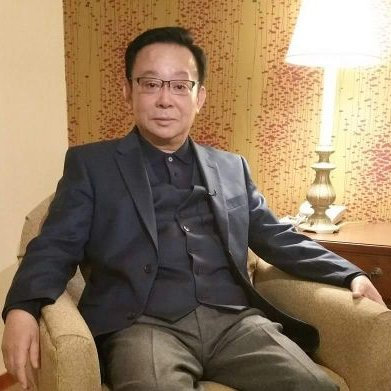
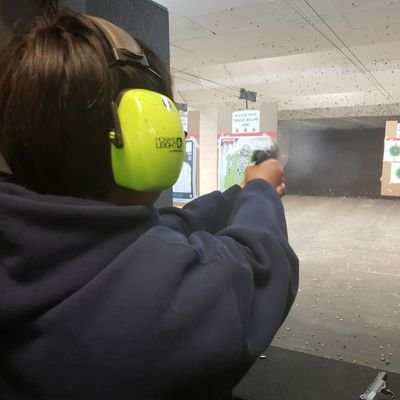
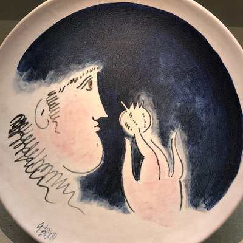
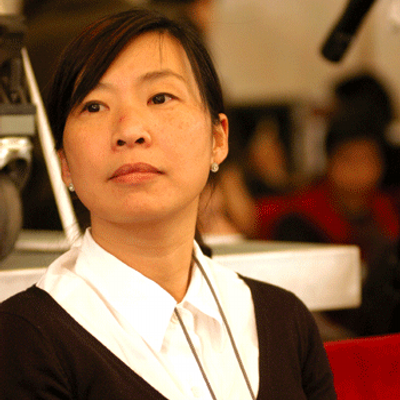
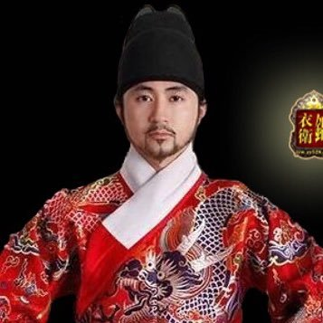

### Twitter

| **头像**                                                     | **账号**                                                     | **注册**    | **地址**          | **简介**                                                     | **网站**                                                     |
| :----------------------------------------------------------- | :----------------------------------------------------------- | :---------- | :---------------- | :----------------------------------------------------------- | :----------------------------------------------------------- |
|  | [Hu Ping胡平@HuPing1](https://twitter.com/HuPing1)           | 2010-05     | 美国，纽约        | 生于北京，长于四川，现居美国。66年高中毕业，文革时在自办小报转载遇罗克文章；69年下乡于攀枝花市郊区；73年返回成都。78年考取北大西方哲学史研究生。79年民主墙运动中发表论言论自由。80年参加竞选，当选为海淀区人民代表。87年赴美。曾任中国民联主席（88-91），先后主持中国之春与北京之春杂志，是中国人权执行理事。 | [huping.net](http://huping.net/)                             |
|  | [Lu,Dong 基督徒陸東@lu_dong1955](https://twitter.com/lu_dong1955) | **2017-05** | New York, USA     | 昔我失喪，今被尋回；昔日眼瞎變成火眼金睛。自2007年1月起，任紐約瑞山律師樓案件經理，分管投資移民，中國企業在美設立分公司，理工科碩士以上人才移民綠卡獨家解決方案。 電話（212）431﹣1100 地址： 401 Broadway, Room 806, New York, NY 10013 |                                                              |
|  | [Real 辛灏年@XHaonian](https://twitter.com/XHaonian/)        | 2017-06     |                   | a scholar                                                    |                                                              |
|  | [Vlog心声@2018xinsheng](https://twitter.com/2018xinsheng/)   | 2018-04     | shanghai          | 我叫劉大聖(刘大圣)，普通刚毕业大学生。YouTube频道:Vlog心声。苏州科技大学毕业，今年10月赴美旅游。我只是我，保持独立性，想啥说啥。视频日记我连续做了大半年/视频日记，记录人生/ Yahoo邮箱liu1109895772@yahoo.com感谢支持关心[http://paypal.me/likefreedom ](https://www.paypal.me/likefreedom/) | [Vlog心声 -- YouTube](https://www.youtube.com/channel/UCaPc9GRK9FoSyqM_c7-fDgw/) |
|  | [中国新闻中心 ChinaNewsCenter.com@1dpwcom](https://twitter.com/1dpwcom) | 2009-12     | United States     | 热门新闻转推评论。请举报假新闻。希望能够FO back. 定期UNFO没有FO的账号。FO我一般FO back。一些推是本站论坛成员发布，不代表本站观点。ifb[http://chinanewscenter.com ](https://t.co/YuE16HXOx5) | [bbs.chinanewscenter.com](http://bbs.chinanewscenter.com/)   |
|     | [何頻@nyhopin](https://twitter.com/nyhopin/)                 | 2017-05     | New York, USA     | 何频： 我們不是在叢林中遊戲，而是試圖建立媒體價值生態系統。 推特菜鳥（2017年3月24日），明镜老人（1991年1月1日） | [明鏡火拍 -- YouTube](https://www.youtube.com/channel/UCdKyM0XmuvQrD0o5TNhUtkQ/) |
|   | [何频@china2356](https://twitter.com/china2356/)             | 2018-01     |                   |                                                              |                                                              |
|  | [北美吹哥@brother_chui](https://twitter.com/brother_chui/)   | 2017-04     | California, USA   | 不要听他说了什么和说了多少！ 要看他做了什么和结果如何！      |                                                              |
|  | [川普中文同步推@Trump_Chinese](https://twitter.com/Trump_Chinese/) | 2018-09     | 美国              | 跟上美国总统川普的推特步伐，向全球华人及时展示美国总统川普的推文更新，了解川普推特治国理念！ |                                                              |
|  | [推特小红旗@XhnSoc_RedFlag](https://twitter.com/XhnSoc_RedFlag) | **2018-09** | 中国 北京         | 学习、讲习、研习，学习近平新时代中国特色社会主义思想，学习习近平总书记系列讲话，做符合社会主义核心价值观的守法公民！ |                                                              |
| @TwtVideoOfChina.jpg) | [推特影音中国(TVC)@TwtVideoOfChina](https://twitter.com/TwtVideoOfChina) | 2018-05     |                   | 呼唤良知，追求真相。共同推动中国的自由，民主，宪政》！ 请关注[https://t.me/TwtVideoOfChina6gd5Ev …](https://t.co/uA2Q2j8Srx) 向墙内传播！有任何要求建议请联系我： moniesoke@gmail.com。 谢谢大家的关注，支持，传播！ | [推特影音中国TVC -- YouTube](https://www.youtube.com/channel/UCILGEljvPJ70YJQQAkXhSvg/) |
|   | [曹山石@caolei1](https://twitter.com/caolei1)                | 2011-05     |                   | Email：caolei214@sina.com                                    |                                                              |
|   | [李方@lifang072](https://twitter.com/lifang072/)             | 2013-02     | Helsinki, Finland | 一个志愿者，民主的中国是我最大梦想。                         |                                                              |
|    | [流離@jtcg1988](https://twitter.com/jtcg1988)                | 2017-06     | U.S.A             | Speak not because it is safe, but because it is right. 說話並不是因為它是安全的，而是因為它是正確的。 |                                                              |
|  | [财经真相@caijingxiang](https://twitter.com/caijingxiang/)   | 2014-11     |                   |                                                              |                                                              |
|  | [闾丘露薇@roseluqiu](https://twitter.com/roseluqiu/)         | 2008-07     | Hong Kong         | Luwei Rose Luqiu, a former journalist , now an academic      | [roseluqiu.com](https://www.roseluqiu.com/)                  |
|  | [🐲千户锦衣卫🐲@Superxiajun](https://twitter.com/Superxiajun/) | **2017-05** | 🐲 Georgia, USA 🐲  | 蟒袍飞鱼服、无翅乌纱帽 ，金边虎皮靴、玲珑绣春刀，赫赫锦衣卫、威武震满朝！ 五毛统统拉黑！ |                                                              |

### 微博

| **头像**                                                 | **账号**                                               | **性别** | **生日**   | **地区**     | **注册**   | **简介**                                                     | **背景**                                                  | **博客**                                                     |
| :------------------------------------------------------- | :----------------------------------------------------- | :------- | ---------- | :----------- | :--------- | :----------------------------------------------------------- | :-------------------------------------------------------- | :----------------------------------------------------------- |
|       | [@nyouyou](https://weibo.com/p/1005051656918431/)      | 女       |            |              | 2009-10-28 | 自由自在 这是各种急救电话 83447/999/120                      | Princeton University 2000 》清华大学生物科学与技术系 1996 |                                                              |
|       | [@paingod](https://weibo.com/p/1005051433680664/)      | 男       |            | 北京市朝阳区 | 2010-01-22 | 浑水煮面了解一下。高考不是人生的全部。                       |                                                           |                                                              |
|      | [@SamheroY](https://weibo.com/p/1005051705615871/)     | 男       |            | 其他         | 2010-03-06 |                                                              |                                                           |                                                              |
|        | [@微天下](https://weibo.com/p/1002061893801487/)       |          |            |              | 公众号     | 24小时播报全球资讯，新浪新闻中心出品                         |                                                           |                                                              |
|  | [@歐陽娜娜Nana](https://weibo.com/p/1003062687827715/) | 女       | 2000-06-15 | 台湾台北市   | 2012-03-31 | 台灣女藝人/大提琴演奏家 歐陽娜娜 && 👼Welcome to Nana Ou-yang 's 微博 希望能用音樂帶大家快樂和感動。 工作联系：ninadiouyang@qq.com |                                                           |                                                              |
|    | [@谣言粉碎机](https://weibo.com/p/1002061838598957/)   |          |            |              | 公众号     | 果壳网谣言粉碎机主题站官方微博。                             |                                                           |                                                              |
|        | [@财新网](https://weibo.com/p/1002061663937380/)       |          |            |              | 公众号     | 财新网官方微博                                               |                                                           |                                                              |
|      | [@闾丘露薇](https://weibo.com/p/1035051189729754/)     | 女       |            | 香港         | 2009-08-28 | 上海出生成长，香港实现理想，成为一个媒体人，相信吵闹不可怕，沉默更可怕。热爱新闻，热爱网络。 |                                                           | [http://blog.sina.com.cn/luqiuluwei](http://blog.sina.com.cn/luqiuluwei/) |
