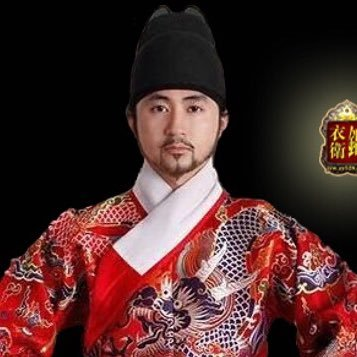
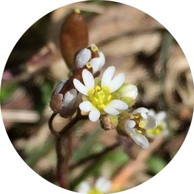

### Twitter

| **头像**                                                     | **账号**                                                     | **注册**    | **地址**          | **简介**                                                     | **网站**                                                     |
| :----------------------------------------------------------- | :----------------------------------------------------------- | :---------- | ----------------- | ------------------------------------------------------------ | ------------------------------------------------------------ |
|  | [Real 辛灏年@XHaonian](https://twitter.com/XHaonian)         | 2017-06     |                   | a scholar                                                    |                                                              |
|         | [何頻@nyhopin](https://twitter.com/nyhopin)                  | 2017-05     | New York, USA     | 何频： 我們不是在叢林中遊戲，而是試圖建立媒體價值生態系統。 推特菜鳥（2017年3月24日），明镜老人（1991年1月1日） | [明鏡火拍 - YouTube](https://www.youtube.com/channel/UCdKyM0XmuvQrD0o5TNhUtkQ) |
|       | [何频@china2356](https://twitter.com/china2356)              | 2018-01     |                   |                                                              |                                                              |
|  | [北美吹哥@brother_chui](https://twitter.com/brother_chui)    | 2017-04     | California, USA   | 不要听他说了什么和说了多少！ 要看他做了什么和结果如何！      |                                                              |
|  | [川普中文同步推@Trump_Chinese](https://twitter.com/Trump_Chinese) | 2018-09     | 美国              | 跟上美国总统川普的推特步伐，向全球华人及时展示美国总统川普的推文更新，了解川普推特治国理念！ |                                                              |
|       | [李方@lifang072](https://twitter.com/lifang072)              | 2013-02     | Helsinki, Finland | 一个志愿者，民主的中国是我最大梦想。                         |                                                              |
|  | [西域雄鷹@TiQ9O30b1qhw73O](https://twitter.com/TiQ9O30b1qhw73O) | 2017-09     |                   | 時事政治，分享國內及世界突發新聞與時評 強力支持中國民眾，剷除國內最大最惡的黑社會犯罪團伙 — 中國共產黨，推翻習共封建兲朝！ Strongly support the Chinese people and eradicate the largest and worst criminal gang as the CCP |                                                              |
|  | [财经真相@caijingxiang](https://twitter.com/caijingxiang)    | 2014-11     |                   |                                                              |                                                              |
|   | [闾丘露薇@roseluqiu](https://twitter.com/roseluqiu)          | 2008-07     | Hong Kong         | Luwei Rose Luqiu, a former journalist , now an academic      | [roseluqiu.com](https://t.co/s5Az1DFYhK)                     |
|  | [🐲千户锦衣卫🐲@Superxiajun](https://twitter.com/Superxiajun)  | **2017-05** | 🐲 Georgia, USA 🐲  | 蟒袍飞鱼服、无翅乌纱帽 ，金边虎皮靴、玲珑绣春刀，赫赫锦衣卫、威武震满朝！ 五毛统统拉黑！ |                                                              |

### 微博

| **头像**                                         | **账号**                                              | **性别** | **地区** | **注册**   | **简介**                                                     | **背景**                                                  | **博客**                                                     |
| :----------------------------------------------- | :---------------------------------------------------- | -------- | -------- | ---------- | ------------------------------------------------------------ | --------------------------------------------------------- | ------------------------------------------------------------ |
|   | [@nyouyou](https://www.weibo.com/p/1005051656918431/) | 女       |          | 2009-10-28 | 自由自在 这是各种急救电话 83447/999/120                      | Princeton University 2000 》清华大学生物科学与技术系 1996 |                                                              |
|    | [@微天下](https://weibo.com/p/1002061893801487/)      |          |          | 公众号     | 24小时播报全球资讯，新浪新闻中心出品                         |                                                           |                                                              |
|    | [@财新网](https://weibo.com/p/1002061663937380/)      |          |          | 公众号     | 财新网官方微博                                               |                                                           |                                                              |
|  | [@闾丘露薇](https://weibo.com/p/1035051189729754/)    | 女       | 香港     | 2009-08-28 | 上海出生成长，香港实现理想，成为一个媒体人，相信吵闹不可怕，沉默更可怕。热爱新闻，热爱网络。 |                                                           | [http://blog.sina.com.cn/luqiuluwei](http://blog.sina.com.cn/luqiuluwei?from=inf&wvr=5&loc=infblog) |

### 线索

| **头像**                                                     | **账号**                                                     | **注册** | **地址**       | **简介**                                                     | **网站**                                                     |
| :----------------------------------------------------------- | :----------------------------------------------------------- | :------- | -------------- | ------------------------------------------------------------ | ------------------------------------------------------------ |
|  | [Vanessa 姗@Vanessa_ZhangUK](https://twitter.com/Vanessa_ZhangUK) | 2017-05  | United Kingdom | 假如这个世界堕入黑暗，那么，吹灭最后一盏灯的，不是坏人的嚣张气焰，而是好人的忍气吞声。和大家一起，传播真相。 |                                                              |
|  | [黄子茵 雾亭 🗽@wutingzy](https://twitter.com/wutingzy)       | 2016-12  |                | China Issues 三种罪 统治别人 接受统治 和帮助统治 对统治者三不 不合作 不承认 不上当 中国人的事情 只有中国人努力 才有希望 自救者得救 团结或死亡 [#全民共振](https://twitter.com/hashtag/%E5%85%A8%E6%B0%91%E5%85%B1%E6%8C%AF?src=hash) [#全民立约](https://twitter.com/hashtag/%E5%85%A8%E6%B0%91%E7%AB%8B%E7%BA%A6?src=hash) 共振交流群 [https://t.me/QMGZ2019 ](https://t.co/lBtPGl6yrv) 共振电报频道 [https://t.me/QMGZ2018 | [雾亭黄子茵 - YouTube](https://www.youtube.com/channel/UCFjKZM-6dADQG1CXNjzac2A) |
