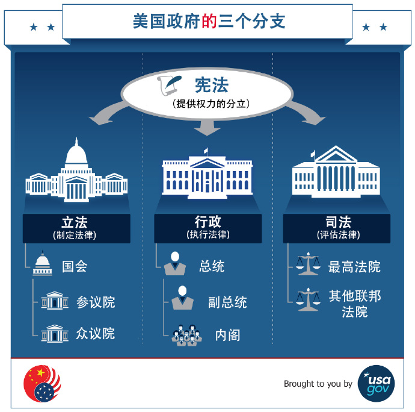

***在冲突的边境修墙，在不冲突的边境不修墙。***

***心烦意乱是魔鬼。***

``` NOTICE
我在避免创造第二个共产主义；
我也在避免成为第二个刘晓波。
别跟我谈爱国，你国并不爱你！
教育医疗养老，你还想要什么？
```

## 顺其自然即为美

[TOC]

### 谆谆教诲

``` NOTICE
一只在温水里泡澡的青蛙，
在它被烫熟前还会呱呱叫。
```

### 郑重声明

``` NOTICE
我反对法律，但我不是法律学家；
我参与政治，但我不是政治学家；
我关注经济，但我不是经济学家；
我研究历史，但我不是历史学家；
我整理知识，站在巨人的肩膀上；
我就是我，在我的地盘就听我的。
```

### 关于作者


`` @_@ 蓝色是生死恋
姓名：黄志贵
拼音：Huáng ZhìGuì
性别：男
民族：汉族
宗教：无信仰
理想：天文学家
身份：440882199308051156
公历：1993年09月05日（处女座）
农历：一九九三年七月十九日（属鸡）
籍贯：中华人民共和国广东省湛江市海康县（1994年04月改立雷州市）
本科：广东工业大学计算机学院计算机科学与技术专业2016届
肄业：中国科学院新疆天文台天体物理专业2019届
党派：原中国共产党党员
手机: +86-13611464445（广州移动）
电邮：brilliantstarrysky9395@gmail.com
住址：中国广东省湛江市经济技术开发区园乐苑北区一巷33号702房
``

### 公理化人类社会之框架

``` NOTICE
最好的政治，就是无政治；
最好的经济，就是无经济；
最好的政府，就是无政府；
最好的我们，就是不青春。
```

本公理化人类社会满足以下框架性特征：

1. 社会公理取代法律，灵活性优于法律；
2. 社会契约取代经济，适用性广于经济；
3. 社会角色取代职业，专门性弱于职业；
4. 社会信用评价系统，完全无政府状态；

### 公理化人类社会

#### 社会公理系统

数学公理系统简洁而优美，具有非常优良的性质，因此一个自然而然的想法就是仿照数学公理系统建立社会公理系统。但与自然科学追求严谨和完美不同，社会科学是描述性的而非公式化的，可以定性分析但却无法达到类似于定量分析的精确程度。对于社会公理系统来说，数学公理系统的3个基本性质显然过分严苛，一个可正常运作的社会公理系统只需要满足3个基本性质：

1. 自洽性 <= 自洽性 // 「自洽性」要求社会公理系统内部和谐一致不会出现矛盾。
2. 系统性 <= 独立性 // 「系统性」要求社会公理系统整体结构层次以及含义清晰。
3. 合理性 <= 完备性 // 「合理性」要求社会公理系统能合理解决所有已知的问题。

#### 社会基本形态

马克思（德语：Karl Marx，1818年~1883年）主义经典学说认为，社会基本形态的更迭由低级到高级必然历经五个阶段，即原始社会>>奴隶社会>>封建社会>>资本主义社会>>共产主义社会，社会主义社会是共产主义社会的初级阶段，共产主义社会是人类社会的最高社会形态，但到目前为止还没有任何国家宣称已经步入共产主义社会。

~~~~~~~~~~~~~~~~~~~~~~~~~~~~~~~~~~~~~~~~~~~~~~~~~~~~~~~~~~~~~~~~~~~~~~~~~~~~~~~~
共产主义社会的基本特征：
01 [社会] 社会生产高度发展，物质产品极大丰富。
02 [公有] 消灭生产资料私有制，实现生产资料公有制。
03 [生产] 社会按计划组织生产，个人消费品按需分配。
04 [劳动] 旧式生产分工被消除，劳动成为生活的第一需要。
05 [阶级] 社会阶级彻底消灭，国家政府完全消亡，代以自由人联合体。
06 [和谐] 社会关系高度和谐，人的精神高度升华。
07 [自由] 个人自由而全面发展，全人类得到彻底解放。
~~~~~~~~~~~~~~~~~~~~~~~~~~~~~~~~~~~~~~~~~~~~~~~~~~~~~~~~~~~~~~~~~~~~~~~~~~~~~~~~

马克思主义认为，人类社会由资产阶级（即逐利的资本家，指那些拥有生产资料的人）和无产阶级（即被剥削的工人，指那些靠出卖劳动力的人）这两大对立社会阶级构成，社会阶级斗争是人类社会发展的直接动力，社会基本矛盾是人类社会发展的根本动力。人类社会以往的全部历史，除原始社会以外，全都是社会阶级斗争的历史，社会基本矛盾主要通过社会阶级矛盾表现出来，社会革命与社会改革是解决阶级社会基本矛盾的主要方式。然而，要实现共产主义社会，就必须废除私有制，但私有制不是说废除就能废除的，只有当社会生产高度发展，才有可能废除私有制，这必然将经历一个极其艰难而漫长的历史过程。除此之外，人们精神境界极大的提高，以及每个人自由而全面的发展，都需要一个长期的历史过程。继承自马克思主义的列宁（俄语：Влади́мир Ильи́ч Улья́нов，1870年~1924年）主义主张，借助工人运动进行暴力革命，通过武装暴动夺取国家政权，推翻资产阶级民主并实行无产阶级专政，而且这是实现社会主义的唯一途径。

~~~~~~~~~~~~~~~~~~~~~~~~~~~~~~~~~~~~~~~~~~~~~~~~~~~~~~~~~~~~~~~~~~~~~~~~~~~~~~~~
社会主义的集权专制本质：
01 武装暴力革命！ // 发动无产阶级武装暴动来夺取国家政权。
02 社会阶级斗争！ // 将导致社会内部出现盲目而无谓的虚耗。
03 无产阶级专政！ // 将导致社会主义国家更倾向于专制政府。
~~~~~~~~~~~~~~~~~~~~~~~~~~~~~~~~~~~~~~~~~~~~~~~~~~~~~~~~~~~~~~~~~~~~~~~~~~~~~~~~

马克思主义认为，社会阶级斗争是社会生产发展在特定历史阶段的产物，无产阶级专政是为消灭一切社会阶级，从而进入共产主义社会的过渡阶段。当社会生产高度发展之时，社会阶级将彻底消失，国家与政府将随之自行消亡，作为社会阶级统治工具的军队/警察/监狱等暴力机器将失去作用，自由人联合体将取代国家与政府执行社会管理职能，但不再具有政治压迫和暴力镇压的性质。总之，共产主义尝试最终建立一个无社会阶级而且无国界的公有制社会，共产主义社会是十分美好的理想社会，其前途是光明的，但道路是漫长而曲折的。中国共产党作为中国唯一合法的马克思主义执政党，其最低革命纲领是建设中国特色社会主义，其最高革命纲领是实现共产主义。


与生产资料由社会直接占有相适应，共产主义社会的生产不再由价值规律的自发作用和市场价格的变动来调节，而是社会按照自然资源的情况和社会成员的需要，自觉地建立起社会生产和社会需要之间的平衡，对生产进行有计划的组织和管理。这样，就完全克服了由资本主义基本矛盾的尖锐化造成的整个社会生产的无政府状态。同时，由于全社会占有生产资料和共同组织生产，以及共同分配产品，个人劳动与社会劳动/个人利益与社会利益达成了直接统一，全体社会成员的劳动在全社会范围内成为直接的社会劳动，他们之间的互相交换活动不再通过交换劳动产品的形式来实现。于是，以交换价值为基础的生产便会崩溃，商品与货币将自然地退出历史舞台。

~~~~~~~~~~~~~~~~~~~~~~~~~~~~~~~~~~~~~~~~~~~~~~~~~~~~~~~~~~~~~~~~~~~~~~~~~~~~~~~~
苏联式社会主义计划经济的弊端：
01 资源分配无效率；
01 无法提供足够的商品；
02 共产党员利用职权谋取私利，腐败以及不公平；
03 严重落后于资本主义经济； // 社会主义经济严重落后于资本主义经济。
04 严格管控言论，没有个人自由； // 新技术的发展使政府更难遏制有悖于执政党利益的信息和思想。
05 // 长期的民族差异和文化差异破坏了社会形成国家共识的能力；
~~~~~~~~~~~~~~~~~~~~~~~~~~~~~~~~~~~~~~~~~~~~~~~~~~~~~~~~~~~~~~~~~~~~~~~~~~~~~~~~

大部分东欧社会主义国家完全放弃苏联模式的社会主义，其他社会主义国家比如中国，则尝试将市场机制融入社会主义制度，实行部分市场经济。朝鲜经常发生物资短缺和饥荒。


~~~~~~~~~~~~~~~~~~~~~~~~~~~~~~~~~~~~~~~~~~~~~~~~~~~~~~~~~~~~~~~~~~~~~~~~~~~~~~~~
国家资本主义的基本特征：
01 [私有] 生产资料私有制；// 个人拥有土地/机器/工厂
02 [市场] 放任市场竞争；  // 与市场其他参与者竞争，各自决定要生产的产品及其价格 // 所有者在竞争的基础上决定产品和价格
03 [利润] 追逐利润；      // 以高于物品价值的价格出售商品 // 分配商品和服务的目的是追求利润
04 [政府] 政府干预市场的运作。 // 非自由放任资本主义
~~~~~~~~~~~~~~~~~~~~~~~~~~~~~~~~~~~~~~~~~~~~~~~~~~~~~~~~~~~~~~~~~~~~~~~~~~~~~~~~

市场决定生产和价格。
政府决定生产和价格。

先富带动后富，最后达到共同富裕。

在社会主义体制中，对于任何的经济变革，既不能提前预测它是否能取得成功，也不能通过回顾来判定它是否成功。一切都只是在黑暗中摸索罢了。

社会主义要求消除竞争，因为商品是按照预定价格出售的，而与产品需求或生产成本无关。利润并不是其目标，在低需求期通过降价鼓励消费以及在供应紧张期通过涨价限制消费也都不是其目标。相反，其目标是为公共福利生产物品，并按照人们的需要而不是其支付能力来分配。

虽然社会主义的意识形态要求资源按照资源需要而不是按照支付能力进行分配，但是社会主义国家发现，为某些工作提供较高的收入是十分必要的，只有这样，才能使有能力的人更具有责任心。努力缩小巨大的收入差距是资本主义国家的特征，但社会主义国家却出现了更大的收入不平等。

由于一方面不满资本主义的贪婪和剥削，另一方面不满社会主义中自由和个性的缺乏，瑞典和丹麦发展了民主社会主义（福利社会主义）。在这种形势的社会主义中，国家和个人都在生产、分配商品和服务。政府拥有和管理钢铁、矿产、森林和其他能源，也包括全国的电话、电视台和航空业。私人则拥有零售店、农场、工厂和大部分服务业。

资本主义与社会主义的趋同性，中国，资产的拥有者被允许加入中国共产党。

美国已经借鉴了很多社会主义国家的实践经验。一个最明显的变化是从一些人手中收取资金来补偿另一些人。其中包括失业金（工业者缴纳的税被分配给不再创造利润的人）；住房、食品和医疗补贴（由许多人提供给那些穷人和老人，而不计利润）；福利（把收的税金分配给需要者）；最低工资（政府，不再是雇主，决定工人的最低工资）；社会保障（退休者拿到的不是自己交付的资金，相反，政府将从在职者中收取资金对他们进行补偿）。


实现人人平等是社会主义核心价值观。但是社会主义的平等是在整个社会平均分配财富。在社会主义制度下，人与人之间也几乎同样贫穷。

中国的资本主义运作效率似乎高于西方资本主义国家。这个国家的领导利用国有机制，更机敏地面对国际竞争，准确地把握发展时机，为国家积累了大量财富。

今天，只有少数几个共产主义国家（古巴、中国、老挝、越南以及朝鲜）依然存在，许多经济学家都以苏联解体和中国经济的自由化来证明马克思主义理论存在严重缺陷。

越来越多的人对共产主义产生怀疑，因为与马克思那个时代相比起来，现在没有任何迹象表明资本主义将会坍塌。由此看来，马克思关于资本主义活力导致经济危机和革命的理论是错误的。

马克思认为，在社会主义经济体中，生产资料（如工厂）归国家集体所有。竞争是一种浪费。

在社会主义体制下，生产资料归国家所有，没有了私有制和竞争，市场就失去了高效生产所需的信息和激励机制。

现代经济的生产非常复杂，如果要对经济进行计划，必须要有市场价格提供的相应信息，而市场价格则是多个生产者为了各自利益相互竞争而产生的。我们需要通过价格和利润来判断市场的需求并引导投资。

货币的价值是以市场价格为基础的。在社会主义体制中，这些物品的真正货币价格已经不存在了，它们的价值由国家设定。

除了运用货币价格作为统一的单位来评估之外，资本主义体系下的经济计算还有两个优点。第一，市场价格会自动反映出贸易双方的估价；第二，市场价格可以反映出生产工艺的技术可行性和经济可行性。生产商之间的竞争意味着只有利润最高的生产工艺才会被人们选择。

当时，社会上对政府干预和中央计划的热情正逐步高涨，哈耶克认为，所有试图将集权命令强加于社会的努力注定将会失败，它们最终会把社会引向集权的法西斯主义或斯大林共产主义。由于任何计划都会违反市场的自发秩序，因此它只有在某种程度的强迫或政治高压下才会起作用。政府制订和执行的计划越多，需要的强制就越多。而政府并不了解市场运作的细节，导致无法实现既定的目标，为弥补这些失败，政府将变得越来越专制。从这一点来说，无论计划制定者最初的目标多么适度，这个社会都将逐渐走向集权，所有的自由将不复存在。

伴随着共产主义在东欧的失败，各种不同形式的混合经济取代了东欧的计划经济。与此同时，一些共产主义国家也开始引入改革。在中国，邓小平将自由市场经济的元素引入了中央计划经济，称之为“有中国特色的社会主义市场经济”。其目的是促进经济增长，并提高国家的国际竞争力。今天，虽然中国的经济与欧洲社会市场模式相距甚远，但是它已经朝着混合经济发展并取得了巨大的进步。

社会市场经济，北欧模式：
所谓的北欧模式因其慷慨的福利体系和公平分配财富的承诺而独具特色。这些国家通过高税收和大量的公共支出达到上述目的。它们人口很少但却有许多强大的企业，因此人们生活水平很高，经济增长强劲。


时至今日，世界上的经济体系大多是市场经济体系和混合经济体系。但仍有部分国家如古巴（现已宣布进入市场化的改革）、朝鲜、委内瑞拉、老挝采用计划经济。

如果有某个人或者相对小规模的机构，能完全知道社会中每个人对所有物品的需求强度，然后根据这些强度总和迅速反应，精确的分配所有资源、人力、财力进行各种所有物品生产，这样理想状态下的计划经济，的确是所有经济形态中最高效的。但当然，显而易见的，这个人或者这个小规模机构在人类可预见的将来都是不可能存在的，算上家庭这种极小的人口经济体才可以勉强达到计划经济的理想状态，甚至许多父母对家庭成员都做不到这样的分配，而且家庭团体扩张下会更困难，而社会也是如此。所以现实上的计划经济，最明显的表现就是低效率社会资源分配，与造成显而易见的产能失调。而这还是私有化的状态，如果资产彻底公有化更会导致生产力大幅下降与资源的过度浪费。

01 资源分配无效率

微观资源无法有效分配，是计划经济里最受批评的要点。因为国家所有资源都由政府决定，私人不掌握生产资料，于是乎国家可以罔顾私人的实际需要而进行经济计划。奥地利经济学派的路德维希·冯·米塞斯主张社会主义在经济上必然会失败，因为经济计算问题（economic calculation problem）注定了政府永远无法正确的计算复杂万分的经济体系。只要缺乏了价格机制，社会主义政府根本无从得知市场需求的情报，而随之而来的必然是计划的失败和经济的彻底崩溃。

02 缺乏积极进取的诱因

即使政府有效率的分配了资源，但计划经济下的效率通常还是低落的，主因是经济决策缺乏私人参与，而是由政府一个全权决定。即是说，计划经济下缺少私人竞争。缺少私人竞争，就难以有效提高效率，以至价格也不能通过竞争而有所调整，个人的收益或物质回报也无从改变。个体的努力并没有相应的物质回报，反而个体的怠惰无能的经济仍然能得到整体平均的物质回报，由整体来共同承担怠慢，共同享受努力的成果，从而演变成为平均主义。这便使得计划经济下的微观个体缺乏积极进取、争取效率的诱因。因此发展缓慢，如苏俄开始在1980年代技术落后美国，尽管武器产量差不多甚至更高，却无法带动足够的创新，庞大的总体国力也停滞不前了，直到21世纪后才开始复苏成长。 这也是中国1978年决定开始改革开放，1992年建设社会主义市场经济体制的重要因素之一。

03 减少个人自由

计划经济意味着经济活动多由政府决定，而不是个人决定，个人的经济决策自由就被牺牲。对于重视个性化的消费者，这造成负效用。经济决策上的个人自由被压抑有可能进一步导致其他领域的自由被破坏。

04 寻租/不公平/腐败

计划经济下政府拥有管制生产活动的权力，官员便因此得以利用管制权力从中获利。这种获利的型态，有的是非法贪污、有的是合法但不合理的规费税捐，也有的是政策选定重点发展的对象以外被牺牲的弱势者的利益。这些原本应属于社会大众的共同利益，因为计划管制的关系而落入政府或官员私人的手里、或是不公平的剥削。这不但妨碍了资源的公平运用、扭曲经济发展的规律，也形成特权阶级，产生社会矛盾，甚至冲突。 市场经济体制的合法剥削和高层腐败也因为类似的原因产生。

05 易造成均贫现象

易造成均贫现象（实质是奢侈消费品不足、经济落后而非资本主义的贫富分化）、在经济落后的条件下可能造成政治经济体系崩溃。例如苏联解体。


斯大林主义主要体现在：

高度集中的、指令性的计划经济体制模式：以国有企业为代表的全民所有制，以集体农庄为代表的集体所有制。
高度集权的政治制度：贯彻民主集中制原则，权力高度集中于中央，集中于党中央的最高机构政治局、书记处。党政合一，党国合一；实行不受法律限制的无产阶级专政。自上而下的干部任命制：共产党不仅领导一切，而且通过垄断国家机关干部人事任免，直接发布政令，管理国家事务。
文化思想的专制统治：党政府严密控制与官方思想相左的思想，并全面掌握思想文化领域的管理权，对思想文化领域实行集中领导。党和国家的宣传教育部门对思想文化产品实行严格的审查和管制，要求全党和全体国民在思想和政治上与党中央保持高度一致。


取决于市场与政府之间的关系，被称为资本主义的经济体通常可以被分为三种：第一种是完全自由市场和自由放任的资本主义，市场被允许进行自由的竞争，而政府的干预则被最小化。第二种则是干预主义经济和混合经济，市场仍然扮演主要的角色，然而政府以不同的程度介入市场，企图矫正市场失灵、提供社会福利、保存生态资源等等。第三种则是国家资本主义，在这种体制下政府大量倚赖国有企业并且对市场进行广泛的干预和控制。然而，如果政府干预的程度远远高过私人的决策部分，那么这种经济通常被称为计划经济，而不是资本主义。

**我睡觉了。。**

#### 政府与权力



美国的囚犯数量不仅比其他国家多，而且也是罪犯数量占人口比重较大的国家。换种说法来看，（2013年），美国的人口占世界总人口的5%，但其犯罪人口占世界总犯罪人口的25%。

从1970年到2011年，美国人口增加了52%，然而监狱犯人数增加了715%，增速是人口增速的14倍。如果犯人数同美国人口的增长比率一样，那么犯人数将达到29.8万人，是美国今天人口的五分之一。假如美国人口的增速同犯人数的增速一样，那美国人口将达到14.65亿人，比中国的人口还多。

20世纪80年代暴力犯罪急剧增加。美国人感到越来越恐惧，要求法律制定者必须做点事。政治家们听到了这种呼声，于是通过了一项“三次犯法即重判”的法律。即任何一个被判三次重罪的人将会受到一种自动生效的强制规定的判刑。一些强制判刑包括终身监禁，法官不必考虑当时当地的具体情况。尽管很少会有人会对一个犯三次强奸罪的人或者一个犯三次谋杀案的人被终身监禁感到同情，但是为尽快安抚人心的政治家并没有把这种法律限定于暴力犯罪。

伴随着这些变化，犯罪率急剧下降。


墨西哥现在就出现了这样的情形。

墨西哥政府从地方到国家各个层次都无法正常发挥功能。自从坏人，主要是大毒枭，有较多的控制权后，市民就陷入恐惧之中。这些毒枭渗透到从地方到国家的警界之中。甚至墨西哥禁毒局负责人都在大毒枭的工资单上。本来是打击毒品交易的军队，收取钱财后则去保护毒品交易。他们甚至动用军队交通工具去贩毒。这样的腐败已超出了想象，甚至深入到总统驻地。

被抓捕的人无数，被警察和军队射杀的毒贩数以千计。死亡人数不断攀升，现在死亡的警察、毒贩和普通市民超过了6万人。

结果，除了造成更多的人死亡还有什么别的吗？国家并没有保障人民的安全。

墨西哥人民于是开始自己掌握法律。在格雷罗州，乡下居民拿起自己的猎枪，戴上面罩，突袭毒贩子的家，把毒贩子关进临时监狱。他们还在进入自己小镇的路上设置路障。他们不让任何毒贩子或生人进镇。他们甚至不让联邦警察、州警察或者军队进镇。他们说，这些法律的执行者太腐败了。我们只能相信一起成长的邻居。

地方警察对此的诚实反应是如何的呢？“也许这些居民能就这个问题做些事。我们不能。如果我们去做了，毒贩会去我们的家并杀死家人。他们不知道这些戴面罩的人是谁。”

国家政府又有怎样的反应呢？“干得好！”

普通居民有什么反应呢？如释重负。很高兴自己又能夜晚外出，喝点龙舌兰酒或者在镇广场上跳舞。

这些戴面罩的男人要进行自己的审判。他们到现在还没有让任何人感到不安。但接下来他们怎么做？他们把自己审判后的人送到监狱里也不好，狱警和行政官都是腐败警察。在墨西哥帕拉西奥戈麦斯镇的一个监狱里，监狱行政官甚至给犯人配备枪支和汽车，还会让犯人外出去杀死敌对帮派的成员。之后，外出的犯人回到监狱，交还汽车和枪支，回到自己的牢房中去。我知道这让人难以置信。但这是真的。


~~~~~~~~~~~~~~~~~~~~~~~~~~~~~~~~~~~~~~~~~~~~~~~~~~~~~~~~~~~~~~~~~~~~~~~~~~~~~~~~
热力学第二定律：
不可能从单一热源吸收热量，使之完全变为有用功而不产生其他影响。

熵增加原理：
热力学系统从一平衡态绝热地到达另一平衡态的过程中，它的熵永不减少。若过程是可逆的，则熵不变；若过程是不可逆的，则熵增加。
~~~~~~~~~~~~~~~~~~~~~~~~~~~~~~~~~~~~~~~~~~~~~~~~~~~~~~~~~~~~~~~~~~~~~~~~~~~~~~~~

随着时间推移，任何国家都将变得富有。

#### 社会心理

**关于从众和服从的实验**

1. 谢里夫的规范形成研究
2. 米尔格拉姆的服从实验

从众即由于群体的压力而改变个体自己的行为或信念，其表现形式有两种。
顺从是迫于外部压力而与群体趋同但内心并不赞同；
服从是顺从的一种，是指对直接命令的顺从。
接纳是指内心认可社会压力并在行动上保持一致。

**关于权威**

**关于民主这个概念，我一直想说，民主大概和专制是一对反义词，民主/专制是和政府联系在一起的。有政府才有民主/专制，没有政府也就没有民主/专制。**

#### 社会公理

公理/法律

贡献/危害

~~~~~~~~~~~~~~~~~~~~~~~~~~~~~~~~~~~~~~~~~~~~~~~~~~~~~~~~~~~~~~~~~~~~~~~~~~~~~~~~
辛普森案件

人类历史上最广为人知的犯罪案件：橄榄球明星、演员兼体育评论员辛普森（O. J. Simpson）被指控残忍地谋杀了与他不合的妻子以及一名与他妻子相熟的男子。起诉人认为证据确凿：辛普森的行为属于长期虐待合暴力恐吓配偶。通过血液检验，证实他的血液出现在犯罪现场，而受害者的血液出现在他的手套、汽车甚至卧室里的袜子上。在谋杀案发生的当天晚上，他开车离开；当要逮捕他时他又仓皇出逃。检察官说，这更加大了他的犯罪嫌疑。

辛普森的辩护律师认为，种族偏见可能为那些声称在辛普森的家中发现了带血手套的警官提供了动机；他们还认为，辛普森不可能接受公正的审判。这些审判员————其中有10为女性————会公正地对待这个涉嫌虐待和谋杀妇女的人吗？他们会在多大程度上忽略审判前那些易于导致偏见的公开报道，而去注意法官的指示呢？

这一案例向我们揭示了社会心理学实验中研究过的一些其他问题：
01 犯罪现场没有目击者。目击者证词的影响力有多大？目击者回忆的可信度有多高？怎样才算是一个可信的目击者？
02 辛普森是一个英俊、富有、广受倾慕的名人。陪审员们真的能够像他们应该做到的那样，忽略被告的吸引力和社会地位吗？
03 陪审员们对那些重要信息（比如DNA测试中的统计概率）的理解是否充分？
04 该案例中的陪审团成员大部分由女性和黑人组成，当然也包括两名男性，还有一位西班牙人和两位非西班牙裔的白人，在接下来的对辛普森索赔案的民事审判陪审团中由9名白人。陪审员的这些特征会使他们的判决产生偏差吗？如果会，律师们能否利用挑选陪审员的程序，组成一个符合自己意愿的陪审团呢？
05 在这类案例中，12名陪审员做出判决前要慎重讨论。讨论期间，陪审员之间会怎样相互影响呢？少数派会赢过多数派吗？12名陪审员得出的结论会和6名陪审员的结论一样吗？
~~~~~~~~~~~~~~~~~~~~~~~~~~~~~~~~~~~~~~~~~~~~~~~~~~~~~~~~~~~~~~~~~~~~~~~~~~~~~~~~


~~~~~~~~~~~~~~~~~~~~~~~~~~~~~~~~~~~~~~~~~~~~~~~~~~~~~~~~~~~~~~~~~~~~~~~~~~~~~~~~
目击者的证词是否可靠？

01 在数百项实验中，社会心理学家发现目击者证词的准确性会受一系列因素的干扰，这些因素包括人们形成判断和记忆的方式。
02 有些目击者在表达时更加自信。尽管自信实际上只是目击者的个人特质，并不代表信息的可行性，但是人们还是倾向于相信那些自信的目击者。
03 人眼并非摄像机，它易受光线、角度的改变以及其他变化的影响，从而损害人们对嫌疑犯面部指认的精确性。
04 当把错误的信息呈现给目击者时，误导信息效应就会使目击者把错误的信息认为是正确的。
05 当一系列犯罪事实不停地被重复时，错误就可能悄悄地潜入并被目击者所接受，且被认为是真实的记述。
06 为了减少这样的错误，我们建议面询者不要打断目击者的陈述，并鼓励目击者想象当时的情境以及自己的情绪状态。
07 训练陪审团对目击者证词的分辨力可以改善证词的接收方式，最终提高证词的正确性。
~~~~~~~~~~~~~~~~~~~~~~~~~~~~~~~~~~~~~~~~~~~~~~~~~~~~~~~~~~~~~~~~~~~~~~~~~~~~~~~~


~~~~~~~~~~~~~~~~~~~~~~~~~~~~~~~~~~~~~~~~~~~~~~~~~~~~~~~~~~~~~~~~~~~~~~~~~~~~~~~~
影响陪审团判断的其他因素

01 通常，案件的事实有足够的说服力，它能使陪审团放弃偏见给出一个公正的判决。然而，当证据模糊时，陪审团往往倾向于用他们先入为主的偏见来解释案件，并对有吸引力或者与自己相似的被告表现出同情。
02 当陪审团接触到破坏性的审讯前公开报道或不被允许的证据时，他们会听从法官的指示将其忽略吗？在模拟审讯中，法官的命令有时是被遵守的，但当法官的劝诫出现在印象形成以后，则通常不会被遵守。
03 研究者还研究了其他因素的影响，如可能判决的严重性受害者的特征等。
~~~~~~~~~~~~~~~~~~~~~~~~~~~~~~~~~~~~~~~~~~~~~~~~~~~~~~~~~~~~~~~~~~~~~~~~~~~~~~~~


~~~~~~~~~~~~~~~~~~~~~~~~~~~~~~~~~~~~~~~~~~~~~~~~~~~~~~~~~~~~~~~~~~~~~~~~~~~~~~~~
影响陪审团判断的其他因素

01 通常，案件的事实有足够的说服力，它能使陪审团放弃偏见给出一个公正的判决。然而，当证据模糊时，陪审团往往倾向于用他们先入为主的偏见来解释案件，并对有吸引力或者与自己相似的被告表现出同情。
02 当陪审团接触到破坏性的审讯前公开报道或不被允许的证据时，他们会听从法官的指示将其忽略吗？在模拟审讯中，法官的命令有时是被遵守的，但当法官的劝诫出现在印象形成以后，则通常不会被遵守。
03 研究者还研究了其他因素的影响，如可能判决的严重性受害者的特征等。
~~~~~~~~~~~~~~~~~~~~~~~~~~~~~~~~~~~~~~~~~~~~~~~~~~~~~~~~~~~~~~~~~~~~~~~~~~~~~~~~


~~~~~~~~~~~~~~~~~~~~~~~~~~~~~~~~~~~~~~~~~~~~~~~~~~~~~~~~~~~~~~~~~~~~~~~~~~~~~~~~
影响个体陪审团的因素

01 社会心理学家不仅对目击者、法官、陪审员之间的相互影响感兴趣，而且也对陪审员的内心和他们之间的关系感兴趣。一个重要的问题就是陪审员对证据的理解，尤其是当证据包含了表明某个人犯罪的可能性的统计信息时。
02 出庭辩护律师往往利用陪审团顾问，帮助他们选择有利于自己的陪审团。例如，那些了解审讯前宣传的陪审员可能会被取消资格。
03 在那些用到死刑判决的案件中，律师可以取消任何原则上反对死刑判决的潜在陪审员的资格。社会心理学的研究表明，这本身就产生了一个带有偏见的陪审团，不过，最高法院已经这样做了。
~~~~~~~~~~~~~~~~~~~~~~~~~~~~~~~~~~~~~~~~~~~~~~~~~~~~~~~~~~~~~~~~~~~~~~~~~~~~~~~~


~~~~~~~~~~~~~~~~~~~~~~~~~~~~~~~~~~~~~~~~~~~~~~~~~~~~~~~~~~~~~~~~~~~~~~~~~~~~~~~~
群体因素对陪审员的影响

01 陪审员是一个群体，影响其他类型群体的那些力量也会使它们摇摆不定。例如，陪审团中最聒噪的成员往往说得最多，而较安静得成员基本保持沉默。
02 在审议过程中，反对意见有可能变得更加确定、更加极端化。
03 尤其当证据不足以给罪犯定罪时，审议过程会使陪审员变得比开始时更具宽容化。
04 12人制得陪审团是源于英国普通法律得一种传统。研究者发现这一规模允许陪审员之间存在合理得差异，允许他们的意见和取向的混合，以及能使他们更好地回忆审判的信息。
05 研究者对美国最高法院近年来允许小型陪审团和非一致性意见决定的陪审团的设想进行了检验，并提出了质疑。
06 模拟陪审团毕竟不是真实的陪审团。但是，就像社会心理学所有实验一样，有关陪审团的实验室实验，有助于我们建构用来解释更加复杂的日常生活世界的理论和规律。
~~~~~~~~~~~~~~~~~~~~~~~~~~~~~~~~~~~~~~~~~~~~~~~~~~~~~~~~~~~~~~~~~~~~~~~~~~~~~~~~


#### 社会契约


契约/合同/协议/经济/阶级

摘录：

长期的公平

认为友谊和爱情植根于公平交换回报之上很愚蠢吗？难道我们有时候在满足爱人需要时没有考虑任何回报？确实，那些处于公平的长期关系中的人并不在乎短期的公平。克拉克和米尔斯认为，人们甚至会努力避免算计交换的利益。当我们帮助一个好朋友的时候，我们并不在意马上获得回报。如果有人请我们吃了饭，我们会过一阵子才向这个人发出回请，以免让他认为，对他的回请只是对社交债务的偿还而已。什么是真正的友谊呢？就是人们在几乎不可能得到回报的时候也会去帮助朋友。与此类似，幸福的夫妻是不会斤斤计较自己付出几许，收获几许的。当人们看到自己的伙伴牺牲了自我利益，他们彼此的信任就会有所增长。


#### 社会角色

政府/领导/职业

~~~~~~~~~~~~~~~~~~~~~~~~~~~~~~~~~~~~~~~~~~~~~~~~~~~~~~~~~~~~~~~~~~~~~~~~~~~~~~~~
斯坦福监狱角色扮演实验

在一项研究中，斯坦福大学心理学系教授菲利普·津巴多（Zimbardo, 1971; Haney & Zimbardo, 1998, 2009）设计了一个模拟的监狱实验，要求大学生志愿者在其中待一段时间。津巴多想知道，到底是邪恶的犯人和恶毒的狱卒导致了监狱的残酷性，还是狱卒和犯人的角色令即便富有同情心的人也变得十分怨恨和冷酷。是人们使这个地方变得暴力了，还是这个地方使人们变得暴力了。

津巴多用抛硬币的方式，指派一些学生做狱卒。他给他们分发制服、警棍和哨子，并且命令他们按规则行事。另一半的学生则扮作犯人，他们穿着令人羞耻的囚服，并被关进单人牢房里。在经过了一天愉快的角色扮演之后，狱卒和犯人，甚至研究者，都进入了情绪。狱卒开始贬损犯人，并且一些人开始制定残酷的侮辱性规则。犯人崩溃、造反，或者变得冷漠。津巴多报告说：“人们越来越分不清现实和幻觉、扮演的角色和自己的身份···这个创造出来的监狱···正在同化我们，使我们成为它的傀儡。”随后津巴多发现社会病理学症状正在出现，他不得不在第六天放弃了这个本来计划为期两周的实验。

关键问题在于我们并非无力抵制我们所扮演的角色。在津巴多的模拟监狱中，在阿布格莱布监狱中（狱卒侮辱伊拉克战犯）以及其他产生暴行的情境中，有的人变成了虐待狂，而另一些人却没有。盐溶于水，沙却不会。所有约翰逊指出，如果被置入一个烂苹果萝筐里，有的人会变成烂苹果，有些人则不会。行为是个人和情境的共同产物，监狱研究吸引来的也许正是那些具有潜在攻击者的志愿者们。
~~~~~~~~~~~~~~~~~~~~~~~~~~~~~~~~~~~~~~~~~~~~~~~~~~~~~~~~~~~~~~~~~~~~~~~~~~~~~~~~

#### 社会信用评价系统

社会信用评价系统/银行

个人价值与社会价值的同一性。

无处是中心，无处不是中心。

#### 关于地域（领土/扩张/移民/海关/检疫/区划）

#### 关于人际（家庭/婚姻/爱情/亲情/友情/领养/堕胎/社交）

全球的9500多种蚂蚁全都属于全社会性昆虫，而且都是最高等的社会性昆虫。社会性昆虫主要有3个特征：

1. 很多成虫生活在一起并实行合作育幼；
2. 存在生殖个体和非生殖个体的分化，后者为前者提供照顾、保护和服务；
3. 两个或更多世代重叠使子代能帮助双亲喂养同胞弟妹。

``` NOTICE
01 爱情是终生的契约。
02 你家的孩子也是别人家的孩子。
```

```
公理化人类社会预言：
01 每个人都长得很好看。
```

#### 关于文化（宗教/民族/种族/教育/出版/创作/制度）

``` NOTICE
01 没有什么绝对正确；你觉得正确，那就是正确；你觉得错误，那就是错误；你爱说什么，那就说什么。
```

#### 关于保障（医疗/养老/公益）

#### 关于权力（制裁/惩罚/审判/军队/警察/监狱）

#### 关于资源（开采/生产/分配/交换/流通/财产/走私/盗窃）

``` NOTICE
01 你觉得是你的，那就是你的。
```

#### 关于实体（党派/公司/组织/团队/个人/阶级）

#### 关于环境（污染/自然/能源）

#### 关于伦理（武器/枪械/毒品/实验/食品/器官）

#### 关于