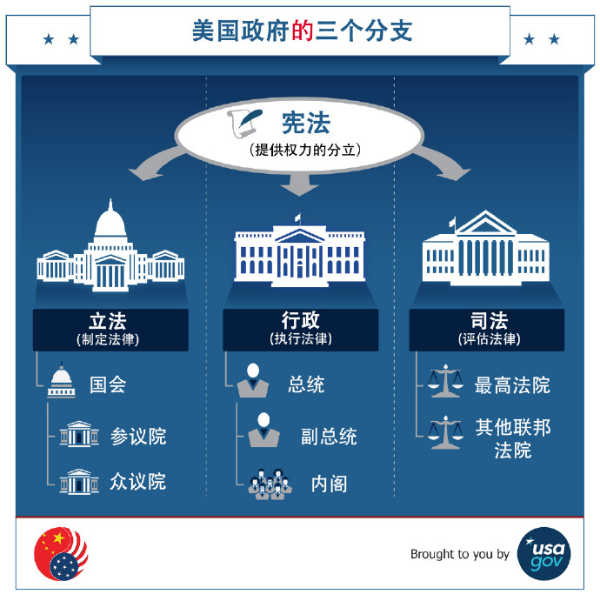

***在冲突的边境修墙，在不冲突的边境不修墙。***

``` NOTICE
我在避免创造第二个共产主义；
我也在避免成为第二个刘晓波。
别跟我谈爱国，你国并不爱你！
教育医疗养老，你还想要什么？
```

## 顺其自然即为美

[TOC]

### 谆谆教诲

``` NOTICE
一只在温水里泡澡的青蛙，
在它被烫熟前还会呱呱叫。
```

### 郑重声明

``` NOTICE
我反对法律，但我不是法律学家；
我参与政治，但我不是政治学家；
我关注经济，但我不是经济学家；
我研究历史，但我不是历史学家；
我整理知识，站在巨人的肩膀上；
我就是我，在我的地盘就听我的。
```

### 关于作者


`` @_@ 蓝色是生死恋
姓名：黄志贵
拼音：Huáng ZhìGuì
性别：男
民族：汉族
宗教：无信仰
理想：天文学家
身份：440882199308051156
公历：1993年09月05日（处女座）
农历：一九九三年七月十九日（属鸡）
籍贯：中华人民共和国广东省湛江市海康县（1994年04月改立雷州市）
本科：广东工业大学计算机学院计算机科学与技术专业2016届
肄业：中国科学院新疆天文台天体物理专业2019届
党派：原中国共产党党员
手机: +86-13611464445（广州移动）
电邮：brilliantstarrysky9395@gmail.com
住址：中国广东省湛江市经济技术开发区园乐苑北区一巷33号702房
``

### 公理化人类社会之框架

``` NOTICE
最好的政治，就是无政治；
最好的经济，就是无经济；
最好的政府，就是无政府；
最好的我们，就是不青春。
```

本公理化人类社会满足以下框架性特征：

1. 社会公理取代法律，灵活性优于法律；
2. 社会契约取代经济，适用性广于经济；
3. 社会角色取代职业，专门性弱于职业；
4. 社会信用评价系统，完全无政府状态；

### 公理化人类社会

#### 社会公理系统

数学公理系统简洁而优美，具有非常优良的性质，因此一个自然而然的想法就是仿照数学公理系统建立社会公理系统。但与自然科学追求严谨和完美不同，社会科学是描述性的而非公式化的，可以定性分析但却无法达到类似于定量分析的精确程度。对于社会公理系统来说，数学公理系统的3个基本性质显然过分严苛，一个可正常运作的社会公理系统只需要满足3个基本性质：

1. 自洽性 <= 自洽性 // 「自洽性」要求社会公理系统内部和谐一致不会出现矛盾。
2. 系统性 <= 独立性 // 「系统性」要求社会公理系统整体结构层次以及含义清晰。
3. 合理性 <= 完备性 // 「合理性」要求社会公理系统能合理解决所有已知的问题。

#### 社会基本形态

马克思（德语：Karl Marx，1818年~1883年）主义经典学说认为，社会基本形态的更迭由低级到高级必然历经五个阶段，即原始社会>>奴隶社会>>封建社会>>资本主义社会>>共产主义社会，社会主义社会是共产主义社会的初级阶段，共产主义社会是人类社会的最高社会形态，但到目前为止还没有任何国家宣称已经步入共产主义社会。

~~~~~~~~~~~~~~~~~~~~~~~~~~~~~~~~~~~~~~~~~~~~~~~~~~~~~~~~~~~~~~~~~~~~~~~~~~~~~~~~
共产主义社会的基本特征：
01 [社会] 社会生产高度发展，物质产品极大丰富。
02 [公有] 消灭生产资料私有制，实现生产资料公有制。
03 [生产] 社会按计划组织生产，个人消费品按需分配。
04 [劳动] 旧式生产分工被消除，劳动成为生活的必备。
05 [阶级] 社会阶级彻底消灭，国家政府完全消亡，代以自由人联合体。
06 [和谐] 社会关系高度和谐，人的精神高度升华。
07 [自由] 个人自由而全面发展，全人类得到彻底解放。
~~~~~~~~~~~~~~~~~~~~~~~~~~~~~~~~~~~~~~~~~~~~~~~~~~~~~~~~~~~~~~~~~~~~~~~~~~~~~~~~

马克思主义认为，人类社会由资产阶级（即逐利的资本家，指那些拥有生产资料的人）和无产阶级（即被剥削的工人，指那些靠出卖劳动力的人）这两大对立社会阶级构成，社会阶级斗争是人类社会发展的直接动力，社会基本矛盾是人类社会发展的根本动力。人类社会以往的全部历史，除原始社会以外，全都是社会阶级斗争的历史，社会基本矛盾主要通过社会阶级矛盾表现出来，社会革命与社会改革是解决阶级社会基本矛盾的主要方式。然而，要实现共产主义社会，就必须废除私有制，但私有制不是说废除就能废除的，只有当社会生产高度发展，才有可能废除私有制，这必然将经历一个极其艰难而漫长的历史过程。除此之外，人们精神境界极大的提高，以及每个人自由而全面的发展，都需要一个长期的历史过程。继承自马克思主义的列宁（俄语：Влади́мир Ильи́ч Улья́нов，1870年~1924年）主义主张，借助工人运动进行暴力革命，通过武装暴动夺取国家政权，推翻资产阶级民主并实行无产阶级专政，而且这是实现社会主义的唯一途径。

~~~~~~~~~~~~~~~~~~~~~~~~~~~~~~~~~~~~~~~~~~~~~~~~~~~~~~~~~~~~~~~~~~~~~~~~~~~~~~~~
社会主义的集权专制本质：
01 武装暴力革命！ // 发动无产阶级武装暴动来夺取国家政权。
02 社会阶级斗争！ // 将导致社会内部出现盲目而无谓的虚耗。
03 无产阶级专政！ // 将导致社会主义国家更倾向于专制政府。
~~~~~~~~~~~~~~~~~~~~~~~~~~~~~~~~~~~~~~~~~~~~~~~~~~~~~~~~~~~~~~~~~~~~~~~~~~~~~~~~

马克思主义认为，社会阶级斗争是社会生产发展在特定历史阶段的产物，无产阶级专政是为消灭一切社会阶级，从而进入共产主义社会的过渡阶段。当社会生产高度发展之时，社会阶级将彻底消失，国家与政府将随之自行消亡，作为社会阶级统治工具的军队/警察/监狱等暴力机器将失去作用，自由人联合体将取代国家与政府执行社会管理职能，但不再具有政治压迫和暴力镇压的性质。总之，共产主义尝试最终建立一个无社会阶级而且无国界的公有制社会，共产主义社会是十分美好的理想社会，其前途是光明的，但道路是漫长而曲折的。中国共产党作为中国唯一合法的马克思主义执政党，其最低革命纲领是建设中国特色社会主义，其最高革命纲领是实现共产主义。

马克思主义认为，在生产资料由社会全体占有的共产主义社会中，社会按计划组织生产，个人消费品按需分配，市场竞争是一种浪费，生产不再由按市场波动的价值规律来调节，以商品的交换价值为基础的市场经济便会崩溃，货币将顺其自然退出历史。社会生产与社会需求之间自动达到平衡，就能克服因资本主义内在矛盾所导致的周期性经济危机。然而，由前苏联斯大林（俄语：Ио́сиф Виссарио́нович Ста́лин，1878年~1953年）统治下的苏联式社会主义，以高度集权的国家指令性计划经济模式发展经济，却是一种对政治/经济/文化等方方面面严格管控的个人崇拜体制。

~~~~~~~~~~~~~~~~~~~~~~~~~~~~~~~~~~~~~~~~~~~~~~~~~~~~~~~~~~~~~~~~~~~~~~~~~~~~~~~~
苏联式社会主义的弊端：
01 社会资源分配效率低下；
02 缺乏积极进取激励机制；
03 难以提供足够多的商品；
04 权力腐败导致极不公平；
05 言论管控扼杀个人自由；
06 民族文化差异缺少共识；
~~~~~~~~~~~~~~~~~~~~~~~~~~~~~~~~~~~~~~~~~~~~~~~~~~~~~~~~~~~~~~~~~~~~~~~~~~~~~~~~

社会主义计划经济严重落后于资本主义市场经济，苏联式社会主义形式日益僵化，让苏联陷入各种社会矛盾危机四伏的泥潭之中，这场轰轰烈烈的社会主义道路探索最终以苏联解体与东欧剧变告终，此后绝大部分东欧社会主义国家完全放弃苏联式社会主义，其他社会主义国家如中国，在邓小平（1904年~1997年）极力倡导中国社会改革开放下，尝试将自由市场机制融入社会主义制度，实行具有中国特色的社会主义市场经济。不过社会主义与资本主义的界线正变得越来越模糊，资本主义国家会借鉴社会主义国家的实践经验，通过制定经济计划来应对经济危机。目前世界上的经济体大多属于混合市场经济，仅有少数社会主义国家仍然实行计划经济。此外，还有像丹麦和瑞典等发达资本主义国家所发展的福利资本主义，这些国家通过高税收和大量公共支出达到高度社会福利保障，他们人口很少但却有许多优秀企业，整体经济增长强劲，人们生活水平很高。

~~~~~~~~~~~~~~~~~~~~~~~~~~~~~~~~~~~~~~~~~~~~~~~~~~~~~~~~~~~~~~~~~~~~~~~~~~~~~~~~
资本主义国家的基本特征：
01 [私有] 生产资料私人占有；
02 [市场] 市场决定商品价格；
03 [利润] 以追逐利润为目的；
04 [政府] 政府干预市场运作；
~~~~~~~~~~~~~~~~~~~~~~~~~~~~~~~~~~~~~~~~~~~~~~~~~~~~~~~~~~~~~~~~~~~~~~~~~~~~~~~~

#### 政府与权力

洛克（英语：John Locke，1632年~1704年）在其代表作《政府论》中认为，每个人都拥有若干由自然赋予的权利，包括生命权利与自由权利和财产权利，政府就是为保护这些天赋人权而存在，只有经过人民的同意社会契约才成立，若缺乏这种同意人民便有权推翻政府，他主张将政府的权力划分为立法权与行政权和对外权，立法权是国家的最高权力，应将立法权与行政权分立，而将行政权和对外权统一。继承自洛克思想的孟德斯鸠（法语：Charles Louis de Secondat， 1689年~1755年）在其代表作《论法的精神》中认为，自由意味着人们可以做任何事情除非法律禁止，但若人们无视法律的存在而恣意妄为，那么自由便因人人都享有而不复存在，不过在任何情形下权力都有可能侵犯自由，而且一切有权力者都会无休止地滥用权力，因此为捍卫自由就必须限制使用权力。他最早阐述分权制衡的理论，将政府的权力明确划分为立法权与行政权和司法权，立法权隶属于立法机构负责法律的制定，行政权隶属于行政机构负责法律的实施，司法权隶属于司法机构负责法律的审判，这三种权力不仅应当严格分立，而且还要互相制衡。

1776年，英属十三个北美洲殖民地在大陆会议上，一致通过由杰斐逊（英语：Thomas Jefferson，1743年~1826年）起草的《独立宣言》，由此宣布脱离大不列颠王国的殖民统治，以邦联制为基础的美利坚合众国宣告独立。1781年，《邦联条例》陆续被各独立殖民地议会批准而生效，依照这部相当于宪法的根本大法，美利坚合众国是由各独立殖民地自愿结成的邦联体，以邦联议会为中央政府的唯一权力机构。然而邦联议会是十分松散的政治联合体，非常不利于各独立殖民地之间协调统一，为抵御外来威胁以及对付内部分裂，就必须建立一个强有力的中央政府。1787年，各独立殖民地召开制宪会议制定《美利坚合众国宪法》，将美利坚合众国更改为联邦共和制，并按照三权分立的原则组建联邦政府。事实证明，美国在独立革命后开创的这套民主宪政制度非常成功，1787年的美国联邦宪法作为世界上首部成文宪法，其所体现的民主与宪政之基本原则，至今仍然是许多国家制定成文宪法的典范。

~~~~~~~~~~~~~~~~~~~~~~~~~~~~~~~~~~~~~~~~~~~~~~~~~~~~~~~~~~~~~~~~~~~~~~~~~~~~~~~~
民主与宪政之基本原则：
01 [财产私有] 私有财产神圣不可侵犯。
02 [主权在民] 政府的权力由人民授予。
03 [代议民主] 人民选举代表参与决策。
04 [宪政法治] 宪法与法律为基本准则。
05 [分权制衡] 权力分立以及互相制衡。
06 [人权自由] 基本人身权利与生俱来。
~~~~~~~~~~~~~~~~~~~~~~~~~~~~~~~~~~~~~~~~~~~~~~~~~~~~~~~~~~~~~~~~~~~~~~~~~~~~~~~~

美国作为民主与宪政的典范国家，既是首个实行有限总统制的国家，也是分权制衡原则最典型的国家。根据宪法设计而建立的美国政府，可划分成立法部门与行政部门和司法部门三个互相独立的分支机构，立法部门以国会为首包括参议院与众议院等等，行政部门以总统为首包括副总统与内阁等等，以及国务院等等联邦行政机构，司法部门包括联邦最高法院与其他联邦法院等等。



~~~~~~~~~~~~~~~~~~~~~~~~~~~~~~~~~~~~~~~~~~~~~~~~~~~~~~~~~~~~~~~~~~~~~~~~~~~~~~~~
美国联邦政府的分权制衡原则示例：

[立法=>行政] 参议院批准总统对联邦机构的人事任命，国会可推翻总统对国会立法法案的否决，国会有权弹劾总统及联邦行政官员。
[立法<=行政] 总统可签署生效或否决国会的立法法案，副总统兼任参议院议长有决定性的一票。

[行政=>司法] 总统经参议院批准可任命全部联邦法官，总统有权赦免罪犯而使之免受法律追究。
[行政<=司法] 联邦最高法院有权裁决违宪并弹劾总统，联邦最高法院法官终身任职除非被弹劾。

[司法=>立法] 联邦最高法院有权解释宪法和联邦法律，联邦最高法院有权裁决国会的法律违宪。
[司法<=立法] 参议院批准总统对联邦法官的人事任命，国会有权弹劾联邦法院及最高法院法官，国会立法限定联邦最高法院的规模。
~~~~~~~~~~~~~~~~~~~~~~~~~~~~~~~~~~~~~~~~~~~~~~~~~~~~~~~~~~~~~~~~~~~~~~~~~~~~~~~~

在美国政府的分权制衡机制中，司法机构是最薄弱的环节，法院既无立法权也无行政权，其它两个分支机构都有可能对其造成侵害。为使三个分支机构之间达到平衡，美国政治制度特别添加入司法审查机制，联邦最高法院掌握违宪审查权，可以有效制约其它两个分支机构。美国政府的分权制衡机制还体现在美国政治的方方面面，例如国会的参议院与众议院之间，国会与州议会之间，联邦政府与州政府之间，州政府与地方政府之间，联邦法院与州法院之间。总之，美国政治制度中的任何一种权力都可以找到相对应的制衡权力。

~~~~~~~~~~~~~~~~~~~~~~~~~~~~~~~~~~~~~~~~~~~~~~~~~~~~~~~~~~~~~~~~~~~~~~~~~~~~~~~~
美国政治制度的特点：
01 [民主宪政] 总统由全民投票普选产生，法律以宪法为国家基本法，宪法赋予总统相当大权力。
02 [联邦共和] 州政府非隶属于联邦政府，联邦政府代表国家的主权，州政府独自管理本州事务。
03 [分权制衡] 立法部门制定并颁布法律，行政部门贯彻并执行法律，司法部门解释并审查法律。
04 [司法审查] 联邦法院可以审查立法机构通过的法律是否违反宪法。
05 [有限政府] 政府的权力应受法律约束，人民的权利不受政府侵犯。
06 [两党执政] 民主党与共和党轮流执政，两党组织松散且界线模糊。
07 [利益集团] 大量利益集团借政治献金与请愿游说来影响政局发展。
~~~~~~~~~~~~~~~~~~~~~~~~~~~~~~~~~~~~~~~~~~~~~~~~~~~~~~~~~~~~~~~~~~~~~~~~~~~~~~~~

民主与宪政的政治制度有多种形式，与美国等国家实行总统制不同，世界上大多数民主宪政国家实行议会制，人民先选举产生立法机构，再由立法机构选举行政长官，通常称为总理或者首相。在总统制国家，立法机构和行政机构可能会分属于不同政党。在议会制国家，立法机构和行政机构的多数党大都来自同一政党或政党联盟，如果总理失去议会的支持，政党就要宣布解散，总理要召开新一轮选举或者辞职。议会制国家通常也有总统，他们由立法机构或人民普选产生，但总统的工作一般是职能性质的，出席各种接待活动并扮演一种礼仪性的角色。

~~~~~~~~~~~~~~~~~~~~~~~~~~~~~~~~~~~~~~~~~~~~~~~~~~~~~~~~~~~~~~~~~~~~~~~~~~~~~~~~
《独立宣言》所体现的原则：
01 人人生而平等。
02 造物者赋予人们若干不可剥夺的权利。
03 政府的正当权力须经人民同意而产生。
04 人民有权建立政府以维护安全和幸福。
05 人民理应当维护他们久以习惯的政府。
06 人民有权利也有义务推翻残暴的政府。
~~~~~~~~~~~~~~~~~~~~~~~~~~~~~~~~~~~~~~~~~~~~~~~~~~~~~~~~~~~~~~~~~~~~~~~~~~~~~~~~

**猪年快乐。我睡觉了。**

无政府状态？一种混乱无序和暴力的状态。


美国的囚犯数量不仅比其他国家多，而且也是罪犯数量占人口比重较大的国家。换种说法来看，（2013年），美国的人口占世界总人口的5%，但其犯罪人口占世界总犯罪人口的25%。

从1970年到2011年，美国人口增加了52%，然而监狱犯人数增加了715%，增速是人口增速的14倍。如果犯人数同美国人口的增长比率一样，那么犯人数将达到29.8万人，是美国今天人口的五分之一。假如美国人口的增速同犯人数的增速一样，那美国人口将达到14.65亿人，比中国的人口还多。

20世纪80年代暴力犯罪急剧增加。美国人感到越来越恐惧，要求法律制定者必须做点事。政治家们听到了这种呼声，于是通过了一项“三次犯法即重判”的法律。即任何一个被判三次重罪的人将会受到一种自动生效的强制规定的判刑。一些强制判刑包括终身监禁，法官不必考虑当时当地的具体情况。尽管很少会有人会对一个犯三次强奸罪的人或者一个犯三次谋杀案的人被终身监禁感到同情，但是为尽快安抚人心的政治家并没有把这种法律限定于暴力犯罪。

伴随着这些变化，犯罪率急剧下降。


墨西哥现在就出现了这样的情形。

墨西哥政府从地方到国家各个层次都无法正常发挥功能。自从坏人，主要是大毒枭，有较多的控制权后，市民就陷入恐惧之中。这些毒枭渗透到从地方到国家的警界之中。甚至墨西哥禁毒局负责人都在大毒枭的工资单上。本来是打击毒品交易的军队，收取钱财后则去保护毒品交易。他们甚至动用军队交通工具去贩毒。这样的腐败已超出了想象，甚至深入到总统驻地。

被抓捕的人无数，被警察和军队射杀的毒贩数以千计。死亡人数不断攀升，现在死亡的警察、毒贩和普通市民超过了6万人。

结果，除了造成更多的人死亡还有什么别的吗？国家并没有保障人民的安全。

墨西哥人民于是开始自己掌握法律。在格雷罗州，乡下居民拿起自己的猎枪，戴上面罩，突袭毒贩子的家，把毒贩子关进临时监狱。他们还在进入自己小镇的路上设置路障。他们不让任何毒贩子或生人进镇。他们甚至不让联邦警察、州警察或者军队进镇。他们说，这些法律的执行者太腐败了。我们只能相信一起成长的邻居。

地方警察对此的诚实反应是如何的呢？“也许这些居民能就这个问题做些事。我们不能。如果我们去做了，毒贩会去我们的家并杀死家人。他们不知道这些戴面罩的人是谁。”

国家政府又有怎样的反应呢？“干得好！”

普通居民有什么反应呢？如释重负。很高兴自己又能夜晚外出，喝点龙舌兰酒或者在镇广场上跳舞。

这些戴面罩的男人要进行自己的审判。他们到现在还没有让任何人感到不安。但接下来他们怎么做？他们把自己审判后的人送到监狱里也不好，狱警和行政官都是腐败警察。在墨西哥帕拉西奥戈麦斯镇的一个监狱里，监狱行政官甚至给犯人配备枪支和汽车，还会让犯人外出去杀死敌对帮派的成员。之后，外出的犯人回到监狱，交还汽车和枪支，回到自己的牢房中去。我知道这让人难以置信。但这是真的。

#### 社会心理

**关于从众和服从的实验**

1. 谢里夫的规范形成研究
2. 米尔格拉姆的服从实验

从众即由于群体的压力而改变个体自己的行为或信念，其表现形式有两种。
顺从是迫于外部压力而与群体趋同但内心并不赞同；
服从是顺从的一种，是指对直接命令的顺从。
接纳是指内心认可社会压力并在行动上保持一致。

**关于权威**

**关于民主这个概念，我一直想说，民主大概和专制是一对反义词，民主/专制是和政府联系在一起的。有政府才有民主/专制，没有政府也就没有民主/专制。**

####

~~~~~~~~~~~~~~~~~~~~~~~~~~~~~~~~~~~~~~~~~~~~~~~~~~~~~~~~~~~~~~~~~~~~~~~~~~~~~~~~
热力学第二定律：
不可能从单一热源吸收热量，使之完全变为有用功而不产生其他影响。

熵增加原理：
热力学系统从一平衡态绝热地到达另一平衡态的过程中，它的熵永不减少。若过程是可逆的，则熵不变；若过程是不可逆的，则熵增加。
~~~~~~~~~~~~~~~~~~~~~~~~~~~~~~~~~~~~~~~~~~~~~~~~~~~~~~~~~~~~~~~~~~~~~~~~~~~~~~~~

随着时间推移，任何国家都将变得富有。

#### 社会公理

公理/法律

贡献/危害

~~~~~~~~~~~~~~~~~~~~~~~~~~~~~~~~~~~~~~~~~~~~~~~~~~~~~~~~~~~~~~~~~~~~~~~~~~~~~~~~
辛普森案件

人类历史上最广为人知的犯罪案件：橄榄球明星、演员兼体育评论员辛普森（O. J. Simpson）被指控残忍地谋杀了与他不合的妻子以及一名与他妻子相熟的男子。起诉人认为证据确凿：辛普森的行为属于长期虐待合暴力恐吓配偶。通过血液检验，证实他的血液出现在犯罪现场，而受害者的血液出现在他的手套、汽车甚至卧室里的袜子上。在谋杀案发生的当天晚上，他开车离开；当要逮捕他时他又仓皇出逃。检察官说，这更加大了他的犯罪嫌疑。

辛普森的辩护律师认为，种族偏见可能为那些声称在辛普森的家中发现了带血手套的警官提供了动机；他们还认为，辛普森不可能接受公正的审判。这些审判员————其中有10为女性————会公正地对待这个涉嫌虐待和谋杀妇女的人吗？他们会在多大程度上忽略审判前那些易于导致偏见的公开报道，而去注意法官的指示呢？

这一案例向我们揭示了社会心理学实验中研究过的一些其他问题：
01 犯罪现场没有目击者。目击者证词的影响力有多大？目击者回忆的可信度有多高？怎样才算是一个可信的目击者？
02 辛普森是一个英俊、富有、广受倾慕的名人。陪审员们真的能够像他们应该做到的那样，忽略被告的吸引力和社会地位吗？
03 陪审员们对那些重要信息（比如DNA测试中的统计概率）的理解是否充分？
04 该案例中的陪审团成员大部分由女性和黑人组成，当然也包括两名男性，还有一位西班牙人和两位非西班牙裔的白人，在接下来的对辛普森索赔案的民事审判陪审团中由9名白人。陪审员的这些特征会使他们的判决产生偏差吗？如果会，律师们能否利用挑选陪审员的程序，组成一个符合自己意愿的陪审团呢？
05 在这类案例中，12名陪审员做出判决前要慎重讨论。讨论期间，陪审员之间会怎样相互影响呢？少数派会赢过多数派吗？12名陪审员得出的结论会和6名陪审员的结论一样吗？
~~~~~~~~~~~~~~~~~~~~~~~~~~~~~~~~~~~~~~~~~~~~~~~~~~~~~~~~~~~~~~~~~~~~~~~~~~~~~~~~


~~~~~~~~~~~~~~~~~~~~~~~~~~~~~~~~~~~~~~~~~~~~~~~~~~~~~~~~~~~~~~~~~~~~~~~~~~~~~~~~
目击者的证词是否可靠？

01 在数百项实验中，社会心理学家发现目击者证词的准确性会受一系列因素的干扰，这些因素包括人们形成判断和记忆的方式。
02 有些目击者在表达时更加自信。尽管自信实际上只是目击者的个人特质，并不代表信息的可行性，但是人们还是倾向于相信那些自信的目击者。
03 人眼并非摄像机，它易受光线、角度的改变以及其他变化的影响，从而损害人们对嫌疑犯面部指认的精确性。
04 当把错误的信息呈现给目击者时，误导信息效应就会使目击者把错误的信息认为是正确的。
05 当一系列犯罪事实不停地被重复时，错误就可能悄悄地潜入并被目击者所接受，且被认为是真实的记述。
06 为了减少这样的错误，我们建议面询者不要打断目击者的陈述，并鼓励目击者想象当时的情境以及自己的情绪状态。
07 训练陪审团对目击者证词的分辨力可以改善证词的接收方式，最终提高证词的正确性。
~~~~~~~~~~~~~~~~~~~~~~~~~~~~~~~~~~~~~~~~~~~~~~~~~~~~~~~~~~~~~~~~~~~~~~~~~~~~~~~~


~~~~~~~~~~~~~~~~~~~~~~~~~~~~~~~~~~~~~~~~~~~~~~~~~~~~~~~~~~~~~~~~~~~~~~~~~~~~~~~~
影响陪审团判断的其他因素

01 通常，案件的事实有足够的说服力，它能使陪审团放弃偏见给出一个公正的判决。然而，当证据模糊时，陪审团往往倾向于用他们先入为主的偏见来解释案件，并对有吸引力或者与自己相似的被告表现出同情。
02 当陪审团接触到破坏性的审讯前公开报道或不被允许的证据时，他们会听从法官的指示将其忽略吗？在模拟审讯中，法官的命令有时是被遵守的，但当法官的劝诫出现在印象形成以后，则通常不会被遵守。
03 研究者还研究了其他因素的影响，如可能判决的严重性受害者的特征等。
~~~~~~~~~~~~~~~~~~~~~~~~~~~~~~~~~~~~~~~~~~~~~~~~~~~~~~~~~~~~~~~~~~~~~~~~~~~~~~~~


~~~~~~~~~~~~~~~~~~~~~~~~~~~~~~~~~~~~~~~~~~~~~~~~~~~~~~~~~~~~~~~~~~~~~~~~~~~~~~~~
影响陪审团判断的其他因素

01 通常，案件的事实有足够的说服力，它能使陪审团放弃偏见给出一个公正的判决。然而，当证据模糊时，陪审团往往倾向于用他们先入为主的偏见来解释案件，并对有吸引力或者与自己相似的被告表现出同情。
02 当陪审团接触到破坏性的审讯前公开报道或不被允许的证据时，他们会听从法官的指示将其忽略吗？在模拟审讯中，法官的命令有时是被遵守的，但当法官的劝诫出现在印象形成以后，则通常不会被遵守。
03 研究者还研究了其他因素的影响，如可能判决的严重性受害者的特征等。
~~~~~~~~~~~~~~~~~~~~~~~~~~~~~~~~~~~~~~~~~~~~~~~~~~~~~~~~~~~~~~~~~~~~~~~~~~~~~~~~


~~~~~~~~~~~~~~~~~~~~~~~~~~~~~~~~~~~~~~~~~~~~~~~~~~~~~~~~~~~~~~~~~~~~~~~~~~~~~~~~
影响个体陪审团的因素

01 社会心理学家不仅对目击者、法官、陪审员之间的相互影响感兴趣，而且也对陪审员的内心和他们之间的关系感兴趣。一个重要的问题就是陪审员对证据的理解，尤其是当证据包含了表明某个人犯罪的可能性的统计信息时。
02 出庭辩护律师往往利用陪审团顾问，帮助他们选择有利于自己的陪审团。例如，那些了解审讯前宣传的陪审员可能会被取消资格。
03 在那些用到死刑判决的案件中，律师可以取消任何原则上反对死刑判决的潜在陪审员的资格。社会心理学的研究表明，这本身就产生了一个带有偏见的陪审团，不过，最高法院已经这样做了。
~~~~~~~~~~~~~~~~~~~~~~~~~~~~~~~~~~~~~~~~~~~~~~~~~~~~~~~~~~~~~~~~~~~~~~~~~~~~~~~~


~~~~~~~~~~~~~~~~~~~~~~~~~~~~~~~~~~~~~~~~~~~~~~~~~~~~~~~~~~~~~~~~~~~~~~~~~~~~~~~~
群体因素对陪审员的影响

01 陪审员是一个群体，影响其他类型群体的那些力量也会使它们摇摆不定。例如，陪审团中最聒噪的成员往往说得最多，而较安静得成员基本保持沉默。
02 在审议过程中，反对意见有可能变得更加确定、更加极端化。
03 尤其当证据不足以给罪犯定罪时，审议过程会使陪审员变得比开始时更具宽容化。
04 12人制得陪审团是源于英国普通法律得一种传统。研究者发现这一规模允许陪审员之间存在合理得差异，允许他们的意见和取向的混合，以及能使他们更好地回忆审判的信息。
05 研究者对美国最高法院近年来允许小型陪审团和非一致性意见决定的陪审团的设想进行了检验，并提出了质疑。
06 模拟陪审团毕竟不是真实的陪审团。但是，就像社会心理学所有实验一样，有关陪审团的实验室实验，有助于我们建构用来解释更加复杂的日常生活世界的理论和规律。
~~~~~~~~~~~~~~~~~~~~~~~~~~~~~~~~~~~~~~~~~~~~~~~~~~~~~~~~~~~~~~~~~~~~~~~~~~~~~~~~


宪法。35页《西方政治制度史》
权利：国家通过宪法或法律所确认的公民实现某种行为的可能性，即国家允许公民作某种行为，国家给予公民实现自己要求的合法手段和可能条件。
义务：宪法或法律规定公民从事某种行为的必要性，即要求公民必须作某种行为或禁止作某种行为，而这种必须或禁止都带有强制性。

权利：
01. 财产权，即具有经济内容的权利。如财产处分权/收益权/工作与职业收入权/继承权。
02. 平等权，即公民在法律上的平等。如公民在法律面前人人平等，所有公民受法律的平等保护；公民触犯法律时，在惩罚上一样对待；不允许公民享有法律特权等。
03. 自由权，即有权从事一切无害于他人的行为。如人身自由/迁徙自由/言论自由/通讯秘密自由/集会自由/结社自由/罢工自由/宗教信仰自由等。
04. 受益权，即受教育权和享受劳动保护/社会保险/社会救济等方面的权利。
05. 参政权，主要是指公民参与国家政治活动方面的权利，如选举权/复决权（公民公决权）/创制权和罢免权。

义务：
01. 捍卫国家/服兵役的义务；
02. 交纳赋税的义务；
03. 服从法律的义务；
04. 尊重他人财产的义务；
05. 受教育的义务；
06. 劳动的义务；
07. 遵守公共秩序和社会公德的义务；

关于权利与义务的基本特点：
01. 以财产权为一切权利的核心，其他权利多以财产状况为转移。财产权是首要的权利，对其他权利的拥有和实现，有着决定的作用；
02. 权利和义务的规定，在形式上是平等的，每个人都享有同等的权利和同等的义务，但实质上是不平等。如财产权受到法律的平等保护，而财产的占有是不平等的，说到底权利是不平等。其他权利也是一样，由于实现权利的条件是不平等的，所以权利也是不平等。
03. 从形式上看权利义务是统一的，公民平等地享有权利，平等地承担义务，但实质上权利和义务是分离的；一部分人依法更多地享有权利，另一部分人则更多地承担义务。


权利与义务51页《法学概论》

没有无权利的义务，也没有无义务的权利。

权利：权利是令他人实施某行为（作为或不作为）的强制性要求。他人必须为我做什么？民法中称请求权。
义务：义务是为他人利益而对行为人的强制性要求。我必须为他人做什么？民法中称债务。
无义务：无义务是指行为不受法律的拘束，就是法律上的自由。我可以做什么？民法中称支配权。
无权利：无权利是指要求他人为或不为某行为的主张得不到法律的支持。他人可以做什么？

没有无权力的责任，也没有无责任的权力

权力：权力是引起法律关系变动的法律上之力。我能够在我与他人之间引起法律关系怎样的变动？
责任：责任是对法律关系变动结果的承受。我将承受他人为我产生/变更或消灭何种法律关系？
无责任：无责任是指某人现有的法律关系不受他人行为的影响。我现有法律关系中的哪一项得以免受他人行为的影响？
无义务：无权力是指某人的行为无法引起他人现有法律关系的变动。我不能变动他人的那些现存法律关系？

#### 社会契约


契约/合同/协议/经济/阶级

摘录：

长期的公平

认为友谊和爱情植根于公平交换回报之上很愚蠢吗？难道我们有时候在满足爱人需要时没有考虑任何回报？确实，那些处于公平的长期关系中的人并不在乎短期的公平。克拉克和米尔斯认为，人们甚至会努力避免算计交换的利益。当我们帮助一个好朋友的时候，我们并不在意马上获得回报。如果有人请我们吃了饭，我们会过一阵子才向这个人发出回请，以免让他认为，对他的回请只是对社交债务的偿还而已。什么是真正的友谊呢？就是人们在几乎不可能得到回报的时候也会去帮助朋友。与此类似，幸福的夫妻是不会斤斤计较自己付出几许，收获几许的。当人们看到自己的伙伴牺牲了自我利益，他们彼此的信任就会有所增长。


#### 社会角色

政府/领导/职业

~~~~~~~~~~~~~~~~~~~~~~~~~~~~~~~~~~~~~~~~~~~~~~~~~~~~~~~~~~~~~~~~~~~~~~~~~~~~~~~~
斯坦福监狱角色扮演实验

在一项研究中，斯坦福大学心理学系教授菲利普·津巴多（Zimbardo, 1971; Haney & Zimbardo, 1998, 2009）设计了一个模拟的监狱实验，要求大学生志愿者在其中待一段时间。津巴多想知道，到底是邪恶的犯人和恶毒的狱卒导致了监狱的残酷性，还是狱卒和犯人的角色令即便富有同情心的人也变得十分怨恨和冷酷。是人们使这个地方变得暴力了，还是这个地方使人们变得暴力了。

津巴多用抛硬币的方式，指派一些学生做狱卒。他给他们分发制服、警棍和哨子，并且命令他们按规则行事。另一半的学生则扮作犯人，他们穿着令人羞耻的囚服，并被关进单人牢房里。在经过了一天愉快的角色扮演之后，狱卒和犯人，甚至研究者，都进入了情绪。狱卒开始贬损犯人，并且一些人开始制定残酷的侮辱性规则。犯人崩溃、造反，或者变得冷漠。津巴多报告说：“人们越来越分不清现实和幻觉、扮演的角色和自己的身份···这个创造出来的监狱···正在同化我们，使我们成为它的傀儡。”随后津巴多发现社会病理学症状正在出现，他不得不在第六天放弃了这个本来计划为期两周的实验。

关键问题在于我们并非无力抵制我们所扮演的角色。在津巴多的模拟监狱中，在阿布格莱布监狱中（狱卒侮辱伊拉克战犯）以及其他产生暴行的情境中，有的人变成了虐待狂，而另一些人却没有。盐溶于水，沙却不会。所有约翰逊指出，如果被置入一个烂苹果萝筐里，有的人会变成烂苹果，有些人则不会。行为是个人和情境的共同产物，监狱研究吸引来的也许正是那些具有潜在攻击者的志愿者们。
~~~~~~~~~~~~~~~~~~~~~~~~~~~~~~~~~~~~~~~~~~~~~~~~~~~~~~~~~~~~~~~~~~~~~~~~~~~~~~~~

#### 社会信用评价系统

社会信用评价系统/银行

个人价值与社会价值的同一性。

无处是中心，无处不是中心。

#### 关于地域（领土/扩张/移民/海关/检疫/区划）

国家主权：通常是指国家固有的对内高于一切，对外保持独立自主的权力。主权就是指国家独立自主地处理内外事务而不受他国干预或限制的最高权力。


#### 关于人际（家庭/婚姻/爱情/亲情/友情/领养/堕胎/社交）

全球的9500多种蚂蚁全都属于全社会性昆虫，而且都是最高等的社会性昆虫。社会性昆虫主要有3个特征：

1. 很多成虫生活在一起并实行合作育幼；
2. 存在生殖个体和非生殖个体的分化，后者为前者提供照顾、保护和服务；
3. 两个或更多世代重叠使子代能帮助双亲喂养同胞弟妹。

``` NOTICE
01 爱情是终生的契约。
02 你家的孩子也是别人家的孩子。
```

```
公理化人类社会预言：
01 每个人都长得很好看。
```

#### 关于文化（宗教/民族/种族/教育/出版/创作/制度）

``` NOTICE
01 没有什么绝对正确；你觉得正确，那就是正确；你觉得错误，那就是错误；你爱说什么，那就说什么。
```

#### 关于保障（医疗/养老/公益）

#### 关于权力（制裁/惩罚/审判/军队/警察/监狱）

《权利法案》

#### 关于资源（开采/生产/分配/交换/流通/财产/走私/盗窃）

``` NOTICE
01 你觉得是你的，那就是你的。
```

#### 关于实体（党派/公司/组织/团队/个人/阶级）

#### 关于环境（污染/自然/能源）

#### 关于伦理（武器/枪械/毒品/实验/食品/器官）

#### 关于