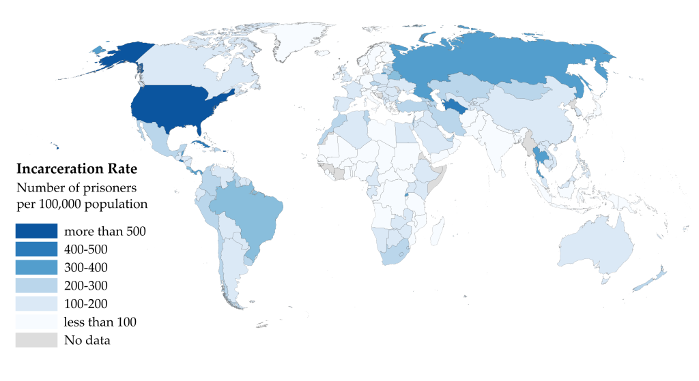
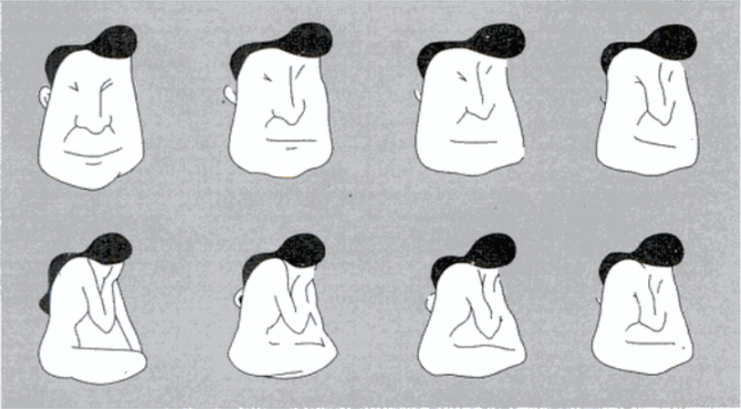

### 关于作者


`` @_@ 蓝色是生死恋
姓名：黄志贵
拼音：Huáng ZhìGuì
性别：男
民族：汉族
宗教：无信仰
理想：天文学家
身份：440882199308051156
公历：1993年09月05日（处女座）
农历：一九九三年七月十九日（属鸡）
籍贯：中华人民共和国广东省湛江市海康县（1994年04月改立雷州市）
本科：广东工业大学计算机学院计算机科学与技术专业2016届
肄业：中国科学院新疆天文台天体物理专业2019届
党派：原中国共产党党员
手机: +86-13611464445（广州移动）
电邮：brilliantstarrysky9395@gmail.com
住址：中国广东省湛江市经济技术开发区园乐苑北区一巷33号
怀旧：一只在温水里泡澡的青蛙，在它被烫熟前还会呱呱叫。
``

### 公理化人类社会之框架

``` NOTICE
最好的政治，就是无政治；
最好的经济，就是无经济；
最好的政府，就是无政府；
最好的我们，就是不青春。
```

本公理化人类社会满足以下框架性特征：

1. 社会公理取代法律，灵活性优于法律；
2. 社会契约取代经济，适用性广于经济；
3. 社会角色取代职业，专门性弱于职业；
4. 社会信用评价系统，完全无政府状态；

``` NOTICE
这个世界上有三样东西令人着迷：
一是权力。// 对美好事物的占有欲
二是金钱。// 对稳定物资的控制欲
三是美色。// 对优质生活的渴望欲
```

### 公理化人类社会

数学公理系统简洁而优美，具有非常优良的性质，因此一个自然而然的想法就是仿照数学公理系统建立社会公理系统。但与自然科学追求严谨和完美不同，社会科学是描述性的而非公式化的，可以定性分析但却无法达到类似于定量分析的精确程度。对于社会公理系统来说，数学公理系统的3个基本性质显然过分严苛，一个可正常运作的社会公理系统只需要满足3个基本性质：

~~~~~~~~~~~~~~~~~~~~~~~~~~~~~~~~~~~~~~~~~~~~~~~~~~~~~~~~~~~~~~~~~~~~~~~~~~~~~~~~
社会公理系统的基本性质：
01 自洽性 <= 自洽性 // 「自洽性」要求社会公理系统内部和谐一致不会出现矛盾。
02 系统性 <= 独立性 // 「系统性」要求社会公理系统整体结构层次以及含义清晰。
03 合理性 <= 完备性 // 「合理性」要求社会公理系统能合理解决所有已知的问题。
~~~~~~~~~~~~~~~~~~~~~~~~~~~~~~~~~~~~~~~~~~~~~~~~~~~~~~~~~~~~~~~~~~~~~~~~~~~~~~~~

#### 社会基本形态

马克思（德语：Karl Marx，1818年~1883年）主义经典学说认为，社会基本形态的更迭由低级到高级必然历经五个阶段，即原始社会>>奴隶社会>>封建社会>>资本主义社会>>共产主义社会，社会主义社会是共产主义社会的初级阶段，共产主义社会是人类社会的最高社会形态，但到目前为止还没有任何国家宣称已经步入共产主义社会。

~~~~~~~~~~~~~~~~~~~~~~~~~~~~~~~~~~~~~~~~~~~~~~~~~~~~~~~~~~~~~~~~~~~~~~~~~~~~~~~~
共产主义社会的基本特征：
01 [社会] 社会生产高度发展，物质产品极大丰富。
02 [公有] 消灭生产资料私有制，实现生产资料公有制。
03 [生产] 社会按计划组织生产，个人消费品按需分配。
04 [劳动] 旧式生产分工被消除，劳动成为生活的必备。
05 [阶级] 社会阶级彻底消灭，国家政府完全消亡，代以自由人联合体。
06 [和谐] 社会关系高度和谐，人的精神高度升华。
07 [自由] 个人自由而全面发展，全人类得到彻底解放。
~~~~~~~~~~~~~~~~~~~~~~~~~~~~~~~~~~~~~~~~~~~~~~~~~~~~~~~~~~~~~~~~~~~~~~~~~~~~~~~~

马克思主义认为，人类社会由资产阶级（即逐利的资本家，指那些拥有生产资料的人）和无产阶级（即被剥削的工人，指那些靠出卖劳动力的人）这两大对立社会阶级构成，社会阶级斗争是人类社会发展的直接动力，社会基本矛盾是人类社会发展的根本动力。人类社会以往的全部历史，除原始社会以外，全都是社会阶级斗争的历史，社会基本矛盾主要通过社会阶级矛盾表现出来，社会革命与社会改革是解决阶级社会基本矛盾的主要方式。然而，要实现共产主义社会，就必须废除私有制，但私有制不是说废除就能废除的，只有当社会生产高度发展，才有可能废除私有制，这必然将经历一个极其艰难而漫长的历史过程。除此之外，人们精神境界极大的提高，以及每个人自由而全面的发展，都需要一个长期的历史过程。继承自马克思主义的列宁（俄语：Влади́мир Ильи́ч Улья́нов，1870年~1924年）主义主张，借助工人运动进行暴力革命，通过武装暴动夺取国家政权，推翻资产阶级民主并实行无产阶级专政，而且这是实现社会主义的唯一途径。

~~~~~~~~~~~~~~~~~~~~~~~~~~~~~~~~~~~~~~~~~~~~~~~~~~~~~~~~~~~~~~~~~~~~~~~~~~~~~~~~
社会主义的集权专制本质：
01 武装暴力革命！ // 发动无产阶级武装暴动来夺取国家政权。
02 社会阶级斗争！ // 将导致社会内部出现盲目而无谓的虚耗。
03 无产阶级专政！ // 将导致社会主义国家更倾向于专制政府。
~~~~~~~~~~~~~~~~~~~~~~~~~~~~~~~~~~~~~~~~~~~~~~~~~~~~~~~~~~~~~~~~~~~~~~~~~~~~~~~~

马克思主义认为，社会阶级斗争是社会生产发展在特定历史阶段的产物，无产阶级专政是为消灭一切社会阶级，从而进入共产主义社会的过渡阶段。当社会生产高度发展之时，社会阶级将彻底消失，国家与政府将随之自行消亡，作为社会阶级统治工具的军队/警察/监狱等暴力机器将失去作用，自由人联合体将取代国家与政府执行社会管理职能，但不再具有政治压迫和暴力镇压的性质。总之，共产主义尝试最终建立一个无社会阶级而且无国界的公有制社会，共产主义社会是十分美好的理想社会，其前途是光明的，但道路是漫长而曲折的。中国共产党作为中国唯一合法的马克思主义执政党，其最低革命纲领是建设中国特色社会主义，其最高革命纲领是实现共产主义。

马克思主义认为，在生产资料由社会全体占有的共产主义社会中，社会按计划组织生产，个人消费品按需分配，市场竞争是一种浪费，生产不再由按市场波动的价值规律来调节，以商品的交换价值为基础的市场经济便会崩溃，货币将顺其自然退出历史。社会生产与社会需求之间自动达到平衡，就能克服因资本主义内在矛盾所导致的周期性经济危机。然而，由前苏联斯大林（俄语：Ио́сиф Виссарио́нович Ста́лин，1878年~1953年）统治下的苏联式社会主义，以高度集权的国家指令性计划经济模式发展经济，却是一种对政治/经济/文化等方方面面严格管控的个人崇拜体制。

~~~~~~~~~~~~~~~~~~~~~~~~~~~~~~~~~~~~~~~~~~~~~~~~~~~~~~~~~~~~~~~~~~~~~~~~~~~~~~~~
苏联式社会主义的弊端：
01 社会资源分配效率低下；
02 缺乏积极进取激励机制；
03 难以提供足够多的商品；
04 权力腐败导致极不公平；
05 言论管控扼杀个人自由；
06 民族文化差异缺少共识；
~~~~~~~~~~~~~~~~~~~~~~~~~~~~~~~~~~~~~~~~~~~~~~~~~~~~~~~~~~~~~~~~~~~~~~~~~~~~~~~~

社会主义计划经济严重落后于资本主义市场经济，苏联式社会主义形式日益僵化，让苏联陷入各种社会矛盾危机四伏的泥潭之中，这场轰轰烈烈的社会主义道路探索最终以苏联解体与东欧剧变告终，此后绝大部分东欧社会主义国家完全放弃苏联式社会主义，其他社会主义国家如中国，在邓小平（1904年~1997年）极力倡导中国社会改革开放下，尝试将自由市场机制融入社会主义制度，实行具有中国特色的社会主义市场经济。不过社会主义与资本主义的界线正变得越来越模糊，资本主义国家会借鉴社会主义国家的实践经验，通过制定经济计划来应对经济危机。目前世界上的经济体大多属于混合市场经济，仅有少数社会主义国家仍然实行计划经济。此外，还有像丹麦和瑞典等发达资本主义国家所发展的福利资本主义，这些国家通过高税收和大量公共支出达到高度社会福利保障，他们人口很少但却有许多优秀企业，整体经济增长强劲，人们生活水平很高。

~~~~~~~~~~~~~~~~~~~~~~~~~~~~~~~~~~~~~~~~~~~~~~~~~~~~~~~~~~~~~~~~~~~~~~~~~~~~~~~~
资本主义国家的基本特征：
01 [私有] 生产资料私人占有；
02 [市场] 市场决定商品价格；
03 [利润] 以追逐利润为目的；
04 [政府] 政府干预市场运作；
~~~~~~~~~~~~~~~~~~~~~~~~~~~~~~~~~~~~~~~~~~~~~~~~~~~~~~~~~~~~~~~~~~~~~~~~~~~~~~~~

#### 政府与权力

洛克（英语：John Locke，1632年~1704年）在其代表作《政府论》中认为，每个人都拥有若干由自然赋予的权利，包括生命权利与自由权利和财产权利，政府就是为保护这些天赋人权而存在，只有经过人民的同意社会契约才成立，若缺乏这种同意人民便有权推翻政府，他主张将政府的权力划分为立法权与行政权和对外权，立法权是国家的最高权力，应将立法权与行政权分立，而将行政权和对外权统一。继承自洛克思想的孟德斯鸠（法语：Charles Louis de Secondat， 1689年~1755年）在其代表作《论法的精神》中认为，自由意味着人们可以做任何事情除非法律禁止，但若人们无视法律的存在而恣意妄为，那么自由便因人人都享有而不复存在，不过在任何情形下权力都有可能侵犯自由，而且一切有权力者都会无休止地滥用权力，因此为捍卫自由就必须限制使用权力。他最早阐述分权制衡的理论，将政府的权力明确划分为立法权与行政权和司法权，立法权隶属于立法机构负责法律的制定，行政权隶属于行政机构负责法律的实施，司法权隶属于司法机构负责法律的审判，这三种权力不仅应当严格分立，而且还要互相制衡。

1776年，英属十三个北美洲殖民地在大陆会议上，一致通过由杰斐逊（英语：Thomas Jefferson，1743年~1826年）起草的《独立宣言》，由此宣布脱离大不列颠王国的殖民统治，以邦联制为基础的美利坚合众国宣告独立。1781年，《邦联条例》陆续被各独立殖民地议会批准而生效，依照这部相当于宪法的根本大法，美利坚合众国是由各独立殖民地自愿结成的邦联体，以邦联议会为中央政府的唯一权力机构。然而邦联议会是十分松散的政治联合体，非常不利于各独立殖民地之间协调统一，为抵御外来威胁以及对付内部分裂，就必须建立一个强有力的中央政府。1787年，各独立殖民地召开制宪会议制定《美利坚合众国宪法》，将美利坚合众国更改为联邦共和制，并按照三权分立的原则组建联邦政府。事实证明，美国在独立革命后开创的这套民主宪政制度非常成功，1787年的美国联邦宪法作为世界上首部成文宪法，其所体现的民主与宪政之基本原则，至今仍然是许多国家制定成文宪法的典范。

~~~~~~~~~~~~~~~~~~~~~~~~~~~~~~~~~~~~~~~~~~~~~~~~~~~~~~~~~~~~~~~~~~~~~~~~~~~~~~~~
民主与宪政之基本原则：
01 [私有财产] 私有财产神圣不可侵犯。
02 [主权在民] 政府的权力由人民授予。
03 [代议民主] 人民选举代表参与决策。
04 [宪政法治] 宪法与法律为基本准则。
05 [分权制衡] 权力分立以及互相制衡。
06 [天赋人权] 基本人身权利与生俱来。
~~~~~~~~~~~~~~~~~~~~~~~~~~~~~~~~~~~~~~~~~~~~~~~~~~~~~~~~~~~~~~~~~~~~~~~~~~~~~~~~

美国作为民主与宪政的典范国家，既是首个实行有限总统制的国家，也是分权制衡原则最典型的国家。根据宪法设计而建立的美国政府，可划分成立法部门与行政部门和司法部门三个互相独立的分支机构，立法部门以国会为首包括参议院与众议院等等，行政部门以总统为首包括副总统与内阁等等，以及国务院等等联邦行政机构，司法部门包括联邦最高法院与其他联邦法院等等。


~~~~~~~~~~~~~~~~~~~~~~~~~~~~~~~~~~~~~~~~~~~~~~~~~~~~~~~~~~~~~~~~~~~~~~~~~~~~~~~~
美国联邦政府的分权制衡原则示例：

[立法=>行政] 参议院批准总统对联邦机构的人事任命，国会可推翻总统对国会立法法案的否决，国会有权弹劾总统及联邦行政官员。
[立法<=行政] 总统可签署生效或否决国会的立法法案，副总统兼任参议院议长有决定性的一票。

[行政=>司法] 总统经参议院批准可任命全部联邦法官，总统有权赦免罪犯而使之免受法律追究。
[行政<=司法] 联邦最高法院有权裁决违宪并弹劾总统，联邦最高法院法官终身任职除非被弹劾。

[司法=>立法] 联邦最高法院有权解释宪法和联邦法律，联邦最高法院有权裁决国会的法律违宪。
[司法<=立法] 参议院批准总统对联邦法官的人事任命，国会有权弹劾联邦法院及最高法院法官，国会立法限定联邦最高法院的规模。
~~~~~~~~~~~~~~~~~~~~~~~~~~~~~~~~~~~~~~~~~~~~~~~~~~~~~~~~~~~~~~~~~~~~~~~~~~~~~~~~

在美国政府的分权制衡机制中，司法机构是最薄弱的环节，法院既无立法权也无行政权，其它两个分支机构都有可能对其造成侵害。为使三个分支机构之间达到平衡，美国政治制度特别添加入司法审查机制，联邦最高法院掌握违宪审查权，可以有效制约其它两个分支机构。美国政府的分权制衡机制还体现在美国政治的方方面面，例如国会的参议院与众议院之间，国会与州议会之间，联邦政府与州政府之间，州政府与地方政府之间，联邦法院与州法院之间。总之，美国政治制度中的任何一种权力都可以找到相对应的制衡权力。

~~~~~~~~~~~~~~~~~~~~~~~~~~~~~~~~~~~~~~~~~~~~~~~~~~~~~~~~~~~~~~~~~~~~~~~~~~~~~~~~
美国政治制度的特点：
01 [民主宪政] 总统由全民投票普选产生，法律以宪法为国家基本法，宪法赋予总统相当大权力。
02 [联邦共和] 州政府非隶属于联邦政府，联邦政府代表国家的主权，州政府独自管理本州事务。
03 [分权制衡] 立法部门制定并颁布法律，行政部门贯彻并执行法律，司法部门解释并审查法律。
04 [司法审查] 联邦法院可以审查立法机构通过的法律是否违反宪法。
05 [有限政府] 政府的权力应受法律约束，人民的权利不受政府侵犯。
06 [两党执政] 民主党与共和党轮流执政，两党组织松散且界线模糊。
07 [利益集团] 大量利益集团借政治献金与请愿游说来影响政局发展。
~~~~~~~~~~~~~~~~~~~~~~~~~~~~~~~~~~~~~~~~~~~~~~~~~~~~~~~~~~~~~~~~~~~~~~~~~~~~~~~~

民主与宪政的政治制度有多种形式，与美国等国家实行总统制不同，世界上大多数民主宪政国家实行议会制，人民先选举产生立法机构，再由立法机构选举行政长官，通常称为总理或者首相。在总统制国家，立法机构和行政机构可能会分属于不同政党。在议会制国家，立法机构和行政机构的多数党大都来自同一政党或政党联盟，如果总理失去议会的支持，政府就要宣布解散，总理要召开新一轮选举或者辞职。议会制国家通常也有总统，他们由立法机构或人民普选产生，但总统的工作一般是职能性质的，出席各种接待活动并扮演一种礼仪性的角色。

美国的民主宪政制度作为一种较为优良的政治制度，充分奠定今日美国社会所形成的多元民族与多元文化等等特征。作为世界上最典型的移民国家，美国有着来自世界各地涌入的大量移民，现在的美国人正是由这些身显不同肤色/操持不同语言/信奉不同宗教/遵循不同习俗的移民以及他们的后裔组成。差异巨大的不同族裔移民群体在保留各自文化传统的同时，大多数都能较快融入美国的主流社会，这种美国化的过程通常被比作大熔炉。按照美国联邦宪法中政教分离的原则，美国政府既不允许建立国教，也不可以剥夺公民自由选择宗教信仰的权利。在相对自由包容的政治文化环境背景下，美国的经济发展与生活水平均高度发达，尤其是在科学研究与技术创新等方面持续不断的大规模投入，让美国在众多领域都处于世界领先地位。

``` NOTICE
哲学观：
两极分化，物极必反。
世界总是分化成两极，事物从极端走向极端。
```



与美国相对自由包容的政治文化环境相对应，美国的社会犯罪率常年居高不下，美国既是世界上监狱囚犯人数最多的国家，也是世界上人均监禁率最高的国家。美国人口大约占世界总人口的5%，而美国监狱囚犯人数大约占世界总监狱囚犯人数的25%。从1970年到2011年，美国人口大约增长52%，而美国监狱囚犯人数大约增长715%，监狱囚犯人数增长率大约是人口增长率的14倍。2018年大约有220万美国人被监禁关押，这意味着大约每10万人中就有655人在蹲监狱，大约有超过1%的成年人在蹲监狱。美国监狱财政支出的增长速度远高于公共教育财政支出，而且美国的多数监狱系统都面临着人满为患的问题，美国政府甚至不得不将多余的监狱囚犯外包给具有盈利性质的私人监狱。为应对屡教不改的惯犯，美国多数州政府都颁布强硬的法案要求三次犯法即重判，即任何人被判三次重罪将自动受到包括终身监禁在内的强制判刑。总之，美国的高监禁率给个人与家庭和社群都将造成极其严重的伤害。

美国的高监禁率在很大程度上可归咎于盗窃犯罪与毒品交易，美国既是全球最大的枪械弹药制造与走私国，也是全球最大的毒品消费市场，而与美国南部接壤的墨西哥则是毒品生产与过境的主要国家之一。墨西哥的毒品问题由来已久，毒品贩卖所带来的巨额暴利让贩毒集团层出不穷，再加上军火武器装备不难获取，大毒枭很容易就能渗透进政府机构与警察系统的各个角落。自2006年墨西哥毒品战争开打以来，被警察与军队抓捕或射杀的毒贩分子达数万名之多，但结果除造成大量伤残或死亡以外，政府没能有效遏制毒品泛滥，反而造成更多难民偷越美墨边境非法进入美国。贩毒集团不单杀死包括警察与军队在内的敌对势力，而且政界人物也会成为下手目标，由于地方警察首长通常由市长任命，因而地方市长们也常常被毒贩盯上。再加上政府内部严重的腐败问题，墨西哥政府从地方到国家的各个层次都无法正常发挥功能，本来是打击毒品泛滥的警察与军队，当收取钱财后却去保护毒品交易，他们甚至动用军队的交通工具去协助贩毒。墨西哥的政府以及警察与军队并没有足够的能力保障民众的安全与幸福，因此大多数墨西哥人对警察以及司法系统非常不信任。当社会治安严重混乱之时，民众就陷入到恐慌不安之中，有些地区的民众便自我组织起来，带上武器装备突袭毒贩的巢穴，再将毒贩关进临时搭建的监狱，并且拒绝警察与军队接管，他们自己对毒贩进行审判，从而有效维持社会治安。

~~~~~~~~~~~~~~~~~~~~~~~~~~~~~~~~~~~~~~~~~~~~~~~~~~~~~~~~~~~~~~~~~~~~~~~~~~~~~~~~
《独立宣言》所体现的原则：
01 人人生而平等。
02 造物者赋予人们若干不可剥夺的权利。
03 政府的正当权力须经人民同意而产生。
04 人民有权建立政府以维护安全和幸福。
05 人民理应当维护他们久以习惯的政府。
06 人民有权利也有义务推翻残暴的政府。
~~~~~~~~~~~~~~~~~~~~~~~~~~~~~~~~~~~~~~~~~~~~~~~~~~~~~~~~~~~~~~~~~~~~~~~~~~~~~~~~

2013年05月，前美国中央情报局分析师兼美国国家安全局雇员斯诺登（英语：Edward Joseph Snowden，1983年-），携带美国「棱镜监视计划」的绝密情报影印件从夏威夷潜逃到香港，并披露给英国《卫报》和美国《华盛顿邮报》，很快便引起全世界震惊，国际舆论称之为「棱镜门事件」。「棱镜监视计划」是一项由美国国家安全局自2007年起开始执行的绝密级电子监视项目，其前身是2001年美国9·11自杀式恐怖袭击事件发生后美国政府对恐怖分子实施的秘密监视计划。该计划启动之初，因其可能侵犯公民的隐私权而广受质疑，但多年以来，美国国家安全局一直没有终止该计划。根据斯诺登爆料，「棱镜监视计划」自实施以来，美国国家安全局一直在微软/谷歌/苹果/脸书/雅虎等等巨头互联网公司中进行数据挖掘工作，从中获取包括电话通讯/电子邮件/照片视频等等在内的大量个人隐私信息。「棱镜监视计划」被彻底曝光后，在美国国内引发巨大争论，美国民众和政界的反映非常两极化，而且没有明显的党派和意识形态色彩，这在美国历史上极为罕见。

关于民主这个概念，民主与专制互为反义词，民主与专制是相对于政府而言的。有政府才有民主与专制，没有政府也就没有民主与专制。

公理化社会，不是私有制社会，也不是公有制社会，不是民主社会，也不是专制社会，而是高度自治的社会。
公理化社会，不是混乱与暴力并存的社会。

#### 社会心理

``` NOTICE
哲学观：
人类是社会性的群居动物。
每个人既是观察别人的人，也是被别人观察的人。
```

在日常生活中，人们总是处于特定的社会情境当中，并伴随着特定的心理状态和行为方式，彼此之间或多或少发生着相互影响。构成社会情境的主要因素包括社会思维与社会影响和社会关系，简要地说，社会思维关乎我们如何思考以及看待他人，社会影响关乎我们如何影响以及改变他人，社会关系关乎我们如何联系以及对待他人。社会影响是社会心理学的核心研究内容，社会心理学尝试去解读在特定的社会情境与心理状态之互相作用下，个体的情感与行为以及思维如何因他人真实或想象的存在而受到影响。社会影响按照形成方式可划分为信息性社会影响与规范性社会影响，按照社会情境对个体的压力由弱到强可划分为从众<<顺从<<服从<<强迫。

~~~~~~~~~~~~~~~~~~~~~~~~~~~~~~~~~~~~~~~~~~~~~~~~~~~~~~~~~~~~~~~~~~~~~~~~~~~~~~~~
信息性社会影响：社会影响由来源于社会情境的信息所造成，个体根据他人的行为与信念做出衡量与判断。
规范性社会影响：社会影响由来源于社会情境的规范所造成，个体根据情境的规范与约束做出衡量与判断。
从众：个体的行为或信念趋于与群体的行为或信念保持一致。
顺从：个体的行为或信念趋于与他人的期望或请求保持一致。
服从：个体的行为或信念趋于与他人的要求或命令保持一致。
强迫：个体的行为或信念被迫与他人的要求或命令保持一致。
~~~~~~~~~~~~~~~~~~~~~~~~~~~~~~~~~~~~~~~~~~~~~~~~~~~~~~~~~~~~~~~~~~~~~~~~~~~~~~~~

##### 从众

从众在大多数情形下是有益的，但在某些情形下是有害的。除非有很好的理由去拒绝，否则在相同情境下做出与他人相同的行为，很可能使我们从中受益。从众有时候是出于无意识的模仿，人们更喜欢那些模仿自己的人，而被模仿的个体将更倾向于做出亲社会行为。

~~~~~~~~~~~~~~~~~~~~~~~~~~~~~~~~~~~~~~~~~~~~~~~~~~~~~~~~~~~~~~~~~~~~~~~~~~~~~~~~
影响从众的因素：
01 [群体规模] 大群体比小群体有更强的信息性社会影响与规范性社会影响，从众随群体规模增长而增强并最终将趋于平稳。
02 [身份地位] 专家意见主要造成信息性社会影响，社会地位主要造成规范性社会影响，专家或领袖在整个群体中更有分量。
03 [文化背景] 依存型文化比独立型文化更容易触发从众，保守型文化比宽松型文化更容易遵守规范，文化背景即社会规范。
04 [性别差异] 女性在传统的男性优势领域中更容易从众，男性在传统的女性优势领域中更容易从众，但性别差异并不明显。
05 [任务难度] 当人们难以肯定该怎么做或什么正确之时，就更倾向于参考他人的信息而从众，若有清晰的认识就不会盲从。
06 [少数群体] 少数人借助清晰而一致的观点可逆转局势，说服多数人去系统检查并重新评估，从而改变多数人的原有观点。
~~~~~~~~~~~~~~~~~~~~~~~~~~~~~~~~~~~~~~~~~~~~~~~~~~~~~~~~~~~~~~~~~~~~~~~~~~~~~~~~

值得注意的是，当我们不知道该如何理解事物时，我们将很难独立地做出判断并有所行动。而当我们清楚地了解他人为何做出与自己不一致的判断时，我们就更容易坚持自己的立场。

``` NOTICE
哲学观：
物以类聚，人以群分。
```

~~~~~~~~~~~~~~~~~~~~~~~~~~~~~~~~~~~~~~~~~~~~~~~~~~~~~~~~~~~~~~~~~~~~~~~~~~~~~~~~
从众现象的典型示例：
01 [咳嗽] 暗示性的间断咳嗽让人记忆深刻。
02 [微笑] 真诚而善意的微笑脸极易感染身边的人。
03 [哈欠] 身体舒展的同时打哈欠很容易被周围的人模仿。
04 [自杀] 自杀行为在有抑郁倾向的人群中可能会引发连锁反应。
05 [形体] 女性与男性的身材体型受社会文化背景与审美观的强烈影响。
~~~~~~~~~~~~~~~~~~~~~~~~~~~~~~~~~~~~~~~~~~~~~~~~~~~~~~~~~~~~~~~~~~~~~~~~~~~~~~~~

##### 顺从

使人顺从的方式大致可划分为基于合理理由的方法/基于情感的方法/基于规范的方法。基于合理理由的方法建立在互惠原则之上，这是人类社会中普遍存在的一种规范，这种规范在其它社会性的群居动物比如鸟类与哺乳类中也普遍存在。互惠原则即是说，当他人为我们施予善意行为时，我们会觉得有必要以同等的善意行为回报他，而为避免被指责为忘恩负义之人，我们很可能会同意他所提出的合理请求。互惠原则被广泛应用于商业营销当中，商业组织经常会利用与互惠原则相关的营销技巧给顾客造成心理压力，成功的商业营销将让顾客觉得有义务去偿还人情债。

~~~~~~~~~~~~~~~~~~~~~~~~~~~~~~~~~~~~~~~~~~~~~~~~~~~~~~~~~~~~~~~~~~~~~~~~~~~~~~~~
与互惠原则相关的商业营销技巧：
01 [门前技巧] 先向他人提出一个很大请求当然也会被拒绝，再紧跟着提出最终的较小请求。
02 [登门技巧] 先向他人提出一个很小请求当然也会被答应，再紧跟着提出最终的较大请求。
03 [折扣技巧] 先向他人提出一个较大请求，但在被拒绝之前，紧跟着将原先请求大打折扣。
04 [滚球技巧] 先向他人提出一个较小请求，但在被答应之后，紧跟着将原先请求大为加码。
~~~~~~~~~~~~~~~~~~~~~~~~~~~~~~~~~~~~~~~~~~~~~~~~~~~~~~~~~~~~~~~~~~~~~~~~~~~~~~~~

基于情感的方法认为，心理状态尤其是情绪状态能影响个体行为。通常来说，积极的情绪如好心情能增加顺从，而消极的情绪如坏心情会降低顺从。除此之外，人们为获得更好的自我感觉，而急于从消极状态如负罪感与尴尬中解脱出来，也会大大增加顺从。基于规范的方法认为，人们的行为倾向于与周围的人保持一致，若好好利用这种倾向性，就能增叫顺从，让人们同意他人直接的要求或者含蓄的建议。通常基于规范的请求可划分为描述性规范与指定性规范，在特定社会情境下，描述性规范指的是对人们可能怎么做的描述，指定性规范指的是对人们应当怎么做的规定。若想让你的请求行之有效，就要确保指定性规范与描述性规范相一致，否则很可能将出现适得其反的效果。

~~~~~~~~~~~~~~~~~~~~~~~~~~~~~~~~~~~~~~~~~~~~~~~~~~~~~~~~~~~~~~~~~~~~~~~~~~~~~~~~
描述性规范与指定性规范之示例：
[描述性规范] “我不会告诉你，这是他干的坏事。” // 现在我们知道，干坏事的人是他。
[指定性规范] “诋毁无济于事，他可以做得更好。” // 现在我们知道，没必要去诋毁他。
[规范不一致] “他不能这么做，不出意外他会赢。” // 指定性规范与描述性规范不一致。
~~~~~~~~~~~~~~~~~~~~~~~~~~~~~~~~~~~~~~~~~~~~~~~~~~~~~~~~~~~~~~~~~~~~~~~~~~~~~~~~

##### 服从

1960年，米尔格拉姆（英语：Stanley Milgram，1933年~1984年）为测试人们对权威的服从性，而进行迄今为止社会心理学中最著名的[米尔格拉姆服从权威实验](Social_Psychology_Excerpts.html#米尔格拉姆服从实验（服从权威）)。在实验的筹备阶段，一群精神病学家预测，只有不到病理学边缘即1%的被试会继续实施电击直至最大值。实验结果被公布后，几乎没有人相信自己会实施高水平的电击。通常人们在解释那些令人无法理解的残忍行径时，会认为只有那些特别残酷且充满仇恨的特殊群体才有可能犯下滔天罪行，而这种事永远不会发生在一个正常人的身上。但米尔格拉姆服从权威实验表明，在特定的社会情境下，任何人都有可能服从有破坏性的权威命令，任何人都有可能成为残忍但盲从的行凶者。

~~~~~~~~~~~~~~~~~~~~~~~~~~~~~~~~~~~~~~~~~~~~~~~~~~~~~~~~~~~~~~~~~~~~~~~~~~~~~~~~
影响米尔格拉姆服从权威命令的因素：
01 [道德伦理] 被试不知道实验的真实性，受害者痛苦不堪，可能对被试造成心理阴影。
02 [实验前提] 被试领报酬默认完成实验，但被试无意伤害陌生人，且有可能互换角色。
03 [情感距离] 被试与受害者的距离越远，受害者的反馈方式越弱，就越容易伤害他们。
04 [权威距离] 被试与记录者的距离越近，记录者的身份地位越高，就越容易服从实验。
05 [拒绝服从] 被试以各种方式拒绝服从，要求记录者注意受害者的痛苦，但抗议无效。
06 [责任转移] 被试的责任由记录者承担，记录者与实验本身具有权威性，能减轻压力。
07 [循序渐进] 被试没理由拒绝小量增压，而由弱电击逐步升级成强电击，很难停下来。
08 [聚焦现在] 重复实验的结果基本一致，与被试的人格关系不大，且性别差异不明显。
~~~~~~~~~~~~~~~~~~~~~~~~~~~~~~~~~~~~~~~~~~~~~~~~~~~~~~~~~~~~~~~~~~~~~~~~~~~~~~~~

##### 强迫

强迫总是可以与洗脑联系在一起，洗脑者通过从生理与心理上无休止虐待受害者，比如剥夺睡眠/威逼利诱/恶意诋毁/人身侮辱/强制隔离等等恶劣方式，使受害者精疲力竭而产生无助感，当受害者无法再继续承受压力与恐惧时，便会抛弃原有的行为或信念。但在多数情形下，只要生活与工作环境得到恢复，被洗脑的受害者就有可能重拾原有的行为与信念。邪教是洗脑走向极端的众多典型不归路之一，邪教组织通常选择人们最脆弱的时候拉他们入教，使用强制隔离/表示关爱/教授规则/隐瞒欺骗/胁迫恐吓/逐步升级等高压改造手段使他们皈依邪教。

##### 权威

~~~~~~~~~~~~~~~~~~~~~~~~~~~~~~~~~~~~~~~~~~~~~~~~~~~~~~~~~~~~~~~~~~~~~~~~~~~~~~~~
权威的类型：
01 [传统型权威] 因风俗习惯之约定而形成。
02 [法理型权威] 因法律规定之强制而形成。
03 [魅力型权威] 因个人魅力之出众而形成。
04 [专业型权威] 因专业技能之高超而形成。
~~~~~~~~~~~~~~~~~~~~~~~~~~~~~~~~~~~~~~~~~~~~~~~~~~~~~~~~~~~~~~~~~~~~~~~~~~~~~~~~

##### 知觉



``` NOTICE
哲学观：
光有波动与粒子的双重性质，一切物质都具有波粒二象性。
人类记忆是碎片化的，人类思维自动将记忆碎片连缀成网。
记忆碎片犹如网中的结点，结点间的连线被思维自动填补。
记忆结点犹如大概率的光子，记忆连线犹如小概率的光波。
记忆碎片较为清晰，被自动填补的记忆连线较为模糊不准。
三维的现实世界在人类视觉系统中形成帧幅化的二维图像。
人类视觉因不能完整感知现实世界而易产生视觉陷阱现象。
人类思维自动填补现实世界在人类视觉系统中缺失的信息。
```

#### 社会公理

1995年，美式橄榄球明星辛普森（英语：Orenthal James Simpson，1947年- ）涉嫌杀人案，又称[加利福尼亚人民诉辛普森案](Legal_Cases_Excerpts.html/#橄榄球明星辛普森涉嫌杀人案)，在历经长达九个月的马拉松式审判后，最终由陪审团裁定无罪而告终，当时有超过半数的美国人在实时收看法庭现场宣判的电视直播，对辛普森的这次审判通常被称为世纪审判。辛普森案震惊全美，堪称美国历史上最受争议的刑事审判案件。辛普森被指控将前妻及其男友残忍杀害，检方认为证据确凿，黑人辛普森有长期虐待与暴力恐吓白人前妻的行为，而且有铁证如山的血液与DNA证据等，尽管没找到杀人凶器也没有目击证人等，但众多关联迹象表明辛普森就是杀人元凶。作为当时美式橄榄球中当之无愧的最佳运动员，腰缠万贯的辛普森不惜花费重金，聘请号称天下无敌的梦幻律师队为自己开脱罪名。这帮律师唯利是图，利用美国刑事司法中的漏洞，以及美国社会中的种族矛盾，不仅成功说服陪审团全体成员，还导致执法者福尔曼警官因涉嫌伪造证据而沦为重罪犯。大家都看见辛普森沾满鲜血的双手，但法律却不能说已看见。事实证明，当法律一味强调程序公正之时，就不一定会得到本该彰显正义的公正审判结果。辛普森涉嫌杀人案折射出即便是完善的法律制度也存在不完美之处，而这些缺陷可能出现在各个环节。

##### 现行法律

~~~~~~~~~~~~~~~~~~~~~~~~~~~~~~~~~~~~~~~~~~~~~~~~~~~~~~~~~~~~~~~~~~~~~~~~~~~~~~~~
影响目击者作证的可能因素：
01 犯罪现场可能没有直接目击者，或者目击者同时是受害者本人。
02 犯罪现场气氛压抑或情绪激动，目击者因慌张恐惧而忽视细节。
03 犯罪现场视线不良或辨认不佳，犯罪过程出人意料且非常迅速。
04 目击者可能在犯罪行为出现多年之后，才回忆起自己是受害者。
05 目击者因存在利益关系或同情被告，便为掩盖事实而刻意撒谎。
06 目击者在表达自我时过于自信，有可能会过分夸大或贬低事实。
07 目击者擅长撒谎，即便是经验丰富的专家或测谎仪也难以判断。
08 目击者的记忆与判断存在缺失，目击者证词含糊不清无说服力。
09 目击者被心怀不轨者特意误导，重复的错误信息被植入记忆中。
10 目击者记忆的准确性随时间流逝而下降，细节容易被快速遗忘。
11 目击者身份低微并没有影响力，或者目击者的人格有很大缺陷。
12 被告身份地位财富不可被忽略，目击者因前路无望而自动放弃。
~~~~~~~~~~~~~~~~~~~~~~~~~~~~~~~~~~~~~~~~~~~~~~~~~~~~~~~~~~~~~~~~~~~~~~~~~~~~~~~~

很多因素都会影响目击者作证的准确性，人类天生的视觉系统以及记忆方式使得目击者常常指认错误，成千上万无辜的人因此含冤入狱。在有些国家的法律制度中，不能仅仅根据一个目击者的指证就给嫌疑犯定罪，而是需要至少两个互不相识的证人同时指证才能定罪。

~~~~~~~~~~~~~~~~~~~~~~~~~~~~~~~~~~~~~~~~~~~~~~~~~~~~~~~~~~~~~~~~~~~~~~~~~~~~~~~~
影响被告认罪的可能因素：
01 侦案人员并非有意误导，但问题本身就带有暗示性。
02 侦案人员总是假定嫌疑犯有罪，而实际上却不一定。
03 被告因同情或屈从于外部压力，可能存在虚假认罪。
04 被告在压力下相信自己确实有罪，但事实上并没有。
05 被告屈从于压力而认罪，但始终相信自己是无辜的。
06 警方所采用的审讯手段，总是想方设法让被告认罪。
~~~~~~~~~~~~~~~~~~~~~~~~~~~~~~~~~~~~~~~~~~~~~~~~~~~~~~~~~~~~~~~~~~~~~~~~~~~~~~~~

~~~~~~~~~~~~~~~~~~~~~~~~~~~~~~~~~~~~~~~~~~~~~~~~~~~~~~~~~~~~~~~~~~~~~~~~~~~~~~~~
影响陪审团裁决的可能因素：
01 在可能判处死刑的案件中，陪审员必须不反对死刑。
02 大陪审团影响多人的生活，小陪审团有较大的偏差。
03 大陪审团通常比小陪审团更公正合理，但效率更低。
04 并非人人都乐意当陪审员，知情者却不能当陪审员。
05 当证据不足时，陪审员倾向于采用先入为主的偏见。
06 法官或律师可无理由剔除某些对己方不利的陪审员。
07 陪审员也是普通人，可能缺乏解决案件争端的能力。
08 陪审员倾向于同情有吸引力的或与自己相似的被告。
09 陪审员或法官有可能因假定证人正确而犯严重错误。
10 陪审员通常相信可解释所有证据但未必真实的故事。
11 陪审员通常需要了解大量乱七八糟但很无聊的证据。
12 陪审团少数人的看法通常能改变对罪犯的最终量刑。
13 陪审团很可能不知道案情，或不充分理解重要信息。
14 陪审团挑选程序效率低下，人员组成未必有代表性。
15 陪审团易受群体决策心理影响，遵从少数服从多数。
16 陪审团获得的证据，通常是法官与律师希望呈现的。
17 陪审团通常意见不一致，即便一致也可能裁决错误。
~~~~~~~~~~~~~~~~~~~~~~~~~~~~~~~~~~~~~~~~~~~~~~~~~~~~~~~~~~~~~~~~~~~~~~~~~~~~~~~~

~~~~~~~~~~~~~~~~~~~~~~~~~~~~~~~~~~~~~~~~~~~~~~~~~~~~~~~~~~~~~~~~~~~~~~~~~~~~~~~~
影响法庭审判的可能因素：
01 专家拥有专业背景知识，专家更有分量。
02 人们可能不知道或不关心或不认同法律。
03 律师受雇于人，未必为事实或正义辩护。
04 律师的水平至关重要，穷人雇不起律师。
05 法官为追求稳定，通常不愿意接手案件。
06 法律案件通常进程缓慢，耗费大量精力。
07 法律由统治者制定，体现统治者的意志。
08 繁琐的司法程序可以减少错判的可能性。
09 自由是可以做任何事情，除非法律禁止。
10 通常有专门的法院处理不同性质的案件。
~~~~~~~~~~~~~~~~~~~~~~~~~~~~~~~~~~~~~~~~~~~~~~~~~~~~~~~~~~~~~~~~~~~~~~~~~~~~~~~~

~~~~~~~~~~~~~~~~~~~~~~~~~~~~~~~~~~~~~~~~~~~~~~~~~~~~~~~~~~~~~~~~~~~~~~~~~~~~~~~~
惩罚的动机与类型：
01 [报复型惩罚] 以报复摧残罪犯为目的，为平衡心理将类似过错重演。 // 比如同态复仇。
02 [威慑型惩罚] 以威慑警告罪犯为目的，预防以后类似过错再次发生。 // 比如长期监禁。
~~~~~~~~~~~~~~~~~~~~~~~~~~~~~~~~~~~~~~~~~~~~~~~~~~~~~~~~~~~~~~~~~~~~~~~~~~~~~~~~

~~~~~~~~~~~~~~~~~~~~~~~~~~~~~~~~~~~~~~~~~~~~~~~~~~~~~~~~~~~~~~~~~~~~~~~~~~~~~~~~
现行法律关系：

01 [权力] “我可以令他人做什么？”  // 比如选择货币支付方式
02 [责任] “他人可以令我做什么？”  // 比如使用货币购买商品
—— 没有无权力的责任，也没有无责任的权力

03 [权利] “他人必须为我做什么？”  // 比如言论自由
04 [义务] “我必须为他人做什么？”  // 比如交纳赋税
—— 没有无权利的义务，也没有无义务的权利
~~~~~~~~~~~~~~~~~~~~~~~~~~~~~~~~~~~~~~~~~~~~~~~~~~~~~~~~~~~~~~~~~~~~~~~~~~~~~~~~

##### 人之所以为人

```
哲学观：
一切都是概率，一切皆有可能。
```

现行社会的基本特征，就是法律作为普遍认可的社会规范，制约着整个社会的运行，我称之为法律化社会。在法律化社会中，整个社会可简单划分为两大阶级，即统治者与被统治者，法律由统治者制定，体现统治者的意志。统治者掌握着权力，相当于高温热源，被统治者受权力约束，相当于低温热源，权力相当于热量。统治者通过国家暴力机器如警察与军队，强制实施法律，权力从统治者下达到被统治者，相当于热量自发从高温热源传递到低温热源。这个过程是单向不可逆的，统治者可以控制被统治者，反之却不成立。在民主社会中，某些被统治者个体，也有可能通过自身努力比如选举，上升为统治者。同时，某些统治者个体，也有可能因为家道衰弱比如破产，下降为被统治者。这种改变非常缓慢，也许需要几代人的时间，才有可能实现。而在君主社会中，君主作为最高统治者，掌握着最高权力，如果没有发生社会变革，就永远不会沦为被统治者。不同社会身份地位之间的相对大小关系，或者说权力，其实可以用概率化的权重来衡量。君主拥有至高无上的权力，其权重为无穷大。而统治者相对于被统治者，有更大的权力，也就有更大的权重。那些沦为阶下囚的罪犯，不仅没有权力，还必须服从管制，因此只有负数权重。

法律化社会的种种特征，意味着统治者与被统治者之间，不可能是平等的。被统治者难以制约统治者的权力，平民百姓难以制约政府的运作，当然如果统治者以及政府是优良的政府，能让大多数被统治者安居乐业，那也没有什么好指责的。不过如果将社会中的个体看作在永不停息做无规则热运动的微观粒子，将国家看作具有边界的热力学系统，将政府看作热力学系统中的麦克斯韦妖。如果没有政府，在整个社会趋于达到平衡时，社会中的个体可以根据自身的意志做想做的事，而仅仅受其他个体相对较弱的影响，比如相互碰撞的微观粒子，就可以看成社会中的个体相互冲突与磨合。整个社会虽然存在某种程度的混乱，但是这种混乱本来就是社会运行的规律。而政府的作用，就是建立某种秩序，以便降低整个社会的混乱程度，使整个社会看起来更加规整而已。但是对于大多数社会来说，尤其是孤立的社会来说，政府的存在只能缓解整个社会走向混乱的速度，但不能阻止整个社会最终走向混乱。货币也有同样的规律，随着整个社会经济的发展，自由市场将越来越变得混乱，某些机构可以通过管制手段，缓解自由市场走向混乱的速度，但不能阻止整个自由市场最终走向混乱，那么最终结果就是，随着时间推移，货币总量持续增加，人均货币量持续增加，任何国家都将变得富有。当然，这个过程也许要经历很长很长时间，远远超过几代人的时间，就像太阳将在50亿年之后才会死亡，我们不可能有这么长的寿命，那么这些事情也就与我们没有多大关系。

社会中的个体具有各种各样的特征，有的人更擅长文学写作，有的人更擅长数学计算。总的来说大多数人都具有相似的特征，少数人的特征可能很不一样。也就是说，具有多数特征的人在社会中的概率较大，具有少数特征的人在社会中的概率较小，但总是存在。这就像气体分子具有各种各样的速度分布，有的气体分子速度较低，有的气体分子速度较高，总的来说具有平均速度的气体分子占多数，具有很低速度或很高速度的气体分子占少数。也就是说，速度与平均速度相近的气体分子在全部气体分子中的概率较大，速度很大或很小的气体分子在全部气体分子中的概率较小，但总是存在。气体分子之间时刻发生的相撞与磨合，使得气体分子不会完全集中在平均速度附近，但也不会出现具有特别高速度的气体分子或者特别低速度的气体分子。同样，社会中个体的特征在某种程度上也受限于整个社会的平均特征。由于的政府的管控，有可能会彻底改变某些群体的人生轨迹，而这也许并不是他们当初想要的。比如退伍军人，因为经历过长期军事化的隔离训练，当他们再次回归到社会时，他们很难适应正常的社会生活。

```
题外话：
这是我在大学本科时遇到的一件事。一位年轻妈妈，同时也是幼儿园园长，她的女儿不到两岁，但是两侧耳朵已经被穿孔打洞戴上耳环。我十分不理解，于是建议年轻妈妈不要在孩子尚未懂事之时，就提前将孩子未来的人生道路轨迹设定好，因为这很可能不是孩子想要的未来。年轻妈妈立即反驳我，难道不是从小就教育培养孩子吗？我想我们的分歧在于：孩子尚未懂事！
```

政府在宏观调控社会运作上似乎更有效率，但当政府在宏观调控上出现重大失误时，将造成灾难性的后果，比如一个专制的政府通常在许多方面都不尽如人意。政府同时也在供养着一个异常庞大的但效率低下的统治者群体，如果政府能够被某种更加直接高效的管理方式替代，那么统治者群体与被统治者群体就能共同为社会做贡献，而这种管理方式，在我的设想中就是社会信用评价体系。

当法律被取代时，政府也就没有存在的必要。实际上法律也有种种不尽人意之处，人们很可能根本就不知道是否有法律，会制约自己的某些行为，或者认为自己永远不会触犯法律，因而也不关心法律，或者即便知道某项明文规定的法律，但是却不认可这些会限制自己自由的法律。法律的缺陷之处还在于法律是一次性执行的，法律只考虑人们对社会的危害，却没有考虑人们对社会的贡献。然而并没有什么是绝对的，就如同汽车作为代步工具，在大大方便人们日常出行的同时，也成为导致现代人类非正常死亡的首要原因，但即便如此，汽车仍然是广受人们喜爱的交通工具。通常情形下，法律对犯罪行为的惩罚就是将罪犯关押在监狱中。然而对于人类社会的发展进步而言，这是特别低效率的方式。罪犯在监狱也许会被迫按指令接受劳动改造，他们也许还能为社会贡献自己的一份力量，但是那些监视他们的狱警，在大多数情况下却没有对社会做出任何实质性的贡献。而且在我看来，除对人身造成伤害的刑事犯罪外，如果没有政府，那么其它犯罪行为也就没有存在的必要。

```
哲学观：
人类存在的意义是什么？
作为生物，人类为延续生命而存在。
作为社会性动物，人类为获得认可而存在。
作为社会性的群居动物，人类为优质生活而存在。
```

人类是社会性的群居动物，人的价值只有在社会中才能得到体现，人的价值其实就是人对于他人的价值，这通常表现为他人对自己的依赖程度或信任程度。

##### 无处是中心

在法律化社会中，法律是人人都必须遵守的社会规范。宪法作为根本大法，其制定与修改程序比普通法律更为严格与复杂。通常普通法律与宪法分开制定，普通法律不得与宪法相违背，但普通法律并非由宪法派生出来。法律由祖辈的统治者制定，法律体系通常十分庞大，即便仅仅是宪法，也并非人人都知道，或者即便知道也不认可。法律对社会生活中的方方面面做出规定，但时过境迁有可能出现法律不再适合当前社会环境的情形。

在公理化社会中，社会公理是人人必须遵守的社会规范。与数学公理类似，社会公理由少数人们公认为理所当然是正确的信念组成。社会公理的数量不可能很多，应当保证人人即便不知道也肯定会认可。社会定理由社会公理推导而出，社会公理并不会涉及到社会生活的方方面面，由社会公理与社会定理组成的社会公理系统通常简洁高效，将适用于各种各种的社会情况。

```
案例研究：
类似于阿希从众实验，研究者发现随着群体规模的增大，从众现象一开始会增加，但当群体规模达到三四人之后，从众量就趋于平稳了。
```

在法律化社会中，法律对人们的行为与惩罚均有规定，也就是说法律是先验的，只要你的行为违反法律，就一定会有相应的惩罚。法律由相关的执法机构强制执行，在法院进行审判，通常由陪审团进行事实审，由法官进行法律审，律师帮助被告进行辩护。判定犯罪行为需要确凿的证据，如果没有确凿的证据，就应该遵循无罪推断。通常陪审团与案件没有任何关系，而且陪审团的人员数量较少，陪审团必须做出有罪或无罪判定。对犯罪行为的认定是一次性的，与被告以前的犯罪记录没有关系，与被告的身份地位财富都没有关系。

在公理化社会中，社会公理并没有对人们的行为与惩罚做出规定，也就是说社会公理是后验的，个人在做事情之前需要自行考虑后果，人们应根据个人对社会的贡献与危害而对其不当行为做出惩罚。没有固定的审判机构，与案件相牵涉的人员自发组建陪审团在固定地点进行审判，判定犯罪行为不需要很确凿的证据，因为高明的犯罪很可能找不到证据。没有警察与监狱，但有类似于警察的专业但非职业人员，对人们不当行为的惩罚出现在社会生活中的方方面面。审判是事情发展到极端才会发生的小概率事件，若要审判被告，那么认为被告有罪的人与认为被告无罪的人，他们的实时信用评分之和至少要在500:1以上。信用评分最高为1，表示完全可信，最低为0，表示完全不可信，信用评分是对个人社会价值的实时评分。（从众心理的典型群体规模是4人，病理学边缘的典型值为1%，500人正好与古希腊民众法庭的陪审团人员数量相当）。也就是说，陪审团的每一个人都与案件有关，与案件无关的人不会参与到审判当中，审判遵循有罪推断原则。对被告的量刑，需要被告与陪审团共同决定，如果没能有效达成决定，通常可采取同态复仇原则。所有社会成员都有一个共同的社会角色，那就是社会监督员，所有闲杂的人员都可以充当社会监督员。社会的治安通常不需要依靠类似于警察的专业人员，而是依靠社会监督员便可完成。

```
哲学观：
欲加之罪，何患无辞。
```

在法律化社会中，误判情形下，被告的个人社会价值并没有被否认，但却被强制抹掉。法律最显著的特点是法不责众，如果社会中有数量众多的一群人同时违背某项法律，那就不是这群人有问题，而是这项法律有问题，因为法律体现的是统治者的意志。法若责众，那就叫做大规模镇压。

在公理化社会中，个人社会价值就是实时信用评分，也就是相当于权力的权重，审判只是个人社会价值被否认的具体措施，所以并不存在误判这种说法。社会公理最显著的特点是众不择理，如果社会中有数量众多的一群人同时判定被告有罪，那就不需要很明确的理由。因为个人实时信用评分是很多人长久以来的综合打分，信用评分低的人必定知道自己所犯的过错，这种众人皆知的事情就不是合谋，更不是多数人抹杀少数人。

在法律化社会中，法律必定保护私有财产，这是因为法律对社会生活的方方面面都有规定，当利益关系被明确规定的时候，私有财产只可能被保护。保护私有财产，也就意味着法律化社会是私有制社会。法律化社会建立在经济上，一切都是经济，法律约束的是一个占有型社会。

在公理化社会中，社会公理不会对任何利益关系做详细规定，也就是说公理化社会既不是私有制社会也不是公有制社会。公理化社会建立在契约上，一切都是契约，社会公理约束的是一个奉献型社会。

在法律化社会中，法律面前人人平等是最重要的法治原则。在过去法律的权利仅被授予男性，女性被当作二等公民对待，而奴隶则没有任何权利可言。现代社会早已废除奴隶制，女性的社会地位得到显著提高，因而法律面前人人平等是指法律对所有公民都平等对待。社会中的每个人，在政治上不分性别/身份/地位/财富/种族/信仰/职业等等都享有平等的权利，任何人都没有凌驾于法律之上的特权。但现实是，法律面前不可能人人平等，尤其是统治者相对于被统治者拥有更多的特权。

在公理化社会中，实际上并没有权力这个概念，取代权力的是权重，而权重具体由个人的社会信用评分表示。也就是说，权重表明个人对于社会群体的重要程度，或者说社会群体对于个人的依赖程度，权重随个人的社会信用评分实时更新。儿童与成年人显然应当具有不同权重，而尚未出生的人显然应当没有权重，因此对刚刚出生的婴儿应当赋予零权重，也就是其社会信用评分为0。孩子在成长过程中，他的权重将从人们对他的社会信用评分里获得。权重的这个性质在数学上可以用模糊集合来表示，简单地说，权重为1表示完整的人，权重为0表示死亡的人，现实中的人对应着大于0小于1的某个小数，比如权重为0.99可以表示，该人有99%的可能性是完整的人，有1%的可能性是死亡的人。权重为1在法律化社会中对应于选举投票时一人一张选票，权重为无穷大对应于君主社会中君主拥有至高无上的权力。

在法律化社会中，政府的领袖或者公司的领导拥有很大的权力，他们通过发号施令来控制某项活动的进程，政府的领袖或者公司的领导也许并没有很强的调动能力，比如国有企业的领导通常是通过委派的方式上任，而实际上并不具备让员工积极配合的能力。

在公理化社会中，人们的社会信用评分可以很接近1，但始终达不到1。与人们自发组建审判庭类似，公司等组织也由人们自发组建，公司的领导显然具有更高的社会地位，而个人的社会信用评分通常能体现个人的社会地位。若要自发组建公司，组建者就需要有很强的调动能力，或者组建者有很强的魅力，但无论何种情况，能够成功组建公司并让员工积极配合的组建者，必定在人群中广受欢迎。

在法律化社会中，权力必定集中少数人身上，社会的组织结构通常是有共同中心的层级式结构。比如政府按照地区由大到小分级组织，中央政府是具有最高权力的政府机构，普选按照地区由小到大逐级产生，政府首脑通常是具有最大权力的统治者。

在公理化社会中，假定人群中具有各种各样的特征，这些特征总是在平均值上下波动。就像宇宙微波背景，朝天空中任何方向看过去都大致相同，但天空中某个方向附近的宇宙微波背景，总是在平均值上下波动。某些人具有很强的调动能力，他就能得到比平均值更高的社会地位，人与人之间几乎处处受到相互制约，不会出现少数人控制整个社会的情况。也就是说，从整个社会来看，无处是中心，但从局部区域来看，处处有中心。所以公理化社会就是这样一个社会，无处是中心，处处有中心。

#### 社会契约

在中国与台湾的法律中，合同与契约的含义完全等同，只是对于日常用语来说，合同较为正式用语，契约较为口语用语。

~~~~~~~~~~~~~~~~~~~~~~~~~~~~~~~~~~~~~~~~~~~~~~~~~~~~~~~~~~~~~~~~~~~~~~~~~~~~~~~~
法律合同的基本原则：
01 平等原则；
02 自愿原则；
03 公平原则；
04 诚信原则；
~~~~~~~~~~~~~~~~~~~~~~~~~~~~~~~~~~~~~~~~~~~~~~~~~~~~~~~~~~~~~~~~~~~~~~~~~~~~~~~~

##### 交换与公平

社会人际关系中广泛存在着一类有益于他人与群体和社会的行为，被称为亲社会行为。亲社会行为可能由利己主义激发，目的是希望得到某种回报，也可能纯粹出于自愿关心他人的利益但并不期望得到回报，即便需要付出巨大代价，以致于个人常常遭受利益损失甚至面临人身危险。社会心理学对亲社会行为之所以形成的解释主要有三种理论，即社会交换理论与社会规范理论和社会进化理论。最早由霍斯曼（George Casper Homans，1910年~1989年）提出的社会交换理论，建立在成本与收益相互关系的经济学模型基础上，认为人与人之间的交往本质上是一个社会交换过程，这种社会交换不仅涉及物质交换，还涉及如情感与服务等等非物质交换，人们在社会关系中通常基于最小成本与最大收益而采取相应的行动。

~~~~~~~~~~~~~~~~~~~~~~~~~~~~~~~~~~~~~~~~~~~~~~~~~~~~~~~~~~~~~~~~~~~~~~~~~~~~~~~~
霍斯曼的社会交换理论：
01 [成功命题] 人们总是愿意重复能经常获得回报的行动，除非该行动突然失去回报。
02 [刺激命题] 若某种刺激总是有机会获得回报，则目前类似刺激将带来类似的行动。
03 [价值命题] 若某项行动能获得越具有价值的回报，人们就越有可能采取该项行动。
04 [满足命题] 若某种回报在近期内可频繁获得，则该种回报带来的满足感越没价值。
05 [寻衅命题] 若某项行动未获得预期回报或招致不期惩罚，人们可能采取寻衅行为。
06 [赞同命题] 若某项行动获得超出预期回报或未招致惩罚，人们可能采取赞同行为。
07 [理性命题] 人们总是选择价值与可能性之乘积最大的行动，即行动=价值*可能性。
~~~~~~~~~~~~~~~~~~~~~~~~~~~~~~~~~~~~~~~~~~~~~~~~~~~~~~~~~~~~~~~~~~~~~~~~~~~~~~~~

社会交换理论并没有考虑人际关系中的情感因素，显然人们并非总是简单地以最小成本换取最大收益，还需要考虑人际关系中的公平性。社会心理学中的社会公平理论认为，过度受损或过度受益的人际关系都不会长久持续，交往双方会对这种不公平的关系感到不安，进而产生重建公平的动机。过度受损的一方会不开心这很容易让人理解，但实际上，过度受益的一方也会感到烦恼，这是因为利益不均衡会让人产生内疚感。只有交往双方的付出与回报大致相同时，才能维持最稳定的也最满意的公平关系。对于长期的人际交往而言，交换理论与公平理论都会变得复杂，但都无外乎两种类型的人际关系，即交换关系与共有关系。在交换关系中，人们主要受公平规则支配，期待在付出之后不久的将来便能得到同等回报。交换关系通常发生在陌生的人之间或者涉及利益的业务之间，身处交换关系中的人可能不觉得自己对他人的幸福负有特别的责任。在共有关系中，人们主要受互惠规则支配，并不期待在付出之后不久的将来便能得到回报。共有关系通常发生在亲密的人之间或者涉及情感的事情之间，身处共有关系中的人会切身感到自己对他人的幸福负有特别的责任。

##### 你情我愿

```
现象：
物以稀为贵，情因老更慈。
```

在法律化社会中，商品交换建立在货币等价交换的基础上，货币在经济中至少具有三种职能，即交换媒介/计价单位/价值储藏。在原始社会中，商品交换是直接的物物交换，但是效率十分低下，而且商品之间没有统一的衡量标准。几乎在所有的人类文明中，货币最早作为一般等价物也就是交换媒介与计价单位被发明出来，被用于替代直接的物物交换，这使得货币可以在全社会的范围内受全体成员的普遍认可而流通，货币的出现大大减少商品交换的时间。通常货币在一定时间段内可以大致保持价值不变，因此储藏货币就相当于储藏财富，这就是为什么人类对金钱也就是货币如此着迷。在人类的历史上，商品交换最初是从诸如贝壳等作为商品货币开始的，但这种形式的货币形状不一，不仅沉重而且不便携带。随着人类商品交换范围的扩大以及冶炼金属技术的提高，人类逐渐转向以金属铸造的商品货币，并从贱金属如青铜，过渡到贵金属如金与银。贵金属较为稀有，具有价值大/便于铸造/耐磨耐腐蚀等特点，能够长久保存但仍然不能摆脱沉重而不便携带等缺点。当纸张被大规模应用之后，纸币因其便捷以及票面价值大等优点而被政府规定为法定货币。纸币本身并没有什么内在价值，但以政府的信用作为保证，以法律作为强制推行的手段，纸币得以按票面价值充当商品货币。最开始纸币可以随时兑换贵金属货币比如金，也就是纸币在金本位制度下流通，随着纸币的防伪技术发展到足以使伪造极为困难之时，在政府通过法律的强制规定下，纸币成为不兑现货币，人们必须接受纸币作为商品交换媒介，纸币不再可以随时兑换金属货币。但是纸币容易发生破损或污损，因此纸币一般在流通使用一段时间以后，需要被回收换新。于是一些地区出现比纸币更为高级的塑料币，塑料币具有便捷/耐磨损/票面价值大/高级防伪等诸多优点，很可能是在货币电子化之前替代纸币的最优货币形式。纸币作为法定不兑现货币，就很有可能存在政府滥发纸币的情形，比如政府为应对财政透支而超额发行纸币，造成严重通货膨胀，物价普遍上涨。也就是说，纸币供应量大大超过实际需求量，商品还是原来的商品，但纸币本身因过量存在而贬值。实际上，即使政府不会超额发行纸币，货币的总量也必定在持续增长，因为随着经济活动的扩大，必然需要更多货币才能满足经济活动的需要。也就是说，同样面额的货币，随着时间推移，将变得越来越不值钱，任何人都将变得富有。而在现代银行的资金清算业务中，也不过是在电子计算机上变动数字。也就是说，货币是对商品的价值的虚拟表示，货币的这种虚拟表示在某种程度来说，就相当于人们在玩数字游戏。

在公理化社会中，商品交换不是通过货币等价交换来实现的，商品交换只是社会交换的其中一部分。社会交换指的是人与人之间任何有意愿的交换，社会交换需要签订契约，契约是交换双方或者交换多方，按照自愿互惠等等原则签订。契约的签订至少有两个交换实体参与其中，这些交换实体被称为契约实体，比如某个人/某个公司/某个组织/某个国家。契约实体在社会信用评价系统中具有唯一的身份标志，而且根据这个唯一的身份标志，可以在社会信用评价系统中查看到该契约实体与其它契约实体之间签订的所有契约。也就是说，契约一旦在社会信用评价系统中被签订成功，就永远不会被消失，无论契约所承诺的事情是否完成。通过契约实体的唯一身份标志，就可以实现社会信用的高度透明性。契约实体的唯一身份标志可以通过个人身份证件实现，因为契约实体的权重也就是社会信用评分需要实时更新，所以个人身份证件需要有最基本的存储与计算功能，个人身份证件的形式可能是智能身份证或者仅仅手机卡，只要个人身份证能在社会信用评价系统的终端完成数据同步即可。契约实体的唯一身份标志，必须要与契约实体唯一对应，所以唯一身份标志可以用血液DNA/指纹识别/脸部识别等等多种形式唯一确定，只要纳入社会信用评价系统就不可更改。契约实体比如刚刚出生的婴儿，其身份需要得到其它契约实体的认可才能确立，这通常需要经历一次公众审判，也就是认可该契约实体的人与否认该契约实体的人，社会信用评分之和的比例达到500:1以上，并达成一个契约。当该契约实体的唯一身份标志被确立以后，所有参与审判的契约实体都会永久保留该契约。除契约外，还有伴随每次社会交换的信用评价，契约是双向的，需要经过双方确认，信用评价是单向的，不需要经过对方确认，信用评价比契约更为常见，信用评价可以用在任何需要评价他人的地方，信用评价至少包含两个部分，即信用评分与解释该评分的说明，信用评价将导致被信用评价的契约实体的信用评分实时更新。商品交换通过社会契约与社会信用评分实现，社会契约体现的是长期人际交往中的交换关系，社会信用评价体现的是长期人际交往中的共有关系。

```
现象：
天下熙熙，皆为利来；天下攘攘，皆为利往。
```

在法律化社会中，政府通过法律强制规定纸币成为商品货币，全社会必须认可纸币的票面价值，伪造纸币的人将被处以惩罚，从而保证纸币超越其本身可忽略不计的内在价值，而按照票面价值流通。纸币由政府的中央银行发行，对于当代任何一个国家来说，中央银行都是只有一个。中央银行发行包括纸币与硬币在内的货币，通常按流动性可将货币划分为三个层次，即流通中的现金M0/狭义货币供应量M1/广义货币供应量M2。流通中的现金通常指在市场中流通使用的货币，比如居民手中的现金。狭义货币供应量通常指M0加上流通性较强的货币，比如商业银行的活期存款。广义货币供应量通常指M1加上流通性较弱的货币，比如商业银行的定期存款。通常情形下，存款货币是现金货币的数倍之多，这还不包括以外汇形式持有的外国货币。也就是说，中央银行发行的货币，绝大多数并非用于流通，货币作为具有价值储藏功能的一般等价物，其主要用途在于保有利益与追逐利益，而这正是经济社会的本质。只要是货币经济，在追逐利益的目的驱使下，就必然会导致与高利润相关的金融行业出现。而一味经济社会追求利益的本质，是引发社会种种问题与造成物质资源浪费的根源之所在。

在公理化社会中，社会公理取代法律，没有政府的信用保证与法律的强制性规定，纸币的票面价值不再是人人必须认可，包括商品交换在内的一切社会交换都通过社会契约与社会信用实现。以商品交换为例，假设顾客A在商店B想要购买商品C，商店B的店员D首先会查看顾客A的社会信用评分，那么顾客A与商店B和店员D都为契约实体。因为整个公理化社会所有人的社会信用评分都在实时更新，所以整个公理化社会的社会信用评分将具有某些统计特征，比如常用的中位数/分位数/数学期望/方差等等，这些统计特征可以按照不同地区每天更新一次。店员D通过整个公理化社会的分位数与顾客A的社会信用评分也就是权重，便能大致判断顾客A对于整个公理化社会重要程度。在通常情形下，店员D还会进一步查看顾客A最近的社会信用评分的解释说明，这些社会信用评分的解释说明将很有帮助，能够反映顾客A最近的对于整个公理化社会的贡献与危害，店员D很可能还会进一步查看顾客A最近签订的社会契约，这些社会契约能够提供顾客A最近进行的社会交换的证明。假设顾客A具有很高的社会信用评分，店员D几乎无须特别留意顾客A最近的社会信用评分的解释说明以及最近的社会契约，便可签订顾客A与商店B之间的社会契约，商店B也有可能对购买商品的任何公民都有某些请求，这些将写在社会契约的契约内容上，顾客A必须接受商店B的这些请求才能成功购买商品C。通常情形下，顾客A对商店B与店员D都将做出社会信用评价，而店员D也将对顾客A做出社会信用评价。这些社会评价并不是必须的，个人对某些东西也许既没有好感也没有坏感，这种时候根据个人习惯，便可不做出社会评价。如果顾客A的社会信用评分较低，或者店员D发现顾客A最近签订的社会契约存在不合理的滥用等情况，那么店员D就有理由拒绝顾客A购买商品C。店员D对顾客A的态度基于顾客A对于社会的贡献与危害，是后验的，也就是说，顾客A在商店B购买不到商品C，但顾客A在另一家商店也许就能购买得到商品C，无论何种情形，顾客A与商店B与店员D的社会信用评分都有可能更新。顾客A应当履行与商店B签订的社会契约中的契约内容，这些契约内容也许仅仅是商店B的一些建议，比如请随手捡起街道地面上的果皮纸。但也有可能是顾客A的回报，比如顾客A是某家工厂的创始人，这家工厂将为商店B提供原材料。因为公理化社会中每个人都共有的社会监督员角色，以及随时可以进行的社会信用评价，这些社会契约的履行将受到无处不在的监督，多次失信履行社会契约的公民，其社会信用评分将因为过低而受到无处不在的制约，甚至审判与惩罚。

在法律化社会中，商品交换等经济活动一般遵循同等价值交换原则，货币作为交换媒介在其中充当一般等价物。通常情形下，商品的标价受市场竞争等各种因素的影响，比如许多高档品牌服装店的衣服具有比成本贵数十倍的价格。也就是说，商品的标价与实际的使用价值并不一致，商品很贵但有可能摆放在商店里一件都卖不出去，从而造成物质资源浪费。货币在全社会流通，人们必须持有足够的货币也就是财富才能购买商品，积累财富就能保证日后物资的稳定供应。财富在某种程度上就如同权力，拥有更多财富的个人就可以占有更多的社会资源，从而在某种程度上形成社会资源的中心。

在公理化社会中，商品交换等社会交换活动一般遵循互惠共有原则，社会信用评分得到全社会的认可。通常情形下，社会交换所达成的社会契约不是即可便能看得到回报。顾客A凭借自己的社会信用评分在商店B成功购买商品C，商品C可能具有很高的使用价值，不过顾客A在与商店B达成的社会契约中需要履行的东西可能并不多。这里需要注意的是，商店B对于生产商品C的工厂E来说，也是顾客与商店的关系。也就是说，每个契约实体根据社会契约的内容来看，或者是顾客或者是商店，具有上下游关系的契约实体之间便形成以社会价值为导向的商品供应链。这种商品供应链与生物界的食物链十分不同，在食物链中只有捕食者单向捕食被捕食者，在食物链的顶端存在顶级捕食者，但是商品供应链将组成错综复杂的商品供应网，具有上下游关系的契约实体之间可以，比如顾客A有可能是工厂E的工人，在顾客A与工厂E签订的社会契约中，顾客A通过为工厂E劳动，而获得较高的社会信用评分。

```
案例分析：
2008年，微软联合创始人比尔·盖茨所拥有的财产估计值为580亿美元，而那时他还只是全球富豪排名第三。股神沃伦·巴菲特拥有620亿美元的财富，而莫斯科电信的持有者卡洛斯·斯林·赫鲁德财富净值为680亿美元。比尔·盖茨一人的财富相当于非洲11个国家2.26亿人口的全部国民生产总值。如果用中国或者印度的标准来衡量的话，美国的穷人极少。但即使在美国这样相对富裕的国家，也有约3700万人无法满足自己基本的食宿需求，不管他们做多少份工作。而一个典型的企业主一个上午所挣的钱就超过一个普通美国工人一年挣到的钱。
```

在法律化社会中，为集中社会力量生产商品，比如房地产开发商兴建楼房，再比如软件公司开发软件，就需要面向全社会进行大规模融资活动，融资活动能将分散在全社会的财富集中起来，掌握大量财富的商人就有可能将手中的财富翻倍。但对于没有能力掌握公司的普通公民来说，让财富增值的方式就是进行金融投资，比如储蓄/股票/债券/基金/信托/保险等等，而银行又将客户的储蓄通过借贷等形式进行金融投资。也就是说，整个社会经济其实就是围绕着追逐利润为目的在运转，通过金融投资再间接拉动社会力量生产商品。金融投资总是存在风险，某些人能一夜暴富，而穷人却难以翻身，社会出现两极分化，使得富者越富穷者越穷。从某种程度上来说，金融投资就是在玩利润游戏，法律化社会的核心就是金融交易体系。

在公理化社会中，公司与工厂等契约实体必须通过公众审判才能纳入社会信用评价系统，也就是说，契约实体必须得到社会成员的普遍承认。通常情形下，某些非常有能力的公民会向全社会公示规划方案，号召人们参与团队组建公司。也就是说，公司是自发组建的，公司组建的过程也就是与各种契约实体签订社会契约的过程。比如房地产商要建楼房，创始人就需要向全社会公示建楼房的规划方案，并参考专业城市规划团队对于城市规划的专家意见。为获得建楼房所需的水泥钢筋等建材，创始人就需要说服建材厂商签订提供水泥钢筋的社会契约。为获得建楼房所需的建筑工人和建筑工程师，创始人就需要说服建筑工人和建筑工程师签订社会契约。为对全社会做出贡献，创始人就需要采纳全社会公民的意见。在经过艰难的公众审判之后，房地产商通过签订各种社会契约，也就获得建楼房所需要的所有社会资源。也就是说，公司等契约实体直接集中社会力量生产商品，而所生产的商品直接回馈给全社会，直接对社会资源进行合理而高效的利用。比如说，所有参与到建楼房当中的契约实体，都能凭借建楼房过程中签订的社会契约提高自己的社会信用评分，而较高的社会信用评分将使自己在公理化社会中畅通无阻。又比如说，楼房建成之后，任何社会成员都可以向房地产商申请领取房子，房地产商将核查申请者的社会信用评价与社会契约，判断是否值得将房子通过签订社会契约的形式提供给申请者。所有过程都是自发进行的，公理化社会的核心就是社会信用评价系统。

在法律化社会中，国家与国家之间有不同的本国货币，若要进行商品交换，就必然涉及货币兑换的比率，也就是汇率问题。有许多因素会影响汇率波动，其中最常见的就是货币的购买力，也就是同样的商品在不同国家花费不同数量的本国货币。汇率并不是完全根据市场变动而自发浮动的，在通常情形下，政府会根据本国经济政策的需要操控汇率，方式是通过银行在外汇市场上买卖以不同货币计价的银行存款。汇率会导致许多问题出现，如果同一货币在不同国家存在不同的汇率，比如1欧元在纽约卖1.1美元，但在伦敦卖1.2美元，那么人们就可以通过利润差价进行套利，这在计算机上通过交易系统就可以完成，而且每天在外汇市场上的货币交易规模十分庞大。汇率对国家之间的贸易有很大影响，比如价值2000美元的电脑，以1.37美元/欧元的汇率需要花费1460欧元，如果美元贬值也就是欧元升值，以1.70美元/欧元的汇率需要花费1176欧元。如果一国货币相对于其它货币升值，那么该国商品在国外就变得更加昂贵，而外国商品在该国就变得更加便宜。相反，如果一国货币相对于其它货币贬值，那么该国商品在国外就变得更加便宜，而外国商品在该国就变得更加昂贵。汇率的波动会造成许多问题，所以在许多情况下有必要稳定汇率，在金本位货币制度下，各国可以通过固定本国货币与黄金的兑换比例，来固定本国货币与他国货币的兑换比例。但是金本位制要求有稳定的黄金储备可供随时兑换，这是不现实的。第二次世界大战后，美国具有最大的黄金储备量，世界各国签订《布雷顿森林协议》，将本国货币与美元挂钩，而将美元与黄金挂钩，从而固定各国货币之间的汇率。布雷顿森林体系最终走向瓦解，是因为美国国内出现严重的经济衰退而导致高通货膨胀率，美元不得不相对于所有其它主要欧洲货币贬值，因此现在各国基本上采用浮动汇率制，以应对他国国内的经济恶化波及本国。不过无论是稳定的汇率还是浮动的汇率，最终都是以追逐利润为导向的，都没有考虑商品与服务本身的价值，通常也不会考虑是否会造成资源浪费，或者是否能有效利用资源。比如金融行业中的套利行为也许能有效地积累财富，但实际上对社会的发展却没有什么实质性的贡献。

在直接的物物交换过程中，比如公民甲有一头牛，公民乙有五匹布，如果公民甲在生活中有使用布缝制衣服的需要，公民乙在生活中有利用牛耕犁田地的需要，那么公民甲与公民乙就能完成一头牛与五匹布的交换。这种直接的物物交换并不一定能体现绝对公平，比如公民乙有充足的布，但他的田地正好急着需要耕犁播种，而公民甲有多余的牛，也不需要立即缝制衣服，这时候公民乙为了尽快得到牛，也许愿意拿出双倍的布也就是十匹布，与公民甲完成交换。虽然公民乙比平常多付出五匹布，但也许能让公民甲备感恩惠，使得公民甲在日后更愿意以其它方式帮助公民乙。无论何种情形，公民甲与公民乙都是在双方自愿的基础上完成物物交换，这种物物交换不见得在短期内就能体现公平，但一定是双方自愿达成的，能相对有效地利用资源。当然有许多因素会影响这种直接的物物交换，比如公民乙擅长织布，而且因为经常织布而存有大批量的布，那么在公民甲看来，布对于公民乙越来越不重要，按照货币作为计量单位的角度来看，也就是说布对于公民乙贬值，因此公民甲可能更希望一头牛与二十匹布交换，而不是一头牛与五匹布交换。这正好可以反映现实社会中随着生产力的提高，原有的商品价值出现贬值的情形。从某种程度上来说，社会契约就是契约实体之间直接签订的包括物物交换在内的所有社会交换。在直接的物物交换中，人们追求的是物有所用，所以仍然会出现资源浪费的现象，比如公民甲在交换中得到的布，因为长时间不用而出现老化，最终将被丢弃。社会契约在达成的同时，还需要做出社会信用评价，评价人根据自身的观点，表达对被评价人的建议，这些建议能够影响被评价人原来的行为。公理化社会最终将进入这样的状态中，人们以社会价值为导向，按照最大化利用社会资源的原则，在自愿互助的基础上签订社会契约。也就是说，当公民甲与公民乙签订交换牛与布的社会契约时，公民甲会估量自己到底需要多少匹布才不会浪费资源，同样公民乙也会做类似的估量，经过这样的互相评判过程之后，公民甲与公民乙才可能获得对方较高的信用评分，而较高的信用评分将帮助他们与其它实体更好地达成社会契约。

~~~~~~~~~~~~~~~~~~~~~~~~~~~~~~~~~~~~~~~~~~~~~~~~~~~~~~~~~~~~~~~~~~~~~~~~~~~~~~~~
相对称的社会契约：契约实体彼此均能获得相当的回报；
非对称的社会契约：契约实体某方仅能获得较少的回报；

--------------------------------------------------------------------------------

示例01（模拟相对称的社会契约）

学生甲的角色：小提琴爱好者；
老师乙的角色：高级数学专家；

学生甲的资源：小提琴曲演奏；
学生甲的需求：数学知识学习；
老师乙的资源：数学知识辅导；
老师乙的需求：陶冶音乐情操；

学生甲与老师乙的契约：学生甲为老师乙提供小提琴曲演奏，老师乙为学生甲提供数学知识辅导。

--------------------------------------------------------------------------------

示例02（模拟非对称的社会契约）

顾客甲的角色：畅销书作家；
商店乙的角色：高档西装店；
工厂丙的角色：西装生产商；

顾客甲的资源：成熟的畅销书写作；
顾客甲的需求：一整套得体的西装；
商店乙的资源：有受人喜爱的西装；
商店乙的需求：服装工厂供应西装；
工厂乙的资源：流水线式西装生产；
工厂丙的需求：西装流水线的工人；

顾客甲与商店乙的契约：顾客甲为全社会提供成熟的畅销书写作，商店乙为顾客甲提供一整套得体的西装。
商店乙与工厂丙的契约：商店乙为全社会提供无数套得体的西装，工厂丙为商店乙提供流水线式西装生产。

--------------------------------------------------------------------------------

示例03（模拟较复杂的社会契约）

顾客甲的角色：芯片设计师；
商店乙的角色：电脑零售店；
公司丙的角色：电脑制造商；
工人丁的角色：电脑组装者；

顾客甲的资源：优秀的芯片设计能力；
顾客甲的需求：一台高性能手提电脑；
商店乙的资源：众多高性能手提电脑，众多高质量生活用品；
商店乙的需求：电脑制造商供应电脑，较高的社会信用评分；
公司丙的资源：大规模电脑研发生产，众多芯片设计师岗位，众多电脑组装者岗位；
公司丙的需求：高水平的芯片设计师，电脑流水线组装工人，组装电脑的配件材料；
工人丁的资源：熟练的电脑组装技术；
工人丁的需求：较高的社会信用评分；

顾客甲与商店乙的（非对称）契约：顾客甲为成长为优秀的芯片设计师而奋斗，商店乙为顾客甲提供一台高性能手提电脑，顾客甲为商店乙提供较高的社会信用评分。
商店乙与公司丙的（非对称）契约：商店乙为全社会提供众多高性能手提电脑，公司丙为商店乙提供众多高性能手提电脑，商店乙为公司丙提供较高的社会信用评分。
公司丙与顾客甲的（相对称）契约：公司丙为顾客甲提供电脑芯片设计师岗位，顾客甲为公司丙提供优秀的芯片设计能力，公司丙与顾客甲互有较高的社会信用评分。
公司丙与工人丁的（相对称）契约：公司丙为工人丁提供电脑流水线组装岗位，工人丁为公司丙提供熟练的电脑组装技术，全社会为工人丁提供较高的社会信用评分。
工人丁与商店乙的（非对称）契约：工人丁为全社会贡献付出自己的辛勤劳动，商店乙为工人丁提供许多高质量生活用品，工人丁为商店乙提供较高的社会信用评分。
~~~~~~~~~~~~~~~~~~~~~~~~~~~~~~~~~~~~~~~~~~~~~~~~~~~~~~~~~~~~~~~~~~~~~~~~~~~~~~~~

通常情形下，直接的物物交换之所以能够达成，是因为物物交换双方的需求正好能彼此满足，但在现实生活中，物物交换是不切实际的，因此也是效率低下的。社会契约却可以解决这个问题，契约实体之间以文本的形式自愿签订社会契约，彼此向对方承诺需要完成的事情。虽然没有什么强制性措施要求契约实体双方必须完成承诺，但是社会契约能够作为公众审判的凭证。对于不怎么重要的社会契约，很可能会存在毁约行为，而且少量的毁约行为对于不遵守承诺的契约实体也许不会造成多大影响。但是对于重要的社会契约，尤其是那些有许多契约实体共同参与其中的社会契约，一旦出现毁约行为，将导致不遵守承诺的契约实体的社会信用评分迅速降低，在极端情形下将受到公众审判。社会契约就是契约实体的诚信档案，可供其它契约实体随时查阅。当人们清晰地知道毁约行为所带来的严重后果时，便会自然而然尽力去完成社会契约中达成的承诺。在大多数日常生活的社会交换中，比如邻里之间的互帮互助行为，都没有签订社会契约的必要，此时仅仅通过社会信用评价便能给予对方善意的回馈。

实际上在公理化社会中的绝大多数商品交换，所签订的社会契约只是作为留档的凭证，以方便其它商店对该顾客的购物行为是否合理做出估量。除社会信用评价与社会契约外，契约实体在社会信用评价系统中，还会提供社会角色等身份信息，而且社会角色是比社会信用评价与社会契约更为常用。比如当文具店的店员得知顾客是一位学生时，店员便能估量学生购买书包是合理的行为，又当店员通过查看顾客最近签订的社会契约，得知顾客在短时间内多次购买书包时，店员就会留意该顾客的行为是否合理，再当店员通过查看顾客最近得到的社会信用评价，得知顾客最近购买的那个书包已经被损坏时，店员就能判断该顾客此次购买书包的行为是合理的。然而现代购物网站已经实现商店购物全自动化，那么交易系统首先会根据契约实体的社会角色，再根据契约实体的实时社会信用，又根据契约实体签订的社会契约，决定顾客的购物行为是否合理，然后签订社会契约作为购物凭证。对于顾客的欺诈行为，比如顾客在短时间内购买数个背包，但该顾客在日常生活中远远用不到这么多背包，那么只要其它契约实体一旦得知这些欺诈行为，该顾客的信用评分就会迅速下降，这些欺诈行为就会成为信用污点。也就是说，所有契约实体都可以感受得到自由无处不在，契约实体具有越高的社会信用也就具有越多的自由。公理化社会最终将到达这么一种状态，人们在做事情之前会估量自己的行为是否能合理有效的利用资源。

在公理化社会中，公理化国家与法律化国家之间的商品交换，同样通过签订社会契约来完成，同样追求的是长期的公平。通常情形下，法律化国家之间的贸易存在贸易壁垒，常见的贸易壁垒包括关税与配额，关税即对进口商品征税，配额即对进口商品限制数量。通过社会契约完成的商品交换，不存在关税的概念。特别需要注意的是，公理化社会不是货币社会，因此在法律化国家中涉及利润关系的种种问题，在公理化国家中都不存在。外国公司在公理化国家中同样需要通过公众审判才能成为契约实体，因为公理化国家以实现社会资源合理利用为导向，所以只要外国公司对公理化国家能合理有效利用资源，都能很容易融入公理化国家中。比如法律化国家中能够提供优质服务的软件公司，在公理化国家中就能签订各种社会契约，以获得软件开发员工与优质的办公环境等等，注意不需要交税，没有政府管控，没有法律约束，也没有强迫技术转让，不过公理化社会必然会鼓励人们实现知识共享。

~~~~~~~~~~~~~~~~~~~~~~~~~~~~~~~~~~~~~~~~~~~~~~~~~~~~~~~~~~~~~~~~~~~~~~~~~~~~~~~~
法律化国家约束公理化国家的可选方式：废除契约，对违背承诺的公司进行不良信用评分。。。
公理化国家约束法律化国家的可选方式：废除契约，将违背承诺的公司诉诸法庭要求赔付。。。
~~~~~~~~~~~~~~~~~~~~~~~~~~~~~~~~~~~~~~~~~~~~~~~~~~~~~~~~~~~~~~~~~~~~~~~~~~~~~~~~

~~~~~~~~~~~~~~~~~~~~~~~~~~~~~~~~~~~~~~~~~~~~~~~~~~~~~~~~~~~~~~~~~~~~~~~~~~~~~~~~
示例01

法律化国家的资源：大豆生产；
法律化国家的需求：一批服装，一批玩具；
公理化国家的资源：服装生产，玩具生产；
公理化国家的需求：一批大豆；

法律化国家由公司甲与公司丙和公司戊组成；
公理化国家由公司乙与公司丁和公司己组成；

法律化国家的公司甲：大豆出口公司；
公理化国家的公司乙：大豆进口公司；
法律化国家的公司丙：服装进口公司；
公理化国家的公司丁：服装出口公司；
法律化国家的公司戊：玩具进口公司；
公理化国家的公司己：玩具出口公司；

法律化国家与公理化国家的长期契约：
00 本契约的有效期限为长期有效；
01 公司甲向公司乙出口一批大豆；
02 公司丙由公司丁进口一批服装；
03 公司戊由公司己进口一批玩具；
04 公司甲的出口额由公司丙与公司戊的进口额共同支付；
05 无论当前或未来大豆的价值是否相当于服装与玩具的价值；
~~~~~~~~~~~~~~~~~~~~~~~~~~~~~~~~~~~~~~~~~~~~~~~~~~~~~~~~~~~~~~~~~~~~~~~~~~~~~~~~

~~~~~~~~~~~~~~~~~~~~~~~~~~~~~~~~~~~~~~~~~~~~~~~~~~~~~~~~~~~~~~~~~~~~~~~~~~~~~~~~
示例02

法律化国家有公司甲；
公理化国家有待业者；

公司甲的需求：廉价劳动力；
公司甲的资源：手机生产线；
公理化国家的需求：高科技手机；
公理化国家的资源：手机装配工；

公司甲在公理化国家的长期契约：
00 本长期契约的有效期限为长期有效；
01 公司甲为公理化国家提供一批高科技手机；
02 公司甲由公理化国家提供一批手机装配工；
~~~~~~~~~~~~~~~~~~~~~~~~~~~~~~~~~~~~~~~~~~~~~~~~~~~~~~~~~~~~~~~~~~~~~~~~~~~~~~~~

在法律化社会中，货币是个虚拟的交换媒介，建立在货币之上的金融行业具有放大效应，由于金融行业中普遍存在信心因素和信用问题，使得经济恶化能迅速扩大传播。金融危机具有周期性，一国爆发的经济危机能波及全球所有的经济体，引发多米诺骨牌效应。但如果将不进行实际生产的金融行业，比如银行业与股票市场，与进行实际生产的基础行业，比如农业与房地产，看成是不相干的行业，那么似乎金融行业出现的股票抛售与债务违约等等，就不应当破坏基础行业的生产活动。然而通过货币这种交换媒介，不仅金融行业与基础行业紧密相关，而且金融行业就是建立在基础行业上的虚拟行业。如果金融行业出现崩溃，那么基础行业必然出现破产。但即便金融行业受到政府的严格监管，金融危机仍然不可避免会间歇性爆发，而且金融危机通常会让数国的经济出现很明显的倒退。从社会资源合理利用的角度来看，金融行业倒闭无关紧要，但基础行业破产是对社会资源的极大浪费。

在公理化社会中，公司等组织通过社会契约直接集中社会力量进行社会生产，通常情形下，除非该公司的任务完成，或者该公司与人们的意愿相违背，否则该公司将一直为社会服务。整个社会生产的总量将持续增长，不会出现大幅度的衰退。按照以实现社会价值为导向，公理化社会将最终呈现出这样一种状态，许多社会资源与基础服务设施将变成趋向于无偿使用。因为公理化社会建立在便捷的网络连接上，所以类似于互联网与图书馆等基础服务设施必然最终会向全社会无偿开放。

在法律化社会中，通常情形下，包括房子与车子在内的任何商品都可以使用财富购买，拥有越多的财富也就意味拥有更多的自由以及更高的生活质量。但是拥有巨量财富的企业家，他的购买力很可能已经远远超过他的物质欲望，亦或者即便有巨量财富但因为受到许多因素制约也无法使用。财富能够保证稳定的物资供应，这使得累积财富成为人们在日常生活中的习惯，而这在很大程度上却不是必要的。财富在累积的同时将造成社会资源分配出现浪费，通常收入最高的小群体占有全社会绝大部分的财富，而收入最低的广大群体仅占有全社会微不足道的财富。收入与财富的分层必然造成社会出现阶层分化，这种普遍的阶层分化最终体现为社会的不公平与不平等，即便是最富有的国家，也存在贫民阶层，很多时候他们就是社会中的弱势群体。然而从整个社会资源分配的角度来看，如果财富多到能满足所有的生活需求，那么财富在某种程度上来说就显得多余。只要最富有的小群体能将充足财富中的超额部分贡献出来，似乎贫民阶层立即就会消失。然而法律化社会保护私有财产，所以这个人人都能想到的方法却不可能实现。在通常情形下，大多数国家的政府通过税收将社会中的财富进行重新分配，比如对收入较高的群体高额征税，对低收入群体仅征收少量税，然后通过各种社会福利的方式返还给社会。政府通过征税才能供养整个政府的运作，但对不同群体增收不同的税，实际上是社会不公平的变相体现。而货币作为价值储藏的媒介，人们在经济生活中以追求利润为目的，就必然导致社会出现财富的累积现象，也就必然导致社会阶层分化，也就必然出现社会资源分配浪费，也就必然产生社会不公平，社会不公平必然将滋生各种社会犯罪问题。法律化社会作为占有型社会，对社会犯罪问题必然采取惩罚手段，因此监狱与警察也就必不可少。通常情形下，富人通过建立公益慈善基金，或者捐款等方式，将手中多余的财富返还给社会，而且这些善举能为他们赢得声誉。公益组织也许能改善一部分穷人的生活，但却不是一种高效解决社会问题的方式。

在公理化社会中，货币不再充当商品交换中的一般等价物，社会信用取代货币成为所有社会交换的认同物。也就是说，即使某人具有巨额的纸币，这些纸币在公理化社会中的人们看来，就是一堆印花纸张，但没有什么用处。即使某人具有巨量的黄金，这些黄金在公理化社会中的人们看来，就是一堆矿物金属，也是重要的资源。类似于财富，社会信用对于契约实体可以逐步累积，越高的社会信用就意味着越多的自由与越多的物质资源，契约实体的社会信用由与其相联系其它契约实体共同赋予。但是与财富不同，社会信用不可以无限累积，也不可以世代累积，还不可以转让。权力与财富将造成世代固定的社会阶层分化，但社会信用却不会。比如刚出生的婴儿具有较小的社会信用，而某些经常违背社会契约的实体也可能出现较小的社会信用。又比如具有较高的社会信用就能满足所有的生活需要，但却不能用于指使别人。实际上在公理化社会中，每个人都能满足基本的生活需要，社会的发展由那些具有创造性的人推动，但受限于整个社会所呈现的平均状态。也就是说，公理化社会的发展是整体协调发展，而不是少数群体先发展起来，再带动落后的群体发展。公理化社会的发展速度必然远远超过法律化社会的发展速度。

在法律化社会中，法律保护私有财产，典型的债务合同会对借款人的行为设置许多限制条件，而且为防止借款人无力偿还债务，债务合同通常会要求借款人提供抵押品，或者要求借款人购买保险。一旦出现债务违约，抵押品就被当作财产被没收。比如公民向银行贷款通常需要将住房作为抵押品，同时银行通常要求借款人为住房购买保险，而且在贷款清偿前禁止变卖住房。对于没有抵押品的债务合约，比如信用卡贷款，实际上是一种以借款人的信用作为担保的延期支付方式。无论何种债务合同，都存在信用问题。金融行业中普遍存在信息不对称等问题，比如银行为借款人提供住房贷款，但以利润为导向，使得银行会忽略借款人的还贷能力与信用资质。而房地产以完成销售任务为导向，使得住房作为一种不动产的载体，被持续炒作从而形成虚假的金融泡沫，在这个过程中风险被成倍放大。一旦某个环节出现大量债务违约，整个系统即迅速崩溃，这也就是2008年美国次贷危机之所以出现的原因。

~~~~~~~~~~~~~~~~~~~~~~~~~~~~~~~~~~~~~~~~~~~~~~~~~~~~~~~~~~~~~~~~~~~~~~~~~~~~~~~~
社会契约的组成要素：
01 时间戳；  // 电子化的数字签名
02 契约实体；// 签订该契约的实体
03 契约内容；// 承诺要完成的事情
~~~~~~~~~~~~~~~~~~~~~~~~~~~~~~~~~~~~~~~~~~~~~~~~~~~~~~~~~~~~~~~~~~~~~~~~~~~~~~~~

在公理化社会中，社会契约至少由3种要素组成，是以文本形式签订的承诺，这种承诺可以相当随意。契约实体经过公众审判被纳入到社会信用评价系统，契约实体的常见形式包括个人/团队/组织/公司/党派等等，所有契约实体的社会信用评分均为0与1之间的某个小数。公众审判是很常见的公民集会形式，这种集会形式也可以借助于计算机网络而不必亲身到固定地点集会。除契约实体在建立之时需要经过公众审判以外，所有能集中社会力量进行社会生产的告示与方案通常都需要经过公众审判。契约内容就是契约实体签订的文本内容，契约内容可以通过手写即时签订，也可以通过附加文件的形式签订。而在最常见的情形下，将由不同规格社会信用评价系统的客户端自动生成，契约实体只需要确认便可签订，比如在商店购物之时，客户端自动生成的电子化购物票据。为防止契约实体出现毁约行为，社会契约还需要加盖时间戳，时间戳即签订契约的时刻点，这可以通过数字签名等方式防止伪造。盖上时间戳的社会契约便不可篡改，但由于社会信用评价系统建立在分布式的计算机网络节点上，而分布式网络中没有统一的时间戳服务器对所有网络节点加盖时间戳，因而社会契约上标定的时间戳，其实是社会契约签订时的大致时刻点，时间戳的真正目的是用于确定同一契约实体签订的不同社会契约之前后次序，时间戳对于社会信用评价也有同样的作用。与合同受法律强制约束不同，社会契约并不受社会公理强制约束。社会契约通常不需要抵押品才能达成，但由全体社会成员的共同监督。对于毁约行为，在社会契约中利益受损的实体，将对违背承诺的实体做出不良社会信用评价与评分，这些社会信用评价将导致其他社会成员同样做出不良信用评价与评分。在通常情况下，利益受损的实体将通过呼吁与公示等方式，向全社会传达出制约那些违背承诺的实体，社会契约将作为公众审判的不可磨灭的凭证。在极端情形下，即便某实体并没有达成任何社会契约，但却做出对全社会不善的举动，比如故意纵火等行为，也将引发无社会契约凭证的公众审判。也就是说，公众审判的最大特点就是众不择理。

#### 社会角色

~~~~~~~~~~~~~~~~~~~~~~~~~~~~~~~~~~~~~~~~~~~~~~~~~~~~~~~~~~~~~~~~~~~~~~~~~~~~~~~~
世界就是舞台，
男女都是演员：
有登台有谢幕；
一生角色难数。
——威廉·莎士比亚：《皆大欢喜》，第二幕第七场
~~~~~~~~~~~~~~~~~~~~~~~~~~~~~~~~~~~~~~~~~~~~~~~~~~~~~~~~~~~~~~~~~~~~~~~~~~~~~~~~


~~~~~~~~~~~~~~~~~~~~~~~~~~~~~~~~~~~~~~~~~~~~~~~~~~~~~~~~~~~~~~~~~~~~~~~~~~~~~~~~
斯坦福监狱角色扮演实验

在一项研究中，斯坦福大学心理学系教授菲利普·津巴多（Zimbardo, 1971; Haney & Zimbardo, 1998, 2009）设计了一个模拟的监狱实验，要求大学生志愿者在其中待一段时间。津巴多想知道，到底是邪恶的犯人和恶毒的狱卒导致了监狱的残酷性，还是狱卒和犯人的角色令即便富有同情心的人也变得十分怨恨和冷酷。是人们使这个地方变得暴力了，还是这个地方使人们变得暴力了。

津巴多用抛硬币的方式，指派一些学生做狱卒。他给他们分发制服、警棍和哨子，并且命令他们按规则行事。另一半的学生则扮作犯人，他们穿着令人羞耻的囚服，并被关进单人牢房里。在经过了一天愉快的角色扮演之后，狱卒和犯人，甚至研究者，都进入了情境。狱卒开始贬损犯人，并且一些人开始制定残酷的侮辱性规则。犯人崩溃、造反，或者变得冷漠。津巴多报告说：“人们越来越分不清现实和幻觉、扮演的角色和自己的身份···这个创造出来的监狱···正在同化我们，使我们成为它的傀儡。”随后津巴多发现社会病理学症状正在出现，他不得不在第六天放弃了这个本来计划为期两周的实验。

关键问题在于我们并非无力抵制我们所扮演的角色。在津巴多的模拟监狱中，在阿布格莱布监狱中（狱卒侮辱伊拉克战犯）以及其他产生暴行的情境中，有的人变成了虐待狂，而另一些人却没有。盐溶于水，沙却不会。所以约翰逊指出，如果被置入一个烂苹果萝筐里，有的人会变成烂苹果，有些人则不会。行为是个人和情境的共同产物，监狱研究吸引来的也许正是那些具有潜在攻击者的志愿者们。
~~~~~~~~~~~~~~~~~~~~~~~~~~~~~~~~~~~~~~~~~~~~~~~~~~~~~~~~~~~~~~~~~~~~~~~~~~~~~~~~


1971年，心理学家菲利普·津巴多（Philip George Zimbardo, 1933~????）及其同事，为探究在监狱生活情境下囚犯与狱警之间行为的相互影响，在斯坦福大学心理学系大楼中被精心改造成模拟监狱的地下室里，设计并施行著名的斯坦福监狱实验，这是心理学史上被讨论探究最多的社会心理学实验之一。研究人员以每天15美元的报酬，通过一系列心理学测试，从众多普通大学生志愿者中，挑选出24名心理状态稳定的男性大学生，并以抛硬币的方式将他们等量随机分派为囚犯与狱警两组监狱角色，其中囚犯整天待在模拟监狱中，狱警则按每天8小时工作制三班轮倒。为模拟真实的监狱环境，每个牢房门都被改装成竖栏式结构。所有囚犯都受到警官的突然到访，并以犯有重罪被逮捕，经过立案登记与采集指纹后，被戴上手铐押送到模拟监狱里。在狱警的强制搜身下，囚犯被脱光衣服，并被用气雾喷雾器进行除虱，头上套有长筒尼龙袜以模拟被剃光头的样子，再套上类似于连衣裙且不合身的罩衫囚服，而缠在脚踝上的锁链则时刻提醒着囚犯的身份。每3个囚犯分在一间小囚室中，每人仅有一张简易的床，外加一张薄床垫与一条毛毯子，除此之外囚室内没有多余的物品以及空间。狱警都统一穿着卡其色制服，配置有警棍与手铐，反光墨镜在避免眼光对视的同时，让他们看起来更有威慑力与绝对权力。尽管这些程序与真实的监禁状态有所不同，但足以模拟真实监狱情境下，囚犯所受到的羞辱与压迫等日常体验。实验开始之前，两组监狱角色在各方面都没有表现出显著的差异。在最初的一段时间里，所有实验对象都按部就班地在饰演自己的角色，研究人员除要求不能进行身体虐待外，并没有对囚犯与狱警的行为多做规定。狱警坚持强调囚犯必须无条件遵守他们制定的许多规则，比如狱警会把囚犯蒙上双眼，再带到监狱尽头的公共厕所，如果囚犯做不到，就会被剥夺某种基本权利，起初的基本权利包括阅读写作以及与其他囚犯交谈。随着时间消逝，这些实验对象很快便融入到所扮演的角色中去，甚至研究人员也进入情境，而他们真正的人格特征与现实之间的界限愈加变得模糊。狱警开始骚扰贬损囚犯，并制定一些残酷的侮辱性规则，比如半夜粗暴地叫醒所有囚犯以清点人数，或者整夜单独监禁囚犯，或者不时拒绝囚犯上厕所的请求。只要囚犯有些许反抗，就会被剥夺进食与睡眠等基本权利。对于违背规则的囚犯，就会被狱警强制不停地做俯卧撑，或者徒手清洗厕所。大多数实验对象越来越分不清现实与幻觉，他们所扮演的角色与自己的身份，狱警总能想出花招让囚犯备受打击。个别囚犯出现应激性的情绪波动，伴随着抑郁倾向还有思维上的混乱，比如哭泣与易怒，以及不时的尖叫，极度拒绝服从命令。而狱警现在却富有攻击性，甚至反复折磨囚犯，似乎很享受自己的角色所拥有的权力。虽然并非所有狱警都蛮横无理，但那些具有虐待倾向的狱警却始终没有受到干涉。几天后，有许多囚犯申请假释，当假释请求被驳回后，一些囚犯开始出现情绪崩溃和非常强烈的应激反应，他们陷入抑郁状态并以绝食的方式来抗议。当实验进行到第6天时，监狱的场面在某种程度上早已失控，直到津巴多的女友兼同事受邀对监狱进行观察并提出质疑后，这场原计划进行两周的社会心理学研究，因社会病理学症状正在出现，津巴多不得不宣布终止。


大多数人会认为监狱的看守人员，都具有一些不同于普通人的独特人格特征。

相对于一个人的内在性格，周围的情境对其行为有更强大的影响。


区分：角色扮演/角色采择
方式：情境演绎/情境脱离
身份：演员/观众
话题：职业/角色


#### 社会信用评价

~~~~~~~~~~~~~~~~~~~~~~~~~~~~~~~~~~~~~~~~~~~~~~~~~~~~~~~~~~~~~~~~~~~~~~~~~~~~~~~~
社会信用评价的组成要素：
01 时间戳；  // 电子化的数字签名
02 关联实体；// 与评分关联的实体
03 信用评分；// 概率化的后验评分
04 评分解释；// 对信用评分的解释
~~~~~~~~~~~~~~~~~~~~~~~~~~~~~~~~~~~~~~~~~~~~~~~~~~~~~~~~~~~~~~~~~~~~~~~~~~~~~~~~

社会信用评价系统至少包含两大模块，即社会契约与社会信用评价。社会信用评价比社会契约更为常用，社会契约是以文本形式签订的承诺，需要得到契约实体双方的确认方可达成。社会信用评价至少由3大要素组成，即时间戳/信用评分/评分解释。时间戳在社会信用评价中的作用与在社会契约中的作用完全相同，用于确定同一实体的不同信用评价之前后次序。实体在社会中的权重可由实体的实时信用评分来体现，信用评分越高则意味着实体将拥有越多的自由。每做一次信用评分必须同时配套对信用评分的解释，评分解释可以是通过手写，也可以是附加的文件。社会契约是双向达成的，社会信用评分是单向达成的，社会契约涉及多个实体，社会信用涉及两个实体，每个实体都具有全部网络中唯一确定的公开身份。在计算机科学中，经常以图这种数据结构表示网络状的复杂关系，社会契约可看成是图中的双向边，社会信用评分可看成图中的单向边。从这个角度看，社会信用评价系统完全能按照图这种数据结构来存储，不过图本身是一种复杂的数据结构，若采用图来表示实体之间的关系，将使问题复杂化，引入不必要的麻烦。在社会信用评价系统中，采用一条哈希链按时间戳顺序，来存储每个实体中社会契约与社会信用评价，社会信用评价就是社会契约附加实时信用评分，哈希链就是区块链，但省略掉梅克尔树。也就是说，社会信用评价系统所采用的数据结构非常非常简单，每个实体就是一条哈希链，虽然存在大量数据冗余，但能大大简化整个系统的复杂程度，越简单也就越容易开发。

信用评分的规则建立在后验概率的基础上，在概率论与数理统计中，后验概率就是贝叶斯概率。简单的说，主观概率可表示人们对某事件发生的信心，具有预见性的主观概率就是先验概率。对“明天有0.8的概率是晴天”这句话可有两种解释，一种解释是明天有80%的可能是晴天。另一种解释是明天白天有80%的时间是晴天，而且有20%的时间是阴天。通常情况下，午夜时分看不见星星闪烁，就意味着天空有云，明天更有可能是阴天。现在正值午夜时分，天空看不见星星闪烁，我们便可认为“明天有0.4的概率是晴天”。后验概率就是这种根据关联条件的发生与否，对先验概率做出修正后的主观概率。然而等到第二天过完，白天实际上仅有30%的时间是晴天，那么这已经发生过的事件就不是主观概率而是事实，或者说实际概率。先验概率与后验概率相对而言的，在贝叶斯公式下解释才有意义，如果认为概率P(A)是先验概率，则条件概率P(A|B)是在事件B发生的情况下，事件A发生的后验概率。也就是说，后验概率或者说后验判断是在某些事件发生的情况下，对先验概率或者说先验判断的修正。

~~~~~~~~~~~~~~~~~~~~~~~~~~~~~~~~~~~~~~~~~~~~~~~~~~~~~~~~~~~~~~~~~~~~~~~~~~~~~~~~
后验概率公式
P(A|B) = \dfrac{P(B|A)·P(A)}{P(B|A)·P(A) + P(B|\bar{A})·P(\bar{A})}
先验概率P(A)：已知事件A发生的概率；
先验概率P(\bar{A})：已知事件A不发生的概率；
条件概率P(B|A)：已知在事件A发生的条件下，事件B发生的概率；
条件概率P(B|\bar{A})：已知在事件A不发生的条件下，事件B发生的概率；
后验概率P(A|B)：已知在事件B发生的条件下，事件A发生的概率；

社会信用评分
事件A：实体甲对于实体乙守信用；
事件\bar{A}：实体甲对于实体乙未出现；
事件B：实体乙对于实体甲可评分；
先验概率P(A)：实体甲对于全社会的可信程度；
先验概率P(\bar{A})：实体甲对于全社会的失信程度；
条件概率P(B|A)：实体乙遇见实体甲之时，实体甲对于实体乙守信用，实体乙对于实体甲的评分；
条件概率P(B|\bar{A})：实体乙遇见实体甲之前，实体乙对于实体甲的评分，善意择取为实体乙的信用；
后验概率P(A|B)：实体乙遇见实体甲之后，实体乙对实体甲评分完毕，实体甲对于实体乙的信用；
~~~~~~~~~~~~~~~~~~~~~~~~~~~~~~~~~~~~~~~~~~~~~~~~~~~~~~~~~~~~~~~~~~~~~~~~~~~~~~~~

社会信用评分总是发生在一对实体之间，考虑实体乙对实体甲进行评分。事件A表示在实体乙遇见实体甲之时，实体甲对于实体乙守信用。事件\bar{A}表示在实体乙遇见实体甲之前，实体乙不知道实体甲是否守信用。事件B表示实体乙对于实体甲可评分。在这些假定下，概率P(A)表示实体乙在对实体甲进行评分之前，实体乙对于全社会守信用程度的先验判断，也就是实体甲对于全社会的可信程度，因此P(A)是个先验概率。概率P(\bar{A})表示实体乙在对实体甲进行评分之前，实体乙对于全社会不守信用程度的先验判断，也就是实体甲对于全社会的失信程度，因此P(\bar{A})是个先验概率。条件概率P(B|\bar{A})表示实体乙遇见实体甲之前，实体乙不知道实体甲是否守信用，于是默认为实体甲的可信程度与自己的可信程度相当。也就是说实体乙对于自己是否守信用了如指掌，并根据自己的可信程度对实体甲进行评分。若实体甲比实体乙更守信用，则实体乙对实体甲的评分将高于自己的信用；若实体甲比实体乙更不守信用，则实体乙对于实体甲的评分将低于自己的信用。条件概率P(B|A)表示实体乙遇见实体甲之时，实体甲的所作所为是守信用的，实体乙对于实体甲的评分。条件概率P(B|\bar{A})表示实体乙遇见实体甲之前，善意认为实体甲与自己的可信程度相当，因此对实体甲的默认评分就是自己的信用。条件概率P(A|B)表示在实体乙遇见实体甲之后，实体乙对实体甲评分完毕，实体甲对于实体乙的信用，因此P(A|B)是相对于P(A)在条件B发生情况下的后验概率。也就是说实体甲对于全社会的信用，在实体乙评分完毕后，对于实体乙发生修正。信用评分是介于0与1之间的某个小数，0表示完全不可信，1表示完全可信，0.8表示80%可信且20%不可信。但实际上，在社会中不存在完全不可信的实体，也不存在完全可信的实体。因此0可表示不再存在的实体，1可表示完美无瑕的实体。

~~~~~~~~~~~~~~~~~~~~~~~~~~~~~~~~~~~~~~~~~~~~~~~~~~~~~~~~~~~~~~~~~~~~~~~~~~~~~~~~
示例01（模拟满足评分）
实体甲的信用为0.80，实体乙的信用为0.70，实体乙对实体甲的评分为0.90。
P(A) = 0.80, P(\bar{A}) = 0.20;
P(B|A) = 0.90, P(B|\bar{A}) = 0.70;
P(A|B) = \dfrac{0.90×0.80}{0.90×0.80 + 0.70×0.20} ≈ 0.8372;

示例02（模拟不满评分）
实体甲的信用为0.80，实体乙的信用为0.90，实体乙对实体甲的评分为0.70。
P(A) = 0.80, P(\bar{A}) = 0.20;
P(B|A) = 0.70, P(B|bar{A}) = 0.90;
P(A|B) = \dfrac{0.70×0.80}{0.70×0.80 + 0.90×0.20} ≈ 0.7568;

示例03（模拟满足评分）
实体甲的信用为0.80，实体乙的信用为0.85，实体乙对实体甲的评分为0.90。
P(A) = 0.80, P(\bar{A}) = 0.20;
P(B|A) = 0.90, P(B|\bar{A}) = 0.85;
P(A|B) = \dfrac{0.90×0.80}{0.90×0.80 + 0.85×0.20} ≈ 0.8090;

示例04（模拟不满评分）
实体甲的信用为0.80，实体乙的信用为0.90，实体乙对实体甲的评分为0.85。
P(A) = 0.80, P(\bar{A}) = 0.20;
P(B|A) = 0.85, P(B|\bar{A}) = 0.90;
P(A|B) = \dfrac{0.85×0.80}{0.85×0.80 + 0.90×0.20} ≈ 0.7907;

示例05（模拟满足评分）
实体甲的信用为0.80，实体乙的信用为0.70，实体乙对实体甲的评分为0.75。
P(A) = 0.80, P(\bar{A}) = 0.20;
P(B|A) = 0.75, P(B|\bar{A}) = 0.70;
P(A|B) = \dfrac{0.75×0.80}{0.75×0.80 + 0.70×0.20} ≈ 0.8108;

示例06（模拟不满评分）
实体甲的信用为0.80，实体乙的信用为0.75，实体乙对实体甲的评分为0.70。
P(A) = 0.80, P(\bar{A}) = 0.20;
P(B|A) = 0.70, P(B|\bar{A}) = 0.75;
P(A|B) = \dfrac{0.70×0.80}{0.70×0.80 + 0.75×0.20} ≈ 0.7887;
~~~~~~~~~~~~~~~~~~~~~~~~~~~~~~~~~~~~~~~~~~~~~~~~~~~~~~~~~~~~~~~~~~~~~~~~~~~~~~~~

实体乙以自己的信用作为评判的基准线。若实体乙认为实体甲比自己更守信用，则对实体甲的评分将高于自己的信用，评分完毕之后，实体甲的信用将升高，无论实体甲原来的信用为多少。若实体乙认为实体甲比自己更不守信用，则对实体甲的评分将低于自己的信用，评分完毕之后，实体甲的信用将降低，无论实体甲原来的信用为多少。信用评分采用后验概率的这种特性，使得具有特别高信用的实体，有更大的选择范围去降低其它实体的信用；又使得具有特别低信用的实体，有更大的选择范围去升高其它实体的信用。也就是说，实体的信用越高，实体的权重就越大，实体就有更多自由。实体的信用可以非常接近1但却不会变成1，可以非常接近0但却不会变成0。通常情况下，实体的信用无论高低，都会因其它实体的评分而上下波动。

~~~~~~~~~~~~~~~~~~~~~~~~~~~~~~~~~~~~~~~~~~~~~~~~~~~~~~~~~~~~~~~~~~~~~~~~~~~~~~~~
示例07（模拟随意评分）
实体甲的信用为0.80，实体乙的信用为0.90，实体乙对实体甲的评分为0.90。
P(A) = 0.80, P(\bar{A}) = 0.20;
P(B|A) = 0.90, P(B|\bar{A}) = 0.90;
P(A|B) = \dfrac{0.90×0.80}{0.90×0.80 + 0.90×0.20} = 0.8000;

示例08（模拟随意评分）
实体甲的信用为0.80，实体乙的信用为0.70，实体乙对实体甲的评分为0.70。
P(A) = 0.80, P(\bar{A}) = 0.20;
P(B|A) = 0.70, P(B|\bar{A}) = 0.70;
P(A|B) = \dfrac{0.70×0.80}{0.70×0.80 + 0.70×0.20} = 0.8000;
~~~~~~~~~~~~~~~~~~~~~~~~~~~~~~~~~~~~~~~~~~~~~~~~~~~~~~~~~~~~~~~~~~~~~~~~~~~~~~~~

需要特别注意的是，信用评分是实体乙对实体甲进行的单向评分，但与此同时，实体甲也将对实体乙进行的单向评分。在某些情况下，有可能实体乙不得不对实体甲进行评分，也有可能实体乙认为评分无关紧要因而进行随意评分。以上两种情形无论哪种发生，实体乙在任何时候都清楚自己是否守信用，因此实体乙可简单地将自己的信用作为对实体甲的评分，评分完毕后，实体甲的信用将保持不变，无论实体甲原有的信用为多少。

~~~~~~~~~~~~~~~~~~~~~~~~~~~~~~~~~~~~~~~~~~~~~~~~~~~~~~~~~~~~~~~~~~~~~~~~~~~~~~~~
示例09（模拟完全可信的实体）
实体甲的信用为1.00，实体乙的信用为0.80，实体乙对实体甲的评分为0.90。
P(A) = 1.00, P(\bar{A}) = 0.00;
P(B|A) = 0.90, P(B|\bar{A}) = 0.80;
P(A|B) = \dfrac{0.90×1.00}{0.90×1.00 + 0.80×0.00} = 1.0000;

示例10（模拟完全失信的实体）
实体甲的信用为0.00，实体乙的信用为0.80，实体乙对实体甲的评分为0.20。
P(A) = 0.00, P(\bar{A}) = 1.00;
P(B|A) = 0.20, P(B|\bar{A}) = 0.80;
P(A|B) = \dfrac{0.20×0.00}{0.20×0.00 + 0.80×1.00} = 0.0000;
~~~~~~~~~~~~~~~~~~~~~~~~~~~~~~~~~~~~~~~~~~~~~~~~~~~~~~~~~~~~~~~~~~~~~~~~~~~~~~~~

实体甲的信用为1表示实体甲完全可信，而且无论实体乙对实体甲如何评分，都不会改变实体甲原有的信用，也就是说具有信用为1的实体，就是无懈可击的完美实体。从某种程度上来说，信用就代表权重，实体的信用越高则实体的权重越大。但实际上，君主社会中君主的权重为无穷大，而用于表示权重的信用却不能无穷大，因为信用作为概率的上限是1。因此在君主社会中，君主的信用可表示为1，再加上有作为君主的社会角色，这两者共同决定君主的权重为无穷大，也就是说实体的社会角色非常重要。也就是说，实体的权重实际上由两部分组成，即实体的信用与实体的社会角色。但在公理化社会中，没有任何实体的信用为1，因为任何实体的信用都是可查询得到的，当一个实体的信用为1时，也就表明该实体必然在造假。还未出生的实体，没有经过公众审判也就未被纳入社会信用评价系统，可默认为还未出生的实体具有信用0。对于已经死亡的实体，或者经过公众审判被宣判解体的实体，可将其信用评分置为0。不过在社会信用评价系统的底层实现中，不能简单地将实体的信用评分人为置为0，因为这样做就会导致底层哈希链被篡改，这就引起连串不必要的麻烦。然而将被公众审判解体的实体的信用置为0是很有必要的，这样才能警示其它实体，因此在社会信用评价系统中，将通过某些方式，将被公众审判解体的实体的信用呈现为0。对于刚出生的婴儿，以及所有刚刚被公众审判，而纳入社会信用评价系统的实体，其初始信用固定为1/500，也就是0.002，无论实际上有多少实体参与公众审判。因为可以简单地认为，反对婴儿加入社会信用评价系统的实体，其信用之和为1，而支持婴儿纳入社会信用评价系统的实体，其信用之和的最小值为500。当某实体被纳入社会信用评价系统，该实体将与所有参与公众审判的实体共同签订一份社会契约，被称为该实体的创生契约。实体的信用也有可能低于0.002，可用于表示实体的信用的最低值，与社会信用评价系统的底层实现有关，但至少应该能精确到0.0001。若按0.0001为阶梯划分公理化社会的实体，则公理化社会可被划分为1000个阶层，相邻阶层之间的界限不会很明显。总的来说，随着实体对社会的贡献越多，实体能获得的信用就越高，也就越自由。

~~~~~~~~~~~~~~~~~~~~~~~~~~~~~~~~~~~~~~~~~~~~~~~~~~~~~~~~~~~~~~~~~~~~~~~~~~~~~~~~
时刻00（模拟刚出生的婴儿）
假设实体甲的初始信用为0.2000。

时刻01（模拟随意盲目评分）
实体乙的实时信用为0.6000，实体乙对实体甲的评分为0.6000。
实体甲对于实体乙的信用更新为\dfrac{0.6000×0.2000}{0.6000×0.2000 + 0.6000×0.8000} = 0.2000；实体甲的信用之历史和为0.0000 + 0.2000 = 0.2000；
实体甲的实时信用更新为\dfrac{0.2000}{01} = 0.2000。

时刻02（模拟正常满足评分）
实体丙的实时信用为0.5000，实体丙对实体甲的评分为0.6000。
实体甲对于实体丙的信用更新为\dfrac{0.6000×0.2000}{0.6000×0.2000 + 0.5000×0.8000} ≈ 0.2308；实体甲的信用之历史和为0.2000 + 0.2308 = 0.4308；
实体甲的实时信用更新为\dfrac{0.4308}{02} = 0.2154。

时刻03（模拟正常不满评分）
实体丁的实时信用为0.6000，实体丁对实体甲的评分为0.5000。
实体甲对于实体丁的信用更新为\dfrac{0.5000×0.2154}{0.5000×0.2154 + 0.6000×0.7846} ≈ 0.1862；实体甲的信用之历史和为0.4308 + 0.1862 = 0.6170；
实体甲的实时信用更新为\dfrac{0.6170}{03} ≈ 0.2057。

时刻04（模拟正常满足评分）
实体戊的实时信用为0.7000，实体丁对实体甲的评分为0.8000。
实体甲对于实体戊的信用更新为\dfrac{0.8000×0.2057}{0.8000×0.2057 + 0.7000×0.7943} ≈ 0.2284；实体甲的信用之历史和为0.6170 + 0.2284 = 0.8454；
实体甲的实时信用更新为\dfrac{0.8454}{04} ≈ 0.2114。

时刻05（模拟正常不满评分）
实体己的实时信用为0.8000，实体己对实体甲的评分为0.7000。
实体甲对于实体己的信用更新为\dfrac{0.7000×0.2114}{0.7000×0.2114 + 0.8000×0.7886} ≈ 0.1900；实体甲的信用之历史和为0.8454 + 0.1900 = 1.0354；
实体甲的实时信用更新为\dfrac{1.0354}{05} ≈ 0.2071。

时刻06（模拟连续善意评分）
实体庚的实时信用为0.6000，实体庚对实体甲的评分为0.9000。
实体甲对于实体庚的信用更新为\dfrac{0.9000×0.2071}{0.9000×0.2071 + 0.6000×0.7929} ≈ 0.2815；实体甲的信用之历史和为1.0354 + 0.2815 = 1.3169；
实体甲的实时信用更新为\dfrac{1.3169}{06} ≈ 0.2195。

时刻07（模拟连续善意评分）
实体庚的实时信用为0.6000，实体庚对实体甲的评分为0.9000。
实体甲对于实体庚的信用更新为\dfrac{0.9000×0.2195}{0.9000×0.2195 + 0.6000×0.7805} ≈ 0.2967；实体甲的信用之历史和为1.3169 + 0.2967 = 1.6136；
实体甲的实时信用更新为\dfrac{1.6136}{07} ≈ 0.2305。

时刻08（模拟连续善意评分）
实体庚的实时信用为0.6000，实体庚对实体甲的评分为0.9000。
实体甲对于实体庚的信用更新为\dfrac{0.9000×0.2305}{0.9000×0.2305 + 0.6000×0.7695} ≈ 0.3100；实体甲的信用之历史和为1.6136 + 0.3100 = 1.9236；
实体甲的实时信用更新为\dfrac{1.9236}{08} ≈ 0.2405。

时刻09（模拟连续恶意评分）
实体辛的实时信用为0.9000，实体辛对实体甲的评分为0.6000。
实体甲对于实体辛的信用更新为\dfrac{0.6000×0.2405}{0.6000×0.2405 + 0.9000×0.7595} ≈ 0.1195；实体甲的信用之历史和为1.9236 + 0.1195 = 2.0431；
实体甲的实时信用更新为\dfrac{2.0431}{09} ≈ 0.2270。

时刻10（模拟连续恶意评分）
实体辛的实时信用为0.9000，实体辛对实体甲的评分为0.6000。
实体甲对于实体辛的信用更新为\dfrac{0.6000×0.2270}{0.6000×0.2270 + 0.9000×0.7730} ≈ 0.1637；实体甲的信用之历史和为2.0431 + 0.1637 = 2.2068；
实体甲的实时信用更新为\dfrac{2.2068}{10} ≈ 0.2207。

时刻11（模拟连续恶意评分）
实体辛的实时信用为0.9000，实体辛对实体甲的评分为0.6000。
实体甲对于实体辛的信用更新为\dfrac{0.6000×0.2207}{0.6000×0.2207 + 0.9000×0.7793} ≈ 0.1588；实体甲的信用之历史和为2.2068 + 0.1588 = 2.3656；
实体甲的实时信用更新为\dfrac{2.3656}{11} ≈ 0.2151。
~~~~~~~~~~~~~~~~~~~~~~~~~~~~~~~~~~~~~~~~~~~~~~~~~~~~~~~~~~~~~~~~~~~~~~~~~~~~~~~~

实体甲的实时信用，取实体甲对其它所有实体的信用之数学期望。又因为其它每个实体乙对实体甲的评分，都被转化为实体甲对于每个实体的信用，那么所求的数学期望，其实就是实体甲对于所有实体的信用之平均值。计算平均值时将引入作为分母的衰减因子，分母就是对实体甲进行信用评分的实体之数量。这个衰减因子的衰减效果非常缓慢，而且当对实体甲进行信用评分的实体之数量达到足够大时，所计算的平均值将变得十分稳定，能够综合表明与实体甲相联系的实体的整体评分。借助这个衰减因子，就能在某种程度上抵抗个别实体的连续恶意评分，当然也能防止个别实体的连续善意评分，而且也能满足在个别随意盲目评分时，被评分实体能保持原有信用不变的性质。随着时间推移，参与对实体甲评分的其它实体之数量将越来越多，实体甲的实时信用更新将越来越靠谱。

