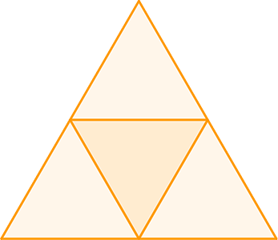
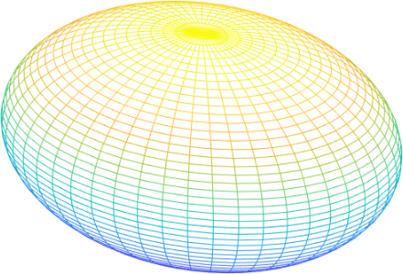
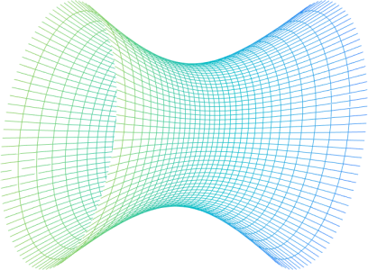

***在冲突的边境修墙，在不冲突的边境不修墙。***

``` NOTICE
我在避免创造第二个共产主义；
我也在避免成为第二个刘晓波。
别跟我谈爱国，你国并不爱你！
教育医疗养老，你还想要什么？
```

## 顺其自然即为美

[TOC]

### 谆谆教诲

``` NOTICE
一只在温水里泡澡的青蛙，
在它被烫熟前还会呱呱叫。
```

### 郑重声明

``` NOTICE
我反对法律，但我不是法律学家；
我参与政治，但我不是政治学家；
我关注经济，但我不是经济学家；
我研究历史，但我不是历史学家；
我整理知识，站在巨人的肩膀上；
我就是我，在我的地盘就听我的。
```

### 关于作者


`` @_@ 蓝色是生死恋
姓名：黄志贵
拼音：Huáng ZhìGuì
性别：男
民族：汉族
宗教：无信仰
理想：天文学家
身份：440882199308051156
公历：1993年09月05日（处女座）
农历：一九九三年七月十九日（属鸡）
籍贯：中华人民共和国广东省湛江市海康县（1994年04月改立雷州市）
本科：广东工业大学计算机学院计算机科学与技术专业2016届
肄业：中国科学院新疆天文台天体物理专业2019届
党派：原中国共产党党员
手机: +86-13611464445（广州移动）
电邮：brilliantstarrysky9395@gmail.com
住址：中国广东省湛江市经济技术开发区园乐苑北区一巷33号702房
``

### 公理化人类社会之框架

``` NOTICE
最好的政府，就是无政府；
最好的政治，就是无政治；
最好的经济，就是无经济；
最好的我们，就是不青春。
```

本公理化人类社会满足以下框架性特征：

1. 社会信用评价系统，完全无政府状态；
2. 社会公理取代法律，灵活性优于法律；
3. 社会契约取代经济，适用性广于经济；
4. 社会角色取代职业，专门性弱于职业；
5. 。。。

### 公理系统

``` NOTICE
在主观感觉极大似然的情形下，事实便被证明。
```

公理系统这个概念最初源自于数学证明，可人为划分成逻辑公理系统和非逻辑公理系统，一个典型的公理系统由５大部分构成：

| *01 概念与定义*         | `// 「概念」即对感性观念的概括反映，` `「定义」即确定意义的「概念」。` |
| :---------------------- | :----------------------------------------------------------- |
| *02 公设与公理*         | `// 「公设」即广泛被认可的先验假设，` `「公理」即理所当然的「公设」，` `「原理」即待反复验证的「公理」。` |
| *03 演绎逻辑或推理规则* | `// 公理系统必须遵循一系列推导法则，` `逻辑公理系统遵循「演绎逻辑」，` `非逻辑公理系统遵循「推理规则」。` |
| *04 命题与证明*         | `// 「命题」即未确定的先验判断，` `「证明」即「命题」被确定化的过程，` `「条件」是创设新环境的「命题」。` |
| *05 定理与推论*         | `// 「定理」即已确定的先验判断，` `「推论」即「定理」再进一步的推广，` `「引理」是引述自他处的「定理」。` |

递归定义与循环论证在数学证明中均十分常见。有效的循环论证即良性循环论证，能简化数学证明的思路过程；无效的循环论证即恶性循环论证，将导致难以察觉的潜在谬误。如果循环论证在推导形式上并无差错，那么其在逻辑上就是合理的。因此在数学证明中，应当竭力避免引入错误的前提条件。

``` NOTICE
// 鸡与鸡蛋问题
鸡生鸡蛋，鸡蛋孵出鸡。
是先有鸡还是先有鸡蛋？
```

公理系统特别是逻辑公理系统同样可能存在循环论证，但无论如何，一个合格的公理系统必须至少满足３大基本性质：

| *01 自洽性* | `// 「弱自洽性」要求公理系统中没有自相矛盾的公理，` `「强自洽性」要求任意公理不会推导出相悖的结论，` `此即意味着公理系统的有效性将完全取决于公理。` |
| :---------- | :----------------------------------------------------------- |
| *02 独立性* | `// 「弱独立性」要求公理系统中没有互相重叠的公理，` `「强独立性」要求任意公理不会被其余公理推导出，` `此即意味着公理系统中每一条公理都是最基本的。` |
| *03 完备性* | `// 「弱完备性」要求公理系统不能删减或拆分旧公理，` `「强完备性」要求公理系统不能增加或整合新公理，` `此即意味着公理系统自身不需要借助外部来运作。` |

任何一个足够严谨的公理系统都不该断然凭空臆造，实际上人们通常在总结大量已有经验知识的基础上，将至关重要但并非准确无疑的现象归纳整理成公理，再逐步补充缺失之处，最终加工成完整的公理系统。公理系统的弱自洽性与弱独立性是相当基本的要求，若采用步步为营的构建方法，弱完备性也不难满足。根据后验主义中正确概率极大便可当作真理这一观点，若公理系统始终从未出现而且极有可能不会出现矛盾，则可认为该公理系统满足强自洽性，除非悖论被发现。若公理系统不满足强独立性，则存在被其余公理推导出的公理。为检验公理系统的强独立性，一种有效方法是构造新公理系统，将强独立性可疑的公理取相悖形式代入，但保持其余公理不变。若新公理系统仍然满足强自洽性，则原可疑公理满足强独立性。在公理系统的强自洽性与强完备性均得到满足的基础上，可进一步考察公理系统的强完备性。然而公理系统的强完备性难以检验更难以满足，因此必要时可将强完备性人为当作公理之一，以确保在所有可考虑的结论都满足强自洽性和强独立性的情形下，人为忽略那些未知的情况。

现代数学各个分支与物理学等学科的终极目标，也许就是在寻找尽可能简洁且完备的公理系统，这些公理系统能准确无误推导出所有重要定理，同时还可清晰表明公理系统中各类公理的含义。

#### 命题逻辑公理系统

人类的语言习惯常常具有歧义性，人类的思维方式在绝大多数情形下具有善意性，这大概是作为高等智慧生物的人类区别于其它灵长类动物同伴的最不可思议之处。是生存还是毁灭，这是一个艰难的抉择，但没有人会愿意接受自身走向毁灭！！！

~~~~~~~~~~~~~~~~~~~~~~~~~~~~~~~~~~~~~~~~~~~~~~~~~~~~~~~~~~~~~~~~~~~~~~~~~~~~~~~~
// 一个典型的兼或语义
前项命题：台湾是国家。
后项命题：台湾是地区。
兼或命题：台湾是国家或者台湾是地区。
语义解析：或者『台湾是国家』为真，或者『台湾是地区』为真，两者可同时满足。

// 一个典型的异或语义
前项命题：中华民国简称中国。
后项命题：中华人民共和国简称中国。
异或命题：中华民国简称中国或者中华人民共和国简称中国。
语义解析：要么『中华民国简称中国』为真，要么『中华人民共和国简称中国』为真，两者只可选其一。

// 一个典型的善意谎言
前项命题：我还活着。
后项命题：咱俩结婚。
蕴涵命题：若我还活着，则咱俩结婚。
思维解析：『我还活着』为真，『咱俩结婚』为真，太好了！
思维解析：『我还活着』为真，『咱俩结婚』为假，去你的；
善意推断：『我还活着』为假，『咱俩结婚』为真，真的吗？
善意推断：『我还活着』为假，『咱俩结婚』为假，没关系。
~~~~~~~~~~~~~~~~~~~~~~~~~~~~~~~~~~~~~~~~~~~~~~~~~~~~~~~~~~~~~~~~~~~~~~~~~~~~~~~~

为有效区分并准确无误重现各种语义，在命题逻辑公理系统中，使用兼或联结词表达兼或语义，使用异或联结词表达在逻辑电路中更为常见的异或语义，使用蕴涵联结词表达蕴涵语义，并认为在前项命题为假时，其后项命题的真假性无关紧要，整个蕴涵语义中根据善意推断原则始终为真。

根据人们在日常生活中的逻辑思维方式，可得到8种命题逻辑联结词的运算表：

|                   |        |  `[基本]`   |   `[基本]`    |   `[基本]`   |      `[常用]`      |           `[常用]`            |       `[电路]`        |       `[电路]`       |            `[电路]`             |
| :---------------: | :----: | :---------: | :-----------: | :----------: | :----------------: | :---------------------------: | :-------------------: | :------------------: | :-----------------------------: |
|                   |        |  **否定**   |   **合取**    |   **析取**   |      **蕴涵**      |           **等价**            |       **与非**        |       **或非**       |            **异或**             |
|      `条件`       | `条件` |    $非P$    |   $P并且Q$    |   $P兼或Q$   |      $若P则Q$      |           $P仅当Q$            |      $P与Q的非$       |      $P或Q的非$      |           $P不兼或Q$            |
|        $P$        |  $Q$   | *$\lnot P$* | *$P \land Q$* | *$P \lor Q$* |    *$P \to Q$*     |    *$P \leftrightarrow Q$*    |   *$P \uparrow Q$*    |  *$P \downarrow Q$*  |         *$P \oplus Q$*          |
|        真         |   真   |     假      |      真       |      真      |         真         |              真               |          假           |          假          |               假                |
|        真         |   假   |     假      |      假       |      真      |         假         |              假               |          真           |          假          |               真                |
|        假         |   真   |     真      |      假       |      真      |         真         |              假               |          真           |          假          |               真                |
|        假         |   假   |     真      |      假       |      假      |         真         |              真               |          真           |          真          |               假                |
| *$\lnot \lnot P$* |        |             | *$Q \land P$* | *$Q \lor P$* | *$\lnot P \lor Q$* | *$(P \to Q) \land (Q \to P)$* | *$\lnot (P \land Q)$* | *$\lnot (P \lor Q)$* | *$\lnot (P \leftrightarrow Q)$* |

根据语义分析不难得到这8种命题逻辑联结词的等值替代形式。在这里需要特别指出的是，蕴涵语义并非必须遵循善意推断原则，实际上即便蕴涵联结词遵循恶意推断原则，对于整个命题逻辑体系而言仍然合理，但这并不符合生而为人的本性。

相对应8种命题逻辑联结词的运算表，可归纳整理成8条命题逻辑公理：

| **01 [基本]否定公理** | // $否定命题\lnot P为假当且仅当命题P为真。$                  |
| :-------------------- | :----------------------------------------------------------- |
| **02 [基本]合取公理** | // $合取命题P \land Q为真，当且仅当命题P为真并且命题Q为真。$ |
| **03 [基本]析取公理** | // $析取命题P \lor Q为真，当且仅当命题P为真兼或命题Q为真。$  |
| *04 [常用]蕴涵公理*   | // $蕴涵命题P \to Q为假，当且仅当命题P为真同时命题Q为假。$   |
| *05 [常用]等价公理*   | // $等价命题P \leftrightarrow Q为真，当且仅当命题P和命题Q真假性相同。$ |
| 06 [重要]与非公理     | // $与非命题P \uparrow Q为假，当且仅当命题P为真并且命题Q为真。$ |
| 07 [重要]或非公理     | // $或非命题P \downarrow Q为假，当且仅当命题P为真兼或命题Q为真。$ |
| 08 [重要]异或公理     | // $异或命题P \oplus Q为真，当且仅当命题P和命题Q真假性相反。$ |

借助于命题逻辑联结词的运算表，可进一步验证29个可等值替代的双向命题演绎逻辑：

$$
\begin{array}{crcl}
\hline
\fbox{01} & 0 &\iff& P \land 0 \\
\fbox{02} & 1 &\iff& P \lor 1 \\
\fbox{03} & 0 &\iff& P \land \lnot P \\
\fbox{04} & 1 &\iff& P \lor \lnot P \\
\hline
\fbox{05} & P &\iff& \lnot \lnot P \\
\fbox{06} & P &\iff& P \land 1 \\
\fbox{07} & P &\iff& P \lor 0 \\
\fbox{08} & P &\iff& P \land P \\
\fbox{09} & P &\iff& P \lor P \\
\fbox{10} & P &\iff& P \land (P \lor Q) \\
\fbox{11} & P &\iff& P \lor (P \land Q) \\
\hline
\fbox{12} & P \land Q         &\iff& Q \land P \\
\fbox{13} & P \lor Q          &\iff& Q \lor P \\
\fbox{14} & \lnot (P \land Q) &\iff& \lnot P \lor \lnot Q \\
\fbox{15} & \lnot (P \lor Q)  &\iff& \lnot P \land \lnot Q \\
\hline
\end{array}
$$
$$
\begin{array}{crcl|l}
\hline
\fbox{16} & P \to Q             &\iff& \lnot P \lor Q \\
\fbox{17} & P \to Q             &\iff& \lnot Q \to \lnot P             & 逆否法 \\
\fbox{18} & P \leftrightarrow Q &\iff& Q \leftrightarrow P \\
\fbox{19} & P \leftrightarrow Q &\iff& \lnot Q \leftrightarrow \lnot P \\
\fbox{20} & P \leftrightarrow Q &\iff& (P \to Q) \land (Q \to P) \\
\hline
\fbox{21} & P \uparrow Q   &\iff& \lnot (P \land Q) \\
\fbox{22} & P \downarrow Q &\iff& \lnot (P \lor Q) \\
\fbox{23} & P \oplus Q     &\iff& \lnot (P \leftrightarrow Q) \\
\hline
\fbox{24} & (P \land Q) \land R &\iff& P \land (Q \land R) \\
\fbox{25} & (P \lor Q) \lor R   &\iff& P \lor (Q \lor R) \\
\fbox{26} & (P \land Q) \lor R  &\iff& (P \land Q) \lor (P \land R) \\
\fbox{27} & (P \lor Q) \land R  &\iff& (P \lor Q) \land (P \lor R) \\
\hline
\fbox{28} & (P \to Q) \land (P \to \lnot Q)       &\iff& \lnot P                                       & 归谬法 \\
\fbox{29} & P1 \land P2 \land \dots \to Q         &\iff& \lnot (P1 \land P2 \land \dots \land \lnot Q) & 反证法 \\
\fbox{30} & P1 \land P2 \land \dots \to (Q \to R) &\iff& P1 \land P2 \land \dots \land Q \to R         & 附加法 \\
\hline
\end{array}
$$

现在我们来考察命题逻辑公理系统的独立性与完备性，注意到：

$$
\begin{array}{crcl|l}
\hline
\fbox{14} & P \land Q &\iff& \lnot(\lnot P \lor \lnot Q)   & \lbrace \lnot, \lor \rbrace \text{ 可等值替代 } \lbrace \land \rbrace \\
\fbox{15} & P \lor Q  &\iff& \lnot (\lnot P \land \lnot Q) & \lbrace \lnot, \land \rbrace \text{ 可等值替代 } \lbrace \lor \rbrace \\
\hline
\fbox{16} & P \to Q             &\iff& \lnot P \lor Q            & \lbrace \lnot, \lor \rbrace \text{ 可等值替代 } \lbrace \to \rbrace \\
\fbox{20} & P \leftrightarrow Q &\iff& (P \to Q) \land (Q \to P) & \lbrace \to, \land \rbrace \text{ 可等值替代 } \lbrace \leftrightarrow \rbrace \\
\hline
\fbox{21} & P \uparrow P   &\iff& \lnot P                     & \lbrace \lnot \rbrace \text{ 可互相等值替代 } \lbrace \uparrow \rbrace \\
\fbox{22} & P \downarrow P &\iff& \lnot P                     & \lbrace \lnot \rbrace \text{ 可互相等值替代 } \lbrace \downarrow \rbrace \\
\fbox{23} & P \oplus Q     &\iff& \lnot (P \leftrightarrow Q) & \lbrace \lnot, \leftrightarrow \rbrace \text{ 可等值替代 } \lbrace \oplus \rbrace \\
\hline
\fbox{21} & \lnot (P \uparrow Q)   &\iff& P \land Q & \lbrace \lnot, \uparrow \rbrace \text{ 可等值替代 } \lbrace \land \rbrace \\
\fbox{22} & \lnot (P \downarrow Q) &\iff& P \lor Q  & \lbrace \lnot, \downarrow \rbrace \text{ 可等值替代 } \lbrace \lor \rbrace \\
\hline
\end{array}
$$

对于人们日常生活的逻辑思维来说，若将 {¬, ∧, ∨} 作为基本命题逻辑联结词，则可等值替代 {→, ↔} 这两种常用命题逻辑联结词，因此 {¬, ∧, ∨} / {¬, ∧, ∨, →} / {¬, ∧, ∨, →, ↔} 都可完全表达所有命题逻辑，但都不满足公理系统的强独立性。因为 {¬, ∧} 不可自我等值替代但可等值替代 {∨}，而且 {¬, ∨} 不可自我等值替代但可等值替代 {∧}，所以 {¬, ∧} / {¬, ∨} 均满足公理系统的强独立性和强完备性，{否定公理, 合取公理} / {否定公理, 析取公理} 均可构成命题逻辑公理系统。按照类似的论证方法，{↑} / {↓} 均满足公理系统的强独立性和强完备性，{与非公理} / {或非公理} 均可构成命题逻辑公理系统。同理 {∧, ∨} 满足公理系统的强独立性，但不满足公理系统的强完备性，{合取公理，析取公理} 不可构成命题逻辑公理系统。

在命题逻辑体系中，类似于蕴涵联结词，具有以下形式的单向演绎逻辑：

~~~~~~~~~~~~~~~~~~~~~~~~~~~~~~~~~~~~~~~~~~~~~~~~~~~~~~~~~~~~~~~~~~~~~~~~~~~~~~~~
前提条件：$P1, P2, \dots$
有效推论：$Q$
演绎逻辑：$P1 \land P2 \land \dots \implies Q$
单向演绎逻辑$P1 \land P2 \land \dots \implies Q$正确，当且仅当$P1 \land P2 \land \cdots \implies Q$为真
~~~~~~~~~~~~~~~~~~~~~~~~~~~~~~~~~~~~~~~~~~~~~~~~~~~~~~~~~~~~~~~~~~~~~~~~~~~~~~~~

借助于可等值替代的双向命题演绎逻辑，可进一步验证10个非等值替代的单向命题演绎逻辑：

$$
\begin{array}{crcl|l}
\hline
\fbox{01} & P                                                      &\implies& P \lor Q \\
\fbox{02} & P \land Q                                              &\implies& P \\
\fbox{03} & \lnot P \land (P \lor Q)                               &\implies& Q \\
\fbox{04} & P \land (P \to Q)                                      &\implies& Q \\
\fbox{05} & \lnot Q \land (P \to Q)                                &\implies& \lnot P \\
\fbox{06} & (P \to Q) \land (Q \to R)                              &\implies& P \to R              & 演绎推断 \\
\fbox{07} & (P \leftrightarrow Q) \land (Q \leftrightarrow R)      &\implies& P \leftrightarrow R  & 等值推断 \\
\fbox{08} & (P \lor R) \land (P \to Q) \land (R \to S)             &\implies& Q \lor S \\
\fbox{09} & (\lnot P \to Q) \land (P \to Q)                        &\implies& Q \\
\fbox{10} & (\lnot Q \lor \lnot S) \land (P \to Q) \land (R \to S) &\implies& \lnot P \lor \lnot R & 非难推断 \\
\hline
\end{array}
$$

命题逻辑具有局限性并不能包罗万象，因而还有比命题逻辑更复杂的谓词逻辑，命题逻辑仅仅是谓词逻辑的特殊形式。但即便如此，在日常生活中命题逻辑仍然适用于众多情形。

~~~~~~~~~~~~~~~~~~~~~~~~~~~~~~~~~~~~~~~~~~~~~~~~~~~~~~~~~~~~~~~~~~~~~~~~~~~~~~~~
// 一个典型的演绎推断
$\fbox{06}\; (P \to Q) \land (Q \to R) \implies P \to R$
命题$P$：我还活着；
命题$Q$：咱俩结婚；
命题$R$：宝宝出生。
大前提：若我还活着，则咱俩结婚；
小前提：若咱俩结婚，则宝宝出生；
=>推论：若我还活着，则宝宝出生。

// 一个典型的非难推断
$\fbox{10}\; (\lnot Q \lor \lnot R) \land (P \to Q) \land (P \to R) \implies \lnot P$
命题$P$：口头承诺有效；
命题$Q$：政治体制改革；
命题$R$：经济体制改革；
前提一：政治体制未改革或经济体制未改革；
前提二：若口头承诺有效，则政治体制改革；
前提三：若口头承诺有效，则经济体制改革；
=>推论：口头承诺无效。
~~~~~~~~~~~~~~~~~~~~~~~~~~~~~~~~~~~~~~~~~~~~~~~~~~~~~~~~~~~~~~~~~~~~~~~~~~~~~~~~

#### 欧几里德公理系统

被誉为几何学之父的古希腊数学家欧几里得（古希腊语：Εὐκλείδης，约公元前330年~公元前275年）生平不详，著有人类文明史上最负盛名的数学教科书《几何原本》十三卷，这是世界上最早的公理化数学著作，同时也是西方现存最古老的科学著作，据称在全球范围内流传甚广仅次于基督教经典《圣经》。

《几何原本》集古希腊数学三大成就为一体，即欧多克索斯（古希腊语：Εὔδοξος，约公元前408年~公元前355年）的比例论以及西泰阿泰德（古希腊语：Θεαίτητος，约公元前417年~公元前369年）的无理数与正多面体。在这本书中欧几里得通过归纳整理前人的知识成果，从少量一般公理与平面公设出发，并且结合百余条概念定义，运用严格的推理规则来证明数百个命题，将整个几何体系层层递进推演而出，从而建立起首个数学公理系统，被称为欧几里得公理系统。

~~~~~~~~~~~~~~~~~~~~~~~~~~~~~~~~~~~~~~~~~~~~~~~~~~~~~~~~~~~~~~~~~~~~~~~~~~~~~~~~
基本定义摘录：
01 点除自身外再无其它部分。
02 线具有长度无宽度无高度。
03 面具有长度与宽度无高度。
04 体具有长度与宽度及高度。
05 角是两条相交线的倾斜度。

一般公理共5条：
01 与同量相等的量彼此相等。
02 等量加等量，其和仍相等。
03 等量减等量，其差仍相等。
04 与同量重合的量彼此全等。
05 量的整体大于该量的部分。

平面公设共5条：
01 过任意两点可作一条直线。
02 线段可无限延伸成为直线。
03 固定线段一端可作一个圆。
04 所有直角都必定彼此相等。
05 [平行公设] 两条直线与同一直线相交，若同侧内角之和小于平角，则这两条直线在该侧相交。
~~~~~~~~~~~~~~~~~~~~~~~~~~~~~~~~~~~~~~~~~~~~~~~~~~~~~~~~~~~~~~~~~~~~~~~~~~~~~~~~

《几何原本》中所选取的一般公理都十分基本，所选取的平面公设除第5条公设外都十分直观。所有命题的证明要么直接引用一般公理与平面公设，要么引用已被证明的命题，即间接引用一般公理与平面公设。然而应当指出的是，《几何原本》所采用的公理化方法，虽然构成完整的几何证明体系，但却并非严格满足公理系统的基本性质。例如第4条平面公设，实际上可以由其余一般公理与平面公设，以及概念定义经过推理得到。全书没有给出任何定理，不过这些已被证明的命题实际上等同于定理。例如命题Ⅰ47就是举世闻名的勾股定理，在西方称毕达哥拉斯（希腊语：Πυθαγόρας，公元前570年~公元前495年）定理，最早由毕达哥拉斯学派证明，这个学派还因此发现无理数（即不可通约量）的存在。

~~~~~~~~~~~~~~~~~~~~~~~~~~~~~~~~~~~~~~~~~~~~~~~~~~~~~~~~~~~~~~~~~~~~~~~~~~~~~~~~
重要命题摘录：
命题Ⅰ13：两条相交直线所成邻角，或者均为直角，或者其和等于平角。
命题Ⅰ27：两条直线与同一直线相交，若内错角彼此相等，则这两条直线互相平行。
命题Ⅰ29：两条平行直线与同一直线相交，内错角相等，同位角相等，同旁内角之和等于平角。
命题Ⅰ30：与同一直线平行的直线互相平行。
命题Ⅰ47：[勾股定理] 在直角三角形中，斜边上正方形的面积等于两直角边上正方形的面积之和。
~~~~~~~~~~~~~~~~~~~~~~~~~~~~~~~~~~~~~~~~~~~~~~~~~~~~~~~~~~~~~~~~~~~~~~~~~~~~~~~~

欧几里得公理系统所构造出来的几何空间，被称为欧几里得几何空间，这就是人们依据日常经验所感觉存在的平直几何空间，即用以表征空间弯曲程度的空间曲率处处恒为零。欧几里得公理系统中的第5公设，通常被称为平行公设，直线之间的相互关系完全由平行公设规定。从平行公设出发，可以确定欧几里得几何空间中两条极其重要的空间性质，即过直线外一点有且仅有一条平行直线，同时三角形的三个内角之和等于180°。


~~~~~~~~~~~~~~~~~~~~~~~~~~~~~~~~~~~~~~~~~~~~~~~~~~~~~~~~~~~~~~~~~~~~~~~~~~~~~~~~
命题Ⅰ31：过直线外一点有且仅有一条平行直线。
已知条件：给定直线BC，给定点A。
简约证明⬇
在直线BC上任意取一点D，连接线段AD，作角∠EAD=角∠ADC，延长线段EA成为直线EF。
∵ 内错角∠EAD=内错角∠ADC；
∴ 直线EF∥直线BC。【命题Ⅰ27】
假设过直线BC外点A，可作不同于直线EF的平行直线GH，角∠DAH<角∠DAF。
∵ 直线EF∥直线BC；
∴ 同旁内角∠ADC+同旁内角∠DAF=180°。【命题Ⅰ29】
∵ 角∠DAH<角∠DAF；【根据假设】
∴ 同旁内角∠ADC+同旁内角∠DAH<180°。
∴ 直线GH与直线BC相交，这与直线GH∥直线BC的假设互相矛盾。【平面公设05】

命题Ⅰ32：三角形的任意外角等于两内对角之和，三角形的三个内角之和等于180°。
已知条件：任意三角形△ABC，延长边BC至点D。
简约证明⬇
过直线AB外点C作平行直线CE。【命题Ⅰ31】
∵ 直线AB∥直线CE；
∴ 内错角∠BAC=内错角∠ACE，同位角∠ABC=同位角∠ECD。【命题Ⅰ29】
∵ 外角∠ACD=角∠ACE+角∠ECD；
∴ 外角∠ACD=内对角∠BAC+内对角∠ABC。【一般公理02】
∵ 角∠BCA+角∠ACD=180°；【命题Ⅰ13】
∴ 内角∠BCA+内角∠BAC+内角∠ABC=180°。
~~~~~~~~~~~~~~~~~~~~~~~~~~~~~~~~~~~~~~~~~~~~~~~~~~~~~~~~~~~~~~~~~~~~~~~~~~~~~~~~

《几何原本》在末卷里着重给出5种正多面体的构造性证明，与圆球体类似，这5种正多面体以其高度完美的空间对称性，成为西方众多哲学流派的思想源泉。

| **正多面体** |                        **三维立体图**                        |                        **三维结构图**                        | **对偶正多面体** | **构成面** | **顶点角之和** | **面数** | **边数** | **点数** | **平面展开图**                                               |
| :----------: | :----------------------------------------------------------: | :----------------------------------------------------------: | :--------------: | :--------: | :------------: | :------: | :------: | :------: | ------------------------------------------------------------ |
|  *正四面体*  |  |  |    `正四面体`    | `正三边形` |     60°×3      |    4     |    6     |    4     |  |
|  *正六面体*  |  |  |    `正八面体`    | `正四边形` |     90°×3      |    6     |    12    |    8     |  |
|  *正八面体*  |  |  |    `正六面体`    | `正三边形` |     60°×4      |    8     |    12    |    6     |  |
| *正十二面体* |  |  |   `正二十面体`   | `正五边形` |     108°×3     |    12    |    30    |    20    |  |
| *正二十面体* |  |  |   `正十二面体`   | `正三边形` |     60°×5      |    20    |    30    |    12    |  |

除此之外，《几何原本》在结尾处还给出至多有5种正多面体的证明，因此在欧几里得空间中，有且仅有5种正多面体。这个结论同时意味着，必定有某种客观存在的精致秩序在支配着这个世界的运作。


~~~~~~~~~~~~~~~~~~~~~~~~~~~~~~~~~~~~~~~~~~~~~~~~~~~~~~~~~~~~~~~~~~~~~~~~~~~~~~~~
命题：有且仅有5种正多面体。
证明⬇
∵ 任何多面体每个顶点关联面数至少为3，每个顶点关联的平面角之和必须小于360°，正多面体的每个平面角均相等；
∴ 正多面体的每个平面角均小于360°÷3=120°。
∵ 正六边形每个内角均为120°，更多边正多边形每个内角均大于120°；
∴ 不存在以正六边形或者更多边正多边形为构成面的正多面体。
∵ 正三边形每个内角均为60°；
∴ 以正三边形为构成面的正多面体，每个顶点关联面数小于360°÷60°=6，即每个顶点关联面数仅可能为3/4/5，这相对应于的正四面体/正八面体/正二十面体。
∵ 正四边形每个内角均为90°；
∴ 以正四边形为构成面的正多面体，每个顶点关联面数小于360°÷90°=4，即每个顶点关联面数仅可能为3，这相对应于正六面体。
∵ 正五边形每个内角均为108°；
∴ 以正五边形为构成面的正多面体，每个顶点关联面数小于360°÷108°<4，即每个顶点关联面数仅可能为3，这相对应于正十二面体。
综上所述，有且仅有5种正多面体，即正四面体/正六面体/正八面体/正十二面体/正二十面体。
~~~~~~~~~~~~~~~~~~~~~~~~~~~~~~~~~~~~~~~~~~~~~~~~~~~~~~~~~~~~~~~~~~~~~~~~~~~~~~~~

值得注意的是，欧几里得公理系统的平行公设，无论在形式上还是在内容上，均有别于其余一般公理与平面公设，反而更像是一个命题。自《几何原本》流传于世，便有众多数学家反复研究平行公设，试图从其余一般公理与平面公设出发，找到证明平行公设的方法，但都终归于失败。直到1823年，杰出的俄国数学家罗巴切夫斯基（俄语：Никола́й Ива́нович Лобаче́вский，1792年~1856年）意识到，在欧几里得公理系统中试图证明平行公设，也许并没有什么意义。于是他独辟蹊径将平行公设的否定形式引入公理系统，但却没有发现任何匪夷所思的矛盾，从而可知平行公设的确是一条独立公设，既不能被证明也不能被否定。罗巴切夫斯基几何由此宣告诞生，意外带给世界一个颠覆性的全新空间观念，当然罗巴切夫斯基的工作在其生前并未得到同行的理解。罗巴切夫斯基几何建立在双曲面上（又称双曲几何），狭义的非欧几里得几何除罗巴切夫斯基几何外，还包括由著名的德国数学家黎曼（德语：Georg Friedrich Bernhard Riemann，1826年~1866年），建立在椭球面上黎曼几何（又称椭圆几何），正是利用黎曼几何与张量分析作为数学工具，1915年爱因斯坦（德语：Albert Einstein，1879年~1955年）得以将狭义相对论推广成为广义相对论，并再一次打破自被誉为现代科学之父的意大利科学家伽利略（意大利语：Galileo Galilei，1564年~1642年）时代以来的绝对时空观念，宇宙中的时空竟然是弯曲的引力场！所有非欧几里得几何均不满足欧几里得几何的平行公设，而且非欧几里得几何空间中的直线在欧几里得几何空间中呈现为曲线。

|  |    |  |
| :----------------------------------------------------------: | :----------------------------------------------------------: | :----------------------------------------------------------: |
|  |  |  |
|                         **椭圆几何**                         |                         **平直几何**                         |                         **双曲几何**                         |
|                         *[黎曼几何]*                         |                       *[欧几里得几何]*                       |                     *[罗巴切夫斯基几何]*                     |
|                      `曲率处处为正常数`                      |                       `曲率处处恒为零`                       |                      `曲率处处为负常数`                      |
|                  `三角形的内角之和小于180°`                  |                  `三角形的内角之和等于180°`                  |                  `三角形的内角之和大于180°`                  |
|                  `过直线外一点没有平行直线`                  |                `过直线外一点仅有一条平行直线`                |               过直线外一点至少存在两条平行直线               |

两千余年来，几乎西方所有的初等几何教科书，以及19世纪以前一切有关初等几何的论著，都以《几何原本》作为依据，现代初等几何教科书的内容都没有超出欧几里得几何的范围。不过以现代数学公理系统的视角来看，欧几里得公理系统并非完美无瑕，欧几里得给出许多直观的基本定义，要想从这些基本定义严谨地推导出任何推论，那几乎是不可能的。大多数命题的证明都或直接或间接借助于直觉，但却无法判断这种直觉在多大程度上是合理的，而人们常常自以为借助于直觉的推理相当可靠。许多数学家曾尝试在欧几里得公理系统的框架内将其修正和完善，但都没有取得实质性进展。直到1899年，伟大的德国数学家希尔伯特在其著作《几何基础》中才标志着这些无谓的尝试归于结束，希尔伯特选择放弃欧几里得公理系统中数量众多的基本定义，仅从少数必要定义和五组基本公理出发，成功建立起一个逻辑结构十分严谨的平直几何空间体系，被称为希尔伯特公理系统。《几何基础》所采用的公理化方法，将点/线/面/体/角等几何对象当作不加定义的纯粹抽象物，然后添加关联关系/顺序关系/合同关系这三组基本关系，最后再添加平行性质/连续性质这两组重要性质，从而构成完备的数学公理系统。此处给出希尔伯特公理系统，以方便一探究竟。

~~~~~~~~~~~~~~~~~~~~~~~~~~~~~~~~~~~~~~~~~~~~~~~~~~~~~~~~~~~~~~~~~~~~~~~~~~~~~~~~
基本定义摘录：
01 点是直线几何的元素，用A/B/C···表示。
02 直线是平面几何的元素，用a/b/c···表示。
03 平面是空间几何的元素，用α/β/γ···表示。
04 角∠(h,k)由同一点O起始的射线h与射线k构成，点O是这个角的顶点，射线h与射线k是这个角的边。

Ⅰ 关联公理共8条：
Ⅰ1 对于任意两点，恒有一直线与这两点相关联。
Ⅰ2 对于任意两点，至多有一直线与这两点相关联。
Ⅰ3 至少有两点在同一直线上，至少有三点不在同一直线上。
Ⅰ4 对于不在同一直线上的任意三点，恒有一个平面与这三点相关联。对于任意平面，恒有一点与这平面相关联。
Ⅰ5 对于不在同一直线上的任意三点，至多有一个平面与这三点相关联。
Ⅰ6 若直线有两点在同一平面上，则直线的每一点都在这平面上。
Ⅰ7 若两平面有一公共点，则这两平面至少还有另一公共点。
Ⅰ8 至少有四点不在同一平面上。

Ⅱ 顺序公理共4条：
Ⅱ1 在直线AC上，若点B在点A与点C之间，则点B在点C与点A之间。
Ⅱ2 在直线AC上，至少有一点B，使得点C在点A与点B之间。
Ⅱ3 对于同一直线上的任意三点，至多有一点在其余两点之间。
Ⅱ4 在平面ABC上，若直线a与线段AB相交，则直线a要么与线段AC相交，要么与线段BC相交。

Ⅲ 全等公理共5条：
Ⅲ1 已知线段AB与点A'，则在点A'的任意一侧，恒有一点B'使得线段AB与线段A'B'全等，记为线段AB≡线段A'B'。
Ⅲ2 若线段A'B'≡线段AB，且线段A"B"≡线段AB，则线段A'B'≡线段A"B"。
Ⅲ3 已知在同一直线上点B在点A与点C之间，且在另一直线上点B'在点A'与点C'之间。若线段AB≡线段A'B'，且线段BC≡线段B'C'，则线段AC≡线段A'C'。
Ⅲ4 已知角∠(h,k)与射线h'，则在射线h'的任意一侧，恒有一条射线k'使得角∠(h',k')与角∠(h,k)全等，记为角∠(h,k)≡角∠(h',k')。
Ⅲ5 对于三角形△ABC与三角形△A'B'C'，若边AB≡边A'B'，且边AC≡边A'C'，且角∠BAC≡角∠B'A'C'，则角∠ABC≡角∠A'B'C'，且角∠ACB≡角∠A'C'B'。

Ⅳ 平行公理共1条：
Ⅳ1 [欧几里得公理] 已知直线a与直线a外点A，在直线a与点A所确定的平面上，至多有一直线通过点A但不与直线a相交。

Ⅴ 连续公理共2条：
Ⅴ1 [阿基米德公理] 已知线段AB与线段CD，存在数n使得在沿A到B的射线上，自A作首尾相接的n个线段CD，将越过B点。
Ⅴ2 [直线完备公理] 直线上的点集连同其顺序关系与全等关系，不可能再进一步扩充，但仍然满足公理Ⅰ~Ⅲ与公理Ⅴ1。

重要定理摘录：
01 同一平面上非重合的两直线，要么有一公共点，要么没有公共点。
02 一平面与不在其上的一直线，要么有一公共点，要么没有公共点。
03 不是互相重合的两平面，要么有一公共直线，要么没有公共直线。
04 过直线与该直线外一点，或者过两相交直线，有且仅有一个平面。
05 同一直线上任意两点之间有无穷多个点。
06 所有直角都彼此全等。
~~~~~~~~~~~~~~~~~~~~~~~~~~~~~~~~~~~~~~~~~~~~~~~~~~~~~~~~~~~~~~~~~~~~~~~~~~~~~~~~

希尔伯特公理系统显然并不直观，此处给出些许注记以方便理解：

~~~~~~~~~~~~~~~~~~~~~~~~~~~~~~~~~~~~~~~~~~~~~~~~~~~~~~~~~~~~~~~~~~~~~~~~~~~~~~~~
对希尔伯特公理系统的些许注记：
非互相重合的两点确定一条直线。
非同一直线的三点确定一个平面。
非同一平面的四点确定一个球面。
同一直线上的点必按照线性排序。
重合即全等，按比例缩放即相似。
直线有相交/平行/异面三种关系。
直线上点的坐标与实数一一对应。
~~~~~~~~~~~~~~~~~~~~~~~~~~~~~~~~~~~~~~~~~~~~~~~~~~~~~~~~~~~~~~~~~~~~~~~~~~~~~~~~

#### 实数公理系统

历史上，毕达哥拉斯学派宣称数是世间万物之本原，他们不仅认为万物皆为数，而且企图用数来解释一切。在他们看来，数是构成物体的基本，作为一切数之始基的1是第一基本，由1派生出其余物体。点是1/线是2/面是3/体是4，点动成线/线动成面/面动成体，体构成水/火/土/气四种元素。毕达哥拉斯学派对数的痴迷近于狂热，他们相信任何关系都可以用有理数（即可通约量）来表示。然而毕达哥拉斯学派的希帕索斯（古希腊语：Ίππασος）却意外发现，边长为1的正方形其对角线长度是无理数（不可通约量），这对他们的信条来说无疑是一个致命的打击，据说希帕索斯因此被淹死，数学史上第一次危机由此产生。

~~~~~~~~~~~~~~~~~~~~~~~~~~~~~~~~~~~~~~~~~~~~~~~~~~~~~~~~~~~~~~~~~~~~~~~~~~~~~~~~
$命题：有理数是稠密的。$
$证明⬇$
$对于任意有理数\dfrac{p_1}{q_1}与有理数\dfrac{p_2}{q_2}，若\dfrac{p_1}{q_1} < \dfrac{p_2}{q_2}，则\dfrac{p_1}{q_1} < \dfrac{1}{2} \left(\dfrac{p_1}{q_1} + \dfrac{p_2}{q_2} \right) < \dfrac{p_2}{q_2}，且\dfrac{1}{2} \left(\dfrac{p_1}{q_1} + \dfrac{p_2}{q_2} \right)是有理数。$
$即任意两个不同的有理数之间至少存在一个有理数，因此任意两个不同的有理数之间存在无穷多个有理数。$

$命题：\sqrt{2}为无理数。$
$证明⬇$
$假设\sqrt{2}为有理数。$
$∵ \sqrt{2} = \dfrac{p}{q}，\dfrac{p}{q}为最简分数；$
$∴ 2 q^2 = p^2，p^2为偶数。$
$∴ p为偶数。【平方运算保持奇偶性】$
$再假设p = 2 r。$
$∵ p^2 = 4 r^2；$
$∴ q^2 = 2 r^2，q^2为偶数。$
$∴ q为偶数。【平方运算保持奇偶性】$
$这与\dfrac{p}{q}为最简分数的假设互相矛盾。$

$推论：有理数是稠密的，但非连续的。$
$例子：有理数1 < 无理数\sqrt{2} < 有理数2。直线上点的坐标并非与有理数一一对应，即存在不是有理数的孔隙。$
~~~~~~~~~~~~~~~~~~~~~~~~~~~~~~~~~~~~~~~~~~~~~~~~~~~~~~~~~~~~~~~~~~~~~~~~~~~~~~~~

与整数不同，有理数是稠密的，存在间隔无穷小的两个有理数。但有理数并不能填满直线上的点，存在不是有理数的孔隙。当引入无理数将有理数扩充成实数以后，实数就可以填满直线上的点。回顾数系的形成史，其实就是为满足各种代数运算的封闭性即完备性，而对已失效的原有数系进行扩充的发展史。

| **运算**             | **$性质：正整数\mathbb{Z}^+ \subset自然数\mathbb{N} \subset 整数\mathbb{Z} \subset 有理数\mathbb{Q} \subset 实数\mathbb{R} \subset 复数\mathbb{C}$** | **例子**                  | **满足**                                           |
| :------------------- | :----------------------------------------------------------- | :------------------------ | :------------------------------------------------- |
| *加法*               | `对正整数运算封闭。`                                         | $1 + 1 = 2$               | $\mathbb{Z}^+ + \mathbb{Z}^+ \mapsto \mathbb{Z}^+$ |
| *减法*               | `对正整数运算不封闭，引入零，扩充成自然数，再引入负整数，扩充成整数。` | $2 - 5 = -3$              | $\mathbb{Z} - \mathbb{Z} \mapsto \mathbb{Z}$       |
| *乘法*               | `对整数运算封闭。`                                           | $2 × (-3) = -6$           | $\mathbb{Z} × \mathbb{Z} \mapsto \mathbb{Z}$       |
| *除法（除数不为零）* | `对整数运算不封闭，引入分数，扩充成有理数。`                 | $2 ÷ 3 = \dfrac{2}{3}$    | $\mathbb{Q} ÷ \mathbb{Q} \mapsto \mathbb{Q}$       |
| *开方*               | `对正有理数运算不封闭，引入无理数，扩充成实数。`             | $\sqrt{2} ≠ \dfrac{p}{q}$ | $\mathbb{R}^n \mapsto \mathbb{R}$                  |
| *开方*               | `对负实数运算不封闭，引入虚数，扩充成复数。`                 | $\sqrt{-1} = \imath$      | $\mathbb{C}^n \mapsto \mathbb{C}$                  |

为满足负实数开方运算的封闭性，在引入虚数$\imath$以后，将导致二维复平面上复数的出现，这相对于一维直线上的实数来说，除维度被扩张外，还有复数运算的复杂化。实数是满足加减乘除四则运算以及正数开方运算之封闭性的最小数系，足以应付人们在日常生活中遇到的种各种代数方程，因此相对于其它数系，人们对实数公理系统更感兴趣。

$$
实数公理系统 \\
\begin{array}{lll} \hline
Ⅰ 加运算公理共４条 &
\begin{array}{ll|l}
Ⅰ1_+ & x + 0 = x                 & 存在加法零元0 \\
Ⅰ2_+ & x + (-x) = 0              & 存在加法负元-x \\
Ⅰ3_+ & x + (y + z) = (x + y) + z & 满足加法结合律 \\
Ⅰ4_+ & x + y = y + z             & 满足加法交换律 \\
\end{array} \\ \hline
Ⅱ 乘运算公理共５条 &
\begin{array}{ll|l}
Ⅱ1_×     & x × 1 = x                   & 存在乘法幺元1 \\
Ⅱ2_×     & x × x^{-1} = 1              & 存在乘法逆元x^{-1}对于x ≠ 0 \\
Ⅱ3_×     & x × (y × z) = (x × y) × z   & 满足乘法结合律 \\
Ⅱ4_×     & x × y = y × x               & 满足乘法交换律 \\
Ⅱ5_{× +} & x × (y + z) = x × y + x × z & 满足乘法分配律 \\
\end{array} \\ \hline
Ⅲ 线性序公理共６条 &
\begin{array}{llclcl|l}
Ⅲ1_≤     & x ≤ x &      &       &        &               & 满足自反性 \\
Ⅲ2_≤     & x ≤ y &\land & y ≤ x &\implies& x = y         & 满足反对称 \\
Ⅲ3_≤     & x ≤ y &\land & y ≤ z &\implies& x ≤ z         & 满足传递性 \\
Ⅲ4_≤     & x ≤ y &\oplus& y ≤ x &        &               & 满足线性序 \\
Ⅲ5_{≤ +} &       &      & x ≤ y &\implies& x + z ≤ y + z & 满足可加性 \\
Ⅲ6_{≤ ×} & 0 ≤ x &\land & 0 ≤ y &\implies& 0 ≤ x × y     & 满足可乘性 \\
\end{array} \\ \hline
Ⅳ 连续性公理共１条 &
\begin{array}{llcl|l}
Ⅳ1_r & x ≤ y &\implies& x ≤ r ≤ y & 存在实数 r \\
\end{array} \\ \hline
\end{array}
$$

从加运算公理与乘运算公理出发，可以构建一些常用推论

~~~~~~~~~~~~~~~~~~~~~~~~~~~~~~~~~~~~~~~~~~~~~~~~~~~~~~~~~~~~~~~~~~~~~~~~~~~~~~~~
$推论：在实数中有唯一加法零元0。$
$推论：在实数中有唯一乘法幺元1。$
$证明：若在实数中有两个零元0_1与零元0_2，则0_1 = 0_1 + 0_2 = 0_2 + 0_1 = 0_2。$
$证明：若在实数中有两个幺元1_1与幺元1_2，则1_1 = 1_1 × 1_2 = 1_2 × 1_1 = 1_2。$

$推论：对于实数x，有唯一加法负元-x。$
$推论：对于实数x ≠ 0，有唯一乘法逆元x^{-1}。$
$证明：若对于实数x，有两个负元(-x)_1$和负元$(-x)_2，则(-x)_1 = (-x)_1 + 0 = (-x)_1 + [x + (-x)_2] = [(-x)_1 + x] + (-x)_2 = 0 + (-x)_2 = (-x)_2 + 0 = (-x)_2。$
$证明：若对于实数x ≠ 0，有两个逆元(x^{-1})_1和逆元(x^{-1})_2，则(x^{-1})_1 = (x^{-1})_1 × 1 = (x^{-1})_1 × [x × (x^{-1})_2] = [(x^{-1})_1 × x] × (x^{-1})_2 = 1 × (x^{-1})_2 = (x^{-1})_2 × 1 = (x^{-1})_2。$

$定义：减法是加法的负运算。对于实数b，有a - b = a + (-b)。$
$定义：除法是乘法的逆运算。对于实数b ≠ 0，有a ÷ b = a × b^{-1}。$
$推论：对于实数a，有a - a = 0。$
$推论：对于实数a ≠ 0，有a ÷ a = 1。$

$推论：对于实数x，有x = -(-x)。$
$推论：对于实数x ≠ 0，有x = (x^{-1})^{-1}。$
$证明：对于实数x，有x + (-x) = 0 \iff [x + (-x)] - (-x) = 0 - (-x) \iff x + [(-x) - (-x)] = 0 + [- (-x)] \iff x + 0 = [- (-x)] + 0 \iff x = - (-x)。$
$证明：对于实数x ≠ 0，有x × x^{-1} = 1 \iff (x × x^{-1}) ÷ x^{-1} = 1 ÷ x^{-1} \iff x × (x^{-1} ÷ x^{-1}) = 1 × (x^{-1})^{-1} \iff x × 1 = (x^{-1})^{-1} × 1 \iff x = (x^{-1})^{-1}。$

$推论：方程x + a = b，对于实数a，有唯一解x = b - a。$
$推论：方程x × a = b，对于实数a ≠ 0，有唯一解x = b ÷ a。$
$推论：方程x × y = 0，对于实数x与实数y，有唯一解(x = 0) \lor (y = 0)。$
$证明：对于实数a，有x + a = b \iff (x + a) - a = b - a \iff x + (a - a) = b - a \iff x + 0 = b - a \iff x = b - a。$
$证明：对于实数a ≠ 0，有x × a = b \iff (x × a) ÷ a = b ÷ a \iff x × (a ÷ a) = b ÷ a \iff x × 1 = b ÷ a \iff x = b ÷ a。$
$证明：对于实数x与实数y，有(x × y = 0) \iff (y = 0) \lor [(y ≠ 0) \land (x = 0 ÷ y = 0)] \iff [(y = 0) \lor (y ≠ 0)] \land [(y = 0) \lor (x = 0)] \iff 1 \land [(x = 0) \lor (y = 0)] \iff (x = 0) \lor (y = 0)。$

$推论：对于实数x，有x × 0 = 0。$
$推论：对于实数x，有x × (-1) = -x。$
$推论：对于实数x与实数y，有(-x) × (-y) = x × y。$
$证明：对于实数x，有x × 0 + x × 0 = x × (0 + 0) = x × 0 \iff x × 0 = x × 0 - x × 0 = 0 \iff x × 0 = 0。$
$证明：对于实数x，有x × (-1) + x × 1 = x × [(-1) + 1] = x × 0 = 0 \iff x × (-1) = 0 - x × 1 \iff x × (-1) = -x。$
$证明：对于实数x与实数y，(-x) × (-y) = [x × (-1)] × [y × (-1)] = x × [(-1) × (-1)] × y = x × 1 × y = x × y。$
~~~~~~~~~~~~~~~~~~~~~~~~~~~~~~~~~~~~~~~~~~~~~~~~~~~~~~~~~~~~~~~~~~~~~~~~~~~~~~~~

从线性序公理出发，可以构建一些常用推论。

~~~~~~~~~~~~~~~~~~~~~~~~~~~~~~~~~~~~~~~~~~~~~~~~~~~~~~~~~~~~~~~~~~~~~~~~~~~~~~~~
$定义：x ≥ y当且仅当y ≤ x。$
$定义：x < y当且仅当x ≤ y \land x ≠ y。$
$定义：x > y当且仅当y < x。$
$推论：要么x < y，要么x = y，要么x > y。$

$推论：(x ≤ y) \land (y < z) \implies x < z。$
$推论：(x < y) \land (y ≤ z) \implies x < z。$
$推论：(x < y) \land (y < z) \implies x < z。$
$证明：(x < y) \land (y < z) \implies [(x ≤ y) \land (y ≤ z)] \land (x ≠ y) \land (y ≠ z) \implies x ≤ z \implies (x < z) \lor (x = z) \implies (x < z) \lor [(x < y) \land (y < x)] \implies (x < z) \lor 0 \implies (x < z)。$

$推论：(x ≤ y) \land (z ≤ w) \implies x + z ≤ y + w。$
$推论：(x ≤ y) \land (z < w) \implies x + z < y + w。$
$推论：(x < y) \land (z < w) \implies x + z < y + w。$
$证明：(x < y) \land (z < w) \implies (x - y < 0) \land (0 < w - z) \implies x - y < w - z \implies (x - y) + y < (w - z) + y \implies x + z = (w + y - z) + z \implies x + z < y + w。$

$推论：0 < x \implies -x < 0。$
$证明：0 < x \implies 0 - x < x - x \implies -x < 0。$

$推论：(0 ≤ x) \land (0 < y) \implies 0 < x × y。$
$推论：(0 < x) \land (0 < y) \implies 0 < x × y。$
$推论：(x ≤ 0) \land (y < 0) \implies 0 < x × y。$
$推论：(x < 0) \land (y < 0) \implies 0 < x × y。$
$推论：(0 ≤ x) \land (y ≤ 0) \implies x × y ≤ 0。$
$推论：(0 ≤ x) \land (y < 0) \implies x × y < 0。$
$推论：(0 < x) \land (y < 0) \implies x × y < 0。$
$证明：(0 < x) \land (y < 0) \implies [(x ≠ 0) \land (y ≠ 0)] \land [(0 ≤ x) \land (0 ≤ -y)] \implies (x × y ≠ 0) \land [0 ≤ x × (-y) = x × y × (-1) = -(x × y)] \implies (x × y ≠ 0) \land (x × y ≤ 0) \implies (x × y < 0)。$

$推论：(x ≤ y) \land (0 ≤ z) \implies x × z ≤ y × z。$
$推论：(x ≤ y) \land (0 < z) \implies x × z < y × z。$
$推论：(x < y) \land (0 ≤ z) \implies x × z < y × z。$
$推论：(x < y) \land (0 < z) \implies x × z < y × z。$
$推论：(x < y) \land (z < 0) \implies y × z < x × z。$
$证明：(x < y) \land (z < 0) \implies (x - y < 0) \land (z < 0) \implies 0 < (x - y) × z = x × z - y × z \implies 0 + y × z < (x × z - y × z) + y × z \implies y × z < x × z。$

$推论：0 < 1。$
$推论：0 < x \implies 0 < x^{-1}。$
$推论：0 < x < y \implies 0 < y^{-1} < x^{-1}。$
$反证：若1 < 0，则(1 < 0) \land (1 < 0) \implies 0 < 1 × 1 \implies 0 < 1，矛盾。$
$反证：若x^{-1} < 0，则(0 < x) \land (x^{-1} < 0) \implies x × x^{-1} < 0 \implies 1 < 0，矛盾。$
$证明：0 < x < y \implies (0 < y - x) \land (0 < x^{-1}) \land (0 < y^{-1}) \implies [0 < (y - x) × x^{-1}] \land (0 < y^{-1}) \implies (0 < x^{-1} × y - 1) \land (0 < y^{-1}) \implies 0 < (x^{-1} × y - 1) × y^{-1} \implies 0 < x^{-1} - y^{-1} \implies y^{-1} < x^{-1}。$
~~~~~~~~~~~~~~~~~~~~~~~~~~~~~~~~~~~~~~~~~~~~~~~~~~~~~~~~~~~~~~~~~~~~~~~~~~~~~~~~

从连续性公理出发，实数成为稠密而且连续的完备数系。但更常见的形式还有阿基米德原理与戴德金分割。

~~~~~~~~~~~~~~~~~~~~~~~~~~~~~~~~~~~~~~~~~~~~~~~~~~~~~~~~~~~~~~~~~~~~~~~~~~~~~~~~
$[阿基米德原理] 对于任意实数r以及固定正实数h，有且仅有唯一整数n，使满足：(n - 1) h ≤ r < n h$

$[戴德金分割] 任意实数x要么在集合A中，要么在集合A'中，记为分割A|A'，使满足：集合A中的每个元素均小于集合A'中的每个元素$
$对于任意分割A|A'，有且仅有实数r，要么是集合A中的最大数，要么是集合A'中的最小数。$
~~~~~~~~~~~~~~~~~~~~~~~~~~~~~~~~~~~~~~~~~~~~~~~~~~~~~~~~~~~~~~~~~~~~~~~~~~~~~~~~

建立实数的另一种常见方法可采用无限十进制小数形式，这种方法的好处是可以精确到任意精度，但远不如公理化方法方便以及直观。

#### 自然哲学之公理系统

1542年，波兰天文学家哥白尼（拉丁语：Nicolaus Copernicus，1473年~1543年）在临终前发表其划时代著作《天体运行论》，提倡以太阳为宇宙中心的日心说模型，由此开启人类文明史上的科学革命时代。日心说模型是一个高度理性的结构化体系，远比罗马帝国时代的埃及天文学家托勒密（古希腊语：Κλαύδιος Πτολεμαῖος，约100年~170年）所建立的地心说模型更为简单方便。不过哥白尼在建立日心说之时，更多依靠的是观察现象和直觉经验，而非严谨推导的数学模型或物理理论，其简陋的天文观测数据并不足以清晰表明地球相对于太阳的运行状况，以致于日心说在哥白尼逝世后半个多世纪显得过于超前。但无论如何，日心说模型毕竟是一个简洁的结构化体系，历经德国天文学家开普勒（德语：Johannes Kepler，1571年~1630年）发现行星运动规律，再到英国科学家牛顿（英语：Isaac Newton，1643年~1727年）提出万有引力理论之后，日心说也就顺其自然得到人们的普遍承认。

所有的科学活动都需要进行系统的观察或者实验，所有的科学理论都必须通过观察或者实验来检验，而在所有这些科学过程中，直觉经验显得至关重要。经验主义哲学观认为，知识应建立在对事物的观察或者实验的经验之上，来源于经验的想法与归纳推理相结合，要优于仅仅依靠纯粹的理论推导。与经验主义相对应，同时期的理性主义哲学观认为，人的理性具有分析与判断以及使人的行为符合特定目的等等方面的智能，基于理性的演绎推理要优于基于经验的归纳整理。理性主义的创立者，被誉为现代解析几何学之父的法国数学家笛卡尔（法语：René Descartes，1596年~1650年），同时也是二元论哲学观的代表人物。笛卡尔认为世界的本原是灵魂和形体，这两个实体彼此独立存在，灵魂的属性是思想，形体的属性是广延。

几乎所有的理性主义者都相信自然事件将按照确定规律发生，与笛卡尔一样，西方哲学史上最重要的理性主义者斯宾诺莎（拉丁语：Benedictus de Spinoza，1632年~1677年）更认为，只有像几何学的推理证明那样，凭借理性从少量定义和公理出发推理得到的知识，才是真正可靠的知识。斯宾诺莎出生于一个为躲避宗教迫害而逃亡到荷兰阿姆斯特丹的犹太商人家庭，他年轻时接受希伯来哲学和神学教育，被看作是很有前途的拉比候选人。然而由于接触自然科学和笛卡尔哲学，天生具有独立不羁人格特征的他，24岁时便因自己的非正统观念而受到犹太人社区的驱逐。他拒绝各种威逼利诱以及死亡威胁，甚至不惜与家人断绝关系，转而依靠打磨光学仪器镜片为生，从此过上退隐俭朴但不必仰人鼻息的生活，以全身心投入到哲学的研究当中，最终因吸入过多玻璃粉尘而死于肺结核，在45岁时便早早离开人世。

尽管生活异常艰难，斯宾诺莎表现出来的那种对道德伦理所孜孜不倦的追求，让与世无争的他堪称哲学史上人格之最高尚者。在其代表作《用几何学予以证明的伦理学》当中，斯宾诺莎按「论上帝」/「论心灵的性质和起源」/「论情感的起源和性质」/「论人的奴役或情感的力量」/「论理智的力量或人的自由」这五个部分，分述「上帝」/「心灵」/「情感」/「自由」/「幸福」这五个主题，从而构成一个完整的伦理学体系。这本书仿照欧几里得的《几何原本》，在哲学史上首次采用几何学的方法，从少量定义和公理出发，严格按照演绎推理的步骤证明命题，然后给出推论与附释等等。斯宾诺莎比笛卡尔更贯彻理性主义精上帝，但也正因为这种按照数学思维的论证方式，使得这本书阅读起来有几分晦涩难懂。此处给出《用几何学予以证明的伦理学》中「论上帝」部分的定义和公理。

~~~~~~~~~~~~~~~~~~~~~~~~~~~~~~~~~~~~~~~~~~~~~~~~~~~~~~~~~~~~~~~~~~~~~~~~~~~~~~~~
定义
01 [自因] 所谓自因，我理解为其本质即包含存在，或者其本性只能被想象为存在物。
02 [有限] 当一个事物可以被同种类的另一事物所限制，它就被认为按其本性是有限的。
03 [实体] 所谓实体，我理解为在其自身内并通过自身被认识的东西。换句话说，实体概念可以不依赖任何其他概念而独立地形成。
04 [属性] 所谓属性，我理解为这样的东西，即由理智来观察，是构成实体本质的东西。
05 [样式] 所谓样式，我理解为实体的分殊，或在他物中通过他物同样被认识到的东西。
06 [上帝] 所谓上帝，我理解为一种绝对无限的存在，也就是，一个由无穷尽的属性所组成的实体，每一个属性都表示永恒无限的本质。
07 [自由] 凡是由其自身本性的必然性而独自存在，其行为由其自身单独决定的东西叫做自由。反之，一个事物的存在或行为由外在于它的事物依据一定的方式所决定，便是必然的或者毋宁说是受束缚的。
08 [永恒] 所谓永恒，我理解为存在本身，就存在被理解为独自从永恒事物的定义中必然推导出而言。

公理
01 一切事物不是存在于自身之中，就一定是存在于他物之中。
02 一切事物，如果不能通过他物而被认识，就一定能通过自身而被认识。
03 有明确的原因，就一定会有随之而来的结果；反之，没有明确的原因，就一定不可能会有相应的结果产生。
04 对结果的认识依赖并且包含了对原因的认识。
05 如果两个事物之间没有共同的地方，那么这个事物不能借助另一个事物而被理解，因为这个事物的概念不包含另一个事物的概念。
06 真观念必然符合它的对象。
07 如果一个事物可以设想为不存在的东西，那么它的本质就不包含存在。
~~~~~~~~~~~~~~~~~~~~~~~~~~~~~~~~~~~~~~~~~~~~~~~~~~~~~~~~~~~~~~~~~~~~~~~~~~~~~~~~

斯宾诺莎的思想出发点是实体，实体是自因的/无限的/永恒的，在实体之外无物存在。若按照这样理解的话，则实体的概念就与上帝的概念同义，而且作为一切存在物的总称，实体与自然的概念同样等义。与实体相对的概念是样式，样式并非像实体那样由自身自由而必然地组成，样式是一切被其他事物所规定的东西，我们可以称之为广义的世界，或现象世界，在一般的语言运用中，我们称这个世界为自然界。为避免误解，斯宾诺莎使用两个自然的概念，其一是产生自然的自然（即包含一切的自然，有如上帝），其二是被自然产生的自然（即对一切有限事物的总称，有如自然界）。无限的实体有两个属性，不管怎么说人类心灵只能感知到两种，即思想与广延。一方面，上帝是无限的广延，也就是说上帝没有形体，因为所有形体都是有限的；另一方面，上帝是无限的思想，也就是说上帝不是某个特定的或有限的思想。因为万物都在上帝之中，所以每一个个体都可以从这两方面加以考察：从思想方面，它显现为观念；从广延方面，它显现为肉体。尽管如笛卡尔所认为的那样，只有两种不同的实体，但是我们从两个方面考察的却是一个东西；尽管个体只是由两种不同实体即肉体与灵魂组成的，但这两种实体也只是同一个事物的两个方面。

~~~~~~~~~~~~~~~~~~~~~~~~~~~~~~~~~~~~~~~~~~~~~~~~~~~~~~~~~~~~~~~~~~~~~~~~~~~~~~~~
命题01：实体按其本性先于它的分殊。
证明：由定义三与定义五可证。

命题05：就其本性而言，不存在两个或数个具有相同性质或属性的实体。
证明：倘若有数个不同的实体，它们之间的区别必定不是由于属性的差异，就是由于分殊的不同。如果其区别仅仅是因为属性的差异，就必须承认具有相同属性的实体只能有一个。但是如果区别是由于分殊的不同，因为实体必然先于分殊，所以应当把分殊放在一起，而考察实体自身。确切地说，我们不能设想数个实体之间有什么区别，也就是说不能有数个实体，而只有唯一的实体。

命题06：一个实体不能由另外一个实体产生出来。
证明：就其本质，不可能有两个具有相同属性的实体。也就是说，两个实体之间没有任何共同之处。因此，一个实体不能成为另一个实体的原因，一个实体也不能由另一个实体产生出来。
推论：由此推知，一个实体不可能由任何其自身之外的东西产生。因为就其本性而言，除实体及其分殊之外，没有其他东西。既然一个实体不能产生另外一个实体，因此实体是不可能由任何外在于它的东西产生的。通过其反命题的荒诞性，这个命题可以更容易地得到证明。因为，如果一个实体是由一个外在于它的原因产生出来的，那么对这个实体的认识，就必须依靠对这一原因的认识，这样它本身也就不是实体了。

命题08：每一个实体必然是无限的。
证明：具有同一个属性的实体，只能是唯一的实体，而它的本性就是存在。因此，其存在的本性要么是有限的，要么是无限的。但实体不能是有限的存在，因为这样它必然会受到另一个具有同类性质实体的限制。这另外一个实体，同样是必然存在的。这样就会有两个具有相同属性的实体，而这是荒谬的。因此实体必然是无限的存在。

命题14：除了上帝之外，不可能存在任何实体，也不能认识任何实体。
证明：既然上帝是绝对无限的存在物，凡是表示实体本质的属性都不可否认地归结于上帝，并且上帝是必然存在的，如果上帝之外还存在其他实体，就必须依据上帝的某种属性来说明这一实体，由此就会存在两个具有相同属性的实体，这是荒谬的。因此，除了上帝之外不可能存在任何实体，从而也不能设想任何实体。如果可以设想其他实体，它就必须被设想为存在的事物，但是这是荒谬的。所以，除了上帝之外，不可能存在任何实体，也不能认识任何实体。
推论：上帝是唯一的，这即世界上仅仅存在一个实体，而且这个实体是绝对无限的。
推论：思想与广延要么是上帝的属性，要么是上帝的属性的分殊。
~~~~~~~~~~~~~~~~~~~~~~~~~~~~~~~~~~~~~~~~~~~~~~~~~~~~~~~~~~~~~~~~~~~~~~~~~~~~~~~~

斯宾诺莎之所以将几何学方法应用于哲学，这是因为方法论本身是纯粹理智的，既不能也无需被证明，而且只能从对研究内容的反思中获得。正确的方法在于真观念的确认，而真观念必然符合它的对象。

~~~~~~~~~~~~~~~~~~~~~~~~~~~~~~~~~~~~~~~~~~~~~~~~~~~~~~~~~~~~~~~~~~~~~~~~~~~~~~~~
// 方法论中的悖论
若要证明一个方法是正确的，则先要证明用以证明这个方法的方法是正确。
如此循环往复，永无止境。

// 四种不同来源的知识
01 [意见] 由传闻与符号得到的知识；
02 [想象] 由亲身经验得到的知识；
03 [理性] 由推理得到的知识；
04 [直观] 由直觉得到的知识；
~~~~~~~~~~~~~~~~~~~~~~~~~~~~~~~~~~~~~~~~~~~~~~~~~~~~~~~~~~~~~~~~~~~~~~~~~~~~~~~~

斯宾诺莎在《知性改进论》中，按照观念清晰的程度对四种不同来源的知识作出区分。前两种知识又称意见与想象，它们是片面的和混淆的观念，很可能是错误的来源。由推理得到的知识又称理性，它们是关于事物的共同概念和正确观念，从真观念推理出来。由直接得到的知识又称直观，它们是对任何事物本质属性的直接认识，这才是真观念。斯宾诺莎的直观知识直接从最完美的观念开始，从最简单的定义和公理出发，以唯一原因为推理的前提，以复杂的结果为推理的结论，这种方法论自然与几何学方法异曲同工。

1687年，标志着科学革命完成期的《自然哲学之数学原理》出版，这本书使牛顿（英语：Isaac Newton，1643年~1727年）一举成为当时最具影响力的科学家，甚至直到现在仍旧如此。在牛顿的时代，神学与哲学和自然科学融为一体，并没有清晰的划分，都被统称为自然哲学。与《用几何学予以证明的伦理学》一样，《自然哲学之数学原理》大致模仿欧几里得的《几何原本》所采用的公理化体系，在这本书中，牛顿从最基本的定义和定律开始，按照步步递进证明的方式，推导出全部定理和结论。其中「第一篇 物体的运动」论述牛顿力学，「第二篇 物体（在阻滞介质中）的运动」论述牛顿力学理论在介质运动中的应用，「第三篇 宇宙体系（使用数学的论述）」论述牛顿的哲学准则以及宇宙中星体的运动现象，「总释」论述牛顿对于上帝的见解和敬仰，上帝作为宇宙中万物的主宰，支配着宇宙这个完美而和谐体系的运作。无论从整个科学史还是人类文明史来看，《自然哲学之数学原理》都可称之为一部划时代的巨著，力学运动三大定律以及万有引力定律的确立，同时标志着经典力学体系的建立和完善。牛顿通过大量精细而复杂的数学推导，成功构建人类有史以来最为宏伟的物理理论体系，可以很好解释当时已知的所有运动现象，也可以很好预测宇宙中星体间的运行规律，以致于其影响遍及物理学的各个方面。《自然哲学之数学原理》所达到的理论高度显然前所未有，实际上牛顿所创立的经典力学，至今仍然是现代大学中的数理专业所教授的最主要内容。

~~~~~~~~~~~~~~~~~~~~~~~~~~~~~~~~~~~~~~~~~~~~~~~~~~~~~~~~~~~~~~~~~~~~~~~~~~~~~~~~
重要定义摘录：
01 [质量] 物质的量是物质的度量，可由密度与体积共同求出。
02 [动量] 运动的量是运动的度量，可由速度与物质的量共同求出。
03 [惯性] 物质固有的力是一种起抵抗作用的力，大小与该物体相当，使其保持静止或匀速直线运动状态。
04 [外力] 外力是一种对物体的推动作用，使其改变静止的或匀速直线运动的状态。

重要附注摘录：
01 [绝对时间] 绝对的/真实的/数学的时间，由其特性决定，自身均匀地流逝，与一切外在事物无关，又名延续。
02 [相对时间] 相对的/表象的/普通的时间，是可感知和外在的（不论是精确的或是不均匀的）对运动之延续的量度，它常被用以代替真实时间。
03 [绝对空间] 其自身特性与一切外在事物无关，处处均匀，永不移动。
04 [相对空间] 是一些可以在绝对空间中运动的结构，或是对绝对空间的量度，我们通过它与物体的相对位置感知它；它一般被当做不可移动空间，如地表以下、大气中或天空中的空间，都是以其与地球的相互关系确定的。绝对空间与相对空间在形状与大小上相同，但在数值上并不总是相同。
05 [处所] 处所是空间的一个部分，为物体占据着，它可以是绝对的或相对的，随空间的性质而定。我这里说的是空间的一部分，不是物体在空间中的位置，也不是物体的外表面。因为相等的固体其处所总是相等，但其表面却常常由于外形的不同而不相等。位置实在没有量可言，它们至多是处所的属性，绝非处所本身。整体的运动等同于各部分的运动的总和，即是说，整体离开其处所的迁移等同于其各部分离开各自的处所的迁移的总和，因此，总和的处所等同于部分处所的和，由于这个缘故，它是内在的，在整个物体内部。
06 [绝对运动] 绝对运动是物体由一个绝对处所迁移到另一个绝对处所。
07 [相对运动] 相对运动是物体由一个相对处所迁移到另一个相对处所。
~~~~~~~~~~~~~~~~~~~~~~~~~~~~~~~~~~~~~~~~~~~~~~~~~~~~~~~~~~~~~~~~~~~~~~~~~~~~~~~~

在现代物理学中，质量是最为基本的概念，但在牛顿的时代，质量并没有得到公认。牛顿用密度与体积的乘积定义质量，正好与现代用质量和体积定义密度的方法相反。在经典力学中，物体的质量是恒定不变的，不随物体的物质形态的变化而变化；真实的时间是绝对的，与一切外在事物无关而自身均匀流逝；真正的空间是绝对的，是一切物体运动所共有的环境背景而自身静止不变。需要指出的是，经典力学的这些具有绝对形式的观念，在相对论中都不成立。经典力学认为一切物体运动必然都有某种保持恒定不变的东西，不管物质发生何种改变。相对论认为一切物体运动都是相对于其它物体运动而言的，除物理定律等等基本要素外，几乎不存在绝对恒定的东西，包括在日常生活中人们依据直觉经验所定义的质量，在相对论中物体的质量随物体的速度变化而发生变化，物体所处的时空只具有相对意义。经典力学仅适用于宏观低速的场合，这正是人们生存于其中的场合。为准确描述物体运动的位置变化，需要根据实际情况引入空间坐标系，此即参照系。借助于绝对时空观，经典力学严格区分两种按速度不同而划分的参照系，即惯性参照系与非惯性参照系。

~~~~~~~~~~~~~~~~~~~~~~~~~~~~~~~~~~~~~~~~~~~~~~~~~~~~~~~~~~~~~~~~~~~~~~~~~~~~~~~~
[惯性参照系] 相对于绝对静止空间保持静止或作匀速直线运动的参照系。
[非惯性参照系] 相对于绝对静止空间作加速运动的参照系。
~~~~~~~~~~~~~~~~~~~~~~~~~~~~~~~~~~~~~~~~~~~~~~~~~~~~~~~~~~~~~~~~~~~~~~~~~~~~~~~~

惯性是物体的固有属性，任何不受合外力作用的物体都将保持其运动状态不变。但在自然界中，实际上不存在不受合外力作用的物体，任意物体要么处于合外力平衡的状态，要么处于合外力失衡的状态。因此惯性参照系对应于合外力平衡的状态，非惯性参照系对应于合外力失衡的状态。例如，在平直轨道上以恒定速度运行的火车可视为惯性参照系，而作加速运动的火车则可视为非惯性参照系。

~~~~~~~~~~~~~~~~~~~~~~~~~~~~~~~~~~~~~~~~~~~~~~~~~~~~~~~~~~~~~~~~~~~~~~~~~~~~~~~~
牛顿力学运动定律：
01 [惯性定律] 物体总是保持静止或者匀速直线运动状态，除非有合外力迫使其改变运动状态。$\vec{F} = 0 \iff \vec{v} = const$
02 [加速度定律] 物体运动的变化率正比于合外力，运动变化的方向沿合外力作用的切线方向。$\vec{F} = m \vec{a} = \dfrac{\mathrm{d}}{\mathrm{d} t} (m \vec{v})$
03 [反作用力定律] 每个作用都有反作用，作用力与反作用力沿同一直线，大小相等方向相反。$\vec{F}_{1 \to 2} = \vec{F}_{1 \gets 2}$
04 [万有引力定律] 任意两质点间存在一种普适的引力，引力的大小正比于两质点质量的乘积，而且反比于两质点距离的平方，引力的方向沿两质点质心的连心线相吸引。$\vec{F}_{1 \to 2} = G \dfrac{m_1 m_2}{r^2} \vec{e}_{1 \to 2} = -\vec{F}_{1 \gets 2}$
~~~~~~~~~~~~~~~~~~~~~~~~~~~~~~~~~~~~~~~~~~~~~~~~~~~~~~~~~~~~~~~~~~~~~~~~~~~~~~~~

惯性定律表明，力不是维持物体运动状态的原因，而是改变物体运动状态的原因。在惯性定律得到满足的情形下，惯性参照系必然存在，但惯性参照系实际上是不存在的。高精度实验表明，地球上的物体相对于地球的运动并不完全遵守牛顿运动定律，因此地球并非严格的惯性参照系。而对于大部分工程技术问题，以地球为惯性参照系所产生的偏差较小，可以把地球看作近似程度相当好的惯性参照系。若取以太阳系中心为原点，各坐标轴指向不动的恒星坐标系作为惯性参照系，则所观测到的许多天文现象，都能较好符合牛顿运动定律与万有引力定律所推导的结论，因而这种参照系是精确度更高的惯性参照系。加速度定律表明，力是物体产生加速度的原因，而不是物体具有速度的原因。只要精确给定某一时刻物体的位置与速度，就能完全确定物体的过去与未来。然而事实上任何精确的系统都具有随机性，无论初始条件有多么微小的改变，只要经过足够长久的时间，物体的运动状态就将难以预测。反作用力定律表明，作用力与反作用力的性质相同，分别作用在两个物体上，同时产生同时消亡。现代物理实验表明，物体之间的相互作用以低于光速的有限速度传播，因而存在时间延迟性，反作用力定律一般并不成立。如果相互作用的传递时间在所研究的问题中可以忽略不计，此时反作用力定律适用。

万有引力定律表明，地球上物体所受到的地球引力，与地球所受到地球上物体的引力，从本质上来说是同一种力。人们之所以将地球对地球上物体的引力称为重力，是因为地球的质量远远大于地球上物体的质量，因而地球所具有的惯性远远大于地球上物体所具有的惯性，给人造成一种潜在的错觉，那就是苹果树上的苹果落向地球，而不是地球落向苹果树上的苹果。牛顿成功找到地球上的苹果落地与宇宙间的星辰运行，以及海洋河流的潮汐现象等等迥然不同的自然现象，其背后统一而普遍的因果解释，这就是无处不在的万有引力。在经典力学的体系中，万有引力是一种超距作用力，作用范围可达无限远并且瞬间完成，其传递过程不需要时间和介质。需要指出的是，超距作用在相对论中是不成立的，相对论认为任何物体运动都存在一个速度上限，即不得超过真空中的光速，因而任何物体间的相互作用都存在传递时间。不过万有引力理论仍然是相当精确的理论，可作为相对论力学在宏观低速运动情形时的近似。


~~~~~~~~~~~~~~~~~~~~~~~~~~~~~~~~~~~~~~~~~~~~~~~~~~~~~~~~~~~~~~~~~~~~~~~~~~~~~~~~
推论01：[力的平行四边形法则] 物体同时受两个力作用时，其运动将沿平行四边形对角线进行，所用时间等于这两个力分别沿两条边所需的时间。
证明：如果物体在给定的时刻受力M作用离开处所A，应以均匀速度由A运动到B，如果受力N作用离开A，则应由A到C，做出平行四边形ABCD，使两个力共同作用，则物体在同一时间沿对角线由A运动到D。因为力N沿AC线方向作用，它平行于BD，由加速度定律将完全不改变使物体到达线BD的力M所产生的速度，所以物体将在同时到达BD，不论力是否产生作用。所以在给定时间终了时物体将处于线BD某处；同理，在同一时间终了时物体也处于线CD上某处。因此，它处于D点，两条线交会处。但由惯性定律，它将沿直线由A到D。

推论02：[力的合成与分解法则] 由此可知，任何两个斜向力AB和AC复合成一直线力AD；反之，任何一直线力AD可分解为两个斜向力AB和AC。
~~~~~~~~~~~~~~~~~~~~~~~~~~~~~~~~~~~~~~~~~~~~~~~~~~~~~~~~~~~~~~~~~~~~~~~~~~~~~~~~

力是有大小和方向的矢量，所有矢量均遵从平行四边形法则以及合成与分解法则，这两个矢量法则表明，当有多个力同时作用于质点时，每个力的作用与其余力的作用无关，质点的合外力等同于所有力的独立叠加。

在「第三编 宇宙体系（使用数学的论述）」中，牛顿给出4条有关哲学的推理规则，接着列举宇宙间星体间的种种现象，然后用类似的推理方法来证明宇宙体系中的结构。

~~~~~~~~~~~~~~~~~~~~~~~~~~~~~~~~~~~~~~~~~~~~~~~~~~~~~~~~~~~~~~~~~~~~~~~~~~~~~~~~
哲学中的推理规则：
01 寻求自然事物的原因，不得超出真实和足以解释其现象者。
02 对于相同的自然现象，必须尽可能寻求相同的原因。
03 物体的特性，若其程度既不能增加也不能减少，且在实验所及范围内为所有物体共有，则应视为一切物体的普遍属性。
04 在实验哲学中，我们必须将由现象所归纳出的命题视为完全正确的或基本正确的，而不管可能得到的种种相悖假说，直到出现其它或可排除这些命题或可使之变得更加精确的现象。
~~~~~~~~~~~~~~~~~~~~~~~~~~~~~~~~~~~~~~~~~~~~~~~~~~~~~~~~~~~~~~~~~~~~~~~~~~~~~~~~

牛顿的引力理论显然取得辉煌的成就，但从其问世伊始就潜藏着一些无法克服的困难。比如，若承认宇宙是无限的，并假定宇宙中的物质近似均匀分布，则根据万有引力定律，宇宙中任意点处的引力将为无穷大，但这是不可能的事。1864年，苏格兰物理学家麦克斯韦（英语：James Clerk Maxwell，1831年~1879年）发表论文《电磁场的动力学理论》，成功将电学/磁学/光学统一为电磁场，提出电磁波在真空中传播的速度与参照系无关，是一个恒定不变等于光速的物理常数，据此断定光是一种电磁波。根据当时的经验来看，波的传播需要弹性介质，如同声波的传播需要空气一样。经典力学体系下的物理学家们因此设想，宇宙中到处充满一种称为以太的弹性介质，以太这种物质无处不在，没有质量而且绝对静止。以太的存在意味着地球上相对于以太传播的光速各向异性，因此试图证明以太存在的物理实验层出不穷。1887年，波兰裔美国籍物理学家迈克耳孙（英语：Albert Abraham Michelson，1852年~1931年）和美国物理学家莫雷（英语：Edward Morley，1838年~1923年）合作完成著名的迈克耳孙-莫雷光波干涉实验，结果证明不论与地球运动方向相同还是垂直，光速都相同，由此基本上可以断定以太这种物质并不存在。1905年，日后被誉为人类有史以来最聪明大脑的爱因斯坦（德语：Albert Einstein，1879年~1955年）在其划时代论文《论电体的电动力学》中，干脆摒弃以太假说和绝对参照系，从两条狭义相对论的基本原理出发，建立狭义相对论。

~~~~~~~~~~~~~~~~~~~~~~~~~~~~~~~~~~~~~~~~~~~~~~~~~~~~~~~~~~~~~~~~~~~~~~~~~~~~~~~~
经典力学基本原理
[经典相对性原理] 在惯性参照系中，力学定律具有相同的形式。 // 任何力学实验都不能区分静止或作匀速直线运动的惯性参照系。

狭义相对论基本原理
[狭义相对性原理] 在惯性参照系中，物理定律具有相同的形式。 // 任何物理实验都不能区分静止或作匀速直线运动的惯性参照系。
[光速恒定性原理] 在惯性参照系中，真空中的光速恒定为常数。 // 真空中的光速无关于光源或观测者，而且不依赖于任何参照系。

狭义相对论预言
[相对同时] 同时事件的同时性与参照系有关。
[尺缩效应] 运动的尺子比静止的尺子缩得短。
[钟慢效应] 运动的钟表比静止的钟表走得慢。
[质能关系] 物体的质量与能量可以互相转化。$E = m c^2$
~~~~~~~~~~~~~~~~~~~~~~~~~~~~~~~~~~~~~~~~~~~~~~~~~~~~~~~~~~~~~~~~~~~~~~~~~~~~~~~~

真空中的光速恒为常数是麦克斯韦电磁场理论的最重要结论，狭义相对论将其确立为光速恒定性原理，但这个原理并不怎么符合人们在日常生活中的直觉经验。在经典力学中，火车上向前行走的人比地面上向前行走的人具有更快的速度，但在狭义相对论中，火车上向前发出的光与地面上向前发出的光具有相同的速度。从光速恒定性原理出发，可以推断出一些有悖常识的现象，这些结论都意味着一个完全不同于绝对时空观的全新时空观。质能关系式表明，物体所蕴涵的能量不仅与其质量有关，而且与其速度有关。例如，光子的静止质量为零，但由于光子在真空中以光速传播，其运动能量不为零，因此运动质量不为零。质能关系式是人类文明史上最有名的公式之一，对于解释原子弹以及氢弹的危险性至关重要。

狭义相对论和经典力学均建立在惯性参照系之上，也就是说惯性参照系相对于非惯性参照系更为优越，但是作为狭义相对论基础的惯性参照系却无法严格定义。实际上，宇宙中并不存在严格的惯性参照系，所谓的惯性参照系只不过是一种理想的近似而已。一切物体都具有两种基本的力学属性，即惯性和引力。根据牛顿的加速度定律，可以定义物体的惯性质量，而根据牛顿的万有引力定律，又可以定义物体的引力质量。惯性与引力在本质上的不同，意味着惯性质量与引力质量在本质上的不同。在经典力学和狭义相对论中，不做严格区分而认为惯性质量恒等于引力质量，这在广义相对论中被称为加速度弱等效原理。

在著名的升降机思想实验中，爱因斯坦设想在升降机里有一位站在体重秤上的实验者，在正常重力环境且升降机保持静止或做匀速直线运动的情形下，他发现体重秤上的读数与在地面时的读数相同，而在没有重力环境且升降机做向上加速运动的情形下，他仍然可以发现体重秤上的读数与在地面时的读数相同，然而实验者并不能区分此时的升降机是保持静止或作匀速直线运动，还是做向上加速运动。升降机思想实验表明，引力（重力即引力）与惯性力在某种程度上完全等效，爱因斯坦据此提出广义相对论中的加速度等效原理，并将相对性原理由惯性参照系推广到任何参照系。

~~~~~~~~~~~~~~~~~~~~~~~~~~~~~~~~~~~~~~~~~~~~~~~~~~~~~~~~~~~~~~~~~~~~~~~~~~~~~~~~
广义相对论基本原理
[广义相对性原理] 在任何参照系中，物理定律具有相同的形式。 // 不存在更加优越的惯性参照系或者非惯性参照系。
[加速度等效原理] 在任何参照系中，引力与惯性力在局域等效。 // 任何物理实验都不能区分在局域的引力和惯性力。

广义相对论预言
[引力红移] 经过引力场附近的光线会发生弯曲，引力作用会导致光谱线向长波红端方向移动。
[引力黑洞] 致密星体周围的引力场将发生坍塌，位于临界半径范围内的任何物体都无法逃逸。 // 甚至连传播速度最快的光也无法逃逸。
~~~~~~~~~~~~~~~~~~~~~~~~~~~~~~~~~~~~~~~~~~~~~~~~~~~~~~~~~~~~~~~~~~~~~~~~~~~~~~~~

从广义相对论的两条基本原理出发，爱因斯坦成功将电磁学与引力统一成为一个单一场论。广义相对论适用于宇观大尺度时空，经典力学与狭义相对论作为广义相对论的近似理论，在绝大多数情形下都是非常有效的简化分析工具。爱因斯坦晚年孜孜不倦地致力于寻找某种大统一理论，希望能够合理解释已知的所有基本相互作用，然而他的想法过于超前，直到今天物理学界都未能成功找到统一四种基本相互作用的万有理论。即便如此，作为现代物理学两大支柱之一的广义相对论，至今为止仍然是最成功的理论。

### 社会公理系统

**关于民主这个概念，我一直想说，民主大概和专制是一对反义词，民主/专制是和政府联系在一起的。有政府才有民主/专制，没有政府也就没有民主/专制。**

社会公理系统类似于数学公理系统。

对于社会公理系统来说，数学公理系统的三个基本性质显然过分严苛，一个可正常运作的社会公理系统只需要满足基本性质：

1. 自洽性
2. 系统性
3. 合理性

#### 社会信用评价系统

社会信用评价系统/银行

个人价值与社会价值的同一性。

#### 社会公理

公理/法律

贡献/危害

~~~~~~~~~~~~~~~~~~~~~~~~~~~~~~~~~~~~~~~~~~~~~~~~~~~~~~~~~~~~~~~~~~~~~~~~~~~~~~~~
辛普森案件

人类历史上最广为人知的犯罪案件：橄榄球明星、演员兼体育评论员辛普森（O. J. Simpson）被指控残忍地谋杀了与他不合的妻子以及一名与他妻子相熟的男子。起诉人认为证据确凿：辛普森的行为属于长期虐待合暴力恐吓配偶。通过血液检验，证实他的血液出现在犯罪现场，而受害者的血液出现在他的手套、汽车甚至卧室里的袜子上。在谋杀案发生的当天晚上，他开车离开；当要逮捕他时他又仓皇出逃。检察官说，这更加大了他的犯罪嫌疑。

辛普森的辩护律师认为，种族偏见可能为那些声称在辛普森的家中发现了带血手套的警官提供了动机；他们还认为，辛普森不可能接受公正的审判。这些审判员————其中有10为女性————会公正地对待这个涉嫌虐待和谋杀妇女的人吗？他们会在多大程度上忽略审判前那些易于导致偏见的公开报道，而去注意法官的指示呢？

这一案例向我们揭示了社会心理学实验中研究过的一些其他问题：
01 犯罪现场没有目击者。目击者证词的影响力有多大？目击者回忆的可信度有多高？怎样才算是一个可信的目击者？
02 辛普森是一个英俊、富有、广受倾慕的名人。陪审员们真的能够像他们应该做到的那样，忽略被告的吸引力和社会地位吗？
03 陪审员们对那些重要信息（比如DNA测试中的统计概率）的理解是否充分？
04 该案例中的陪审团成员大部分由女性和黑人组成，当然也包括两名男性，还有一位西班牙人和两位非西班牙裔的白人，在接下来的对辛普森索赔案的民事审判陪审团中由9名白人。陪审员的这些特征会使他们的判决产生偏差吗？如果会，律师们能否利用挑选陪审员的程序，组成一个符合自己意愿的陪审团呢？
05 在这类案例中，12名陪审员做出判决前要慎重讨论。讨论期间，陪审员之间会怎样相互影响呢？少数派会赢过多数派吗？12名陪审员得出的结论会和6名陪审员的结论一样吗？
~~~~~~~~~~~~~~~~~~~~~~~~~~~~~~~~~~~~~~~~~~~~~~~~~~~~~~~~~~~~~~~~~~~~~~~~~~~~~~~~


~~~~~~~~~~~~~~~~~~~~~~~~~~~~~~~~~~~~~~~~~~~~~~~~~~~~~~~~~~~~~~~~~~~~~~~~~~~~~~~~
目击者的证词是否可靠？

01 在数百项实验中，社会心理学家发现目击者证词的准确性会受一系列因素的干扰，这些因素包括人们形成判断和记忆的方式。
02 有些目击者在表达时更加自信。尽管自信实际上只是目击者的个人特质，并不代表信息的可行性，但是人们还是倾向于相信那些自信的目击者。
03 人眼并非摄像机，它易受光线、角度的改变以及其他变化的影响，从而损害人们对嫌疑犯面部指认的精确性。
04 当把错误的信息呈现给目击者时，误导信息效应就会使目击者把错误的信息认为是正确的。
05 当一系列犯罪事实不停地被重复时，错误就可能悄悄地潜入并被目击者所接受，且被认为是真实的记述。
06 为了减少这样的错误，我们建议面询者不要打断目击者的陈述，并鼓励目击者想象当时的情境以及自己的情绪状态。
07 训练陪审团对目击者证词的分辨力可以改善证词的接收方式，最终提高证词的正确性。
~~~~~~~~~~~~~~~~~~~~~~~~~~~~~~~~~~~~~~~~~~~~~~~~~~~~~~~~~~~~~~~~~~~~~~~~~~~~~~~~


~~~~~~~~~~~~~~~~~~~~~~~~~~~~~~~~~~~~~~~~~~~~~~~~~~~~~~~~~~~~~~~~~~~~~~~~~~~~~~~~
影响陪审团判断的其他因素

01 通常，案件的事实有足够的说服力，它能使陪审团放弃偏见给出一个公正的判决。然而，当证据模糊时，陪审团往往倾向于用他们先入为主的偏见来解释案件，并对有吸引力或者与自己相似的被告表现出同情。
02 当陪审团接触到破坏性的审讯前公开报道或不被允许的证据时，他们会听从法官的指示将其忽略吗？在模拟审讯中，法官的命令有时是被遵守的，但当法官的劝诫出现在印象形成以后，则通常不会被遵守。
03 研究者还研究了其他因素的影响，如可能判决的严重性受害者的特征等。
~~~~~~~~~~~~~~~~~~~~~~~~~~~~~~~~~~~~~~~~~~~~~~~~~~~~~~~~~~~~~~~~~~~~~~~~~~~~~~~~


#### 社会契约

契约/合同/协议/经济/阶级

#### 社会角色

政府/领导/职业

~~~~~~~~~~~~~~~~~~~~~~~~~~~~~~~~~~~~~~~~~~~~~~~~~~~~~~~~~~~~~~~~~~~~~~~~~~~~~~~~
斯坦福监狱角色扮演实验

在一项研究中，斯坦福大学心理学系教授菲利普·津巴多（Zimbardo, 1971; Haney & Zimbardo, 1998, 2009）设计了一个模拟的监狱实验，要求大学生志愿者在其中待一段时间。津巴多想知道，到底是邪恶的犯人和恶毒的狱卒导致了监狱的残酷性，还是狱卒和犯人的角色令即便富有同情心的人也变得十分怨恨和冷酷。是人们使这个地方变得暴力了，还是这个地方使人们变得暴力了。

津巴多用抛硬币的方式，指派一些学生做狱卒。他给他们分发制服、警棍和哨子，并且命令他们按规则行事。另一半的学生则扮作犯人，他们穿着令人羞耻的囚服，并被关进单人牢房里。在经过了一天愉快的角色扮演之后，狱卒和犯人，甚至研究者，都进入了情绪。狱卒开始贬损犯人，并且一些人开始制定残酷的侮辱性规则。犯人崩溃、造反，或者变得冷漠。津巴多报告说：“人们越来越分不清现实和幻觉、扮演的角色和自己的身份···这个创造出来的监狱···正在同化我们，使我们成为它的傀儡。”随后津巴多发现社会病理学症状正在出现，他不得不在第六天放弃了这个本来计划为期两周的实验。

关键问题在于我们并非无力抵制我们所扮演的角色。在津巴多的模拟监狱中，在阿布格莱布监狱中（狱卒侮辱伊拉克战犯）以及其他产生暴行的情境中，有的人变成了虐待狂，而另一些人却没有。盐溶于水，沙却不会。所有约翰逊指出，如果被置入一个烂苹果萝筐里，有的人会变成烂苹果，有些人则不会。行为是个人和情境的共同产物，监狱研究吸引来的也许正是那些具有潜在攻击者的志愿者们。
~~~~~~~~~~~~~~~~~~~~~~~~~~~~~~~~~~~~~~~~~~~~~~~~~~~~~~~~~~~~~~~~~~~~~~~~~~~~~~~~

#### 关于地域（领土/扩张）

#### 关于人际（家庭/婚姻/爱情/亲情/友情）

``` NOTICE
01 爱情是终生的契约。
02 你家的孩子也是别人家的孩子。
```

#### 关于文化（宗教/民族/种族/教育/出版/创作/制度）

``` NOTICE
01 没有什么绝对正确；你觉得正确，那就正确；你觉得错误，那就错误；你爱说什么，那就说什么。
```

#### 关于保障（医疗/养老）

#### 关于权力（制裁/惩罚/审判）

#### 关于资源（开采/生产/分配/交换/流通/财产）

``` NOTICE
01 你觉得是你的，那就是你的。
```

#### 关于实体（党派/公司/组织/团队/个人）

#### 关于环境（污染/自然）

#### 关于武器（枪械/毒品）

#### 关于


### 总有你意料不到的低价
