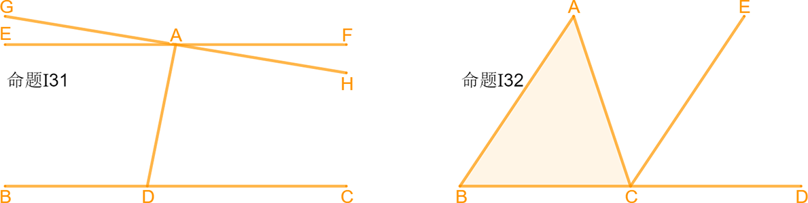
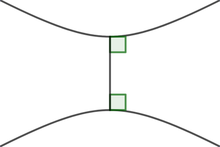

***在冲突的边境修墙，在不冲突的边境不修墙。***

``` NOTICE
我在避免创造第二个共产主义；
我也在避免成为第二个刘晓波。
别跟我谈爱国，你国并不爱你！
教育医疗养老，你还想要什么？
```

## 顺其自然即为美

[TOC]

### 谆谆教诲

``` NOTICE
一只在温水里泡澡的青蛙，
在它被烫熟前还会呱呱叫。
```

### 郑重声明

``` NOTICE
我反对法律，但我不是法律学家；
我参与政治，但我不是政治学家；
我关注经济，但我不是经济学家；
我研究历史，但我不是历史学家；
我整理知识，站在巨人的肩膀上；
我就是我，在我的地盘就听我的。
```

### 关于作者


`` @_@ 蓝色是生死恋
姓名：黄志贵
拼音：Huáng ZhìGuì
性别：男
民族：汉族
宗教：无信仰
理想：天文学家
身份：440882199308051156
公历：1993年09月05日（处女座）
农历：一九九三年七月十九日（属鸡）
籍贯：中华人民共和国广东省湛江市海康县（1994年04月改立雷州市）
本科：广东工业大学计算机学院计算机科学与技术专业2016届
肄业：中国科学院新疆天文台天体物理专业2019届
党派：原中国共产党党员
手机: +86-13611464445（广州移动）
电邮：brilliantstarrysky9395@gmail.com
住址：中国广东省湛江市经济技术开发区园乐苑北区一巷33号702房
``

### 公理化人类社会之框架

``` NOTICE
最好的政府，就是无政府；
最好的政治，就是无政治；
最好的经济，就是无经济；
最好的我们，就是不青春。
```

本公理化人类社会满足以下框架性特征：

1. 社会信用评价系统，完全无政府状态；
2. 社会公理取代法律，灵活性优于法律；
3. 社会契约取代经济，适用性广于经济；
4. 社会角色取代职业，专门性弱于职业；
5. 。。。

### 公理系统

``` NOTICE
在主观感觉极大似然的情形下，事实便被证明。
```

公理系统这个概念最初源自于数学证明，可人为划分成逻辑公理系统和非逻辑公理系统，一个典型的公理系统由５大部分构成：

| *01 概念与定义*         | `// 「概念」即对感性观念的概括反映，` `「定义」即确定意义的「概念」。` |
| :---------------------- | :----------------------------------------------------------- |
| *02 公设与公理*         | `// 「公设」即广泛被认可的先验假设，` `「公理」即理所当然的「公设」，` `「原理」即待反复验证的「公理」。` |
| *03 演绎逻辑或推理规则* | `// 公理系统必须遵循一系列推导法则，` `逻辑公理系统遵循「演绎逻辑」，` `非逻辑公理系统遵循「推理规则」。` |
| *04 命题与证明*         | `// 「命题」即未确定的先验判断，` `「证明」即「命题」被确定化的过程，` `「条件」是创设新环境的「命题」。` |
| *05 定理与推论*         | `// 「定理」即已确定的先验判断，` `「推论」即「定理」再进一步的推广，` `「引理」是引述自他处的「定理」。` |

递归定义与循环论证在数学证明中均十分常见。有效的循环论证即良性循环论证，能简化数学证明的思路过程；无效的循环论证即恶性循环论证，将导致难以察觉的潜在谬误。如果循环论证在推导形式上并无差错，那么其在逻辑上就是合理的。因此在数学证明中，应当竭力避免引入错误的前提条件。

``` NOTICE
// 鸡与鸡蛋问题
鸡生鸡蛋，鸡蛋孵出鸡。
是先有鸡还是先有鸡蛋？
```

公理系统特别是逻辑公理系统同样可能存在循环论证，但无论如何，一个合格的公理系统必须至少满足３大基本性质：

| *01 自洽性* | `// 「弱自洽性」要求公理系统中没有自相矛盾的公理，` `「强自洽性」要求任意公理不会推导出相悖的结论，` `此即意味着公理系统的有效性将完全取决于公理。` |
| :---------- | :----------------------------------------------------------- |
| *02 独立性* | `// 「弱独立性」要求公理系统中没有互相重叠的公理，` `「强独立性」要求任意公理不会被其余公理推导出，` `此即意味着公理系统中每一条公理都是最基本的。` |
| *03 完备性* | `// 「弱完备性」要求公理系统不能删减或拆分旧公理，` `「强完备性」要求公理系统不能增加或整合新公理，` `此即意味着公理系统自身不需要借助外部来运作。` |

任何一个足够严谨的公理系统都不该断然凭空臆造，实际上人们通常在总结大量已有经验知识的基础上，将至关重要但并非准确无疑的现象归纳整理成公理，再逐步补充缺失之处，最终加工成完整的公理系统。公理系统的弱自洽性与弱独立性是相当基本的要求，若采用步步为营的构建方法，弱完备性也不难满足。根据后验主义中正确概率极大便可当作真理这一观点，若公理系统始终从未出现而且极有可能不会出现矛盾，则可认为该公理系统满足强自洽性，除非悖论被发现。若公理系统不满足强独立性，则存在被其余公理推导出的公理。为检验公理系统的强独立性，一种有效方法是构造新公理系统，将强独立性可疑的公理取相悖形式代入，但保持其余公理不变。若新公理系统仍然满足强自洽性，则原可疑公理满足强独立性。在公理系统的强自洽性与强完备性均得到满足的基础上，可进一步考察公理系统的强完备性。然而公理系统的强完备性难以检验更难以满足，因此必要时可将强完备性人为当作公理之一，以确保在所有可考虑的结论都满足强自洽性和强独立性的情形下，人为忽略那些未知的情况。

现代数学各个分支与物理学等学科的终极目标，也许就是在寻找尽可能简洁且完备的公理系统，这些公理系统能准确无误推导出所有重要定理，同时还可清晰表明公理系统中各类公理的含义。

#### 命题逻辑公理系统

人类的语言习惯常常具有歧义性，人类的思维方式在绝大多数情形下具有善意性，这大概是作为高等智慧生物的人类区别于其它灵长类动物同伴的最不可思议之处。是生存还是毁灭，这是一个艰难的抉择，但没有人会愿意接受自身走向毁灭！！！

~~~~~~~~~~~~~~~~~~~~~~~~~~~~~~~~~~~~~~~~~~~~~~~~~~~~~~~~~~~~~~~~~~~~~~~~~~~~~~~~
// 一个典型的兼或语义
前项命题：台湾是国家。
后项命题：台湾是地区。
兼或命题：台湾是国家或者台湾是地区。
语义解析：或者『台湾是国家』为真，或者『台湾是地区』为真，两者可同时满足。

// 一个典型的异或语义
前项命题：中华民国简称中国。
后项命题：中华人民共和国简称中国。
异或命题：中华民国简称中国或者中华人民共和国简称中国。
语义解析：要么『中华民国简称中国』为真，要么『中华人民共和国简称中国』为真，两者只可选其一。

// 一个典型的善意谎言
前项命题：我还活着。
后项命题：咱俩结婚。
蕴涵命题：若我还活着，则咱俩结婚。
思维解析：『我还活着』为真，『咱俩结婚』为真，太好了！
思维解析：『我还活着』为真，『咱俩结婚』为假，去你的；
善意推断：『我还活着』为假，『咱俩结婚』为真，真的吗？
善意推断：『我还活着』为假，『咱俩结婚』为假，没关系。
~~~~~~~~~~~~~~~~~~~~~~~~~~~~~~~~~~~~~~~~~~~~~~~~~~~~~~~~~~~~~~~~~~~~~~~~~~~~~~~~

为有效区分并准确无误重现各种语义，在命题逻辑公理系统中，使用兼或联结词表达兼或语义，使用异或联结词表达在逻辑电路中更为常见的异或语义，使用蕴涵联结词表达蕴涵语义，并认为在前项命题为假时，其后项命题的真假性无关紧要，整个蕴涵语义中根据善意推断原则始终为真。

根据人们在日常生活中的逻辑思维方式，可得到8种命题逻辑联结词的运算表：

|                   |        |  `[基本]`   |   `[基本]`    |   `[基本]`   |      `[常用]`      |           `[常用]`            |       `[电路]`        |       `[电路]`       |            `[电路]`             |
| :---------------: | :----: | :---------: | :-----------: | :----------: | :----------------: | :---------------------------: | :-------------------: | :------------------: | :-----------------------------: |
|                   |        |  **否定**   |   **合取**    |   **析取**   |      **蕴涵**      |           **等价**            |       **与非**        |       **或非**       |            **异或**             |
|      `条件`       | `条件` |    $非P$    |   $P并且Q$    |   $P兼或Q$   |      $若P则Q$      |           $P仅当Q$            |      $P与Q的非$       |      $P或Q的非$      |           $P不兼或Q$            |
|        $P$        |  $Q$   | *$\lnot P$* | *$P \land Q$* | *$P \lor Q$* |    *$P \to Q$*     |    *$P \leftrightarrow Q$*    |   *$P \uparrow Q$*    |  *$P \downarrow Q$*  |         *$P \oplus Q$*          |
|        真         |   真   |     假      |      真       |      真      |         真         |              真               |          假           |          假          |               假                |
|        真         |   假   |     假      |      假       |      真      |         假         |              假               |          真           |          假          |               真                |
|        假         |   真   |     真      |      假       |      真      |         真         |              假               |          真           |          假          |               真                |
|        假         |   假   |     真      |      假       |      假      |         真         |              真               |          真           |          真          |               假                |
| *$\lnot \lnot P$* |        |             | *$Q \land P$* | *$Q \lor P$* | *$\lnot P \lor Q$* | *$(P \to Q) \land (Q \to P)$* | *$\lnot (P \land Q)$* | *$\lnot (P \lor Q)$* | *$\lnot (P \leftrightarrow Q)$* |

根据语义分析不难得到这8种命题逻辑联结词的等值替代形式。在这里需要特别指出的是，蕴涵语义并非必须遵循善意推断原则，实际上即便蕴涵联结词遵循恶意推断原则，对于整个命题逻辑体系而言仍然合理，但这并不符合生而为人的本性。

相对应8种命题逻辑联结词的运算表，可归纳整理成8条命题逻辑公理：

| **01 [基本]否定公理** | // $否定命题\lnot P为假当且仅当命题P为真。$                  |
| :-------------------- | :----------------------------------------------------------- |
| **02 [基本]合取公理** | // $合取命题P \land Q为真，当且仅当命题P为真并且命题Q为真。$ |
| **03 [基本]析取公理** | // $析取命题P \lor Q为真，当且仅当命题P为真兼或命题Q为真。$  |
| *04 [常用]蕴涵公理*   | // $蕴涵命题P \to Q为假，当且仅当命题P为真同时命题Q为假。$   |
| *05 [常用]等价公理*   | // $等价命题P \leftrightarrow Q为真，当且仅当命题P和命题Q真假性相同。$ |
| 06 [重要]与非公理     | // $与非命题P \uparrow Q为假，当且仅当命题P为真并且命题Q为真。$ |
| 07 [重要]或非公理     | // $或非命题P \downarrow Q为假，当且仅当命题P为真兼或命题Q为真。$ |
| 08 [重要]异或公理     | // $异或命题P \oplus Q为真，当且仅当命题P和命题Q真假性相反。$ |

借助于命题逻辑联结词的运算表，可进一步验证29个可等值替代的双向命题演绎逻辑：

$$
\begin{array}{crcl}
\hline
\fbox{01} & 0 &\iff& P \land 0 \\
\fbox{02} & 1 &\iff& P \lor 1 \\
\fbox{03} & 0 &\iff& P \land \lnot P \\
\fbox{04} & 1 &\iff& P \lor \lnot P \\
\hline
\fbox{05} & P &\iff& \lnot \lnot P \\
\fbox{06} & P &\iff& P \land 1 \\
\fbox{07} & P &\iff& P \lor 0 \\
\fbox{08} & P &\iff& P \land P \\
\fbox{09} & P &\iff& P \lor P \\
\fbox{10} & P &\iff& P \land (P \lor Q) \\
\fbox{11} & P &\iff& P \lor (P \land Q) \\
\hline
\fbox{12} & P \land Q         &\iff& Q \land P \\
\fbox{13} & P \lor Q          &\iff& Q \lor P \\
\fbox{14} & \lnot (P \land Q) &\iff& \lnot P \lor \lnot Q \\
\fbox{15} & \lnot (P \lor Q)  &\iff& \lnot P \land \lnot Q \\
\hline
\end{array}
$$
$$
\begin{array}{crcl|l}
\hline
\fbox{16} & P \to Q             &\iff& \lnot P \lor Q \\
\fbox{17} & P \to Q             &\iff& \lnot Q \to \lnot P             & 逆否法 \\
\fbox{18} & P \leftrightarrow Q &\iff& Q \leftrightarrow P \\
\fbox{19} & P \leftrightarrow Q &\iff& \lnot Q \leftrightarrow \lnot P \\
\fbox{20} & P \leftrightarrow Q &\iff& (P \to Q) \land (Q \to P) \\
\hline
\fbox{21} & P \uparrow Q   &\iff& \lnot (P \land Q) \\
\fbox{22} & P \downarrow Q &\iff& \lnot (P \lor Q) \\
\fbox{23} & P \oplus Q     &\iff& \lnot (P \leftrightarrow Q) \\
\hline
\fbox{24} & (P \land Q) \land R &\iff& P \land (Q \land R) \\
\fbox{25} & (P \lor Q) \lor R   &\iff& P \lor (Q \lor R) \\
\fbox{26} & (P \land Q) \lor R  &\iff& (P \land Q) \lor (P \land R) \\
\fbox{27} & (P \lor Q) \land R  &\iff& (P \lor Q) \land (P \lor R) \\
\hline
\fbox{28} & (P \to Q) \land (P \to \lnot Q)       &\iff& \lnot P                                       & 归谬法 \\
\fbox{29} & P1 \land P2 \land \dots \to Q         &\iff& \lnot (P1 \land P2 \land \dots \land \lnot Q) & 反证法 \\
\fbox{30} & P1 \land P2 \land \dots \to (Q \to R) &\iff& P1 \land P2 \land \dots \land Q \to R         & 附加法 \\
\hline
\end{array}
$$

现在我们来考察命题逻辑公理系统的独立性与完备性，注意到：

$$
\begin{array}{crcl|l}
\hline
\fbox{14} & P \land Q &\iff& \lnot(\lnot P \lor \lnot Q)   & \lbrace \lnot, \lor \rbrace \text{ 可等值替代 } \lbrace \land \rbrace \\
\fbox{15} & P \lor Q  &\iff& \lnot (\lnot P \land \lnot Q) & \lbrace \lnot, \land \rbrace \text{ 可等值替代 } \lbrace \lor \rbrace \\
\hline
\fbox{16} & P \to Q             &\iff& \lnot P \lor Q            & \lbrace \lnot, \lor \rbrace \text{ 可等值替代 } \lbrace \to \rbrace \\
\fbox{20} & P \leftrightarrow Q &\iff& (P \to Q) \land (Q \to P) & \lbrace \to, \land \rbrace \text{ 可等值替代 } \lbrace \leftrightarrow \rbrace \\
\hline
\fbox{21} & P \uparrow P   &\iff& \lnot P                     & \lbrace \lnot \rbrace \text{ 可互相等值替代 } \lbrace \uparrow \rbrace \\
\fbox{22} & P \downarrow P &\iff& \lnot P                     & \lbrace \lnot \rbrace \text{ 可互相等值替代 } \lbrace \downarrow \rbrace \\
\fbox{23} & P \oplus Q     &\iff& \lnot (P \leftrightarrow Q) & \lbrace \lnot, \leftrightarrow \rbrace \text{ 可等值替代 } \lbrace \oplus \rbrace \\
\hline
\fbox{21} & \lnot (P \uparrow Q)   &\iff& P \land Q & \lbrace \lnot, \uparrow \rbrace \text{ 可等值替代 } \lbrace \land \rbrace \\
\fbox{22} & \lnot (P \downarrow Q) &\iff& P \lor Q  & \lbrace \lnot, \downarrow \rbrace \text{ 可等值替代 } \lbrace \lor \rbrace \\
\hline
\end{array}
$$

对于人们日常生活的逻辑思维来说，若将 {¬, ∧, ∨} 作为基本命题逻辑联结词，则可等值替代 {→, ↔} 这两种常用命题逻辑联结词，因此 {¬, ∧, ∨} / {¬, ∧, ∨, →} / {¬, ∧, ∨, →, ↔} 都可完全表达所有命题逻辑，但都不满足公理系统的强独立性。因为 {¬, ∧} 不可自我等值替代但可等值替代 {∨}，而且 {¬, ∨} 不可自我等值替代但可等值替代 {∧}，所以 {¬, ∧} / {¬, ∨} 均满足公理系统的强独立性和强完备性，{否定公理, 合取公理} / {否定公理, 析取公理} 均可构成命题逻辑公理系统。按照类似的论证方法，{↑} / {↓} 均满足公理系统的强独立性和强完备性，{与非公理} / {或非公理} 均可构成命题逻辑公理系统。同理 {∧, ∨} 满足公理系统的强独立性，但不满足公理系统的强完备性，{合取公理，析取公理} 不可构成命题逻辑公理系统。

在命题逻辑体系中，类似于蕴涵联结词，具有以下形式的单向演绎逻辑：

~~~~~~~~~~~~~~~~~~~~~~~~~~~~~~~~~~~~~~~~~~~~~~~~~~~~~~~~~~~~~~~~~~~~~~~~~~~~~~~~
前提条件：$P1, P2, \dots$
有效推论：$Q$
演绎逻辑：$P1 \land P2 \land \dots \implies Q$
单向演绎逻辑$P1 \land P2 \land \dots \implies Q$正确，当且仅当$P1 \land P2 \land \cdots \implies Q$为真
~~~~~~~~~~~~~~~~~~~~~~~~~~~~~~~~~~~~~~~~~~~~~~~~~~~~~~~~~~~~~~~~~~~~~~~~~~~~~~~~

借助于可等值替代的双向命题演绎逻辑，可进一步验证10个非等值替代的单向命题演绎逻辑：

$$
\begin{array}{crcl|l}
\hline
\fbox{01} & P                                                      &\implies& P \lor Q \\
\fbox{02} & P \land Q                                              &\implies& P \\
\fbox{03} & \lnot P \land (P \lor Q)                               &\implies& Q \\
\fbox{04} & P \land (P \to Q)                                      &\implies& Q \\
\fbox{05} & \lnot Q \land (P \to Q)                                &\implies& \lnot P \\
\fbox{06} & (P \to Q) \land (Q \to R)                              &\implies& P \to R              & 演绎推断 \\
\fbox{07} & (P \leftrightarrow Q) \land (Q \leftrightarrow R)      &\implies& P \leftrightarrow R  & 等值推断 \\
\fbox{08} & (P \lor R) \land (P \to Q) \land (R \to S)             &\implies& Q \lor S \\
\fbox{09} & (\lnot P \to Q) \land (P \to Q)                        &\implies& Q \\
\fbox{10} & (\lnot Q \lor \lnot S) \land (P \to Q) \land (R \to S) &\implies& \lnot P \lor \lnot R & 非难推断 \\
\hline
\end{array}
$$

命题逻辑具有局限性并不能包罗万象，因而还有比命题逻辑更复杂的谓词逻辑，命题逻辑仅仅是谓词逻辑的特殊形式。但即便如此，在日常生活中命题逻辑仍然适用于众多情形。

~~~~~~~~~~~~~~~~~~~~~~~~~~~~~~~~~~~~~~~~~~~~~~~~~~~~~~~~~~~~~~~~~~~~~~~~~~~~~~~~
// 一个典型的演绎推断
$\fbox{06}\; (P \to Q) \land (Q \to R) \implies P \to R$
命题$P$：我还活着；
命题$Q$：咱俩结婚；
命题$R$：宝宝出生。
大前提：若我还活着，则咱俩结婚；
小前提：若咱俩结婚，则宝宝出生；
=>推论：若我还活着，则宝宝出生。

// 一个典型的非难推断
$\fbox{10}\; (\lnot Q \lor \lnot R) \land (P \to Q) \land (P \to R) \implies \lnot P$
命题$P$：口头承诺有效；
命题$Q$：政治体制改革；
命题$R$：经济体制改革；
前提一：政治体制未改革或经济体制未改革；
前提二：若口头承诺有效，则政治体制改革；
前提三：若口头承诺有效，则经济体制改革；
=>推论：口头承诺无效。
~~~~~~~~~~~~~~~~~~~~~~~~~~~~~~~~~~~~~~~~~~~~~~~~~~~~~~~~~~~~~~~~~~~~~~~~~~~~~~~~

#### 欧几里德公理系统

被誉为几何学之父的古希腊数学家欧几里得（古希腊语：Εὐκλείδης，约公元前330年~公元前275年）生平不详，著有人类文明史上最负盛名的数学教科书《几何原本》十三卷，这是世界上最早的公理化数学著作，同时也是西方现存最古老的科学著作，据称在全球范围内流传甚广仅次于基督教经典《圣经》。

《几何原本》集古希腊数学三大成就为一体，即欧多克索斯（古希腊语：Εὔδοξος，约公元前408年~公元前355年）的比例论以及西泰阿泰德（古希腊语：Θεαίτητος，约公元前417年~公元前369年）的无理数与正多面体。在这本书中欧几里得通过归纳整理前人的知识成果，从少量一般公理与平面公设出发，并且结合百余条概念定义，运用严格的推理规则来证明数百个命题，将整个几何体系层层递进推演而出，从而建立起首个数学公理系统，被称为欧几里得公理系统。

~~~~~~~~~~~~~~~~~~~~~~~~~~~~~~~~~~~~~~~~~~~~~~~~~~~~~~~~~~~~~~~~~~~~~~~~~~~~~~~~
基本定义摘录：
01 点除自身外再无其它部分。
02 线具有长度无宽度无高度。
03 面具有长度与宽度无高度。
04 体具有长度与宽度及高度。
05 角是两条相交线的倾斜度。

一般公理共5条：
01 与同量相等的量彼此相等。
02 等量加等量，其和仍相等。
03 等量减等量，其差仍相等。
04 与同量重合的量彼此全等。
05 量的整体大于该量的部分。

平面公设共5条：
01 过任意两点可作一条直线。
02 线段可无限延伸成为直线。
03 固定线段一端可作一个圆。
04 所有直角都必定彼此相等。
05 [平行公设] 两条直线与同一直线相交，若同侧内角之和小于平角，则这两条直线在该侧相交。
~~~~~~~~~~~~~~~~~~~~~~~~~~~~~~~~~~~~~~~~~~~~~~~~~~~~~~~~~~~~~~~~~~~~~~~~~~~~~~~~

《几何原本》中所选取的一般公理都十分基本，所选取的平面公设除第5条公设外都十分直观。所有命题的证明要么直接引用一般公理与平面公设，要么引用已被证明的命题，即间接引用一般公理与平面公设。然而应当指出的是，《几何原本》所采用的公理化方法，虽然构成完整的几何证明体系，但却并非严格满足公理系统的基本性质。例如第4条平面公设，实际上可以由其余一般公理与平面公设，以及概念定义经过推理得到。全书没有给出任何定理，不过这些已被证明的命题实际上等同于定理。例如命题Ⅰ47就是举世闻名的勾股定理，在西方称毕达哥拉斯（希腊语：Πυθαγόρας，公元前570年~公元前495年）定理，最早由毕达哥拉斯学派证明，这个学派还因此发现无理数（即不可通约量）的存在。

~~~~~~~~~~~~~~~~~~~~~~~~~~~~~~~~~~~~~~~~~~~~~~~~~~~~~~~~~~~~~~~~~~~~~~~~~~~~~~~~
重要命题摘录：
命题Ⅰ13：两条相交直线所成邻角，或者均为直角，或者其和等于平角。
命题Ⅰ27：两条直线与同一直线相交，若内错角彼此相等，则这两条直线互相平行。
命题Ⅰ29：两条平行直线与同一直线相交，内错角相等，同位角相等，同旁内角之和等于平角。
命题Ⅰ30：与同一直线平行的直线互相平行。
命题Ⅰ47：[勾股定理] 在直角三角形中，斜边上正方形的面积等于两直角边上正方形的面积之和。
~~~~~~~~~~~~~~~~~~~~~~~~~~~~~~~~~~~~~~~~~~~~~~~~~~~~~~~~~~~~~~~~~~~~~~~~~~~~~~~~

欧几里得公理系统所构造出来的几何空间，被称为欧几里得几何空间，这就是人们依据日常经验所感觉存在的平直几何空间，即用以表征空间弯曲程度的空间曲率处处恒为零。欧几里得公理系统中的第5公设，通常被称为平行公设，直线之间的相互关系完全由平行公设规定。从平行公设出发，可以确定欧几里得几何空间中两条极其重要的空间性质，即过直线外一点有且仅有一条平行直线，同时三角形的三个内角之和等于180°。



~~~~~~~~~~~~~~~~~~~~~~~~~~~~~~~~~~~~~~~~~~~~~~~~~~~~~~~~~~~~~~~~~~~~~~~~~~~~~~~~
命题Ⅰ31：过直线外一点有且仅有一条平行直线。
已知条件：给定直线BC，给定点A。
简约证明⬇
在直线BC上任意取一点D，连接线段AD，作角∠EAD=角∠ADC，延长线段EA成为直线EF。
∵ 内错角∠EAD=内错角∠ADC；
∴ 直线EF∥直线BC。【命题Ⅰ27】
假设过直线BC外点A，可作不同于直线EF的平行直线GH，角∠DAH<角∠DAF。
∵ 直线EF∥直线BC；
∴ 同旁内角∠ADC+同旁内角∠DAF=180°。【命题Ⅰ29】
∵ 角∠DAH<角∠DAF；【根据假设】
∴ 同旁内角∠ADC+同旁内角∠DAH<180°。
∴ 直线GH与直线BC相交，这与直线GH∥直线BC的假设互相矛盾。【平面公设05】

命题Ⅰ32：三角形的任意外角等于两内对角之和，三角形的三个内角之和等于180°。
已知条件：任意三角形△ABC，延长边BC至点D。
简约证明⬇
过直线AB外点C作平行直线CE。【命题Ⅰ31】
∵ 直线AB∥直线CE；
∴ 内错角∠BAC=内错角∠ACE，同位角∠ABC=同位角∠ECD。【命题Ⅰ29】
∵ 外角∠ACD=角∠ACE+角∠ECD；
∴ 外角∠ACD=内对角∠BAC+内对角∠ABC。【一般公理02】
∵ 角∠BCA+角∠ACD=180°；【命题Ⅰ13】
∴ 内角∠BCA+内角∠BAC+内角∠ABC=180°。
~~~~~~~~~~~~~~~~~~~~~~~~~~~~~~~~~~~~~~~~~~~~~~~~~~~~~~~~~~~~~~~~~~~~~~~~~~~~~~~~

《几何原本》在末卷里着重给出5种正多面体的构造性证明，与圆球体类似，这5种正多面体以其高度完美的空间对称性，成为西方众多哲学流派的思想源泉。

| **正多面体** |                        **三维立体图**                        |                        **三维结构图**                        | **对偶正多面体** | **构成面** | **顶点角之和** | **面数** | **边数** | **点数** | **平面展开图**                                               |
| :----------: | :----------------------------------------------------------: | :----------------------------------------------------------: | :--------------: | :--------: | :------------: | :------: | :------: | :------: | ------------------------------------------------------------ |
|  *正四面体*  |  |  |    `正四面体`    | `正三边形` |     60°×3      |    4     |    6     |    4     |  |
|  *正六面体*  |  |  |    `正八面体`    | `正四边形` |     90°×3      |    6     |    12    |    8     |  |
|  *正八面体*  |  |  |    `正六面体`    | `正三边形` |     60°×4      |    8     |    12    |    6     |  |
| *正十二面体* |  |  |   `正二十面体`   | `正五边形` |     108°×3     |    12    |    30    |    20    |  |
| *正二十面体* |  |  |   `正十二面体`   | `正三边形` |     60°×5      |    20    |    30    |    12    |  |

除此之外，《几何原本》在结尾处还给出至多有5种正多面体的证明，因此在欧几里得空间中，有且仅有5种正多面体。这个结论同时意味着，必定有某种客观存在的精致秩序在支配着这个世界的运作。


~~~~~~~~~~~~~~~~~~~~~~~~~~~~~~~~~~~~~~~~~~~~~~~~~~~~~~~~~~~~~~~~~~~~~~~~~~~~~~~~
命题：有且仅有5种正多面体。
证明⬇
∵ 任何多面体每个顶点关联面数至少为3，每个顶点关联的平面角之和必须小于360°，正多面体的每个平面角均相等；
∴ 正多面体的每个平面角均小于360°÷3=120°。
∵ 正六边形每个内角均为120°，更多边正多边形每个内角均大于120°；
∴ 不存在以正六边形或者更多边正多边形为构成面的正多面体。
∵ 正三边形每个内角均为60°；
∴ 以正三边形为构成面的正多面体，每个顶点关联面数小于360°÷60°=6，即每个顶点关联面数仅可能为3/4/5，这相对应于的正四面体/正八面体/正二十面体。
∵ 正四边形每个内角均为90°；
∴ 以正四边形为构成面的正多面体，每个顶点关联面数小于360°÷90°=4，即每个顶点关联面数仅可能为3，这相对应于正六面体。
∵ 正五边形每个内角均为108°；
∴ 以正五边形为构成面的正多面体，每个顶点关联面数小于360°÷108°<4，即每个顶点关联面数仅可能为3，这相对应于正十二面体。
综上所述，有且仅有5种正多面体，即正四面体/正六面体/正八面体/正十二面体/正二十面体。
~~~~~~~~~~~~~~~~~~~~~~~~~~~~~~~~~~~~~~~~~~~~~~~~~~~~~~~~~~~~~~~~~~~~~~~~~~~~~~~~

值得注意的是，欧几里得公理系统的平行公设，无论在形式上还是在内容上，均有别于其余一般公理与平面公设，反而更像是一个命题。自《几何原本》流传于世，便有众多数学家反复研究平行公设，试图从其余一般公理与平面公设出发，找到证明平行公设的方法，但都终归于失败。直到1823年，杰出的俄国数学家罗巴切夫斯基（俄语：Никола́й Ива́нович Лобаче́вский，1792年~1856年）意识到，在欧几里得公理系统中试图证明平行公设，也许并没有什么意义。于是他独辟蹊径将平行公设的否定形式引入公理系统，但却没有发现任何匪夷所思的矛盾，从而可知平行公设的确是一条独立公设，既不能被证明也不能被否定。罗巴切夫斯基几何由此宣告诞生，意外带给世界一个颠覆性的全新空间观念，当然罗巴切夫斯基的工作在其生前并未得到同行的理解。罗巴切夫斯基几何建立在双曲面上（又称双曲几何），狭义的非欧几里得几何除罗巴切夫斯基几何外，还包括由著名的德国数学家黎曼（德语：Georg Friedrich Bernhard Riemann，1826年~1866年），建立在椭球面上黎曼几何（又称椭圆几何），正是利用黎曼几何与张量分析作为数学工具，1915年爱因斯坦（德语：Albert Einstein，1879年~1955年）得以将狭义相对论推广成为广义相对论，并再一次打破自被誉为现代科学之父的意大利科学家伽利略（意大利语：Galileo Galilei，1564年~1642年）时代以来的绝对时空观念，宇宙中的时空竟然是弯曲的引力场！所有非欧几里得几何均不满足欧几里得几何的平行公设，而且非欧几里得几何空间中的直线在欧几里得几何空间中呈现为曲线。

|  |    |  |
| :----------------------------------------------------------: | :----------------------------------------------------------: | :----------------------------------------------------------: |
|  |  |  |
|                         **椭圆几何**                         |                         **平直几何**                         |                         **双曲几何**                         |
|                         *[黎曼几何]*                         |                       *[欧几里得几何]*                       |                     *[罗巴切夫斯基几何]*                     |
|                      `曲率处处为正常数`                      |                       `曲率处处恒为零`                       |                      `曲率处处为负常数`                      |
|                  `三角形的内角之和小于180°`                  |                  `三角形的内角之和等于180°`                  |                  `三角形的内角之和大于180°`                  |
|                  `过直线外一点没有平行直线`                  |                `过直线外一点仅有一条平行直线`                |               过直线外一点至少存在两条平行直线               |

两千余年来，几乎西方所有的初等几何教科书，以及19世纪以前一切有关初等几何的论著，都以《几何原本》作为依据，现代初等几何教科书的内容都没有超出欧几里得几何的范围。不过以现代数学公理系统的视角来看，欧几里得公理系统并非完美无瑕，欧几里得给出许多直观的基本定义，要想从这些基本定义严谨地推导出任何推论，那几乎是不可能的。大多数命题的证明都或直接或间接借助于直觉，但却无法判断这种直觉在多大程度上是合理的，而人们常常自以为借助于直觉的推理相当可靠。许多数学家曾尝试在欧几里得公理系统的框架内将其修正和完善，但都没有取得实质性进展。直到1899年，伟大的德国数学家希尔伯特在其著作《几何基础》中才标志着这些无谓的尝试归于结束，希尔伯特选择放弃欧几里得公理系统中数量众多的基本定义，仅从少数必要定义和五组基本公理出发，成功建立起一个逻辑结构十分严谨的平直几何空间体系，被称为希尔伯特公理系统。《几何基础》所采用的公理化方法，将点/线/面/体/角等几何对象当作不加定义的纯粹抽象物，然后添加关联关系/顺序关系/合同关系这三组基本关系，最后再添加平行性质/连续性质这两组重要性质，从而构成完备的数学公理系统。此处给出希尔伯特公理系统，以方便一探究竟。

~~~~~~~~~~~~~~~~~~~~~~~~~~~~~~~~~~~~~~~~~~~~~~~~~~~~~~~~~~~~~~~~~~~~~~~~~~~~~~~~
基本定义摘录：
01 点是直线几何的元素，用A/B/C···表示。
02 直线是平面几何的元素，用a/b/c···表示。
03 平面是空间几何的元素，用α/β/γ···表示。
04 角∠(h,k)由同一点O起始的射线h与射线k构成，点O是这个角的顶点，射线h与射线k是这个角的边。

Ⅰ 关联公理共8条：
Ⅰ1 对于任意两点，恒有一直线与这两点相关联。
Ⅰ2 对于任意两点，至多有一直线与这两点相关联。
Ⅰ3 至少有两点在同一直线上，至少有三点不在同一直线上。
Ⅰ4 对于不在同一直线上的任意三点，恒有一个平面与这三点相关联。对于任意平面，恒有一点与这平面相关联。
Ⅰ5 对于不在同一直线上的任意三点，至多有一个平面与这三点相关联。
Ⅰ6 若直线有两点在同一平面上，则直线的每一点都在这平面上。
Ⅰ7 若两平面有一公共点，则这两平面至少还有另一公共点。
Ⅰ8 至少有四点不在同一平面上。

Ⅱ 顺序公理共4条：
Ⅱ1 在直线AC上，若点B在点A与点C之间，则点B在点C与点A之间。
Ⅱ2 在直线AC上，至少有一点B，使得点C在点A与点B之间。
Ⅱ3 对于同一直线上的任意三点，至多有一点在其余两点之间。
Ⅱ4 在平面ABC上，若直线a与线段AB相交，则直线a要么与线段AC相交，要么与线段BC相交。

Ⅲ 全等公理共5条：
Ⅲ1 已知线段AB与点A'，则在点A'的任意一侧，恒有一点B'使得线段AB与线段A'B'全等，记为线段AB≡线段A'B'。
Ⅲ2 若线段A'B'≡线段AB，且线段A"B"≡线段AB，则线段A'B'≡线段A"B"。
Ⅲ3 已知在同一直线上点B在点A与点C之间，且在另一直线上点B'在点A'与点C'之间。若线段AB≡线段A'B'，且线段BC≡线段B'C'，则线段AC≡线段A'C'。
Ⅲ4 已知角∠(h,k)与射线h'，则在射线h'的任意一侧，恒有一条射线k'使得角∠(h',k')与角∠(h,k)全等，记为角∠(h,k)≡角∠(h',k')。
Ⅲ5 对于三角形△ABC与三角形△A'B'C'，若边AB≡边A'B'，且边AC≡边A'C'，且角∠BAC≡角∠B'A'C'，则角∠ABC≡角∠A'B'C'，且角∠ACB≡角∠A'C'B'。

Ⅳ 平行公理共1条：
Ⅳ1 [欧几里得公理] 已知直线a与直线a外点A，在直线a与点A所确定的平面上，至多有一直线通过点A但不与直线a相交。

Ⅴ 连续公理共2条：
Ⅴ1 [阿基米德公理] 已知线段AB与线段CD，存在数n使得在沿A到B的射线上，自A作首尾相接的n个线段CD，将越过B点。
Ⅴ2 [直线完备公理] 直线上的点集连同其顺序关系与全等关系，不可能再进一步扩充，但仍然满足公理Ⅰ~Ⅲ与公理Ⅴ1。

重要定理摘录：
01 同一平面上非重合的两直线，要么有一公共点，要么没有公共点。
02 一平面与不在其上的一直线，要么有一公共点，要么没有公共点。
03 不是互相重合的两平面，要么有一公共直线，要么没有公共直线。
04 过直线与该直线外一点，或者过两相交直线，有且仅有一个平面。
05 同一直线上任意两点之间有无穷多个点。
06 所有直角都彼此全等。
~~~~~~~~~~~~~~~~~~~~~~~~~~~~~~~~~~~~~~~~~~~~~~~~~~~~~~~~~~~~~~~~~~~~~~~~~~~~~~~~

希尔伯特公理系统显然并不直观，此处给出些许注记以方便理解：

~~~~~~~~~~~~~~~~~~~~~~~~~~~~~~~~~~~~~~~~~~~~~~~~~~~~~~~~~~~~~~~~~~~~~~~~~~~~~~~~
对希尔伯特公理系统的些许注记：
非互相重合的两点确定一条直线。
非同一直线的三点确定一个平面。
非同一平面的四点确定一个球面。
同一直线上的点必按照线性排序。
重合即全等，按比例缩放即相似。
直线有相交/平行/异面三种关系。
直线上点的坐标与实数一一对应。
~~~~~~~~~~~~~~~~~~~~~~~~~~~~~~~~~~~~~~~~~~~~~~~~~~~~~~~~~~~~~~~~~~~~~~~~~~~~~~~~

#### 实数公理系统

历史上，毕达哥拉斯学派宣称数是世间万物之本原，他们不仅认为万物皆为数，而且企图用数来解释一切。在他们看来，数是构成物体的基本，作为一切数之始基的1是第一基本，由1派生出其余物体。点是1/线是2/面是3/体是4，点动成线/线动成面/面动成体，体构成水/火/土/气四种元素。毕达哥拉斯学派对数的痴迷近于狂热，他们相信任何关系都可以用有理数（即可通约量）来表示。然而毕达哥拉斯学派的希帕索斯（古希腊语：Ίππασος）却意外发现，边长为1的正方形其对角线长度是无理数（不可通约量），这对他们的信条来说无疑是一个致命的打击，据说希帕索斯因此被淹死，数学史上第一次危机由此产生。

~~~~~~~~~~~~~~~~~~~~~~~~~~~~~~~~~~~~~~~~~~~~~~~~~~~~~~~~~~~~~~~~~~~~~~~~~~~~~~~~
$命题：有理数是稠密的。$
$证明⬇$
$对于任意有理数\dfrac{p_1}{q_1}与有理数\dfrac{p_2}{q_2}，若\dfrac{p_1}{q_1} < \dfrac{p_2}{q_2}，则\dfrac{p_1}{q_1} < \dfrac{1}{2} \left(\dfrac{p_1}{q_1} + \dfrac{p_2}{q_2} \right) < \dfrac{p_2}{q_2}，且\dfrac{1}{2} \left(\dfrac{p_1}{q_1} + \dfrac{p_2}{q_2} \right)是有理数。$
$即任意两个不同的有理数之间至少存在一个有理数，因此任意两个不同的有理数之间存在无穷多个有理数。$

$命题：\sqrt{2}为无理数。$
$证明⬇$
$假设\sqrt{2}为有理数。$
$∵ \sqrt{2} = \dfrac{p}{q}，\dfrac{p}{q}为最简分数；$
$∴ 2 q^2 = p^2，p^2为偶数。$
$∴ p为偶数。【平方运算保持奇偶性】$
$再假设p = 2 r。$
$∵ p^2 = 4 r^2；$
$∴ q^2 = 2 r^2，q^2为偶数。$
$∴ q为偶数。【平方运算保持奇偶性】$
$这与\dfrac{p}{q}为最简分数的假设互相矛盾。$

$推论：有理数是稠密的，但非连续的。$
$例子：有理数1 < 无理数\sqrt{2} < 有理数2。直线上点的坐标并非与有理数一一对应，即存在不是有理数的孔隙。$
~~~~~~~~~~~~~~~~~~~~~~~~~~~~~~~~~~~~~~~~~~~~~~~~~~~~~~~~~~~~~~~~~~~~~~~~~~~~~~~~

与整数不同，有理数是稠密的，存在间隔无穷小的两个有理数。但有理数并不能填满直线上的点，存在不是有理数的孔隙。当引入无理数将有理数扩充成实数以后，实数就可以填满直线上的点。回顾数系的形成史，其实就是为满足各种代数运算的封闭性即完备性，而对已失效的原有数系进行扩充的发展史。

| **运算**             | **$性质：正整数\mathbb{Z}^+ \subset自然数\mathbb{N} \subset 整数\mathbb{Z} \subset 有理数\mathbb{Q} \subset 实数\mathbb{R} \subset 复数\mathbb{C}$** | **例子**                  | **满足**                                           |
| :------------------- | :----------------------------------------------------------- | :------------------------ | :------------------------------------------------- |
| *加法*               | `对正整数运算封闭。`                                         | $1 + 1 = 2$               | $\mathbb{Z}^+ + \mathbb{Z}^+ \mapsto \mathbb{Z}^+$ |
| *减法*               | `对正整数运算不封闭，引入零，扩充成自然数，再引入负整数，扩充成整数。` | $2 - 5 = -3$              | $\mathbb{Z} - \mathbb{Z} \mapsto \mathbb{Z}$       |
| *乘法*               | `对整数运算封闭。`                                           | $2 × (-3) = -6$           | $\mathbb{Z} × \mathbb{Z} \mapsto \mathbb{Z}$       |
| *除法（除数不为零）* | `对整数运算不封闭，引入分数，扩充成有理数。`                 | $2 ÷ 3 = \dfrac{2}{3}$    | $\mathbb{Q} ÷ \mathbb{Q} \mapsto \mathbb{Q}$       |
| *开方*               | `对正有理数运算不封闭，引入无理数，扩充成实数。`             | $\sqrt{2} ≠ \dfrac{p}{q}$ | $\mathbb{R}^n \mapsto \mathbb{R}$                  |
| *开方*               | `对负实数运算不封闭，引入虚数，扩充成复数。`                 | $\sqrt{-1} = \imath$      | $\mathbb{C}^n \mapsto \mathbb{C}$                  |

为满足负实数开方运算的封闭性，在引入虚数$\imath$以后，将导致二维复平面上复数的出现，这相对于一维直线上的实数来说，除维度被扩张外，还有复数运算的复杂化。实数是满足加减乘除四则运算以及正数开方运算之封闭性的最小数系，足以应付人们在日常生活中遇到的种各种代数方程，因此相对于其它数系，人们对实数公理系统更感兴趣。

$$
实数公理系统 \\
\begin{array}{lll} \hline
Ⅰ 加运算公理共４条 &
\begin{array}{ll|l}
Ⅰ1_+ & x + 0 = x                 & 存在加法零元0 \\
Ⅰ2_+ & x + (-x) = 0              & 存在加法负元-x \\
Ⅰ3_+ & x + (y + z) = (x + y) + z & 满足加法结合律 \\
Ⅰ4_+ & x + y = y + z             & 满足加法交换律 \\
\end{array} \\ \hline
Ⅱ 乘运算公理共５条 &
\begin{array}{ll|l}
Ⅱ1_×     & x × 1 = x                   & 存在乘法幺元1 \\
Ⅱ2_×     & x × x^{-1} = 1              & 存在乘法逆元x^{-1}对于x ≠ 0 \\
Ⅱ3_×     & x × (y × z) = (x × y) × z   & 满足乘法结合律 \\
Ⅱ4_×     & x × y = y × x               & 满足乘法交换律 \\
Ⅱ5_{× +} & x × (y + z) = x × y + x × z & 满足乘法分配律 \\
\end{array} \\ \hline
Ⅲ 线性序公理共６条 &
\begin{array}{llclcl|l}
Ⅲ1_≤     & x ≤ x &      &       &        &               & 满足自反性 \\
Ⅲ2_≤     & x ≤ y &\land & y ≤ x &\implies& x = y         & 满足反对称 \\
Ⅲ3_≤     & x ≤ y &\land & y ≤ z &\implies& x ≤ z         & 满足传递性 \\
Ⅲ4_≤     & x ≤ y &\oplus& y ≤ x &        &               & 满足线性序 \\
Ⅲ5_{≤ +} &       &      & x ≤ y &\implies& x + z ≤ y + z & 满足可加性 \\
Ⅲ6_{≤ ×} & 0 ≤ x &\land & 0 ≤ y &\implies& 0 ≤ x × y     & 满足可乘性 \\
\end{array} \\ \hline
Ⅳ 连续性公理共１条 &
\begin{array}{llcl|l}
Ⅳ1_r & x ≤ y &\implies& x ≤ r ≤ y & 存在实数 r \\
\end{array} \\ \hline
\end{array}
$$

从加运算公理与乘运算公理出发，可以构建一些常用推论

~~~~~~~~~~~~~~~~~~~~~~~~~~~~~~~~~~~~~~~~~~~~~~~~~~~~~~~~~~~~~~~~~~~~~~~~~~~~~~~~
$推论：在实数中有唯一加法零元0。$
$推论：在实数中有唯一乘法幺元1。$
$证明：若在实数中有两个零元0_1与零元0_2，则0_1 = 0_1 + 0_2 = 0_2 + 0_1 = 0_2。$
$证明：若在实数中有两个幺元1_1与幺元1_2，则1_1 = 1_1 × 1_2 = 1_2 × 1_1 = 1_2。$

$推论：对于实数x，有唯一加法负元-x。$
$推论：对于实数x ≠ 0，有唯一乘法逆元x^{-1}。$
$证明：若对于实数x，有两个负元(-x)_1$和负元$(-x)_2，则(-x)_1 = (-x)_1 + 0 = (-x)_1 + [x + (-x)_2] = [(-x)_1 + x] + (-x)_2 = 0 + (-x)_2 = (-x)_2 + 0 = (-x)_2。$
$证明：若对于实数x ≠ 0，有两个逆元(x^{-1})_1和逆元(x^{-1})_2，则(x^{-1})_1 = (x^{-1})_1 × 1 = (x^{-1})_1 × [x × (x^{-1})_2] = [(x^{-1})_1 × x] × (x^{-1})_2 = 1 × (x^{-1})_2 = (x^{-1})_2 × 1 = (x^{-1})_2。$

$定义：减法是加法的负运算。对于实数b，有a - b = a + (-b)。$
$定义：除法是乘法的逆运算。对于实数b ≠ 0，有a ÷ b = a × b^{-1}。$
$推论：对于实数a，有a - a = 0。$
$推论：对于实数a ≠ 0，有a ÷ a = 1。$

$推论：对于实数x，有x = -(-x)。$
$推论：对于实数x ≠ 0，有x = (x^{-1})^{-1}。$
$证明：对于实数x，有x + (-x) = 0 \iff [x + (-x)] - (-x) = 0 - (-x) \iff x + [(-x) - (-x)] = 0 + [- (-x)] \iff x + 0 = [- (-x)] + 0 \iff x = - (-x)。$
$证明：对于实数x ≠ 0，有x × x^{-1} = 1 \iff (x × x^{-1}) ÷ x^{-1} = 1 ÷ x^{-1} \iff x × (x^{-1} ÷ x^{-1}) = 1 × (x^{-1})^{-1} \iff x × 1 = (x^{-1})^{-1} × 1 \iff x = (x^{-1})^{-1}。$

$推论：方程x + a = b，对于实数a，有唯一解x = b - a。$
$推论：方程x × a = b，对于实数a ≠ 0，有唯一解x = b ÷ a。$
$推论：方程x × y = 0，对于实数x与实数y，有唯一解(x = 0) \lor (y = 0)。$
$证明：对于实数a，有x + a = b \iff (x + a) - a = b - a \iff x + (a - a) = b - a \iff x + 0 = b - a \iff x = b - a。$
$证明：对于实数a ≠ 0，有x × a = b \iff (x × a) ÷ a = b ÷ a \iff x × (a ÷ a) = b ÷ a \iff x × 1 = b ÷ a \iff x = b ÷ a。$
$证明：对于实数x与实数y，有(x × y = 0) \iff (y = 0) \lor [(y ≠ 0) \land (x = 0 ÷ y = 0)] \iff [(y = 0) \lor (y ≠ 0)] \land [(y = 0) \lor (x = 0)] \iff 1 \land [(x = 0) \lor (y = 0)] \iff (x = 0) \lor (y = 0)。$

$推论：对于实数x，有x × 0 = 0。$
$推论：对于实数x，有x × (-1) = -x。$
$推论：对于实数x与实数y，有(-x) × (-y) = x × y。$
$证明：对于实数x，有x × 0 + x × 0 = x × (0 + 0) = x × 0 \iff x × 0 = x × 0 - x × 0 = 0 \iff x × 0 = 0。$
$证明：对于实数x，有x × (-1) + x × 1 = x × [(-1) + 1] = x × 0 = 0 \iff x × (-1) = 0 - x × 1 \iff x × (-1) = -x。$
$证明：对于实数x与实数y，(-x) × (-y) = [x × (-1)] × [y × (-1)] = x × [(-1) × (-1)] × y = x × 1 × y = x × y。$
~~~~~~~~~~~~~~~~~~~~~~~~~~~~~~~~~~~~~~~~~~~~~~~~~~~~~~~~~~~~~~~~~~~~~~~~~~~~~~~~

从线性序公理出发，可以构建一些常用推论。

~~~~~~~~~~~~~~~~~~~~~~~~~~~~~~~~~~~~~~~~~~~~~~~~~~~~~~~~~~~~~~~~~~~~~~~~~~~~~~~~
$定义：x ≥ y当且仅当y ≤ x。$
$定义：x < y当且仅当x ≤ y \land x ≠ y。$
$定义：x > y当且仅当y < x。$
$推论：要么x < y，要么x = y，要么x > y。$

$推论：(x ≤ y) \land (y < z) \implies x < z。$
$推论：(x < y) \land (y ≤ z) \implies x < z。$
$推论：(x < y) \land (y < z) \implies x < z。$
$证明：(x < y) \land (y < z) \implies [(x ≤ y) \land (y ≤ z)] \land (x ≠ y) \land (y ≠ z) \implies x ≤ z \implies (x < z) \lor (x = z) \implies (x < z) \lor [(x < y) \land (y < x)] \implies (x < z) \lor 0 \implies (x < z)。$

$推论：(x ≤ y) \land (z ≤ w) \implies x + z ≤ y + w。$
$推论：(x ≤ y) \land (z < w) \implies x + z < y + w。$
$推论：(x < y) \land (z < w) \implies x + z < y + w。$
$证明：(x < y) \land (z < w) \implies (x - y < 0) \land (0 < w - z) \implies x - y < w - z \implies (x - y) + y < (w - z) + y \implies x + z = (w + y - z) + z \implies x + z < y + w。$

$推论：0 < x \implies -x < 0。$
$证明：0 < x \implies 0 - x < x - x \implies -x < 0。$

$推论：(0 ≤ x) \land (0 < y) \implies 0 < x × y。$
$推论：(0 < x) \land (0 < y) \implies 0 < x × y。$
$推论：(x ≤ 0) \land (y < 0) \implies 0 < x × y。$
$推论：(x < 0) \land (y < 0) \implies 0 < x × y。$
$推论：(0 ≤ x) \land (y ≤ 0) \implies x × y ≤ 0。$
$推论：(0 ≤ x) \land (y < 0) \implies x × y < 0。$
$推论：(0 < x) \land (y < 0) \implies x × y < 0。$
$证明：(0 < x) \land (y < 0) \implies [(x ≠ 0) \land (y ≠ 0)] \land [(0 ≤ x) \land (0 ≤ -y)] \implies (x × y ≠ 0) \land [0 ≤ x × (-y) = x × y × (-1) = -(x × y)] \implies (x × y ≠ 0) \land (x × y ≤ 0) \implies (x × y < 0)。$

$推论：(x ≤ y) \land (0 ≤ z) \implies x × z ≤ y × z。$
$推论：(x ≤ y) \land (0 < z) \implies x × z < y × z。$
$推论：(x < y) \land (0 ≤ z) \implies x × z < y × z。$
$推论：(x < y) \land (0 < z) \implies x × z < y × z。$
$推论：(x < y) \land (z < 0) \implies y × z < x × z。$
$证明：(x < y) \land (z < 0) \implies (x - y < 0) \land (z < 0) \implies 0 < (x - y) × z = x × z - y × z \implies 0 + y × z < (x × z - y × z) + y × z \implies y × z < x × z。$

$推论：0 < 1。$
$推论：0 < x \implies 0 < x^{-1}。$
$推论：0 < x < y \implies 0 < y^{-1} < x^{-1}。$
$反证：若1 < 0，则(1 < 0) \land (1 < 0) \implies 0 < 1 × 1 \implies 0 < 1，矛盾。$
$反证：若x^{-1} < 0，则(0 < x) \land (x^{-1} < 0) \implies x × x^{-1} < 0 \implies 1 < 0，矛盾。$
$证明：0 < x < y \implies (0 < y - x) \land (0 < x^{-1}) \land (0 < y^{-1}) \implies [0 < (y - x) × x^{-1}] \land (0 < y^{-1}) \implies (0 < x^{-1} × y - 1) \land (0 < y^{-1}) \implies 0 < (x^{-1} × y - 1) × y^{-1} \implies 0 < x^{-1} - y^{-1} \implies y^{-1} < x^{-1}。$
~~~~~~~~~~~~~~~~~~~~~~~~~~~~~~~~~~~~~~~~~~~~~~~~~~~~~~~~~~~~~~~~~~~~~~~~~~~~~~~~

从连续性公理出发，实数成为稠密而且连续的完备数系。但更常见的形式还有阿基米德原理与戴德金分割。

~~~~~~~~~~~~~~~~~~~~~~~~~~~~~~~~~~~~~~~~~~~~~~~~~~~~~~~~~~~~~~~~~~~~~~~~~~~~~~~~
$[阿基米德原理] 对于任意实数r以及固定正实数h，有且仅有唯一整数n，使满足：(n - 1) h ≤ r < n h$

$[戴德金分割] 任意实数x要么在集合A中，要么在集合A'中，记为分割A|A'，使满足：集合A中的每个元素均小于集合A'中的每个元素$
$对于任意分割A|A'，有且仅有实数r，要么是集合A中的最大数，要么是集合A'中的最小数。$
~~~~~~~~~~~~~~~~~~~~~~~~~~~~~~~~~~~~~~~~~~~~~~~~~~~~~~~~~~~~~~~~~~~~~~~~~~~~~~~~

建立实数的另一种常见方法可采用无限十进制小数形式，这种方法的好处是可以精确到任意精度，但远不如公理化方法方便以及直观。

#### 自然哲学之公理系统

斯宾诺莎的《伦理学--按几何顺序证明的理论》同时研究伦理学和形而上学。

在结构上，该书以几何学为模式。斯宾诺莎从八个定义和七个命题入手，从中演绎出若干形而上学-伦理学结论。即使我们可以对这些推论在严格的逻辑意义上的有效性提出质问，我们也无法怀疑这样的说法，即这部书代表了一个完整的与统一的哲学体系。


~~~~~~~~~~~~~~~~~~~~~~~~~~~~~~~~~~~~~~~~~~~~~~~~~~~~~~~~~~~~~~~~~~~~~~~~~~~~~~~~
《伦理学：按几何顺序证明的理论》摘录
第一部分 论神
界说
01 自因，我理解为这样的东西，它的本质即包含存在，或者它的本性只能设想为存在着。
02 凡是可以为同性质的另一事物所限制的东西，就叫做自类有限。例如一个物体被称为有限，就是因为除了这个物体之外，我们常常可以设想另一个更大的物体。同样，一个思想可以为另一个思想所限制。但是物体不能限制思想，思想也不能限制物体。
03 实体，我理解为在自身内并通过自身而被认识的东西。换言之，形成实体的概念，可以无须借助于他物的概念。
04 属性，我理解为由知性看来是构成实体的本质的东西。
05 样式，我理解为实体的分殊，亦即在他物内通过他物而被认知的东西。
06 神，我理解为绝对无限的存在，亦即具有无限多属性的实体，其中每一属性各表示永恒无限的本质。
07 凡是仅仅由自身本性的必然性而存在、其行为仅仅由它自身决定的东西叫做自由。反之，凡一物的存在及其行为均按一定的方式为他物所决定，便叫做必然，或受制。
08 永恒，我理解为存在的自身，就存在被理解为只能从永恒事物的界说中必然推出而言。
公则
01 一切事物不是在自身内，就必定在他物内。
02 一切事物，如果不能通过他物而被认识，就必定通过自身而被认识。
03 如果有确定原因，则必定有结果相随，反之，如果无确定的原因，则决无结果相随。
04 认识结果有赖于认识原因，并且也包含了认识原因。
05 凡两物间无相互共同之点，则这物不能借那物而被理解，换言之，这物的概念不包含那物的概念。
06 真观念必定符合它的对象。
07 凡是可以设想为不存在的东西，则它的本质不包含存在。
~~~~~~~~~~~~~~~~~~~~~~~~~~~~~~~~~~~~~~~~~~~~~~~~~~~~~~~~~~~~~~~~~~~~~~~~~~~~~~~~


~~~~~~~~~~~~~~~~~~~~~~~~~~~~~~~~~~~~~~~~~~~~~~~~~~~~~~~~~~~~~~~~~~~~~~~~~~~~~~~~
第二部分 论心灵的性质和起源
界说
01 物体，我理解为在某种一定的方式下表示神的本质的样式，但就神被认作一个有广延之物而言（参看第一部分>命题二十五>绎理）。
02 所谓一物的本质，即有了它，则那物必然存在，取消了它，则那物必然不存在；换言之，无本质则一物既不能存在也不能被理解，反之没有那物，则本质也既不能存在又不能被理解。
03 观念，我理解为心灵所形成的概念，因为心灵是能思的东西。
04 正确观念，我理解为单就其自身而不涉及对象来说，就具有真观念的一切特性及内在标志的一种观念。
05 绵延就是存在的不确定的延续。
06 实在性和圆满性我理解为同一的。
07 个体事物我理解为有限的且有一种确定的存在的事物。如果许多个体事物共同做出一个动作，以致它们同时都是某一结果的原因，那么在这个范围内我将认这些事物的总体为一个个体事物。
公则
01 人的本质不包含必然的存在，这就是说，依自然法则，这人或那人的存在或不存在，都同样可以发生。
02 人有思想。换言之，我们知道我们有思想。
03 思想的各个样式，如爱情、欲望、以及其他，除非具有这种情感的个人有了所爱、所欲的对象的观念，便不能存在。但是即使没有思想的其他样式，却仍然可以有观念。
04 我们感觉到一个身体或物体是在多样的方式下受到感触的。
05 除了身体或物体和思想的样式以外，我们并感觉或知觉任何个体的事物。换言之，我们并不感觉或知觉任何被动的自然。
公设
01 人身是许多不同性质的个体所组成，而每一个个体又是许多复杂的部分所组成。
02 组成人身的个体中，有的是液质的，有的是柔软的，有的是坚硬的。
03 组成人身的各个体，亦即人体自身，在许多情形下是为外界物体所激动。
04 人身需要许多别的物体，以资保存，也可以说是，借以不断地维持其新生。
05 当人身的液质部分为外界物体所决定时，常冲击着别的柔软部分，因而改变它的平面，并且有似遗留一些外界物体所冲击的痕迹在它上面。
06 人身能在许多情形下移动外界物体，且能在许多情形下支配外界物体。

第三部分 论情感的起源和性质
界说
01 通过原因可以清楚明晰认知其结果，则这个原因便称为正确原因，反之，仅仅通过原因不能理解其结果，则这个原因便称为不正确的或部分的原因。
02 当我们内部或外部有什么事情发生，而我们就是这事的正确原因，这样我们便称为主动，这就是说，所谓主动就是当我们内部或外部有什么事情发生，其发生乃出于我们的本性，单是通过我们的本性，对这事便可得到清楚明晰的理解。反之，假如有什么事情在我们内部发生，或者说，有什么事情出于我们的本性，而我们只是这事的部分的原因，这样我们便称为被动。
03 我把情感理解为身体的感触，这些感触使身体活动的力量增进或减退，顺畅或阻碍，而这些情感或感触的观念同时亦随之增进或减退，顺畅或阻碍。
公设
01 人的身体可以在某些情状下被激动而增进或减退其活动的力量，而在别的情状下，亦可使其活动的力量不增多也不减少。
02 人的身体能够经历许多的变化，但它却仍然能够保持对于客体的印象或迹象（参看第二部分公设五），因此它仍然能够保持对于事物的同样的意象（关于意象的界说请参看第二部分命题十七附释）。

第四部分 论人的奴役或情感的力量
界说
01 所谓善是指我们确知对我们有用的东西而言。
02 反之，所谓恶是指我们确知那阻碍我们占有任何善的东西而言。
03 我称个体事物为偶然的，是指当我们单独考察它的本质时，我们不能发现任何东西必然肯定它的存在，或者必然排斥它的存在而言。
04 我称同一个体事物为可能的，是指当我们考察产生这些事物的原因时，我们并不知道这些原因是否被决定而产生这些事物而言。
05 在下文里所谓相反的情感是指虽同属于一类，但是以引诱人们到不同的方向的情感而言。有如贪食与贪财，皆同是爱之一种，按本性看来两者并不是相反，而只是偶然地相反。
06 对于将来，现在和过去之物的情感的性质，我已在第三部分命题十八附释一及附释二里加以说明，请参考。
07 所谓目的（为着这个目的我们有所作为），就是指欲望而言。
08 德性与力量我理解为同一的东西。换言之（据第三部分命题七），就人的德性而言，就是指人的本质或本性，或人所具有的可以产生一些只有根据他的本性的法则才可理解的行为的力量。
公则
01 天地间没有任何个体事物不会被别的更强有力的事物所超过。对任何一物来说，总必有另一个更强而有力之物可以将它毁灭。

第五部分 论理智的力量或人的自由
公则
01 假如两个相反的动作，在同一个主体里被激动起来，那么它们将必然发生变化：或者是两个都变，或者是只有其中的一个发生变化，一直到两者彼此不再反对时为止。
02 结果的力量为它的原因的力量所决定，因为它的本质为它的原因的本质所解释或决定。（从第三部分命题七看来这条公则是很明白的）
~~~~~~~~~~~~~~~~~~~~~~~~~~~~~~~~~~~~~~~~~~~~~~~~~~~~~~~~~~~~~~~~~~~~~~~~~~~~~~~~


1687年，被誉为人类有史以来最伟大科学家之一的英国牛顿（英语：Isaac Newton，1643年~1727年）

《自然哲学之数学原理》

无论是从科学史还是整个人类文明史来看，牛顿的《自然哲学之数学原理》都是一部划时代的巨著。在科学的历史上，《自然哲学之数学原理》是经典力学的第一部经典著作，也是人类掌握的第一个完整的科学的宇宙论和科学理论体系，其影响所及遍布经典自然科学的所有领域，在其后的300年时间里一再取得丰硕成果。就人类文明史而言，《自然哲学之数学原理》的发表，表明人类文明发展到系统全面地认识自然进而有可能利用自然和改造自然的阶段，其影响所及，在英国本土成就了工业革命，而在法国则诱发了启蒙运动和大革命，在社会生产力和基本社会制度两方面都有直接而丰富的成果。迄今为止，还没有第二个重要的科学或其他学术理论取得如此之大的成就和影响。《自然哲学之数学原理》所达到的理论高度是前所未有的，其后也不多见。实际上，牛顿在《原理》中讨论的问题及其处理问题的方法，至今仍是大学数理专业中教授的内容，而其他专业的学生学到的关于物理学/数学和天文学的知识，无论在深度和广度上都没有达到《原理》的高度。

牛顿，《自然哲学之数学原理》模仿欧几里得的《几何原本》，采用公理化的方法，从最基本的定义与公理出发，推导出全部定理和结论。
第一编是牛顿力学和万有引力学说的理论表述；
第二编是牛顿力学理论在介质运动中的应用；
第三编则应用于宇宙体系，推算出行星/彗星/月球和海洋的运动。
最后，牛顿写下一段著名的总释，集中表述了牛顿对于宇宙间万事万物的运动的根本原因————万有引力以及宇宙为什么会是这样一个完美的和谐体系的总原因的看法，表达了他对于上帝的存在和本质的见解。

在《自然哲学之数学原理》中，牛顿通过基本力学概念的定义/运动三定律/万有引力定律和大量复杂精确的推导，构建了一个人类有史以来最为宏伟的物理理论体系。他所说的力主要是重力，以及由重力派生出来的摩擦力/球体滚动/摆体和流体运动，以及行星的自转/公转/回归点运动/轨道章动等。牛顿的理论很好的解释了当时已知的一切运动形式和现象。

牛顿的《自然哲学之数学原理》大致仿照古希腊欧几里得的《几何原本》来布局。全书是一种逻辑体系，从基本的定义开始，再给出几条推理规则（运动定律），经过一系列的推理和演算，得到一些普适的结论，再把这些结论应用到实际中与实验或观测数据相对照。


因此，我的这部著作论述哲学的数学原理，因为哲学的全部困难在于：由运动现象去研究自然力，再由这些力去推演其它现象；为此，我在本书第一编和第二编中推导出若干普适命题。在第三编中，我示范了把它们应用于宇宙体系，用前两编中数学证明的命题由天文现象推演出使物体倾向于太阳和行星的重力，在运用其它数学命题由这些力推算出行星/彗星/月球和海洋的运动。我希望其它的自然现象也同样能由力学原理推导出来，有许多理由使我猜测它们都与某些力有关，这些力以某些迄今未知的原因驱使物体的粒子相互接近，凝聚成规则形状，或者相互排斥离散。哲学家们对这些力一无所知，所以他们对自然的研究迄今劳而无功，但我期待本书所确立的原理能于此或真正的哲学方法有所助益。


// 惯性，物体在不受其它物体作用时保持运动状态不变的性质，是物质的固有属性。//任何物体都有保持其运动状态不变的性质。//在自然界中完全不受其它物体作用的物体实际上是不存在的，第一定律不能简单地直接用实验加以验证。
// 地球有自转和公转，作加速运动，但在研究地球表面附近物体的运动时，它对太阳的向心加速度和对地心的向心加速度都比较小，所以地球虽不是严格的惯性系，但仍可近似视为惯性系。在平直轨道上以恒定速度运行的火车可视为惯性系，而加速运动的火车则是非惯性系。

//力是物体产生加速度的原因，力不是物体具有速度的原因。

~~~~~~~~~~~~~~~~~~~~~~~~~~~~~~~~~~~~~~~~~~~~~~~~~~~~~~~~~~~~~~~~~~~~~~~~~~~~~~~~
重要定义摘录：
[质量] 物质的量是物质的度量，可由密度与体积共同求出。
[动量] 运动的量是运动的度量，可由速度与物质的量共同求出。
[惯性] 物质固有的力是一种起抵抗作用的力，大小与该物体相当，使其保持静止或匀速直线运动状态。
[外力] 外力是一种对物体的推动作用，使其改变静止的或匀速直线运动的状态。

重要附注摘录：
[绝对时间] 绝对的/真实的/数学的时间，由其特性决定，自身均匀地流逝，与一切外在事物无关，又名延续。
[相对时间] 相对的/表象的/普通的时间，是可感知和外在的（不论是精确的或是不均匀的）对运动之延续的量度，它常被用以代替真实时间。
[绝对空间] 其自身特性与一切外在事物无关，处处均匀，永不移动。
[相对空间] 是一些可以在绝对空间中运动的结构，或是对绝对空间的量度，我们通过它与物体的相对位置感知它；它一般被当做不可移动空间，如地表以下、大气中或天空中的空间，都是以其与地球的相互关系确定的。绝对空间与相对空间在形状与大小上相同，但在数值上并不总是相同。
[处所] 处所是空间的一个部分，为物体占据着，它可以是绝对的或相对的，随空间的性质而定。我这里说的是空间的一部分，不是物体在空间中的位置，也不是物体的外表面。因为相等的固体其处所总是相等，但其表面却常常由于外形的不同而不相等。位置实在没有量可言，它们至多是处所的属性，绝非处所本身。整体的运动等同于各部分的运动的总和，即是说，整体离开其处所的迁移等同于其各部分离开各自的处所的迁移的总和，因此，总和的处所等同于部分处所的和，由于这个缘故，它是内在的，在整个物体内部。
[绝对运动] 绝对运动是物体由一个绝对处所迁移到另一个绝对处所。
[相对运动] 相对运动是物体由一个相对处所迁移到另一个相对处所。

牛顿运动定律：
[牛顿第一定律/惯性定律] 物体总是保持静止或者匀速直线运动状态，除非有合外力迫使其改变运动状态。$\vec{F} = 0 \iff \vec{v} = const$
[牛顿第二定律/加速度定律] 物体运动的变化率正比于合外力，运动变化的方向沿合外力作用的切线方向。$\vec{F} = m \vec{a} = \dfrac{\mathrm{d}}{\mathrm{d} t} (m \vec{v})$
[牛顿第三定律/反作用力定律] 两物体间的相互作用，作用力与反作用力沿同一直线，大小相等方向相反。$\vec{F}_{1 \to 2} = \vec{F}_{1 \gets 2}$
[万有引力定律] 任意两个质点之间存在一种普适的引力，引力的方向在两个质点的连线上，引力的大小与两质点质量的乘积成正比，而与它们的距离的平方成反比。$\vec{F}_{1 \to 2} = - G \dfrac{m_1 m_2}{r_{1 \to 2}} \vec{r}_{1 \to 2} = -\vec{F}_{1 \gets 2}$

重要推论摘录：
[力的独立叠加]
[推论Ⅰ] 物体同时受两个力作用时，其运动将沿平行四边形对角线进行，所用时间等于这两个力分别沿两个边所需的时间。
[推论Ⅱ] 任何两个斜向力可复合成一直线力；反之，任何一直线力可分解为两个斜向力。
[推论Ⅲ] 由指向同一方向的运动的和，以及由相反方向的运动的差，所得的运动的量，在物体间相互作用中保持不变。
[推论Ⅳ] 两个或多个物体的公共重心不因物体自身之间的作用而改变其运动或静止状态，因此，所有相互作用着的物体（有外力和阻滞作用除外）其公共重心或处于静止状态，或处于匀速直线运动状态。
[推论Ⅴ] 一个给定的空间，不论它是静止，或是作不含圆周运动的匀速直线运动，它所包含的物体自身之间的运动不受影响。
[推论Ⅵ] 相互间以任何方式运动着的物体，在都受到相同的加速力在平行方向上被加速时，都将保持它们相互间原有的运动，如同加速力不存在一样。

哲学中的推理规则：
[规则Ⅰ] 寻求自然事物的原因，不得超出真实和足以解释其现象者。
[规则Ⅱ] 对于相同的自然现象，必须尽可能寻求相同的原因。
[规则Ⅲ] 物体的特性，若其程度既不能增加也不能减少，且在实验所及范围内为所有物体共有，则应视为一切物体的普遍属性。
[规则Ⅳ] 在实验哲学中，我们必须将由现象所归纳出的命题视为完全正确的或基本正确的，而不管可能得到的种种相悖假说，直到出现其它或可排除这些命题或可使之变得更加精确的现象。
~~~~~~~~~~~~~~~~~~~~~~~~~~~~~~~~~~~~~~~~~~~~~~~~~~~~~~~~~~~~~~~~~~~~~~~~~~~~~~~~

惯性定律表明，如果没有合外力作用，物体将以恒定速度运动下去。力不是维持物体运动的原因，而是改变物体运动的原因。加速度定律表明，只要精确给定某一时刻物体的位置与速度，就能完全确定物体的过去与未来。然而事实上对于任何精确的系统，无论初始条件有多么微小的改变，只要经过足够长久的时间，物体的运动状态就将难以预测。反作用力定律表明：作用力与反作用力性质相同，分别作用在两个物体上，相生相克。现代物理实验表明，物体之间的相互作用以低于光速的有限速度传播，因而存在时间延迟性，反作用力定律一般并不成立。如果相互作用的传递时间在所研究的问题中可以忽略不计，此时反作用力定律适用。

加速度定律，惯性质量；万有引力定律，引力质量。物质的这两种属性，从它们的物理本质来说是完全不同的，我们无法预先期望它们之间存在任何联系。

万有引力是超距作用力。牛顿理论是第一个成功的引力理论，他在地面上的苹果落地和天上的星辰运行等这样一些似乎迥然不同的现象中，找到了一个普遍的/统一的因果解释，从而揭开了天体运行之谜，给予了哥白尼体系以严格的科学论证。运用外有引力定律，不仅解释了潮汐现象/地球的形状/行星和卫星的运动轨道等一系列自然现象，而且成功地预言了海王星的存在，精确地预告了彗星出现的时间，从而得到了举世的公认。牛顿理论是相当精确的理论，今天人们对人造卫星和宇宙火箭运行轨道的计算，仍然完全以这个理论为基础。

牛顿引力理论虽然取得了辉煌的成就，但从它一诞生起就遇到一些无法克服的困难。
第一个疑难是，若承认宇宙是无限的，并假定宇宙物质作均匀分布，牛顿引力论将导致引力场中任一点的场强为无穷大。
第二个疑难是，牛顿引力理论不符合狭义相对论。狭义相对论要求所有物理学规律应具有洛伦兹协变性，并且一切相互作用不能是超距作用。引力的作用是一种超距作用。

牛顿本人说过，这句我看来是一种莫大的荒谬。我相信，没有一个对哲学事物有足够的思考力的人，曾经这样设想过。

~~~~~~~~~~~~~~~~~~~~~~~~~~~~~~~~~~~~~~~~~~~~~~~~~~~~~~~~~~~~~~~~~~~~~~~~~~~~~~~~
[惯性参照系] 相对于绝对静止空间保持静止或作匀速直线运动的参照系。// 不受外力作用的物体，在其中保持静止或匀速直线运动的状态而不变的参照系。
[非惯性参照系] 相对于绝对静止空间作加速运动的参照系。
~~~~~~~~~~~~~~~~~~~~~~~~~~~~~~~~~~~~~~~~~~~~~~~~~~~~~~~~~~~~~~~~~~~~~~~~~~~~~~~~

惯性定律默认假定惯性参照系的存在，但惯性参考系实际上是不存在的。高精度实验表明，地球上的物体相对于地球的运动并不完全遵守牛顿运动定律，因此地球并非惯性参照系。对于大部分工程技术问题，以地球为惯性参照系所产生的偏差较小，可以把地球看作近似程度相当好的惯性参照系。若取以太阳系中心为原点，各坐标轴指向不动的恒星坐标系作为惯性参照系，则所观测到的许多天文现象，都能较好符合牛顿运动定律与万有引力定律所推导的结论，因而这种参照系是精确度更高的惯性参照系。

~~~~~~~~~~~~~~~~~~~~~~~~~~~~~~~~~~~~~~~~~~~~~~~~~~~~~~~~~~~~~~~~~~~~~~~~~~~~~~~~
经典力学基本原理
[经典相对性原理] 在惯性参照系中，力学定律具有相同的形式。 // 任何力学实验都不能区分静止或作匀速直线运动的惯性参照系。
// 经典力学适用于宏观低速的物体运动。经典力学认为时间与空间均是绝对的，与物质无关而独立存在，时间永恒均匀流逝，空间永恒静止不变。
~~~~~~~~~~~~~~~~~~~~~~~~~~~~~~~~~~~~~~~~~~~~~~~~~~~~~~~~~~~~~~~~~~~~~~~~~~~~~~~~

麦克斯韦电磁场理论表明，电磁波在真空中的速度（即光速）$c=\dfrac{1}{\varepsilon_0 \mu_0}$，是一个与参考系无关的物理常量。

当时，许多物理学家都想通过保留以太这一绝对惯性系，来寻求问题的解决，试图说明以太存在的实验便层出不穷。1887年，迈克耳孙和莫雷为此做了一个具有历史意义的判别性的实验，但却得到了否定的结果，即以太是不存在的。

爱因斯坦虽然不甚知晓迈克耳孙-莫雷实验，但他对经典力学的相对性原理与麦克斯韦电磁场理论之间的矛盾是有所察觉的。

对电动力学的研究产生了狭义相对论，对万有引力的研究产生了广义相对论。1687年，牛顿（1642年~1727年）在哥白尼（1473年~1543年）与第谷（1546年~1601年）与开普勒（1571年~1630年）与伽利略（1564年~1642年）等人研究成果的基础上，提出了第一个完整的引力理论————万有引力定律。

1905年，爱因斯坦在《论电体的电动力学》中，摒弃以太假说和绝对参考系的假设，提出两条狭义相对论的基本原理：

~~~~~~~~~~~~~~~~~~~~~~~~~~~~~~~~~~~~~~~~~~~~~~~~~~~~~~~~~~~~~~~~~~~~~~~~~~~~~~~~
狭义相对论基本原理
[狭义相对性原理] 在惯性参照系中，物理定律具有相同的形式。 // 任何物理实验都不能区分静止或作匀速直线运动的惯性参照系。
[光速恒定性原理] 在惯性参照系中，真空中的光速恒定为常数。 // 真空中的光速无关于光源或观测者，而且不依赖于惯性参照系。

狭义相对论预言
[同时的相对性]
[尺缩效应] 运动的尺子比静止的尺子缩得短。
[钟慢效应] 运动的钟表比静止的钟表走得慢。
[质能关系] $E = m c^2$ //有质量意味着物质的存在，而能量通常描述物质的运动状态，不存在没有运动的物质，也不存在没有物质的运动，物质和运动之间存在着不可分割的联系。由于两者密不可分，常用能量单位描述质量。
~~~~~~~~~~~~~~~~~~~~~~~~~~~~~~~~~~~~~~~~~~~~~~~~~~~~~~~~~~~~~~~~~~~~~~~~~~~~~~~~

原子弹和氢弹技术都是狭义相对论质能关系的应用，而它们的成功也成为狭义相对论的验证。

狭义相对论仅适用于惯性参照系，通常我们以地球作为惯性系，然而地球有公转和自转，所以从严格意义上并不是惯性系，近似惯性系。

爱因斯坦在提出狭义相对论以后，不久就感到这个理论存在一个严重的缺陷是承认惯性系的特殊地位。狭义相对论和经典力学有共同之处，即均承认惯性参照系的特殊地位。

引力质量恒等于惯性质量在牛顿力学与狭义相对论力学中完全是一种巧合，并没有重要意义，但爱因斯坦却从这几百年来司空见惯的事实中，找到了新理论的线索。

引力质量与惯性质量不再区别，而统称之为质量。

爱因斯坦电梯思想实验。

引力与惯性力毕竟有本质的不同，引力场对时空要产生一种内禀效应，使时空弯曲，而惯性力场无此效应，因而没有理由认为这两种场的一切物理效应都等价。

作为狭义相对论基础的惯性系竟然无法严格定义，不能不说是理论的一个严重缺陷。宇宙中并不存在惯性系，我们总是在非惯性系中研究物理规律。所谓惯性系只不过是一种近似而已。

广义相对论是，时间/空间/引力的理论。

~~~~~~~~~~~~~~~~~~~~~~~~~~~~~~~~~~~~~~~~~~~~~~~~~~~~~~~~~~~~~~~~~~~~~~~~~~~~~~~~
广义相对论基本原理
[广义相对性原理] 在任何参照系中，物理定律具有相同的形式。 // 一切参照系都是平权的。客观的物理规律应该在任意坐标下形式不变---广义协变性。
[加速度等效原理] 在任何参照系中，引力与惯性力在局域等效。 // 引力场与惯性力场的任何物理效应是局部不可分辨的。

广义相对论预言
[引力红移] 经过引力场附近的光线会发生弯曲，引力作用会导致光波向长波方向移动。
[引力黑洞] 异常致密的星体将导致其周围的引力场坍塌，以致于在临界半径范围内的任何物体甚至连传播速度最快的光都无法逃逸。
~~~~~~~~~~~~~~~~~~~~~~~~~~~~~~~~~~~~~~~~~~~~~~~~~~~~~~~~~~~~~~~~~~~~~~~~~~~~~~~~

等效原理与广义相对性原理取消了惯性系的优越地位，使一切参照系都平权。

广义相对论适用于宇观大尺度时空。

四种基本相互作用，万有引力相互作用，电磁相互作用，强相互作用，弱相互作用，

电磁相互作用从本质上来说是运动电荷间产生的；弱相互作用是产生于放射性衰变过程和其它一些基本粒子衰变过程之中的；强相互作用则能使像质子/中子这样的一些粒子集合在一起。弱相互作用和强相互作用是微观粒子间的相互作用。现在我们常遇到的力，如重力/摩擦力/弹性力/库仑力/安培力/分子力/原子力/核力等等，都可归结为这四种基本相互作用。然而这四种相互作用的范围即力程和强度是不一样的。万有引力和电磁力的作用范围，原则上讲是不限制的，即可达无限远。这四种力的强度相差很大，万有引力的强度是这四种力中强度最弱的。

四种基本相互作用：

| 力的种类 | 作用对象           | 力程                           | 强度         |
| -------- | ------------------ | ------------------------------ | ------------ |
| 万有引力 | 一切物质           | $r \to \infty$                 | $约10^{-40}$ |
| 电磁力   | 带电及带磁矩的粒子 | $r \to \infty$                 | $约1/173$    |
| 弱力     | 强子/轻子          | $r < 10^{-16} m$               | $约10^{-10}$ |
| 强力     | 强子/夸克          | $r 约10^{-15} \sim 10^{-16} m$ | $约1$        |

| 名称       | 引力作用   | 弱相互作用                | 电磁相互作用             | 强相互作用                 |
| ---------- | ---------- | ------------------------- | ------------------------ | -------------------------- |
| 作用力程   | $\infty$   | $< 10^{-17} m$            | $\infty$                 | $10^{-15} \sim 10^{-16} m$ |
| 举例       | 天体之间   | $\beta衰变$               | 原子结合                 | 核力                       |
| 相对强度   | $10^{-39}$ | $10^{-15}$                | $1/137$                  | $1$                        |
| 媒介子     | 引力子？   | 中间玻色子 ($W^\pm, Z^0$) | 光子 ($\gamma$)          | 介子 ($\pi$)               |
| 被作用粒子 | 一切物体   | 强子/轻子                 | 强子                     | 强子                       |
| 特征时间/s |            | $> 10^{-10}$              | $10^{-20} \sim 10^{-16}$ | $10^{-23}$                 |


惯性力与引力的另一显著不同点是，引力起源于相互作用，它有场源也有反作用力，而惯性力不是起源于相互作用，没有场源也没有反作用力。

当空间无引力场时，4维时空是（伪）欧几里得的，它具有最大的对称性。一旦有引力场，一般说来时空堆成性将遭到破坏。4维时空不再是欧几里得的而是黎曼的。

### 社会公理系统

社会公理系统类似于数学公理系统。

对于社会公理系统来说，数学公理系统的三个基本性质显然过分严苛，一个可正常运作的社会公理系统只需要满足基本性质：

1. 自洽性
2. 系统性
3. 合理性

### 总有你意料不到的低价

**我家晚上开始被断网了。。。没有wifi。。。不知道什么时候恢复。。。路由器上的光信号指示灯为红色。。。**
