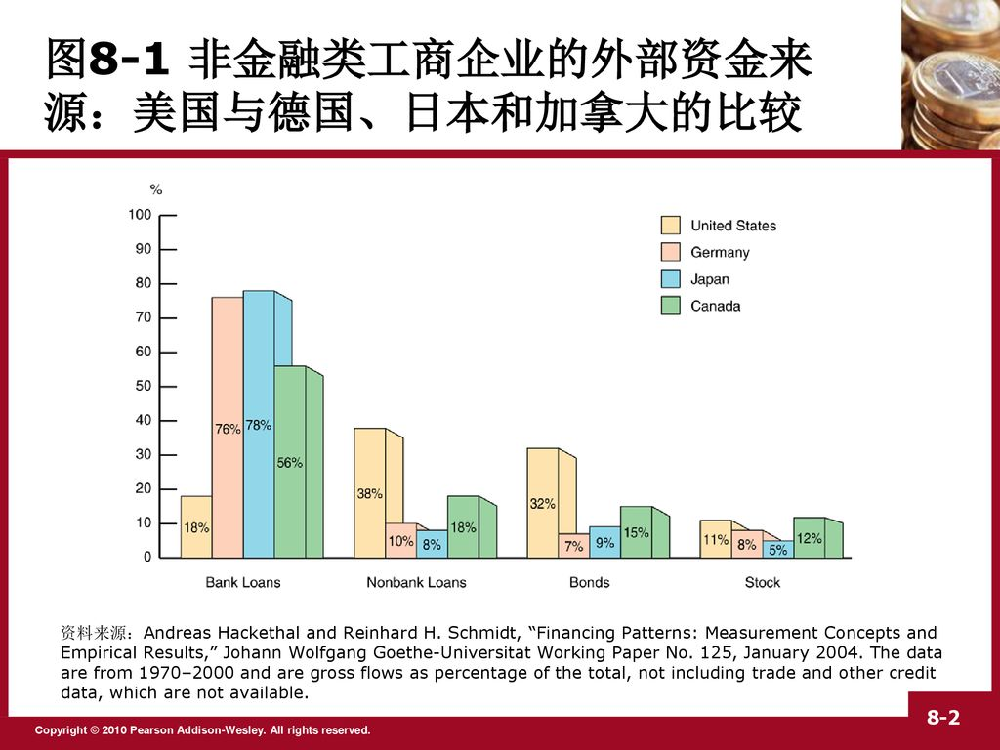

### 金融危机

——摘录自《金融学：从入门到精通》ISBN:978-7-210-09638-2，武永梅

***金融危机大事件解读***

回顾历史，1637年郁金香狂热、1720年南海泡沫、1837年经济大恐慌、1907年银行危机、1929-1933年股市大崩溃、1987年黑色星期一、1994年墨西哥金融危机、1997年亚洲金融危机，很多人可能会诧异，金融危机为何总是间隔性地光顾，为什么我们总是逃不了金融危机呢？很多经济学家经过研究发现其中一个不可忽略的原因就是经济周期。

那么，什么是经济周期呢？经济周期是指商业周期、景气循环，它是指经济活动沿着经济发展的总体趋势所经历的有规律的扩张和收缩交替更迭、循环往复的一种现象，是国民收入或总体经济活动扩张与紧缩的交替或周期性波动变化。

经济波动以经济中的许多成分普遍而同期地扩张和收缩为特征，持续时间通常为2~10年。过去经济周期可分为繁荣、衰退、萧条和复苏四个阶段。现代宏观经济学中，经济周期发生在实际GDP相对于潜在GDP上升（扩张）或下降（收缩或衰退）的时候。每一个经济周期都可以粗略地分为上升和下降两个阶段。上升阶段也称繁荣，最高点称为顶峰。经济到达顶峰时，也是经济由盛转衰的转折点，此后经济就进入下降阶段，即衰退。衰退严重则经济进入萧条，衰退的最低点称为谷底。当然，谷底也是经济由衰转盛的一个转折点，此后经济又进入下一个上升阶段。一次完整的经济周期就是经济从一个顶峰到另一个顶峰，或者从一个谷底到另一个谷底。

由此我们可以看到，繁荣的背后必是衰退，而衰退必然伴随着金融危机。下面我们就来着重看一下最近十年发生在我们身边的最有影响力的金融危机大事件。

**事件一：2007-2008年美国次贷危机**

美国次贷危机的全称为次级房贷危机，是指发生在美国，因为次级抵押贷款机构破产而导致的投资基金被迫关闭，股市震荡反常的危机。次贷即“次级按揭贷款”，“次”与“高”“优”相对应，形容较差的一方，而在“次贷危机”一词中指的是信用低，还债能力低。次贷危机造成了全球金融市场流动性不足，美国、欧盟、日本等主要金融市场都深受其影响。

美国次贷危机经历了以下几个发展阶段：

2007年2月，美国次贷市场危机初见端倪。由于借款方违约增多，美次贷放款机构出现亏损，第二大次贷机构新世纪金融公司的股票被停牌。4月初，新世纪金融公司申请破产保护。

6月，一些西方对冲基金破产。瑞士银行下属Dillon Read资本管理基金因投资美国次贷市场出现严重亏损而宣告破产。

6月，美国知名的贝尔斯登资产管理公司因旗下两只对冲基金投资债务抵押债券亏损严重而陷入困境。

7月，次贷问题导致私人股本运转失灵。7月25日，用于联合博姿和克莱斯勒并购交易的融资严重受阻。很快，次贷危机扩散至股市，引发股市和债市剧烈波动。欧美主要股指日跌幅超过2%的现象不断发生。

8月，次贷危机造成了全球性信贷紧缩，各国央行被迫入市干预。

从8月9日到8月31日，主要国家央行共注资5446亿美元，其中欧洲央行注资3434亿美元，美联储注资1472亿美元，日本央行注资400亿美元。

9月12日，欧洲央行再次向市场投放约1000亿美元的2个月期资金。

9月13日，英国北岩银行因受抵押贷款问题影响资金周转不灵，向英格兰银行求救，14日北岩银行发生挤兑事件。英格兰银行给现金匮乏的银行提供了200亿美元的3个月贷款，并允许以抵押贷款作为担保。

纵观美国次贷危机的发展，其成因如下：

*1. 低利率造就楼市繁荣*

2000年，美国经济不景气，为拉动经济增长，政府采取了扩张性的财政政策，其中就包括降低利率和减税两大措施，由于国家降低利率这间接是鼓励购房，从而为房地产市场持续上扬，与之相应的房地产抵押贷款业务也随之蓬勃发展。

在美国，贷款是非常普遍的现象，很少有人全款买房，尤其是收入并不稳定甚至根本没有收入的人。他们买房时因为信用等级达不到标准，就被定义为次级信用贷款者，简称次级贷款者。由于之前的房价很高，银行认为既然贷款给了次级信用贷款，如果贷款人无法偿还贷款，则可以将他们抵押的房屋拍卖以此收回贷款。正是这种盲目追求利润的行为，种下了危机的种子。可是，随着房价突然走低，贷款人无力偿还时，银行把抵押的房屋出售后，却发现得到的资金不能弥补当时的贷款和利息，甚至都无法弥补贷款额本身，这样银行就会在这个贷款上出现亏损。一个两个贷款人出现这样的问题还好，但由于分期付款的利息上升，加上这些贷款者本身就是次级信用贷款者，这样就出现了大量的无法还贷的贷款者。正如上面所说，银行收回房屋，却卖不到高价，大面积亏损，成为次贷危机的导火索。

*2. 利率上升和住房市场持续降温*

在房地产市场火爆发展的同时，次级贷款的房贷机构将次级贷款债权转化为证券，再卖给全世界的投资者，把风险转移到市场。更有甚者，伴随次贷产品遍地开花，并多次衍生，结果产品过剩，风险开始无限放大。而次级贷款机构为了不让银行看出此中的高风险，通过不正当手段行贿信用评定机构，从而拿到高等级的信用评级，使银行失去了对风险的敏感性。最终，使得次贷危机不断膨胀蔓延。

次贷危机已经并将继续对全球金融和世界经济产生不可低估的影响：

*1. 次贷危机对全球金融市场造成剧烈震荡*

大量房贷机构特别是与美国次贷市场相关的基金陷入困境或破产。据不完全统计，从2006年11月至2007年8月中旬，全美80多家次贷机构停业，其中11家破产，损失高达1000亿美元。英国、德国、法国、瑞士、荷兰、日本、澳大利亚等国家的50多家银行、对冲基金等受到波及。

西方主要金融机构亏损严重，债务大幅上升。受次贷危机影响，全球银行业损失高达3000~4000亿美元。美国花旗银行、美国银行、JP摩根大通银行及高盛公司等大型银行出现了近年来罕见的亏损状况。危机还导致美林银行、花旗银行、美国银行等美欧金融机构的董事长或总裁辞职。

国际金融市场的各领域都出现剧烈动荡，股市、债市、汇市及商品市场无一幸免，并造成了西方信贷市场一定程度的紧缩。2007年10月以来，全球股市出现暴跌，全球股票市值大约损失7.7万亿美元。

*2. 次贷危机使美国房地产衰退雪上加霜*

在次贷危机发生之前，美国房地产业已陷入衰退。到2007年第4季度，住宅建筑投资已出现8个季度负增长。有人曾预言美国房地产衰退将于2007年底开始复苏，但世界银行等权威机构认为，次贷问题将使美国房地产衰退持续到2008年中期，主要原因是次贷市场的还债高峰期将出现在2008年3月前后。美国财政部部长保尔森也指出，解决次贷问题需要较长时间，许多方面将需要一两年时间才能恢复正常。在次贷危机之后一年，房贷利率的重订将使约100万家庭面临因拖欠债务而被银行取消抵押品赎回权的风险。

*3. 次贷危机将使美国经济发展进一步放缓*

2007年美国GDP增长率从2006年的2.9%降到2.2%，其中住宅投资萎缩使GDP下降近1个百分点。

*4. 次贷危机对中国的影响也不容忽视*

首先，次贷危机对我国出口造成影响，是我国经济增长在一定程度上放缓，使整个社会的就业压力增加；其次，次贷危机加大了我国的汇率风险和资本市场风险。总之，次贷危机是美国20世纪30年代“大萧条”之后，最为严重的一次金融危机。作为个人投资者，我们要明白危机带给我们的影响。

**事件二：2008年金融海啸**

2008年，美国次级贷款金融危机爆发，并迅速蔓延至全球各个经济体和全球经济的各个领域，其影响深度和影响范围被认为是自1929年经济危机以来最严重的，这次危机迫使全球的金融市场进入了寒冬时期。

由次级贷引发的金融海啸已经走过了六波：

第一波，2007年8月到9月，美国多家与次级贷款、次级债相关的金融机构破产；

第二波，2007年末至2008年初，美国花旗银行、美林银行、瑞士银行等主要金融机构因次级贷款而出现巨额亏损；

第三波，2008年3月，美国第五大投资银行贝尔斯登濒临破产；

第四波，2008年7月，美国两家最大住房贷款机构房地美和房利美陷入困境，美国政府被迫于2008年9月7日接管这两家公司；

第五波，2008年9月，美国第四大投资银行雷曼兄弟控股公司破产、美国第三大投资银行美林银行被迫出售给美国银行、全球最大的保险公司美国国际集团被政府接管、美国政府推出7000亿美元紧急经济稳定法案；

第六波，2009年2月，各国陆续公布金融海啸以来的庞大亏损，并推出史无前例的大规模救市计划及时股市大幅度调整，贸易保护主义开始扩散到金融领域。

美国总统小布什对金融创新扩张的弊端曾提出了浅显而又富有深度的评论：“华尔街喝醉了，不知还要多久才会清醒过来，不再推出一些莫名其妙的金融投资工具。”小布什之说，几乎道破那些貌似经过“科学设计”的金融创新及其金融衍生品，原本就是一件件“皇帝新衣”。通俗地说，“金融创新扩张”具有“传销模式”的特征。所谓“传销模式”，就是设计一个宣称能够获得高收益的投资，吸引大量投资者购入，再用后期投资者的资金支付前期投资者的高收益，循环往复，直至后续自己难以为继或投资者信心不再之时，整个系统即迅速崩溃。

而与之相关的经济部门也随着多米诺骨牌效应而倒塌。石油期货、房地产等炒作，本质上与实体经济无关，但又影响到了实体经济的价格、需求、利润、资金等各种经济信号，导致整个经济系统絮乱。还由于金融资产高收益的诱导，引致实体经济的资金流向金融投资部门，形成资金结构关系的倾斜和扭曲，极大的影响实体经济的资金流向金融投资部门，形成资金结构关系的倾斜和扭曲，极大的影响实体经济的发展和整个经济体系的稳定。金融创新及其金融衍生品的“传销模式”特性，可从以下方面来认识：

（1）金融衍生品没有物质的根基，随时存在崩塌的危险。无须任何高深的理论知识就可知道，金融衍生品自身不可能创造利润，它的利润来源就是它作为标的物的实体经济（企业股票红利、债券利息、房地产的升值、期货商品价格增长等），所以整体上来看它根本不可能形成比银行利率高得多的收益。唯有可能的收益支付，就是来自后续的资金。这与传统过程中“上家的收入来自下家的投入”没有什么区别。所以，它的崩溃也与传销的崩溃一样，在资金难以为继之时轰然倒塌，所以还没来得及脱逃的“下家”都血本无归。整个金融衍生品的系统就是建立在这样一个没有稳固基础上的摩天大楼之上，随时都有崩塌的风险。

此次金融危机的背景，是伴随着金融投资活动的全球化而进行的，先行国家“创造”金融衍生品谋取后行国家利益的意图在相当程度上得到了实现。这就如同传销过程中的少数上家获得巨大利益，而众多的下家则被套牢的状况，呈现出国家层面的“传销”图利模式。

（2）金融衍生品以“传销模式”贯彻始终。在现代经济中，信用经济模式加速扩张，信用结构日益复杂，在信用货币的基础上不断衍生出新的金融产品，可这些金融衍生品与实体经济的距离却越来越远，甚至毫不相关。通俗地来看，金融衍生品与传销中的传销品毫无二致，没有任何实质的内容，只是传销计件的标的，最终都无法避免因资金难以为继而顷刻崩溃的结果。

（3）金融体系面对各种衍生品必然破局的风险，不断创造出新的金融衍生品，就是当一种投资工具快要崩溃时，换成另一种投资工具继续炒作。此次金融危机的背景，也淋漓尽致地体现了这一特性。20世纪90年代，各国经济的金融创新围绕“IT”概念而发展，直到2001年，这一形式的金融创新扩张模式难以为继，且有崩溃之虞，这时，金融创新与经济发展模式开始转向低息和高杠杆刺激房地产业，次级贷款等应运而生，而其在高速发展和高度繁荣之后也难逃崩溃的命运，结果引发了这场前所未有的全球性金融危机。正如世界银行首席经济学家林毅夫所说，为了解决一个问题却创造了一个更大的问题。

（4）金融创新及其金融衍生品异化发展，在相当程度上颠覆了经济学理论的一些基本认识。如，金融衍生品的高收益问题，从整体上来看，金融衍生品的收益绝不高于银行利率或企业平均利润收益的可能。又如，金融衍生品高风险、高收益问题，高风险未必带来高收益，风险高到一定程度后就成为大概率事件，风险发生的概率极大之时，何谈收益？再如，金融衍生品提高资本流动效率，进而提高资本的收益问题，在实体经济所需的资金充足的前提下，其效率和收益便无法持续提高。再者，资产价格由市场决定问题，支撑金融衍生品的是资产评价的高价格，但这一价格并非市场均衡的结果，实际上只是操作者对赌局的选择。

总之，各种金融衍生品，实质上是一些设计得比一般商品传销更为奇巧的“传销”。针对这样一种“金融创新扩张”发展模式，必须时刻保持警觉。凡是不符逻辑常理的超速增长，极有可能就是这一传销式发展模式的不同版本。如石油价格从40美元上涨至140美元，从供需角度根本无法解释，由此可以判断石油已经被作为金融衍生品标的物被炒作。又如，股票远离上市公司利润水平高速增长，也必然是“传销模式”的结果。

**事件三：冰岛破产**

受金融海啸影响最大的是美国，但第一个发生破产的国家是冰岛。人口只有32万，人均GDP却是世界第四，冰岛这个北欧岛国，2007年被联合国评为“最适宜居住的国家”。然而一夜之间，这个天堂里的国家便坠入了地狱，现在的冰岛人民不得不面对9倍于GDP的银行负债重担。

冰岛是个高福利、高待遇、高税收的国家，冰岛人素以行事谨慎小心著称，冒险并不是他们的天性。冰岛人被认为是北欧最勤奋的工人，他们平均每周工作47小时，而其他北欧国家的居民只工作38小时。

冰岛的贫富差距也非常小，衡量贫富差距的基尼系数几乎是全球最低的。冰岛的失业率一直维持在1%以下，这个数字意味着冰岛人只要想工作，就一定有活儿干。

冰岛的自然资源很贫乏，所以他们便大力发展金融业，以高利率与低管制的开放式金融环境吸引海外资金。

而冰岛的银行也效法其他国际投资银行，在国际资金市场大量借入低利短债，投资高获利长期资产，次级按揭资产便是其中一种。之前几年的全球经济好景，导致冰岛的银行过分借贷，财务杠杆（指经济实体在制定资本结构决策时对债务筹资的利用。因而财务杠杆又可称为融资杠杆、资本杠杆或者负债经营。这种定义强调财务杠杆是对负债的一种利用）因此达到了惊人的幅度，总外债规模竟是国内生产总值的12倍，外债总额高达1000亿欧元，相反冰岛央行的流动资产却只有40亿欧元。银行业已经达到了一个“富可敌国”的地步，所以一旦出现问题，政府根本无法挽救，只好马上宣布面临破产。

冰岛会面临如此窘境，究其原因主要有以下三个：

一是美国发端的“次贷危机”。现在很多人一提“次贷”便认为那是美国的问题，事实上，冰岛的“次贷”危机更为严重。阿特拉松在雷克雅未克市郊有栋别墅便是贷款买回，当时贷款额大约合500万人民币，后来银行劝说他将贷款与外汇挂钩，结果现在导致阿特拉送的房贷已经高达合900多万人民币之多，月供上涨了将近2倍，以致他们目前不得不考虑放弃还贷。而类似的问题还发生在众多冰岛人身上。有资料显示，冰岛家庭平均承担的债务达到可支配收入的213%，比美国140%的比例高得多。

二是过度扩张的银行业。冰岛以渔业起家，但出海打鱼毕竟是个苦差事，所以大约十年前，冰岛确立了“快速发展金融业”的方针，现在，金融产业在国民经济中的比重高居首位，包括冰岛股市的主力也是银行系统。

三是冰岛银行的投资几乎遍布全世界，金融行业曾在2005年给冰岛带来过7%的增长率，这个其他发达国家想都不敢想的辉煌成就，却使冰岛在今天深陷破产危机。

随后，巴基斯坦、韩国、英国也都出现了严重的问题，被称为又一个冰岛，俄罗斯的日子也不太好过。总体来看，外资依赖度越高的国家和地区受这次金融海啸的影响越大，有的国家经济甚至倒退了几十年。

--------------------------------------------------------------------------------

### 银行破产

——摘录自《金融学：从入门到精通》ISBN:978-7-210-09638-2，武永梅

***银行也会破产——无奈的“最后贷款人”***

大多数人觉得把钱放在银行最保险，银行存款应该是最安全的一种储蓄手段了，100%肯定没问题！然而，事实真的如此吗？其实，银行会倒闭，而且现实已经发生了。

2008年5月31日，摩根大通宣布完成对贝尔斯登价值14亿美元的收购，使这家拥有85年历史、经历过大萧条及多次危机的顶级投行在华尔街消失。9月15日，拥有158年历史的美国第四大投资银行雷曼兄弟公司申请破产，第三大投行美林公司则被美国银行收购。9月21日，美国联邦储备委员会宣布批准高盛和摩根士丹利提出的转为银行控股公司的请求。

除投行外，美国的商业银行也受到很大拖累。就在国会与政府就7000亿美元救市方案反复拉锯的11天里，美国最大的储蓄银行华盛顿互惠银行又于2008年9月25日被美国联邦存款保险公司（FDIC）接管，使它称为美国历史上倒闭的最大规模的储蓄银行。美联银行股价当天暴跌27%，国民城市银行股价也重挫25.6%，其后美联银行被富国银行收购。

由此可见，银行破产也是习以为常的。大型银行如此，中小型银行也一样。

尤其是受金融海啸影响，中小型银行受到的冲击更严重。因为这些中小型银行根本无力与大型银行竞争业务，所以它们平时都把精力集中在住房贷款业务上。众所周知，金融海啸正是由次贷危机引发的，因此，这些中小型银行所受的冲击最大也就很好理解了。整个2008年，美国共有25家银行倒闭，超过了此前5年间倒闭银行数量的总和。

2008年10月，随着西方各国纷纷陷入金融危机，法国总统萨科齐呼吁中国、印度等国家参加一次有关重建世界金融秩序的“紧急全球峰会”，以共同因对目前的全球经济危机。在美、欧金融危机越演越烈的情况下，越来越多的西方政治家将中国视为全球金融稳定的关键力量，因为中国金融健康并持有巨额外汇储备，因而被赋予了决定未来金融秩序的能力。

而美国国会公布的7000亿美元就是计划根本无法增强市场信心，在解决流动性方面作用有限，根本无法制止实体经济的衰退。这意味着未来信用违约会越发严重，将对美国的金融系统造成进一步的恶劣影响。

在中国，银行当然也会破产！如1998年6月21日，中国人民银行发表公告，关闭刚刚诞生两年十个月的海南发展银行（简称海发行）。这是新中国金融史上第一次由于支付危机而关闭的一家商业银行。

2015年5月1日起，我国《存款保险条例》正式开始施行。《条例》明确规定，存款保险实行限额偿付，最高偿付限额为人民币50万元。其他金融产品不受保护，这就意味着，如果银行破产，你在这家银行购买的理财产品，不管多少，都不会有全额赔付的。

由此可见，商业银行的存亡关系到国计民生，因此我国对商业银行的破产条件较之一般生产性企业要更严格，具体而言应符合以下条件：

（1）商业银行不能清偿到期债务。即商业银行不能按照与存款人的约定及时偿还存款的本金和利息，且丧失正常运营能力，也就是说，若商业银行的总资产不能抵偿其总债务，则该商业银行就达到了法律规定的破产界限。

（2）国务院银行业监督管理机构审查同意。这是由商业银行的特殊地位和对金融业的监管决定的。如果国务院银行业监督管理机构认为能够采取措施帮助商业银行渡过危机，就宣告接管；反之，则同意该商业银行破产。

（3）商业银行由人民法院宣告破产。即宣告商业银行破产的权力属于人民法院，其他任何单位和个人均无权宣告商业银行破产。

商业银行破产需要经过申请、受理、公告、和解和整顿、破产宣告、清算、注销登记和注销公告等阶段。经过了这些步骤，破产商业银行的企业法人资格才能从法律意义上正式消失。

--------------------------------------------------------------------------------

### 通货膨胀

——摘录自《金融学：从入门到精通》ISBN:978-7-210-09638-2，武永梅

***通过膨胀——为什么口袋里的钱不值钱了***

全球著名的投资商沃伦·巴菲特曾说：“通货膨胀是投资者最大的敌人。”那么，什么是通货膨胀呢？经济学的定义是指流通中的货币量超过实际需要所引起的货币贬值、物价普遍上涨的经济现象。

通货膨胀率的计算公式为：

当期通货膨胀率 = （当前价格水平 - 上期价格水平） ÷ 上期价格水平 ✖ 100%

世界各国对通货膨胀程度的度量，大都采用物价指数。度量通货膨胀程度所采用的指数主要由五种：居民消费物价指数（CPI）、生产者价格指数（PPI）、零售价格指数（RPI）、批发物价指数（WPI）和国内生产总值平减指数（GDP Deflator）。

我们可能会有这种感觉，现在的钱越来越不值钱了。其实，不仅仅“现在”的钱是这样，“过去”的钱也是如此，这是一种普遍而正常的金融学现象。

例如，一位农民在1985年卖掉一头500斤的猪，得到500元。如果这位农民既没把钱存进银行，也没把钱花掉，而是把这笔钱藏在家里某个秘密的地方，留作日后养老之用。就这样，一晃30年过去了，到2015年底，他把30年前藏在家里的这笔钱拿出来，此时自己辛辛苦苦养猪换来的的500元，现在却只能买到33斤猪肉（按市价15元/斤计算）。这位农民疑惑了：“为什么当初卖掉500斤的猪换来的500元钱，现在却只能买回来33斤猪肉呢？”

其实，这就是通货膨胀产生的效应。这位农民的500元在1985年确实是一笔“巨款”了。当时全国人均存款只有几十元。当时这500元，足够买一套房子，可现在想买巴掌大的地方都困难。

我们再来算一笔账，如果你有5000元，以5%的通货膨胀率来说，你的钱的购买力在不到15年内就会减少一半。通货膨胀率如果是7%，只要经过21年，你的钱的实际购买力就会降到目前的1/4。在通货膨胀下，储蓄存款是不划算的，因为货币贬值使得现金的实际购买力下降，在一定程度下银行蚕食了我们的财产。

那么，通货膨胀是怎样发生的呢？一般认为，通货膨胀产生的原因主要有以下四点。

**1. 需求拉动通货膨胀**

是指经济发展过程中货币的总需求大于总供给，从而引起的价格水平持续上升。具体情况又分为两种：一是现实因素，二是货币因素。

从现实因素看，整个社会都在过度消费、过度投资，财政赤字居高不下。尤其是过度投资，很容易打破货币总需求和总供给之间的平衡，导致价格水平上升。

从货币因素看，货币供应过度，即会拉动价格上涨。当然，如果投资增长速度与货币总供给增长速度相同，价格依然是可以保持不变的。比如，2008年金融危机爆发后，美国联邦储备委员会宣布启动总额达1.75万亿美元“量化宽松”措施，购买包括国债在内的各类债券；2010年11月，又再度启动6000亿美元的QE2。这些措施都是为了应对通货膨胀。

**2. 成本拉动通货膨胀**

是指经济发展过程中，在没有超额需求的情况下由于供给方成本的提高所引起的一般价格水平持续和显著的上涨。包括：

（1）员工工资水平不断提高。随着全社会普遍加工资时，就会引发全社会产品和服务价格的上涨；而产品和服务价格的上涨，又会拉动员工工资上涨，从而形成工资和价格的交替上涨的局面。

（2） 垄断行业会强行拉动产品和服务价格的升高。如果价格上涨幅度超过成本增长幅度，理论推动型通货膨胀就出现了。在成本一定的情况下，利润与价格是齐涨共跌的关系，利润推动型通货膨胀实际上就是成本推动型通货膨胀。

**3. 需求与成本共同作用的通货膨胀**

货币总需求大于总供给会导致通货膨胀（需求拉动通货膨胀），在货币总需求一定（不存在货币总需求拉动）的情况下供给方成本提高也会导致通货膨胀（成本推动通货膨胀）。为缓解通货膨胀，政府经常会采用推动和需求拉动并存的混合手段，从而导致通货膨胀。

**4. 经济结构型通货膨胀**

不同部门之间货币需求结构的转换、生产率增长水平的差异、与国际市场的联系紧密程度等，都会引发结构型通货膨胀。

（1）货币需求结构转换引发通货膨胀。在货币总需求一定的情况下，某个部门的一部分货币需求会转移到其他部门，而这时候劳动力和其他生产要素却是无法及时转移的。

这样以来，货币需求增加的那个部门的员工工资就会提高，从而引发产品和服务价格上升；同时，货币需求减少的部门劳动力和其他生产要素又会因为没能及时转移，员工工资不会得到减少，从而导致产品和服务的价格依然维持在原有水平上。总体上看，这时候产品和服务的总价格水平上升了。

（2）部门生产率增长水平差异引发通货膨胀。一般来说，产业部门的劳动生产率增长水平要高于服务部门，而这两大部门的工资增长速度是大体相同的，并且主要取决于产业部门的生产率增长水平。换句话说，产业部门的生产率提高得快，工资增长速度就快，同时也会使服务部门的工资增长速度得到相应提高。

（3）部门差异在国际的传递。当全球市场价格处于上涨进程中时，必然会影响到这个特定国家的价格上涨幅度。只要这个国家无法决定国家市场铲平价格，该国的开放经济部门和非开放经济部门就都要受国际市场价格的影响，尤其是开放经济部门，它受到的影响更直接、更紧密。具体来说，当全球货币市场价格上涨时，开放经济部门中的员工工资会率先得到提供，从而带动非开放经济部门中员工工资的增长。

虽然通货膨胀的原因多种多样，归根结底是由货币供应量过多造成的，但并不是说货币供应量过多就一定会造成通货膨胀。因为随着生产的发展、商品价格的增加，客观上需要货币量能够保持同步增长。确切地说，只有剔除这部分正常货币供应量之外的货币量增加，才会引发通货膨胀。

通货膨胀会造成货币价格动荡，对经济和人们的生活造成严重的影响，那么如何来应对呢？

从宏观上来讲，抑制通货膨胀主要是依靠政府进行调控，出台相关的经济政策和措施，例如上调存贷款利率，提高金融机构的存款准备金率，实行从紧的货币政策，包括限价调控令、严禁哄抬商品价格等。

从微观上来说，老百姓自身也可以采取一些措施，以应对通货膨胀。首先要努力工作，多多赚钱，节约开支，以减轻通货膨胀的压力。其次，根据个人情况，可以通过各种投资理财来抵消通货膨胀对财产的侵蚀。但需要针对不同程度的通货膨胀来考虑选择投资理财的工具。

总之，随着社会的发展，发生通货膨胀是必然的，只要通货膨胀率不过高就行。温和的通货膨胀是刺激经济发展的润滑剂，而快速或恶性的通货膨胀，则是经济的杀手。

--------------------------------------------------------------------------------

### 汇率

——摘录自《从零开始读懂金融学》ISBN:978-7-5429-4193-0，斯凯恩

***汇率：博弈乱局中的焦点***

2005年7月21日，中国人民银行宣布，我国开始实行以市场供求为基础，参考一篮子货币进行调节、有管理的浮动汇率制度。根据对汇率合理均衡水平的测算，7月21日起，人民币对美元升值2%，即1美元对8.11元人民币。

人民币汇率升值的消息传出后，国内外议论纷纷。那么汇率为什么如此牵动人心呢？浮动汇率与固定汇率又有什么不同呢？

汇率说白了就是一国货币兑换另一国货币的比率，是以一种货币表示另一种货币的价格。由于世界各国货币的名称不同，币值不一，所以一国货币对其他国家的货币要规定一个兑换率，即汇率。

各国货币之所以可以进行对比，能够形成相互之间的比价关系，原因在于它们都代表着一定的价值量，这是汇率的决定基础。在金本位制度下，黄金为本位货币。两个实行金本位制度的国家的货币单位可以根据它们各自的含金量多少来确定他们之间的比价，即汇率。如在实行金币本位制度时，英国规定1英镑的重量为123.27447格令，成色为22开金，即含金量113.0016格令纯金；美国规定1美元的众量为25.8格令，成色为900‰，即含金量23.22格令纯金。根据两种货币的含金量对比，1英镑=4.8665美元，汇率就以此为基础上下波动。在纸币制度下，各国发行纸币作为金属货币的代表，并且参照过去的做法，以法令规定纸币的含金量，称为金平价，金平价的对比是两国汇率的决定基础。

但是纸币的情况就不同了，它不能兑换成黄金，因此，纸币的法定含金量往往形同虚设。所以在实行官方汇率的国家，由国家货币当局（财政部、中央银行或外汇管理当局）规定汇率，一切外汇交易都必须按照这一汇率进行。

那么影响汇率变动的因素都有哪些呢？

进出口的差额是主要因素。出口是把本国的商品或服务卖给国外，是收入外汇（创汇）的过程；进口则是用外汇购买国外的商品或服务，是付出外汇的过程。如果一个国家的商品和服务的出口额比进口额多，出现贸易顺差，相应这个国家挣的外汇就多，花的外汇就少，也就是外汇供给多，需求少，这时，外汇的价格——汇率自然要下跌，该国货币也就相应升值。这几年，我国面临持续的巨额贸易顺差，人民币因此也面临着升值的严厉。相反，如果一个国家商品和服务的出口比进口少，出现了贸易逆差，相应挣的外汇少，花的外汇多，外汇供给少，需求多，这时，外币汇率自然会上升，该国货币可能救不怎么值钱了，面临着贬值的压力。

资本的流出流入差额。当一个国家的资本流入多于资本流出时，这个国家就会出现资本项目顺差，也就是外汇供给多，需求少，外币汇率自然会下跌。相反，如果一个国家的资本流出多于资本流入，这个国家就会出现资本项目逆差，外币汇率就有上升的趋势。

利率差异也是重要因素。随着世界经济的一体化，各国之间的资本流动越来越自由。如果一个国家的利率比其他国家的利率高，就会有大量的资本涌进来，兑换成这个国家的货币以获取更高的利息，这样，就会推动这个国家的货币升值。反之，如果这个国家的利率比其他国家的利率低，其货币就有贬值的压力。

通货膨胀率的高低也会影响汇率。如果一个国家的通货膨胀率较高是，就意味着这个国家的货币购买力下降，相对于通货膨胀率较低的国家，其货币自然有贬值的压力。反之，如果一个国家的通货膨胀率比其他国家低，其货币就有升值的趋势。

人们的心理预期也是影响短期汇率波动的重要因素。如果人们认为某个国家的经济发展令人担忧，或者政治局势不稳定，预测其货币不久就会贬值，就会纷纷抛售该国货币。结果，该国货币雪上加霜，大幅度贬值甚至爆发货币危机。

政府对汇率的干预行为也在很大程度上影响着汇率。比如1985年，美国正承受着高额的财政和贸易赤字，而美元升值又加剧了其贸易赤字，于是美国联合西方国家达成了著名的“广场协定”，各国政府联手拿出200亿美元投入外汇市场购买日元，结果美元大幅度贬值，日元大幅升值。

再来说说我们现在执行的浮动汇率体制。浮动汇率制的正式采用和普遍实行，是20世纪70年代后期美元危机进一步激化后开始的。

当一个旧的体系破裂时，并不意味着一个完善的新体系就已在眼前。在20世纪70年代初，国际货币基金组织的主要成员国举行了一次又一次的会议，试图建立一个新的体系来替代布雷顿森林体系，但是未能达成协议。在没有人能设计出一个新体系的情况下，金融世界自然而然地走进了浮动汇率体系阶段。从1971年史密森协议到1973年浮动汇率体制确立，这是一段充满了尝试与失误的时期。当时机会所有人都在摸索恰当的汇率水平，而且所有人都尽力想在这种新的和陌生的环境中维持稳定。就在史密森协议不久之后，世界曾一度竭力支持这一新的评价关系，该关系被称为“中心汇率”。但这次这种体系缺少黄金支持下的美元这一必要的进士。只要主要经济大国的重要经济变量之间的差异没有消除，为恢复固定平价体制、中心汇率或不论其他什么称号的体制所做出的努力实际上都终将归于失败。

--------------------------------------------------------------------------------

### 金融行业

——摘录自《货币金融学（第十一版）》ISBN:978-7-300-23001-6，Frederic A. Mishkin

***金融结构的经济学分析***

**世界各国金融结构的基本事实**

世界各国金融体系的结构和功能都是十分复杂的。它包括许多不同种类的机构：银行、保险公司、共同基金、股票与债券市场，等等。所有这些机构都要接受政府的监督。每年，金融体系都要将数万亿美元从储蓄者手中转移到具有生产性投资机会的借款人手中。如果我们近距离观察世界各国的金融机构，就会发现8个基本事实，其中一些事实是非常出人意料的。要理解金融体系的运作，就必须解释这8个基本事实。

图8-1的条形图反映了1970-2000年间，美国企业如何利用（来自企业之外的）外部资金为其运营融资，并将美国的数据与德国、日本和加拿大进行了对比。银行贷款类主要由存款机构提供的贷款组成；非银行贷款类主要由其他金融中介机构提供的贷款构成；债券类包括企业债券和商业票据等可流通的债务证券；股票类包括新股票的发行（股票市场股份）。

下面，我们来探讨这8个事实。

1. 股票不是企业最主要的外部融资来源。由于媒体对股票市场的高度关注，很多人都认为股票是美国企业最主要的资金来源。然而，从图8-1的条形图中，我们可以发现，1970-2000年间，股票在美国企业外部融资中仅占一个很小的份额：11%。图8-1表明，股票融资的份额在其他国家同样比较小。为什么在美国和其他国家，股票市场不如其他资金来源那么重要呢？

2. 发行可流通的债务和股权证券不是企业为其经营活动筹资的主要方式。图8-1表明，在美国，债券作为融资渠道的重要性远远高于股票（32%对11%）。然而，股票于债券的总和43%即可流通证券的份额仍然不到企业外部融资的一半。这意味着发行可流通证券不是企业融资的最重要的渠道。世界上其他国家也同样如此。我们在图8-1中还可以发现，在世界上其他国家，可流通证券在企业外部融资中所占的比例比美国还要小。企业为什么不在更大程度上利用可流通证券来为其经营活动融资呢？

3. 与直接融资（即企业通过金融市场直接从贷款人手中获取资金）相比，间接融资（即有金融中介机构参与的融资）的重要性要大出数倍。直接融资是直接向居民个人出售股票与债券等可流通证券。在美国企业的外部融资来源中，股票与债券43%的份额事实上夸大了直接融资的重要性。自1970年以来，只有不到5%的新发行企业债券与商业票据以及不到1/3的股票是直接销售给美国居民个人的。保险公司、养老基金与共同基金等金融中介购买了余下的大部分证券。这些数据表明，直接融资在美国企业所使用的外部资金中所占的份额不到10%。由于在大部分国家，可流通证券作为融资来源的重要程度比美国还要低，直接融资在其他国家中远远不如间接融资重要。金融中介和间接融资为什么在金融市场中如此重要呢？近年来，间接融资的重要性有所下降，原因是什么呢？

4. 金融中介，特别是银行，是企业外部资金最重要的来源。我们由图8-1可以看出，银行与保险公司、养老基金和财务公司等非银行金融中介机构的贷款是世界各国企业最主要的外部资金来源（美国的这一比例为56%，德国、日本和加拿大的这一比例超过70%）。在其他工业化国家中，银行贷款在外部资金来源中所占的比重最大（德国和日本超过70%，加拿大超过50%）。因此，这些数据表明，在这些国家，银行在企业融资活动中发挥着最为重要的作用。而在发展中国家，银行在金融体系中的作用远远超过了工业化国家。银行为什么会对金融体系的运转如此重要呢？虽然银行依然重要，但它们近年来在企业外部资金中的份额却在下降，原因是什么？

5. 金融体系是经济体中受到最严格监管的部门。在美国和其它所有的工业化国家中，金融体系都受到十分严格的监管。政府对金融体系施加严格的监管，目的主要是鼓励信息披露，从而促进金融体系的健康（稳定）运行。为什么金融体系在全世界都受到如此严格的监管呢？

6. 只有信誉卓著的大公司才能进入金融市场为其经营活动筹资。个人与缺乏严密组织的小公司很难通过发行可流通证券来融资。事实上，他们通常从银行获取贷款。为什么只有信誉卓著的大公司才能很容易第利用证券市场来融资呢？

7. 抵押品是居民个人和企业债务合约的普遍特征。抵押品（collateral）是用于向贷款人承诺偿还的一种财产，一旦借款人无力归还债务，该财产就被用来保证支付。抵押债务，又称为担保债务（secured debt），与无担保债务（unsecured debt）相对应，后者是不设抵押品的债务，例如信用卡贷款。抵押债务是居民债务最主要的形式，在企业借款中也十分普遍。美国居民个人债务的主要形式是抵押债务。例如，汽车是汽车贷款的抵押品，住宅是抵押贷款的抵押品。以财产作为抵押品的商业抵押贷款和农业抵押贷款占非金融企业借款的1/4，企业债券与其他种类的银行贷款中也常常涉及财产的抵押。为什么抵押品是债务合约的一个重要特征呢？

8. 典型的债务合约是对借款人行为设置了无数限制条件的、极为复杂的法律文本。许多学生认为，债务合约是写在一张纸上的欠款单。实际情况远非如此。在所有的国家中，典型的债务和贷款合同都是附有很多规定条件（限制性条款，restrictive covenants）的篇幅很长的法律文本，这些条款限制并指定了借款人所能从事的活动。限制性条款并不只是企业债务合约的特征；例如，个人汽车贷款和住房抵押合同都列有限制性条款，要求借款人为其利用贷款购买的汽车或住宅购买足额保险。债务合约为什么如此复杂，并且是限制性的呢？

**交易成本**

*交易成本如何影响金融结构*

假定你有5000美元，并且打算将其投资于股票市场。由于你只有5000美元，你只能购买很少的股票。即使你使用在线交易，由于你的购买量很小，购买股票的经纪人佣金也会占股票购买价格的很高比例。如果你决定投资于债券，那么这个问题会更加严重，因为你希望购买的一些债券的最小面值为10000美元，你根本没有那么多钱来投资。你非常沮丧地发现，你辛苦积攒的储蓄无法在金融市场中赚取收益。略感宽慰的是，并非只有你受困于高昂的交易成本。我们中的很多人都面临这种情况。因此，只有一半左右的美国家庭拥有一定的证券。

交易成本还会带来另外一个问题。由于你可用于投资的资金规模不大，而很多的小额投资会带来十分高昂的交易成本，因此，你的投资品种有限。也就是说，因为你无法实现多样化投资，不得不将所有的鸡蛋都放在一个篮子里，从而会承担较高的风险。

*金融中介如何降低交易成本*

规模经济 要解决高昂交易成本的问题，一个方法就是将许多投资者的资金集聚在一起，从而可以利用规模经济的优势，即每一美元投资的交易成本随着交易规模的扩大而降低。通过集聚投资者的资金，单个投资者的交易成本被大大降低。规模经济之所以存在，是因为在金融市场中，随着交易规模的扩大，单笔交易的总成本只有少量的增加。例如，购买10000股股票的成本并不比购买50股股票的成本高多少。

金融市场中规模经济现象的存在，可以用来解释金融中介得以发展，并成为金融结构重要组成部分的原因。规模经济促进金融中介发展的一个典型案例就是共同基金。共同基金（mutual fund）是通过向个人销售份额筹集资金，并投资于股票或债券的金融中介机构。共同基金购买的股票或债券的规模很大，因此可以享受到较低的交易成本。共同基金以管理账户的名义将这些成本以管理费的形式扣除，于是，单个投资者也可以享受成本节约的好处。对于单个投资者而言，共同基金的另外一个好处是，它们的资金规模庞大，足以购买高度多样化的证券组合，从而可以降低投资者的风险。

规模经济在降低其它成本方面也十分重要。例如可以降低金融机构运行管理所需的计算机技术的成本。一旦共同基金斥巨资建立起通信系统，就可以用于大量的交易，从而降低每笔交易的成本。

专门技术 金融中介还可以开发专门技术用于降低交易成本。它们在计算机技术方面的专门技术可以为客户提供更为便利的服务，例如投资者可以通过一个免费的电话号码来了解自己的投资状况，并且可以依据其账户签发支票。

金融中介降低交易成本的一个重要结果就是，可以向其客户提供流动性服务，使其更为容易地完成交易。例如，货币市场共同基金不仅为其份额持有者提供较高的利率，还允许客户签发支票，从而可以十分方便地支付账单。

**信息不对称：逆向选择和道德风险**

金融市场中交易成本的存在可以在一定程度上解释金融中介和间接融资在金融市场中的重要作用（事实3）。但是，要更加深入地理解金融结构，我们还需要研究信息在金融市场中的作用。

信息不对称是金融市场的一个重要特征，是指交易的一方对另一方缺乏充分的了解，并影响其在交易中做出的正确的决策。例如，相对于股东而言，公司经理对自己是否诚实及公司的经营状况有更加深入的了解。信息不对称会导致逆向选择和道德风险。

逆向选择是交易之前出现的信息不对称问题：潜在的不良贷款风险来自那些积极寻求贷款的人。因此，最可能导致不良后果的人往往就是最希望从事这笔贷款的人。例如，冒险家与彻头彻尾的骗子知道自己不可能归还贷款，因而是最希望得到这笔贷款的。逆向选择增大了贷款发生风险的可能性，因此即使市场上的确存在着风险很低的贷款机会，贷款人也可能决定不发放贷款。

道德风险是在交易之后发生的：由于借款人从事了与贷款人意愿相背离的活动，增大了贷款违约的可能性，导致贷款人承担较大的风险。例如，一旦借款人取得了贷款，由于使用的是别人的钱，他就可能会冒比较大的风险（其收益可能很高，但亏损的风险也很大）。由于道德风险降低了贷款归还的概率，贷款人可能做出宁可不贷款的决定。

对信息不对称影响经济行为的研究被称为代理理论（agency theory）。

**次品车问题：逆向选择如何影响金融结构**

诺贝尔经济学奖得主乔治·阿克洛夫（George Akerlof）在他的一篇著名的论文中，曾经详尽地阐明了逆向选择影响市场有效运行的途径。由于它与二手车市场中的次品问题十分类似，因此，又被称为“次品车问题”。二手车的买主通常无法准确评价车的质量。也就是说，他们无法判断一部二手车是性能良好的好车，还是会不断给他们带来烦恼的次品车。于是，买主支付的价格只能反映市场中二手车的平均质量，该价格介于次品车的低价值与好车的高价值之间。

与此相反，二手车的所有者对他的车是次品车还是好车可能更清楚。如果是次品车，车主非常乐意按照买主愿意支付的价格售车，因为这个价格介于次品车和好车的价值之间，是高于次品车价值的。然而如果是好车，车主清楚地知道买主愿意支付的价格低估了该车的价值，因此可能不愿意出售。逆向选择的结果就是，很少有好的二手车在这一市场中交易。因为市场中二手车的平均质量较低，而且几乎没有人愿意购买次品车，因此市场的成交量很小。如果是这样，二手车市场的运作自然很差。

*股票与债券市场中的“次品车”*

证券市场——债务（债券）市场与股权（股票）市场——同样存在着类似的“次品车”问题。假定我们的朋友投资者欧文是一位证券（譬如说普通股）的潜在购买者，他无法区分具有较高预期利润和低风险的好公司与具有较低预期利润和高风险的差公司。在这种情况下，欧文愿意支付的价格只能与反映证券发行公司平均质量的价格水平相当，这一价格介于差公司与好公司是家好公司，就会清楚自己的证券被低估了，自然不愿意按照欧文愿意支付的价格水平出售。愿意向欧文销售证券的只有差公司，因为欧文支付的价格要高于差公司证券的价值。我们的朋友欧文并不愚蠢，他不愿意持有差公司的证券，因而他可能不在这一市场中购买任何证券。与二手车市场的结果类似，很少有公司能够通过证券市场发行证券来筹集资本，证券市场的运转自然不好。

如果欧文打算购买的不是股份，而是债券市场中的债券工具，情况也是类似的。只有利率高到足以补偿试图销售债务的好公司与差公司的平均违约风险时，欧文才愿意购买这一债券。好公司的所有者见多识广，意识到他们支付的利率要高于其合理水平，自然不愿意在这一市场中借款。只有差公司才愿意借款，然而由于欧文这样的投资者并不愿意购买差公司发行的债券，他们很可能不投资于任何债券。于是，这一市场中交易的债券很少，自然无法成为较好的融资来源。

我们刚才的分析可以用来解释事实2，即为什么在世界上任何一个国家中，可流通证券都不是企业的主要融资来源。它还可以部分解释事实1，即股票为什么不是美国企业最重要的融资来源。次品车问题的存在阻碍了股票市场和债券市场等证券市场有效地将资金从储蓄者那里融通给借款者。

。。。

--------------------------------------------------------------------------------

### 债务危机

——摘录自《宏观经济学（第九版）》ISBN:978-7-300-23038-2，N. Gregory Mankiw

*欧洲主权债务危机*

当美国开始从2008-2009年金融危机中复苏时，另一场危机在欧元区（使用欧元作为共同通货的欧洲区域）爆发了。问题起源于政府发行的债务即主权债务（sovereign debt）。许多年以来，银行和银行监管者都把这些债券看成是无风险的。它们假设欧洲的政府总会兑现它们的责任。由于这一信念，与被认为信用风险可靠性更低的债务相比，这些债券支付的利息更低，从而价格更高。

但是，在2010年，金融市场参与者开始怀疑对欧洲政府的这种乐观是否有依据。问题始于希腊。2010年，希腊的债务（净金融负债）增加了GDP的116%，而欧洲的平均水平只有58%。而且，如下的事实也变得很明显了：希腊一直在谎报其财务状况，它也没有计划控制其猛增的债务。2010年4月，标准普尔将希腊债务的评级降到了垃圾债券的级别，这表明其信用风险已经很差了。由于许多人担心违约的可能性，希腊债务的价格下降，希腊为新债务支付的利率显著上升。到2011年夏季，希腊债务的利率达到了26%。该年11月上升到了超过100%。

欧洲的政策制定者担心希腊的问题可能在整个欧洲产生影响。许多欧洲的银行持有的资产中包括希腊债务。随着希腊债务的价值下降，银行被推向破产。希腊违约可能将会使许多银行处于破产的边缘，导致更大范围的信任危机。结果，德国和法国等经济更健康的欧洲经济体的政策制定者帮助希腊安排了持续的贷款，以防止希腊立即违约。这些贷款其中一些来自欧洲中央银行（它控制欧元区的货币政策）。

这个政策行动不受人欢迎。德国和法国的选民感到疑惑，为什么他们纳的税应该帮助救助希腊人，毕竟希腊人面临的困境是他们在财政上挥霍无度导致的。与此同时，由于这些贷款带有要求希腊大幅削减政府支出和增加税收的条件，希腊的选民也不高兴。这些紧缩措施导致了希腊街头的暴乱。

使情况恶化的是希腊并非有这些问题的唯一一个国家。有人担心，如果希腊被允许违约而不是由其更富裕的邻国救助，那么，葡萄牙、爱尔兰、西班牙和意大利可能会步其后尘。所有这些国家的主权债务的价值普遍下降无疑会使欧洲的银行业系统不堪重负。由于整个世界的银行业系统是高度互联的，它也会给世界上其他地方带来压力。

应对这场危机的政策行动在如下意义上是成功的：尽管存在希腊和其他问题缠身的国家可能停止使用欧元作为通货的预测，但欧元区这个货币联盟仍然得以维持。不过，这场危机还是带来了巨大和持久的经济痛苦。甚至到了2014年底，希腊、西班牙和葡萄牙的失业率还分别高达25%、24%和14%（而在德国这个欧元区人口最多的国家，失业率只有5%）。正如标准的菲利普斯曲线所预测的，经济疲软将欧洲的通货膨胀拉低到了目标通货膨胀率2%以下。确实，到了2014年底，通货膨胀接近零，许多观察家担心欧洲可能会走向通货紧缩。为了扩大总需求和刺激经济，随着这场危机逐步发展，欧洲中央银行将利率降到了零左右。此外，在2015年初，欧洲中央银行宣布了一个量化宽松计划，根据这个计划，它将购买大量政府债券。

当本书即将付梓时，欧洲主权债务危机还没有结束。希腊政府在支付债务利息上还有问题，希腊选民对该国的财政紧缩和高失业也有叛逆表现。欧洲的政策制定者仍不确定使欧元区回到正轨的最佳方式究竟为何。

--------------------------------------------------------------------------------
