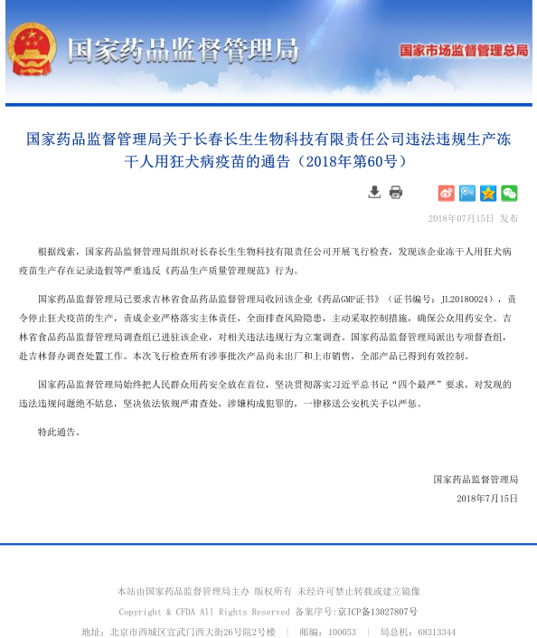
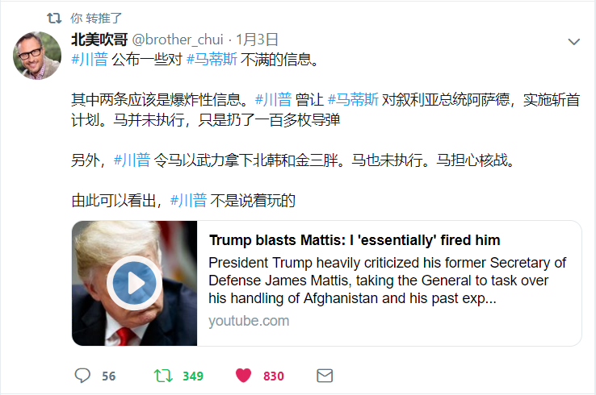

```
为什么美国人在世界上最早建立了代议民主制共和国？
为什么美国人可以骂总统，但不可以骂邻居？
为什么美国影视剧里的政治人物几乎都是“反面人物”？
为什么美国时常发生校园枪击案，但政府却不禁枪？
为什么美国最高法院说什么，连总统都要“照办”？
为什么美国州政府敢和“中央”对着干？
为什么负面报道是美国媒体的“主旋律”？
为什么美国的政权交替没有发生过革命和政变？
。。。

与世界上其他国家相比，
美国政治文化最大的特点就是，
美国人对权力侵犯权利有着深刻的忧虑和高度的警惕，
如果用一句话来概括美国政治文化的特点，
那就是“权力是靠不住的”。

————《[中国]权力是靠不住的：美国政治文化探析》
```

<http://news.bbc.co.uk/chinese/simp/hi/newsid_7060000/newsid_7069400/7069409.stm>

--------------------------------------------------------------------------------

### 中共式脑控


--------------------------------------------------------------------------------

### 新疆再教育营

联合国消除种族歧视委员会称有“可靠情报”，证明中国在新疆的“反极端主义中心”秘密囚禁百万维吾尔族人。

<https://www.bbc.com/zhongwen/simp/chinese-news-45153897/>

“不存在这种东西”：中国否认在新疆建再教育营

<https://cn.nytimes.com/china/20180814/china-xinjiang-un/>

新疆铁路停售火车车票的消息引发各界关注。最新有消息说，新疆当局自9月26日起，通过列车全面转移在押的新疆少数民族，转移人员高达二、三十万。

<http://www.epochtimes.com/gb/18/10/1/n10754449.htm?

--------------------------------------------------------------------------------

### 于阗 ———— 中国古代西域王国

中国历史上的非正统王朝，在今中国版图内。

于阗国（前232—1006年）位于古代西域今新疆，古代不在中国版图内，其地盘今在中华人民共和国版图内，君主国姓为尉迟，因仰慕唐朝，有两位君主改姓李，他们分别是尉迟僧乌波（李圣天)、尉迟苏拉（李从德）国祚长达1238年。

<https://baike.baidu.com/item/国祚/>

于阗地处塔里木盆地南沿，东通且末、鄯善，西通莎车、疏勒，盛时领地包括今和田、皮山、墨玉、洛浦、策勒、于田、民丰等县市，都西城（今和田约特干遗址）。

<https://zh.wikipedia.org/wiki/于阗/>

<https://baike.baidu.com/item/于阗国/10604751/>

<http://www.baike.com/wiki/于阗国/>

<https://en.wikipedia.org/wiki/Kingdom_of_Khotan/>

--------------------------------------------------------------------------------

### 假疫苗

```
印度人把假药做成真药，
中国人把真药做成假药，
卖印度真药的被抓了，
卖中国假药的发财了，
真是个很不好笑的笑话！
```



--------------------------------------------------------------------------------

### 中国数字监控


--------------------------------------------------------------------------------

### P2P借贷爆雷

中国P2P平台违约潮导致投资者撤回资金和平台崩盘，这反映了监管失败、欺诈以及削减债务行动的共同影响。

<http://www.ftchinese.com/story/001078603/>

P2P投资者到北京抗议示威受阻，大量警力周一封锁北京金融街地区，以阻止P2P平台危机引发的抗议活动。此举突显出政府担心针对金融监管机构的群体性愤怒。

<http://www.ftchinese.com/story/001078831/>

北京的中国银保监会外，周一（6日）出现了近千的警力，约150多辆大巴车；有北京市民向本台表示，当局是要堵截来自各省市，相约到北京聚集维权的P2P网上金融集资苦主。中国银保监会信访谘询人员则证实，对P2P平台的投诉案「确实是有」，但不清楚有截访。（马立克/何山 报道）

<https://www.rfa.org/cantonese/news/P2P-08062018120506.html>

“P2P”10年前开始自英美兴起，多年来在全球各地生根。但奇怪的是，在英美地区，无论是地区性的小型P2P，还是年交易额数十亿美元的上市公司Lending club，都并没有出现骗局。中国的P2P是怎么回事?然而答案其实并不复杂——那些“P2P骗局”，一开始就是骗局，一开始就不是P2P。

<http://if.pedaily.cn/news/201512/20151214161296635.shtml>

--------------------------------------------------------------------------------

### 共享单车

中国的共享单车行业只是中国科技初创企业兴衰周期的最新例证：先行业迅速扩张，再进行整合。

<http://www.ftchinese.com/story/001078744/>

--------------------------------------------------------------------------------

### 腾讯大规模封号

很多人以为网络内容审查是针对异议人士的言论，但中共在互联网审查上变得更具侵入性和个性化，使得更多普通微信用户感到愤怒和难以忍受。（大纪元资料室）

<http://www.epochtimes.com/gb/18/7/18/n10572483.htm>

--------------------------------------------------------------------------------

### 清华校友集体讨伐胡鞍钢

中国智库和学者声誉的巨大受损，是此次美中贸易战的一大副产品。清华大学国情研究院院长胡鞍钢教授是其中之代表，他的“中国综合国力全面超美论”已沦为笑柄，他本人也被毕业于清华的海内外人士呼吁逐驱出母校。

<https://www.bbc.com/zhongwen/simp/indepth-45080087/>

--------------------------------------------------------------------------------

### 拼多多假货

除了“假货”，拼多多还有什么？拼多多创造了又一个传奇：仅三年就在美国上市，市值跻身中国互联网公司十强，创始人黄峥的身家甚至超过了京东的刘强东。

<https://36kr.com/p/5146827.html>

--------------------------------------------------------------------------------

### 孙文广事件

时事大家谈：扣押记者，软禁教授，孙文广事件持续升温

<https://www.voachinese.com/a/voaweishi-20180814-io-prof-sun-house-arrested-is-china-waging-a-war-against-its-intellectuals/4528115.html>

--------------------------------------------------------------------------------

### 佳士工会

深圳工人示威 要求建立工会(图)

<http://wqw2010.blogspot.com/2018/07/blog-post_50.html>

深圳佳士工运声援团有人“被架走”，引发新一波维权抗争

<https://www.voachinese.com/a/Latest-Rally-By-Shenzhen-Jiashi-Jasic-20180813/4525974.html>

--------------------------------------------------------------------------------

### 新闻不自由

《南华早报》会变成北京的宣传工具吗？

<https://cn.nytimes.com/china/20180402/south-china-morning-post-hong-kong-alibaba/>

--------------------------------------------------------------------------------

### 大撒币

习近平大撒币与中国政治

<https://www.voachinese.com/a/news-throwing-money-around-and-chinese-politics-20180731/4507220.html>

习近平接任中共最高领导人，一共六年，给他送出去的人民币是4万亿，六年也就是2000天，平均每天给他送出去20个亿。

<https://twitter.com/sifan198964/status/1023944135382728704/>

--------------------------------------------------------------------------------

### 中非问题

非洲联盟总部惊爆中国网络窃取资料疑云

<https://www.bbc.com/zhongwen/simp/world-42867642/>

非洲联盟某些官员指责中国在五年期间每晚侵入其总部的计算机系统并下载机密数据。中国否认，非盟拒绝置评。

<http://www.ftchinese.com/story/001076137/>

法广 | 中国/非洲: 中国无偿援建非盟新总部大楼遭国际舆论质疑

<https://chinadigitaltimes.net/chinese/2012/02/%E6%B3%95%E5%B9%BF-%E4%B8%AD%E5%9B%BD%E9%9D%9E%E6%B4%B2-%E4%B8%AD%E5%9B%BD%E6%97%A0%E5%81%BF%E6%8F%B4%E5%BB%BA%E9%9D%9E%E7%9B%9F%E6%96%B0%E6%80%BB%E9%83%A8%E5%A4%A7%E6%A5%BC%E9%81%AD%E5%9B%BD/>

--------------------------------------------------------------------------------

### 香港问题

穿过深圳市区的河流基本都死掉。现在有些河流（福田河新洲河等）开始变得清澈，那是引入了污水处理厂处理过的中水，看起来很清，但散发着浓浓的臭味，这样的人不适宜人类接触，鱼虾也不能存活。

<https://twitter.com/4OONHMEmTtmuKGP/status/1029068152401842179/>

--------------------------------------------------------------------------------

### 计划生育

<https://www.bbc.com/zhongwen/simp/chinese-news-45232507/>

--------------------------------------------------------------------------------

### 军队问题

中国领导人习近平对军队领导人讲话，呼吁军队要"绝对忠诚"。

<https://www.bbc.com/zhongwen/simp/chinese-news-45249369/>

--------------------------------------------------------------------------------

### 房租暴涨

<http://www.ftchinese.com/story/001079092/>

中国特色的犯罪经济让人防不胜防，正常人无法理解。最近大城市房租上涨过快，还有一个重要原因是一种新型犯罪经济模式：“长租公寓”。该模式就是通过长期出租公寓，在租房合约中夹带租户“自愿”为租房公司承担一定贷款责任，租房公司再用贷款抢占更多房源。目前这种模式病毒式发展，注定是下一个P2P。

<https://twitter.com/lifetimeuscn/status/1032739049700827137/>

--------------------------------------------------------------------------------

### 非洲猪瘟疫

中国近日多地出现“非洲猪瘟”（African Swine Fever, ASF）疫情。“非洲猪瘟”目前“无药可医”，且首次在中国出现，作为全世界最大的生猪养殖国与猪肉消费国，这次疫情会给中国以及其他国家带来何种影响引人关注。

<https://www.bbc.com/zhongwen/simp/chinese-news-45296399/>

中国共产党当局动辄就喜欢说，中国是一个富有特色的国家，很多别的国家可以做的事情中国不能做；很多别的国家不能做的事情中国可以做。尽管有很多人一直在争议中国究竟有多少真正的特色，但怪异新闻频繁出现显然是中国的一个毫无争议的特色。最新的怪异新闻是中国官方媒体似乎是在公开呼吁中国公众大吃瘟疫死猪的猪肉。

<https://www.voachinese.com/a/China-Swine-Fever-And-Political-Pork-20180828/4547135.html>

漂至台湾金门的死猪被确定感染非洲猪瘟病毒

<https://www.voachinese.com/a/Taiwan-Kinmen-Dead-Hog-Tested-Positive-for-African-Swine-Fever-20190103/4727059.html>

--------------------------------------------------------------------------------

### 财政收入

中国各地方财政十万火急，大家可仔细看看附表。只有上海和浙江没有负增长，这到底是怎么回事？税收增长这么多，财政却呈现如此之多的负增长。答案：这就是GTP造假的结果。恶性循环。全国一个月平均亏2万多亿，一年就是24万多亿，这种假还能继续造下去？

<https://twitter.com/5xyxh/status/1036136688039469056/>

--------------------------------------------------------------------------------

### 非洲留学生待遇

本国生与留学生的”一国两舍”

<https://chinadigitaltimes.net/chinese/2018/06/%E3%80%90cdtv%E3%80%91%E5%8E%89%E5%AE%B3%E4%BA%86%E6%88%91%E7%9A%84%E5%9B%BD%EF%BC%9A%E6%9C%AC%E5%9B%BD%E7%94%9F%E4%B8%8E%E7%95%99%E5%AD%A6%E7%94%9F%E7%9A%84%E4%B8%80%E5%9B%BD%E4%B8%A4/>

--------------------------------------------------------------------------------

### 共产主义的邪恶本质

切记邪教共产党的三要素：暴力革命！阶级斗争！无产阶级专政！

<https://twitter.com/jcweb11/status/1035717529820229634/>

<http://www.ntdtv.com/xtr/gb/2005/03/20/a26594.html.-%E3%80%90%E9%80%8F%E8%A7%86%E4%B8%AD%E5%9B%BD%E3%80%91%E8%BE%9B%E7%81%8F%E5%B9%B4%E8%B0%88%E3%80%9D%E4%B9%9D%E8%AF%84%E5%85%B1%E4%BA%A7%E5%85%9A%E3%80%9E.html>

--------------------------------------------------------------------------------

### 中国式选举

中国宪法允许独立候选人参加地方选举。但对于尝试让自己名字出现在选票上的独立人士来说，这是一种无用的尝试。

<https://www.bbc.com/zhongwen/simp/china/2016/11/161117_china_elections_independent_candidates/>

--------------------------------------------------------------------------------

### 宗教不自由

继前几年中国大陆浙江省大规模拆除基督教十字架和教堂运动后，近日，河南省当局也在全省范围内对基督教进行打击——肆意违法强制拆除教堂十字架，冲击教会。当局的违法行径遭到广大基督教徒的强烈反对，教徒们进行了和平而坚决的抵抗。中共当局全面镇压基督教会的意图已经昭然若揭，我们对其践踏宗教自由的恶劣行径表示强烈的谴责！

<http://wqw2010.blogspot.com/2018/08/blog-post_82.html>

中共启动新一波强拆基督教堂十字架的行动，河南省的教堂十字架几乎全被拆光。美国华人基督徒公益团契创办人刘贻表示，有当地牧师向他透露，数量可能达到七千座。

<http://www.epochtimes.com/gb/18/9/11/n10705341.htm>

北京最大家庭教会「锡安教会」被取缔

<https://www.rfa.org/cantonese/news/religion-09102018094123.html>

--------------------------------------------------------------------------------

### 中共式维稳

01. 维护大局稳定，预防群众反抗，利用民众贪生怕死的心理，进行思想维稳。主力宣传民主改良，培养民众成为温和派！让民众始终相信国家相信政府相信党。

02. 要学会转移矛盾，遇到关注腐败的，就把责任推给贪官污吏，遇到关注民生的，比如医疗就推给医院，养老就推给社会推给老百姓，房价就推给开发商，环境污染就推给企业和有关单位失职，暴力执法就推给警察和城管！要让民众相信党的政策是好的，只是某些官员没把中央的政策执行好！避免将问题引向社会主义制度以及党和政府。

03. 对于影响社会稳定的热点问题，要懂得转移视线，扮成民主派与民众和异见人士讨论，用一些八卦娱乐或者不会触及制度不会影响稳定的热点话题进行炒作，分散民众注意力！

04. 利用个体之间的认知差异，适时抛出一些具有一定说服力的一件，引导民众展开讨论，引导民间形成不同派系，相互之间不断争论，从而产生矛盾！适当的时候可以三五一组，各支持一方，让异见人士在无休止的争论中消磨时间和精力，要对他们进行分化瓦解，防止维权群体之间达成共识和团结！

05. 对于各种问题的探讨，一定要避免触及社会主义制度本身，让民众的认知始终停留在体制和法律的改良上面，让民众始终相信改良，推崇改良。

06. 宣传全民众觉醒理论：避免维权群体走向极端，让一部分顽固分子抱有一丝希望，有一个精神寄托！其重点还是引导民众总体保持温和，避免出现暴利抗争，影响社会稳定。

07. 学会钓鱼维稳，对一些暴利倾向较重，又无法进行思想改变的个体，要积极与其接近甚至假装参与，全方位了解对方的思想动向，在全盘掌握其计划后，适时诱导对方采取实际行动，并及时报告有关部门进行抓捕，做到人赃俱获。

08. 偶尔抛出一些假消息，诱导维权群体转发，在形成一定影响力后，适时揭穿假消息，借此打击削弱维权群体的公信力。

09. 一人多号，利用不同身份分发一些虚假内幕腐败消息，引导民众关注官员个人腐败，将腐败炒作成娱乐八卦，让民众对腐败产生麻木，消除腐败的敏感性。同时也淡化了维权群体的民主诉求。

10. 利用各方面的质疑，揭穿对方过去的污点，来打击维权群体中影响力较大者，防止出现具有凝聚力的领导人物。

11. 让维权群体与普通民众产生隔阂，在两者之间制造矛盾，利用一些维权群体比较自负的特点，引导他们歧视普通民众，以此削弱其影响力。

12. 以捧杀的方式，让顽固分子与西方民主理论脱离现实，用国民素质论，国庆论，历史论，文化论等等一切可以利用的理论，对民主制度进行否定，同时列举一些民主制度的失败例子，引导民众继续相信社会主义道路。

13. 团结改良派，打击顽固派和革命派，强化社会主义思想的群众基础，削弱和民主思想对民众的影响力。

14. 坚持网络舆论维稳与社会武力维稳并重，搞好网络与官方媒体舆论引导工作，打击敌对势力，分化瓦解维权群体，消除民众对政府和党的敌视，防止出现暴力抗争，维护社会稳定！

<https://twitter.com/zhangjian8964/status/985361458455371776>

--------------------------------------------------------------------------------

### 谷歌蜻蜓计划

The Intercept 可以证实，谷歌为中国开发的审查版搜索引擎将用户的搜索内容与个人手机号挂钩，让中国政府对民众的网络搜索的监控更为方便。

<https://chinadigitaltimes.net/chinese/2018/09/the-intercept-%E8%B0%B7%E6%AD%8C%E4%B8%AD%E5%9B%BD%E5%AE%A1%E6%9F%A5%E7%89%88%E5%B0%86%E7%94%A8%E6%88%B7%E6%90%9C%E7%B4%A2%E5%86%85%E5%AE%B9%E4%B8%8E%E4%B8%AA%E4%BA%BA%E6%89%8B%E6%9C%BA%E5%8F%B7/>

--------------------------------------------------------------------------------

### 无死角数字监控--天网工程

中国无死角“数字独裁”体系下的模范公民

<https://chinadigitaltimes.net/chinese/2018/09/abc-%e2%94%82%e4%b8%ad%e5%9b%bd%e6%97%a0%e6%ad%bb%e8%a7%92%e6%95%b0%e5%ad%97%e7%8b%ac%e8%a3%81%e4%bd%93%e7%b3%bb%e4%b8%8b%e7%9a%84%e6%a8%a1%e8%8c%83%e5%85%ac%e6%b0%91/>

如何建造一座戒备森严的监狱？

<https://chinadigitaltimes.net/chinese/2018/09/%e3%80%90cdtv%e3%80%91%e5%9b%9e%e5%bd%a2%e9%92%88%ef%bc%9a%e5%a6%82%e4%bd%95%e5%bb%ba%e9%80%a0%e4%b8%80%e5%ba%a7%e6%88%92%e5%a4%87%e6%a3%ae%e4%b8%a5%e7%9a%84%e7%9b%91%e7%8b%b1%ef%bc%9f/>

--------------------------------------------------------------------------------

### 杂项

碎牛肉加黏肉胶合成牛排

<https://twitter.com/ou_freda/status/1042376538585477120/>

--------------------------------------------------------------------------------

### 网络水军

自由亚洲｜建“网络斗争”指挥中心 数十万学生当“水兵”

由河南省拨款，郑州市团委牵头的网络斗争指挥中心周二(14日)遭曝光﹐主要在高校及中小学招募数十万“网络志愿者”。观察人士指出，当局在原隶属于宣传部的五毛队伍基础上与团委整合，建立该半官方组织体系，显示官方政治左倾的表现。

知情人在微博上发布，该河南网络斗争指挥中心规模宏大，设备先进，还将在河南省各大高校、中小学招募数十万“网络志愿者”，其内部的表述称，“坚决与一切不良的信息及其传播者进行你死我活的斗争”。

据悉，该消息一经曝光，即引发了广泛的关注，网民指该项目文革式的斗争表述语境让人吃惊。

<https://chinadigitaltimes.net/chinese/2016/06/%E8%87%AA%E7%94%B1%E4%BA%9A%E6%B4%B2%EF%BD%9C%E5%BB%BA%E7%BD%91%E7%BB%9C%E6%96%97%E4%BA%89%E6%8C%87%E6%8C%A5%E4%B8%AD%E5%BF%83-%E6%95%B0%E5%8D%81%E4%B8%87%E5%AD%A6%E7%94%9F%E5%BD%93/>

--------------------------------------------------------------------------------

### 美帝良心

为什么联想会被称为「美帝良心」企业？有依据吗，实际情况到底如何？

<https://www.zhihu.com/question/276708894/>

--------------------------------------------------------------------------------

### 留学生陪学

该通知被曝光后，引发舆论争议。有网民表示：西方的类似制度本意是帮助国际留学生熟悉环境，熟悉当地文化，期待你们成为亲密好朋友，中国高校挂羊头卖狗肉,告诉留学生这是你的Buddy(Buddy 本身含义广泛)，陪吃陪聊陪逛陪学。虽不明说，学校和留学生都知道这是生活秘书。

<https://www.rfa.org/mandarin/yataibaodao/kejiaowen/yf1-08312018091815.html>

<http://cie.jlu.edu.cn/info/1047/1361.htm>

<http://www.istudy.sdu.edu.cn/cn/?c=content&a=show&id=422>

--------------------------------------------------------------------------------

### 空气污染

一项最新国际研究项目成果显示，全球每年有550万人因为空气污染而罹患各类疾病死亡；中国和印度则是因空气污染而导致非正常死亡的“重灾区”。

<https://www.bbc.com/zhongwen/simp/china/2016/02/160213_world_pollution_death_china/>

香港中文大学一项最近的研究发现，空气污染造成中国平均每年110万人过早死亡，并且正在摧毁年均2000万吨的重要农作物。有学者认为，没有民主监督的中共政治制度是造成中国环境破坏的根源。

<http://www.epochtimes.com/gb/18/10/3/n10758748.htm>

--------------------------------------------------------------------------------

### 企业党组织

为强化对企业的控制，中共不仅要求中企“集体姓党”，对外资企业也展开控制。有评论认为，“党管企业”不仅与市场机制矛盾冲突，最终会使中国的民营企业丧失真正的国际竞争力。

<http://www.epochtimes.com/gb/17/10/22/n9758229.htm>

--------------------------------------------------------------------------------

### 宫颈癌

宫颈癌中国女性发病率位居第一

<http://www.chinacdc.cn/n272442/n272530/n272817/n272877/10663.html>

宫颈癌在我国女性恶性肿瘤死亡中排名第二，患病率居女性生殖道恶性肿瘤之首。是15-44岁女性中第三大高发癌症。

初次性生活过早（小于16岁）、拥有多个性伴侣、长期口服避孕药、吸烟酗酒等不良生活方式，都可能导致更高的感染率。

<http://www.infzm.com/content/128989/>

--------------------------------------------------------------------------------

### 中国的婚姻状况

按现在的社会热点走势来看，诸如“白百合出轨”、“何洁决定不再结婚”此类明星婚变新闻已经不能叫做“新闻”了，反正早就习以为常......但是，最近来自民政局官网的一组数据真的让人惊掉下巴。它竟然用铁铮铮的真实数据告诉我：婚内出轨人群女方以全职妈妈为主！今年上半年全国新婚了558万对夫妇，同时有185万对离婚！离婚率最高的竟是北、上、广、深！！

<https://m.chyxx.com/view/564406.html>

--------------------------------------------------------------------------------

### 中国的户籍制度

这个中国通老外是这样解释中国户口的：他说中国户口相当于中国一个县(county)或一个市(prefecture)里发的护照，在这个县内，你拥有相应的权利与义务，如果你去了其他地区，你就部分地失去了这个权利，你不能享受当地的医疗保险、劳动保险，甚至不能同工同酬，一般报酬比本地人低，不能应聘当地的政府雇员，没有选举权与被选举权，他们的小孩不能与当地小孩一样去受同等的教育，当然，小孩也不能参加当地的高考去上大学，因为他们相当于是非法移民。

<http://www.epochtimes.com/gb/17/6/28/n9327893.htm>

中国户籍改革的根本触及政治制度

<https://www.bbc.com/zhongwen/simp/china/2015/02/150216_china_hukou/>

--------------------------------------------------------------------------------

### 中国的计划生育

今年以来，有关全面废除计划生育的传闻和呼吁不断，因此对中国人口政策的讨论也持续不断。近日，数名中国学者关于设立生育基金制度和征收“丁克税”的建议再次引发舆论抨击和网络热议。

<https://www.bbc.com/zhongwen/simp/chinese-news-45232507/>

杨建利：由惨无人道的“百日无孩”看中国的计划生育灾难——写在“全面二孩政策”实施一周年之际

<https://www.hrichina.org/chs/zhong-guo-ren-quan-shuang-zhou-kan/yang-jian-li-you-can-wu-ren-dao-de-bai-ri-wu-hai-kan-zhong-guo-de/>

--------------------------------------------------------------------------------

### 中国的新警察法

王岩 | 新《警察法》来袭 普通群众要注意！

<https://chinadigitaltimes.net/chinese/2018/11/王岩-新《警察法》来袭-普通群众要注意！/>

--------------------------------------------------------------------------------

### 中国的法制

<https://zh.amnesty.org/more-resources/blog/china-criminal-procedure-law-revised-impact/>

--------------------------------------------------------------------------------

### 魏则西事件

<https://zh.wikipedia.org/wiki/魏则西事件/>

<https://www.bbc.com/zhongwen/simp/china/2016/05/160503_ana_weizexi_responsibility/>

<https://zh.wikipedia.org/wiki/莆田系/>

<https://www.bbc.com/zhongwen/simp/china/2016/05/160513_putian_hospitals_dark_secrets/>

--------------------------------------------------------------------------------

### 香港雨伞运动

9名2014年香港支持民主运动的领袖被控3项模糊不清的罪名，各人面临最高7年监禁。雨伞运动的重要人物持续受到捡控，对和平集会与言论自由造成寒蝉效应。

2018年11月19日，9名2014年香港支持民主运动的领袖将会受审，审讯预计历时20日。 3名被控的示威者为“占中运动”发起人（“占中三子”），包括法律学者戴耀廷教授、社会学教授陈健民以及退休牧师朱耀明；其余6名被检控的是学生领袖张秀贤与钟耀华、立法会议员陈淑庄与邵家臻，以及政治领袖黄浩铭与李永达。在2017年3名学生领袖入狱后，这是对雨伞运动示威者最新一轮的检控行动。

<https://zh.amnesty.org/more-resources/news/nine-umbrella-movement-leaders-to-stand-trial/>

香港“雨伞运动”爆发四年多后，九名民主派政治人物与学生领袖正式受审。他们被诉以普通法中的公众妨扰罪名。

九名被告人包括2014年“占领中环”堵路抗议三名发起人戴耀廷、陈健民与朱耀明牧师，还有时任学生领袖张秀贤、钟耀华。一些香港媒体将之称为“占中九子案”。

全体被告人于星期一（11月19日）开庭时否认全部控罪。如果被判有罪，法庭最高可对各人判处七年监禁。

<https://www.bbc.com/zhongwen/simp/chinese-news-46257688/>

四年前的9月28日，香港发生了一场大规模的占领行动，示威者以雨伞抵档催泪弹的画面，登上国际媒体头条，这场运动被冠以“雨伞运动”之名。示威者占领主要交通干道79天，与政府谈判、多次与警方冲突，没有换来北京或港府的让步，政改方案随后被否决，香港民主之路举步维艰。

<https://www.bbc.com/zhongwen/simp/chinese-news-45648699/>

--------------------------------------------------------------------------------

### 709人权律师高智晟

耿和曾对媒体说，高智晟被抓后，他们家被警察轮班入住、24小时看管，上厕所不能关门，睡觉不许关灯。不仅她自己进出有警察贴身跟随，孩子上学、上幼儿园也都有警察还跟着。

警察跟着格格上下学、并坐在课室后面看着、还经常出口污秽。同学都不敢和她说话，老师警告学生：如果谁敢把手机借给格格用，或者同情她，那管他（她）的就不再是学校，而是警察。

后来格格上不了高中，所有的学校都拒收。性格倔强的格格被逼的几次自残、甚至试图自杀。

<http://www.epochtimes.com/gb/17/7/15/n9403481.htm>

--------------------------------------------------------------------------------

### 福建泉港碳九泄漏事件

2018年福建泉港碳九泄漏事件，是指2018年11月4日，位于中国福建省泉州市泉港区的东港石油化工公司爆发的废弃物泄漏事件。11月8日作了通报，东港石化估算泄漏量为6.97吨。

11月25日下午，泉州市政府再召开后续新闻发布会，调查组认定，泉港裂解碳九泄漏事故报告中，涉事企业刻意串通隐瞒事实，存在违规作业，实际泄漏量69.1吨。

<https://zh.wikipedia.org/wiki/2018年福建泉港碳九泄漏事件/>

--------------------------------------------------------------------------------

### 国安部副部长马建

中国国安部原副部长马建三宗罪被判无期 与郭文贵关系密切

中国国家安全部原副部长马建因受贿、强迫交易、内幕交易，于12月27日被大连市中级人民法院一审判处无期徒刑，剥夺政治权利终身，并没收个人全部财产。

<https://www.bbc.com/zhongwen/simp/chinese-news-46692207/>

--------------------------------------------------------------------------------

### 中美关系



--------------------------------------------------------------------------------

### 郑也夫吁中共淡出历史舞台

在中国改革40周年之际，越来越多的中国知识分子公开发言表态。

北京大学教授郑也夫近日在网络发表文章《政改难产之因》，从四个方面分析了中国政治体制改革之难的原因。

<http://www.epochtimes.com/gb/19/1/6/n10956269.htm>

<https://chinadigitaltimes.net/chinese/2019/01/郑也夫：政改难产之因/>

--------------------------------------------------------------------------------

