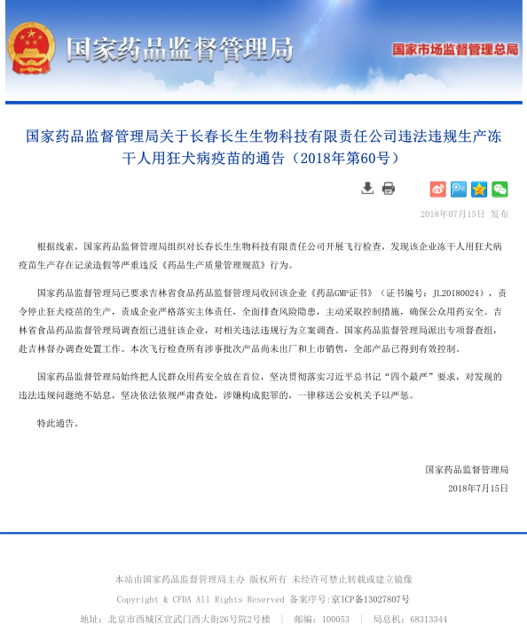

```
为什么美国人在世界上最早建立了代议民主制共和国？
为什么美国人可以骂总统，但不可以骂邻居？
为什么美国影视剧里的政治人物几乎都是“反面人物”？
为什么美国时常发生校园枪击案，但政府却不禁枪？
为什么美国最高法院说什么，连总统都要“照办”？
为什么美国州政府敢和“中央”对着干？
为什么负面报道是美国媒体的“主旋律”？
为什么美国的政权交替没有发生过革命和政变？
。。。

与世界上其他国家相比，
美国政治文化最大的特点就是，
美国人对权力侵犯权利有着深刻的忧虑和高度的警惕，
如果用一句话来概括美国政治文化的特点，
那就是“权力是靠不住的”。

————《权力是靠不住的：美国政治文化探析》
```

### 假疫苗

