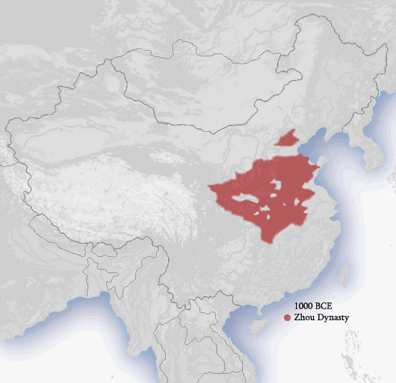
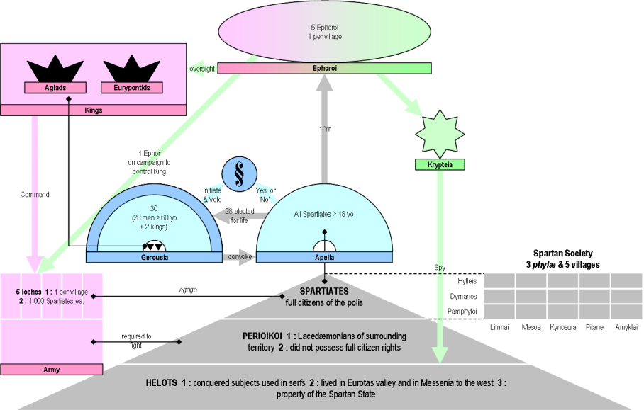
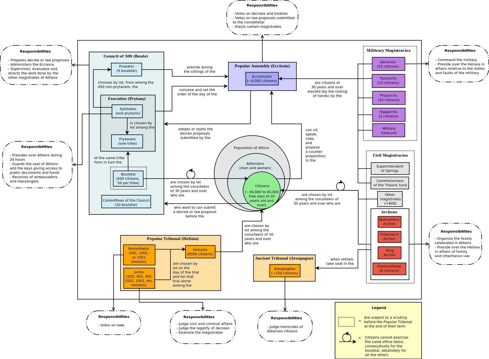

**请使用 GitHub Desktop 客户端，<https://desktop.github.com/>**

```
世界历史中有众多有趣的故事，
但我只选择了对我有帮助的部分，
并不表示那些没有被提到的国家和地区不应该被探讨，
如果全世界都在讨论当地遇到的问题，
我觉得是再好不过的事情。
```

1543年，天文学家及神父尼古丁·哥白尼，在临终前发表了《天体运行论》，主张抛弃以地球为宇宙中心的地心说，而建立以太阳为宇宙中心的日心说。在当时看来，日心说思想过于超前，以致于在其发表的半个世纪后，经由焦尔达诺·布鲁诺和伽利略·伽利莱的公开支持和宣传，最终引起了天主教会的极度恐慌，日心说被宣判为异端邪说，受到天主教会的极力打压。

在宗教神学的世界体系当中，主宰世间万物的神创造了人类以及人类赖以生存的世界，除了神之外，人类应当拥有不同寻常的地位，地球应当成为宇宙的中心。尼古丁·哥白尼从天文观测中，以无可辩驳的观测数据得出结论，如果以太阳为宇宙中心而非地球，那么太阳系中行星运动的轨迹将被极大简化，但是这么一来，地球和人类便失去了在宇宙中的中心地位。

以现代天文学的视角，日心说的观点仍然是片面的。我们知道，月球围绕着地球转，地球围绕着太阳转，太阳围绕着银河系的中心转，但在更大尺度范围上，我们并不清楚宇宙的中心在哪里，甚至不清楚宇宙是否有界。按照目前宇宙学中广为接受的宇宙大爆炸理论，存在一个密度和温度都无限大的奇点，宇宙正起始于该奇点的大爆炸，当前正处于膨胀阶段。在阿尔伯特·爱因斯坦的相对论框架中，宇宙是四维的时空，其中包括三维的空间以及一维的时间。现代天文观测表明，几乎所有遥远的天体都在均匀地远离地球而去。可以想象，宇宙在相当久远的过去，应当存在一个空间和时间上的汇聚。对宇宙微波背景辐射的细致测量表明，宇宙在局部上有涨落，在整体上是相似的，即均匀的各向异性。宇宙也许并不存在有全局意义的中心。


那么在宇宙中，地球到底处于什么地位？人类是孤单的观测者吗？

1973年，在纪念尼古丁·哥白尼诞辰500周年的宇宙理论观测数据会议上，理论天体物理学家布兰登·卡特首次提出人择原理。弱人择原理指出，虽然我们所处的位置并非必须是宇宙的中心，但在某种程度上却无可避免地处于特殊地位，这才能解释我们作为观测者所看到的一切。强人择原理指出，宇宙及其赖以存在的基本常数恰到好处，必然保证在合适的时候出现观测者。人择原理更多体现的是哲学陈述而非科学陈述，其尝试去调和我们所面对的现实：宇宙有不计其数的天体，地球是其中极其普通的一颗星球，我们有理由相信，宇宙中存在同样适宜生命演化的其它星球，但到目前为止，我们并未发现地外高等智慧生命。

步入高科技时代的人类，一直在孜孜不倦地搜寻地外文明。然而，已知最近的恒星系统半人马座α，距离我们大概有4.2光年之远。即便是世界上最快的光速，也需要在星际空间中传播4.2年之久。以现有的宇宙飞船的速度，则需要数万年或更长的时间。这对于人类区区百年的寿命来说，是遥不可及的构想。分别发射于1972年的先驱者10号和于1973年先驱者11号探测器，均各自携带着一块镀金铝板。分别发射于1977年的旅行者2号和旅行者1号探测器，均各自携带着一张铜质磁盘唱片。这是有史以来飞离人类最远的4艘人造探测器，正远离太阳系朝着浩瀚宇宙的深处飞去，倘若被地外高等智慧生命捕获，将提供关于人类以及地球信息。2016年，由亿万富翁尤里·米尔纳投资，理论天体物理学家斯蒂芬·威廉·霍金领衔的突破倡议计划，其突破摄星项目旨在发射数千枚芯片大小的光帆飞行器，以期能以五分之一的光速，经过约20年时间的旅行，抵达半人马座α，再经过约4年时间向地球传回信息。

陌生文明的相遇不见得就是好事，尤其是发展程度相差悬殊的陌生文明。在资本主义原始积累的地理大发现时期，来自欧洲的先进文明曾经给美洲的土著文明带来深重灾难，种族杀戮以及致命疾病导致原住人口大量锐减，殖民奴役以及文化征服导致本土文明没落消亡。从概率统计上来说，一个可以发现并造访地球的地外文明，必定远远比人类文明高明得多，这是因为由人类创造的文明，还远远不能将人类自身带离出太阳系。可以预见，当地外文明与人类文明相遇时的情景，可不会是这么简单的一句问好，“你好，外星人！”

地球大约成形于45.5亿年前，早期地球环境十分复杂。原始生命大概起源于原始海洋之中，非生命物质在极其漫长的时间里，依次经历了从无机小分子，到有机小分子，再到生物大分子，直到多分子体系。蛋白质及核酸的形成，使得原始细胞具备自我复制的遗传功能，这是生命起源当中最令人不可思议的一步跳跃。在前寒武纪时期，生命演化由简单到复杂，依次经历了从单细胞原核生物，到单细胞真核生物，再到多细胞真核生物。细胞的分化，以及不同细胞之间的相互依赖，使得多细胞生物成为具备执行多种功能的整体结构。大约在5.3亿年前的寒武纪早期，地质历史上经历了最壮观的一次生物大爆发，现代的所有动物门类，以及已灭绝的多个动物门类，几乎突然都同时出现在地层化石当中，地球由此进入显生宙。

在整个生命发展史上，总共出现了5次大规模的生物大灭绝，分别依次发生在4.4亿年前的奥陶纪末期/3.6亿年前的泥盆纪后期/2.5亿年前的二叠纪末期/2.05亿年前的三叠纪末期/6500万年前的白垩纪末期。我们并不十分清楚这五次生物大灭绝的具体原因，但可以推测，只有全球范围内的生态环境遭遇毁灭性破坏，才有可能导致绝大多数物种在较短的时期内集群灭绝。生物灭绝是自然发生的不可抗拒的规律性现象，旧物种的灭绝，将为新物种的产生及进化腾出生存空间，从而为生物的适应性辐射创造条件。距今最近的白垩纪末期生物大灭绝，使昔日占霸主地位的恐龙从地球上完全消失，标志着爬行类动物横行霸道的时代终结，哺乳类动物因此迅速辐射演化，人类最终登上食物链的顶端，成为统领生物圈的新主宰。

生物进化是不可逆的，已经灭绝的物种，便不会再次出现。今天地球上存在的物种，很可能不及地球上曾经出现过的全部物种的百分之一。那么，物种是如何进化的？那个无懈可击的终极完美物种有可能出现吗？

1859年，《物种起源》出版，查尔斯·罗伯特·达尔文在这本划时代的著作中，主要为生物进化论做出三大方面的贡献，分别是物种可变学说/自然选择学说/生命系统演化树猜想。在达尔文所处的时代，宗教神学占据社会主流意识形态，人们普遍相信，物种是按照上帝的旨意精心设计并创造的，而且一旦被创造出来，便永远不会再发生改变，它们天生就是完美无暇的。简单来说，生物进化论认为，物种并非是既定不变的，随机变异广泛存在于生物的生长繁殖过程当中，通过自然选择作用将保留其中有利于生存的性状，微小的可遗传变异逐代累积，最终导致新变种的产生。然而，在任意时期的地层化石中，都缺乏过渡类型的中间变种，在最底部的寒武纪地层中，大批动物类型化石在短时间内突然出现，这正是令达尔文感到迷惑不解之处。

地层化石记录表明，生物进化很可能处于快速进化与渐进演化的交替模式中。物种形成之初，其生存环境发生明显变化，物种以跳跃的方式快速产生。新物种形成之后，在相对稳定的生存环境条件下，便处于停滞或缓慢的演化状态，直到下一阶段物种形成。大多数物种在地质历史里存在数百万年，物种形成仅仅占物种整个存在周期的百分之一，因而看起来是短暂而迅速的。


在我们所生活的世界中，处处存在不确定性，一切感知都是概率。这些不确定性，按照数学家的术语来说，便是随机误差，按照生物学家的术语来说，便是随机变异。概率统计的中心极限定理指出，在普遍情况下，不管原来的单个随机变量遵循何种分布，大量独立随机变量和的分布近似服从正态分布。因此，正态分布是上帝创造的概率分布，几乎可以用来解释我们所看到的所有随机现象。我们的世界，是两极分化的世界，体现在正态分布上就是，多数处于中央单一的区间，少数处于互为相反的两端。对于一个稳定存在的生物种群，其表型近似满足正态分布，处于主流的常见表型占多数，分列两端的稀有表型占少数。

自然选择是综合各方面因素的复杂过程，大体上可以划分为3种主要模式。其一是定向选择模式，趋向于使表型的分布朝单向偏移，逐渐淘汰不利表型。定向选择的结果，是表型发生定向演化，表型分布范围缩小。定向选择的条件，通常是生存环境出现相对稳定的单向变化，比如家养条件下的人工选择。其二是分裂选择模式，趋向于使表型的分布朝多向偏移，逐渐淘汰主流表型。分裂选择的结果，是表型发生多向演化，形成多种对立表型。分裂选择的条件，通常是生存环境出现大幅波动的多方向变化，比如物种的适应性辐射演化。其三是稳定选择模式，趋向于使表型的分布朝中央靠拢，逐渐淘汰两端稀有表型。稳定选择的结果，是表型发生集结偏移，表型逐渐稳定纯化。稳定选择的条件，通常是生存环境非常稳定不出现明显变化，比如常见情形下的自然选择。

性选择是自然选择的一种特殊形式 ，对于通过有性生殖繁衍后代的绝大多数高等动物来说尤为重要，在许多情况下甚至超过自然选择的作用。在通常意义下，自然选择的主体是生存环境，是无意识的，适者生存，不适者被淘汰。性选择的主体是生物体自身，或多或少是有意识的，其取决但不限于生物体的争斗/地位/意愿/鉴赏等等因素。

物种形成的标志，是物种内出现遗传隔离及性状差异，对于有性生殖的物种来说，还意味着出现生殖隔离。通常情形下，地理隔离会造成物种内的遗传物质交流中断，使得物种内的不同种群按各自方向演化，必然将加快物种的形成。纵观整个生命发展史，其实就是一棵生命系统演化树的生长史，生物进化从具有低级生命形式的树根，逐步进化到具有高级生命形式的枝杈。自然选择在造就精致复杂器官产生的同时，也使得生物体时刻在进行着对生存环境的特化性适应，更高等生物反而不如更低等生物的适应能力强。作为具有强大思维能力的人类，虽然我们广布地球除南极洲外的各大洲，但只适合在宜居的环境条件下生存，而远不如在各种极端环境条件下生活的低等细菌。适应与完美，正是不可调和的分歧所在。

全球的现代人类在生物分类学上被统一划分为，动物界>脊索门>哺乳纲>灵长目>人科>人属>智人种，而且智人种是人科中唯一的现存物种，由相当于亚种的不同种族组成。人类的进化历程可能依次经历了，始祖地猿>南方古猿>能人>直立人>智人。如果将地球45.5亿年的地质历史浓缩成24小时，以人属中最早的成员，出现在约200百万年前的能人算起，那么原始人类大约在最后的2分钟内才出现。关于人类的起源问题，目前倾向于单地起源假说，分子生物学的证据表明，来自非洲东部的智人，多次从非洲迁徙到全球各地，定居而成现代人类。另外，古人类学的证据支持多地起源假说，认为人类的祖先在离开非洲之后，由分散在世界各地的直立人平行进化成现代人类。总而言之，这两种人类起源假说均承认，现代人类的共同祖先起源于非洲大陆。

如今，人类的足迹早已遍布地球的各个角落，从地球之渊的马里亚纳海沟，到地球之巅的珠穆朗玛峰，再到高空大气层，直至延伸出外太空。人类的活动正持续而显著地影响着地球的各个方面，从水圈，到岩石圈，再到大气圈，尤其是对地表形态的改造，几乎使得地球面目全非。全球人口膨胀对自然资源的过度开发利用，对生态环境的污染与破坏，以及对外来物种的引进，导致局部生态系统失去平衡，造成生物多样性大大下降，以致于物种灭绝速度成倍加快。当然，失去平衡的生态系统，最终会再次进入平衡。人类是最大的入侵物种，即便是按严格意义上来说。

种族和民族是两个不同的概念，在通常意义上，种族的分类大于民族的分类。种族具有生物学意义，指体质形态上具有相似遗传特征的人群，比如肤色/眼睛/头发/身形等等；民族具有社会学意义，指意识形态上具有相似文化特征的人群，比如风俗/信仰/语言/地域等等。全球的现代人类按肤色可大致划分成4个种族，即黑色人种/棕色人种/黄色人种/白色人种。虽然不同种族之间存在极大的差异，而且各个种族内部也存在明显的差异，但实际上不同种族存在着基因交流，可以互相通婚且能正常生育后代，并不存在遗传上的生殖隔离。种族的形成受地理/文化/迁徙/融合等各种因素的影响，是自然而然发生的过程，即使不同种族之间存在智力以及体力上的差异，也不能说明存在优劣贵贱之分，而应当平等对待。种族歧视，很多时候是历史遗留下来的政治/文化问题。

自人类的祖先猿类，从密树森林进入到稀树草原生活以后，便面临着被大型猛兽猎杀的危险。原始人类逐步进化，体质形态和行为特征均发生了巨大变化。双腿直立行走与奔跑，适应地栖生活；双手解放，大拇指与其它手指相对，手掌能完成灵巧动作；胸腔以及肺部扩容，声带等发声器官发育，为语言的产生提供结构基础；脑容量成倍增大，大脑皮层表面积增加，智力得到空前发展；食性由素食性转变为杂食性，加上工具和火的利用，可获取肉类食物的高能量及蛋白质，形成间断进食的方式；间冰期频繁交替更迭，以及使用兽皮作为衣服御寒，人类的体毛发生退化，皮肤光洁而裸露。原始人类为抵御危险共同哺育后代，为狩猎大型野兽而分工合作，形成高度社会化的氏族社会。早期氏族社会以母系血缘关系为纽带，后期过渡到以父系血缘关系为纽带。氏族社会的生产水平低下，一起劳动，共同分配，这是原始公有制社会的表现。

在未开化的野蛮社会阶段，人类可能经历过至亲之间发生性关系的乱伦交配方式，进入开化的前氏族社会阶段以后，人类过渡到最早的群体婚姻配偶制，一群男性和一群女性互为夫妻。几乎所有人类文明均有反对乱伦的禁忌，人类对乱伦禁忌近乎有一种出于本能的厌恶，而且群体婚姻也早已不见踪影。现代人类社会中主流的婚姻配偶制有两种，在世界上大部分地区，尤其是经济发展水平较高的发达地区，实行一夫一妻制，婚外情被认为是有悖伦理的非法行为。在传统的自产自足的欠发达地区，以及信仰伊斯兰教的地区，实行一夫多妻制，但实际上在这些地区，一夫一妻家庭仍占多数，一夫多妻反而成为男性的经济能力和社会地位的象征。一妻多夫制极为罕见，仅分布在极少数贫困落后的地区，也有性别比例失衡的因素。在一些思想较开放的地区，同性婚姻是被社会接受及被法律允许的，而在其它地区，人们无法理解同性之间的情爱行为，而因此受到歧视和不公正对待，同样的还有性倾向问题。从人类文明发展的进程来看，一夫一妻制将是未来主流的婚姻配偶制。中国古代官吏普遍是一夫一妻多妾，到如今社会风气呈现出的一夫一妻多情，或多或少是文明的进步。

氏族社会后期，财富私有独占，贫富分化加剧，阶级逐渐产生，人类便进入文明时代。现代英语中的civilazation（文明）一词来源于16世纪的法语civilisé，可溯源至拉丁语civilis，与civis（公民）和civitas（城市）有关。文明是与野蛮相对立的概念，最初用来形容人们开化的/有教养的行为方式，其后逐渐引申为发达社会和先进文化的人类社会发展状态及其趋势，涵括政治/经济/文化/地理/物质/精神等方面。散播于世界各地的文明，其起源开端与演变历程不尽相同，既没有固定的路线可循，也没有统一的划分模式，但无一例外都涉及到，城邦-国家/阶级-官吏/文字-语言/货币-经济/宗教-法律/交流-战争/文化-教育等等方面。

|                |          **人类文明的元世纪**          |                  |
| -------------: | :------------------------------------: | :--------------- |
| 约公元前4000年 | 亚洲西南部的底格里斯河与幼发拉底河流域 | 美索不达米亚文明 |
| 约公元前3100年 |         非洲东北部的尼罗河流域         | 尼罗河文明       |
| 约公元前2500年 |       亚洲南部的印度河与恒河流域       | 印度河文明       |
| 约公元前2100年 |      亚洲东部的黄河流域与长江流域      | 华夏文明         |
| 约公元前2000年 |          地中海东北部的爱琴海          | 爱琴海文明       |
| 约公元前1500年 |           美洲中部的热带森林           | 中美洲文明       |

并非所有最早的人类文明都是伴随着河流及平原而产生的，但无一例外都是逐水而居，水是生命之源。美索不达米亚文明发源较早，影响了地缘较近的尼罗河文明和爱琴海文明的形成，甚至也影响了地缘较远的印度河文明和黄河-长江文明，然而中美洲文明几乎是完全孤立地出现。

美索不达米亚在古希腊语（Μεσοποταμία）中意为两条河流之间的[土地]，这两条河流特指底格里斯河与幼发拉底河。美索不达米亚地区基本由大海/山峦/沙漠环绕而成，气候干旱少雨，其下游的冲积平原土壤肥沃。大约是公元前6500年到公元前3500年，人们在此处定居，由游牧生活转为耕种农业，逐渐形成人口聚集的村落。庄稼栽培使得粮食谷物的产量增加，家畜驯养保证肉类蛋白质的来源稳定，此时相对于史前的采集狩猎时代有农产品剩余。制陶与纺织等手工业兴起，社会阶层分化，远距离产品贸易出现，人类的寿命显著延长，人口快速增长，形成城市的雏形。美索不达米亚的早期城市是政治/经济/文化/军事的中心，宗教信仰是所谓的自然崇拜与多神信仰，但主神庙都建在不是城市中心的高地上，祭司也不住在神庙内，因此神的世界与人的世界是分离的。当城市中的大部分土地，被控制在以国王和贵族为主的上层阶级手中时，城市就发展成为城邦。

美索不达米亚的城邦相互混战，最早由古巴比伦王国的第六位国王汉谟拉比完成统一大业，建立起一个从地中海到波斯湾的大帝国。汉谟拉比放弃对被征服地区的强取豪夺，而代之以破坏性较低的赋税制度，同时编纂出美索不达米亚地区涉及范围最广的法典，发展成一套更有效率的政府管理模式。汉谟拉比法典并不是最早的法典，其中的许多条例实际上是以前已颁布法律的摘抄及汇编，内容涉及租佃关系/盗窃处理/债务奴隶/婚姻家庭/诉讼审判等等，其基本原则是同态复仇，即以其人之道还治其人之身，罪犯所受到的惩罚理应与被害人所受到的伤害一样，并且从不考虑这些伤害是否纯属意外。不过与现代法律所强调的人人平等原则不同，汉谟拉比法典顾及社会阶层，比如妇女在家庭中处于从属地位，奴隶是奴隶主的毫无权利可言的财产。视具体案情而定，法官是临时任命的，没有职业法官，也没有律师，而且法官并不会始终遵循汉谟拉比法典，他们通常依靠自己的判断进行裁决。值得注意的是，汉谟拉比颁布法典是为了宣扬正义/制止争斗/维护统治，因而并没有建立监狱和施行劳教。现代西方各国的法律都可以找到汉谟拉比法典的影子，比如无罪推断原则/公民陪审团制度/案件审理过程记录等等。

美索不达米亚的苏美尔人，使用削尖的芦苇杆，在湿泥板上压印，留下楔形文字。这是最早的象形文字，直到后来由于单音节的希腊字母文字出现，逐渐衰落而被取缔。文字的出现极大地促进了知识的积累与发展，美索不达米亚文明在数学和天文学上均有开创性的成就，他们同时使用10进制和60进制，将一天划分为两个12小时，将一小时划分为60分钟，将一分钟划分为60秒。除简单的加减乘除运算外，还能解低阶代数方程。10进制被大多数早期文明采用，而且被现代文明继续沿用，这绝非偶然。人类自有史以来，就使用解放的双手劳动，每只手有5个手指，双手共10个手指，这就是10进制的由来。若再加上行走的双脚，每只脚有5个脚趾，双手和双脚共20个手指，这就是20进制的由来，20进制曾经被中美洲的玛雅文明所采用。60是被1/2/3/4/5同时整除的最小公倍数，其因数还包括10/12/20/60，因此60是个很特殊的数字，十分适合用于数学中的角度测量及运算，现代三角学就采用60进制。现代计算机系统底层采用2进制进行运算，是为了消除歧义，逻辑电路只被划分为高电平与低电平两种信号，分别代表逻辑上的真与假，能够最大程度地抵抗信号干扰。

大约在公元前3000年，印度河流域出现了印度次大陆最早的发达城市，此即哈拉巴文明，然而仅仅持续到大约公元前1900年，哈拉巴文明就开始步入衰亡。一种可能的原因是生态系统遭到巨大破坏，哈拉巴人为了开垦土地和获取薪柴，滥砍乱伐森林树木，造成地表水土严重流失而变成荒漠，即便到今天，也只有借助人工灌溉才能在那里进行农业生产。大约在公元前1500年，来自中亚草原的说印欧语的雅利安人，从印度次大陆西北部大规模进入印度，并与本土的居民相互通婚融合，逐渐建立起以职业划分的界限分明的种姓制度。梵文 आर्य （雅利安），有光荣的/高尚的的意思，雅利安人使用梵文 वर्ण （瓦尔那）表示主要的种姓等级，瓦尔那即颜色。大约在公元前1000年以后，雅利安人逐渐形成4个主要的瓦尔那，并被赋予象征意义：婆罗门，即祭司/僧侣，为第一等级，象征嘴；刹帝利，即统治者/贵族/武士，为第二等级，象征双臂；吠舍，即商人/工匠/农民/牧人，为第三等级，象征双腿；首陀罗，即无人身自由的奴仆，为第四等级，象征双脚。后来在4个瓦尔那之外，又出现一类毫无社会地位可言的群体，不可接触者，即贱民，从事屠宰牲畜/搬运尸体等工作。随着时间推移以及社会职业的细化，在相当于种姓的瓦尔那的基础上，又衍生出相当于亚种姓的阇提。同一个地区从事相同或类似工作的人归属于同一个亚种姓/种姓，他们的后代继承祖辈的职业和身份，并且严格世袭。不同亚种姓/种姓之间限互相交往，更禁止通婚，否则将沦落到更低的等级中去。社会地位的提升非常困难，通常需要整个亚种姓/种姓集体改善他们的生存状况，而不是单靠个人的努力。一旦僭越这些约定俗成的礼节，就会被驱逐出所在的群体，并被施以严酷的惩罚，有时甚至让人难以生存，因为僭越者会遭到全体社会成员的排斥。

种姓制度有许多弊端，其强加于种姓/亚种姓的社会歧视和不公平对待，严重约束着个人的自由，同时加剧妇女的依附地位。正因为如此，促生了宣扬众生平等的耆那教和佛教的创立，尤其是佛教，日后演变成世界性的普世宗教。佛教在印度繁盛一时之后走向没落，取而代之的是印度教，如今信仰印度教的人数超过信仰佛教的人数，但受限于印度本土。种姓制度被印度教采纳而有意使之纯化，各种姓/亚种姓的责任与义务被严格地确定下来，由此维持着基本教理的稳定。但随着信仰伊斯兰教的外来征服者统治印度，种姓制度在一定程度上被瓦解，大量低阶种姓/亚种姓的人群为逃避个人身份而改信伊斯兰教。在印度国父莫罕达斯·卡拉姆昌德·甘地的时代，印度地区无可避免地分裂成，以信仰伊斯兰教为主的巴基斯坦和以信仰印度教为主的印度，甘地也为此被狂热的印度教信仰者刺杀身亡。印度独立之后，种姓制度随即在法律上被废除，然而直到今天，却仍然深刻地影响着印度人社会生活的方方面面，可谓根深蒂固。不过，从对立的视角来看，种姓制度下清晰的社会分工与合作，使得社会秩序安然有序。

|                |   **中国历史朝代**    |             |
| -------------: | :-------------------: | :---------- |
|   **主流朝代** |       **公元**        | **统治者**  |
|           夏朝 | 约前2070年~约前1600年 | 华夏族      |
|           商朝 | 约前1600年~约前1046年 | 华夏族      |
|           周朝 |  约前1046年~前221年   | 华夏族      |
|           秦朝 |    前221年~前207年    | 华夏族      |
|           汉朝 |     前202年~220年     | 汉族        |
|           三国 |      220年~280年      | 汉族        |
|           晋朝 |      265年~420年      | 汉族        |
|         南北朝 |      420年~589年      | 汉族/鲜卑族 |
|           隋朝 |      581年~618年      | 汉族        |
|           唐朝 |      618年~907年      | 汉族        |
|       五代十国 |      907年~979年      | 汉族        |
|           宋朝 |     960年~1276年      | 汉族        |
|           元朝 |     1271年~1368年     | 蒙古族      |
|           明朝 |     1368年~1644年     | 汉族        |
|           清朝 |     1636年~1911年     | 满族        |
|       中华民国 |     1912年~????年     | 汉族        |
| 中华人民共和国 |     1949年~????年     | 汉族        |



传说中国的历史起始于大约公元前2100年的夏朝，夏朝的建立者禹，为治理黄河泛滥的洪水，十三年都没有回过家。贤君禹死后，他的儿子启夺取王位，改推举禅让制为世袭君主制，中国延续不断的华夏文明由此开始。商代晚期，王室占卜记事而在龟甲兽骨上契刻文字，这是中国最早的象形文字甲骨文。作为世界上最古老的三大文字系统之一，汉字是唯一沿用至今的文字，汉字的形体演变经历了甲骨文/金文（大篆）/小篆/隶书/草书/楷书/行书等阶段，对汉字文化圈内的周边国家如日本/朝鲜/韩国/越南等均有影响。新中国成立以后，为方便人们在日常生活中使用，对传统汉字做简化和规范处理，使得汉字的形体发生巨大改变，这在某种程度上造成汉字的原本含义流失。现行汉字包括香港/澳门/台湾的繁体汉字，和中国大陆/新加坡/马来西亚的简体汉字。

周朝建立以后，分封制度和宗法制度已臻于完善。周天子将全国的疆土按同姓宗族大量分封给王室宗亲，形成大大小小的诸侯国。依此类推，诸侯王将疆土分封给卿大夫，卿大夫将疆土分封给士，士直接统治平民和奴隶，各贵族阶级的身份地位按血缘关系由嫡长子世袭继承。周朝以及各诸侯国内部均有独立的政治结构，周天子为天下之大宗，各诸侯王为地方小宗。周天子在名义上为周朝的国王，并不具有真正的统治权，实际上与各诸侯王是平等关系，各诸侯王要服从周天子的命令，有镇守封土/随从作战/交纳供税/定期朝觐等义务。春秋战国时代，周王室的实力逐渐衰微，小诸侯国相互混战兼并而形成大诸侯国，足以达到与周朝分庭抗礼的程度。正是这一时期混乱的政治局面，迫使先哲们不断反思社会的本质，以及人们在社会生活中所应承担的角色，而形成众多思想流派，统称为诸子百家。在这其中，尤其以儒家/道家/法家的思想为代表，对中国往后的政治和文化传统产生深远影响。儒家反对专制暴政，主张仁政教化，礼尚往来，推己及人。道家宣称道是万物之源，主张顺其自然，无为而治，以柔克刚。法家认为人之初性本恶，主张以法治国，重农抑商，严明纪律。在战国七雄之一的秦国，国君秦孝公采用法家思想，接受法家商鞅的主张，施行以加强中央集权为核心的商鞅变法。商鞅变法将整个社会纳入十分严密的军事化管控之中，其中户籍制度实行什伍连坐法，规定按每五户为一伍/每十户为一什，不准擅自迁居，邻居之间互相监督和揭发，一人犯法十户连同坐罪，同时禁止父子兄弟同室而居，若男性有两人以上必须独立编户。经过商鞅变法，秦国在政治/经济/军事上均取得显著发展，国力日益强大而迅速崛起。但是商鞅的权力过大且行事无情，因而不得人心，秦孝公死后，他被处以车裂极刑，满门抄斩。

秦国灭亡六国之后，建立起中国历史上第一个大一统中央集权君主制国家秦朝。秦王嬴政自认为【功过三皇，德兼五帝】，自号始皇帝，史称秦始皇，并改用世数尊号，宣布子孙称二世/三世，以至万世，代代承袭。皇帝集行政权/军事权/司法权于一身，为天下之独尊。秦朝彻底废除以血缘关系为纽带的分封制，改用官员随时任免的郡县制，全国划分为郡，郡下设县。皇帝之下，丞相掌管政事，太尉掌管军事，御史大夫掌管监察，统称为三公，他们彼此互不统属，都直接对皇帝负责。三公之下设九卿掌管各项宫廷事务，包括典客掌管蛮族事务/卫尉掌管宫门屯卫/太仆掌管御用舆马/奉常掌管宗庙礼仪/宗正掌管宗室事务/少府掌管税赋供给/廷尉掌管刑罚牢狱/郎中令掌管宫殿警卫/治粟内史掌管财政收支。同理，郡县的长官都由皇帝直接任免，郡守掌管政事，郡尉掌管军事，郡监掌管监察。此后中国的历朝历代基本上都沿用秦朝开创的这种制度，甚至从某种程度上来说，今日之中国便是昔日之秦朝。

秦始皇制定的严酷法律和刑罚，引起了士人/学者的不满，儒家/道家和其它思想流派纷纷指责秦始皇的法家思想。为加强思想统治，秦始皇下令焚烧除秦史之外的其他六国的史书和民间收藏的诸子百家著作，百姓只可保留占卜/医药/农业之类的实用书籍，次年又下令坑埋那些提出批评建议的儒生，史称焚书坑儒。为巩固皇权统一，秦始皇以商鞅时制定的度量衡标准器作为全国的度量标准，以秦国的圆形方孔铜钱作为全国的通行货币，以小篆作为全国的规范文字，不过全国各地区继续使用当地的口语方言，直到今天仍然如此。秦始皇大规模征发徭役和兵役，用于修建宫殿/长城/陵墓以及扩张疆域等等，大量劳动力脱离农业生产，社会经济遭到严重破坏。不仅如此，秦朝百姓的赋税负担很重，须将收获的三分之二上交给官府。虽然秦朝在外表上看起来十分强盛，但由于皇权过于集中/横征暴敛/严刑酷政，让天下百姓饱受苦难而纷纷想要叛变。秦始皇在一次全国巡游中驾崩于路上，秦二世即位不到三年，秦朝便在全国各地风起云涌的农民起义中飘摇不定，其中尤其以陈胜和吴广在大泽乡的揭竿而起为世人所津津乐道，这是中国历史上有记录的第一次大规模农民起义，他们的首倡精神激励了后世人民百姓对残暴统治的反抗。秦朝末年，日后成为汉朝开国皇帝的刘邦，率军攻入秦朝京城咸阳，秦朝宣告灭亡。刘邦为赢得民心而废除严刑峻法，与父老乡亲约法三章，即杀人者是死罪，伤人者和盗窃者应抵罪。此后，楚王项羽和汉王刘邦为争夺天下而进行长达四年的楚汉战争，楚汉两军的实力本来相差悬殊。虽然项羽是楚国名将的后代，刘邦是沛县的街头混混，但是项羽刚愎自用，刘邦知人善用，最终刘邦率诸侯联军与项羽会战于垓下，楚军全军覆没，项羽无颜见江东父老，在四面楚歌中自刎于乌江边上。

汉朝建立后，经过几代皇帝的励精图治，到汉武帝时期，国家出现繁荣昌盛的景象。原先受秦朝压制的诸子百家再次活跃起来，形成指点江山激扬文字的局面，非常不利于中央集权。儒生董仲舒从伦（人与人的关系）理（做事的守则）出发，提出以三纲五常来教化人民百姓，三纲指君为臣纲/父为子纲/夫为妻纲，五常指仁/义/礼/智/信。汉武帝采纳董仲舒的建议，罢黜百家，独尊儒术。儒家思想由此成为中国专制王朝的正统思想，自隋朝隋文帝创立科举制选拔官员以后，熟读儒家经典更成为仕途从政的必经之路。历史上的儒家思想逐渐演变成为一种信仰，即相当于宗教的儒教，其地位在本土的道教和外来的佛教之上。儒家思想在规范人们的道德伦理和行为准则的同时，俨然成为维护专制统治的思想工具，以致于在辛亥革命结束清朝君主专制后，窃取辛亥革命胜利果实的袁世凯，仍不满足于就任中华民国大总统，为配合复辟帝制，而加紧进行尊孔复古活动。袁世凯只当了83天皇帝，便在不绝于耳的讨伐声中，因尿毒症不治身亡。随后进行的新文化运动（五四文化运动）提倡科学与民主，反对愚昧与专制，对尊孔复古逆流进行了猛烈的批判。在毛泽东的时代，历经十年的无产阶级文化大革命，以破除旧思想/旧文化/旧风俗/旧习惯为目标，使得大量历史文物和名胜古迹遭到毁灭性破坏，任何与孔子有关的东西都被浩劫一空。毛泽东因重病逝世后，文化大革命随即结束，毛爷爷现在正静静地躺在玻璃橱窗里供全国人民瞻仰。如今分布在多个国家与地区的非营利性教育机构孔子学院，其宗旨是推广汉语和传播中国文化。

中国自始自终没有形成政教合一的神权政治国家。古中国早期的神话传说解释了世界/人类/农业/技艺等等的起源，但没有形成系统性的宗教传统。古中国也没有像美索不达米亚/古埃及/古印度那样，供养着一个庞大的/充当人神媒介的/凌驾于王权之上的祭司阶层，而是在王宫中有少数祭司履行宗教仪式，在普通家庭由家长主持祭奠仪式。华夏文明，尽管较美索不达米亚文明/尼罗河文明/印度河文明晚得多，但却是穿越历史延续至今的古老文明之一，尽管在历史上曾经伴随着外族入侵以及政权巨变，但依旧保持着高度的汉族主体性。汉族的前身是华夏族，华夏族是上古时期炎帝部落和黄帝部落的后裔，因此也以炎黄子孙代指中国人。秦朝的大统一使得华夏族融合其它民族而成为主体民族，汉族的称谓则来源于汉朝，此后中国经历数次大分裂和大统一，许多边缘民族被汉族同化而成为汉族的一部分。目前汉族是世界上最大的民族，约占世界人口的18%，约占中国人口的92%，约占台湾人口的98%。因为过于普遍，汉族人并没有什么鲜明的特点。

| **人类文明的古世纪** |    **公元**     |
| :------------------: | :-------------: |
| [古中国]春秋战国时代 | 前770年~前221年 |
|      古希腊时代      | 前800年~前146年 |
|      古罗马时代      |  前753年~476年  |

在历经克里特岛上的米诺斯文明和伯罗奔尼撒半岛上的迈锡尼文明之后，爱琴海地区的巴尔干半岛开始步入希腊英雄时代。在古希腊荷马史诗的描述中，这个时代的英雄可歌可泣，众神的干预让故事情节变得跌宕起伏。在古希腊神话中，世界起源于卡俄斯（英文：Chaos，中文：混沌），卡俄斯没有形体，更没有性别，是未被人格化的最古老的神。后代所有的神都由卡俄斯派生出来，他们基本上来源于各种各样的自然现象和生活起居，众神之间的关系错综复杂，神和人的世界相互重叠，共同演绎着古怪离奇的故事传说。现代天文学将全星空划分成88个区域，分别以88个星座命名，其中绝大部分就来源于古希腊以及罗马神话中的人物和动物。

相传很久很久以前，巴尔干半岛内的最高峰奥林匹斯山上住着十二位主神。作为众神之王的宙斯是天空之神，代表着秩序和正义等等。主神宙斯的女儿雅典娜是智慧之神，代表着和平和技艺等等。在那时，提坦神族的普罗米修斯用泥巴捏造出人类的形体，智慧女神雅典娜为人类灌注入灵魂，人类便有了生命的迹象。普罗米修斯在将生存技能教授给人类的同时，也体会到人类生活的艰难，于是特意从奥林匹斯山偷盗出维持生活的火种，为此触怒宙斯。宙斯为了报复普罗米修斯的欺骗行为和惩罚人类的愚蠢本性，将一个神秘盒子作为礼物让潘多拉带到人间。潘多拉禁不住好奇心打开盒子后，几乎所有人间的邪恶，比如灾难/疾病/贪婪/虚荣/妒嫉/奸淫等等，一下子便从盒子里逃逸到人间。潘多拉慌忙盖上盒子，唯独希望被永远封锁在盒子底部。从此以后，世界不再平静，人类饱受折磨。

| **政治体制的古典分类** |        **特征**        |
| :--------------------: | :--------------------: |
|        *君主制*        | 单个人统治，为全体服务 |
|        *僭主制*        | 单个人统治，为部分服务 |
|        *贵族制*        | 少数人统治，为全体服务 |
|        *寡头制*        | 少数人统治，为部分服务 |
|        *民主制*        | 多数人统治，为全体服务 |
|        *平民制*        | 多数人统治，为部分服务 |

位于爱琴海西部的巴尔干半岛，海岸线蜿蜒而曲折，山峦连绵而重叠，没有大河流经而过，也没有开阔的平原。从公元前8世纪开始，古希腊人先后在以巴尔干半岛为主的爱琴海地区建立起数以百计的城邦。各城邦独立自治，始终保持着小国寡民的状态，任何一个城邦都不具有征服其它城邦的绝对实力，因而公民有较多机会直接参与城邦的公共事务。古希腊最大的城邦斯巴达，其面积仅有约8400平方公里，人口总计约40万。斯巴达的全体居民可划分成3个主要阶级，分别是斯巴达人/庇里阿西人/希洛人。斯巴达人是征服者和统治者，他们的成年男子享有完全的政治权利；庇里阿西人没有政治权利，不能与斯巴达人通婚，但享有人身自由；希洛人是奴隶，没有任何政治权利和人身自由，时刻受到迫害和虐待。作为奴隶的希洛人，其人口数量远远超过作为统治者的斯巴达人，比例维持在10倍以上。为维护统治以及提防希洛人的暴动起义，斯巴达人全民皆兵，形成一套军事化的集体生活模式。斯巴达男子从7岁开始军营生活，从20岁开始服役，直到60岁才能退役。斯巴达女子也要接受严格的体能训练，以确保能生育出健壮的孩子，但她们在结婚以后直到丈夫30岁之前，并不能和丈夫生活在一起。斯巴达婴儿从一出生就要接受严格的检查，体质弱小者将被遗弃而任其自生自灭。在这种军事化管理模式下，斯巴达人的孩子实际上是城邦的公有财产，而且军营中的同性恋现象十分普遍。但相对于古希腊其它城邦限制妇女必须呆在家中，斯巴达妇女可自由活动，斯巴达是古希腊唯一严肃对待妇女教育的城邦。斯巴达人坚持严苛的生活方式，他们不屑于奢侈享受或者积累大量私有财产，甚至没有用贵金属而只是将铁棒当流通货币，正是如此，英文spartan（斯巴达人的）一度成为克己节约的代名词。



斯巴达的政治是寡头政治。斯巴达的主要政治机构包括5位监察官/2位国王/元老院/公民大会。2位国王分别来自两个家族，其中一位国王指挥军队，另一位国王管理城邦，他们平时充当祭司。元老院由2位国王（不限年龄）和28位贵族（60岁以上）组成，终身任职，负责行政民事工作/作为审判法院/为公民大会准备议案等等。公民大会由全体成年斯巴达男子（18岁以上）组成，负责选举监察官/选举元老院/表决元老院的议案等等。在这些政治机构之上是5位监察官，任期一年，负责监督国王/制定外交政策/维持公共秩序/管理教育体制/决定婴儿命运等等。监督官的权力很大，甚至可以罢免国王，但若滥用权力会受到报复。



与斯巴达以军事手段建立起秩序不同，巴尔干半岛的第二大城邦雅典，是现代民主政治的发源地。在历经梭伦改革>克里斯提尼改革>伯里克利改革之后，雅典民主政治达到顶峰。雅典的主要政治机构包括十将军/五百人会议/公民大会/行政长官/民众法庭。雅典公民仅由雅典本邦的全体成年男子（20岁以上）组成，不包括妇女/儿童/外邦人/奴隶，拥有完全的政治权利。在通常情况下将有约6000名公民参加公民大会，负责表决法令和条约/表决五百人会议的法律提案/选举特定的地方法官。雅典地区被划分成10个行政区，各个行政区选取50名公民（30岁以上）组成委员会，不得连任，10个委员会组成五百人会议，负责准备法令或法律提案/管理公民大会/监督和指导地方法官。10个委员会各选一位将军组成十将军，可以连任，负责主持公民大会/召集公民大会。十将军轮值当日执行官，其地位相当于国家元首，负责守卫雅典的边关/保管公共文件和资金的钥匙/接待外邦信使。军事地方法官由公民大会举手投票选出，负责指挥军队/主持军队事务。雅典公民（30岁以上）可以自愿充当陪审团和执政官，有政府津贴补助，每个陪审团组成一个民众法庭，负责审判民事和刑事案件/审查地方法官，陪审团决定案件的所有问题，其判决不得上诉。执政官不得连任，负责组织节日宴会/主持家庭和财产事务，他们退休后负责审判凶杀案件。此外，为了提防别有野心的政治家/危害公共安全的分子，必要时在公民大会中将采取匿名陶片放逐制，公民将不受欢迎者镌刻在碎陶片上进行投票，得票数最多的人士即为当年被放逐者的人选，放逐期限为10年。除十将军是由选举产生的以外，其它官职均通过抽签产生，所有官职限定任期一年。

英文democracy（民主）来源于古希腊语δημοκρατία，由demos（δῆμος，公民）和kratos（κράτος，状态）组合而成，其本意就是由公民统治。在拥有大量奴隶从事生产劳动的基础之上建立起的雅典民主制度，使得雅典公民可以广泛而直接地参与到公共政治生活中去。这种直接民主制度得以成立，还在于古希腊各个城邦长期处于小国寡民的状态中。在这种情形下，雅典公民形成以城邦为中心的民主观念，全体公民根据个体对城邦的贡献与危害来决定对其的看法与处置，而不是根据明文法令的事先规定，因此这是一种后验的民主，其执行效率将随着公民人数/议案数目/议案复杂性等等的增多而显著降低。雅典公民之间不再区分身份地位/财产收入/职业技能/智慧学识等等，在政治上人人平等，凡事均按照少数服从多数的原则做决定，使得欺骗一群人比欺骗一个人要容易得多，极易造成外行管理城邦事务和公民过度参与政治。以现代社会的角度来看，雅典的直接民主制度是不切实际的，现代世界各国普遍采用代议民主制度，全体社会成员选举出民意代表来参与政府决策，仅有极少数几个国家正式承认非民主。

苏格拉底并不是古希腊的第一位哲学家，他出生时正值伯里克利统治的雅典黄金时期。城邦德尔菲的神谕曾经宣称，苏格拉底是雅典最具智慧的人，而他自认为是没有智慧但爱智慧的人，即哲学家。苏格拉底时常与人辩论，却对智者派的诡辩技巧嗤之以鼻，尤其厌恶智者们用知识来赚钱的做法，认为这样会玷污智慧，他毕生对智慧的追求就如德尔菲的铭文：认识你自己。伯罗奔尼撒战争爆发后，雅典海军在阿吉纽西战役中赢得胜利但损失惨重，许多失事船只未能得到及时救援，多名海军将领被追究责任，公民大会判处他们死刑。担任此次轮值执行官的苏格拉底力排众议，坚持按照正当审判流程，反对处死海军将领们，因此得罪众多雅典公民。雅典最后在伯罗奔尼撒战争中战败，被迫接受斯巴达式的寡头政治，苏格拉底的一名亲戚兼学生是三十僭主的核心人物。但不久之后，三十僭主的暴政统治被推翻，雅典恢复民主制，然而苏格拉底却被视为民主派的政敌，被三位雅典公民告上法庭，有两项指控罪名成立，一是亵渎神明，二是腐化青年。雅典公民并非想置苏格拉底于死地，他最终被宣判死刑，与审判过程中微妙的互动有关系。苏格拉底本可以逃脱死刑，但他坚称自己无罪，还认为越狱是对法律秩序的践踏，最终从容赴死。

暂且不论苏格拉底的罪名是否成立，普通雅典公民能够提出这样的指控，以现代民主政治的角度来看是不可思议的。雅典民主是没有任何权威的，既没有政治伦理的权威，也没有智慧学识的权威，更没有身份财富的权威，唯一的权威就是公民自身。在古希腊的时代，宗教信仰和政治活动密不可分，雅典卫城上的帕特农神庙就供奉着智慧与美貌并存的雅典娜女神，而亵渎神明便相当于颠覆城邦的政治秩序，在当时的雅典罪不可赦。雅典公民显然不喜欢苏格拉底，死刑是必然的，只是时间的问题，即使没有现成的法律，新法律也将被创造出来。伯罗奔尼撒战争中，雅典民主制的弊端显露，激进的民主演变成多数人扼杀少数人的工具。但是大多数人的意见并非就是合理的，真理往往只有少数人才明白。苏格拉底以其高超的辩论技巧，鼓吹贵族制，让本来就愤懑不已的雅典公民，转而攻击他反对民主制。在这种情况下，苏格拉底之死正好迎合雅典公民的意愿，对于盲目的他们来说，反而正义得到了伸张。

苏格拉底死后，他的学生柏拉图带着深深的失望被迫离开雅典，周游各地。柏拉图曾经三次来到西西里岛的叙拉古王国，试图在那里实现他的政治蓝图，建立一个有秩序的理想国。在这个理想国中，有三个主要的社会阶级，第一个阶级是统治者，由哲学家担任，具有智慧的美德；第二个阶级是管理者，由武士担任，具有勇敢的美德；第三个阶级是生产者，由劳动者担任，具有节制的美德；当各阶级具有不同能力的人各司其职，那么三种美德必然和谐相处，就产生正义的美德。柏拉图认为，社会分工和职业细化可以保证秩序和正义，社会阶级之间不可僭越。每个人按照自己的天赋和能力去专门从事一项职业劳动，就能优化社会生产效率；如果每个人各自去生产所需的东西，必然导致社会生产效率低下；但如果所有人的能力都一样，那便无所谓社会分工和职业细化。柏拉图提倡精英政治，他坚称最好的国家要么由哲学家担任统治者，要么统治者自身就研究哲学，权力应当掌握在胜任者的手中，而不是掌握在无德无能的专制统治者的手中，否则国家不会安宁。理想国是柏拉图终身不渝地追求的政治理想，但终究没有实现，他晚年回到雅典，创办一所学院（英文：Academy）讲授哲学/数学/物理学/天文学等等方面的知识，希望通过建立一个普遍的教育体系来筛选出各个社会阶级，后来学院Academy便成为学术的代名词。

柏拉图哲学的思想核心是关于理型与表象的理论，他认为理型是永恒不变的/完美的，而表象是变换无常的/瑕疵的，理型是表象的原型，表象是理型的派生。我们所生活的现实世界并不是唯一的世界，实际上不是真实的世界，而只是理型世界不完全反映的表象世界。认清现实世界的唯一途径，就是通过我们的理性思维能力。柏拉图关于理型世界的观点，对日后逐渐成为主流宗教的基督教神学有着深远的影响，而且直到今天，依然不时浮现于哲学家/数学家/浪漫主义者等等的脑海中。深受柏拉图哲学思想影响的亚里士多德，是一位百科全书式的集大成者，但他并不认同其老师的理型论，而认为形式与物质是彼此不可分的统一体。亚里士多德首创系统性的哲学，尝试以抽象的形而上学（即第一哲学）来解释世间万物的本质，为此他设计出缜密的逻辑推理来构建强有力的论证体系，其中就包括最基本的演绎推理和归纳推理，逻辑学由此成为一门具体的学科。最著名的演绎推理是三段论，可分解为大前提/小前提/推论三部分，其推论的有效性由前提的正确性和推理的合理性共同保证。演绎推理通过认可的推理规则从已知前提推导出必要推论，如果前提正确那必然保证推论正确。归纳推理通过大概率事件估计从特殊前提推断出普遍推论，即使前提正确也不能保证推论正确。在逻辑推理中，上一个推理所得到的推论可以成为下一个推理所需要的前提，但人们更关心的是推论而不是推理过程，这就会导致对推理过程中的细微差错视而不见。后验概率估计应运而生，其核心思想是将预估计的推论与考虑相关事件后的推论相对比，从概率上判断推论的有效性，并做出相应的纠正，使得无论是推理过程还是推论，都处于不断被重新评估的状态中，通过这种方式得到的推论将更具说服力。

```
# 一个前提正确且合乎逻辑的三段论
大前提：所有人都会死；
小前提：苏格拉底是人；
=>推论：苏格拉底会死。
~~~~~~~~~~~~~~~~~~~~~~~~~~~~~~~~
# 一个前提错误但合乎逻辑的三段论
大前提：天下的鸟一般黑；
小前提：乌鸦是鸟；
=>推论：天下的乌鸦一般黑。
~~~~~~~~~~~~~~~~~~~~~~~~~~~~~~~~
# 一个前提正确但不合逻辑的三段论
大前提：过街盗贼人人喊打；
小前提：老鼠不是盗贼；
=>推论：过街老鼠人人喊打。
~~~~~~~~~~~~~~~~~~~~~~~~~~~~~~~~
# 一个典型的归纳推理
前提：星星之火可以燎原；
推论：星星之火必定燎原。
```

人类的记忆或者机器的存储量是有限的，因此对于能够无限进行下去的逻辑推理，人们不可能也不必要保留其无穷多的推论与前提。在仅有少量前提和推理规则是已知的情况下，我们无法即刻断定无穷远处的未来是否可预测。逻辑推理有可能形成首尾衔接成环的推理系统，而不必非死不可一条路走到底。所有封闭循环的推理系统都是自洽的，但不必然就是正确的，逻辑推理系统一旦陷入错误的死循环论证，基本上注定无药可救。常见情形下的逻辑推理从人为给定的前提开始，但并非任何前提都是已知的推论或假设，前提可以由不证自明的公理组成。公理被公认为理所当然是正确的，但事实上也有可能是错误的。一个自洽的公理化系统，将从少量不证自明的公理出发，通过一组合乎逻辑的推理规则，得到该公理化系统中所有的推论，而得不到该公理化系统外任何的推论，因此是封闭的。在同一个公理化系统中，一系列逻辑推理要么步步为赢，要么一错再错。现代逻辑学被广泛地应用到计算机科学和数学证明当中，比如属于人工智能的定理自动证明技术，能够利用机器证明一个定理是否正确，但是这些符号化的定理是否有利用价值，则应另当别论。

```
存在一系列逻辑推理。。。

如果能够无限进行下去，
而且产生无穷多的推论与前提，
那么无穷远处的未来是否可预测？

如果能够首尾衔接成环，
而且形成封闭循环的推理系统，
那么将陷入自洽的循环逻辑论证！

如果能够回溯推理过程，
而且前提不是已知推论或假设，
那么前提由不证自明的公理组成。
```

虽然古希腊城邦林立而没有在政治上形成统一体，但是古希腊人有共同的宗教信仰以及节日。最盛大的泛希腊节日是发源于城邦奥林匹亚的奥林匹克运动会，从公元前776年开始，一直持续到公元394年废止，前后历经1168年。奥林匹克运动会每4年举办一次，除承担体育竞赛外，还同时举行宗教祭祀等活动。每逢奥林匹克运动会举行之时，各城邦之间会休战，且允许服役的运动员前往参赛，比赛的优胜者将获得用野橄榄/月桂/棕榈编织而成的花环头冠，奥林匹克运动会早已成为和平与友谊的象征。现代夏季奥林匹克运动会起始于1896年，只有在两次世界大战期间中断过3次，分别是第6届1916年/第12届1940年/第13届1944年，后来又增设冬季奥林匹克运动会和残疾人奥林匹克运动会等等。与古希腊妇女被禁止参赛不同，现代奥林匹克运动会允许男性和女性平等参赛，不仅如此，作为奥林匹克运动会会徽的奥林匹克五环，以五种颜色代表世界五大洲，寓意体育运动属于全人类。现代奥林匹克运动会提倡【重在参与，不在胜利】，追求【更高&更快&更强】，强调体育竞技是运动员体能之间的较量，而不是国家实力之间的较量。但是，随着奥林匹克运动会与商业利益挂钩，以及体育运动员职业化，一系列违背比赛公平竞争原则的问题无可避免地相继发生，比如行贿丑闻/造假丑闻/禁药丑闻等等，尤其是禁药丑闻，不仅突破了体育竞技的道德底线，也对运动员的身体健康造成无法估计的伤害。当体育运动成为国家政治的较量，当体育运动员陷入金钱利益的圈套，奥林匹克精神便荡然无存。

位于地中海中部的亚平宁半岛，地形狭长而地理位置得天独厚，古罗马便坐落于亚平宁半岛中部的台伯河谷。古罗马在建城以后，由非世袭的国王统治，氏族部落尚存在但已开始瓦解，以私有财产等级差别为特征的国家制度开始形成，社会日益分化成贵族和平民两个阶级，许多平民因还不起贵族的债务而被迫沦为债务奴隶。古罗马在步入共和国时代之初，只有约定俗成的习惯法，最有权力的机构是元老院，公民大会选举各类行政官员管理国家，但是元老院和公民大会都受贵族控制，且代表贵族的利益。不仅如此，贵族借着对司法审判的垄断以及习惯法的不确定性，肆意曲解习惯法而做出不利于平民的判决。贵族与平民之间的冲突一触即发，平民纷纷大规模撤离出古罗马境外。平民原本是古罗马的社会基层，因此惊恐万分的贵族最终做出让步，允许平民选举自己的保民官。保民官有权否决任何不利于平民的法令，而且人身权利不得侵犯，违者立即处决。后来在借鉴古希腊法律的基础上，执政官将十二表法镌刻在铜板上公布于古罗马广场，即十二铜表法，这是古罗马历史上第一部有章可循的成文法。

随着对外进行大规模征服活动，古罗马逐渐扩张成横跨欧洲/亚洲/非洲三大洲的庞大疆域，地中海最终变成古罗马的内湖。古罗马在被其征服的地区建立起行省（拉丁语：provincia，英文province即由此而来）制度，以方便对当地居民进行极其残酷地剥削，除大肆勒索洗劫外，还有各种横征暴敛式的赋税，使得许多原先繁荣的地区变得荒芜起来，大量战俘被迫沦为奴隶。古罗马在全国各地兴建四通八达的道路系统，奴隶便通过这些道路以及海上航线被押送到罗马城。古罗马奴隶的地位十分卑贱，他们会被当作角斗士用于古罗马圆形角斗场的生死角斗表演，这是一种异常残暴粗俗的竞技活动，角斗士之间以及野兽之间须进行殊死搏斗，场面野蛮而刺激，一度成为古罗马居民包括妇女蜂拥围观的消遣娱乐。为了强迫奴隶劳动，奴隶主极尽各种下三滥手段，对于顽强反抗的奴隶，则把他们钉在十字架上，让烈日/痛苦/饥饿把他们活活折磨至死。因此，罗马共和国后期，全国各地不断爆发大规模奴隶起义，其中尤以斯巴达克斯领导的角斗士奴隶起义最为壮观。国内各阶级之间矛盾的尖锐化，使得罗马共和国自身政治经济危机重重，而不得不长期依靠强大的军事力量维持统治，这最终成为罗马共和国转变成罗马帝国以及西罗马帝国灭亡的首要原因。

罗马共和国后期，兵源相当匮乏，军事改革迫在眉睫。若按照传统的征兵制，军队与公民是紧密联系在一起的，公民按财产等级有义务参军，且须自行购买所属兵种等级相对应的武器装备，军队在战争之初开始征兵，在战争结束后便解散，兵役多但周期短。盖乌斯·马略当选为执政官后，以募兵制取代征兵制，实行军饷报酬制度，允许任何等级公民包括无财产者志愿参军，国家统一配发武器装备，士兵退役后还能分得一块土地作为补偿。实行募兵制后，兵役少而周期长，士兵能进行正规训练，使得军队的战斗力大大提高。但是与此同时，大量无财产者为了谋生和发财而参军，军队日益成为相对独立于公民之外的力量，甚至非但不保护公民，反而蔑视和威胁公民。马略的部将卢基乌斯·科尔内利乌斯·苏拉，继他之后也成为军事独裁者，苏拉后来更出乎意料地率军反攻下罗马城。苏拉开始在罗马城实行恐怖统治，为对马略派分子进行全面报复，他采用公敌宣告的办法，将不同政见者列入公敌名单，悬赏宣布于罗马广场上，任何人无须审判都可以杀死公敌，并没收他们的财产。苏拉在获得几乎全部国家权力之后，迫使公民大会授予其无限期独裁官，这是古罗马历史上第一个独裁官。但令人费解的是，苏拉一直在竭力维持着共和国的形式，并在权势欲望得到满足之后突然宣布辞职隐退，直至安然离世。马略的军事改革使得军队效忠于统帅而非公民，军队逐渐成为统帅争夺权力的工具。盖乌斯·屋大维·图里努斯当选为执政官后，元老院授予他神圣高贵的称号奥古斯都，这称号带有宗教神学的意味，由此标志着罗马共和国的性质发生改变。奥古斯都政府是披着共和国外衣的帝国君主制政府，屋大维集行政/立法/司法/军事大权于一身，其重新组建的常备军队仅对他一人负责。屋大维死后，称号奥古斯都马上被神格化而列入神的行列，成为日后古罗马统治者的永久性称号。此时的罗马帝国仍沿用罗马共和国的正式称谓，即元老院与罗马人民。

古罗马对世界文明最重要的贡献在于法律，现代覆盖范围甚广的欧陆法系就渊源于罗马法。罗马法由习惯法发展而来，其系统性编纂起始于东罗马帝国，到东罗马帝国君主弗拉维·伯多禄·塞巴提乌斯·查士丁尼时达到鼎盛。查士丁尼时代的重要法律著作有：对现存法律汇编而成的《法典》/对法学家盖尤斯的法学教科书改编而成的《法学阶梯》/对法学者们的学术著作汇编而成的《学说汇纂》/对查士丁尼的新法令汇编而成的《新律》，这4部法律著作集罗马法之大成，其主要内容关乎人身和财产关系，因而被统称为《民法大全》。早期的罗马法仅适用于罗马公民，随着古罗马不断对外扩张，原来的市民法不太适应新形势，因而又形成适用于所有罗马居民的万民法。除此之外，罗马法在吸收古希腊斯多葛哲学基础上，形成具有理性主义色彩的自然法观念，认为人生而平等，应当顺应自然规律。自然法观念经17世纪哲学家约翰·洛克的发展，形成更为具体的自由权利观念，即【天赋人权，神圣不可侵犯】。自然法观念位于任何法律制度之上，是永恒不变的普遍法则，但是在同时期的古罗马，社会等级制和奴隶制受罗马法保护，自然法观念显然过于超前。

|        | **欧陆法系**                                                 | **英美法系**                                                 |
| :----- | :----------------------------------------------------------- | :----------------------------------------------------------- |
| *形式* | 注重法典的系统性编纂，通常不承认判例，而仅视之为参考。       | 注重遵循先例的判例法，对累积的判例规范化形成法典。           |
| *划分* | 对个人权利与公共权利均有规定，私法与公法的界限清晰。比如民法/刑法等等。 | 以普遍适用的判例所形成的普通法为基础，辅加以公正平衡为原则的衡平法，无私法和公法的分类。比如财产法/契约法等等。 |
| *逻辑* | 注重演绎推理，从普遍到特殊。                                 | 注重归纳推理，从特殊到普遍。                                 |
| *法院* | 普通法院受理民事/刑事等案件，行政法院受理行政案件。可能有宪法法院受理违宪案件。 | 普通法院与衡平法院合二为一，统管民事/刑事/行政等案件。没有民法部门和行政法院。 |
| *法庭* | 职权主义诉讼模式，一般采用法官合议制。法官和陪审员始终处于主导地位，积极主动行使职权。控辩双方处于从属地位。 | 当事人主义诉讼模式，一般采用法官单议制。法官和陪审团处于仲裁地位，始终保持旁观中立。控辩双方互相抗辩。 |
| *法官* | 法官只须通过司法培训和司法考试，不必经过律师阶段。法官的地位低，薪资低。 | 法官必须从多年执业律师中选任，通常是任命终身制。法官的地位高，薪资高。 |
| *陪审* | 参审制，陪审员以个人身份参与到以法官为核心的法庭中，法官和陪审员无明确的分工合作。陪审员由选举产生，任期较固定。 | 陪审制，陪审员以组团形式集体参与到法庭中，法官和陪审团有明确的分工合作。陪审员的来源广泛，任期不固定。 |
| *审判* | 强调立法和司法分工。法官可以阐释法律，但不能创造新法律。法官和陪审员共同认定事实和决定量刑。注重实体正义。 | 在无先例可循时，可以创造新判例；在有先例可循时，可以拓展或限制对旧判例的解释。下级法院必须遵循上级法院的判例，同级法庭的判例互相参考。陪审团认定事实，法官决定量刑。注重程序正义。 |
| *政体* | 倾向于君主制。                                               | 倾向于共和制。                                               |
| *评价* | 具有体系化和概念化的特点，便于模仿和移植。                   | 具有适应性和开放性的特点，较为灵活和自由。                   |
| *典型* | 法国的《法国民法典》/德国的《德国民法典》                    | 英国/美国                                                    |

欧陆法系和英美法系是现代社会最为主流的法系，这两大法系随时代的发展多有交流与融合之处。中国的法律制度类似于欧陆法系但受苏联模式的强烈影响，与苏联的法律制度有很大的相似度，有点另类，中国的法学家认为私法和公法之分仅适用于以私有制为基础的社会，不适用于社会主义的中国。西方的法律体系建立在以生产资料私有制为主体的资本主义经济的基础上，奉行资本主义的意识形态，遵循三权分立或议会至上的原则，司法机关独立行使司法权。中国的法律体系建立在以生产资料公有制为主体的社会主义经济的基础上，奉行社会主义的意识形态，遵循议行合一的中国特色社会主义理论，各级司法机关由同级人民代表大会选举产生，并对同级人民代表大会负责，受同级人民代表大会监督。西方的法院体系大多实行三级制，各级法院互不隶属。中国的法院实行单一制，上下级法院之间存在着严格的控制关系。西方的检察机关不是独立的，在欧陆法系国家，检察机关附设于法院中；在英美法系国家，检察机关隶属于行政机构。中国的检察机关与法院并立，共同组成司法机关。西方国家通常实行多党制，不管哪个政党执政，司法机关为资产阶级服务的职能没有改变。中国实行中国共产党领导的多党合作制，各级党委都设有政法委员会，中国共产党在司法工作中起直接领导作用。中国的司法机关没有审查法律是否违宪的权力，法律的最终解释权属于全国人民代表大会，而不像西方国家那样从属于法院。中国现行的人民陪审员制度存在很大问题，只配不审，形同虚设。

| **人类文明的中世纪** |
| :------------------: |
|   约500年~约1500年   |

在借鉴古希腊神话的基础上，古罗马人再吸收被征服地区的神，逐渐形成类似于古希腊神话多神崇拜的古罗马神话。然而，起源于西亚游牧民族希伯来人，与古希腊神话同一时期产生的犹太教，以及日后从犹太教分离而出的基督教，却都是典型的一神信仰宗教。同犹太人一样，早期的基督教徒也拒绝罗马帝国的国家崇拜，更不用说神话罗马帝国的统治者，基督教显然是罗马帝国的威胁。因此，罗马帝国的统治者长期迫害和镇压基督教徒，甚至不乏大规模屠杀基督教徒，旨在彻底消灭基督教。但令人惊奇的是，在这种残酷折磨的高压政策下，基督教不仅存活了下来，而且在罗马帝国的各个地区生根发芽。基督教对古罗马广大下层阶级包括妇女有强烈的吸引力，让他们能享受到充分的尊严，以及在精神上拥有超越权力和财富的自由，因而普遍受到热情而虔诚的接纳。到罗马帝国君主狄奥多西颁布法令，正式宣布基督教为罗马帝国的官方宗教，基督教由此取代其它宗教而受到更多信徒的皈依，直到今天发展成为世界第一大宗教。

据基督教《圣经·创世记》记载，上帝在创造出天地万物之后，就按照自己的形象，用泥巴捏造出世间第一个男人亚当。伊甸园里并不缺乏花草树木和虫鱼鸟兽，但亚当孤单一人，没有丝毫的快乐。上帝决心让亚当拥有一个配偶，便从沉睡之际的他身上取下一根肋骨，肉体一合就创造出世间第一个女人夏娃。上帝将夏娃领到亚当面前，亚当立即意识到这是他生命中独一无二的女人，他心中顿时充满快慰。就这样，人类的始祖亚当和夏娃，赤裸着身体悠然地生活在美丽的伊甸园里，没有任何羞耻感。上帝为了考验他们，便吩咐伊甸园里的果实可以随意吃，但善恶树的果实除外。不幸的是，因受伪装成蛇的撒旦哄骗，夏娃违背了上帝的意愿，引诱亚当擅自偷食善恶树的禁果，人类由此懂得分辨真善美和假恶丑，上帝知道后只好将两人驱逐出伊甸园。这是人类一切与生俱来的罪恶和灾难之根源，人类若要为自己赎罪，就必须信仰上帝。

曾经在人类历史上留下璀璨文明的古希腊人和古罗马人，对性生活毫不忌讳，甚至行为粗犷而放纵，因而无论是在宗教神话中还是在雕刻艺术中，他们均对人体之美有着十分浓烈的表达。然而步入中世纪的欧洲，因受基督教原罪观念的强烈影响，禁欲主义盛行于基督教社会之上。禁欲主义排斥人的性欲和性爱，女性被认为是性欲的挑逗者，而男性被认为是性爱的受害者。除此之外，任何追求上帝的人都应当洁身自好，彻底节制肉体欲望，即便是正常的婚姻生活也不例外，婚姻之外的性行为更加被禁止，比如通奸/强奸/嫖娼/同居等等。婚姻双方彼此占有对方的身体，应当满足对方的性需求，而且无论任何原因造成的离婚，都无法改变永恒的婚誓，再婚是不被允许的欺骗行为。但适得其反的是，禁欲主义不仅没能净化社会，反而造成严重的社会病态。非常规婚姻变得相当普遍，因为没有在教会交换过婚誓，这些两性关系不受法律保护。到16世纪宗教改革前夕，大量适龄妇女过着单身生活，于无形中加剧早已失调的男女婚姻比例，部分男子不得不迎娶比自己大得多的寡妇为初婚妻子。

随着基督教会逐渐世俗化，一些虔诚的基督教徒为追求圣洁，开始有组织地集体隐退社会，过起极端禁欲的苦修生活，早期的修道院便是在这种自我克制的生活方式下发展起来的。修道院男女有别，通常包括以教堂为中心的一整套建筑群，以适应教会组织自给自足的生活需要。修道院制度完善之后，许下誓愿的修士/修女几乎不再外出，终其一生独身/祈祷/斋戒。同佛教寺庙等慈善机构一样，修道院也提供种种社区服务，为世俗人群提供精神指导，共同协助应对自然灾害，以致于可充当庇护所/孤儿院/客栈/医院等等。规模较大的修道院还拥有图书馆，可供修士们/修女们研修文学作品，并为那些准备担任神职的人员提供高等教育，现代意义上的大学就起源于修道院。如今西方的许多大学，尤其是那些举世闻名的大学，都保留有基督教的印记。但历史发展到今天，这些高等教育机构除神学院之外，早已遗弃对基督教信仰的坚持与忠诚。一些科学如天文学和生物学，只有脱离宗教神学，才有可能得到彻底解放和永恒发展。

西罗马帝国崩溃以后，来自欧洲中北部的日耳曼入侵者，在整个西罗马帝国的废墟上建立起一系列王国，在随后的几个世纪里，西欧人口主要由奴隶和自由农组成。与中国周朝形成以血缘为纽带的分封制不同，中世纪西欧形成以土地为纽带的封建等级制。在典型的封建等级制中，以国王为首自上而下，封君将土地分封给封臣，封君与封臣须遵守封建契约，封君有责任保护封土和封臣，封臣有义务承担兵役并宣誓效忠封君。但君臣关系仅限于封建契约双方，封君无权管辖非直接上下级的封臣，封臣只效忠于直接上下级的封君。在封建等级制下，受封的领主在自己的土地上建立起庄园，自由农通常主动依附领主而成为农奴，为领主提供劳役以换取保护，但其子孙被世代禁锢在庄园中。庄园大小不等，通常由数个村庄组成，配套有城堡/住宅/教堂/作坊/仓库/耕地等生活设施，拥有行政/军队/法庭等管理职能，集政治/宗教/军事/经济为一体，其本身就是独立的社会。领主虽然没有领土的所有权，但却拥有完全的管理权，连国王也无权过问。庄园内保持着自给自足的自然经济形态，其生产活动不是为了易物交换，而是为领主提供消费物资，同时为农奴提供生活必需品。分权式的封建等级制和封闭式的庄园经济，在相当长的时期内阻止了中央集权帝国的形成，但也正是如此，封建贵族之间经常靠小规模战争来解决纠纷问题。战争技艺的发展使得骑兵成为最有威慑力的兵种，在罗马天主教发动十字军东征之后，欧洲社会中逐渐形成骑士制度，忠诚和勇敢是骑士阶层特有的精神品质，浪漫典雅的爱情故事成为骑士文学的必备主题。

在卡尔·马克思笔下五种社会形态之一的封建社会，就来源于中世纪西欧，早期的苏联马克思主义者将其进一步推广到全世界。简要地说，封建社会是一种领主拥有土地并剥削农奴的社会形态，具有自我封闭性/独立性/阶级性/剥削性等特点，会严重阻碍社会经济的发展。但是，马克思本人曾声明，马克思主义历史学仅适用于西欧，不适用于其它国家的文明社会。

在长期历经城市的衰落以及商业衰退以后，西欧步入中世纪鼎盛时期。由于耕种土地的开垦/耕种方法的改进/工具技术的革新/新农作物的引进等等，农业生产得到显著发展，粮食增产使得人口快速增长，手工业逐渐从农业中分离出来。手工业者开设手工作坊，商人开设商店，流动的人口在便利的地方聚集定居，贸易市集出现然后慢慢成长为新兴城市。中世纪西欧的城市，外形就像堡垒，通常不大且人口不多，但街道狭窄而十分拥挤，与同时期中国庞大但规整有序的城市无可比拟。城市兴起之初，西欧的土地已经被教会和贵族瓜分完毕，大批不堪忍受剥削的农奴逃往城市，按惯例但凡停留超过一年零一天，便可成为该城市的居民。城市建立以后，居民仍有义务向领主服兵役或劳役，否则必须缴纳赋税。随着商品经济的自由发展，居民日益渴望摆脱领主的剥削和束缚，很多城市通过武装暴动/重金赎买/协商谈判等各种方式，积极争取相对独立的城市自主权。经过近百年的斗争，以国王颁发的特许状为凭证，许多城市都被赋予人身自由/行政管理/司法审判等特权，从而获得某种程度的自由和自治。在获得自治权的城市里，居民自发选举市长和法官，成立市政府来管理工商业和铸造货币，共同组织军队以维持治安和抵御外敌。中世纪西欧城市的兴起，让农奴制在西欧走向消亡，但却在东欧得到延续。

商业活动的日益繁荣，使得贸易量迅速增加，但不同城市铸造的货币，由于具有不同的规格和兑换价值，给远距离贸易造成相当大的困扰，银行业和信贷业因此相继发展起来。银行家可以向商人发放兑换凭据，以减少携带现金货币所带来的不便和风险；商人也可以向银行家索取借贷凭据，再按期偿还借款和利息。为了保障自身利益，几乎所有行业的手工业者/商人，都按各自行业相互结成行会，力图限制竞争并维持垄断。行会对产品的生产/质量/物价和劳工的作息/薪酬等等各方面都有统一的规定，除调控工商业经济外，还经常充当宗教组织/慈善机构/社交俱乐部等等。早期行会在保护工商业/交流生产经验等方面，具有积极的促进作用。但到后期，行会内部分化导致阶级斗争加剧，逐渐走向自身的反面而解体。随着商品经济的发展，少数大作坊不断扩大生产规模，然而多数小作坊在竞争中衰落下去直至破产。与此同时，部分商人和高利贷放贷者，通过报销商品/供给原料/提供设备/放贷资金等方式，使得无力还债的小作坊丧失独立自主。在此过程中，大作坊主/商人/高利贷放贷者逐渐成为最早的资本家，小作坊主连同其学徒逐渐沦为最早的雇佣工人，雇佣关系的产生标志着资本主义萌芽。城市的商品经济对农村的庄园经济是一种破坏，随着商品流入农村，农村开始出现货币地租，从而使自由劳动力涌向城市。在规模较大的城市里，妇女的地位有所提升，她们同样可以成为屠夫/酿造工/鱼贩子/面包师傅/旅店老板/商人等等，而且在与纺织和装饰艺术相关的行业中处于支配地位。在地中海沿岸的某些意大利城市，高度发展的商品经济使得资本主义萌芽茁壮成长，封建社会开始被瓦解，西欧率先步入近代文明社会。而在同时期的中国明朝，资本主义萌芽不断遭受重农抑商政策的摧残，终究难以冲破自然经济的框架。

到中世纪鼎盛时期，基督教在西欧社会有所复苏，与缺乏热情且很少参加教会活动的早期基督徒不同，这一时期的大众信徒通常将个人融入到神圣的集体仪式中。教会认可的圣礼有七种，包括洗礼/婚配礼/悔罪礼/圣餐礼等，其中以圣餐礼最受欢迎，这是为纪念被古罗马政府审判并处死之前，耶稣与其门徒共进最后的晚餐。除进入修道院隐修外，大众信徒还通过圣徒崇拜和遗物朝圣等方式来表达敬仰之情。但一直以来，罗马天主教会都受到物欲主义的玷污，一些虔诚的信徒为避免陷入教会的过度物质化，而组织起不同于修道院隐修而依靠行乞为生的托钵修道会，其中最重要的是多明我会和方济各会。这些托钵修士服从罗马教皇，在布道的同时积极与异端分子作斗争。凡是怀疑/违背/攻击罗马天主教会的教义/观点/言论/行为等均被视为异端，罗马天主教会为镇压一切反对教会的异端，不仅发动十字军东征试图夺回被穆斯林统治的圣地，还设立声名狼藉的宗教裁判所。借助对多明我会等托钵修道会的控制，罗马天主教会秘密审判异端罪和异端嫌疑罪，一般以被告的口供和证人的证词为证据，一经控告绝难幸免。以严刑逼供手段使异端分子就范是宗教裁判所惯用的伎俩，继而开除教籍/没收财产/流放异地/焚毁书籍/羁押监禁/残害处决异端分子。宗教裁判所的恐怖活动前后达500多年之久，被判处为异端分子者不可胜数，被火刑残忍烧死者众多，但从未根除异端活动，反而使罗马天主教会由盛转衰。如今，罗马宗教裁判所改名为信理部，是罗马教廷九个圣部中历史最悠久的一个，正继续捍卫世界价值对罗马天主教的挑战与冲击。

从1347年到1351年，一场起源于中亚的流行性鼠疫，随着蒙古人的征服战争和丝绸之路商人的贸易活动向西传入欧洲，然后迅速肆虐欧洲的绝大部分地区。感染者因淋巴结发炎而长出脓包，脓包溃烂后发出浓烈的臭味，皮肤内出血而变成黑紫色，不出几天感染者便命丧黄泉，死亡率百分之百，历史上称之为黑死病。这场鼠疫所带来的深重灾难，共造成当时欧洲人口的约三分之一到二分之一死亡，再加上往后卷土重来的间歇性爆发，黑死病成为人类历史上最严重的/持续时间最长的/最具感染性的瘟疫，直到18世纪肥皂被广泛使用后，情况才有所转变。当时欧洲城市的卫生环境极其差劲，就连罗马/巴黎/伦敦等大城市也都是臭气熏天，街道上夹杂着污水/垃圾/粪便/动物死尸等脏东西，个人经常不洗澡而导致皮肤病司空见惯，在今天看来微不足道的腹泻/感冒之类的小病，在当时都可能是致命的。老鼠大量繁殖，但其天敌家猫，却被天主教视为与女巫同类的邪恶化身而遭到屠杀，在当时欧洲城市几乎灭绝殆尽。黑死病突如其来，不明真相的人们祈祷/忏悔/行善也无济于事，天主教会在人们心中的权威地位大打折扣，于是个人自我救赎成为社会潮流。鞭笞运动在德国和法国盛极一时，游行队伍不断用皮鞭抽打自身，祈求能得到神的宽恕，但却在无形之中燃起排斥犹太人的情绪，大量犹太人被当作替罪羊而惨遭迫害，由此成为19世纪大规模迫害犹太人的运动先驱。当时的外科医生奇缺，为杜绝感染，他们身穿打蜡的皮大衣，手着白手套，头戴鸟喙型面具和黑礼帽，鸟嘴处填充芳香药草植物，以过滤污浊的空气，但即便全副武装，也无法保住多数外科医生的性命。事实上，今天常用的香水，就是在当时被发明出来，除用于芳香疗法外，还用于掩盖尸体腐烂的尸臭味/不洗澡的体臭味/街道垃圾的恶臭味。对付黑死病的方法中最为流行的是放血疗法，放血当时成为理发师的主要职责之一，以致于今天悬挂在理发店门前的红白蓝三色相间转筒，就分别象征着动脉/纱布/静脉。黑死病横行导致贸易停滞/通货膨胀/物价暴涨，社会陷入全面瘫痪的状态之中，但防疫封锁让许多大学如雨后春笋般出现在欧洲各地，人们愈发渴望从恐惧和苦难的阴影中走出来。

文艺复兴发端于14世纪的意大利，15世纪逐渐扩展到欧洲各地，16世纪达到全盛，其影响遍及文学/哲学/艺术/建筑/政治/宗教/科学/医学等各个方面。为了摆脱压抑的神权统治和虚伪的禁欲主义，当时意大利的知识分子积极追求个人价值的实现，希望借复兴古希腊和古罗马的文艺来解放自我的个性。意大利的列奥纳多·迪·瑟皮耶罗·达·芬奇是人类历史上绝无仅有的全才，他是画家/建筑师/音乐家/数学家/工程师/发明家等等，与米开朗基罗·迪·洛多维科·布奥纳罗蒂·西蒙尼和拉斐尔·圣齐奥，合称文艺复兴艺术三杰。现为法国巴黎卢浮宫三大镇馆宝之一的《蒙娜丽莎》是世界上最具价值的画作，该肖像画标志着达·芬奇在艺术上的最高成就。画中的蒙娜丽莎，面部表情略显严肃拘谨但端庄典雅，一抹神秘的微笑既含蓄又自然，画风不失淳朴与甜美，无论你从哪个角度欣赏，都会发现她的眼睛微笑地直视着你，透露出神秘和安详。英国的托马斯·莫尔，在其代表作《关于最完美的国家制度和乌托邦新岛的既有益又有趣的金书》中，作为对当时英国政治和社会之黑暗的有力抨击，虚构出一个理想社会乌托邦。在乌托邦中，实行生产资料公有制，人人参加劳动，产品按需分配；实行民主政治，所有公职人员均由选举产生，向人民负责并汇报工作，重大问题由全体人民讨论解决。乌托邦是人类思想史上第一个共产主义蓝图，其社会图景很美好，但在现实中却流于空想而根本无法实现，莫尔由此成为空想社会主义的奠基者。法国的让·博丹，在其代表作《国家六论》中，首次系统阐述国家主权学说，认为国家以家长制为基础，其最本质的特征是至高无上的主权。主权由立法/审判/宣战/媾和/任免/征税等多项权力组成，是永恒的/非授予的/无限制的/无条件的/不可转让的。政府可以更换，但主权凌驾于社会之上而绝对存在，且不受法律约束。博丹的国家主权理论并没有对外的属性，因此国家主权的含义随着对外属性的产生而被彻底改变。英国的威廉·莎士比亚是英国文学史上最杰出的戏剧家，其名剧《罗密欧与朱丽叶》中凄楚动人的故事早已家喻户晓。罗密欧与朱丽叶的浪漫爱情发生在欧洲文艺复兴前夕，维洛那城的蒙太古家族和卡帕莱特家族之间，两个家族世代有血仇，他们没有实现婚姻的可能。两人为了能私奔，朱丽叶先服假毒，但在未能及时得到消息的情形下，罗密欧不愿独生而自尽，朱丽叶醒来后悲痛欲绝遂相继自尽，故事最终以两个家族和好结束。莎士比亚欲借此剧揭露封建家长的自私与狭隘，鼓励人们勇敢追逐自由的爱情和婚姻。《哈姆雷特》代表莎士比亚四大悲剧中的最高水平，复杂而曲折的故事主体，个性生动的戏剧人物，还有强烈的悲怨交织，富有诗意的语言台词，真实地反映出历史和人生。按哈姆雷特富有哲理性的经典独白：“生存还是毁灭，这是一个问题。”

早在1054年，由于在语言习惯/神学教义/教会组织等许多方面存在较大分歧，基督教会正式分裂为以希腊语为主的东方正教会和以拉丁语为主的西方公教会，即君士坦丁堡东正教和罗马天主教。随后长达两个世纪之久但最终失败的十字军东征，竟然由从最初的单纯信仰演变成无恶不作的掠夺，令罗马天主教廷在世俗社会中颜面尽失，教皇为十字军战士发放赎罪券以减免上帝对他们的罪罚，更让人们怀疑这场战争的正义性。文艺复兴盛期，天主教会为了聚敛财富而大肆兜售赎罪券，甚至公然贩卖教职，宣称赎罪券不仅适用于活人，也同样适用于身处炼狱的死人，腐朽的教会行为和恶劣的社会风气让越来越多的信徒深感不满。1517年10月31日万圣节前夕，德国天主教会的司铎兼神学教授马丁·路德，按神学辩论的惯例在维滕贝格教堂张贴《关于赎罪券效能的辩论》（即《九十五条论纲》），公开批判天主教会以赎罪券换取忏悔的贪婪行径，这一天便成为新教国家的宗教改革纪念日。路德坚持认为因信（凭借信心）称义（被上帝判为无罪），义人必因信得生，即个人得救全在于信仰，既不需要无休止地行善，更不需要冗余的宗教仪式。路德很快便得到人们的积极回应，他进而号召人们发起彻底的新教改革，宣称《圣经》是基督教唯一的权威来源，并拒绝承认天主教会的等级制度。愤懑不已的教皇将路德定为异端分子，并限令其悔过自新，否则就将其剔出教籍，但痛定思痛的路德毫不惧殚与天主教决裂，人们见状自发组织起来拥护路德。路德反对修道院中修士和修女不能结婚的规定，并认为禁欲主义没有必要，于是在42岁那年，他毅然决然与一位叛逃的修女结婚，此举受到许多修士和修女纷纷仿效。这场原本只是路德个人反叛天主教会的行为，迅速发展成为德国的新教改革运动，彻底打破了基督教世界的宗教统一局面。无独有偶，当路德派的新教改革浪潮波及法国，原本信奉天主教的约翰·加尔文转而皈依新教。然而彼时的法国国王正展开对新教徒的残酷迫害，公开指责新教徒煽动无政府主义。加尔文认为这是对新教徒的诽谤，被迫离开巴黎逃亡的他，在法国昂古莱姆的图书馆里，夜以继日地查阅大量宗教理论，匆匆写成《基督教原理（第一版）》，这本书不久之后就被证明是一部系统性阐释新教的著作。加尔文在吸收路德派观点的基础上，认为上帝早已预定人的得救或沉沦，因此没有人能够改变自身的命运。声名鹊起的加尔文随后流亡来到瑞士日内瓦，在市议会的支持下进行严苛的新教改革，其近乎独裁的统治让日内瓦成为新教改革的典范。尽管英国本土位于欧洲大陆之外，但其最高行政司法权却被罗马天主教廷掌控，而这让首婚无子嗣的英国国王亨利八世难以忍受。在迟迟得不到罗马教皇批准离婚的漫长等待之后，恼羞成怒的亨利八世决定不惜与罗马天主教廷决裂也要离婚，他力促英国国会通过《至尊法案》，宣布英国国王是英国教会的唯一最高权威，终止向罗马天主教廷纳贡，禁止向罗马教皇作任何申诉，包括王位继承法案。英国从此脱离罗马天主教会而自行成立英国国教圣公会，一场自上而下的新教改革在英国正式开始，原本属于罗马天主教资产的修道院被强制没收而解散，修道主义逐渐在英国销声匿迹。本是王位继承人的玛丽一世登基之后，天主教会得到复辟，一群新教徒受到残酷迫害而逃亡到欧洲大陆，他们得以见识加尔文派教徒的清洁生活。与玛丽一世同父异母的妹妹伊丽莎白一世即位后，这群得以重返家园的逃亡者希望清除天主教传统的一切痕迹，他们被称为清教徒。清教徒内部亦分化为两派，一派主张君主立宪制政体，不反对国王为教会之首，渐进推行新教改革；另一派主张共和制政体，以元老制代替国王改组教会，激进推行政教分离。分离派清教徒摒弃一切形式的偶像崇拜，其日益壮大直接威胁到女王在教会的权威，因此大批清教徒再度逃亡欧洲大陆的荷兰，荷兰的宗教环境相对自由但战争频发。詹姆斯一世继位之后，对清教徒的压迫有增无减，此时已被英国统治的北美大陆十三殖民地尚是一片不毛之地。1620年，第一批分离派清教徒搭乘轮船从荷兰转道英国前往北美的普利茅斯港，他们是现今唯一超级大国美国的拓荒者。

正当新教改革运动在欧洲蓬勃发展之时，天主教会内部不乏改革的呼声。1545年，为应对新教势力与日俱增的威胁，罗马天主教教皇在意大利特伦特城召开大公会议，除依经院哲学详细界定基本的神学问题之外，也承认天主教会自身的腐败是造成人们改信新教的根本原因。会议要求各教区都必须建立神学院，以培养恪守道德准则的神职人员，同时恢复异端裁判所和审查禁书。这一系列大型会议被认为是罗马天主教的自我改革运动，亦或者反新教改革运动。在教皇的支持下，对神学等多方面有深厚造诣的虔诚教徒圣依纳爵·罗耀拉，以重振天主教会为宗旨成立耶稣会，其著作《心灵的操练》则被当作《耶稣会宪章》加以推广。耶稣会注重学术训练，其会士必须经过十年以上的研修，除研习神学和哲学外，还要精通语言/文学/历史/科学等方面的知识。为重树教皇的绝对权威，入会的耶稣会士除一般教会规定的服从/贞洁/清贫三个誓愿外，还须发绝对效忠教皇的第四愿。在地理大发现的鼓舞下，组织纪律优良的耶稣会士成为最出色的传教团体，其活动范围遍及世界各地，成为天主教规模最大的/实力最强的国际性修会。

话说天下大势，分久必合，合久必分。在汉朝灭亡后约三个半世纪的时间里，中国历经三国>两晋>南北朝，汉民族陷入战乱纷争不断的状态之中，直到隋文帝建立隋朝，才重新完成全国大一统。隋文帝在位24年，实行轻徭薄赋的政策，社会政治稳定，人民安居乐业，史称开皇之治。为加强北方的政治军事和南方的经济文化交流，隋朝自隋文帝始大规模修建贯通南北的大运河。大运河以东都洛阳（今洛阳市）为中心，南起余杭（今杭州市），北至涿郡（今北京市），共连结钱塘江/长江/淮河/黄河/海河5大水系，全长2700多公里，这是世界上开凿最早/规模最大的运河，后经元朝取直疏浚，成为现今的京杭大运河。中国古代的陆路运输依靠费事的畜力和人力，因此大宗货物都尽量采用水路运输，但是中国的天然河道大多数自西向东流。近代铁路和海运兴起之前，大运河一直是中国南北经济/政治/文化的大动脉，时至今日依然发挥着作用，其沿线集中着许多繁荣的城市。但是在当时的条件下，仅大运河一项工程，就使数百万劳力丧生，妻离子散者更不计其数。不仅如此，穷奢极欲的隋炀帝为加强中央集权，还穷兵黩武和大兴土木，一时间国家大乱，社会民怨沸腾而诱发隋末民变。618年，隋炀帝被部将所杀，与秦朝一样，隋朝成为中国历史上为数不多的几个短命王朝之一，国祚38年二世而亡。

626年，秦王李世民发动玄武门之变，弑杀皇太子及其子嗣，逼迫唐高祖内禅帝位，是为中国历史上著名的唐太宗。唐太宗在位23年，因亲眼目睹隋朝的兴亡，广开言路虚心纳谏的他知人善用励精图治，社会政治经济出现清明祥和兴盛的气象，史称贞观之治，从而为日后的大唐盛世奠下基础。贞观四年（即630年），一斗米不过三四钱，全年死刑犯仅二十九人。在实行开明的民族政策下，唐太宗受到各周边少数民族的拥戴，西域诸国首领纷纷尊称他为天可汗（即共同的君主）。贞观十五年（即641年），文成公主随行携带各种嫁妆和亲吐蕃赞普松赞干布，为推动青藏高原地区经济文化的发展作出巨大贡献，汉藏两族的密切交往由此开启。在职官制度上，隋文帝开创的三省六部制和科举制在贞观年间得到进一步完善。三省指负责决策的中书省/负责审议的门下省/负责执行的尚书省，三省的长官皆为宰相，共议国事。六部指掌管文职的吏部/掌管财政的户部/掌管礼仪的礼部/掌管武将的兵部/掌管刑律的刑部/掌管工程的工部。三省六部制以相互牵制的相权平衡君权，相当于现代的立法/司法/行政三权分立，且各部门的职责分明，在某种程度上也类似于现代的君主立宪制，因而是一种比较健全的中央政治体制。

贞观十一年（即637年），豆蔻年华的武则天被纳为后宫才人，唐太宗赐名武媚。唐太宗驾崩后，武媚依唐朝后宫惯例剃发出家为尼姑，直到唐高宗服孝完毕，被冷落十二年之久的武媚才再度还俗入宫复为昭仪。唐高宗体弱多病，武则天以皇后之名垂帘听政，从而逐渐掌握国家大权，两人并被尊称为天皇天后。唐高宗病笃后，武则天先后废立唐中宗和唐睿宗，改名武曌（曌为新造字，意指日月临空），改国号为周，自立为圣神皇帝，成为中国历史上空前绝后唯一正统的女皇帝。武曌在位前后工于心计，为巩固威权统治而滥用酷吏手段，唐宗室亲族及朝廷大臣多有被肆杀者，她甚至连自己的亲身骨肉也不放过。但除明察善断整顿吏治外，武曌也拔擢贤才以为己用，她首创用于亲自出题考试的殿试，以及用于选拔军事人才的武举。因此唐朝在武周时期上承贞观之治，社会安定经济发展，史称贞观遗风。武曌死后，与唐高宗合葬于乾陵，留无字碑。

唐代以前的城区多为军事重镇，官府为维护统治而实行坊（即居民区）市（商业区）制，居民区和商业区被严格分离开，城市有定点从事交易的集市，乡村有定期进行买卖的草市。唐代的城区布局工整有如星罗棋盘状，京城长安是当时世界上最繁华的国际化大都市，人口达百万之多，来自各地的商贾云集。宋代的集市早已突破空间和时间上的限制，坊市制以及夜禁规定被打破，商业活动不再受官府直接监管，商业街内店铺鳞次栉比，夜市繁盛灯红酒绿。今日中国汉族的七大传统节日，包括春节/元宵节/清明节/端午节/七夕节/中秋节/重阳节，在宋代都已经定型。宋代大城区内设有固定的娱乐场所瓦舍供民间艺人表演各类文艺和体育项目，每逢重大节日更是热闹非凡。唐朝是当时世界上最强大的国家，声誉远播海外，世界各国为之仰慕，以致于自唐代始中国人多被称为唐人。目前在海外的华裔聚居区，很容易见到具有中国特色的街市文化，因而常常被称呼为唐人街。

以男尊女卑为特征的父权家长制社会在中国之所以能够延续至今，这与以纲常伦理为核心的儒家思想是密不可分的。积极入世的儒家注重维护社会秩序的权威，特别强调政治化的顺从关系，主张女子以三从四德为矜持之道，三从指未嫁从父/出嫁从夫/夫死从子，四德指妇德（即贞洁守身）/妇言（即口齿伶俐）/妇容（即仪容端庄）/妇功（即心灵手巧）。宋代儒学受道教和佛教的影响，在传承的基础上加以重新阐述，发展成为属于客观唯心主义的理学。理学家认为不依赖事物而独立存在的理是世间万物的本原，天理指道德伦理的根本准则，人欲指人的基本需求欲望。宋代理学的集大成者朱熹更认为天理与人欲恒常对立，为达到格物致知的天人合一境界，人们须【存天理，灭人欲】。朱熹集注《大学》/《中庸》/《论语》/《孟子》为四书，而儒家传统的五经《诗经》/《尚书》/《礼记》/《周易》/《春秋》逐渐让位于四书，四书五经便成为中国儒家最具权威的经典书籍。

在父权家长制的社会环境背景下，借宋代理学推波助澜，汉族女性的缠足陋习成为特权阶层对女子贞洁嗜好的畸形产物，以致于环顾中国古代的三大性奴现象，娼妓和太监与之相比都不足为怪。为迎合以小脚为美的变态审美观，汉族女性一般从幼年便开始缠足，多由母亲或女仆使用布带将女孩的双足紧紧缠裹来阻止足部骨骼自然生长，直到女子成年骨骼定型后才将布带解开，从而形成娇小弓弯的畸形双足。缠足使女性身居闺房不便出门，最初仅流行于娼妓之间，然后逐渐扩展到上流富裕阶层，成为妇女身世地位的象征。明代和清代缠足之风蔓延至各个社会阶层，甚至要求足部弓弯小至三寸（约10厘米），脚趾歪折挨挤如莲蓬状，此即三寸金莲之说。清代满族的统治者为加强统治，曾多次明令禁止女性缠足和男性留辫，但后来发现这两者非但无害反而有利时，也就不再严格执行。中华民国初年，社会普遍认为缠足是陋习，在西方基督教传教士的劝诫下，当时的知识分子开始推行天足运动，民国政府更发布法令禁止女性缠足和男性阉割，但直到中华人民共和国成立后，缠足陋习才彻底消失，到二十一世纪初，在偏远地区仍然可以看到少数遗留的缠足老妇。缠足女性平时绝不会裸露足部，被缠裹的足部因此成为女性的第三性私密之处，三寸金莲对男性而言如同性感尤物。缠足陋习使女性无端遭受生理被终生摧残的极度痛苦，无形间加剧女性的自卑感和依附性，正如伊斯兰教世界的蒙面女性一样，女人之于男人羸弱而无力，竟沦为传宗接代/相夫教子/提供性快感的工具！

汉代后期，在造纸术经蔡伦优化改进后，纸张得以大规模生产而逐渐代替简牍成为图文记录的首选载体。雕版印刷术何时发明尚不能确定，但雕版印刷在唐代中后期已经相当普遍，其方法是将图文反刻在平整的木板上着墨印刷。宋代早期，彩色雕版印刷开始出现，毕昇又在雕版印刷术的基础上发明出活字印刷术。不过活字印刷术在古代中国并未得到普及，这是因为与表音的字母文字不同，表语的汉字数量众多，对活字印刷的技艺要求较高，因而雕版印刷仍然占据主流地位，直至清朝洋务运动时期被欧洲发明的印刷机取代。

唐朝沿袭前朝钱（即铜钱）帛（即丝织品）兼行的多元化货币制度，在维持官府铸造铜钱的基础上，辅以金银/绢帛/粮食为流通货币。然而，由于铜矿的开采量不及需求量，铸造铜钱往往不敷成本，官府不愿多铸，唐朝一直存在钱荒的问题。此外，绢帛体大物重，既不便分割也难于储运，虽然官府竭力提倡使用，却不受百姓欢迎。唐代中期推行两税法，规定各类赋税改用铜钱缴纳，但流入国库的铜钱却少有放出，因而引发富人争相贮藏铜钱，导致大量铜钱退出流通领域。唐代后期，外地商人可在本道进奏院（即驻京办事处）将钱款兑换成飞钱（意为飞着的钱款），回去后凭飞钱可到指定部门将钱款悉数领回，而官府又可按飞钱收取赋税，可谓公私两便。飞钱相当于现代汇票，其本身并不介入流通领域，这是世界上最早的纸币雏形。虽然长期供养着百万常备军，宋朝却是中国历史上最懦弱的朝代，其军事实力始终不及北方的邻国，军费和进贡开支十分庞大。而与此同时，宋朝经济的发展程度远远超过唐朝，繁盛的对外贸易使得铜钱大量外流。宋代早期，躲过自唐代晚期以来战乱的今四川地区，偏安一隅且经济相对独立，因自古缺乏铜但盛产铁，铁钱便成为当地最主要的通行货币。铁钱价轻体重，每千枚铁钱重达数十斤，携带十分不便。为简化铁钱流通，四川成都地区十六户富商联合成立交子铺，发行可随时兑换现钱的纸质交子（意为相交）。交子采用三色铜板印刷，版面精美且有密码花押，票值面额临时填写。交子后来因种种信用危机被收归官办，官交子于宋仁宗天圣二年（即1024年）开始发行，有固定的票值面额/发行总量/流通期限，这是世界上最早的流通纸币，以铁钱为本位。宋代中期，为弥补因战争频繁复发而造成的巨额财政赤字，宋朝开始大规模滥发官交子，官交子持续贬值以致于形同废纸。宋徽宗大观元年（即1107年），宋朝发行新纸币钱引（意为兑钱的凭证）以取代贬值的官交子，并扩大其流通领域。钱引不被允许兑换本钱，纯信用本位，同样也被随意滥发。宋高宗绍兴三十年（即1160年），宋朝又发行可随时兑换铜钱的官会子（意为相会），这是宋朝发行的纸币当中最为庞杂混乱的一种，流通领域更广且没有作废期限，以铜钱为本位。宋代晚期，在北方的蒙古大军压境之际，为缓解巨额军费造成的财政危机，气息奄奄的宋朝只好无限制滥发官会子。重蹈覆辙的官会子一路贬值引发民众挤兑铜钱的现象，严重的通货膨胀导致物价飞涨，更加速宋朝的覆灭。元世祖忽必烈在灭亡宋朝之前，有鉴于纸币的制造成本低廉，决定于中统元年（即1260年）发行以金银为储备金的中统钞，并借机收兑宋朝发行的官会子。中统钞依靠官府的信用作为担保，由官府统一发行和管理，并被强制规定可无限法偿，这是世界上最早的法定纸币。元朝由此建立起世界上最早的纸币流通制度，到其最强盛的时期，纸币成为国内唯一合法的流通货币，在整个蒙古高原和中亚地区均通行无阻。蒙古人本是草原游牧民族，自成吉思汗（意为拥有四海的统治者）铁木真建立大蒙古国之日起便连年四处征战，一旦国库空虚便滥发纸币。后因中统钞大幅度贬值，元世祖被迫于至元二十四年（即1287年）发行至元钞，同时配合颁布《至元宝钞通行条划》，这是世界上最早的纸币条例。元代后期，元顺帝为解决财政入不敷出的窘境，于至正十年（即1350年）发行至正钞。然而至正钞滥发愈演愈烈竟一发不可收拾，最终造成中国货币史上少有的一次恶性通货膨胀，物价飞涨使得民怨沸腾，昔日纸币横行天下的局面一去不复返。元朝之后，随着海外白银大量流入，明朝逐渐转向以银本位为主的货币体系，清朝更一举成为白银帝国。

--------------------------------------------------------------------------------

**比特币/区块链是个大专题，可能会写，也可能不会写。**

比特币，一种虚拟数字货币，建立在区块链技术上。

区块链，具有分布式/去中介/去信任/不可篡改/可编程等特征。

--------------------------------------------------------------------------------

早在唐代和宋代，伴随着海上香料之路和陆上丝绸之路的商业贸易活动，一大批阿拉伯人/波斯人/突厥人等等逐渐在中国东南沿海和内地的大城市定居下来，他们几乎没有血缘关系但以伊斯兰教为共同信仰。而蒙古军队的大规模向西军事征服活动，将中亚和西亚的广袤地区纳入大蒙古国的版图，数十万西域地区的穆斯林被掳掠而来收编入户籍，他们被统称为回回。与同时期蒙古族逐渐吸纳融合周边部族而发展壮大一样，回回在长期的历史进程中，与汉族/蒙古族/维吾尔族等多个民族互相通婚融合而形成新的民族共同体，除保留一些伊斯兰教的习惯用语外，汉语成为他们的共同语言。随着元朝再次统一中国，回回被流散安置到全国各地屯垦戍边，但最主要聚居于今宁夏回族自治区，形成大分散小聚居的局面。在明朝相对自由宽松的宗教环境下，回回民族（简称回族）正式形成。目前在中国，回族是人口仅次于汉族和壮族的第三大民族，以及分布最广的少数民族。然而在中国共产党的领导下，由于辩证唯物主义无神论世界观被强制性推行，回族内部开始出现大量非穆斯林人口。与中国境内的其它少数民族群体一样，为继承少数民族身份所带来的巨大利益，回族中的非穆斯林以及与汉族通婚的子女，都或多或少存在民族身份认同问题。

元朝的疆域之辽阔均超过中国历代王朝，因全国各地的行政状况差异巨大，故难以推行由中央对地方统一管辖的传统行政体制。元世祖即位后，开始实行具有相对自治权的行中书省制（简称行省制），在中央设中书省统辖全国的行政/枢密院统辖全国的军事/御史台统辖全国的监察，在各地设行中书省（简称行省）管辖地方的军政，另设宣政院负责吐蕃（即今西藏地区）的军政和全国的佛教，与设澎湖巡检司负责澎湖和琉球（今台湾地区）。中国现行的省级行政区划制度可溯源于元朝的行省制，而西藏地区由此被正式纳入中央政府的直接管辖。行省作为附属于中书省的地方一级行政机构，其组织架构与中书省基本相同。行省设丞相为长官/平章政事为副官，下设左丞相/右丞相/参知政事，主要由蒙古贵族担任。行省之下设路>府/州>县共计四级行政机构，各级行政机构均设监督官达鲁花赤（蒙古语，意为监管）执掌最高权力，主要由蒙古人担任。行省的权力相对集中，行省丞相总揽行政/军事/财政等等几乎所有事务。明朝为加强中央集权，改行中书省为承宣布政使司（简称布政司）仅负责行政，又设都指挥使司负责军事/提刑按察使司负责刑狱，合称三司，三司直属中央而互不隶属。自明代中期之后，行省制逐渐被巡抚制代替，巡抚便成为各行省的最高权力长官。清朝基本上承袭明朝的行政区划制度，并恢复行省之名。

元朝是中国历史上首次由少数民族建立的大一统王朝，但作为草原游牧民族的蒙古族统治者，其自身缺乏有专业技能的工匠和受教育的管理人员。为招募军队和网罗人才，每攻克一座城池，蒙古军队常常会按惯例进行人口清检，并将那些被选中的人口强制迁徙到需要他们服务的地方去。元代的户籍制度特殊而复杂，元朝将境内居民按所承担的赋役种类以及民族/宗教/身份等区别，划分为民户/军户/匠户/乐户/盐户/儒户等等近百种户籍，统称诸色（意为许多种类）户计（意为户籍统计）。户籍一经划定将世代承袭，不得随意变动，违者治罪。每种户籍承担特定的赋役，按资产以三等九甲（上中下三等，上中下三甲，共计九甲）为序征发，待遇各不相同。民户是户数最多的户籍，主要承担各种杂泛赋役，为元朝财政收入的第一大来源。军户是户数仅次于民户的户籍，必须出成年男子服兵役，父死子替或者兄亡弟代。通常军户因承担军费过重而被迫变卖家产，元代中期以后，军户不顾官府三令五申相继逃亡，明代中期以后，军户形同虚设而募兵逐渐成为官军的主要来源。匠户专门从事手工业生产，但人身自由以及劳动创造性受到严重束缚，他们经常以怠工或逃亡等方式进行反抗。明代匠户实行轮班制，先允许缴银代役后一律改为征银，非当班服役时间可以自制产品流入市场销售，因此有利于商品经济的发展，清代废除匠户制度，匠户才获得自由身份。

1958年中国颁布户口管理制度《中华人民共和国户口登记条例》，由此建立世界上最严格的人口流动管控制度。户口管理主要由三部分组成：一是户口登记，包括常住/暂住/出生/死亡/迁出/迁入/变更等7项内容；二是户口迁移，个人的户口应随常住地变更而同步迁移；三是居民身份证，16周岁以上的中国公民须到户口所在地的公安局办理居民身份证。根据出生地域和家庭关系，中国公民被划分为农业户口与非农业户口，城乡二元户口的做法在管控人口流动的同时，严重阻碍农村与城市之间的协调发展。1975年中国宪法修正案正式取消公民迁徙自由的权利，由此产生与户口相关的常住与暂住等问题，极易导致社会资源分配在就业/教育/医疗/社保/养老/福利/婚姻等诸多方面不公平。在中国大约有1%的人口无法获得有效户口登记而成为黑户，其中绝大多数是由于违规超生，或者是由于证件丢失/未婚先育/拐卖人口/收养弃婴/维稳注销/程序繁琐等等。黑户群体没有任何社会保障可言，随着实名制的推广普及，他们甚至连出行也变得相当困难。在户口管理制度的利益产业化驱动下，中国众多前线城市相继出现买房送户/积分申户/就业落户/高考移民/春运无票等等怪现象。一直以来，中国政府及其公安部门利用户口维持社会治安，但此举让中国大陆上任何潜在的异见组织都难以生存发展。然而户口不等同于国籍，获得他国永久居民资格的中国公民将面临着户口被注销的可能。户口管理制度本从苏联移植而来，是独裁专制以及计划经济的特有产物，但却没有随苏联政权垮台而终止，不幸成为阻碍中国社会进步的枷锁。

1973年计划生育工作在中国全面推行，人口超过千万的民族无一幸免，而户口管理制度让这些歧视性政策得以实施。上户口必须出示计划生育等相关证明，违规超生且不缴纳罚款（美其名曰社会抚养费）就不能办理户口而成为黑户，中国政府更明确规定给予经济/行政/法律等各方面严厉处罚。不论是城市家庭还是农村家庭，都面临着丢掉饭碗/人工堕胎/强制绝育/暴力恐吓/非法拘禁/株连惩罚等种种威胁，这些非人道的手段严重侵犯人权尤其践踏女权，对人们的身心健康造成很大伤害，家毁人亡者不计其数。中国社会因此形成典型的四二一型家庭结构，四名祖父母与二名父母皆由一名独生子女抚养，而当那个唯一的独生子女不幸遇难，无法再生育的失独家庭就只能在遗恨中孤单终老。2016年全面二孩政策正式生效，中国政府更试图在未来以变相征收不生育税的方式结束计划生育政策。计划生育这项原本预期仅执行大约一代人25年的基本国策，因理论依据不足未充分考虑性别比例等因素而广受质疑，我们至今无从得知计划生育罚款的资金流向。暂且不考虑理应配套的各种社会福利设施所面临的改革困难，中国政府现在强制生育或许为时太晚。自上世纪90年代以来中国开始凸显不合理的人口结构，人口老龄化趋势严重，劳动力逐年短缺又会阻碍经济发展。因传统的重男轻女观念，中国的男女出生性别比严重失衡，目前男性人口数量比女性约多出数千万，男多女少让适龄婚配者陷入择偶困境。如今中国的综合生育率位列世界最低水平，远低于正常完成世代更替所需达到的2.1综合生育率。但更加不幸的是，近半个世纪无数家庭悲剧为例证，遗留给社会以强制人工堕胎/高成本抚育费等负面恐惧心理，人们在潜移默化中习惯于晚婚晚育甚至不育。

元代晚期，蒙古宫室奢腐成风，社会经济全面崩溃，民族阶级矛盾激化，全国各地相继爆发红巾军起义浪潮，大有星星之火燎原之势。而那时出生于濠州钟离县（今凤阳县）的朱重八（因为在家族兄弟中排行第八）正遭受着饥荒的痛苦，就连17岁那年父母兄长病殁之时也没有棺椁安葬。因孤苦无依，自幼贫寒的朱重八不得已出家剃发为僧，时常在合肥（今合肥市）靠化缘续命。25岁那年被逼上梁山的朱重八面临着人生去留的抉择，而数次算卦的结果都鼓励他投奔红巾军造反，他从此改名朱元璋（意为诛灭元朝的璋玉）。1367年，脱胎于红巾军的朱元璋羽翼渐丰，便在檄文《谕中原檄》中以【驱除胡虏，恢复中华，立纲陈纪，救济斯民】为口号决意北伐。次年，朱元璋在应天（今南京市）称帝，国号大明年号洪武，是为明太祖。明北伐之师一路北上势如破竹直取大都（今北京市），元惠宗（即元顺帝）率后宫百官仓皇出逃退居漠北草原，元朝国祚98年，大都被贬为北平。

因亲眼目睹元朝官僚腐败亡国，历史上的明太祖朱元璋以勤于政事/反腐肃贪/重典治国/君主专制著称，在他精心策划的诛戮中有如洪武年间四大案件，其手段之狠毒/刑罚之残酷/灭族之众多/历时之长久为中国历代王朝所罕见。在洪武九年的空印案中，因各地方财政收支账本被空白盖印，朱元璋诛杀数百名牵连官吏，但此案实则为冤案。在洪武十三年的胡惟庸案中，中书省左丞相胡惟庸胡作非为，朱元璋以擅权植党等罪名诛杀他以及其牵连朋党。在洪武十八年的郭桓案中，户部侍郎郭桓伙同各地官吏盗卖官粮，朱元璋将六部左右侍郎以下数万人尽皆诛杀。在洪武二十六年的蓝玉案中，大将军蓝玉战功显赫但恃功粗暴，朱元璋以图谋不轨等罪名诛杀他以及众多将领。空印案和郭桓案是朱元璋对贪官污吏的大规模镇压，而习称为胡蓝之狱的胡惟庸案和蓝田案，则是朱元璋滥杀开国文武功臣的重大政治事件，前后近二十年不分臧否被冤死者达数万人之多，功臣家中妇女被纳入官府充当乐户（即官妓）。借机铲除胡惟庸党羽之后，权力欲极强的朱元璋为防止权臣弄柄而改革元朝的官制。文官废丞相（即最高行政大臣），让吏部/户部/礼部/兵部/刑部/工部六部分理朝政，六部直接对皇帝负责，在中国延续一个半千纪的丞相制度从此寿终正寝。武官废大都督（即最高军事统帅），分置前军/后军/左军/右军/中军五军都督府互不统辖，五军都督府有统兵权但无调兵权，兵部有调兵权但无统兵权。设都察院监察各地百官，设大理寺复核刑罚牢狱，刑部/都察院/大理寺互相制约合称三法司。设通政司收纳内外奏章和告密申诉，同时应许天下臣民议论政事。至此，所有军政大权归朱元璋一人总揽，自秦始皇以来的君主专制得到空前强化，但为了永葆后世江山稳固，朱元璋不惜逆历史潮流将儿孙陆续分封到边疆镇守，又规定必要时可奉皇帝密诏举兵清理奸臣。

本统率朝廷百官的丞相被废除之后，各种繁杂政务却让朱元璋应接不暇，于是设殿阁大学士以备顾问。五军都督府本为掣肘将帅拥兵自重，却因此降低武将士卒的社会政治地位，明朝的军事力量日益衰败。因性格猜忌多疑，朱元璋不时断章取义滥兴文字狱，有人因贺表内有“光（僧人光头）天之下，天生（与僧谐音）圣人，为世作则（与贼近音）”等字句而惨遭杀身之祸。为彰显绝对威权，朱元璋不容许朝臣上疏忤旨，有违者当庭杖责乃至杖死。为加强思想控制，朱元璋在京城设全国最高学府国子（意为贵族子弟）监（意为推荐），规定各地官吏的科举选拔必须经由学校学习，科举选拔分为乡试<殿试<会试三级考试，学习和考试的内容限于儒家经典的四书五经以及皇帝颁布的诏令，四书要以宋代朱熹的集注为标准。为监视天下臣民，洪武十五年（即1382年）朱元璋设特务机构锦衣卫指挥使司（简称锦衣卫），锦衣卫附设北镇抚司专管诏狱（又称天牢），诏狱的刑罚极其残酷，由朱元璋亲自下诏定罪。本为侍卫亲军的锦衣卫被授予侦察/缉捕/审判/刑狱等种种特权，三法司无权干涉致使在侦办蓝玉案时，锦衣卫非法凌虐诛杀极多。为严惩贪官污吏，朱元璋亲自编著特别刑法《明大诰》罗列重刑典例，并诏令天下臣民诵读，这部中国法制史上空前普及的法律空前严酷，凡官吏贪赃六十两银子以上者，即枭首示众并且剥皮填草，再悬挂官府使人触目惊心。虽然严刑峻法能有效遏制官吏贪污腐败，但远远未能达到根除之目的，买卖官爵是明朝的普遍惯例。朱元璋在垂暮之年有感【行之既久，犯者犹众】，便诏令将内外刑狱全归三法司审理，并在反复修订的家规《皇明祖训》中训诫后代子孙切勿法外施刑，更在正式颁布的国法《大明律》中斟酌轻重量刑。

皇太子朱标性情仁慈宽厚，他屡次劝谏父皇手下留情，朱元璋孤意独行但对其爱护有加，洪武二十五年朱标因病英年早逝，朱元璋为此痛哭不已。洪武三十一年朱元璋病殁，继位的皇太孙朱允炆（即建文帝）遵从遗诏，将朱元璋生前未生育的后宫嫔妃全部从死殉葬于紫金山明孝陵，这是中国古代最大的帝王陵墓之一。因建文帝为提防藩王造反而密谋削藩操之过急，身在北平的燕王朱棣（朱元璋第四子）迫不得已，以【清君侧，靖内难】为名义发动靖难之役。因文武功臣被诛杀殆尽，建文帝手下缺乏将才可用。历经四年鏖战，在朱棣成功攻克京城应天之时，应天府燃起熊熊大火，建文帝自此下落不明。朱棣顺理成章被群臣拥立为帝，改年号为永乐，是为明成祖，中国历代大一统王朝中藩王造反成功者仅此一例。

朱棣靖难夺位后，忠臣方孝孺宁死不屈被诛十族（即九族外加朋友门生），忠臣景清假意投降密谋行刺未遂被瓜蔓抄（即九族外加故里邻里），那些因犯错被建文帝严惩而告密的宦官却得到重用。然而篡权谋位历来名不正言不顺，为巩固皇权统治，朱棣恢复洪武年间被废罢的锦衣卫重新施行特务统治，又召资历较浅的大学士入午门内的文渊阁参预机密政务，内阁制度由此形成。等待国内局势稍微稳定后，朱棣升北平为北京，又效仿汉武帝的策略有条不紊成功削藩。为彰显雄才大略，永乐元年朱棣诏令编纂类书《永乐大典》，成书收录明代以前中国几乎所有门类的书籍，这是世界古代史上最浩大的百科全书式文献集，但原书从未付梓出版，仅有的一部正本屡遭浩劫不知所终。为统一思想控制，永乐十三年朱棣诏令编纂《四书大全》/《五经大全》/《性理大全》阐扬宋代理学，这三部大全成为明朝官方标准教材。科举考试的行文文体日益僵化为八股文，由破题>承题>起讲>入手>起股>中股>后股>束股八部分组成，格律和字数等都有限制，八股文代圣贤立言，绝对不能有个人见解。永乐十八年（即1420年）北京紫禁城落成，这是世界上现存规模最大的宫殿式建筑群。在正式迁都北京之前，为镇压反对力量，朱棣再次打破朱元璋立下的祖训，决定在紫禁城外东安门北设特务机构东辑事厂（简称东厂），并让亲信宦官担任首领。从锦衣卫中抽调刑侦人员组成的东厂，除兼有锦衣卫的所有职能外，其侦缉范围更广且行事更隐密，甚至连锦衣卫也在其监视之列，百姓日常生活中柴米油盐之事更不在话下，明朝宦官干预政事由此开启。东厂办案手段极其残酷无情，常常罗织罪名诬陷忠良，大量冤假错案层出不穷。永乐十九年正月朱棣正式移鼎北京，留作陪都的南京仍旧保留整套中央机构，而设在紫禁城外承天门（今天安门）西的锦衣卫衙门现在已变成中华人民共和国中央政府人民大会堂。

为寻访建文帝下落，以及宣扬国威招徕海外万国进贡，永乐三年（即1405年）朱棣派遣回族宦官郑和率领一支非常庞大的船队出使西洋（包括南中国海和印度洋），到明宣宗宣德八年（即1433年）止前后28年共计7次大规模远航中，郑和曾到达占城（今越南的中部地区）/苏禄（今菲律宾的苏禄群岛）/真腊（今柬埔寨）/暹罗（今泰国）/爪哇（今印度尼西亚爪哇岛）/淡马锡（今新加坡）/满剌加（今马来西亚的马六甲地区）/锡兰（今斯里兰卡岛）/淄山（今马尔代夫）/古里（今印度的科泽科德市，香料之城）/忽鲁谟斯（今伊朗的霍尔木兹岛）/阿丹（今也门的亚丁市）/木古都束（今索马里的摩加迪沙市）等30多个国家或地区，最远到达非洲东海岸的天方（今沙特阿拉伯的麦加市）和麻林（今肯尼亚的马林迪市），也可能到达过今澳大利亚，郑和第七次下西洋回航到古里时因病去世。朱棣奉行厚往薄来的对外国策，郑和每次下西洋都满载大量铜钱/丝绸/瓷器/茶叶等礼品赏赐给所到国家的国王以及王室成员，而这些国家则踊跃遣送使臣将当地的异兽/宝石/香料/药材/犀角/象牙等特产进贡给明朝。郑和下西洋无论船队规模/续航里程/持续时间/航海技术等各方面，在当时世界上均前所未有，因此在大多数情况下无需采取武装行动。不过永乐九年（即1411年），郑和第三次下西洋回航途经罗依伽摩王国（在今斯里兰卡岛）遇袭，郑和随即率兵攻克其首都并生擒国王，次年朱棣另册封国王成立科提王国。郑和七次下西洋是地理大发现时代之前世界航海史上最伟大的壮举，但与欧洲人的海上探险活动不同，宣德十年（即1435年）明宣宗去世后中国古代的航海事业戛然而止，明朝逐渐退出正在形成的世界性贸易市场，而大量原始航海资料在明宪宗成化十一年（即1475年）全部被焚毁，海外万国进贡所得的奇珍异宝远不足以弥补巨额财政亏空，财力物力虚耗最终由广大底层劳动百姓承担。

明朝（共16位皇帝）是中国历史上最后一个由汉族建立的大一统王朝，开国皇帝朱元璋制定家规《皇明祖训》，后代子孙只要形式上遵从祖训即可，也就不必在其位谋其政。朱元璋尚可日理万机，但他那些深居宫中的后代子孙却大多没有心思及能力亲理朝政。明宣宗有意破坏朱元璋禁止宦官干预政事的祖训，在宫中开设内书堂教宦官读书识字，而宦官十二监二十四衙门中以司礼监为首，下设提督太监一员/掌印太监一员/秉笔太监若干员等等。内外奏章由通政司收纳送往内阁，内阁大学士用小票具陈意见贴在奏章之上（即票拟），再呈送皇帝以朱笔（意为红笔）批阅裁决（即批红）。随着内阁权力逐渐膨胀，内阁首辅大学士独揽票拟权，明世宗之后其朝位班次列于六部尚书之上，虽无丞相之名却有丞相之实。从明英宗（第6位皇帝）开始，明朝皇帝日渐颓废长期不问政事，若干皇帝如明世宗（即嘉靖帝，第11位皇帝）/明神宗（即万历帝，第13位皇帝）竟然二十多年不上朝，奏章转由司礼监代为批红，内阁权力严重受宦官制约，致使明朝的政治日益黑暗。1449年明英宗受太监王振怂恿御驾亲征瓦剌（在今蒙古高原），在土木堡（今张家口市土木堡）惨败不幸被俘，明朝自此由盛转衰。1477年太监汪直取得明宪宗宠信，增设钳制东厂的特务机构西缉事厂（简称西厂），西厂与东厂性质相同，不过人员设置更为庞大。1508年太监刘瑾专权跋扈，再设受其统领的特务机构内行厂（又称内办事厂），内行厂兼行刺探东西两厂，使得朝野上下人人自危。内行厂/西厂/东厂/锦衣卫合称厂卫，但与内行厂/西厂盛极一时不同，明代中期以后锦衣卫/东厂膨胀成十几万人之多的庞大机构，其爪牙遍及全国各地实行恐怖统治。明代晚期东厂落入以太监魏忠贤为首的阉党手中，大批针砭时事讽议朝政的东林党人被无情陷害，以至于明朝灭亡以后太监（原指高级宦官）成为所有职称宦官的统称。

明朝建立之初，日本正值南北朝内战，大批南朝遗民武士为躲避战乱纷纷逃亡海上，伙同商人海盗形成倭（中国古代对日本的称呼）寇（意为强盗）在东亚沿海地区劫掠。但有鉴于元世祖两次大规模东征日本均以惨败告终，朱元璋在《皇明祖训》中明确将日本和琉球等十五国列为不征之国。为防止沿海反叛势力私通倭寇，朱元璋要求后代子孙颁布禁海令严禁沿海军民私自出海贸易，又下令废弃广州（今广东省广州市）/泉州（今福建省泉州市）/明州（今浙江省宁波市）三处负责海外贸易的市舶司，并在沿海地区修筑海防工事由巡检司来回巡检。朱棣复设三处市舶司，准许日本在明州口岸进行朝贡贸易，但民间海禁并未取消。郑和下西洋除奉命收拾元代末年的残余势力外，也一并扫除路途中所遇到的海盗以及倭寇。明朝皇帝注重维护【中国居内以制夷狄，夷狄居外以奉中国】的朝贡秩序，以至于唯恐禁海不力，每隔几年便重申禁海令。但与元朝海禁共计4次11年未对海外贸易造成全面影响不同，明朝海禁长达近200年严重危及沿海居民的生计，而与此同时倭寇却时常劫掠沿海地区。嘉靖二年（即1523年），日本正值战国时代，各诸侯国争相与明朝通商引发争贡斗殴事件，明世宗因此废弃三处市舶司，持续近百年的明日朝贡贸易被中断，此后倭寇猖獗达到高潮。不过这些倭寇其实以沿海居民为主，迫于生计的他们铤而走险假冒倭寇反对海禁。隆庆元年（即1567年），东南沿海地区的倭寇基本上已被平定，三处市舶司中仅有广州一处正持续经营多年，明穆宗接受福建巡抚在奏章中的观点【市通则寇转而为商，市禁则商转而为寇】，批准开放漳州口岸（今福建省漳州市），允许泉州和漳州商人私自出海贸易，但仍然禁止与日本通商，史称隆庆开关。从隆庆开关到明朝灭亡的70多年时间，正值地理大发现时代，大量白银源源不断从拉丁美洲和日本流入中国，据估计约占当时全世界白银生产总量的三分之一，明朝因此形成以称重计值为特点的银两货币制度。

1498年，葡萄牙探险家瓦斯科·达·伽马发现从欧洲通往印度的海上新航线，作为早期殖民者的葡萄牙（明代称拂朗机）人步其后尘首先来到中国。1521年，明朝水师奉命驱逐占据在屯门（今香港附近）地区若干年的葡萄牙人，这是中国首次与欧洲武装商船相对抗的战役，以明朝获胜告终。1553年，葡萄牙人以欺骗贿赂等手段获准租借澳门半岛（今澳门境内）晾晒货物。1557年，澳门正式成为葡萄牙人的永久定居点，明朝仍然设置官署管理，这是欧洲殖民者在东亚地区长期非法侵占的最早一块也是最后一块属地。从1579年起，天主教耶稣会传教士陆续跟随欧洲商船踏入中国，在他们当中以意大利籍神父马泰奥·里奇（自取汉名利玛窦）最为著名。不过中国的儒家传统文化源远流长，与基督教所宣扬的上帝救赎论格格不入，利玛窦只好入乡随俗采用文化适应策略在中国传教。1582年，利玛窦到达澳门以后便积极研习儒家经典，他容许中国的教徒继续祭天/祭祖/祭孔等传统仪式，为不招惹儒家士大夫反感「上帝」这个称谓，他改以「天主」称呼天主教的唯一真神，这些传教策略一直为后到的耶稣会传教士所遵从，被称为利玛窦规矩。1600年，徐光启首次与利玛窦晤面，三年后这位官至礼部尚书兼文渊阁次辅大学士的士大夫受洗成为天主教徒，晚年著有集中国古代农业技术之大成的《农政全书》。1601年，利玛窦成功在北京觐见明神宗，他精心准备的贡品除《圣经》等宗教物品以及三棱镜/自鸣钟等古怪玩意外，还有一幅用汉语标注的世界地图《万国图志》，这是中国首幅世界地图《山海舆地图》的修订版本，利玛窦在绘制之时特意将中国放在地图中轴线偏左的位置。明神宗对利玛窦赏识有加，允许他在宣武门内修建宣武门天主堂传教，这是北京地区现存最古老的天主教堂。徐光启跟随利玛窦学习宗教/哲学/天文/地理/数学等知识，同时合作汉译《几何原本（欧几里得著）》等科学著作，许多现代汉语数学名词有如点/线/面/体等等均在当时首先被确定。1610年，病逝于北京的利玛窦被赐葬于滕公栅栏，成为首位安葬于北京的西方传教士。不过新中国成立后，滕公栅栏内数百名西方传教士的遗骨被迁移他处，以筹建中国共产党北京市委员会党校，文化大革命期间，未被迁移的利玛窦墓被红卫兵掩埋于地下【永世不得翻身】。徐光启病逝前组织多位西方传教士编著《崇祯历书》，这部可准确推算天象的天文历法经德国籍耶稣会传教士汤若望删改，得以在清朝入主北京的第二年（即1645年）以「时宪历」颁布，中国现行的农历可溯源于此。


| **人类文明的近世纪** |
| :------------------: |
|  约1500年~约1900年   |

-------

### 军机处

清朝制度承袭明朝，进一步加强皇权。雍正时期，设立军机处，作为处理军政大事的权力枢纽。但军机大臣都是兼职，皇帝可以随时令其离开。他们的任命没有制度保障，完全出于皇帝的自由意志，甚至连办公地点都不称衙署，仅叫值房，就是值班的地方。军机大臣办理军政大事，要完全秉承皇帝意旨，是皇帝的奴才。它的设置，标志着皇帝集权发展到了顶峰。

军机处就设在皇帝处理政务的乾清宫旁边，以便皇帝随时召见军机大臣。皇帝出行时，军机大臣要随行，遇到要务，随时处理。皇帝交办要事，军机大臣只能跪在地上记录，然后交有关部门执行。皇帝召见军机大臣时，连太监也不许在一旁。

### 尼布楚条约

材料：

《尼布楚条约》，俄方称《涅尔琴斯克条约》（俄语：Нерчинский договор），是清朝和俄国签订的第一份边界条约，于1689年订立，也是中国政府首次与西方国家签订的具有现代国际法水准的正式条约。签订该条约的结果使大清与俄罗斯分据了广大土地，并一度阻止了俄罗斯的东扩。

《尼布楚条约》是中国第一次与欧洲国家按照国际法原则谈判达成的条约，也是最早明确使用“中国”一词来指代大清的国际法文件，国体意义上的“中国”首次正式出现于具有西方外交条约文件上。

--------

### 巨贪无比的和珅

材料：

清中期，官场巳经相当腐败了，以和珅为例。

和珅，字改斋， 清朝满洲正红旗人，姓钮祜禄氏，生于1750年，靠他的高祖尼牙哈那有军功，承袭了一个三等轻车都尉职位。和珅19岁被选入皇宫，到銮仪卫里当差，也就是皇帝仪仗队里的一员。和珅深受乾隆皇帝赏识，30岁就担任御前大臣兼都统，兼领侍卫内大臣，身兼数职。

和珅受皇帝宠信，有恃无恐，索贿进财。连皇太子向他行贿，他都照领不误。当时，和珅门前，行贿的人络绎不绝。因此，即使送上成百两/上千两银子的人，和珅连他们的名字也记不清楚。

1799年正月，乾隆帝驾崩。第二天，大臣王念孙和广兴上书嘉庆皇帝，揭露和珅贪赃枉法的罪行。第三天，嘉庆皇帝把和珅罢官，逮捕下狱治罪。当天又抄了他的家，并公布了和珅专权20年来包括僭越、违制、专权、贪污、受贿等20大罪状。

据事后所公布的抄家结果，和珅全部家产约合银两8亿两相当于当时全国一年财政收入的一半（许多学者虽对这一组数据有质疑，但和坤在位期间是巨贪则无疑。。这样的贪污犯， 可谓是空前绝后。

然而从和珅那里查抄来的财产则流入了嘉庆帝的私人小金库， 而不能让这笔民脂民膏成为国家财政的一部分，这也说明了在最高统治者那里， 国家的意识比较淡薄。

---------

中国  鸦片战争，太平天国，洋务运动，义和团，维新运动，辛亥革命

欧洲  地理大发现，科学革命，启蒙运动

中国，缺丝绸之路。