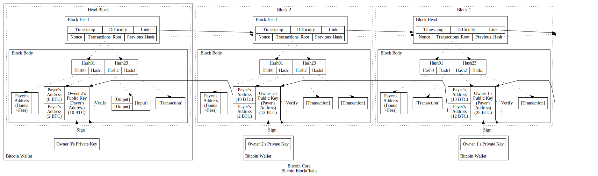
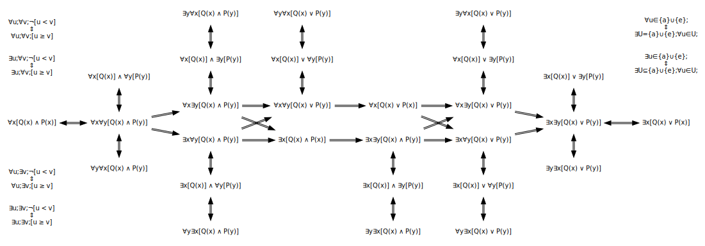

法律化社会 == 经济社会 == 货币社会 == 占有型社会
公理化社会 == 契约社会 == 信用社会 == 奉献型社会

--------------------------------------------------------------------------------

### 何为货币？

在经济社会中，货币受到全社会的普遍认可而广泛流通。作为商品交换中的一般等价物，商品的价值可由货币来标明，除此之外，货币还可用于价值贮藏与延期支付。

伴随着人类社会由十分落后的原始阶段，进化到当前先进的科技阶段，货币的载体也由粗糙的自然材料如贝壳，过渡到笨重的贱金属如铜与铁，过渡到沉重的贵金属如金与银，再发展到便携的但本无价值的纸币，再发展到防伪性极佳的塑料币。借助于现代互联网技术的应用，货币早已实现无纸化的电子支付形式，完全可以跳跃塑料币的阶段，而未来社会的货币很可能将被社会信用所替代。

货币的特征：
1. 商品交换中的一般等价物；
2. 用于价值贮藏与延期支付；

货币的演变形式：
载体：自然材料 -> 贱金属   -> 贵金属   -> 纸币 -> 电子货币 -> 信用
起因：原始社会 -> 国家形成 -> 资本积累 -> 法律 -> 网络银行 -> 区块链技术

#### 自然材料阶段的货币

自然材料阶段的货币，主要在原始社会中流通，比较常见的载体有贝壳与兽皮。若按照现代社会的看法，货币以自然材料为载体，其本身的价值并不大。自然材料阶段的货币之所以得到全社会的认可，成为物物交换中的一般等价物，很大程度上是在自然而然的状态下约定俗称的。如果同一地区的居民都乐意接受某种特别的自然材料，那么该种自然材料便很容易无障碍流通。通常来说，那些随处可见的自然材料不会成为一般等价物，某种自然材料若能成为约定俗成的一般等价物，就必然满足某些特征。所谓物以稀为贵，即是说一般等价物必然是相当普遍可见的，而且是精致不可多得的。相当普遍可见，才容易广泛流通；精致不可多得，才难以大量伪造。原始社会中的人们更看重实用的生活物资，而不是既可用于装饰又可用于交换的一般等价物。因此自然材料阶段的货币，仅仅是为方便直接的物物交换而出现的，其流通范围不会超出该自然材料可普遍获得的范围，也受限于该地区居民的足迹范围，真正流通于社会中的货币数量仅维持在可避免物物交换的水平。自然材料阶段的货币，其自身价值大致由两个因素决定：一是自然材料的稀缺性，比如贝壳的精致程度，或者后期加工的程度；二是物物交换的频繁性，比如同村落内的物物交换，或者同地域内的物物交换。自然材料越稀缺，物物交换越频繁，货币的价值就越高；自然材料越充足，物物交换越稀少，货币的价值就越低。

于2019年05月25日 23:31 +08 在深圳 +08

#### 贱金属阶段的货币

贱金属阶段的货币，是伴随着国家的形成而出现的，比较常见的载体有铜币与铁币。在由原始部落阶段向国家形成阶段过渡的过程中，国家内部逐步出现阶层的分化与固化，当阶层分化足够细致之后，在统计特征上便呈现出类似于金字塔的形状。位于阶层金字塔顶端的群体数量稀少，自阶层金字塔顶端向下，阶层的身份地位逐级递减，而群体数量骤然陡增，位于阶层金字塔底端的群体数量最为庞大，但也是最无足轻重的群体，必然受到上级阶层的支配。国家内部阶层分化的过程，同时也是阶层固化的过程。通常来说，位于特定阶层的群体，只要不出现变卦，其身份地位就不会发生变动。上下级阶层之间关系的固化，以及国家内部各种机制的运转，从阶层金字塔的侧面来看，就体现为自上而下逐级递减的权力。阶层之间的权力传递是单向不可逆的，位于上级阶层的群体可以对位于下级阶层的群体发号施令，但反之则不然。国家内部阶层的分化与固化，以及自上而下依阶层逐级递减的权力，必须要由某些固化的行为规范来强制性保证，这些行为规范经过整理编纂便成为国家的法律。法律是由阶层金字塔顶端具有绝对权力的阶层制定的，体现的是国家占统治阶层的权力意志。

国家形成以后，为对广阔的疆域实施有效的统治，国家的最高统治阶层将下级统治阶层委派到各个地区进行管理，每个地区的统治阶层及其常驻地点构成当地的地方政府，地方政府负责对社会事务进行处理，直接对地区内的被统治阶层实施统治。对地方政府进行管理的政府构成上级政府，位于最顶端由最高统治阶层管理的政府构成中央政府。因此政府是国家对被统治阶层实施统治，以及对社会事务进行处理的机构，政府为国家而服务，随国家消亡而消亡。通常来说，广义上的政府涵括立法机构/司法机构/行政机构/军事机构，而狭义上的政府仅仅代指行政机构。政府有别于一般的社会组织，并具有凌驾于其它社会组织之上的权威性，而法律的制定与完善可以为政府职能的顺利开展提供强制性的保障。法律由政府的强力部门执行，政府的强力部门通常包括军队/警察/法院/监狱等有组织的暴力机器。政府作为统治阶层根据法律行使国家权力的机构，上下级政府之间依靠单向传递的命令维持运转。但与自上而下逐级递减的权力不同，除特殊情况外，下级政府通常不可越级向上级政府汇报工作，而上级政府的命令可层层下达畅通无阻。在法律化社会中，类似于政府命令的这种单向传递模式十分普遍，可归类为权力的二阶传递模式。即在权力传递上有直接上下级关系的组织或个体之间，比有非直接上下级关系的组织或个体之间存在更强更重要的互动，以致于后者通常可以被近似忽略掉。

于2019年06月21日 00:53 +08 在深圳 +08

国家伴随着阶层的分化与固化而形成，法律为方便国家的阶层统治而出现。法律本身就是约束性很强的行为规范，其对社会形态的塑造作用，就是将人们在生活中不明确的行为方式与社会关系以明确的形式固化成型，因而法律化思维模式就是固化的思维模式。在法律化思维模式的潜移默化下，人们总是会认为由法律约束的事物将遵从既定的轨迹出现。比较最常见的情形是，下级阶层总是习惯于服从上级阶层的命令与安排，被统治阶层总是习惯于政府对资源的规划与保障，人们总是习惯于接受事物有统一的中心。在法律化社会中与法律的固化思维模式相对应，最高统治阶层总是为数不多，中央政府总是独此一家。自中央政府到地方政府，占统治地位的阶层由高到低，所掌控的权力由大到小，所管辖的地区由广到窄。资源总是首先被集中配置在地区的中心，然后再配送到地区内的其它角落。由中心到角落，地区越来越广但资源越分越少，资源的这种配置方式即地区中心化。财产总是首先会汇聚到富人的口袋中，然后再分散到其它穷人的饭碗里。由富人到穷人，人口越来越多但财产越切越小，财产的这种划分方式即马太效应。

于2019年06月25日 00:40 +08 在深圳 +08

国家的政府产生以后，为方便对被统治阶层实施统治以及对社会事务进行处理，就有必要制定一套可在全社会通行的标准规范，而且通常会沿用已有的风俗习惯。与中心化的权力结构相适应，一般来说这些标准规范在全国统一，并以法律手段保障强制实施。在涉及商品经济的领域，由政府统一铸造贱金属货币，并通过法律手段强制向全社会推行与流通。贱金属货币便取代自然材料货币，由受全社会普遍认可的一般等价物，上升到由政府信用作为保证的一般等价物。这个阶段的货币之所以为贱金属材质比如铜与铁，是因为贱金属在自然界中的含量较为丰富且熔点不高，适合被大量开采与冶炼。贱金属货币可被铸造成统一规格的形状/成色/重量，相对于自然材料货币来说不易被磨损，既便于贮藏也便于携带，但自身重量并不轻。贱金属货币作为商品交换的媒介，也就是一般等价物可用于标定商品的价值。而且正因为其不易被磨损的性质，贱金属货币通常会被贮藏起来，以备日后不时有购买商品的需要。被贮藏起来的贱金属货币将退出流通领域，成为个人所拥有的财产。

于2019年06月28日 00:47 +08 在深圳 +08

若个人的财产越多，即受个人支配的贱金属货币越多，则可随时购买的商品越多，对各类物资来源的保证就越多，可预期的生活就越稳定与富足。与财产的累积效应相类似，权力同样存在扩大效应。若个人的权力越大，即受个人支配的社会关系越多，则可随时调动的人员数量越多，对各级阶层管理的保证就越多，可预期的调配就越顺畅与容易。在这种观念的驱动下，人们总是热衷于不断累积财产与扩大权力，甚至受利益驱使为占有财产与攫取权力而不择手段。对稳定物资的控制欲，最终将转化为累积财产的动力，而对美好事物的占有欲，最终将转化为扩大权力的动力。正所谓：天下熙熙，皆为利来；天下攘攘，皆为利往。

于2019年07月03日 22:49 +08 在深圳 +08

贱金属货币由法律保障强制流通，随着法律体系的完善，法律会将各个层面的行为方式与社会关系更加规范化，当涉及到财产的所有权关系并需要明确之时，法律必然会保护私有财产。从物种进化的角度来说，人类作为自然界中的一个物种，在漫长的自然选择与进化的过程中，与其它物种一样具有生存斗争的天性。几乎是出于生存本能的需要，物种在生存斗争中为适应环境存活下来，就必须要抢占栖息空间与攫取食物资源。因此不难想象，统治阶层在制定法律的过程中，当然会从维护自身利益的观点出发，保护私有财产不受侵犯。正因为法律是对社会生活中方方面面做限定的行为规范，法律中的任意条款都必须要明确是或者否，原则上不允许有含糊其辞的折衷选项，这也意味着在法律化社会中财产不可公有。实际上某些财产，比如各种公共基础设施是可以公有的，但一个不可回避的问题是，人们为何会维护公有财产，却不将其据为己有？在法律化社会中，公共基础设施总是以国有财产的形式存在。在法律的思维模式下，人们习惯于对物品的所有权做出明确划定，而那些未被划定所有权的物品便成为人们抢占的目标。同样，贱金属货币作为受法律保护的私有财产，很容易便成为人们追逐的对象。法律化社会本质上就是占有型社会。

于2019年07月05日 00:17 +08 在深圳 +08

``` NOTICE
很遗憾，当我重新翻看历史学书籍时，我再次发现书本中的内容，以及互联网上的网页，明显都有被大幅度修改的痕迹，这么做的后果无非是原本真实的信息，现在变成虚构的故事情节，人们再也无法还原历史的真相。

这么做值得吗？得到的多，还是失去的多？我们的子孙后代他们该怎么办？

历史是应当被正视的，无论其中包含着丑陋或者优雅，因为历史是不可逆转的累积沉淀。

我不确定我可以很好地完成紧接着的论述。

于2019年07月05日 20:59 +08 在深圳 +08
```

#### 贵金属阶段的货币

贵金属阶段的货币，与资本原始积累紧密相关，比较常见的载体有金币与银币。西欧国家进入中世纪时代以后，随着远距离商品经济的繁荣发展，为解决在不同城市之间携带以及兑换贱金属货币的不便，以借贷为核心业务的银行业随即发展起来。银行业高利贷的盛行，让大量无力偿还债务的手工业小作坊破产，小作坊主连同其学徒为抵押贷款而逐渐沦为最早的雇佣工人，大作坊主通过不断兼并小作坊的方式，与高利贷放贷者们逐渐成为最早的资本家，与此同时便产生最早的雇佣关系。雇佣关系的产生，标志着资本主义萌芽，在此过程中资本家们掌握货币资金与生产资料，具有自由身份的雇佣工人依靠出卖劳动力维持生活。虽然资本主义萌芽发展缓慢，但却对原本自给自足的自然经济造成有力地冲击，也使得大量农村人口涌入城市成为自由劳动力，封建社会逐渐被瓦解。随着欧洲通往美洲以及印度的海上新航路被开辟出来，为开拓海外殖民地并掠夺资源，最早在荷兰与英国成立股份制跨国特权公司，与此同时世界上最早的证券交易所建立，以方便与规范股票交易。英国东印度公司被英国皇家授予在印度的贸易与军事特权，不仅几乎垄断欧洲通往印度的商业贸易，而且成为印度的实际统治者。

于2019年07月10日 18:00 +08 在深圳 +08

以合股集资为特点的股份制，通过公开或非公开发行股票的方式，可将社会中分散的资金集中起来，由股份制公司统一经营管理，股票持有者按持股数量获取股息与红利。股票作为股份制公司发行的有价证券，同时也是股份制公司的所有权凭证，持有股票即成为股份制公司的股东。由全体股东组成的股东大会，代表着股份制公司的最高权力机构，对公司的重大事项进行决策，有权选任和解除董事。而董事会作为股东大会的常设机构，对股东大会负责，通常拥有实际的执行权力。原则上股东所拥有的公司所有权份额的大小，取决于其持有的股票数量占公司总股本的比重。因此通常来说，绝对控股的大股东，将成为董事会成员，对公司的重大决策有绝对的话语权，而数量众多的小股东其作用几乎可以忽略不计。股份制公司为扩充融资规模，可在股票交易市场公开发行股票，同时向公众媒体公布财务状况等信息并接受公众审查，此即上市股份制公司，绝大多数规模庞大的公司，都是上市股份制公司。股份制的基本特点，就是将股东的资金与公司的经营相分离，因此股东在很大程度上是出于资金盈利的目的，而不是出于该公司对社会所做贡献的考虑去投资。上市股份制公司在股票交易市场，按照股票发行价公开募集到足够的资金以后，股票就会像商品一样被转手交易，此即炒股。与商品买卖类似，炒股通过股票价格在买入与卖出之间的差额来获取利润。股票价格根据市场行情的波动而变化，虽然能够反映上市股份制公司的运营状况，但本质上炒股就是以追逐利润为目的的经济行为。从某种角度来说，股票在转手的过程中，并没有对社会的发展有实质性的贡献，只不过是一种买卖游戏而已。

于2019年07月12日 00:12 +08 在深圳 +08

地理大发现时代的海上新航路被开辟出来以后，欧洲国家出于对金银等宝贵矿藏财富的渴望，很快便走上对外扩张的殖民掠夺道路。随着蕴藏丰富金银矿产资源的南美洲地区被征服，大量金银贵金属流入欧洲，成为欧洲殖民者早期对殖民地资源掠夺的最直接动力。与此同时，随着具有合适气候条件的北美洲地区被征服，蔗糖与马铃薯等新型经济农作物被引入欧洲，欧洲人的饮食习惯随之大幅度改变，对这些农作物消费品的需求增长，最终促使欧洲殖民者在美洲发展经济农作物的种植。欧洲殖民者对美洲地区的武力征服活动，造成本土印第安人因惨遭残酷屠杀与外来传染病流行而数量锐减。而由于大规模矿藏的开采以及众多种植园的经营，都需要大量的廉价劳动力，欧洲殖民者转而从非洲地区贩卖黑人奴隶劳动力到美洲地区，罪恶的黑三角贸易因此展开。黑三角贸易大致围绕三角形路线进行，启程从欧洲运往非洲有纺织消费品与军火工业品等等，中程从非洲运往美洲有黑人奴隶劳动力，归程从美洲运往欧洲有贵金属矿石与农作物产品等等。同样疯狂的资源掠夺行为，还有类似于英国东印度公司对东方殖民地的垄断商业贸易活动等等。欧洲殖民者在海外的殖民扩张，对发展本地的纺织业有极大的促进作用，羊毛的市场需求猛增使得羊毛的价格不断上涨，羊养殖业便成为利润丰厚的产业。历史上欧洲国家都出现过贵族地主使用暴力手段，大肆将农民驱逐并圈占其耕种土地以及公共土地，改造成私有大牧场用于羊养殖业的现象，这被称为圈地运动。

于2019年07月19日 14:12 +08 在深圳 +08

黑三角贸易与圈地运动等等均以巨额利润为驱动力，前后共持续数百年之久，这些都是资本原始积累的重要方式。黑三角贸易给非洲地区与美洲地区带来深重的灾难，不计其数的非洲黑人惨遭猎杀，数以千万计的黑人奴隶被贩卖到美洲地区，成为美洲实行种植园奴隶制的开端，最终为日后北美洲地区的种族歧视问题埋下祸根。与此同时，种植园经济在美洲地区得到迅速发展，巨额的金银财富与工业原料流入欧洲地区，金币与银币逐渐取代铜币与铁币成为最主要的流通货币。而圈地运动造成无数被剥夺耕地的农民倾家荡产，但政府所颁布的血腥法律禁止失去土地的农民四处流浪，大量农民被迫涌入城镇，沦为充当廉价劳动力的雇佣工人。欧洲国家通过黑三角贸易等方式，从海外掠夺回大量财富与资源，为资本主义的发展迅速积累起丰厚的货币资本与原料资本，而通过圈地运动等方式，在国内普遍形成雇佣劳动制，又为资本主义的发展提供充足的廉价雇佣劳动力。因此所谓的资本原始积累，实质上就是新兴资产阶级通过非正当的暴力手段，迫使生产者与生产资料相分离，使生产者屈服于资本家而成为雇佣工人，并使货币资本与原料资本迅速集中到少数人手中的历史过程。资本原始积累发生在资本主义生产方式被确立之前，而通过暴力手段使得资本原始积累的进程被大大加速。除此之外，资本原始积累的其它主要手段还有商业战争与关税保护等等，但无一例外均有国家政权力量作为背靠才得以顺利进行。

于2019年07月21日 23:46 +08 在深圳 +08

同为金属材质，贵金属与贱金属都具备良好的可塑性，但贵金属货币能取代贱金属货币成为最主要的流通货币，这绝非偶然。贵金属通常指钌/铑/钯/银/锇/铱/铂/金等八种金属，除此以外均可称为贱金属。相对于贱金属来说，贵金属的化学性质更加稳定，更不易被空气中的水汽氧化腐蚀，在一般条件下更不易与其它化学物质发生化学反应，因而贵金属均为惰性金属。与不活泼的化学性质相一致，贵金属在地壳里的含量更为稀少，再加上贵金属的密度均大于贱金属的密度，同等体积的贵金属远比贱金属更具有交换价值。由于不易被氧化腐蚀等特点，贵金属通常拥有美丽的色泽，其中黄金呈现亮黄色光泽，这正好位于人眼敏感的黄绿色可见光范围内，黄金因此成为首选的贵金属货币材质。在所有的贵金属中，白银熔点最低且密度最小，在地壳里的含量最多。因此在历史上，白银是由贱金属货币到贵金属货币的过渡材质，当黄金被大量开采以后，白银便成为辅助的贵金属货币材质。在现代经济社会中，贵金属货币早已退出流通领域，但因其交换价值高且可长久保存等特点，贵金属通常被加工成首饰，或被用于价值贮藏。

于2019年07月24日 00:30 +08 在深圳 +08

采用暴力手段完成的资本原始积累进程，为资本主义生产方式首先在欧洲国家被建立奠定两个必要的前提条件，其一是少数人手中具有大规模生产所必需的货币资本与原料资本，其二是社会上存在大量可雇佣的廉价自由劳动力。资本原始积累以攫取财富与掠夺资源为原动力，这意味着资本主义生产方式本来就建立在生产资料私有制的基础上，以追求超额利润为首要目的。所谓资本，就是可以创造剩余价值的价值。在资本主义生产方式中，资本家所无偿占有的资本可简单地划分为生产资料（包括货币资本与原料资本等等）与劳动力（即雇佣工人等等）。资本主义的简单再生产只是在原有规模上重复进行的再生产，除去生产成本以外，所得利润即剩余价值。但在超额利润的导向下，必然会驱使资本家将剩余价值再转化为资本，用于追加生产资料与劳动力来扩大再生产的规模，以实现资本的超额增殖，资本不断增殖的过程即资本积累。资本主义的扩大再生产是资本积累的重要方式，而资本积累是资本主义生产发展的必然趋势。资本积累来源于剩余价值，其中在所有决定剩余价值的主要因素中就包括：对劳动力的剥削程度以及劳动生产率的高低。前者体现为雇佣工人被视为劳动力资本，其劳动所创造的价值被资本家无偿占有。所谓无产阶级就是指没有生产资料的阶级，而资产阶级就是指占有生产资料的阶级。随着资本积累与生产规模的扩大，社会财富日益集中到资产阶级的手中，而无产阶级除出卖自身的劳动以外别无所有，数量占少数的资产阶级占有绝大部分社会财富，而数量占绝大多数的无产阶级仅拥有少部分社会财富。因此最终将导致资产阶级与无产阶级的两极分化，但这是资本主义社会中不可避免的现象。

于2019年07月31日 01:25 +08 在深圳 +08

后者将推动资本家不断改进生产技术与机器装备，彼此之间必然展开激烈的市场竞争，其结果通常是处于优势地位的大企业击败处于劣势地位的小企业，引发大资本吞并购小资本，或者小资本合并成大资本，从而促进生产与资本集中到少数资本巨头手中。此外更为常见的资本集中手段，还包括通过向社会发行股票来募集资金的上市股份制公司。生产与资本集中发展到一定程度必然会产生垄断，但在自由市场竞争的环境下，竞争被认为是好的，相反垄断被认为是坏的。通常来说，私人垄断是指少数实力雄厚的企业，为避免激烈竞争所造成的两败俱伤而联合起来，凭借他们在市场中的优势地位，长期独占或控制某些部门的生产与市场以获取高额垄断利润。由于占据垄断地位的企业具有左右市场价格的能力，他们所定的目标价格一般比市场价格较为稳定，即使遭遇经济衰退也不会出现大幅度波动。在市场经济中，通常依据企业所占有的市场份额作为判定其垄断地位的直接经济依据，市场份额越大则垄断地位越高，与此同时也意味着市场竞争性越低。但不能单纯地认为比在市场竞争环境下，占据垄断地位的企业对全社会的贡献就更少，因此应当反对的是滥用垄断地位进行不正当竞争的行为。

于2019年08月08日 20:14 +08 在深圳

所谓资本主义，就是以生产资料私有制与雇佣劳动制为基础的社会制度。资本主义生产方式的显著特征，就是资本家占有生产资料，并通过剥削雇佣劳动力来实现资本增殖。资本主义生产以榨取雇佣劳动力创造的剩余价值为直接目的，这就意味着资本家追逐超额利润的欲望是永无止境的。资本主义生产方式最初便建立在放任竞争的自由市场经济之上，即以市场机制在资源配置中起决定作用的商品经济。价值规律是商品经济的基本规律，简单地说即商品的价值由社会必要劳动时间决定，商品以价值为基准按照价格相等的原则互相交换，商品的价格受供求关系的影响围绕价值上下波动且趋于与价值相符，两者之间存在双向反馈的关系。当商品的价格上涨高于价值时，将引发商品生产的扩大与商品供应量的增加，导致商品供过于求，最终使商品的价格下跌；而当商品的价格下跌低于价值时，将引发商品生产的缩减与商品供应量的减少，导致商品供不应求，最终使商品的价格上涨。价值规律作为看不见的手，将自发调节生产资料与劳动力在各生产部门之间的分配，从而促使商品生产与商品流通维持相对平衡。

于2019年08月09日 00:58 +08 在深圳

历史上，资本主义的发展可大体分为三个阶段，即自由竞争资本主义/私人垄断资本主义/国家垄断资本主义。资本主义在自由竞争阶段，不同商品生产者以价值规律为导向，为在激烈的市场竞争中保持优势地位，总是积极改进生产技术与扩大再生产规模，并改善经营管理与提高劳动生产率，从而推动整个社会生产力发展。资本主义在私人垄断阶段，生产与资本日益集中到少数大资本家或大资本集团手中，工业垄断资本在很大程度上控制着主要工业部门的生产，并借此操纵商品的价格与市场的供求。与此同时，银行业垄断资本与工业垄断资本互相渗透融合形成金融资本，少数金融资本寡头控制着巨额社会财富，并在实际上操纵着国家的经济命脉与政治权力。在充分自由竞争的市场经济中，任何资本都没有控制市场的绝对力量。因此在价值规律与供求关系的自发调节下，商品在生产/分配/流通/消费等各个环节中，基本上不会发生市场失灵的现象。在垄断限制竞争的市场经济中，由于大垄断资本受市场机制自发调节的影响较弱，并且在某种程度上操纵着商品的价格与市场的供求，当资本与商品在市场供求的某个环节出现反常，使得维持资本流转与商品流通的相对平衡状态被打破，就有可能连锁引发市场失灵的现象，即市场出现无法有效提供或分配资源的状况。

于2018年08月18日 01:54 +08 在深圳 +08

在资本主义市场经济中，市场失灵通常表现为周期性爆发的经济危机。每当经济危机爆发时，必然伴随着商品大量积压或销毁/工厂急剧减产或倒闭/商业停滞与工人失业/通货紧缩或通货膨胀/信用破裂与经济衰退等等标志性现象，此即所谓的停滞性通缩现象或停滞性通胀现象。经济危机根源于资本主义基本矛盾，本质上即生产相对过剩危机。机器大工业生产代替工场手工业生产，意味着资本主义生产方式进入到成熟阶段，但同时也意味着资本主义基本矛盾被加剧。资本主义基本矛盾具体表现在三个维度：在阶级维度上表现为资产阶级与无产阶级之间的矛盾，以及社会结构日益呈现出两极分化的趋势，本质上即生产资料私有制与生产资料公有制之间的选择。在生产维度上表现为个别企业生产的组织计划性和整个社会生产的无政府状态之间的矛盾，由于商品生产的盲目性与市场调节的滞后性，再加上垄断资本企业对自由竞争造成限制等因素的存在，日积月累就有可能因商品积压或资本断裂等等条件，导致市场在某个环节失调而出现反常的市场失灵现象，最终酿成破坏力巨大的经济危机。在消费维度上表现为资本积累与商品生产无限扩大的趋势和劳动人民有生活需求但支付能力不足的矛盾，此即所谓的生产相对过剩问题。随着资本积累的扩大与生产效率的提高，在以追逐利润为导向的市场经济中，必然促使资本对劳动力的需求相对减少，进而导致社会中存在大量相对多余的失业劳动力，但并不是全社会的生产能力容纳不下这些失业劳动力，此即所谓的人口相对过剩问题。从某种程度上来说生产相对过剩与人口相对过剩就是对可利用资源的极大浪费，但这对于建立在市场经济之上的资本主义私有制而言，显然是无法有效解决的实际问题。

于2019年08月28日 00:12 +08 在深圳 +08

资本主义发展到私人垄断阶段后期，倘若仅仅依靠市场竞争的自发调配与私人垄断资本的操纵，显然无法阻挡频繁爆发的经济危机以及伴随的长期经济衰退。此外，某些与国防安全相关的特定行业，以及大规模的社会公共基础设施建设，不仅需要长期投入巨额资本而且风险大利润低，这是私人垄断资本无力承担的或不愿意投资的，客观上只允许被国家的政府部门所掌握控制。这就迫使政府借助国家政权力量出台政策，对市场经济活动进行全面而持续地干预与调节，在此基础上便形成国家垄断资本主义，即国家政权力量与私人垄断资本相结合的资本主义。而主要由国家投资兴建或将私人企业收归国有，并冠以国家名义对市场实施垄断的国有企业，是国家垄断资本主义中最常见的形式。国家垄断资本主义对市场经济进行干预与调节的大体目标，对内即维持商品供求关系的基本平衡以及实现充分就业，对外即维持国际贸易收支的基本平衡以及维护国家利益。对内的主要手段有财政政策与货币政策，而且通常采用逆经济风向行事的原则。财政政策即政府根据经济发展的现状与目标，借助于行政措施来影响消费与投资的经济总量，可划分为财政收入（主要是税收收入）与财政支出（比如说补贴采购）；货币政策即政府通过国家的中央银行，控制流通货币的总供应量与调整银行的信用贷款业务，主要工具有存款准备金率与存款利息率。对外的主要手段有关税壁垒与倾销政策，关税壁垒通过实行高额关税限制外国商品输入来保持国内商品的垄断价格，商品倾销通过以低于正常价格将商品输出外国来打击竞争对手并占领市场。此外，为转移国内相对过剩的资本，其中包括但不限于相对过剩的商品与劳务，经济相对发达国家通常会凭借在技术上的优势保留技术密集型的商品生产，而将劳动密集型的生产资本与借贷资本输出到经济相对落后国家。生产资本输出即本国政府或企业在外国利用当地丰富的原材料与廉价的劳动力就地生产与销售，借贷资本输出即本国政府或企业向外国政府或企业提供巨额银行贷款或大量购买国债证券股票。资本输出国通常会要求资本输入国附带种种条件或协议，以获得经济政治军事等方面的优惠与特权，因此不论何种形式的资本输出，都会增强资本输入国对资本输出国的依赖。资本输出将本国的商品/劳务/服务/技术等等经济要素，扩散到全球的生产/消费/贸易/投资等等经济领域，在使国际分工与合作日益密切基础上形成经济全球化的同时，也将经济风险与动荡传播到全球。

于2019年09月05日 00:08 +08 在深圳 +08

在国家垄断资本主义中，尽管市场经济活动受到政府强有力的干预与调节，但仍然难以摆脱不时出现的市场失灵现象。此外，由于市场经济以价值规律为基础自发调节商品的生产与消费，其本身并不适合某些社会福利项目的实施。随着奉行共产主义意识形态，并坚持无产阶级专政的社会主义国家在全世界范围内占有一席之地，计划经济成为社会主义国家的基本特征之一。所谓共产主义，就是以生产资料公有制与无阶级压迫剥削为基础的社会制度。马克思主义所描述的共产主义社会，就是社会生产高度发展以及物质产品极大丰富，人们根据按需求分配原则各尽所能各取所需，每个人实现全面而自由地发展。不过迄今为止，共产主义社会仍然停留在构想阶段，而现行的社会主义社会是共产主义社会的低级阶段。与资本主义国家的多党制竞争理念不同，多数社会主义国家为一党制的集权国家，这就意味着在计划经济中政府对商品经济的干预必然远远超过私人的决策部分。所谓计划经济，就是指政府的计划指标在资源配置中起决定作用的商品经济，商品在生产/分配/流通/消费等各个环节几乎不受市场的影响，都事先由政府的计划部门统一进行计划指标的详细制定，再通过政府以行政命令的方式层层下达，执行单位的任务不过是完成所下达的计划指标，因此计划经济又称为指令型经济。在计划经济中，为将几乎所有的社会经济活动纳入到政府的掌控下，理论上要求存在唯一一个能统筹全局的中央计划部门。中央计划部门需要及时获取巨大的信息量，并在兼顾各个环节供求平衡的基础上进行决策，再迅速而准确地编制出一系列无所不包的计划方案，下级执行单位因所知信息量片面，原则上无权变更上级下达的计划指标，个体的实际需求与决策自由不得不让步于政府的计划指标。从某程度上来说，计划经济不仅忽视个体的自主能动性，而且由于缺乏民主监督的滥权现象相当普遍，既容易造成个体的积极性与创造性受到极大压抑，也有最终发展成为集权主义的趋势。计划经济的显著优势在于可有效避免市场经济中的盲目性与滞后性等短板问题，并可在短时期内集中力量优先倾斜于某些方面的发展，但与此同时也受限于木桶效应中的短板方面。计划经济的显著劣势在于事先详细制定的计划往往赶不上事后实际情况的变化，数值分析学中的混沌现象（系统动力学中蝴蝶效应：即初始条件下极其微小的片刻变化，最终将导致整个系统产生巨大而长期的连锁反应）意味着政府的计划部门永远也无法准确计算包罗万象的复杂经济体系问题。事实上，计划指标不仅在制定之初总是存在决策偏差，而且在执行过程中由于发生利益冲突等种种原因，也总是不可避免会出现效果偏差。那些偏离正确轨道的偏差是相当危险的，由于缺乏有效的自底向上反馈机制，因此随之而来的必然是计划经济的彻底崩溃。

于2019年09月17日 23:57 +08 在深圳 +08

一直以来，按照马克思主义经典作家的设想，在共产主义社会低级阶段的社会主义社会中，为消除资本主义基本矛盾以及整个社会生产的无政府状态，就应当实行生产资料归全体社会成员共同占有的公有制形式，并根据人们的生活需求对整个社会的商品生产与分配进行有计划的调节。由于还保留有旧式的社会分工与合作，劳动仍然是人们谋生的主要手段，个人还不可能得到自由而全面的发展，也不可能凭借对生产资料的排斥占有来获取特别的经济利益，按劳动分配便成为人们在社会中获得消费品的首要根据。所谓按劳动分配，就是以劳动者所提供的劳动之数量与质量为尺度对消费品进行分配，整个社会对全部消费品统一做各项必要扣除后，遵循按照等量劳动直接领取等量报酬的原则，完全并不需要商品货币与市场机制为中间媒介来实现个人劳动向社会劳动的转化。正因为受限于环境条件与认知水平，历史上社会主义国家建立以后均实行高度集中的计划经济体制，政府对经济进行统一的管理与调配，同时在相当程度上排斥基于市场机制与价值规律的市场经济。然而按劳动分配的方案并非切实可行，若难以无差别地计量劳动者在平均熟练程度和平均劳动强度下，生产单位消费品所耗费的社会平均劳动量，也就不存在可通行于整个社会的统一标准。随着计划经济的弊端日益显现，在苏联解体与东欧剧变事件相继发生以后，大多数社会主义国家由此转向资本主义市场经济，中国等社会主义国家为此引入市场经济实行改革开放，并由此建立社会主义市场经济制度。所谓社会主义市场经济，就是社会主义国家在政府的宏观调控下，以市场机制为基础进行资源配置的商品经济，究其本质上当属于市场经济的范畴。在社会主义市场经济制度下，中国实行以按劳动分配为主体与多种分配方式并存的分配制度，其中按劳动分配主要采取货币工资的形式实现。

```
按劳动分配在商品货币经济中的典型流程：
[劳动者借助企业将劳动转化到社会] 企业为整个社会生产消费品，作为组成企业总劳动中的个体劳动便转化成社会劳动。
[企业对劳动者按劳动分配货币工资] 企业在市场上将消费品销售，依据每个劳动者的实际劳动以货币工资形式分配报酬。
[劳动者用货币工资获取社会消费品] 劳动者购买消费品进行消费，实现社会对全部消费品统一做各项必要扣除后的分配。
```

于2019年10月07日 02:57 +08 在深圳 +08
于2020年06月11日 01:01 +08 在湛江 +08

#### 纸币阶段的货币

纸币阶段的货币，在术语上被称为法定货币，最为常见的载体有纸张与塑料。纸质货币又简称为纸币，是现代社会中最常见的现金货币；塑料质货币又简称为塑料币，相比于纸币具有防伪造性更好/耐磨损性更强/使用寿命更长等优点，但由于成本与技术等原因，塑料币暂未取代纸币成为主流现金货币。纸币与塑料币均由国家通过法律手段强制发行与流通，本身并没有什么实际价值可言，其名义价值依靠国家信用为背书，按照规定具有无限法偿力，即无论何种形式的交易，买卖双方均不能拒绝接受纸币作为交易媒介。纸币的雏形最早可追溯到11世纪中国四川地区的交子，当时是作为汇兑笨重铁币的票据而出现，但其本质上是一种用于商人间存款取款的凭证，类似于现代意义上的银行支票，并不完全具备一般意义上货币的典型特征，即交易媒介/计价单位/价值储藏/延期支付。中国古代长期实行银两本位制，规定以两为单位称重计量，并根据碎银的含银量与成色确定银两的价值，银两作为法定本位币具有无限法偿力，而纸币作为辅助币可按面值兑换成银两，但不具有无限法偿力。同时期的西欧国家实行金银双本位制，即金币与银币同时作为法定本位币，并以政府法令规定金与银之间的兑换价格。这并不是一种稳定的货币制度，在价值规律的作用下，名义价值相同但实际价值偏低的货币（记作劣币），将会比实际价值偏高的货币（记作良币）更容易流通，从而发生劣币驱逐良币的现象。也正因为如此，作为那个时代工业最领先的国家，英国率先由金银复本位制过渡到金本位制，并被当时的大多数工业国家仿效。在金本位制下，纸币与黄金之间的兑换比例相对固定，这意味着一国每发行一定数额的纸币，就需要储备相应比例数额的黄金，否则无法实现纸币与黄金之间的自由兑换。实行金本位制的各国都将本国纸币与黄金挂钩，即可维持各国纸币之间的兑换比例也即汇率的相对固定，而储备在各国银行中的黄金除用于持有之外，既不用于流通也不用于借贷。

在金本位制的时代，货币供应量依赖于黄金等贵金属的供应量，然而世界范围内黄金等贵金属的供应量总是有限的。作为西欧资产阶级的早期经济学说，重商主义由此认为，一个国家的繁荣或者说财富与货币，必不可少的是黄金等贵金属。若将国际贸易看成是某种零和博弈游戏，则一国财富与货币的相对增加必将导致其它国家财富与货币的相对减少。为不让本国财富与货币外流，本国在对外贸易中就必须保持贸易顺差的地位，即贸易输出必须超过贸易出口，才能从贸易差额的货币累积中增加本国财富，而政府可通过鼓励出口并限制进口等种种关税保护措施达成目标。因此，所有贸易战与关税保护战的背后追根到底都是货币战。

于2020年02月09日 23:14 +08 在湛江 +08

国际金本位制体系本身具有内在对称性，体系内不存在某个国家的纸币拥有特权地位，各个国家只要能维持本国的黄金储备量，就能维持本国的纸币供应量与物价稳定。然而在两次世界大战前后，资本主义强国通过贸易与战争等手段，加紧对黄金等贵金属的开采与掠夺，造成世界黄金储备量的分布极其不均衡。两次世界大战期间，各国为筹集战争经费而发行大量不可兑换黄金的纸币，国际金本位制体系因难以维系而瓦解。第二次世界大战结束之时，美国取代英国成为头号资本主义强国，其黄金储备量超越其它所有国家的黄金储备量之总和。在此基础上形成由美元占据中心地位的国际货币体系即布雷顿森林体系，实行以黄金-美元为基础的钉住固定汇率制，规定1盎司黄金与35美元保持固定兑换比率，其它各国货币与美元保持可调整的固定兑换比率，其中美国政府有义务稳定美元对黄金的兑换比率，其它各国政府有义务稳定本国货币对美元的兑换比率。这是一种双挂钩形式的货币体系，即美元与黄金挂钩，而其它各国货币与美元挂钩，其中美元与黄金在国际金本位制的地位等同，可有效解决开放经济体系中的$N$对货币兑换问题，即若每种货币单独与其余$N - 1$种货币兑换，则共存在$\dfrac{N (N - 1)}{2}$种兑换方式。假设$N = 10$，那么$\dfrac{N (N - 1)}{2} = 45$，当$N$是一个较大的整数时，$N$对货币兑换将因为各种货币之间兑换的繁杂性而变得不切实际。然而布雷顿森林体系自身存在被称为特里芬难题的无法克服的矛盾，即美元若要满足国际结算与储备货币的需求，就会造成美国出现长期的国际收支逆差，进而导致美元出现不稳定性。但由于美国长期累积的巨额贸易逆差，致使美国黄金储备大量外流，美元相对于黄金出现非弹性贬值与通货膨胀，这意味着若按照原先的黄金与美元的兑换比率，则兑换同等重量的黄金只需要更少的已贬值的美元，再加上当时耗费在战争等项目上的巨额政府开支，美国政府无力维持美元与黄金之间的固定兑换比例，最终不得不宣布解除履行美元与黄金的兑换义务。布雷顿森林体系走向崩溃以后，世界货币体系由固定汇率制转向浮动汇率制，纸币由此与金属脱钩，而成为完全不兑现的信用货币，不过时至今日美元依然是流通最广的世界货币。

于2020年02月12日 02:39 +08 在湛江 +08

从宏观经济的角度来看，不同国家货币之间的汇率对于国际进出口贸易有着相当显著的影响。假设一辆美国汽车售价$25000美元$，美元对日元的汇率为$1美元 = 100日元$，则该美国汽车在日本售价$2500000日元$。如果美元相对于日元的汇率升值10%，现在$1美元 = 110日元$，那么该美国汽车在日本售价$2750000日元$。在美国国内看来该美国汽车价格不变，但在日本国内看来该美国汽车更加昂贵，因而相比于日本汽车竞争力将会有所下降。而与此同时，同样的1美元可以买到更多的日本商品，但同样的1日元只能买到更少的美国商品。因此，如果一国货币升值，将不利于该国商品出口外国，但有利于外国商品进口该国。反之，如果一国货币贬值，将有利于该国商品出口外国，但不利于外国商品进口该国。这也是为什么一些国家在经济不景气的时候，为维持本国的贸易顺差地位，宁愿采取本国货币贬值的办法，以增加本国商品出口外国竞争力，同时降低外国商品进口本国竞争力。

在浮动汇率制体系中，汇率主要受国际市场供求机制的自发调节而存在上下波动性。决定汇率的首要机制由一价定律阐明，即同样的商品在同一时间段内，若不考虑运输成本与贸易壁垒等交易成本因素，则该商品在不同地点的价格应当一致，否则精明的套利者将利用不同地点之间该商品的价格差额进行低买高卖而套利，并促使该商品的价格在不同地点之间趋于一致。按照一价定律，假设在美国的巨无霸汉堡包售价$4.80美元$，在日本的巨无霸汉堡包售价$370.00日元$，那么美元与日元的汇率就应该为$1美元 = \dfrac{370.00}{4.80}日元 ≈ 77.2日元$。但是一价定律仅能考虑在许多地区均有出售的少数几种商品，购买力平价理论由此认为，两国之间任何商品或服务的价格变动都应当反映在两国货币之间的汇率变动上，并存在以下购买力平价理论关系式：（$e$表示两国货币之间的汇率，$α_i$表示一国某种商品或服务占该国所有商品或服务的权重，$β_j$表示另一国某种商品或服务占该国所有商品或服务的权重，$p_i$表示一国某种商品或服务的价格，$p_j$表示另一国某种商品或服务的价格，$m$表示一国商品或服务的总数，$n$表示另一国商品或服务的总数）。购买力平价理论在忽略交易成本等因素的前提下，尝试完全确定两国货币之间的汇率，但实际上并非所有的商品或服务都可以准确衡量其权重与价格，诸如土地等商品与公益等服务就难以衡量，因此购买力平价理论并不能充分解释汇率的变动。但总的来说，任何增加本国商品或服务相对于外国商品或服务需求的因素，都有可能导致本国货币相对于外国货币升值，也即外国货币相对于本国货币贬值，因为即使当本国货币升值，本国商品或服务也能继续出售。由此可以预测，若由于外国商品进入本国的贸易壁垒升高/本国物价相对于外国物价降低/本国生产能力相对于外国生产能力升高/本国银行利率相对于外国银行利率升高等等因素，都有可能导致本国货币相对于外国货币升值。

> $$
> \begin{aligned}
>                                                         &  购买力平价关系式： \\
> \sum_{i = 1}^{m} α_i p_i = e · \sum_{j = 1}^{n} β_j p_j &\implies e = \dfrac{\sum\limits_{i = 1}^{m} α_i p_i}{\sum\limits_{j = 1}^n β_j p_j}，且满足 1 = \sum_{i = 1}^m α_i = \sum_{j = 1}^n β_j \\
> \end{aligned}
> $$
>
> 假设A国共有电脑/手机共$2种$商品，每年生产电脑$1500件$，电脑每件价格为$2000a$，每年生产手机$3000件$，手机每件价格为$500a$，那么A国每年的生产总值为$1500 × 2000a + 3000 × 500a = 4500000a$，电脑价格的权重为$\dfrac{1500 × 2000a}{4500000a} = \dfrac{2}{3}$，手机的价格权重为$\dfrac{3000 × 500a}{4500000a} = \dfrac{1}{3}$，A国商品的价格期望值为$\dfrac{2}{3} × 2000a + \dfrac{1}{3} × 500a = \dfrac{5500a}{3}$。假设B国共有飞机/汽车/轮船共$3种$商品，每年生产飞机$2件$，飞机每件价格为$100b$，每年生产汽车$4件$，汽车每件价格为$80b$，每年生产轮船$1件$，轮船每件价格为$60b$，那么B国每年的生产总值为$2 × 1000b + 4 × 120b + 1 × 80b = 2560b$，飞机价格的权重为$\dfrac{2 × 1000b}{2560b} = \dfrac{25}{32}$，汽车价格的权重为$\dfrac{4 × 120b}{2560b} = \dfrac{6}{32}$，轮船价格的权重为$\dfrac{1 × 80b}{2560b} = \dfrac{1}{32}$，B国商品的价格期望值为$\dfrac{25}{32} × 1000b + \dfrac{6}{32} × 120b + \dfrac{1}{32} × 80b = \dfrac{3225b}{4}$。A国与B国的货币汇率为$e = \dfrac{5500a}{3} / \dfrac{3225b}{4} ≈ \dfrac{2.2739 a}{1 b}$，即$1b ≈ 2.2739a$。

实际上，与股票等金融衍生品类似，汇率通常是高度剧烈波动的，而且十分难以预测，但只要金融市场上存在差价，就会存在三角套利行为。假设美元对日元的汇率为$1美元 = 100日元$，日元对英镑的汇率为$1日元 = 0.005英镑$，那么钉住日元的汇率，可以间接决定英镑对美元的汇率为$1英镑 = 2美元$。再假设英镑对美元的直接汇率为$1英镑 = 2.10美元$，那么以$200美元$的本金，在经过美元与日元兑换后将得到$20000日元$，在经过日元与英镑的兑换后将得到$100英镑$，在经过英镑与美元的兑换后将得到$210美元$。不需要任何知识，只需要在电脑上挥动一下鼠标与键盘，就可以毫无风险地轻松套利$10美元$！不过，外汇市场上的货币买卖大多数是由银行等交易商，通过随时买入与卖出以外国货币计价的银行存款来完成，银行等交易商又针对为出国旅行而兑换外国货币的零散客户收取额外费用。也就是说，在欧盟未采用统一的货币即欧元之前，若不考虑出国旅行的费用，一位欧盟区内的居民在欧盟区内闲逛一圈，仅仅因为过境不同国家而兑换货币，就可能会使出发时所携带的货币减半！外汇市场上每天的交易规模都非常庞大，而且远远超过债券市场与股票市场等金融市场的交易规模之总和，各国的中央银行都试图通过干预外汇市场的货币买卖，以控制本国货币对外国货币的汇率。银行在外汇市场上所持有的诸如外资银行存款/外国政府债券等等，以外国货币计价的资产被称为外汇储备，一国持有大量外汇储备也就意味着持有可随时用于避险的债权，但同时也就意味着若外国货币贬值这些外汇储备将会同步蒸发掉。因此，作为世界上最大的外汇储备国的中国，总是大量持有以美元计价的美国政府债券。

于2020年02月14日 05:26 +08 在湛江 +08

历史上，银行是从汇兑业务与借贷业务发展起来的，因此这两大业务构成所有现代银行的传统业务。银行收到的但并不放贷出去的存款被称为准备金，在完全准备金银行制度中，银行只专注于汇兑业务，并将所有存款都仅用作准备金，此时银行的利润就来源于向存款者收取的少量费用。不过，现代银行为吸取公众的资金反而会向存款者发放利息，那么就需要将部分准备金用于借贷业务，并对贷款者收取远高于为存款者发放的利息的利息，这被称为部分准备金银行制度，而存款与准备金的比率被称为准备金存款比率。一般来说，经济中的货币供应量可简单划分为流通货币与增值货币，流动性较强的前者主要包括流通中的现金与银行活期存款等等，流动性较弱的后者主要包括银行定期存款与各种债券基金等等。从宏观经济的角度来看，一个简单的货币供应量模型如下，除需要考虑中央银行本身的决策也即准备金存款比率以外，至少还需要考虑经济中每个个体的决策也即现金存款比率：（$C$表示流通中的现金，$D$表示银行中的存款，$M$表示货币供应量，$R$表示银行的准备金，$cd$表示现金存款比率，$rd$表示准备金存款比率，$m$表示货币乘数）。假设银行的准备金为$R = 10000亿美元$，现金存款比率为$cd = 0.8$，准备金存款比率为$rd = 0.1$，那么货币乘数为$m = \dfrac{0.8 + 1}{0.1} = 18$，货币供应量为$M = 18 × 10000亿美元 = 180000亿美元$。经济中的货币供应量与银行的准备金成正相关关系，同时与准备金存款比率成负相关关系，通过调整这两个变量，各国的中央银行可以直接调控经济中的货币供应量。想当然，对于那些无法阻止恶性通货膨胀的国家政府来说，通过大规模印刷高面额纸币并投放到经济中是更为直接的方式，而对于那些有义务稳定世界货币地位的国家政府来说，通过公开市场业务与调控准备金存款比率等是更为常见的方式。其中公开市场业务是最常用的办法，当需要增加货币供应量时，就从债券市场中买回政府债券并发放相应货币量，而当需要减少货币供应量时，就向债券市场中卖出政府债券并回收相应货币量。

> $$
> \begin{aligned}
>           &  货币供应量关系式： \\
> M = C + D &\implies \dfrac{M}{R} = \dfrac{C + D}{R} = \dfrac{\dfrac{C}{D} + 1}{\dfrac{R}{D}} = \dfrac{cd + 1}{rd} \implies M = \dfrac{cd + 1}{rd} × R = m × R \\
> \end{aligned}
> $$

理论上，一国的银行体系总可以看成以该国的中央银行作为最后贷款人，银行体系中的所有银行均各自保留有一定比率的准备金。假设银行体系中的法定准备金存款比率为$rd$，中央银行拥有存款$a亿美元$，其中准备金为$rd × a亿美元$。若中央银行将除准备金之外的存款又作为贷款投放到经济中，则经济中将创造货币供应量为$(1 - rd) × a亿美元$，此时经济中的总货币供应量为$[1 + (1 - rd)] × a亿美元$。若将这些贷款全部存入第二银行，则第二银行拥有存款$(1 - rd) × a亿美元$，若第二银行将除准备金之外的存款又作为贷款全部投放到经济中，则经济中将创造货币供应量为$(1 - rd)^2 × a亿美元$，此时经济中的总货币供应量为$[1 + (1 - rd) + (1 - rd)^2] × a亿美元$。在简化的理想情形下，无限重复这个货币创造过程，则经济中的总货币供应量的极限值为$\dfrac{1}{rd} × a亿美元$。也就是说，假设法定银行准备金存款比率为$rd = 0.1$，那么中央银行的每$1美元$准备金最终将创造$\dfrac{1}{rd} × 1 = 10美元$货币供应量，这是金融市场中的一种相当普遍的杠杆现象。与银行类似，诸如债券市场与股票市场等等金融市场同样可以将资金从存款者向贷款者转移，但实际上只有银行在资金转移的过程中才会创造货币供应量，因此银行是唯一创造货币供应量的金融机构。

> $$
> \begin{aligned}
>                    &  银行体系中的货币供应量：\\
> 法定准备金存款比率 &= rd \\
> 初始的总货币供应量 &= a \\
> 中央银行吸收的存款 &= (1 - rd)^0 × a \\
> 中央银行放出的贷款 &= (1 - rd)^1 × a \\
> 第二银行放出的贷款 &= (1 - rd)^2 × a \\
> \cdots             &  \cdots \\
> 第N 银行放出的贷款 &= (1 - rd)^N × a \\
> \cdots             &  \cdots \\
> 经济中总货币供应量 &= [(1 - rd)^0 + (1 - rd)^1 + (1 - rd)^2 + \cdots + (1 - rd)^N + \cdots] × a \\
>                    &= \sum_{N = 0}^{∞} (1 - rd)^N × a = \dfrac{1}{rd} × a \\
> \end{aligned}
> $$
> $$
> \begin{aligned}
>                    &  等比数列之和公式： \\
> \sum_{i = 0}^N x^i &= \dfrac{1 - x^{N + 1}}{1 - x}，且\lim_{N \to ∞}^{| x | < 1} \dfrac{1 - x^{N + 1}}{1 - x} = \dfrac{1}{1 - x} \\
> \end{aligned}
> $$

于2020年02月16日 04:57 +08 在湛江 +08

现代银行大多数是股份制商业银行，与其它股份制企业类似，商业股份制银行通过合股集资的方式获取资本，并通过吸收公众存款与发行债券等等方式获取资金。与储备在银行中的黄金类似，储备在银行中的准备金并不会产生利润，因此银行有强烈的动机将其绝大部分资产，通过发放贷款与投资各种金融证券等等方式获取利润。假设银行资本为$5亿美元$，银行总资产为$100亿美元$，那么每$1美元$资本将撬动$\dfrac{100}{5} = 20美元$资产，资本与资产的杠杆比率为$1:20$。若银行资产升值5%也即升值$100 × 5% = 5亿美元$，则银行股东将营利$\dfrac{5}{5} = 100%$，反之，若银行资产贬值5%也即贬值$100 × -5% = -5亿美元$，则银行股东将营利$\dfrac{-5}{5} = -100%$。在通常的情形中，高杠杆率能够帮助获得融资的企业更快成长，但同时也意味着企业一旦陷入经营不善的境地，由于杠杆效应的作用，银行资本的损失相对于银行资产的损失将会成倍放大，以致于银行变得资不抵债，这也是为什么当金融危机发生的时候，追根到底总是杠杆效应在捣鼓。

于2020年02月16日 22:42 +08 在湛江 +08

货币供应量与货币需求量货分别对应于经济中两个相关但不相同的概念，货币供应量取决于银行体系的货币政策，而货币需求量则是由微观经济活动累加而成的宏观经济变量。从直观的角度来看，当货币供应量超过货币需求量时，经济将出现通货膨胀现象，当货币供应量不足货币需求量时，经济将出现通货紧缩现象，而当两者达到平衡时，经济又会陷入阶段性停滞发展。从某种程度上来说，可以将一国的宏观经济当作一个封闭的交易体系来看待，古典货币需求量理论由此认为，货币作为宏观经济中的交易媒介，就如同封闭水管中不断循环流动的水一样具有流通速度，而所有经济活动的交易总量也即生产总值，就如同封闭水管中的水总量一样保持不变，且满足古典货币需求量关系式：（$M$表示货币需求量，$V$表示货币流通速度，$P$表示商品或服务的典型物价，$T$表示经济中所有交易总次数，$P × T$表示经济中的交易总量或者生产总值）。根据经验数据表明，货币流通速度$V$与经济中所有交易总次数$T$或者均近似保持不变或者近似等比例变化，因此货币流通速度的变化率$\dfrac{\mathrm{d} V}{V}$近似约等于经济中所有交易总次数的变化率$\dfrac{\mathrm{d} T}{T}$，那么货币需求量的变化率$\dfrac{\mathrm{d} M}{M}$就近似约等于典型物价的变化率也即通货膨胀率$\dfrac{\mathrm{d} P}{P}$。古典货币需求量关系式表明，货币需求量的变化率与通货膨胀率成正比例关系，货币需求量每增加1%，就会同时出现通货膨胀增加1%也就是物价上涨1%，反之，货币需求量每减少1%，就会同时出现通货膨胀率减少1%也就是物价下降1%。

> $$
> \begin{aligned}
>       &  古典货币需求量关系式： \\
> M × V &= P × T \implies \dfrac{\mathrm{d} (M × V)}{M × V} = \dfrac{\mathrm{d} (P × T)}{P × T} \implies \dfrac{\mathrm{d} M}{M} + \dfrac{\mathrm{d} V}{V} = \dfrac{\mathrm{d} P}{P} + \dfrac{\mathrm{d} T}{T} \implies \dfrac{\mathrm{d} M}{M} ≈ \dfrac{\mathrm{d} P}{P} 当且仅当 \dfrac{\mathrm{d} V}{V} ≈ \dfrac{\mathrm{d} T}{T} \\
> \end{aligned}
> $$
> $$
> \begin{aligned}
>                    &  全微分公式： \\
> \mathrm{d} (X × Y) &= \mathrm{d} X × Y + X × \mathrm{d} Y \\
> \end{aligned}
> $$

于2020年02月17日 20:54 +08 在湛江 +08

通货膨胀率与利率是与人们日常生活联系最紧密的两个宏观经济变量，通常所说的利率指的是包括通货膨胀因素在内的名义利率，而实际的投资收益是按排除掉通货膨胀因素的实际利率来衡量的。若不考虑税率等等杂项因素，则名义利率与通货膨胀率之间近似满足关系式$i ≈ r + π$，（$i$表示名义利率，$r$表示实际利率，$π$表示通货膨胀率）。此关系式表明，在通货膨胀罕见有负值的通常情形中，实际利率总是小于名义利率，而且通货膨胀率的值每增加$1\%$，就会引起名义利率的值增加$1\%$。若考虑税率等等杂项因素，则实际利率与通货膨胀率之间近似满足关系式$r ≈ i × (1 - τ) - π$，（$τ$表示综合税率）。此关系式表明，由于税率等等杂项因素存在，实际利率总是远小于名义利率。假设银行或者政府债券的名义利率为$6\%$，若通货膨胀率为$3\%$，则实际利率为$6\% - 3\% = 3\%$，若再考虑综合税率为$10\%$，则税后实际利率为$6\% × (1 - 10\%) - 3\% = 2.4\%$。假设银行或者政府债券的名义利率为$6\%$，若通货膨胀率为$8\%$，则实际利率为$6\% - 8\% = -2\%$，若再考虑综合税率为$10\%$，则税后实际利率为$6\% × (1 - 10\%) - 8\% = -2.6\%$。因此在抠除掉通货膨胀因素以后，实际的投资收益未必总是正值也有可能是负值。由于通货膨胀率与利率等等变量总是经常变化，这就使得金融市场的投资收益总是存在着多种不确定性。

> $$
> \begin{aligned}
>                   &  通货膨胀效应下的税前实际利率： \\
>           (1 + i) &= (1 + r) × (1 + π) \implies i ≈ r + π，当且仅当r与π均为小量 \\
>                   &  通货膨胀效应下的税后实际利率： \\
> [1 + i × (1 - τ)] &= (1 + r) × (1 + π) \implies r ≈ i × (1 - τ) - π，当且仅当r与π均为小量 \\
> \end{aligned}
> $$

于2020年02月18日 01:04 +08 在湛江 +08

通常来说，在不同国家之间进行贸易时，总要考虑货币的兑换价值也即汇率，而在同一国家之内进行投资理财时，总要考虑货币的时间价值也即利率。由于利率的存在，不同时间点的投资收益就需要转换到同一时间点才能进行比较。考虑最常见的普通存款，假设本金也即现值为$PV = 100美元$，在年利率恒为$i = 10\%$的条件下，$1年$以后可得到本金与利息之和也即终值为$100 × (1 + 10\%) = 110美元$，其中利息为$100 × 10\% = 10美元$。$2年$以后可得到终值为$100 × (1 + 10\%)^2 = 121美元$，其中现值所得到的利息也即单利为$100 × 10\% × 2 = 20美元$，在第一年利息的基础上所得到的利息也即复利为$10 × 10\% = 1美元$。$3年$以后可得到终值为$100 × (1 + 10\%)^3 = 133.1美元$，其中单利为$100 × 10\% × 3 = 30美元$，在第一年与第二年所有利息的基础上所得到的复利为$(10 + 20 + 1) × 10\% = 3.1美元$。依此类推，若现值为$PV$，在年利率恒为$i$的条件下，则经过$n年$以后，得到终值为$FV = PV × (1 + i)^n$，其中单利为$PV × i × n$，复利为$PV × [(1 + i)^n - i × n]$，$[(1 + i)^n - i × n]$被称为复利因子。复利是在累积以往所有利息的基础上所得到的利息，随着时间的推移，总利息也即单利加上复利，将随着复利因子按指数级增长，也就是出现利滚利越滚越大的滚雪球效应。若要简单估算现值翻倍所需要的时间，可通过被称为72法则的拇指法则，即$现值的翻倍年数 ≈ \dfrac{72}{以百分比表示的年利率}$。假设年利率恒为$10\%$，现值的翻倍时间大约为$\dfrac{72}{10} = 7.2年$，若现值为$100美元$，则大约经过$7.2年$以后，将得到终值为$200美元$，大约经过$14.4年$以后，将得到终值为$400美元$。反之，仍然考虑最常见的普通存款，假设在年利率恒为$i = 10\%$的条件下，经过$3年$以后，可得到终值为$133.1美元$，则当前的现值为$\dfrac{133.1}{(1 + 10\%)^3} = 100美元$。依此类推，在年利率恒为$i$的条件下，经过$n年$以后，若得到终值为$FV$，则现值为$PV = \dfrac{FV}{(1 + i)^n}$。

> $$
> \begin{aligned}
>                    & 72法则（估算现值的翻倍年数）： \\
> 2 = \dfrac{FV}{PV} &= (1 + i\%)^n \implies n = \dfrac{\ln2}{\ln (1 + i\%)} ≈ \dfrac{\ln 2}{i\%} ≈ \dfrac{7.2 × 10\%}{i\%} = \dfrac{72}{i}，若取\dfrac{\ln 2}{\ln (1 + 10\%)} ≈ 7.2 \\
> \end{aligned}
> $$
> $$
> \begin{aligned}
>             & 常用线性近似： \\
> \ln (1 + x) &≈ x, e^x ≈ 1 + x \\
> \end{aligned}
> $$

于2020年02月19日 02:39 +08 在湛江 +08

货币的时间价值通常被拆分成现金流时间序列进行分析，在相当简化而常见的情形中，每经过等长时间段所安排的一系列现金流总是等同的，这种每期都等同的现金流在保险行业中被称为年金，在财务行业中被标识为支付额$PMT$。支付总是发生在每期期初，若结算总是发生在每期期末，则称为按期末结算，若结算总是发生在每期期初，则称为按期初结算，在金融行业中按期末结算是很常见的结算方式。一期期末与下一期期初的时间点总是重合的，约定0期期初到1期期初之间的时间段称为第1期。考虑按期末结算的等额银行活期存款，假设在年利率恒为$5\%$的条件下，若连续$3年$每年年初存入支付额为$100美元$，则第1年的终值为$100 × (1 + 5\%)^1 = 105美元$，第$2年$的终值为$100 × [(1 + 5\%)^2 + (1 + 5\%)^1] = 215.25美元$，第$3年$的终值为$100 × [(1 + 5\%)^3 + (1 + 5\%)^2 + (1 + 5\%)^1] = 331.0125美元$ 。依此类推，按期末结算的等额银行活期存款，在年利率恒为$i$的条件下，若连续$n年$每年年初存入支付额$PMT$，则第$n年$的终值为$FV = PMT × \sum\limits_{t = 1}^n (1 + i)^t$。考虑按期初结算的等额银行活期存款，假设在年利率恒为$5\%$的条件下，若连续$3年$每年年初存入支付额为$100美元$，则第$1年$的终值为$100 × (1 + 5\%)^0 = 100美元$，第2年的终值为$100 × [(1 + 5\%)^1 + (1 + 5\%)^0] = 205美元$，第3年的终值为$100 × [(1 + 5\%)^2 + (1 + 5\%)^1 + (1 + 5\%)^0] = 315.25美元$。依此类推，按期初结算的等额银行活期存款，在年利率恒为$i$的条件下，若连续$n年$每年年初存入支付额$PMT$，则第$n年$的终值为$FV = PMT × \sum\limits_{t = 0}^{n - 1} (1 + i)^t$。反之，考虑按期末结算的等额银行活期存款，假设在年利率恒为$5\%$的条件下，若连续$3年$每年取出支付额为$100美元$，则此时需要存入银行的现值为$100 × \left[ \dfrac{1}{(1 + 5\%)^1} + \dfrac{1}{(1 + 5\%)^2} + \dfrac{1}{(1 + 5\%)^3} \right] ≈ 272.32美元$。依次类推，按期末结算的等额银行活期存款，在年利率恒为$i$的条件下，若连续$n年$每年取出支付额为$PMT$，则此时需要存入银行的现值为$PV = PMT × \sum\limits_{t = 1}^n \dfrac{1}{(1 + i)^t}$。反之，考虑按期初结算的等额银行活期存款，假设在年利率恒为$5\%$的条件下，若连续$3年$每年取出支付额为$100美元$，则此时需要存入银行的现值为$100 × \left[ \dfrac{1}{(1 + 5\%)^0} + \dfrac{1}{(1 + 5\%)^1} + \dfrac{1}{(1 + 5\%)^2} \right] ≈ 285.94美元$。依次类推，按期初结算的等额银行活期存款，在年利率恒为$i$的条件下，若连续$n年$每年取出支付额为$PMT$，则此时需要存入银行的现值为$PV = PMT × \sum\limits_{t = 0}^{n - 1} \dfrac{1}{(1 + i)^t}$。通常情形下，总是假定年利率$APR$按每年度复利计算，当利息按比年度更频繁的频率进行复利计算时，就需要对年利率进行适当调整。若利息按每半年计算，则半年利率为$\dfrac{APR}{2}$，有效年利率为$EAR = \left( 1 + \dfrac{APR}{2} \right)^2 - 1$。依次类推，若利息按每年等分$m$期计算，则每期利率为$\dfrac{APR}{m}$，有效年利率为$EAR = \left( 1 + \dfrac{APR}{m} \right)^m - 1$。有效年利率$EAR$总是稍微大于年利率$APR$，且随着$m$增大其极限值趋近于$e^{APR} - 1$。

> $$
> \begin{aligned}
>     &  按期末结算的终值公式： \\
>  FV &= PMT × \left[ (1 + i)^n + (1 + i)^{n - 1} + \cdots + (1 + i)^1 \right] = PMT × \sum_{t = 1}^n (1 + i)^t = PMT × \dfrac{(1 + i)^n - 1}{i} · (1 + i) \\
>     &  按期初结算的终值公式（常见于存款/保险）： \\
>  FV &= PMT × \left[ (1 + i)^{n - 1} + (1 + i)^{n - 2} + \cdots + (1 + i)^0 \right] = PMT × \sum_{t = 0}^{n - 1} (1 + i)^t = PMT × \dfrac{(1 + i)^n - 1}{i} \\
>
>     &  按期末结算的现值公式（常见于贷款/保险）： \\
>  PV &= PMT × \left[ \dfrac{1}{(1 + i)^1} + \dfrac{1}{(1 + i)^2} + \cdots + \dfrac{1}{(1 + i)^n} \right] = PMT × \sum_{t = 1}^n \dfrac{1}{(1 + i)^t} = PMT × \dfrac{1 - (1 + i)^{-n}}{i} \\
>     &  按期初结算的现值公式： \\
>  PV &= PMT × \left[ \dfrac{1}{(1 + i)^0} + \dfrac{1}{(1 + i)^1} + \cdots + \dfrac{1}{(1 + i)^{n - 1}} \right] = PMT × \sum_{t = 0}^{n - 1} \dfrac{1}{(1 + i)^t} = PMT × \dfrac{1 - (1 + i)^{-n}}{i} · (1 + i) \\
>
>     &  有效年利率公式： \\
> EAR &= \left( 1 + \dfrac{APR}{m} \right)^m - 1，且\lim_{m \to ∞} \left( 1 + \dfrac{APR}{m} \right)^m = e^{APR} \\
> \end{aligned}
> $$

于2020年02月20日 01:42 +08 在湛江 +08

等额分期存款可通过按期初结算的终值公式来计算实际每期存款，若不考虑通货膨胀因素，则每期存款也即实际每期存款均相等，终值因子按实际年利率进行逆向复利计算，每期实际存款对累积存款终值的贡献逐步减小。假设在实际年利率恒为$r = 5\%$的条件下，希望在$n = 3年$后得到存款连本带息的终值为$FV = 10000美元$，则每期实际存款为$PMT = \left. FV \middle/ \dfrac{(1 + r)^n - 1}{r} \right. = \left. 10000 \middle/ \dfrac{(1 + 5\%)^3 - 1}{5\%} \right. ≈ 3172.085646美元$，累积存款总计为$PMT × n = 3172.085646 × 3 ≈ 9515.256938美元$。若考虑通货膨胀因素，则每期存款也即名义每期存款随通货膨胀因子逐步增加，终值因子按名义年利率进行逆向复利计算，每期实际存款对累积存款终值总计的贡献逐步减小。假设在通货膨胀率恒为$π = 3\%$的条件下，名义年利率为$i = (1 + r) × (1 + π) - 1 = (1 + 5\%) × (1 + 3\%) = 8.15\%$，累积每期存款总计为$PMT × \sum\limits_{t = 1}^{n} (1 + π)^t = 3172.085646 × \sum\limits_{t = 1}^3 (1 + 3\%)^3 ≈ 10098.737509美元$，累积存款终值总计为$FV × (1 + π)^n = 10000 × (1 + 3\%)^3 ≈ 10927.27美元$。等额分期贷款有等额本息与等额本金两种方式，在等额本息方式中每期还款也即偿还本金与偿还利息之和相等，每期还款的偿还利息随待偿还本金逐步减小，而每期还款的偿还本金逐步增加。等额分期贷款的等额本息方式可通过按期末结算的现值公式来计算每期还款额，假设在年利率恒为$6\%$也即月利率恒为$i = \dfrac{6\%}{12} = 2\%$的条件下，此时贷款为$PV = 10000美元$，若按$n = 3$个月分期偿还，则每期还款为$PMT = \left. PV \middle/ \dfrac{1 - (1 + i)^{-n}}{i} \right. = \left. 10000 \middle/ \dfrac{1 - (1 + 2\%)^{-3}}{2\%} ≈ 3467.546726美元 \right.$，累积每期还款总计为$PMT × n = 3467.54626 × 3 ≈ 10402.640178美元$。在等额本金偿还方式中每期还款的偿还本金相等，每期还款的偿还利息随待偿还本金逐步减小，而每期还款也即偿还本金与偿还利息之和逐步减小。等额分期贷款的等额本金方式可通过按期末结算的还款公式来计算每期还款，第$t期$还款为$PMT = \dfrac{PV}{n} × (n - t + 1) × (1 + i)$，第$1期$还款为$PMT = \dfrac{10000}{3} × (3 - 1 + 1) × (1 + 2\%) = 200.000000美元$，累积每期还款总计为$\dfrac{PV}{n} × \sum\limits_{t = 1}^{n} t × (1 + i) = \dfrac{10000}{3} × \sum\limits_{t = 1}^3 t × (1 + 2\%) = 10400美元$。由于等额分期贷款的两种方式在首期的偿还利息相等，而且等额本息方式比等额本金方式在末期的偿还本金要多，那么随着待偿还本金逐步减少，等额本息方式比等额本金方式在每期的偿还利息要多，因此等额本息方式比等额本金方式的累积还款总计要多。

| **（不考虑通货膨胀）** |    **等额分期存款** |           (1) + (3) |                     |     年利率$5\%$ |       (1) × (4) |
| ---------------------: | ------------------: | ------------------: | ------------------: | --------------: | --------------: |
| **（按期初结算）年数** | **实际每期存款**(1) |     **期初存款**(2) |     **期末本息**(3) | **终值因子**(4) | **存款终值**(5) |
|                      1 |         3172.085646 |         3172.085646 |         3330.689928 |        1.102500 |     3497.224425 |
|                      2 |         3172.085646 |         6502.775574 |         6827.914353 |        1.050000 |     3330.689928 |
|                      3 |         3172.085646 |        10000.000000 |        10500.000000 |        1.000000 |     3172.085646 |
|               **总计** |         9516.256938 |                     |                     |        3.152500 |    10000.000000 |
|                        |                     |                     |                     |                 |                 |
|   **（考虑通货膨胀）** |    **等额分期存款** |                     |           (1) × (2) |  年利率$8.15\%$ |       (3) × (4) |
| **（按期初结算）年数** | **实际每期存款**(1) | **通货膨胀因子**(2) | **名义每期存款**(3) | **终值因子**(4) | **存款终值**(5) |
|                      1 |         3172.085646 |            1.030000 |         3267.248215 |        1.169642 |     3821.510737 |
|                      2 |         3172.085646 |            1.060900 |         3365.265662 |        1.081500 |     3639.534813 |
|                      3 |         3172.085646 |            1.092727 |         3466.223632 |        1.000000 |     3466.223632 |
|               **总计** |         9516.256838 |                     |        10098.737509 |                 |    10927.269182 |
|                        |                     |                     |                     |                 |                 |
|       **等额分期贷款** |    **等额本息方式** |                     |         月利率$2\%$ |      （2) - (3) |       (1) - (4) |
| **（按期末结算）月数** |     **期末余额**(1) |     **每期还款**(2) |     **偿还利息**(3) | **偿还本金**(4) | **期初余额**(5) |
|                      1 |        10000.000000 |         3467.546726 |          200.000000 |     3267.546726 |     6732.453274 |
|                      2 |         6732.453274 |         3467.546726 |          134.649065 |     3332.897661 |     3399.555613 |
|                      3 |         3399.555613 |         3467.546726 |           67.991112 |     3399.555613 |        0.000000 |
|               **总计** |                     |        10402.640178 |          402.640177 |    10000.000000 |                 |
|                        |                     |                     |                     |                 |                 |
|       **等额分期贷款** |    **等额本金方式** |                     |         月利率$2\%$ |       (2) + (3) |       (1) - (2) |
| **（按期末结算）月数** |     **期末余额**(1) |     **偿还本金**(2) |     **偿还利息**(3) | **每期还款**(4) | **期初余额**(5) |
|                      1 |        10000.000000 |         3333.333333 |          200.000000 |     3533.333333 |     6666.666666 |
|                      2 |         6666.666666 |         3333.333333 |          133.333333 |     3466.666666 |     3333.333333 |
|                      3 |         3333.333333 |         3333.333333 |           66.666666 |     3399.999999 |        0.000000 |
|               **总计** |                     |        10000.000000 |          400.000000 |    10400.000000 |                 |

于2020年02月21日 04:46 +08 在湛江 +08

对金融资产的估值通常会估算该资产在未来所产生的现金流在现在的现值，以及在未来全部时间段内的平均收益利率，通过对比现值能够判断金融资产的价值高低，而通过对比平均收益利率能够判断金融资产的增值快慢。对比现值的时间点发生在现在而不是在将来，这是因为未来的变化总是难以预测，将未来不同时间点的现金流折算到现在比折算到未来更为准确。平均收益利率涵括未来全部时间段而不是仅仅考虑起点与终点，这是因为现金流通常会分布在起点与终点之间的不同时间段，而在已知时间段内的现金流通常无法都折算到终点。金融资产在未来不同时间段的现金流$CF_t$一般并不相等，为方便起见，通常假定平均收益利率$i$按相等时间间隔进行复利计算，若再考虑$n年$后还有回报终值$FV$，则任何金融资产的估值都可通过金融资产的估值公式进行计算。考虑组合投资具有不同收益利率的零息债券，零息债券不附加息票且只在到期日按面值进行一次性兑付，因此零息债券的发行价低于票面面值，其发行价估值为$PV_0 = \dfrac{FV_n}{(1 + i)^n}$。假设购买$1年$到期的零息债券$1张$，票面面值为$FV_1 = 100美元$票面收益利率为$5.2632\%$，购买$2年$到期的零息债券$2张$，票面面值为$FV_2 = 120美元$票面收益利率为$i_2 = 5.9007\%$，购买$5年$到期的零息债券$5张$，票面面值为$FV_3 = 500美元$票面收益利率为$i_3 = 7.5173\%$。则购买全部零息债券的价值总计为$PV_0 = \dfrac{FV_1 × 1}{(1 + i_1)^1} + \dfrac{FV_2 × 2}{(1 + i_2)^2} + \dfrac{FV_3 × 5}{(1 + i_3)^5} = \dfrac{100 × 1}{(1 + 5.2632\%)^1} + \dfrac{120 × 2}{(1 + 5.9007\%)^2} + \dfrac{500 × 5}{(1 + 7.5173\%)^5} = 2049美元$，若令$i_1 = i_2 = i_3$，可得这项组合投资的平均收益利率为$i ≈ 7.4197\%$。考虑投资具有固定收益利率的付息债券，付息债券按期支付利息且在到期日按面值进行兑付，因此付息债券的发行价也即估值为$PV_0 = \sum\limits_{t = 1}^n \dfrac{PMT}{(1 + i)^t} + \dfrac{FV_n}{(1 + i)^n}$。假设10年到期按年支付利息的付息债券，票面面值为$FV_{10} = 1000美元$票面收益利率为$i = 5\%$，则该付息债券每年支付利息为$PMT = FV_{10} × i = 1000 × 5\% = 50美元$，发行价也即估值为$PV_0 = PMT × \sum\limits_{t = 1}^n \dfrac{1}{(1 + i)^t} + \dfrac{FV_n}{(1 + i)^n} = 50 × \sum\limits_{t = 1}^{10} \dfrac{1}{(1 + 5\%)^t} + \dfrac{FV_{10}}{(1 + 5\%)^{10}} = 1000美元$，发行价与票面面值相等。若该付息债券在发行时，市场收益利率变动为$i = 6\%$，则该付息债券的市场价也即估值为$PV_0 = 50 × \sum\limits_{t = 1}^{10} \dfrac{1}{(1 + 6\%)^t} + \dfrac{1000}{(1 + 6\%)^{10}} ≈ 926.399129美元$。因此当市场收益利率高于票面收益利率时，付息债券的市场价将低于票面面值，此时应按市场价折价发行。若该付息债券发行$4年$后，市场收益利率变动为$i_4 = 4\%$，则该付息债券的市场价也即估值为$PV_4 = 50 × \sum\limits_{t = 1}^{10 - 4} \dfrac{1}{(1 + 4\%)^t} + \dfrac{1000}{(1 + 4\%)^{10 - 4}} ≈ 1052.421369美元$。因此当市场收益利率低于票面收益利率时，付息债券的市场价格将高于票面面值，此时投资者若按市场价格转手卖出则显然会获利，$4年$内该付息债券的平均收益利率由公式$PV_0 = PMT × \sum\limits_{t = 1}^4 \dfrac{1}{(1 + i_{1,4})^t} + \dfrac{PV_4}{(1 + i_{1,4})^4}$计算为$i_{1,4} ≈ 8.398415\%$。若该付息债券按市场收益利率恒为$i = 4\%$，则该付息债券发行$5年$后市场价格也即估值为$PV_5 = 50 × \sum\limits_{t = 1}^{10 - 5} \dfrac{1}{(1 + 4\%)^t} + \dfrac{1000}{(1 + 4\%)^{10 - 5}} ≈ 1044.518223美元$。从直观上来看，当市场收益利率恒定且小于票面收益利率时有$PV_4 > PV_5 > FV_{10}$，反之，当市场收益利率恒定且大于票面收益利率时有$PV_4 < PV_5 < FV_{10}$。随着时间越来越趋近到期日，付息债券的市场价格将越来越趋近于票面面值，市场收益利率的变动所引起付息债券市场价格的变动将越来越小。当付息债券的到期日趋向于遥遥无期时，回报终值$FV$对估算现值$PV$的贡献趋向于零，付息债券将转变成永息债券。永息债券没有到期日，也不偿还本金，其票面面值也即估值为$PV_0 = \dfrac{PMT}{i}$。

股票通常可划分成优先股票与普通股票两种类型，优先股票按期支付的股利固定，其估值模型与债券的估值模型类似，而普通股票按期支付的股利并不固定，因此无法直接套用金融资产的估值公式进行估算。通常来说，普通股票的股利$CF_t$按发行该股票的公司业绩进行估算，而转手市场价格$FV$按发行该股票的公司在股票市场的行情进行估算。若该普通股票的股利与市场价格有特定的规律可循，则至少取$n = 3$或者更多进行估算，且取$n$越大估算越准确。若该普通股票的股利与市场价格无特定的规律可循，则可以取$n = 1$进行估算，此时金融资产的估值公式退化成$PV_0 = \dfrac{CF_1 + FV_1}{(1 + i)^1}$，且当期收益利率为$i = \dfrac{CF_1}{PV_1} + \dfrac{FV_1 - PV_0}{PV_0}$，即当期收益利率为股利收益利率与资本收益利率之和。在相当简化的情形中，若考虑在$n年$内发行普通股票的公司业绩按比例呈线性变化，每期股利按小于收益利率$i$的固定比例$g$呈线性变化，则此时普通股票的估值公式可简化为$PV_0 = PMT_0 × \sum\limits_{t = 1}^n \left( \dfrac{1 + g}{1 + i} \right)^t + \dfrac{FV_n}{(1 + i)^n}$，其中$PMT_0$为现在的股利。若考虑在$n年$后发行普通股票的公司业绩趋于平稳，每期股利趋于稳定且固定增长率$g$趋于零，则$n年$后普通股票的估值公式可简化为$FV_n = PV_n = PMT_n × \sum\limits_{t = 1}^{N - n} \dfrac{1}{(1 + i)^t} + \dfrac{FV_N}{(1 + i)^{N - n}}$，其中$PMT_n = PMT_0 × (1 + g)^n$为$n年$后的股利。综合普通股票的两个估值公式，可得到一般型普通股票的估值公式$PV_0 = PMT_0 × \dfrac{1 + g}{i - g} \left[ 1 - \left( \dfrac{1 + g}{1 + i} \right)^n \right] + PMT_0 × \dfrac{(1 + g)^n}{i}$。假设普通股票的平均收益利率$i = 10\%$，$5年$增长期内股利的增长率固定为$g = 5\%$，现在的股利为$PMT_0 = 20美元$，则该普通股现在的价格估值为$PV_0 = 20 × \dfrac{1 + 5\%}{10\% - 5\%} \left[ 1 - \left( \dfrac{1 + 5\%}{1 + 10\%} \right)^5 \right] + 20 × \dfrac{(1 + 5\%)^5}{10\%} ≈ 342.418729美元$。

> $$
> \begin{aligned}
> &  金融资产的估值公式： \\
> PV_0 &= \dfrac{CF_1}{(1 + i)^1} + \dfrac{CF_2}{(1 + i)^2} + \cdots + \dfrac{CF_n}{(1 + i)^n} + \dfrac{FV_n}{(1 + i)^n} = \sum_{t = 1}^n \dfrac{CF_t}{(1 + i)^t} + \dfrac{FV_n}{(1 + i)^t} \\
>
> &  付息债券的估值公式： \\
> PV_0 &= PMT × \left[ \dfrac{1}{(1 + i)^1} + \dfrac{1}{(1 + i)^2} + \cdots + \dfrac{1}{(1 + i)^n} \right] + \dfrac{FV_n}{(1 + i)^n} = PMT × \sum_{t = 1}^n \dfrac{1}{(1 + i)^t} + \dfrac{FV_n}{(1 + i)^n} \\
> &= PMT × \dfrac{1}{i} \left[ 1 - \dfrac{1}{(1 + i)^n} \right] + \dfrac{FV_n}{(1 + i)^n} \\
> &\xlongequal{n \to ∞} \dfrac{PMT}{i} \\
>
> &  增长型普通股票的估值公式： \\
> PV_0 &= PMT_0 × \left[ \left( \dfrac{1 + g}{1 + i} \right)^1 + \left( \dfrac{1 + g}{1 + i} \right)^2 + \cdots + \left( \dfrac{1 + g}{1 + i} \right)^n \right] + \dfrac{FV_n}{(1 + i)^n} = PMT_0 × \sum_{t = 1}^n \left( \dfrac{1 + g}{1 + i} \right)^t + \dfrac{FV_n}{(1 + i)^n} \\
> &= PMT_0 × \dfrac{1 + g}{i - g} \left[ 1 - \left( \dfrac{1 + g}{1 + i} \right)^n \right] + \dfrac{FV_n}{(1 + i)^n} \\
> &\xlongequal{n \to ∞} PMT_0 × \dfrac{1 + g}{i - g} \\
>
> &  一般型普通股票的估值公式： \\
> PV_0 &= PMT_0 × \sum_{t = 1}^n \left( \dfrac{1 + g}{1 + i} \right)^t + PMT_0 × (1 + g)^n × \sum_{t = n + 1}^N \dfrac{1}{(1 + i)^t} + \dfrac{FV_N}{(1 + i)^N} \\
> &= PMT_0 × \dfrac{1 + g}{i - g} \left[ 1 - \left( \dfrac{1 + g}{1 + i} \right)^n \right] + PMT_0 × \dfrac{(1 + g)^n}{i} \left[ 1 - \dfrac{1}{(1 + i)^{N - n}} \right] + \dfrac{FV_N}{(1 + i)^N} \\
> &\xlongequal{N \to ∞} PMT_0 × \dfrac{1 + g}{i - g} \left[ 1 - \left( \dfrac{1 + g}{1 + i} \right)^n \right] + PMT_0 × \dfrac{(1 + g)^n}{i} \\
> \end{aligned}
> $$
> $$
> \begin{aligned}
>        & 债券收益率的近似估算公式： \\
> (1 + x)^n &≈ \dfrac{1}{0 !} + \dfrac{n}{1 !} x + o(x) \\
>        &\implies i_1 ≈ \dfrac{PMT + \dfrac{FV - PV}{n}}{\dfrac{FV + PV}{2}} \\
> (1 + x)^n &≈ \dfrac{1}{0 !} + \dfrac{n}{1 !} x + \dfrac{n (n - 1)}{2 !} x^2 + \dfrac{n (n - 1) (n - 2)}{3 !} x^3 + o (x^3) \\
>        &\mathop{\implies}_{i^2 ≈ i_1 · i_3}^{i^3 ≈ i_1^2 · i_3} i_3 ≈ \dfrac{PMT + \dfrac{FV - PV}{n}}{\dfrac{FV + 2 · PV}{3}} \\
> \end{aligned}
> $$

于2020年02月25日 01:32 +08 在湛江 +08

债券与股票是金融投资中规模最大也最重要的金融产品，但对于大多数个人投资者而言，除银行储蓄存款与按揭消费贷款等外，通常不会直接参与到金融市场中去，而会将手中的资金托付给专业的金融中介机构来代理投资。在所有金融中介机构中，包括住房公积金在内的各种基金最为常见，其中又以信托投资基金也称共同基金最为典型。个人投资者通过认购共同基金公开发售的基金份额进行投资，共同基金将所募集到的资金再组合投资于债券与股票等金融产品以及金融衍生品，营利所得以基金份额的形式由个人投资随时赎回。通过投资共同基金的方式，个人投资者可以有效避免因个人能力不足而导致的风险也即不确定性，然而某些风险总是存在的，这些不可消除的风险被称为系统性风险，其它大多数风险可通过分散化组合投资的方式来降低，这些可消除的风险被称为可分散风险。风险的分散化原理即是说，将互不相关的甚至呈负相关的风险投资组合在一起，往往能够有效降低可分散风险。简单来说，将呈正相关的投资组合在一起时，亏损或盈利都会加倍，而将互不相关的投资组合在一起时，亏损或盈利都会折扣。对于系统性风险，通过购买保险的方式，投资者可将投资损失的不确定性转换成保险费用的确定性，一旦遭遇投资损失便可由保险公司进行补偿。对于可分散风险，某些时候通过放弃盈利的潜在可能性，投资者可将投资损失的不确定性予以消除，风险都被对冲掉而无论是否会出现投资损失。对冲风险可采用期货与期权等金融衍生品，期货合约与期权合约均在统一的交易所进行交易。期货合约以标准化双向合约的形式，要求合约双方在未来指定的时间与地点，按照商定的价格与数量交割特定商品，合约双方都要向交易所支付保证金，并且都要承担履行合约的义务。期权合约比期货合约更为基本，期权合约以标准化单向合约的形式，规定合约买方在未来指定的时间，按照商定的价格向合约卖方买进或者卖出特定商品，合约卖方需要向交易所支付保证金，合约买方在向合约卖方支付期权费后，即取得履行或者不履行合约的权利但非义务，若履行合约有利可图，则期权费即为合约买方为履行权利而付出的开销。

于2020年02月29日 18:42 +08 在湛江 +08

企业作为从事经济活动的营利性组织，按其组织形式主要可划分为独资企业/合伙企业/公司企业。独资企业是由自然人（在法律上具有独立人格的人）投资设立的企业，并以其个体财产对企业债务承担无限清偿责任。
合伙企业是由自然人/法人（在法律上具有虚拟人格的组织）/非法人组织（在法律上不具有虚拟人格的组织）等合伙人共同投资设立的企业，其中普通合伙人以其个体财产对企业债务承担无限连带清偿责任，有限合伙人按其出资额承担有限清偿责任。
公司企业（简称公司）是具有法人资格的合伙企业，公司以其所有资产对企业债务承担无限清偿责任，其中股份有限公司将其所有资产划分为等额的股份，公司的股东按其投资的股份对企业债务承担有限责任，大多数现代大型企业都是股份以股票形式流通于证券交易所的开放型上市公司。一般来说，对于独资企业与合伙企业，只对投资者征收个人所得税，而对于公司企业，还会征收企业所得税。股份有限公司的资产归全体股东所有，在简化的一股一票表决权的情形下，股份有限公司的所有权按股份等额划分为股权，股东拥有的股份越多则所有权受其支配的比例越大。然而为实现公司营利的最大化，现代公司几乎都采取所有权与经营权相分离的原则，股东作为股份有限制公司的所有者，大多数并不会参与到公司的日常经营决策中去。在典型的股份有限公司的组织结构中，由全体股东组成的股东会代表着公司的权力机构，由股东会按股权投票选举出的董事会代表着公司的日常决策机构，由董事会负责任免包括首席执行官在内的经营管理层代表着公司的实际执行机构。除此之外，在大陆法系国家的公司法中，通常还附设由股东会选任的监事会代表着公司的监督审计机构。总体来说，发行股票是权益融资的典型方式，而发行债券是债务融资的典型方式，但债券所代表的债权在法律效力上总是优先于股份所代表的股权。无论经营状况如何，股份有限公司只有在清偿完债务之后，方可将剩余的盈利再向股东分配股利，因此股票的投资风险总是高于债券。

于2020年03月27日 23:58 +08 在湛江 +08

从广义上来说，金融的本质就是将资金跨时间与空间在借款者与贷款者之间的转移与融通，所有的借款者与贷款者组成金融体系中的经济主体，而资金可通过证券交易所等金融市场进行直接融资，也可通过商业银行与保险公司等金融中介进行间接融资。由于金融体系中始终面临着市场失灵与信息不对称等系统风险，这使得金融体系成为受政府监管最严格的部门，其中又以金融机构中最重要的银行业为最。政府的金融监管对象通常涵括金融市场与金融中介，典型的金融监管机构有对证券业监管的证监会/对银行业监管的银监会/对保险业监管的保监会。简要来说，信息不对称是指金融市场中广泛存在不对称分布的信息，以致于交易双方由于缺乏对彼此的充分了解而无法做出正确的决策。在交易之前，信息不对称所导致的问题是逆向选择，即那些最积极寻求也最有可能获得贷款资金的借款者，往往最有可能对贷款者造成不利的（逆向的）违约风险。在交易之后，信息不对称所导致的问题是道德风险，即已获得贷款资金的借款者有可能从事无意清偿贷款的活动，以致对贷款者造成不利的（不道德的）违约风险。信息不对称还有可能导致突发性的金融恐慌，当某家商业银行出现挤兑现象时，少量存款人同时向该家商业银行支取大量现金，就有可能引发多米诺骨牌效应似的大规模银行挤兑危机，并迫使一些商业银行停业或倒闭，继而迫使更多金融机构停业或倒闭。为确保金融体系不出现金融恐慌，通常金融监管机构至少会实施四种监管措施：其一是市场准入限制，即只有准许资质合格的金融机构进入金融市场；其二是信息公开披露，即金融机构必须及时向公众公开某些必要信息；其三是业务操作约束，即约束金融机构从事某些高风险性的业务操作；其四是产品质量合规，即金融机构的产品质量至少要符合政府的规定。而对出现问题的金融机构，通常金融监管机构可能会采取三种处理机制：其一是责令整改，即责令违反监管条例的金融机构限期整改并处以行政惩罚；其二是破产清算，即由法院宣布无法偿还债务的金融机构破产并清算其资产；其三是并购重组，即已陷入困境的金融机构被其它金融机构收购合并与重组。不过值得一提的是，就最近历次金融危机的触发条件表明，即便存在完善的金融监管机制，但也并不总是有效的。不可排除因金融监管不善而导致金融风险被累积的可能性。

于2020年03月29日 00:09 +08 在湛江 +08

实际上，若想准确监测不同国家或地区的经济发展状况并非容易之事，宏观经济学中最常用的统计指标有国内生产总值/消费者价格指数/劳动力失业率。国内生产总值（英语缩略词为GDP）反映的是经济社会中提供产品与服务的能力，即在核算期内一个国家或地区内全部常驻单位所新生产的最终产品与所提供的服务之市场价值总和。国内生产总值仅统计可供直接消费的新生最终产品，不包括可作为原料或半成品投入到其它生产过程中的中间产品，否则会导致重复计算，而对于不在市场上销售也没有市场价格可言的产品（比如家庭工艺品）与服务（比如公益服务），原则上按其等价的估算市场价值来替代计算，当然对于那些始终避开政府监管的地下逃税经济（比如毒品交易），无论如何也不会被统计在内。从核算支出的角度来看，国内生产总值近似等价于个人消费总额/政府采购总额/国内投资总额/净出口总额之总和，但这种方法对于分阶段生产的许多库存产品来说并不凑效，因此从核算生产的角度来看，国内生产总值等价于在核算期内全部常驻单位生产的增加值之总和，也即全部常驻单位所新生产的产品与所提供的服务之市场价值总和，扣除所投入的中间产品之市场价值总和。然而无论采用何种统计方法，国内生产总值都不考虑通货膨胀因素，其作为汇总经济社会整体状况的单一统计数字，显然并不是一种完美的统计指标。相反，一些国家的政府为获得好看的账面统计数据，往往会将搞破坏的经济一并统计入国内生产总值，但这对于社会的发展不仅毫无用处，还有强烈的误导效应。消费者物价指数（英语缩略词为CPI）反映的是经济社会中生活成本的高低，即在核算期内一个国家或地区内整体的物价水平，通常采用包括产品与服务在内的一篮子典型消费品的市场价值相对于基准时间点的加权平均数。从狭义上来说，消费者物价指数的变化率就是通货膨胀率。为获取全面而真实的消费者物价指数，通常需要广泛采样几乎固定不变的成千上万种消费品，而且由于每间隔一定时间段就需要变更一下基准时间点，因此消费者物价指数在数学上是按选定基准时间点分布的离散值，直观上无法用于连续追踪消费品的物价变化，显然也不是一种完美的统计指标。

于2020年04月01日 01:17 +08 在湛江 +08

在实践中，若简单认为一个国家或地区所新生产的最终产品与所提供的服务，最终都将用于本地居民的消费，则国内生产总值尤其以人均国内生产总值，便近似是衡量不同国家或地区之间居民生活水平最重要的统计指标之一，而且通常以人均国内生产总值作为划分不同国家或地区经济发展水平的标准。由古典货币需求量关系式$M × V = P × T ∝ GDP$可知，封闭经济社会中的国内生产总值与货币需求量成正相关关系，因此为增加国内生产总值，要么增加货币的流通速度，要么增加货币的需求量，然而在技术没有长进的岁月里，增加货币的需求量显然是最直接的方式。即便不考虑货币的流通性，由于纸币可以无限量发行，而且任何交易都存在核算零头与坏账的可能，为填补额外的纸币空缺，也必然要求增加纸币的需求量，但由于金属货币固有的稀缺性，这种现象在金属货币阶段并不会发生。因此在纸币阶段的封闭经济社会中，纸币的总量总是持续增长，通货膨胀几乎是无可避免的客观现象，随着时间的推移，任何国家都将变得富有。不过在历史上，政府出现巨额财政赤字是引起不同程度通货膨胀的首要原因。一般来说，政府的财政赤字可通过征缴税收/发行债券/铸造货币等方式进行填补，其中税收是政府最主要的财政收入来源。各国的税收占国内生产总值的比例通常在10%以上，发达国家通常在25%以上，福利国家通常在40%以上。不仅如此，税收的种类与名目同样繁多，其中以（货币流转类）增值税与消费税/（盈利所得类）个人所得税与企业所得税/（财产占有类）房产税与遗产税最为典型，一个居民通常需要向所在管辖范围内的各级政府交税。当政府的财政支出超过税收收入时便会出现财政赤字，然而政府并不能总是通过增大税率的方式来增加税收收入，这是因为在经济学中税率与税收之间存在着拉弗曲线关系，当税率在某个限度以下时，提高税率能增加税收，而当税率超过该限度时，再提高税率反而会减少税收。财政赤字超出税收的部分也即基本赤字，政府通过发行政府债券的方式便可获得延长填补的时间期限。若将政府债务简单看成由基本赤字以及政府债券的利息两部分组成，政府债券的利率几乎总是大于银行的基准利率，其中被外国投资者所持有的部分便计入该国的外部储备。理论上只要政府将部分税收收入用于填补待偿还的利息，便可永久维持大规模的政府债务，但对于那些政府债务远超国内生产总值的国家来说，政府债务的利息也许并不比税收收入更少。由于货币尤其是纸币的发行权掌握在国家手中，一旦国家陷入入不敷出的境地，通过额外铸造并发行货币的方式，便成为避免政府被破产清算的不可多得的选择，此时通货膨胀率将超过政府债券的利率。当每月通货膨胀率达到$0.5$，则每年通货膨胀率$(1 + 0.5)^{12} - 1 ≈ 130$将远超过$100$，历史上历次恶性通货膨胀无一例外都是因为政府滥发纸币造成的。而纸币的印刷成本远远低于其面额，政府不费吹灰之力便可获得的这部分收入，就好比金属货币阶段的铸币税而被称为通货膨胀税，也就是说通货膨胀税的税率等价于通货膨胀率。通货膨胀税通常占政府财政收入的10%以上，在经历恶性通货膨胀的国家，通货膨胀税通常是政府的主要财政收入来源。

于2020年04月02日 02:02 +08 在湛江 +08

在经济社会中，与无处不在的通货膨胀现象类似，全球性金融危机同样也是无可避免的客观现象，这是因为经济体系本身所固有的不稳定性造成的。据统计，自第二次世界大战以后，全球性的金融动荡乃至金融危机大约以短至4~8年长至10~20年为周期反复出现，一般均会历经繁荣/衰退/萧条/复苏等四个阶段，主要表现为数个国家或地区的绝大部分金融指标出现急剧恶化，其中又以包括股票市场与房产市场在内的金融资产价格急剧跌落，以及包括商业银行与保险公司在内的金融机构大量破产为显著特征，最近一次发生的全球性金融危机可追溯到2008年爆发的美国次贷危机。在21世纪初，美国的经济整体上持续稳定增长，众多商业银行为房产市场提供大量低成本的分期按揭贷款，特别是给那些收入过低甚至连利息都无法偿还的住房购买者，也就是那些信用等级达不到贷款标准而被评定为次级信用的贷款者。理论上，只要房产市场的信心持续增加，就会驱使别有用心的投资者冒更大的风险不断加入进来，并借机将住房的市场价格持续炒高，那么住房的购买者通过将住房转手再度融资，便有可能偿还最初的分期按揭贷款。与此同时，商业银行为分散次级贷款者的违约风险，又将这些住房按揭贷款打包成证券投放到金融市场上，或者打包成金融衍生品出售给其他投资者。不幸的是，这些本存在真实风险而被证券化的住房按揭贷款，却被当作无风险的证券进行交易，无异于将风险相互渗透并分散到更广泛的范围内，而金融系统整体的系统性风险将被提升到新的基准。在这种情形下，美国的房产市场维持着一种旁氏骗局似的繁荣假象，住房的市场价格被远远抬高到其真实价值以上，因此便形成规模巨大的房产市场泡沫。到2007年，美国整体的经济开始放缓，房产市场对住房的需求减弱导致住房的市场价格出现下跌，大量住房按揭贷款者因无法偿还贷款而被商业银行收回住房，但这又促使住房的市场价格进一步暴跌，房产市场泡沫随即破裂。由于高度依赖于杠杆效应来运作，大量商业银行不得不以较低的市场价格，紧急抛售住房资产以便筹集到足够多的资金，然而多家商业银行还是在弥漫的银行业恐慌中宣告倒闭破产，股票市场与债券市场等金融市场紧接着出现暴跌。灾难性的美国次贷危机由房产市场扩散到整个金融系统，最终演变成全球性金融危机。由此可见，在经济社会中缺乏足够有效的制约机制，而保险公司与商业银行同样归类为金融中介，即便金融监管机构总是采用逆经济风向的策略处处提防，也无法避免全球性金融危机不期而遇，稳定的经济下总是孕育着动荡的种子。

$$
\begin{aligned}
& （未修正）n种股票价格指数的编制公式：\\
& （简单平均）股票价格指数 = \dfrac{1}{n} \sum_{i = 1}^n \dfrac{p_{1 i}}{p_{0 i}}                       && 见于道·琼斯股票价格指数 \\
& （综合平均）股票价格指数 = \dfrac{\sum_{i = 1}^n p_{1 i}}{\sum_{i = 1}^n p_{0 i}}                     && \dfrac{p_{1 i}表示第i种股票的报告期价格}{p_{0 i}表示第i种股票的基准期价格}\\
& （按报告期）股票价格指数 = \dfrac{\sum_{i = 1}^n p_{1 i} × q_{1 i}}{\sum_{i = 1}^n p_{0 i} × q_{1 i}} && \dfrac{q_{1 i}表示第i种股票的报告期成交量}{q_{0 i}表示第i种股票的基准期成交量} \\
& （按基准期）股票价格指数 = \dfrac{\sum_{i = 1}^n p_{1 i} × q_{0 i}}{\sum_{i = 1}^n p_{0 i} × q_{0 i}} && 见于标准普尔股票价格指数 \\
\end{aligned}
$$

于2020年04月03日 02:02 +08 在湛江 +08

在紧随美国次贷危机发生之后的2009年，又接连引发被称为欧洲主权债务危机的金融危机。许多欧元区内南部的国家面临着巨额的政府债务，其中一些国家从其它国家以及国际性的金融机构借贷资金，就相当于以本国的主权作为信用担保。由于面临巨额债务的国家同时存在不怎么合理的产业结构，导致债权方对债务国的政府产生不能或不愿偿还债务的担忧，以致于主流的国际性评级机构相继下调这些债务国家的主权信用评级。然而当债务国的政府无力偿还债务并出现违约时，债权方除拒绝向该国政府再次提供借贷资金或者延长还贷期限以外，基本上毫无对付办法，尤其当债务国所拥有的军队规模远比自身强大得多时，而从人类文明已发展到今天的高度来看，过去以往的坚船利炮外交时代早已谢幕。但是背弃诺言的政府必然会导致将来不受信任，因此除非迫不得已，几乎所有政府都竭力按时偿还债务。理论上，当经济周期处于衰退阶段时，为刺激社会总需求进而拉升经济恢复原样，应当扩增经济中可流通货币的总量，或者通过由中央银行调控的扩张性货币政策，或者通过由中央政府调控的扩张性财政政策。在美国次贷危机中，美联储采用量化宽松的扩张性货币政策，通过印制纸质钞票/降低银行利率/回购债券等方式，向经济中注入超额的资金。而美国政府采用扩张性财政政策，通过划拨补贴经费/增加政府采购/削减税收收入等方式，以刺激市场的社会总需求，同时允许政府债务的规模大幅扩增。扩张性货币政策所带来的显著效应便是在短时期内通货膨胀陡增，但由于欧元区作为统一的国家联盟采用的是统一的货币（欧元），因此独立的货币政策在欧元区成员国无法施行，此时欧元区是否为最优货币区域的问题开始显现。发生主权债务危机的欧元区南部国家别无选择，只能采用紧缩性财政政策，削减政府支出并增加税收收入，但是经济发展强劲的欧元区北部国家，却并不希望向经济发展疲软的欧元区南部国家提供财政资金救助。与此相反，由于欧元区北部国家不断增长的贸易顺差，与欧元区南部国家不断增长的贸易逆差大致相当，这就使得欧元区内部的不均衡发展愈演愈烈。

于2020年04月06日 18:42 +08 在湛江 +08

当经济周期步入萧条阶段时，由于社会总需求的锐减，将导致大量有工作能力的劳动力非自愿性失业，而物价却看不到停止持续上涨的趋势，此时可能出现失业率与通货膨胀率同时居高不下的现象，这被称为停滞性通货膨胀。但对处于正常运行状态中的经济而言，失业率与通货膨胀率（由名义工资的增长率代替表示）之间近似满足负相关关系，并由被称为菲利普斯曲线的经验规律所刻画，也就是说扩张性财政政策为降低失业率却不得不维持高通货膨胀率，而紧缩性财政政策为降低通货膨胀率却不得不维持高失业率，那么包括充分就业/经济增长/物价稳定/国际收支平衡在内的宏观经济学四大目标就难以同时实现。从定义上来说，失业者指的是在适合工作的年龄段，愿意去工作但在近期内没有找到工作的人，也包括已被解雇而等待重新被召回工作岗位的人。就业者指的是在企业或团体组织中，全职或兼职从事有报酬或无报酬工作的人，也包括由于假期或疾病等原因而缺勤的人。经济社会中的失业者与就业者之和即为劳动力，而不属于劳动力的其他人员如全日制学生/家务劳动者/退休老职工/重度伤残者等等均被归为非劳动力，失业率即是失业者占劳动力的比例。由于划分失业者以及其它标签（比如失业的持续时间）的界线并非总是显而易见，再加上统计数据来源于对整个经济社会的大范围抽样调查，因此失业率显然也不是一种完美的统计指标。通常来说，大规模失业现象可以由包括金融危机在内的经济危机，以及因科学技术显著进步而引发的工业革命来解释；短期失业现象可以由摩擦性失业来解释，也即失业者放弃原来的工作并寻找最适合自己嗜好与技能的工作的现象；长期失业现象可以由结构性失业来解释，也即社会可提供工作岗位的结构或数量不足以匹配失业者的需求的现象。对于绝大多数国家来说，失业率在男性与女性之间总是存在较大差异，这与当地的风俗习惯有很强烈的关联。不仅如此，经济社会中部分处于失业状态的劳动力总是无法完全消除，但大量劳动力同时失业必然会对经济造成灾难性的影响，由被称为奥肯定律的经验规律表明，大约失业率每攀升1%则国内生产总值将减少2%。即便如此，几乎每个国家出于人道主义，都会对失业者提供失业津贴或者失业保险予以救助，典型的失业津贴给付期短至3个月长至24个月并享有正常工资的50%，福利国家的失业保障项目则更为慷慨。失业保障项目对降低失业率并没有多大帮助，与此相反，在经济低迷时还会造成更多劳动力失业。

于2020年04月08日 02:30 +08 在湛江 +08

从本质上来说，经济发展以提高全体成员的生活水平与幸福水平为终极目标，而对货币财富的累积不过是为实现目标所采用的辅助方法之一，这意味着在经济社会中，包括货币财富在内的资源（通常以收入等效替代）应当尽可能得到公平而合理地配置。国际上习惯使用基尼系数作为衡量一个国家或地区贫富差距程度的统计指标，若合理地假设社会中全体成员按从贫穷到富裕阶层划分的收入近似呈金字塔结构，将收入分配按大小以百分比表示（即最低收入为0%，最高收入为100%），并将全体成员按贫富以百分比表示（即最贫穷的20%分布在0%~20%，最富裕的20%分布在80%~100%），则做平滑处理后可得到实际收入分配曲线（即劳伦茨曲线），再以直线连接实际收入分配曲线的端点可得到收入分配合理线，那么$基尼系数 = \dfrac{收入分配不合理之值}{收入分配不合理之值 + 收入分配合理之值} = \dfrac{实际收入分配曲线与收入分配合理线之间的面积}{收入分配合理线与坐标刻度轴之间的面积}$。由此可见，基尼系数为0表示收入分配完全合理，基尼系数为1表示收入分配完全不合理，实际收入分配曲线的弧度越大则收入分配越不合理。根据国际惯例，将基尼系数在0.4~0.5之间视为收入分配差距较大应当给予重视警戒，而将基尼系数在0.5以上视为收入分配差距悬殊并已出现两极分化。实际上完全平等的收入分配并不存在，否则社会中全体成员完全相等的收入将呈直筒型结构，而具有明显两级分化趋势的收入分配才是经济社会的常态。在典型的情形下，在经济社会中最富裕的20%的年收入，比最贫穷的20%的年收入高约10倍以上（比如中国和美国），甚至高约20倍以上（比如南非）。但这种反常现象无法用自由市场经济机制来解释，因为理论上运用完全自由市场经济机制进行资源配置的经济社会，可近似达到绝对平等的收入分配。在这种情形下，政府无须采用任何收入再分配的措施，而仅应该惩罚违反正常秩序的犯罪活动，以保障自由市场经济机制按照平等与自愿的原则进行。


于2020年04月09日 02:02 +08 在湛江 +08

对于不均衡的初次收入分配，主流的功利主义政治哲学认为，政府应当采用可使全体社会成员的总效用最大化的公共政策。由于贫穷者每1美元的额外收入所产生的效用（也即功利，衡量幸福或满足程度的指标），大于富裕者每1美元的额外收入所产生的效用，因此随着个人收入的增加，从递增的1美元收入中所产生的额外福利是递减的。为使全体社会成员的总效用最大化，政府应当始终对收入再分配，直到每个社会成员的收入完全相同为止。对于收入再分配最简单的办法就是将收入转移支付，即向收入较高的社会成员征收高所得税，而向收入较低的社会成员征收低所得税，政府再将税收收入所得以发放福利的方式平均返还给每个社会成员。然而并不是每个收入较高的社会成员都认为公平并愿意交纳高所得税，也不是每个收入较低的社会成员在获得福利的好处后都勤奋工作，这将使全体社会成员的工作积极性都降低，并且从某种程度上来说就是为实现公平反而有失公平。因此对于采用功利主义的政府而言，应当在实现总效用最大的好处与降低扭曲激励的损失之间保持平衡，而不是试图使社会的收入分配达到完全公平。自由主义政治哲学由此认为，政府应当重点关注生活状况最差的社会成员的福利，并采用可使最小效用最大化的公共政策。由于生活状况最差的社会成员尤其是那些收入低于贫困线的底层贫困人口，最容易遭遇不幸也最容易体验到不公平，他们才是最需要得到公平对待的社会成员。对于最小效用最大化的简单办法就是扶助贫困者脱贫，比如实行最低工资制，规定任何企业都必须支付给受雇者不低于最低工资的工资，而无论受雇者的技能水平低以及经验不足。当然更为高效的办法是实物转移支付，即政府直接向贫困人口提供可提高生活水平和幸福水平所需的物品与服务，亦或者直接提供现金给他们以购买最需要的东西，并帮助他们掌握避免再次陷入贫困境地所必备的技能。因此对于采用自由主义的政府而言，应当允许全体社会成员的收入分配存在适当的不对称，并始终竭力扶助处于收入分配最底层的贫困人口摆脱贫困。值得一提的是，无论何种形式的政治哲学，前提上都假设在社会中存在着一个无所不能的政府。

```
初次分配制度概览
1. 共产主义：按需求分配（回答我需要什么？）；
2. 社会主义：按劳动分配（回答我能做什么？）；
3. 计划经济：按计划分配（回答我服从什么？）；
4. 市场经济：按要素分配（回答我拥有什么？）；
5. 自然主义：按均衡分配（回答我适合什么？）；
```

于2020年04月09日 17:10 +08 在湛江 +08

#### 电子货币阶段

当前人类社会的货币载体，正处于从纸币阶段到电子货币阶段的过渡中。从广义上来说，电子货币（也即电子化的货币）是指一切借助硬件设备与计算机网络实现发行存储与转移支付的货币，并具备通常意义上货币的典型特征，即交易媒介/计价单位/价值储藏/延期支付。狭义上的电子货币仅代指银行系统中法定货币的电子化形式，并可认为具有与现实生活中的纸币同等的法律效力，比如储蓄在银行卡中的钱在消费后可用于刷卡支付结算，与使用现金支付结算无本质上的差别。虚拟货币与数字货币均被视为电子化的商品货币，通常不具备法律效力也不与法币挂钩。虚拟货币（也即虚拟化的货币）通常是指在特定的虚拟社群（以网络游戏社群为典型）中发行与流通的货币，虽然发行量由开发者决定，但受社群成员的认可并可用于购买特定的商品与服务，比如腾讯公司推出的QQ币可用于购买腾讯公司直接运营的大多数产品和服务，但不能进行转账交易也不能用于兑换腾讯公司外的产品与服务。数字货币（也即数字化的货币）通常是指基于特定计算机网络结构与密码学原理发行与流通的货币，虽然没有发行主体但发行量受特定的算法调控，在某种程度上也具备与法币类似的通货膨胀现象，比如基于点对点网络结构的比特币最初的研发理念就是为实现低手续费的快速端到端不限地域的转移支付。与纸币就是一张纸类似，数字货币就是一个本身并无任何价值可言的数字。由于比特币等数字货币与法币的兑换，以类似于证券在证券市场交易的方式进行，其金融价值随金融投机者的信心而波动，因此数字货币的价格时常会出现炒作式的暴跌暴涨现象。

|          | 电子货币      | 虚拟货币          | 数字货币      |
| :------- | :------------ | ----------------- | :------------ |
| 发行主体 | 银行系统      | 虚拟社群          | 数字网络      |
| 发行数量 | 与法币对等    | 开发者决定        | 类似于法币    |
| 载体介质 | 银行账户      | 社群账号          | 网络账号      |
| 信用担保 | 政府信用      | 社群信用          | 网民信念      |
| 典型形式 | 银行卡/公交卡 | 腾讯QQ币/盛大元宝 | 比特币/莱特币 |

于2020年04月14日 00:10 +08 在湛江 +08

纸币的出现，让笨重而不易携带的金属货币逐渐成为历史。支票的出现，又让大额面值的纸币逐渐成为历史，目前面值偏高且仍在流通的纸币都是过去通货膨胀的遗留物。支票是指金额由出票人签发并委托金融机构（通常是银行）在见票时无条件支付给持票人或收款人的一种票据。通常将出票人在票据背后签名并转让给持票人的行为称为背书，因此背书的原意即出票人以本人信用作为担保可兑现所签发的金额，并以本人签名作为验证要求票据得到兑现。随着时代的发展，现金与支票正逐渐被以银行卡为载体的电子货币所取代。依照资金相对于银行的来源方向，银行卡可划分为借记卡与贷记卡。借记卡（习惯称储蓄卡），持卡人必须先存入充足的资金才可以刷卡支付，这部分储蓄在持卡人银行账户中的资金在银行的资产负债表中记为借入，银行为将借款转作其它投资目的需要以活期利率向持卡人支付利息。贷记卡（习惯称信用卡），持卡人无须存入资金就可以透支消费一定额度，这部分以持卡人的信用作为背书的资金在银行的资产负债表中记为贷出，持卡人在偿还贷款时通常还需要向银行支付略高于活期利率的利息。储蓄卡不可以透支消费通常也不需要以持卡人的信用作为担保，信用卡可以透支消费但若逾期偿还贷款就会留下不良信用记录，也就是说，信用卡基本上具备储蓄卡的全部功能。通常银行在办理信用卡时会审核申请者的信用资质，比如信用记录/收入状况/财产状况/消费水平等等，以此判断申请者的还款与消费能力，并确定信用卡的可贷款额度。银行卡在与结账系统联网的银行柜台/自动柜员机（比如ATM机）/自助支付终端（比如POS机）/手持设备终端（比如带NFC功能的智能手机）上，均可完成查询/存款/取款/转账/汇款/缴费等等功能，为避免数据泄露而导致被盗刷的现象，目前银行卡上的存储介质大多已经由磁条升级为芯片。相对于现金支付与支票支付而言，银行卡刷卡支付显然更方便快捷，人们只需携带少量现金甚至无需携带现金便可出行，但是使用信用卡支付却很容易导致过度透支消费。商业银行为推行信用卡通常会跟大型商场与知名品牌合作，尤其在机票与酒店等高消费领域提供折扣/积分/返现等各种优惠服务，由于信用卡贷款利率远高于活期存款利率，信用卡消费贷款业务也就一直占据着商业银行收入的主要来源。不幸的是，在经济社会中各家商业银行总是彼此相对独立，如果每家商业银行都可办理至少一张信用卡，那么一个普通成年人通常会携带数张信用卡，这还不包括专用的工资卡/公交卡/社保卡等形式的借记卡。更加不幸的是，对于那些无力偿还信用卡贷款的卡奴们来说，他们的惯用伎俩也只能是将不同银行的信用卡循环倒账还款，以继续维持高消费的习惯。

|          | 美国                                      | 中国                                                    |
| :------- | :---------------------------------------- | :------------------------------------------------------ |
| 支付方式 | 以支票+贷记卡为主                         | 以现金+借记卡为主                                       |
| 账单查询 | 银行定期会邮寄对账单                      | 存折可提供流水帐记录                                    |
| 风控措施 | 手迹签名+账户信息，若被盗刷由银行承担损失 | 手迹签名+支付密码，若被盗刷由本人承担损失               |
| 网上银行 | 登录密码+动态短信                         | 数字证书（安全控件/USB网盾）+登录密码/支付密码+动态短信 |
| 消费习惯 | 透支消费，债务较多                        | 预支消费，债务较少                                      |
| 结账系统 | 统一的银行间结账系统                      | 分散的银行间结账系统                                    |
| 结账效率 | 延时结账（一到两个工作日）                | 实时结账（稍等片刻即完成）                              |
| 银行柜台 | 人员较少，无需挂号排队                    | 人员较多，需要挂号排队                                  |

于2020年04月16日 01:12 +08 在湛江 +08

银行卡在开户时，通常可以申请开通网上银行/手机银行/电话银行/短信银行等电子银行服务。短信银行基于手机短信，银行按照特定格式的短信指令来办理相关业务，并将处理的结果回复给客户。电话银行基于电话语音，客户拨打银行服务热线并跟随语音提示，输入电话按键指令来办理相关业务。手机银行基于移动客户端，通常指智能手机上具备大多数银行柜台服务的应用程序软件。网上银行基于网页浏览器，通常指通过电脑的网页浏览器对接银行网络的虚拟银行柜台。在手机银行与网上银行中基本上可以办理所有在银行柜台可以办理的基本业务，而且通常还可以办理贷款/基金/保险/外汇/贵金属等金融投资业务。在一些国家或地区比如中国，网上银行对信息安全性的要求比较高，除基本的登录密码与支付密码以外，通常还需要结合使用动态短信/电子密码器/数字证书等方式进行用户身份认证，其中数字证书或者以软件形式存储在网页浏览器的安全控件中，或者以硬件形式存储在USB安全盾中（安全级别最高也最麻烦）。也正因为如此，中国境内的大部分网上银行仅完全支持在Windows操作系统上的IE网页浏览器中运行。由于在美国的信用体系中违法的成本远高于违法的收益，因此为追求简单便捷的用户体验，美国境内的大部分网上银行都没有动力去使用安全级别更高的数字证书，而仅需要登录密码外加动态短信即可完成交易。在手机银行与网上银行盛行之前，客户若需要查询银行账户的财务状况，要么（比如美国的商业银行）等待由银行定期邮寄的纸质对账单，要么（比如中国的商业银行）到银行将流水账记录打印到存折上。虽然存折详细记录着账户中收入与支出的每笔交易，也特别适合老年人用于缴纳水电煤费等杂费，但显然不如手机银行与网上银行中可随时查阅的财务管理功能方便快捷，因此纸质对账单与存折正逐渐被电子对账单取代。

于2020年04月19日 01:37 +08 在湛江

网上银行出现以后，很快便作为支付环节被应用在以网上购物为典型的电子商务中。相当常见的电子商务模式至少有三种，分别为企业对企业（Business to Business, 缩略词为B2B，比如阿里巴巴公司）/企业对客户（Business to Customer，缩略词为B2C，比如京东商城）/客户对客户（Customer to Customer，缩略词为C2C，比如淘宝网），但无论何种电子商务模式都可以简单看成为，卖方借助于电子商务平台直接面向买方销售产品与服务。基于计算机网络的电子商务平台作为对传统商务的补充，通常提供包括产品资讯/交易结算/物流配送/售后服务等等在内的一体化综合服务，卖方几乎无需为买方布局实体店铺便可实现全天候不打烊营业。然而，网上银行通常很难简化其繁琐的支付结算手续，尤其当不同的商业银行所提供的结算接口与账务管理不一致时，这就需要具备快捷支付功能的第三方支付平台（比如支付宝），统一接入各家银行的结算系统。快捷支付功能无需开通网上银行没有大量的网页跳转，也就省去安装安全控件或使用USB安全盾，只要在绑定银行卡时提供身份验证信息即可，第三方支付平台将维护用户的数据安全，并承担银行卡被盗刷的风险。第三方支付平台通常被电子商务平台整合在一起，并可提供远多于网上银行甚至银行柜台可办理的业务，比如证件管理/快递查询/手机充值/外卖服务/打车交费等等。由于用户在第三方支付平台的账户独立于在银行卡的账户，因此每个第三方支付账户均可管理多张不同银行的银行卡。为提升收付款与汇转账的效率，用户总会将部分银行卡中的资金暂存在第三方支付账户中，一些第三方支付平台还会推出收益利率比银行利率稍高的基金供用户投资。所有积淀在第三方支付账户中的资金，通常会被第三方支付平台用于金融投资，以便获取除交易手续费以外的盈利收益。比如第三方支付平台可提供类似于信用卡的分期贷款服务，这就使得第三方支付账户无异于具有超级功能的银行卡。作为独立的交易担保中介，第三方支付平台能够提供独立于电子商务平台的资金监管，以防止电子商务交易中存在的欺诈行为，并为交易双方提供相当程度的保障，比如若适用买方保障，买方通常能够获得包括订单金额在内的全额补偿，若适用卖方保障，卖方通常能够保留全部订单金额以及订单手续费。随着科学与技术的进步，第三方支付平台总是会优先使用最新的移动支付技术，比如二维码支付等便捷支付技术，以及指纹支付与刷脸支付等生物支付技术。

```
典型的第三方支付交易流程：
1. 买方在网上商城选购商品，买方与卖方达成交易意向；
2. 买方确认交易订单有效，将资金划给第三方支付平台；
3. 第三方支付平台通知卖方应及时发货，资金已被冻结；
4. 卖方收到第三方支付平台的通知，根据交易订单发货；
5. 买方验收货物，通知第三方支付平台转移资金给卖方；
6. 第三方支付平台将买方的资金划给买方，交易便完成；

典型的买方保障（买方可能需要自理退货运费）：
1. （未授权交易）买方未授权便达成订单交易；
2. （未收到物品）买方未收到卖方寄送的物品；
3. （与描述不符）买方收到的物品不符合描述；
4. （无理由退货）买方适当条件下无理由退货；

典型的卖方保障（卖家可能被补偿订单手续费）：
1. （未授权交易）卖方未授权便达成订单交易；
2. （未收到物品）卖方寄送的物品买方未收到；
3. （退撤补订单）卖方收到买方退货撤补订单；
```

于2020年04月20日 04:27 +08 在湛江 +08

2008年11月，Satoshi Nakamoto（译名为中本聪）在其论文《Bitcoin: A Peer-to-Perr Electronic Cash System》（译名为《比特币：一种点对点的电子现金系统》）中首次系统论述基于密码学原理的电子货币系统，该系统允许付款人与收款人直接进行转账而无需受信任的第三方参与仲裁。2009年1月，比特币在中本聪的构思与设计中正式诞生，时至今日为市值最高的主流数字货币，而区块链正是比特币的底层技术。在区块链出现之前，会计行业均采用以企业或者其它经济实体为核算主体的复式记账法，对于企业所发生的每项经济业务，都以相等的金额在两个或两个以上相互联系的帐户中同时进行登记，再按照会计恒等式原理编制借贷核算平衡表，可以初步检查账户记录的准确性。然而复式记账法并不适用于以个体或者企业本身为核算单元，除非将整个经济社会当作单一的经济实体，而将经济社会中的企业本身当作账户。单式记账法以个体为核算单元，对于个体所发生的每项经济业务，只在个体账户中登记收入与支出，不同个体账户之间并不考虑对应关系。区块链引入去中心化的总账本作为存储方案，对于比特币的所有转账交易均采用单式记账法进行登记，所形成的总帐本被全网中每个节点都拷贝一份，而区块链的区块就相当于总帐本的页。在中本聪的论文中，比特币以及比特币的转账交易被定义为一系列数字签名链，（在优化的方案中）拥有者以私钥（含于拥有者的比特币钱包）对待转移比特币（含于上次交易的输出地址）的转账交易进行数字签名，区块链完全节点以拥有者的公钥（含于本次交易的输入地址）验证数字签名，从而将该比特币转移到下位拥有者（也即本次交易的输出地址）。



```
典型的比特币转账交易全过程：
1 生成转账交易
  1.1 [生成转账的地址] 收款人的钱包取出密钥对，对收款人的公钥计算哈希值并生成收款地址（通常呈现为二维码），将收款地址发送给付款人的钱包（通常可扫描二维码）；
  1.2 [对交易数字签名] 付款人的钱包取出密钥对，对付款人的公钥计算哈希值并生成付款地址，创建比特币转账交易，交易的输入为付款人公钥，交易的输出为收款地址（包含转账金额）与付款地址（包含转账余额=原有金额-转账金额-交易小费），以私钥对交易进行数字签名，将交易向全网广播；
2 验证转账交易
  2.1 [验证拥有者身份] 区块链完全节点将接收到的交易放入临时交易池，对交易以付款人的公钥验证付款人的数字签名，若验证无效则拒绝该交易；
  2.2 [为防止双重支付] 对交易计算哈希值，若交易的哈希值以及交易已存在于主链/次链/孤儿交易池（相当耗时的操作），则拒绝该交易；
  2.3 [父交易迟到在后] 若交易的付款地址所对应的收款地址，不存在于主链/次链/孤儿交易池（相当耗时的操作），则将交易放入孤儿交易池；
  2.4 [交易的参数无效] 若交易的原有余额/转账金额/交易小费/转账余额不满足条件，则拒绝该交易；
3 打包转账交易进新区块
  3.1 [区块链不可篡改] 区块链完全节点生成新区块时，在新区块头填入时间戳，对主链头区块的区块头计算哈希值，在新区块头填入前区块哈希值；
  3.2 [新区块挖矿奖励] 新区块中的首个交易为挖矿奖励交易，挖矿奖励交易没有输入只有输出的收款地址（包含转账金额=挖矿奖励+所有交易小费），初始挖矿奖励为50BTC，每经过210000个区块就折半，大约到2140年最终达到2100万枚比特币；
  3.3 [子交易先到在前] 将有效的交易打包进新区块，若孤儿交易池中有子交易且验证通过，则将子交易打包进新区块；
  3.4 [工作量证明机制] 对新区块所有交易计算根哈希值，并在新区块头填入交易根哈希值，在新区块头的难度系数周期性调整，以适应全网所有节点大约每10分钟才生成一个区块，对新区块头不断变更随机数并计算哈希值，若小于当前难度系数下的目标值，则将新区块向全网广播；
4 验证新区块
  4.1 [防止中间人攻击] 其它区块链完全节点将接收到的新区块放入临时区块池，若新区块头的时间戳不满足条件，则拒绝该新区块；
  4.2 [防止数据被篡改] 对新区块所有交易计算根哈希值，若验证新区块头根哈希值无效，则拒绝该新区块；
  4.3 [父区块迟到在后] 若新区块头前区块哈希值，也即父区块头之哈希值，不存在于主链/次链/孤儿区块池，则将新区块放入孤儿区块池；
  4.4 [所有交易都验证] 验证新区块中所有交易，若存在无效的交易（非常耗时的操作），则拒绝该新区块；
  4.5 [子区块先到在前] 将有效的新区块添加到区块链，若孤儿区块池中有子区块且验证通过，则将子区块链接到新区块；
  4.6 [切换到最长分支] 剔除临时交易池与孤儿交易池中重复的交易，对比主链与次链并切换到长度最长的区块链分支；
  4.7 [被修剪交易失效] 当有6个子孙区块连续链接到该区块，则该区块便不可逆转被确认有效，此时可修剪已确认无效的次链，被修剪的次链上所有交易全都失效；
5 更新钱包数据
  5.1 [更新交易的数据] 全网所有区块链完全节点对主链的头区块计算哈希值，以占多数的哈希值为准，收款人的钱包与付款人的钱包下载该头区块并更新数据，转账交易完成；
```

在传统的中心化存储系统中，数据更新操作只发生在中心节点，全网所有节点要达成一致共识比较容易，但数据需要冗余备份以防不测。而在分布式存储系统中，由于网络传输总是存在或多或少的时间延迟，数据更新操作将异步发生在不同节点，那么不同节点间的数据就存在着同步性与一致性的难题。为此比特币区块链系统采用工作量证明机制，每个节点在产生合格区块并向全网发送前需要做大量消耗算力的运算，以致于全网所有节点在一定时间间隔内同时产生两个合格区块的概率比较低，因此每个合格区块都比较容易在全网达成一致共识，但却不得不以耗费算力电力与损失交易频率为代价。为避免对网络数据传输造成拥堵，比特币区块链系统将区块的容量限制在1MB=1024KB=1048576B，交易的大小约为250B，区块的确认时间约控制在10m=600s，那么比特币区块链系统的交易频率约为1048576B÷250B÷600s≈7笔每秒，显然远远达不到常规交易系统的标准，而且连续6次确认需要等待约1小时，因此也不适合时效性较强的交易。比特币区块链系统采用准分布式的而非完全分布式的存储方案，每个节点仅存储一条完整的区块链总帐本，记录着自运行以来全网所发生的每笔交易。随着时间的推移，区块链总帐本的数据量将变得十分可观，既不利于数据同步也不利于交易处理，再加上全网所有节点始终动态保持一致，区块链总帐本远远被过度冗余备份，实际上会造成大量存储空间被白白浪费。在中心化存储系统中仅需对中心节点升级软件，但在分布式存储系统中难以同时对所有节点升级软件，软件升级或者其它因素都有可能造成比特币区块链的分叉现象。由于比特币区块链本身具有不可撤销的特性，如果出现永久性不兼容的硬分叉，也就意味着全网所有节点共同维护的总帐本中，所有账户地址都有可能出现问题。比特币的拥有者凭借存储在比特币钱包客户端中私钥，可证明以公钥的哈希值生成的地址中所关联的比特币非本人莫属，如果比特币钱包文件损坏或者丢失，也就意味着与这些地址关联的比特币全部永久性封存，但比特币的总量却不会减少，然而所有基于密码学原理的数字货币系统都无法回避此问题。


```
比特币区块链的分叉现象：
1 [因软件升级] 软分叉现象，指区块的数据结构发生改变时，已升级节点可以验证未升级节点打包的区块，未升级节点可以验证已升级节点打包的区块；
2 [因软件升级] 硬分叉现象，指区块的数据结构发生改变时，已升级节点不可验证未升级节点打包的区块，未升级节点不可验证已升级节点打包的区块；
3 [因网络隔离] 硬分叉现象，指由于网络隔离等因素的存在，不同位置节点打包的区块在有限范围内传播，不同区域范围内节点的区块往不同方向发展；
4 [因算力民主] 硬分叉现象，指由于恶意节点掌控超强算力，以致于恶意节点可轻松伪造或篡改区块数据，令区块链往特定方向发展并造成旧分支失效；
```

于2020年05月01日 02:17 +08 在湛江 +08

```
完全分布式存储系统的基本假设：
01. 任何计算机系统都存在不可避免的漏洞；
02. 网络传输总是存在或多或少的时间延迟；
03. 任何密码迟早会被破译除非一次性密码；
04. 任何节点可随时加入或离开计算机网络；
05. 任何投票方式都可看成某种加权平均数；
06. 计算机网络中的善意节点多于恶意节点；
07. 计算机网络中拓扑距离与物理距离不同；
08. 计算机网络中数据包在有限范围内传播；
09. 任何匿名在计算机系统中最终都能溯源；
10. 任何计算机系统都存在意料之外的差错；
11. 计算机网络中恶意节点总是能人为移除；
12. 计算机网络中总是无法阻止中间者攻击；
13. 计算机网络中移除节点比增加节点困难；
```

#### 信用阶段没有货币

```
公理化社会的基本假设：
01. 人们对自身的顾虑往往超过他人；
02. 人群与地区存在参差不齐的偏向；
03. 体肤色是对不同族群的天然划分；
04. 地区特色是地理隔离的天然结果；
05. 每个人既观察别人也被别人观察；
06. 优胜劣汰是物种进化的典型方式；
07. 人类物种的内部不存在生殖隔离；
08. 趋利避害是物种生存的典型方式；
09. 人们的情绪性格随所处环境波动；
10. 人类的独特之处在于主观能动性；
11. 任何事件的发生都可以概率衡量；
12. 生命与健康属于每个人只有一次；
13. 两极分化是不可避免的普遍现象；
14. 社会中不存在绝对的公正与公平；
15. 人们的主观判断基于反复的对比；
16. 两性繁殖是人类繁衍后代的方式；
17. 人类是按族群分布的群居性动物；
18. 人们的行为举止受风俗习惯约束；
19. 观念与事实之间总是有反馈作用；
20. 伤害通常在施加以后才会被告知；
21. 自然历史是不可逆转的累积沉淀；
22. 政府无所不能是政治哲学的前提；
23. 人们的行为举止与身份角色相称；
24. 人类的语言能力具有丰富的含义；
25. 人际交往中的社会影响无处不在；
26. 人们与所处的社会情境存在交互；
27. 人类以追求优质生活为生命历程；
```

人类社会的基本形态总是由物资的所有制决定，也就是物资归谁所有以及物资如何利用。按照两极分化的观点，所有制可简单分化为私有制与公有制，所谓物资的私有制即物资归社会中的个体以排他的形式独自占有，所谓物资的公有制即物资归社会中的集体以分享的形式共同占有。在通常语境中，物资的所有制仅考虑物资中除消费物资以外的生产物资，而私有制社会与资本主义社会等同，且公有制社会与共产主义社会等同。自人类社会出现以来的五种典型社会形态中，仅有原始社会被认为是公有制社会，此外奴隶社会/封建社会/资本主义社会均被认为是私有制社会，同被认为是公有制社会的共产主义社会从未出现过，而兼具共产主义社会与资本主义社会之形态特征的社会主义社会被认为是非典型的私有制社会。从理论上来说，公有制社会的不完全形态即物资以社会中的集体为单元共同占有的集体所有制社会，以及完全形态即物资以社会中全体民众共同占有的全民所有制社会，若社会相对于国家层面而言，则全民所有制社会又称国家所有制社会。在以货币为交换媒介的经济社会中，公有制社会可按股份制的形式组织，但在非以货币为交换媒介的非经济社会中，集体所有制社会可按公社制的形式组织。不过值得一提的是，在法律化社会中由于法律作为强制性的社会规范，试图对人们在社会生活中权利与义务的细枝末节做出规定，若涉及到社会中的个体对物资的所有关系时，必然应当保证个体的私有财产神圣不可侵犯，方可清晰无误地保护个体的合法利益，因此典型的法律化社会必然是私有制社会。然而在以货币为交换媒介的资本主义社会中，正是由于法律对私有财产的保护，使得人们对生活的追求退化成一个简单目的，那就是几乎所有社会活动最终都是为累积货币财富而发生。从形式上来说，在法律化社会中如中国等社会主义国家，似乎也可以法律形式强制规定公有财产神圣不可侵犯，但一个潜在的逻辑矛盾是，私有财产与公有财产的划分在多数情形下并非显而易见。

于2020年07月02日 00:27:00 +08 在湛江 +08

人类的语言能力具有丰富的含义，因此当人类通过自然语言进行思想交流的时候很容易产生歧义的结论，而通过逻辑语言进行推理论证的时候较容易得到严谨的结论。在逻辑学的研究中，命题逻辑是最基本的逻辑，所谓命题就是逻辑值非真即假的陈述语句，逻辑值为真的真命题即为有效命题，逻辑值为假的假命题即为无效命题，简单命题通过逻辑联结词可构成复合命题。根据人类在日常生活中的思维习惯，可提炼得到逻辑学中最常用的5个逻辑联结词，按优先级从高到低依次为[补集]/[交集]/[合集]/[包含]/[全等]，其中[补集]/[交集]/[合集]这3个逻辑联结词是最基本的逻辑联结词，[包含]可通过[补集]/[合集]派生出来，[全等]又可通过[包含]派生出来。[包含]是比较特别的逻辑联结词，当前项命题为真时，其复合命题的逻辑值由后项命题决定，但当前项命题为假时，与人类在绝大多数情境下的思维习惯相一致，逻辑学中采用善意推断的原则，为满足复合命题的逻辑值为真，默认后向命题的逻辑值无关紧要，因此善意推断又称成真推断。在逻辑电路设计中，还有3个相当常用的逻辑联结词，按优先级从高到低依次为[与非]/[或非]/[异或]。人类在自然语言中相当容易产生歧义性的地方，就体现在[兼或]/[异或]这两种语义的微妙差别之中，当前项命题和后项命题同时为真时，在[兼或]语义下其复合命题的逻辑值为真，而在[异或]语义下其复合命题的逻辑值为假。以符号表示的形式可将自然语言翻译成逻辑语言，然而在通常的逻辑语言中，前项命题的逻辑值与后项命题的逻辑值彼此独立，复合命题的逻辑值仅表示其在逻辑语义下的真假，与其在自然语义下是否有意义无关。

```
# 一个典型的兼或语义
前项命题：[台湾指代国家] = P。
后项命题：[台湾指代地区] = Q。
兼或命题：[台湾指代国家]或者[台湾指代地区]。
自然语义：或者[台湾指代国家]，或者[台湾指代地区]，两者兼可同时满足。
逻辑语义：[台湾指代国家]为真，[台湾指代地区]为真，结果[有可能发生]。 # 兼或命题的逻辑值为真
逻辑语义：[台湾指代国家]为真，[台湾指代地区]为假，结果[有可能发生]。 # 兼或命题的逻辑值为真
逻辑语义：[台湾指代国家]为假，[台湾指代地区]为真，结果[有可能发生]。 # 兼或命题的逻辑值为真
逻辑语义：[台湾指代国家]为假，[台湾指代地区]为假，结果[不可能发生]。 # 兼或命题的逻辑值为假
逻辑符号：P ∨ Q

# 一个典型的异或语义
前项命题：[中华民国简称中国] = P。
后项命题：[中华人民共和国简称中国] = Q。
异或命题：[中华民国简称中国]或者[中华人民共和国简称中国]。
自然语义：要么[中华民国简称中国]，要么[中华人民共和国简称中国]，两者不可同时满足。
逻辑语义：[中华民国简称中国]为真，[中华人民共和国简称中国]为真，结果[不可能发生]。 # 异或命题的逻辑值为假
逻辑语义：[中华民国简称中国]为真，[中华人民共和国简称中国]为假，结果[有可能发生]。 # 异或命题的逻辑值为真
逻辑语义：[中华民国简称中国]为假，[中华人民共和国简称中国]为真，结果[有可能发生]。 # 异或命题的逻辑值为真
逻辑语义：[中华民国简称中国]为假，[中华人民共和国简称中国]为假，结果[不可能发生]。 # 异或命题的逻辑值为假
逻辑符号：P ⊕ Q

# 一个典型的蕴涵语义
# 善意谎言的逻辑语义
前项命题：[我还活着] = P。
后项命题：[咱俩结婚] = Q。
蕴涵命题：若[我还活着]，则[咱俩结婚]。
自然语义：[我还活着]必然有[咱俩结婚]，[咱俩结婚]可能有[我还活着]。
逻辑语义：[我还活着]为真，[咱俩结婚]为真，结果[太好了]！ # 蕴涵命题的逻辑值为真
逻辑语义：[我还活着]为真，[咱俩结婚]为假，结果[去你的]； # 蕴涵命题的逻辑值为假
善意推断：[我还活着]为假，[咱俩结婚]为真，也许[真的吗]？ # 蕴涵命题的逻辑值为真
善意推断：[我还活着]为假，[咱俩结婚]为假，也许[没关系]。 # 蕴涵命题的逻辑值为真
逻辑符号：P → Q

# 一个典型的等值语义
# 等价推理的逻辑语义
前项命题：[我还活着] = P。
后项命题：[咱俩结婚] = Q。
等值命题：[我还活着]意味着[咱俩结婚]。
自然语义：[我还活着]必然有[咱俩结婚]，[咱俩结婚]必然有[我还活着]。
逻辑语义：[我还活着]为真，[咱俩结婚]为真，结果[太好了]！ # 等值命题的逻辑值为真
逻辑语义：[我还活着]为真，[咱俩结婚]为假，结果[去你的]； # 等值命题的逻辑值为假
逻辑语义：[我还活着]为假，[咱俩结婚]为真，结果[怎么会]？ # 等值命题的逻辑值为假
逻辑语义：[我还活着]为假，[咱俩结婚]为假，结果[那行吧]。 # 等值命题的逻辑值为真
逻辑符号：P ↔ Q
```

| 逻辑值表 |      | 基本 |  基本  |  基本  |  常用  |       常用        |   集合   |   电路   |   电路   |   电路   |
| :------: | :--: | :--: | :----: | :----: | :----: | :---------------: | :------: | :------: | :------: | :------: |
|          |      | 补集 |  交集  |  合集  |  包含  |       全等        |   差集   |   与非   |   或非   |   异或   |
|   命题   | 命题 | 非P  | P并且Q | P兼或Q | 若P则Q |      P仅当Q       | 有P且无Q | P与Q之非 | P或Q之非 | P不兼或Q |
|    P     |  Q   |  ¬P  | P ∧ Q  | P ∨ Q  | P → Q  |       P ↔ Q       |  P ⊖ Q   |  P ↑ Q   |  P ↓ Q   |  P ⊕ Q   |
|    真    |  真  |  假  |   真   |   真   |   真   |        真         |    假    |    假    |    假    |    假    |
|    真    |  假  |  假  |   假   |   真   |   假   |        假         |    真    |    真    |    假    |    真    |
|    假    |  真  |  真  |   假   |   真   |   真   |        假         |    假    |    真    |    假    |    真    |
|    假    |  假  |  真  |   假   |   假   |   真   |        真         |    假    |    真    |    真    |    假    |
|   ¬¬P    |      |      | Q ∧ P  | Q ∨ P  | ¬P ∨ Q | (P → Q) ∧ (Q → P) |  P ∧ ¬Q  | ¬(P ∧ Q) | ¬(P ∨ Q) | ¬(P ↔ Q) |

于2020年07月03日 00:37:00 +08 在湛江 +08
于2020年07月05日 01:57:00 +08 在湛江 +08

一个典型的逻辑推理至少由两部分构成，即已知前提与推理规则，逻辑推理从已知前提出发，根据推理规则推导出结论。相反当结论已知，再寻求从已知前提出发，根据推理规则验证结论的逻辑推理过程，又称为逻辑证明。通常情况下，在逻辑推理中根据求解问题的需求而给定已知前提，并认为已知前提总是有效的，因此其逻辑值总是为真，但已知前提也可能在自然语义中本身并没有意义亦或者不正确。通常情况下，逻辑推理所采用的最小推理规则集由推理定律组成，若引入动态推理技术，则在逻辑推理的任何步骤，都可以将已知前提与已得推论合构成推理规则，再动态加入到推理规则集中。典型的命题逻辑推理定律均由经验总结而出，并可借助于逻辑值表进行验证，因而推理定律本身总是有效的。推理定律可划分为等价逻辑推理定律与演绎逻辑推理定律，当前项命题与后项命题以等值联结词构成的复合命题其逻辑值总是为真时，即认为前项命题与后项命题总是可以有效相互等价替换，当前项命题与后项命题以蕴涵联结词构成的复合命题其逻辑值总是为真时，即认为前项命题总是可以有效推导得到后项命题，因此等价逻辑推理定律即双向的演绎逻辑推理定律。

```
# 典型的命题逻辑等价定律，共38行
# 常值，共4个
[消去律] 𝟘 ⇔ P ∧ 𝟘
[完全律] 𝟙 ⇔ P ∨ 𝟙
[矛盾律] 𝟘 ⇔ P ∧ ¬P
[枚举律] 𝟙 ⇔ P ∨ ¬P

# 单项，共7个
[双否律] P ⇔ ¬¬P
[缩减律] P ⇔ P ∧ 𝟙
[扩充律] P ⇔ P ∨ 𝟘
[幂等律] P ⇔ P ∧ P
[幂等律] P ⇔ P ∨ P
[吸收律] P ⇔ P ∧ (P ∨ Q)
[吸收律] P ⇔ P ∨ (P ∧ Q)

# 与或，共4个
[交换律]    P ∧ Q ⇔  Q ∧ P
[交换律]    P ∨ Q ⇔  Q ∨ P
[置否律] ¬(P ∧ Q) ⇔ ¬P ∨ ¬Q
[置否律] ¬(P ∨ Q) ⇔ ¬P ∧ ¬Q

# 推理，共5个
[善意律] P → Q ⇔ ¬P ∨ Q
[逆否法] P → Q ⇔ ¬Q → ¬P
[交换律] P ↔ Q ⇔  Q ↔ P
[逆否法] P ↔ Q ⇔ ¬P ↔ ¬Q
[双向律] P ↔ Q ⇔ (P → Q) ∧ (Q → P)

# 集合，共2个
[差分律] P ⊖ Q ⇔ P ∧ ¬Q
[差分律] P ⊖ Q ⇔ P ⊖ (P ∧ Q)

# 电路，共5个
[与非律] P ↑ Q ⇔ ¬(P ∧ Q)
[或非律] P ↓ Q ⇔ ¬(P ∨ Q)
[异或律] P ⊕ Q ⇔ ¬(P ↔ Q)
[异或律] P ⊕ Q ⇔  ¬P ↔ Q
[异或律] P ⊕ Q ⇔  (P ∨ Q) ∧ ¬(P ∧ Q)

# 对偶，共6个
[结合律]  P ∧ (Q ∧ R) ⇔ (P ∧ Q) ∧ R
[结合律]  P ∨ (Q ∨ R) ⇔ (P ∨ Q) ∨ R
[分配律]  P ∧ (Q ∨ R) ⇔ (P ∧ Q) ∨ (P ∧ R)
[分配律]  P ∨ (Q ∧ R) ⇔ (P ∨ Q) ∧ (P ∨ R)
[排除法] (P ∧ Q) ∨ ¬Q ⇔ P ∨ ¬Q
[排除法] (P ∨ Q) ∧ ¬Q ⇔ P ∧ ¬Q

# 方法，共7个
[归谬法] (P → Q) ∧ (P → ¬Q) ⇔ ¬P
[归论法] (¬P → Q) ∧ (P → Q) ⇔ Q
[反证法]              P → Q ⇔ ¬(P ∧ ¬Q)
[附加法]        P → (Q → R) ⇔ (P ∧ Q) → R
[分治法]        (P ∨ Q) → R ⇔ (P → R) ∧ (Q → R)
[包含法]        (P ∨ Q) ↔ Q ⇔ P → Q
[循环法]  (P ↔ Q) ∧ (Q ↔ R) ⇔ (P → Q) ∧ (Q → R) ∧ (R → P)

# 典型的命题逻辑演绎定律，共16行
[附加结论]                            P  ⇒ P ∨ Q
[善意推断]                           ¬P  ⇒ P → Q
[善意推断]                            Q  ⇒ P → Q
[简化前提]                        P ∧ Q  ⇒ P
[善意推断]                      ¬(P → Q) ⇒ P
[善意推断]                      ¬(P → Q) ⇒ ¬Q
[排除妨碍]                   P ∧ (Q ∨ R) ⇒ Q ∨ (P ∧ R)
[已知前提]                   P ∧ (P → Q) ⇒ Q
[结论谬误]                  ¬Q ∧ (P → Q) ⇒ ¬P
[交集演绎]             (P ∧ Q) ∧ (Q → R) ⇒ P ∧ R
[合集演绎]             (P ∨ Q) ∧ (Q → R) ⇒ P ∨ R
[三段等价]             (P ↔ Q) ∧ (Q ↔ R) ⇒ P ↔ R
[三段演绎]             (P → Q) ∧ (Q → R) ⇒ P → R
[错位互补]             (P ∧ Q) ∨ (R ∧ S) ⇒ (P ∨ R) ∧ (Q ∨ S) ⇒ (P ∨ R) → (Q ∨ S)
[归并演绎]             (P ∨ R) → (Q ∧ S) ⇒ (P → Q) ∧ (R → S) ⇒ (P ∨ R) → (Q ∨ S) ⇒ (P ∧ R) → (Q ∨ S)
[归并演绎]                                 (P → Q) ∧ (R → S) ⇒ (P ∧ R) → (Q ∧ S)
```

| 命题 | 命题 | 命题 | 命题 |           排除妨碍            |           交集演绎            |           合集演绎            |           三段等价            |           三段演绎            |
| :--: | :--: | :--: | :--: | :---------------------------: | :---------------------------: | :---------------------------: | :---------------------------: | :---------------------------: |
|  P   |  Q   |  R   |  S   | [P ∧ (Q ∨ R)] → [Q ∨ (P ∧ R)] | [(P ∧ Q) ∧ (Q → R)] → [P ∧ R] | [(P ∨ Q) ∧ (Q → R)] → [P ∨ R] | [(P ↔ Q) ∧ (Q ↔ R)] ↔ [P ↔ R] | [(P ↔ Q) ∧ (Q ↔ R)] → [P ↔ R] |
|  真  |  真  |  真  |  真  |  [真 ∧ 真] → [真 ∨ 真] = 真   |      [真 ∧ 真] → 真 = 真      |      [真 ∧ 真] → 真 = 真      |      [真 ∧ 真] ↔ 真 = 真      |      [真 ∧ 真] → 真 = 真      |
|  真  |  真  |  假  |  真  |  [真 ∧ 真] → [真 ∨ 假] = 真   |      [真 ∧ 假] → 假 = 真      |      [真 ∧ 假] → 真 = 真      |      [真 ∧ 假] ↔ 假 = 真      |      [真 ∧ 假] → 假 = 真      |
|  真  |  假  |  真  |  真  |  [真 ∧ 真] → [假 ∨ 真] = 真   |      [假 ∧ 真] → 真 = 真      |      [真 ∧ 真] → 真 = 真      |      [假 ∧ 假] ↔ 真 = 假      |      [假 ∧ 假] → 真 = 真      |
|  真  |  假  |  假  |  真  |  [真 ∧ 假] → [假 ∨ 假] = 真   |      [假 ∧ 真] → 假 = 真      |      [真 ∧ 真] → 真 = 真      |      [假 ∧ 真] ↔ 假 = 真      |      [假 ∧ 真] → 假 = 真      |
|  假  |  真  |  真  |  真  |  [假 ∧ 真] → [真 ∨ 假] = 真   |      [假 ∧ 真] → 假 = 真      |      [真 ∧ 真] → 真 = 真      |      [假 ∧ 真] ↔ 假 = 真      |      [假 ∧ 真] → 假 = 真      |
|  假  |  真  |  假  |  真  |  [假 ∧ 真] → [真 ∨ 假] = 真   |      [假 ∧ 假] → 假 = 真      |      [真 ∧ 假] → 假 = 真      |      [假 ∧ 假] ↔ 真 = 假      |      [假 ∧ 假] → 真 = 真      |
|  假  |  假  |  真  |  真  |  [假 ∧ 真] → [假 ∨ 假] = 真   |      [假 ∧ 真] → 假 = 真      |      [假 ∧ 真] → 真 = 真      |      [真 ∧ 假] ↔ 假 = 真      |      [真 ∧ 假] → 假 = 真      |
|  假  |  假  |  假  |  真  |  [假 ∧ 假] → [假 ∨ 假] = 真   |      [假 ∧ 真] → 假 = 真      |      [假 ∧ 真] → 假 = 真      |      [真 ∧ 真] ↔ 真 = 真      |      [真 ∧ 真] → 真 = 真      |
|      |      |      |      |   P ∧ (Q ∨ R) ⇒ Q ∨ (P ∧ R)   |   (P ∧ Q) ∧ (Q → R) ⇒ P ∧ R   |   (P ∨ Q) ∧ (Q → R) ⇒ P ∨ R   |   (P ↔ Q) ∧ (Q ↔ R) ⇒ P ↔ R   |   (P ↔ Q) ∧ (Q ↔ R) ⇒ P ↔ R   |
|      |      |      |      |                               |                               |                               |   (P ↔ Q) ∧ (Q ↔ R) ⇎ P ↔ R   |                               |

| 命题 | 命题 | 命题 | 命题 |      复合命题①      |      复合命题②      |      复合命题③      |      复合命题④      |      复合命题⑤      |      复合命题⑥      |      复合命题⑦      |
| :--: | :--: | :--: | :--: | :-----------------: | :-----------------: | :-----------------: | :-----------------: | :-----------------: | :-----------------: | :-----------------: |
|  P   |  Q   |  R   |  S   | [(P ∧ Q) ∨ (R ∧ S)] | [(P ∨ R) ∧ (Q ∨ S)] | [(P ∨ R) → (Q ∧ S)] | [(P → Q) ∧ (R → S)] | [(P ∨ R) → (Q ∨ S)] | [(P ∧ R) → (Q ∧ S)] | [(P ∧ R) → (Q ∨ S)] |
|  真  |  真  |  真  |  真  |   [真 ∨ 真] = 真    |   [真 ∧ 真] = 真    |   [真 → 真] = 真    |   [真 ∧ 真] = 真    |   [真 → 真] = 真    |   [真 → 真] = 真    |   [真 → 真] = 真    |
|  真  |  真  |  假  |  真  |   [真 ∨ 假] = 真    |   [真 ∧ 真] = 真    |   [真 → 真] = 真    |   [真 ∧ 真] = 真    |   [真 → 真] = 真    |   [假 → 真] = 真    |   [假 → 真] = 真    |
|  真  |  假  |  真  |  真  |   [假 ∨ 真] = 真    |   [真 ∧ 真] = 真    |   [真 → 假] = 假    |   [假 ∧ 真] = 假    |   [真 → 真] = 真    |   [真 → 假] = 假    |   [真 → 真] = 真    |
|  真  |  假  |  假  |  真  |   [假 ∨ 假] = 假    |   [真 ∧ 真] = 真    |   [真 → 假] = 假    |   [假 ∧ 真] = 假    |   [真 → 真] = 真    |   [假 → 假] = 真    |   [假 → 真] = 真    |
|  假  |  真  |  真  |  真  |   [假 ∨ 真] = 真    |   [真 ∧ 真] = 真    |   [真 → 真] = 真    |   [真 ∧ 真] = 真    |   [真 → 真] = 真    |   [假 → 真] = 真    |   [假 → 真] = 真    |
|  假  |  真  |  假  |  真  |   [假 ∨ 假] = 假    |   [假 ∧ 真] = 假    |   [假 → 真] = 真    |   [真 ∧ 真] = 真    |   [假 → 真] = 真    |   [假 → 真] = 真    |   [假 → 真] = 真    |
|  假  |  假  |  真  |  真  |   [假 ∨ 真] = 真    |   [真 ∧ 真] = 真    |   [真 → 假] = 假    |   [真 ∧ 真] = 真    |   [真 → 真] = 真    |   [假 → 假] = 真    |   [假 → 真] = 真    |
|  假  |  假  |  假  |  真  |   [假 ∨ 假] = 假    |   [假 ∧ 真] = 假    |   [假 → 假] = 真    |   [真 ∧ 真] = 真    |   [假 → 真] = 真    |   [假 → 假] = 真    |   [假 → 真] = 真    |
|      |      |      |      |                     |                     |                     |                     |                     |                     |                     |
|  真  |  真  |  真  |  假  |   [真 ∨ 假] = 真    |   [真 ∧ 真] = 真    |   [真 → 假] = 假    |   [真 ∧ 假] = 假    |   [真 → 真] = 真    |   [真 → 假] = 假    |   [真 → 真] = 真    |
|  真  |  真  |  假  |  假  |   [真 ∨ 假] = 真    |   [真 ∧ 真] = 真    |   [真 → 假] = 假    |   [真 ∧ 真] = 真    |   [真 → 真] = 真    |   [假 → 假] = 真    |   [假 → 真] = 真    |
|  真  |  假  |  真  |  假  |   [假 ∨ 假] = 假    |   [真 ∧ 假] = 假    |   [真 → 假] = 假    |   [假 ∧ 假] = 假    |   [真 → 假] = 假    |   [真 → 假] = 假    |   [真 → 假] = 假    |
|  真  |  假  |  假  |  假  |   [假 ∨ 假] = 假    |   [真 ∧ 假] = 假    |   [真 → 假] = 假    |   [假 ∧ 真] = 假    |   [真 → 假] = 假    |   [假 → 假] = 真    |   [假 → 假] = 真    |
|  假  |  真  |  真  |  假  |   [假 ∨ 假] = 假    |   [真 ∧ 真] = 真    |   [真 → 假] = 假    |   [真 ∧ 假] = 假    |   [真 → 真] = 真    |   [假 → 假] = 真    |   [假 → 真] = 真    |
|  假  |  真  |  假  |  假  |   [假 ∨ 假] = 假    |   [假 ∧ 真] = 假    |   [假 → 假] = 真    |   [真 ∧ 真] = 真    |   [假 → 真] = 真    |   [假 → 假] = 真    |   [假 → 真] = 真    |
|  假  |  假  |  真  |  假  |   [假 ∨ 假] = 假    |   [真 ∧ 假] = 假    |   [真 → 假] = 假    |   [真 ∧ 假] = 假    |   [真 → 假] = 假    |   [假 → 假] = 真    |   [假 → 假] = 真    |
|  假  |  假  |  假  |  假  |   [假 ∨ 假] = 假    |   [假 ∧ 假] = 假    |   [假 → 假] = 真    |   [真 ∧ 真] = 真    |   [假 → 假] = 真    |   [假 → 假] = 真    |   [假 → 假] = 真    |
|      |      |      |      |        ① ⇒ ②        |        ② ⇒ ⑤        |        ③ ⇒ ④        |        ④ ⇒ ⑤        |        ⑤ ⇒ ⑦        |        ⑥ ⇒ ⑦        |                     |
|      |      |      |      |                     |                     |                     |        ④ ⇒ ⑥        |                     |                     |                     |

于2020年07月06日 00:57:00 +08 在湛江 +08
于2020年07月12日 16:34:00 +08 在湛江 +08
于2020年08月08日 16:44:00 +08 在湛江 +08

命题逻辑能够表示事物作为整体之间的逻辑联系，但其局限性在于无法表达事物内个体的数量关系，为此需要引入描述事物内个体之数量的量词，以及描述事物内个体之性质的谓词，量词与谓词的组合统称为谓词逻辑。通常来说，谓词均包含有一个或多个个体变元，并附带有相应元数的量词，量词相对于个体变元的取值范围也即辖域而言，有全称量词与存在量词之分，全称量词表示个体变元在辖域中的所有取值均满足性质，而存在量词表示个体变元在辖域中的一些取值可满足性质。谓词的个体变元只有在受其量词约束的辖域中取值才有意义，个体变元不带量词的谓词实际上是无效的，因此除非个体变元取值辖域中的某个常量，否则在逻辑推理的任何步骤量词总是保有。个体变元的辖域也可采用限定谓词的形式，此时个体变元的取值范围由限定谓词确定，谓词的这两种符号化形式是无差别等效的。以符号化的形式可以将自然语言翻译成逻辑语言，当不用限定谓词时，全称语义与存在语义的翻译都比较简单。当采用限定谓词时，在全称语义的翻译中，限定谓词与属性谓词应分别作为蕴涵逻辑联结词的前项与后项，而在存在语义的翻译中，限定谓词与属性谓词应分别作为交集联结词的前项与后项，此时对于个体变元在辖域中的每一个取值，若不满足限定谓词的条件，也不影响整个全称语义的的逻辑值。当个体变元的辖域未确定时，带个体变元的谓词其逻辑值不能确定，而不带个体变元的零元谓词就退化成逻辑值非真即假的命题，因此命题逻辑可看作谓词逻辑的特殊形式。

```
# 一个典型的全称语义
全称语义：所有的地球人都生活在地球上。
善意推断：外星人也许生活在地球上，也许生活在外星球，但外星人不妨碍地球人生活在地球上。
限定谓词：[(人)归类于地球人] = Q(人)
属性谓词：[(人)生活在地球上] = P(人)
全称谓词：对于{每一个(人)}，若[(人)归类于地球人]，则[(人)生活在地球上]。
逻辑符号：∀x∈{地球人}[P(x)] = P(x1) ∧ P(x2) ∧ ⋯⋯
逻辑符号：∀x[Q(x) → P(x)] = [Q(x1) → P(x1)] ∧ [Q(x2) → P(x2)] ∧ ⋯⋯
错误表示：∀x[Q(x) ∧ P(x)] = [Q(x1) ∧ P(x1)] ∧ [Q(x2) ∧ P(x2)] ∧ ⋯⋯

# 一个典型的存在语义
存在语义：有一些外星人就生活在地球上。
逻辑语义：至少有一个外星人，这个外星人生活在地球上，但地球人不妨碍外星人生活在地球上。
限定谓词；[(人)归类于外星人] = Q(人)
属性谓词：[(人)生活在地球上] = P(人)
存在谓词：对于{有一个(人)}，这[(人)归类于外星人]，且[(人)生活在地球上]。
逻辑符号：∃x∈{外星人}[P(x)] = P(x1) ∨ P(x2) ∨ ⋯⋯
逻辑符号：∃x[Q(x) ∧ P(x)] = [Q(x1) ∧ P(x1)] ∨ [Q(x2) ∧ P(x2)] ∨ ⋯⋯
错误表示：∃x[Q(x) → P(x)] = [Q(x1) → P(x1)] ∨ [Q(x2) → P(x2)] ∨ ⋯⋯

# 两个典型的否定语义
否定语义：不是{所有的}[(外星人)都生活在地球上]。
等价语义：{可能}未必有[(外星人)就生活在地球上]。
等价语义：{至少有一个}[(外星人)不生活在地球上]。
限定谓词：[(人)归类于外星人] = Q(人)
属性谓词：[(人)生活在地球上] = P(人)
逻辑符号：¬∀x[Q(x) → P(x)] ⇔ ∃x[¬(Q(x) → P(x))] ⇔ ∃x[Q(x) ∧ ¬P(x)]

否定语义：不是{有一些}[(外星人)就生活在地球上]。
等价语义：{完全}未必有[(外星人)都生活在地球上]。
等价语义：{所有的}[(外星人)全都不生活在地球上]。
限定谓词：[(人)归类于外星人] = Q(人)
属性谓词：[(人)生活在地球上] = P(人)
逻辑符号：¬∃x[Q(x) ∧ P(x)] ⇔ ∀x[¬(Q(x) ∧ P(x))] ⇔ ∀x[Q(x) → ¬P(x)]

# 典型的多元谓词语义
[数列极限] 对于任意给定的ε > 0，存在自然数N，使得对于任意的自然数n，当n > N时，有|xₙ - a| < ε成立，则实数列{xₙ}收敛于a。
[微积分学] lim_{n → +∞} xₙ = a
[多元谓词] ∀ε;[[ε > 0] → ∃N;[[N∈ℕ] ∧ ∀n;[[n∈ℕ] → [[n > N] → [|xₙ - a| < ε]]]]]
[多元谓词] ∀ε>0;[∃N∈ℕ;[∀n∈ℕ;[[n > N] → [|xₙ - a| < ε]]]]
[前束谓词] ∀ε>0;∃N∈ℕ;∀n∈ℕ;[[n > N] → [|xₙ - a| < ε]]

[函数极限] 对于任意给定的ε > 0，存在δ > 0，使得对于任意的x，当|x - a| < δ时，有|f(x) - f(a)| < ε成立，则f(x)收敛于f(a)。
[微积分学] lim_{x → a} f(x) = f(a)
[多元谓词] ∀ε;[[ε > 0] → ∃δ;[[δ > 0] ∧ ∀x;[[|x - a| < δ] → [|f(x) - f(a)| < ε]]]]
[多元谓词] ∀ε>0;[∃δ>0;[∀x;[[|x - a| < δ] → [|f(x) - f(a)| < ε]]]]
[前束谓词] ∀ε>0;∃δ>0;∀x;[[|x - a| < δ] → [|f(x) - f(a)| < ε]]
```

于2020年07月12日 23:29:00 +08 在湛江 +08

具有多个个体变元的多元谓词同时具有多个量词，对多元谓词按次序移动所有的量词到最前端，便转化成该谓词的前束谓词，由于每一步移动操作均保持等价关系，因此原先的谓词与该谓词的前束谓词保持等价关系。通常情况下，多元谓词的逻辑语义，与其量词的次序有关，因此不能随意置换量词的次序。前束多元谓词若忽略量词便可看作某种单值多元函数，其定义域的取值有多个，为所有个体变元在各自辖域中的取值之组合，其值域的取值为真或假。前束多元谓词若考虑量词便可看作某种单值单元函数，其定义域的取值仅一个，为所有个体变元的各自辖域本身合成的元组，其值域的取值为真或假。简而言之，任何形式的谓词其取值至多有2种可能，对于由2项谓词复合而成的复合谓词，若忽略量词，则这2项谓词所有取值的排列组合至多有2 × 2 = 4种可能，若考虑量词，根据命题逻辑等价定律中的幂等律，逻辑值相同的多个复合谓词可折叠为一个，则这2项谓词所有取值的排列组合至多有4 × 4 = 16种可能，因此借助于逻辑值表同样可以验证典型的谓词逻辑推理定律。

|                    |         谓词①         |         谓词②         |         谓词③         |         谓词④         |         谓词⑤         |         谓词⑥         |         谓词⑦         |         谓词⑧         |         谓词⑨         |         谓词⑩         |
| :----------------: | :-------------------: | :-------------------: | :-------------------: | :-------------------: | :-------------------: | :-------------------: | :-------------------: | :-------------------: | :-------------------: | :-------------------: |
|                    |    ∀x[Q(x) ∧ P(x)]    |                       |                       |                       |    ∃x[Q(x) ∧ P(x)]    |    ∀x[Q(x) ∨ P(x)]    |                       |                       |                       |    ∃x[Q(x) ∨ P(x)]    |
|                    |   ∀x∀y[Q(x) ∧ P(y)]   |   ∀x∃y[Q(x) ∧ P(y)]   |   ∃x∀y[Q(x) ∧ P(y)]   |   ∀x∀y[Q(x) ∨ P(y)]   |                       |                       |   ∃x∃y[Q(x) ∧ P(y)]   |   ∀x∃y[Q(x) ∨ P(y)]   |   ∃x∀y[Q(x) ∨ P(y)]   |   ∃x∃y[Q(x) ∨ P(y)]   |
| Q(x) = X, P(y) = Y |  ∀x[Q(x)] ∧ ∀y[P(y)]  |  ∀x[Q(x)] ∧ ∃y[P(y)]  |  ∃x[Q(x)] ∧ ∀y[P(y)]  |  ∀x[Q(x)] ∨ ∀y[P(y)]  |                       |                       |  ∃x[Q(x)] ∧ ∃y[P(y)]  |  ∀x[Q(x)] ∨ ∃y[P(y)]  |  ∃x[Q(x)] ∨ ∀y[P(y)]  |  ∃x[Q(x)] ∨ ∃y[P(y)]  |
| {X1, X2}, {Y1, Y2} | (X1 ∧ X2) ∧ (Y1 ∧ Y2) | (X1 ∧ X2) ∧ (Y1 ∨ Y2) | (X1 ∨ X2) ∧ (Y1 ∧ Y2) | (X1 ∧ X2) ∨ (Y1 ∧ Y2) | (X1 ∧ Y1) ∨ (X2 ∧ Y2) | (X1 ∨ Y1) ∧ (X2 ∨ Y2) | (X1 ∨ X2) ∧ (Y1 ∨ Y2) | (X1 ∧ X2) ∨ (Y1 ∨ Y2) | (X1 ∨ X2) ∨ (Y1 ∧ Y2) | (X1 ∨ X2) ∨ (Y1 ∨ Y2) |
| {真, 真}, {真, 真} |          真           |     真 ∧ 真 = 真      |     真 ∧ 真 = 真      |     真 ∨ 真 = 真      |     真 ∨ 真 = 真      |     真 ∧ 真 = 真      |     真 ∧ 真 = 真      |     真 ∨ 真 = 真      |     真 ∨ 真 = 真      |          真           |
| {真, 真}, {真, 假} |          假           |     真 ∧ 真 = 真      |     真 ∧ 假 = 假      |     真 ∨ 假 = 真      |     真 ∨ 假 = 真      |     真 ∧ 真 = 真      |     真 ∧ 真 = 真      |     真 ∨ 真 = 真      |     真 ∨ 假 = 真      |          真           |
| {真, 真}, {假, 真} |          假           |     真 ∧ 真 = 真      |     真 ∧ 假 = 假      |     真 ∨ 假 = 真      |     假 ∨ 真 = 真      |     真 ∧ 真 = 真      |     真 ∧ 真 = 真      |     真 ∨ 真 = 真      |     真 ∨ 假 = 真      |          真           |
| {真, 真}, {假, 假} |          假           |     真 ∧ 假 = 假      |     真 ∧ 假 = 假      |     真 ∨ 假 = 真      |     假 ∨ 假 = 假      |     真 ∧ 真 = 真      |     真 ∧ 假 = 假      |     真 ∨ 假 = 真      |     真 ∨ 假 = 真      |          真           |
| {真, 假}, {真, 真} |          假           |     假 ∧ 真 = 假      |     真 ∧ 真 = 真      |     假 ∨ 真 = 真      |     真 ∨ 假 = 真      |     真 ∧ 真 = 真      |     真 ∧ 真 = 真      |     假 ∨ 真 = 真      |     真 ∨ 真 = 真      |          真           |
| {真, 假}, {真, 假} |          假           |     假 ∧ 真 = 假      |     真 ∧ 假 = 假      |     假 ∨ 假 = 假      |     真 ∨ 假 = 真      |     真 ∧ 假 = 假      |     真 ∧ 真 = 真      |     假 ∨ 真 = 真      |     真 ∨ 假 = 真      |          真           |
| {真, 假}, {假, 真} |          假           |     假 ∧ 真 = 假      |     真 ∧ 假 = 假      |     假 ∨ 假 = 假      |     假 ∨ 假 = 假      |     真 ∧ 真 = 真      |     真 ∧ 真 = 真      |     假 ∨ 真 = 真      |     真 ∨ 假 = 真      |          真           |
| {真, 假}, {假, 假} |          假           |     假 ∧ 假 = 假      |     真 ∧ 假 = 假      |     假 ∨ 假 = 假      |     假 ∨ 假 = 假      |     真 ∧ 假 = 假      |     真 ∧ 假 = 假      |     假 ∨ 假 = 假      |     真 ∨ 假 = 真      |          真           |
| {假, 真}, {真, 真} |          假           |     假 ∧ 真 = 假      |     真 ∧ 真 = 真      |     假 ∨ 真 = 真      |     假 ∨ 真 = 真      |     真 ∧ 真 = 真      |     真 ∧ 真 = 真      |     假 ∨ 真 = 真      |     真 ∨ 真 = 真      |          真           |
| {假, 真}, {真, 假} |          假           |     假 ∧ 真 = 假      |     真 ∧ 假 = 假      |     假 ∨ 假 = 假      |     假 ∨ 假 = 假      |     真 ∧ 真 = 真      |     真 ∧ 真 = 真      |     假 ∨ 真 = 真      |     真 ∨ 假 = 真      |          真           |
| {假, 真}, {假, 真} |          假           |     假 ∧ 真 = 假      |     真 ∧ 假 = 假      |     假 ∨ 假 = 假      |     假 ∨ 真 = 真      |     假 ∧ 真 = 假      |     真 ∧ 真 = 真      |     假 ∨ 真 = 真      |     真 ∨ 假 = 真      |          真           |
| {假, 真}, {假, 假} |          假           |     假 ∧ 假 = 假      |     真 ∧ 假 = 假      |     假 ∨ 假 = 假      |     假 ∨ 假 = 假      |     假 ∧ 真 = 假      |     真 ∧ 假 = 假      |     假 ∨ 假 = 假      |     真 ∨ 假 = 真      |          真           |
| {假, 假}, {真, 真} |          假           |     假 ∧ 真 = 假      |     假 ∧ 真 = 假      |     假 ∨ 真 = 真      |     假 ∨ 假 = 假      |     真 ∧ 真 = 真      |     假 ∧ 真 = 假      |     假 ∨ 真 = 真      |     假 ∨ 真 = 真      |          真           |
| {假, 假}, {真, 假} |          假           |     假 ∧ 真 = 假      |     假 ∧ 假 = 假      |     假 ∨ 假 = 假      |     假 ∨ 假 = 假      |     真 ∧ 假 = 假      |     假 ∧ 真 = 假      |     假 ∨ 真 = 真      |     假 ∨ 假 = 假      |          真           |
| {假, 假}, {假, 真} |          假           |     假 ∧ 真 = 假      |     假 ∧ 假 = 假      |     假 ∨ 假 = 假      |     假 ∨ 假 = 假      |     假 ∧ 真 = 假      |     假 ∧ 真 = 假      |     假 ∨ 真 = 真      |     假 ∨ 假 = 假      |          真           |
| {假, 假}, {假, 假} |          假           |     假 ∧ 假 = 假      |     假 ∧ 假 = 假      |     假 ∨ 假 = 假      |     假 ∨ 假 = 假      |     假 ∧ 假 = 假      |     假 ∧ 假 = 假      |     假 ∨ 假 = 假      |     假 ∨ 假 = 假      |          假           |
|                    |         ① ⇒ ②         |         ② ⇒ ④         |         ③ ⇒ ④         |         ④ ⇒ ⑥         |         ⑤ ⇒ ⑦         |         ⑥ ⇒ ⑧         |         ⑦ ⇒ ⑧         |         ⑧ ⇒ ⑩         |         ⑨ ⇒ ⑩         |                       |
|                    |         ① ⇒ ③         |         ② ⇒ ⑤         |         ③ ⇒ ⑤         |                       |                       |         ⑥ ⇒ ⑨         |         ⑦ ⇒ ⑨         |                       |                       |                       |



于2020年07月13日 21:37:00 +08 在湛江 +08

```
# 自然语言中潜在的逻辑悖论
[我才不会告诉你] = P
[这是他干的坏事] = Q
自然语言：[我才不会告诉你]，[这是他干的坏事]。
思维习惯：若[我会告诉你]，则[这是他干的坏事]铁定实锤；
思维习惯：当[我不告诉你]时，[这是他干的坏事]无关紧要；
已知结论：[我此时正告诉你]，[[我才不会告诉你]，[这是他干的坏事]]。
错误求证：¬P ∧ (P → Q)
有待求证：¬P ∧ (P ∧ Q)
逻辑悖论：逻辑证明为假

# 自然语言中典型的逻辑悖论
(人)会为(人们)立法 = P(人, 人们)
自然语言：{有一些}[(人)会为{所有的}[不为(自己)立法的(人们)立法]]。
逻辑悖论：∃x∀y[¬P(y, y) ∧ P(x, y)]
逻辑悖论：¬P(统治者, 统治者) ∧ P(统治者, 统治者)
逻辑正确：∃x∀y[(x ≠ y) → (¬P(y, y) ∧ P(x, y))]
逻辑正确：(统治者 ≠ 被统治者) → (¬P(被统治者, 被统治者) ∧ P(统治者, 被统治者))
```

从给定逻辑值为真的已知前提出发，在逻辑推理的任何步骤，可认为经逻辑推理所得到的推论总是合乎逻辑的，即认为已得推论总是有效的，并且其逻辑值总是为真。而对于下一阶段的逻辑推理，已得推论又可作为给定逻辑值为真的已知前提，并动态加入到已知前提集中。若在某一阶段的逻辑推理中，推导得到的已得推论再次出现在已知前提集中，则此时的逻辑推理便形成循环逻辑推理。在循环逻辑推理的形式结构中，以任意一个已得推论作为出发点，可以推导得到除出发点以外的任意一个已得推论，反之从除出发点以外的任意一个已得推论出发，可以推导得到出发点的已得推论，因此出发点的已得推论与除出发点以外的任意一个已得推论，均保持等价逻辑关系。由于等价命题变项与原先的命题变项具有相同的逻辑值，因此任何命题变项都可替换为等价的命题变项。若复合命题的逻辑值永为真，则任何命题变元都可代入任意的命题变项，无论其逻辑值如何也不会影响复合命题的逻辑值。命题逻辑的推理规则同样适用于谓词逻辑，带有量词的谓词与不带量词的谓词均可当作命题。在谓词逻辑推理的任何步骤，任何谓词的任意个体变元其辖域的约束量词始终保有，任何谓词的任意个体变元都可以其辖域中的常量赋值，此时原本带有量词的谓词就退化成命题。值得一提的是，在人类的自然语言中始终存在思维悖论现象，也就是通过思维推理得到的结论出现互相不容洽的情形。通常情况下，这是由于人类的思维习惯在将自然语言翻译成逻辑语言时，未能完全描述人类的脑海中潜在缺失的细节之处。在逻辑语言中同样存在逻辑悖论现象，也就是通过逻辑推理得到的结论出现逻辑值相反的情形，根据命题逻辑等价定律中的归谬法，即表明已知前提集中必然存在互相不容洽之处。

```
# 命题逻辑的推理规则
[附加已知前提规则] 在命题逻辑推理的任何步骤，都可以附加已知前提。
[引入已得推论规则] 在命题逻辑推理的任何步骤，都可以引入已得推论。
[命题变元更名规则] 在命题逻辑推理的任何步骤，任何命题变元都可更名为不发生冲突的名。
[命题变元代入规则] 若复合命题的逻辑值永为真，则任何命题变元都可代入任意的命题变项。
[命题变项替换规则] 在命题逻辑推理的任何步骤，任何命题变项都可替换为等价的命题变项。

# 谓词逻辑的推理规则
[个体变元更名规则] 在谓词逻辑推理的任何步骤，任何谓词的任意个体变元都可更名为不发生冲突的名。
[约束量词保有规则] 在谓词逻辑推理的任何步骤，任何谓词的任意个体变元其辖域的约束量词始终保有。
[辖域常量赋值规则] 在谓词逻辑推理的任何步骤，任何谓词的任意个体变元都可赋值为其辖域中的常量。

# 逻辑推理的形式结构
P1 ∧ P2 ∧ ⋯⋯ ⇒ Q

# 必然性逻辑推理之等价逻辑推理的形式结构
[从普遍推导出普遍] 从普遍有效的前提出发推导出同等普遍的有效推论。
(P1 → P2) ∧ ⋯⋯ ∧ (Pn → P1) ⇒ P1 ↔ Pn

# 必然性逻辑推理之演绎逻辑推理的形式结构
[从普遍推导出特殊] 从普遍有效的前提出发推导出相对特殊的有效推论。
(P1 → P2) ∧ ⋯⋯ ∧ (Pm → Pn) ⇒ P1 → Pn

# 或然性逻辑推理之归纳逻辑推理的形式结构
[从个性推导出共性] 从某类众多的个别事物中发现该类事物共有的特征。
  P(x1) ∧ P(x2) ∧ ⋯⋯ ∧ P(xn)
⇔ ∀x∈{x1, x2, ⋯⋯, xn}[P(x)]
├ ∀x[P(x)]

  [Q(x1) → P(x1)] ∧ [Q(x2) → P(x2)] ∧ ⋯⋯ [Q(xn) → P(xn)]
⇔ ∀x∈{x1, x2, ⋯⋯, xn}[Q(x) → P(x)]
├ ∀x[Q(x) → P(x)]

# 或然性逻辑推理之类比逻辑推理的形式结构
[从共性推导出共性] 从两类事物的特征对比中发现一类事物缺失的特征。
  n >= m
∧ ∀x∈Dx[P1(x) ∧ P2(x) ∧ ⋯⋯ ∧ Pn(x)]
∧ ∀y∈Dy[P1(y) ∧ P2(y) ∧ ⋯⋯ ∧ Pm(y)]
⇒ Dy⊆Dx → ∀y∈Dy⊆Dx[Pn(y)]
⇒ Dy⊆Dx → ∀y∈Dy[Pn(y)]
├ ∀y∈Dy[P1(y) ∧ P2(y) ∧ ⋯⋯ ∧ Pn(y)]

  n >= m
∧ ∀x[Qx(x) → P1(x) ∧ P2(x) ∧ ⋯⋯ ∧ Pn(x)]
∧ ∀y[Qy(y) → P1(y) ∧ P2(y) ∧ ⋯⋯ ∧ Pm(y)]
⇒ ∀y[(Qy(y) → Qx(y)) → (Qy(y) → Pn(y))]
⇒ ∀y[Qy(y) → Qx(y)] → ∀y[Qy(y) → Pn(y)]
├ ∀y[Qy(y) → P1(y) ∧ P2(y) ∧ ⋯⋯ ∧ Pn(y)]
```

```
# 典型的必然性逻辑推理
[政治体制改革] = P
[经济体制改革] = Q
[口头承诺无效] = R
[伤害在所难免] = S

## 典型的等价逻辑推理
等价定律：(P → Q) ∧ (Q → R) ∧ (R → P) ⇔ (P ↔ Q) ∧ (Q ↔ R)
已知前提：若[政治体制改革]，则[经济体制改革]；
已知前提：若[经济体制改革]，则[口头承诺有效]；
已知前提：若[口头承诺有效]，则[政治体制改革]；
等价推理：[口头承诺有效]意味着[政治体制改革]，同样意味着[经济体制改革]。

## 典型的演绎逻辑推理
结论谬误：¬Q ∧ (P → Q) ⇒ ¬P
归并演绎：(P → Q) ∧ (R → S) ⇒ (P ∧ R) → (Q ∧ S)
演绎定律：(¬Q ∨ ¬S) ∧ (P → Q) ∧ (R → S) ⇒ ¬P ∨ ¬R
已知前提：[经济体制未改革]或者[伤害本该避免]；
已知前提：若[政治体制改革]，则[经济体制改革]；
已知前提：若[口头承诺无效]，则[伤害在所难免]；
演绎推理：[政治体制未改革]或者[口头承诺有效]。

# 典型的或然性逻辑推理
地球人会开汽车；地球人会开火车；
喵星人会开汽车；喵星人会开飞机；
汪星人会开汽车；汪星人会开飞机；汪星人会开飞碟；
呱星人会开汽车；呱星人会开飞机；呱星人会开轮船；
[(人)会开汽车] = P1(人)
[(人)会开飞机] = P2(人)
[(人)会开飞碟] = P3(人)
[(人)会开轮船] = P4(人)

## 典型的归纳逻辑推理
已知前提：外星人中所有的喵星人都会开飞机；
已知前提：外星人中所有的汪星人都会开飞机；
已知前提：外星人中所有的呱星人都会开飞机；
归纳推理：所有的外星人都会开飞机。

  P2(喵星人) ∧ P2(汪星人) ∧ P2(呱星人)
⇔ ∀x∈{喵星人, 汪星人, 呱星人}[P2(x)]
├ ∀x∈{外星人}[P2(x)]

  [喵星人∈{外星人} → P2(喵星人)] ∧ [汪星人∈{外星人} → P2(汪星人)] ∧ [呱星人∈{外星人} → P2(呱星人)]
⇔ ∀x∈{喵星人, 汪星人, 呱星人}[x∈{外星人} → P2(x)]
├ ∀x[x∈{外星人} → P2(x)]

## 典型的类比逻辑推理
已知前提：所有的汪星人，都会开汽车，都会开飞机，都会开飞碟；
已知前提：所有的喵星人，都会开汽车，都会开飞机；
类比推理：所有的喵星人，都会开汽车，都会开飞机，都会开飞碟。

  ∀x∈{汪星人}[P1(x) ∧ P2(x) ∧ P3(x)]
∧ ∀y∈{喵星人}[P1(y) ∧ P2(y)]
⇒ {喵星人} ⊆ {汪星人} → ∀y∈{喵星人}[P3(y)]
├ ∀y∈{喵星人}[P1(y) ∧ P2(y) ∧ P3(y)]

  ∀x[x∈{汪星人} → P1(x) ∧ P2(x) ∧ P3(x)]
∧ ∀y[y∈{喵星人} → P1(y) ∧ P2(y)]
⇒ ∀y[y∈{喵星人} → y∈{汪星人}] → ∀y[y∈{喵星人} → P3(y)]
├ ∀y[y∈{喵星人} → P1(y) ∧ P2(y) ∧ P3(y)]
```

于2020年07月16日 00:05:00 +08 在湛江 +08

逻辑推理有必然性逻辑推理与或然性逻辑推理之分，必然性逻辑推理即由有效的已知前提出发，根据推理规则推导出的结论必然有效，或然性逻辑推理即由有效的已知前提出发，根据推理规则推导出的结论或然有效，因此必然性推理又称有效推理，或然性推理又称合理推理。有效的已知前提是指其逻辑值给定为真，若已知前提在自然语义中是错误的，则由必然性逻辑推理推导得到的结论，在自然语义中同样是错误的，而由或然性逻辑推理推导得到的结论，在自然语义中或许是错误的或许是正确的。必然性逻辑推理不能扩充对已知前提的理解，而或然性逻辑推理能够扩充对已知前提的理解，尽管不能排除扩充后的理解是错误的。如果在逻辑推理的任何步骤，所推导得到的结论没有出现逻辑悖论，那么逻辑推理的过程就能持续进行下去，直到所推导得到的结论出现逻辑悖论，此时对于必然性逻辑推理，才需要检查并改变已知前提集中的不容洽之处，而对于或然性逻辑推理，还需要检查并改变推理规则集中的无效之处。这意味着，在纯粹的必然性逻辑推理中，由给定的已知前提集出发，所有可被推导得到的结论，就可根据推理规则集经过有限的步骤后被逻辑证明，而所有不可被推导得到的结论，就不可根据推理规则集经过有限的步骤后就会被逻辑证明，也就是根据推理规则集经过无限的步骤后也不会被逻辑证明。通常来说，逻辑推理由必然性逻辑推理与或然性逻辑推理综合而成，在纯粹的必然性逻辑推理中，所有不可被推导得到的结论，再结合或然性逻辑推理，就有可能根据推理规则集经过有限的步骤后被逻辑证明。在哲学中，纯粹的必然性逻辑推理大概对应着不可知论，因此不可知论者断言人的认识能力无法超出感觉与经验的范围，也就无法彻底认识事物的本质及其发展规律。而通常意义下的逻辑推理大概对应着可知论，由于人的认识总是有限的，然而客观世界总是无限的，因此可知论者断言主观意识与客观物质具有同一性，世界上只有尚未被认识的事物，不存在不可被认识的事物。值得一提的是，主观意识与客观物质究竟何者为世界的本原，并不是一个显而易见的问题。在逻辑推理中，若认为主观意识先于客观物质而独立产生，也就意味着已知前提集由主观意识组成，而可被推导得到的结论由客观物质组成，若认为客观物质先于主观意识而独立产生，也就意味着已知前提集由客观物质组成，而可被推导得到的结论由主观意识组成。因此一个典型的自然主义者会认为，主观意识与客观物质之间并非简单的逻辑推理与被逻辑推理的关系，主观意识与客观物质谁在先无关紧要，顺其自然即为美，只要在逻辑推理的任何步骤，均不发生逻辑悖论即认为该逻辑推理是有效的，一旦发生逻辑悖论的情形，通过检查与改变已知前提集与推理规则集，总是能让整个逻辑推理达到自洽有效的状态。

```
# 典型的可知论者与不可知论者
# 庄子，可知论者
# 惠子，不可知论者
《濠梁之辩》
庄子与惠子游于濠梁之上。
庄子曰：“鲦鱼出游从容，是鱼乐也。”
惠子曰：“子非鱼，安知鱼之乐？”
庄子曰：“子非我，安知我不知鱼之乐？”
惠子曰：“我非子，固不知子矣，子固非鱼也，子不知鱼之乐，全矣。”
庄子曰：“请循其本。子曰汝安知鱼乐云者，既已知吾知之而问我，我知之濠上也。”

# 典型的自然主义者
[自然现象] 母鸡生鸡蛋，鸡蛋孵出母鸡。
[哲学问题] 是先有母鸡？还是先有鸡蛋？
[哲学问题] 是先有主观意识？还是先有客观物质？
[自然主义] 母鸡与鸡蛋谁先有无关紧要，主观意识与客观物质谁先有无关紧要，顺其自然即为美。
```

于2020年07月18日 01:12:00 +08 在湛江 +08

逻辑推理通常被应用于定理证明当中，严格的定理证明及其结论须采用必然性逻辑推理依步骤得出，而未经证明的猜想通常由或然性逻辑推理从经验上总结而出。从直观上来看，一个纯粹由必然性逻辑推理构成的逻辑推理系统，其中所有可推导得到的结论，都无可避免被给定的已知前提集所预先决定，而所有不可推导得到的结论，都无可避免被排除在该逻辑推理系统之外部，这就意味着一个逻辑推理系统，若纯粹由必然性逻辑推理构成，那就完全由已知前提集与推理规则集所决定，若掺杂由或然性逻辑推理构成，那就基本由已知前提集与推理规则集所决定。通常情况下，根据问题求解的需要，已知前提集由命题或者假设组成，并且仅应用于该次问题求解中。对于那些普遍适用的已知前提，通常由人们根据大量经验规律总结而出，因此理所当然被认为是正确无误的，而对于那些与人们的经验习惯相符的已知前提，其本身就是不证自明的。在数学定理证明中通常将这些广受认可的已知前提称为公理或者原理，由公理集所基本决定的逻辑推理系统称为公理系统。如果公理系统中永远不会出现逻辑悖论，那么公理集就满足强自洽性，然而在通常情况下，只能初步判断公理集本身不会出现逻辑悖论，但无法预测经过无限推理步骤之后的情形，也就是公理集满足弱自洽性。如果公理集中任意一个公理，能够完全被其余公理推导出，那么该公理对于整个公理集来说就是完全冗余的，从公理集中将该公理剔除掉，也不会对公理系统的形态造成影响。如果公理集中任意一个公理，能够部分被其余公理推导出，那么该公理对于整个公理集来说就是部分冗余的，将该公理剔除掉冗余的部分，也不会对公理系统的形态造成影响。从某种程度上来说，公理就是公理系统的特征属性，因此删减或增加公理都会改变公理系统的形态。对于将要构造的公理系统，应当尽量排除掉特征属性不合适的公理，并且尽量将有关联的公理整合在一起。然而在通常情况下，总是很难确切判断公理系统的形态，以及应当具备的所有特征属性。如果按照步骤依次构建公理系统，仅在必要之时再增加具有特征属性的公理，那么在构建公理系统的任何阶段，就能得到相当于公理系统之内核的最小完备公理集。公理集中的公理都应当是最基本的，对任意一个公理进行拆分，都无助于提升公理系统的运作效率。

```
# 公理系统的典型结构
[概念与定义] 概念即感性的认识，定义即确切的概念；
[公设与公理] 公设即广受认可的基本假设，公理即理所当然的典型公设；
[原理与定律] 原理即不证自明的基本规律，定律即符合事实的典型原理；
[演绎规则集] 由必然性逻辑推理得到的结论必然有效，由或然性逻辑推理得到的结论或然有效；
[推论与定理] 推论即可被推理得到的结论，引理即辅助证明的常用推论，定理即已被证明的典型推论；

# 公理系统的典型性质
[弱自洽性] 公理集本身初步不会出现逻辑悖论；
[强自洽性] 公理系统中永远不会出现逻辑悖论；                   # 公理系统的有效性基本取决于公理集
[弱独立性] 任意一个公理永远不会完全被其余公理推导出；
[强独立性] 任意一个公理永远不会部分被其余公理推导出；         # 公理集中任意一个公理都是最基本的
[弱完备性] 不能再删减任意一个公理，任意两个公理不能再被整合；
[强完备性] 不能再增加任意一个公理，任意一个公理不能再被拆分； # 公理系统完全不需要借助外部来运作
```

于2020年08月03日 17:00:00 +08 在湛江 +08

到目前为止，人类可认知的基本数集由小到大，依次为正整数⊂自然数⊂整数⊂有理数⊂实数⊂复数。原始人类习惯使用十只手指来辅助计数，每当计数达到十个，就向前进位一个，因此在人类的思维体系中自然而然便采用十进制计数方式。由此可以想象，在人类最初可认知的数集中，计数应当从数字一开始，数字一表示可区分有1个物体，如果没有物体就不需要计数。在数学上，对物体计数相当于做加法运算，计数的范围始终不会超出从数字一开始的正整数，也就是说加法对正整数的运算封闭。然而对于加法的反向运算，减法对正整数的运算不封闭，最典型的情形就是，数字一减去数字一所得到的数字在正整数中不存在，这个数字应当表示没有物体剩余，其含义等同于表示没有物体存在。为此引入数字零，正整数由此扩充成自然数。不过减法对自然数的运算不封闭，为此引入负整数，自然数由此扩充成整数。也就是说，整数是同时满足加法运算封闭性与减法运算封闭性的最小完备数集。随着人类对数字运算能力的提升，人类在加法的基础上创造出乘法，并且类比于减法作为加法的反向运算，也创造出除法作为乘法的反向运算。乘法相当于加法的多次叠加运算，除法相当于减法的多次叠加运算，因此如果除数为数字零就没有实际意义可言，通常意义下在除法中除数不能为数字零。但可以想象，如果在除法中除数为数字零，表示不为数字零的被除数需要经过减法的无穷次叠加运算，那么也可以引入数字无穷用于表示运算结果。此时对于被除数为正数的情形，结果为正的数字无穷，对于被除数为负数的情形，结果为负的数字无穷，但对于被除数为数字零，则需要额外对待。除法对整数的运算不封闭，对于整数来说，除数并不总是可以整除被除数。为此引入分数用于表示除数无法整除被除数的情形，其中除数作为分母，被除数作为分子，整数由此扩充成有理数。也就是说，有理数是在满足加法运算封闭性与减法运算封闭性的基础上，同时满足乘法运算封闭性与除法运算封闭性的最小完备数集。对于更高级的数学运算，开方对正有理数的运算不封闭，最典型的情形就是，以数字一为边长的正方形，其对角线长度所出现的数字√2在有理数中不存在，这意味着假设有理数可以表示数字√2，那么其分母与分子将不可通约。为此引入无理数用于表示不可通约量，有理数由此扩充成实数。任意两个有理数都可以比较大小并进行排序，因此所有的有理数都可以在直线数轴上找到相对应的点。任意一个有理数与任意一个无理数都可以比较大小并进行排序，如果将无理数作为有理数在实数中的互补数集，那么所有的实数都可以在直线数轴上找到相对应的点，并且表示实数的点可以填满整条直线数轴而不留下空隙。即便如此，开方对负实数的运算不封闭，最典型的情形就是，无法解释√(-1)在实数中的意义所在。为此引入虚数用于表示对负实数开方的运算结果，实数由此扩充成复数。也就是说，复数是满足全部基本数学运算封闭性的最小完备数集。由于无法用一条直线数轴完全表示复数，为此引入具有虚数轴的复平面，虚数轴与实数轴完全类似的，用于表示复平面上除实数轴以外的第二个维度。此时复数的实数部分在复平面的实数轴上可以找到相对应的点，复数的虚数部分在复平面的虚数轴上可以找到相对应的点，因此所有的复数都可以在复平面上找到相对应的点，并且表示复数的点可以填满整个复平面而不留下空隙。值得一提的是，复数具有两个维度，任意两个复数不能直接比较大小并进行排序，因此对于人类的认知水平来说，复数并非浅显易懂。

```
# 人类可认知的基本数集
正整数ℤ⁺ ⊂ 自然数ℕ ⊂ 整数ℤ ⊂ 有理数ℚ ⊂ 实数ℝ ⊂ 复数ℂ

# 加法
加法对正整数的运算封闭。
1 + 1 = 2
2 + 3 = 5

# 减法
减法对正整数的运算不封闭，为此引入数字零，正整数扩充成自然数。
减法对自然数的运算不封闭，为此引入负整数，自然数扩充成整数。
1 - 1 = 0
2 - 5 = -3

# 乘法
乘法对整数的运算封闭。
3 × 0 = 0
3 × 7 = 21
3 × -9 = -27

# 除法（除数不为零）
除法对整数的运算不封闭，为此引入分数，整数扩充成有理数。
0 ÷ 3 = 0
6 ÷ 9 = 2∕3
9 ÷ -6 = -3∕2

# 乘方（底数为有理数，指数为整数）
乘幂对底数为有理数且指数为整数的运算封闭。
乘幂对底数为负有理数且指数为整数的运算正负性不连续。
0² = 0
(-1)² = 1
(-1)³ = -1
(-1)⁴ = 1
(2/3)³ = 8/27

# 开方（底数为正有理数，指数为有理数）
乘幂对底数为正有理数且指数为有理数的运算不封闭，为此引入无理数，有理数扩充成实数。
√4 = 2
√2 ≠ P/Q
命题：√2非为有理数。
反证法证明：
∵ √2 = P/Q      # 假设√2为有理数，P/Q为最简分数
∴ P² = 2 × Q²   # 对等号两侧平方运算
∴ P²为偶数
∴ P  = 2 × K    # 平方运算保持奇偶性
∴ P² = 4 × K²
∴ Q² = 2 × K²   # 将其代入原式并化简
∴ Q²为偶数
∴ Q为偶数       # 平方运算保持奇偶性
∴ P/Q非最简分数 # 出现矛盾意味着√2非为有理数

# 乘幂（底数为正实数，指数为实数）
乘幂对底数为正实数且指数为实数的运算封闭。
8¹ᐟ³ = 2
((√2)^(√2))^(√2) = 2

# 乘幂（底数对负实数，指数为实数）
乘幂对底数为负实数且指数为实数的运算不封闭，为此引入虚数，实数扩充成复数。
(-1)¹ᐟ² = ı
ı² = -1
5 = (2 + ı) × (2 - ı)

# 乘幂（底数为复数，指数为复数）
乘幂对底数为复数且指数为复数的运算封闭。
әʳ⁺ᶥᶿ = әʳ × (cos(θ) + ı × sin(θ))
cos(θ) = (әᶥᶿ - ә⁻ᶥᶿ)/(2 × ı)
sin(θ) = (әᶥᶿ + ә⁻ᶥᶿ)/2

# 有理数的稠密性
命题：有理数本身具有无限稠密性。
构造性证明：
对于任意有理数P/Q，以及任意有理数R/S；
如果满足P/Q < R/S，那么存在有理数1/2 × (P/Q + R/S) = (P × S + Q × R)/(2 × Q × S)；
使得成立P/Q < 1/2 × (P/Q + R/S) < R/S；
并且成立P/Q < 1/4 × (P/Q + R/S) < 1/2 × (P/Q + R/S) < R/S；
可见任意两个不同的有理数之间，必定至少存在一个不同的有理数，因此存在无穷多个不同的有理数；
即得证：有理数具有无限稠密性。

# 有理数的腔隙性
命题：有理数对于实数具有腔隙性。
构造性证明：
对于任意有理数P/Q，以及任意有理数R/S；
如果满足P/Q < R/S，那么存在无理数√2/2 × (P/Q + R/S) = √2 × (P × S + Q × R)/(2 × Q × S)；
使得成立P/Q < √2/2 × (P/Q + R/S) < R/S；
并且成立P/Q < √2/4 × (P/Q + R/S) < √2/2 × (P/Q + R/S) < R/S；
可见任意两个不同的有理数之间，必定至少存在一个不同的无理数，因此存在无穷多个不同的无理数；
即得证：无理数对于实数具有腔隙性。
```

于2020年08月05日 17:43:00 +08 在湛江 +08

从直观上来看，在直线数轴上任意固定一点作为原点，可以将直线数轴对称拆分成方向相反的两条射线，原点即为直线数轴上唯一的中性点。在直线数轴上，任意一个数既代表一个点，也代表由原点指向该点的有向线段。通常约定以数字零代表原点，以数字一代表正方向上单位刻度处的点。任意一个正整数，都可以表示将数字一所代表的有向线段，朝正方向等距叠加该正整数大小多次而成的有向线段。任意一个负整数，都可以表示将数字一所代表的有向线段，朝负方向等距叠加该负整数大小多次而成的有向线段。反之，数字一可以表示将任意一个整数所代表的有向线段，有方向地等距分割该整数大小多次而成的有向线段。因此，任意一个分子与分母均为整数的有理数，都可以表示分子所代表的有向线段，有方向地等距分割分母大小多次而成的有向线段。从直观上来看，将有理数的分子与分母同时乘以一个整数，可以表示将分子所代表的有向线段，有方向地等距叠加该整数大小多次，在叠加过程中分母保持同比例倍增，因此有理数的值应当始终保持不变。对于任意两个有理数的加法运算，分母应转换成相等的等距分割次数，先将两个有理数的分子与分母同时乘以彼此的分母，再将倍增后两个有理数的分子相加，此时所得有理数可以表示，先有方向地叠加两个有理数的分子所代表的有向线段，再有方向地等距分割分母大小多次而成的有向线段。对于任意两个有理数的乘法运算，先将第一个有理数的分子乘以第二个有理数的分子，然后将第一个有理数的分母乘以第二个有理数的分母，此时所得有理数可以表示，第一个有理数先有方向地放大第二个有理数的分子大小多倍，再有方向地缩小第二个有理数的分母大小多倍而成的有向线段。显而易见，在直线数轴上的任意一个实数，要么为有理数，要么为无理数。但是以人类现有的认知水平，还无法直接理解无理数的运算过程，因此无理数应先转换成小数形式。有限小数与无限循环小数总是可以表示成有理数，但无限不循环小数不可以表示成有理数，因此无限不循环小数即为无理数。无限不循环小数可以借助有限小数经无限逼近过程获得任意精度的近似值，这就等同于无理数可以借助有理数经无限逼近过程获得任意精度的近似值，因此理论上无理数的运算过程可以借助有理数的运算过程来理解与定义，这正是数学史上最初建立实数时所采用的古典构造方法。但是任意精度的近似值都必然有误差存在，因而以近似值限定范围的实数，在运算中为保持表示上的一致，就不可避免要对误差进行估算，这会使得看似简单的运算过程变得很繁琐。

于2020年08月16日 03:26:00 +08 在湛江 +08

```
# 实数的古典构造方法
[有理数] 有限小数总是可以直接表示成有理数。
      F = 1.0232323
10⁷ × F = 10232323
      F = 10232323 / 10⁷

[有理数] 无限循环小数总是可以表示成有理数。
              Q =    1.0232323⋯⋯
        10¹ × Q =   10.232323⋯⋯
        10³ × Q = 1023.232323⋯⋯
(10³ - 10¹) × Q = 1023 - 10
              Q = (1023 - 10) / (10³ - 10¹)

[无理数] 无限不循环小数不可以表示成有理数。
边长为1的正方形其对角线长度为√2。
√2 ≈ 1.41421 35623 73095 04880 ⋯⋯
圆的周长与其直径之比值为圆周率π。
 π ≈ 3.14159 26535 89793 23846 ⋯⋯

[实数的构造] 实数的构造与采用何种进制没关系。
假设实数的进制为β，所有β个数字分别为{¹α, ²α, ⋯⋯, ᵝα}。
比如实数的进制为7，所有7个数字分别为{壹, 贰, 叁, 肆, 伍, 陆, 柒}。
对于任意有限小数Q，总是存在正整数n，使得满足关系式Α.α₁α₂⋯⋯αₙ = Q ≡ Α + α₁×β⁻¹ + α₂×β⁻² + ⋯⋯ + αₙ×β⁻ⁿ
对于任意无限实数R，总是存在正整数n，使得满足关系式Α.α₁α₂⋯⋯αₙ ≤ R < Α.α₁α₂⋯⋯αₙ + β⁻ⁿ
对于任意的无理数I，正整数n趋于无穷时两端可无限逼近Α.α₁α₂⋯⋯αₙ ≤ I < Α.α₁α₂⋯⋯αₙ + β⁻ⁿ
对于直线数轴上任意一个点r，总是可以与实数建立一一对应关系。

[有理数的加法] 对于任意有理数¹P/¹Q与²P/²Q之和。
¹P/¹Q + ²P/²Q = (¹P × ²Q + ²P × ¹Q)/(¹Q × ²Q)

[有理数的减法] 对于任意有理数¹P/¹Q与²P/²Q之差。
¹P/¹Q - ²P/²Q = (¹P × ²Q - ²P × ¹Q)/(¹Q × ²Q)

[有理数的乘法] 对于任意有理数¹P/¹Q与²P/²Q之积。
¹P/¹Q × ²P/²Q = (¹P × ²P)/(¹Q × ²Q)

[有理数的乘法] 对于任意有理数¹P/¹Q与²P/²Q之商。
¹P/¹Q ÷ ²P/²Q = (¹P × ²Q)/(¹Q × ²P)

[无理数的加法] 对于任意无理数¹I与²I相加之和。
总是存在正整数l = min{n, m}，使得满足关系式：
  ¹A.¹α₁¹α₂⋯⋯¹αₙ ≤ ¹I < ¹A.¹α₁¹α₂⋯⋯¹αₙ + β⁻ⁿ
                    +
  ²A.²α₁²α₂⋯⋯²αₘ ≤ ²I < ²A.²α₁²α₂⋯⋯²αₘ + β⁻ᵐ
                    ǁ
³A.³α₁³α₂⋯⋯³αₗ₋₁ ≤ ³I < ³A.³α₁³α₂⋯⋯³αₗ₋₁ + β⁻⁽ˡ⁻¹⁾

[无理数的减法] 对于任意无理数¹I与²I相减之差。
总是存在正整数l = min{n, m}，使得满足关系式：
           ¹A.¹α₁¹α₂⋯⋯¹αₙ ≤ ¹I < ¹A.¹α₁¹α₂⋯⋯¹αₙ + β⁻ⁿ
                             +
-(²A.²α₁²α₂⋯⋯²αₘ + β⁻ᵐ) < -(²I) ≤ -(²A.²α₁²α₂⋯⋯²αₘ)
                             ǁ
         ³A.³α₁³α₂⋯⋯³αₗ₋₁ ≤ ³I < ³A.³α₁³α₂⋯⋯³αₗ₋₁ + β⁻⁽ˡ⁻¹⁾

[无理数的乘法] 对于任意无理数I₁与I₂相乘之积。
总是存在正整数l = min{n, m}，使得满足关系式：
  ¹A.¹α₁¹α₂⋯⋯¹αₙ ≤ ¹I < ¹A.¹α₁¹α₂⋯⋯¹αₙ + β⁻ⁿ
                    ×
  ²A.²α₁²α₂⋯⋯²αₘ ≤ ²I < ²A.²α₁²α₂⋯⋯²αₘ + β⁻ᵐ
                    ǁ
³A.³α₁³α₂⋯⋯³αₗ₋₁ ≤ ³I < ³A.³α₁³α₂⋯⋯³αₗ₋₁ + β⁻⁽ˡ⁻¹⁾

[无理数的除法] 对于任意无理数I₁与I₂相除之商。
总是存在正整数l = min{n, m - 1}，使得满足关系式：
           ¹A.¹α₁¹α₂⋯⋯¹αₙ ≤ ¹I < ¹A.¹α₁¹α₂⋯⋯¹αₙ + β⁻ⁿ
                             ×
(²A.²α₁²α₂⋯⋯²αₘ + β⁻ᵐ)⁻¹ < (²I)⁻¹ ≤ (²A.²α₁²α₂⋯⋯²αₘ)⁻¹
                             ǁ
         ³A.³α₁³α₂⋯⋯³αₗ₋₁ ≤ ³I < ³A.³α₁³α₂⋯⋯³αₗ₋₁ + β⁻⁽ˡ⁻¹⁾
```

于2020年08月14日 17:10:00 +08 在湛江 +08

在实数的古典构造方法中，无理数的精确值由无限不循环小数表示，所有的运算性质仅对有理数有精确定义，因此无理数在运算过程中有别于有理数。现代数学采用公理化的方法建立实数体系，将实数应当遵循的运算性质提炼成为公理，只要实数的所有运算过程在公理化系统中始终保持自洽，那么实数的具体形式就无关紧要。对于有下确界但无上确界的正整数，仅在直线数轴的正方向上可以找到相对应的点。加法运算应当满足结合律与交换律，以及保持运算的封闭性，这在群论当中被称为可交换的半群。乘法运算应当满足结合律与交换律，以及保持运算的封闭性，此外还应当对加法运算满足分配律。对于任意两个正整数，都可以互相比较大小，且排列在直线数轴上，这在群论当中被称为线性序。满足线性序的正整数，也应当满足小于关系的传递性，以及应当满足小于关系的可加性与可乘性。正整数中的最小值为数字一，而且任意正整数与数字一相加之和必然大于该正整数。采用数学归纳原理，若定义任意正整数有唯一的后继，为该正整数与数字一相加之和，则所有的正整数均可以被唯一确定，这正是数学史上建立正整数时所采用的古典构造方法。自然数的运算性质与正整数的运算性质基本类似，仅有的不同之处在于自然数以数字零为最小值。对于无下确界也无上确界的整数，负整数在直线数轴的负方向上可以找到相对应的点，任意正整数与其负数关于原点也即数字零相对称。据此对于任意整数都可以引入其负元，即为该整数关于数字零相对称的整数，数字零在加法运算中具有特殊性。任意整数与数字零相加之和为该整数，任意整数与其负元相加之和为数字零，这在群论当中被称为可交换的群。整数加法为可交换的群，整数乘法为可交换的半群，这在群论当中被合称为整数环。对于无下确界也无上确界的有理数，任意有理数与其负数关于原点也即数字零相对称，任意有理数与其倒数关于正方向上数字一相对称。据此对于任意有理数都可以引入其逆元，即为该有理数关于数字一相对称的有理数，数字一在乘法运算中具有特殊性。任意有理数与数字一相乘之积为该有理数，任意有理数与其逆元相乘之积为数字一，这在群论当中被称为可交换的群。有理数加法为可交换的群，有理数乘法为可交换的群，这在群论当中被合称为有理数域。任意两个不同的有理数之间，必定至少存在一个不同的有理数，因此存在无穷多个不同的有理数，有理数在直线数轴上具有无限稠密性。但是任意两个不同的有理数之间，必定至少存在一个不同的无理数，因此存在无穷多个不同的无理数，有理数在直线数轴上具有腔隙性。因此有理数对于自身具有连续性，但是有理数本身无法完全与直线数轴上的点建立一一对应关系。虽然以人类现有的认知水平，无法直接理解无理数的运算过程，但是可以理解有理数的运算过程。显然无理数可当作有理数无限逼近的极限值，因此无理数应当具有完全类似于有理数的运算过程。对于无下确界也无上确界的实数，负实数在直线数轴的负方向上可以找到一一对应的点，任意实数与其负数关于原点也即数字零相对称，任意实数与其倒数关于正方向上数字一相对称。实数加法为可交换的群，实数乘法为可交换的群，这在群论当中被合称为实数域。

由于乘幂对底数为负有理数且指数为整数的运算正负性不连续，因此在实数域中仅考虑乘幂对底数为正实数且指数为实数的运算。从直观上来看，为解释有理数的运算过程，可以参照等距间隔有向线段的加法运算，为解释底数为正实数且指数为有理数的乘幂，可以参照等距间隔有向线段的乘法运算。任意一个底数为正实数且指数为正整数的乘幂，可以表示底数自身相乘指数大小多次。那么任意两个底数相同且指数为正整数的乘幂，两者相乘之积为底数不变且指数相加。任意一个底数为正实数且指数为负整数的乘幂，可以表示底数自身相除指数大小多次。任意一个底数为正实数且指数为正整数之倒数的乘幂，自身相乘指数之倒数多次可还原为底数，因此可以表示底数等距分裂正整数多次。那么任意一个底数为正实数且指数为正整数之倒数的乘幂，将其作底数且指数为正整数的乘幂，应当为原有的底数不变且两个指数相乘。任意一个底数为正实数且指数为有理数的乘幂，可以表示底数自身相乘亦或者相除指数之分子大小多次，然后等距分裂指数之分母多次。任意一个底数为正实数且指数为无理数的乘幂，应当完全类似于指数为有理数的乘幂，因此任意一个底数为正实数且指数为实数的乘幂，应当满足指数加运算与指数乘运算。为解释底数为负实数且指数为实数的乘幂，理论上至少需要两条直线数轴，一条直线数轴用于表示乘幂的底数，另一条直线数轴用于表示乘幂的指数，每条直线数轴上的点与实数建立一一对应关系，两条直线数轴构成复平面。对于定义在复平面上的复数，任意两个复数之间不能直接比较大小并排序，对复数比较大小需要借助距离的度量，比如满足三角不等性的绝对值运算。复数作为实数在复平面上的扩展，在直线数轴上满足实数的所有运算性质。

于2020年08月16日 03:26:00 +08 在湛江 +08
于2020年08月16日 16:05:00 +08 在湛江 +08

```
# 二元关系，共5个
[自  反] ∀r∈R;[<r,r>∈<R,R>]
[反自反] ∀r∈R;[<r,r>∉<R,R>]
[对  称] ∀r∈R;∀s∈R;[<r,s>∈<R,R> → <s,r>∈<R,R>]
[反对称] ∀r∈R;∀s∈R;[<r,s>∈<R,R> ∧ <s,r>∈<R,R> → r=s]
[传  递] ∀r∈R;∀s∈R;∀t∈R;[<r,s>∈<R,R> ∧ <s,t>∈<R,R> → <r,t>∈<R,R>]

# 正整数公理系统，共12个
∀r∈ℤ⁺; ∀s∈ℤ⁺; ∀t∈ℤ⁺; ∃1∈ℤ⁺;
## 加运算公理，共2个
[加法结合律] r + (s + t) = (r + s) + t               ⇔ (r + s) + t = r + (s + t)
[加法交换律] r + s = s + r                           ⇔ s + r = r + s
## 乘运算公理，共4个
[乘法有幺元] r × {1  } = r                           ⇔ {1  } × r = r
[乘法结合律] r × (s × t) = (r × s) × t               ⇔ (r × s) × t = r × (s × t)
[乘法交换律] r × s = s × r                           ⇔ s × r = r × s
[乘法分配律] r × (s + t) = r × s + r × t             ⇔ (r + s) × t = r × t + s × t
## 线性序公理，共6个
[满足下确界] [1 ≤ r]                                 ⇔ [r ≥ 1]
[满足线性序] [r < s] ⊕ [s ≤ r]                       ⇔ [s ≤ r] ⊕ [r < s]
[满足不等性] [r < s] ↔ [r ≤ s] ∧ [r ≠ s]             ⇔ [r < s] ↔ [r ≠ s] ∧ [r ≤ s]
[满足传递性] [r < s] ∧ [s < t] → [r < t]             ⇔ [s < t] ∧ [r < s] → [r < t]
[满足可加性] [r < s] ↔ [r + t < s + t]               ⇔ [r < s] ↔ [t + r < t + s]
[满足可乘性] [r < s] ↔ [r × t < s × t]               ⇔ [r < s] ↔ [t × r < t × s]

# 自然数公理系统，共13个
∀r∈ℕ; ∀s∈ℕ; ∀t∈ℕ; ∃0∈ℕ; ∃1∈ℕ;
## 加运算公理，共3个
[加法有零元] r + { 0} = r                            ⇔ { 0} + r = r
[加法结合律] r + (s + t) = (r + s) + t               ⇔ (r + s) + t = r + (s + t)
[加法交换律] r + s = s + r                           ⇔ s + r = r + s
## 乘运算公理，共4个
[乘法有幺元] r × {1  } = r                           ⇔ {1  } × r = r
[乘法结合律] r × (s × t) = (r × s) × t               ⇔ (r × s) × t = r × (s × t)
[乘法交换律] r × s = s × r                           ⇔ s × r = r × s
[乘法分配律] r × (s + t) = r × s + r × t             ⇔ (r + s) × t = r × t + s × t
## 线性序公理，共6个
[满足下确界] [0 ≤ r]                                 ⇔ [r ≥ 0]
[满足线性序] [r < s] ⊕ [s ≤ r]                       ⇔ [s ≤ r] ⊕ [r < s]
[满足不等性] [r < s] ↔ [r ≤ s] ∧ [r ≠ s]             ⇔ [r < s] ↔ [r ≠ s] ∧ [r ≤ s]
[满足传递性] [r < s] ∧ [s < t] → [r < t]             ⇔ [s < t] ∧ [r < s] → [r < t]
[满足可加性] [r < s] ↔ [r + t < s + t]               ⇔ [r < s] ↔ [t + r < t + s]
[满足可乘性] [r < s] ∧ [0 < t] → [r × t < s × t]     ⇔ [0 < t] ∧ [r < s] → [t × r < t × s]

# 整数公理系统，共13个
∀r∈ℤ; ∀s∈ℤ; ∀t∈ℤ; ∃0∈ℤ; ∃-r∈ℤ; ∃1∈ℤ;
## 加运算公理，共4个
[加法有零元] r + { 0} = r                            ⇔ { 0} + r = r
[加法有负元] r + {-r} = 0                            ⇔ {-r} + r = 0
[加法结合律] r + (s + t) = (r + s) + t               ⇔ (r + s) + t = r + (s + t)
[加法交换律] r + s = s + r                           ⇔ s + r = r + s
## 乘运算公理，共4个
[乘法有幺元] r × {1  } = r                           ⇔ {1  } × r = r
[乘法结合律] r × (s × t) = (r × s) × t               ⇔ (r × s) × t = r × (s × t)
[乘法交换律] r × s = s × r                           ⇔ s × r = r × s
[乘法分配律] r × (s + t) = r × s + r × t             ⇔ (r + s) × t = r × t + s × t
## 线性序公理，共5个
[满足线性序] [r < s] ⊕ [s ≤ r]                       ⇔ [s ≤ r] ⊕ [r < s]
[满足不等性] [r < s] ↔ [r ≤ s] ∧ [r ≠ s]             ⇔ [r < s] ↔ [r ≠ s] ∧ [r ≤ s]
[满足传递性] [r < s] ∧ [s < t] → [r < t]             ⇔ [s < t] ∧ [r < s] → [r < t]
[满足可加性] [r < s] ↔ [r + t < s + t]               ⇔ [r < s] ↔ [t + r < t + s]
[满足可乘性] [r < s] ∧ [0 < t] → [r × t < s × t]     ⇔ [0 < t] ∧ [r < s] → [t × r < t × s]

# 有理数公理系统，共15个
∀r∈ℚ; ∀s∈ℚ; ∀t∈ℚ; ∃0∈ℚ; ∃-r∈ℚ; ∃1∈ℚ; ∃r⁻¹≠0,r⁻¹∈ℚ; ∃rt∈ℚ;
## 加运算公理，共4个
[加法有零元] r + { 0} = r                            ⇔ { 0} + r = r
[加法有负元] r + {-r} = 0                            ⇔ {-r} + r = 0
[加法结合律] r + (s + t) = (r + s) + t               ⇔ (r + s) + t = r + (s + t)
[加法交换律] r + s = s + r                           ⇔ s + r = r + s
## 乘运算公理，共5个
[乘法有幺元] r × {1  } = r                           ⇔ {1  } × r = r
[乘法有逆元] r × {r⁻¹} = 1                           ⇔ {r⁻¹} × r = 1
[乘法结合律] r × (s × t) = (r × s) × t               ⇔ (r × s) × t = r × (s × t)
[乘法交换律] r × s = s × r                           ⇔ s × r = r × s
[乘法分配律] r × (s + t) = r × s + r × t             ⇔ (r + s) × t = r × t + s × t
## 线性序公理，共5个
[满足线性序] [r < s] ⊕ [s ≤ r]                       ⇔ [s ≤ r] ⊕ [r < s]
[满足不等性] [r < s] ↔ [r ≤ s] ∧ [r ≠ s]             ⇔ [r < s] ↔ [r ≠ s] ∧ [r ≤ s]
[满足传递性] [r < s] ∧ [s < t] → [r < t]             ⇔ [s < t] ∧ [r < s] → [r < t]
[满足可加性] [r < s] ↔ [r + t < s + t]               ⇔ [r < s] ↔ [t + r < t + s]
[满足可乘性] [r < s] ∧ [0 < t] → [r × t < s × t]     ⇔ [0 < t] ∧ [r < s] → [t × r < t × s]
## 连续性公理，共1个
[满足连续性] [r < t] → [r < rt < t]                  ⇔ ∀r⊂ℝ;∀t⊂ℝ;∃S⊂ℝ;∀rt∈S;[[r < t] → [r < rt < t]]

# 实数公理系统，共17个
∀r∈ℝ; ∀s∈ℝ; ∀t∈ℝ; ∀β∈ℝ⁺; ∃0∈ℝ; ∃-r∈ℝ; ∃1∈ℝ; ∃r⁻¹≠0,r⁻¹∈ℝ; ∃rt∈ℝ;
## 加运算公理，共4个
[加法有零元] r + { 0} = r                            ⇔ { 0} + r = r
[加法有负元] r + {-r} = 0                            ⇔ {-r} + r = 0
[加法结合律] r + (s + t) = (r + s) + t               ⇔ (r + s) + t = r + (s + t)
[加法交换律] r + s = s + r                           ⇔ s + r = r + s
## 乘运算公理，共5个
[乘法有幺元] r × {1  } = r                           ⇔ {1  } × r = r
[乘法有逆元] r × {r⁻¹} = 1                           ⇔ {r⁻¹} × r = 1
[乘法结合律] r × (s × t) = (r × s) × t               ⇔ (r × s) × t = r × (s × t)
[乘法交换律] r × s = s × r                           ⇔ s × r = r × s
[乘法分配律] r × (s + t) = r × s + r × t             ⇔ (r + s) × t = r × t + s × t
## 幂运算公理，共2个
[指数加运算] βʳ⁺ˢ = βʳ × βˢ                          ⇔ βʳ⁺ˢ = βˢ × βʳ
[指数乘运算] βʳ˟ˢ = (βʳ)ˢ                            ⇔ βʳ˟ˢ = (βˢ)ʳ
## 线性序公理，共5个
[满足线性序] [r < s] ⊕ [s ≤ r]                       ⇔ [s ≤ r] ⊕ [r < s]
[满足不等性] [r < s] ↔ [r ≤ s] ∧ [r ≠ s]             ⇔ [r < s] ↔ [r ≠ s] ∧ [r ≤ s]
[满足传递性] [r < s] ∧ [s < t] → [r < t]             ⇔ [s < t] ∧ [r < s] → [r < t]
[满足可加性] [r < s] ↔ [r + t < s + t]               ⇔ [r < s] ↔ [t + r < t + s]
[满足可乘性] [r < s] ∧ [0 < t] → [r × t < s × t]     ⇔ [0 < t] ∧ [r < s] → [t × r < t × s]
## 连续性公理，共1个
[满足连续性] [r < t] → [r < rt < t]                  ⇔ ∀r⊂ℝ;∀t⊂ℝ;∃S⊂ℝ;∀rt∈S;[[r < t] → [r < rt < t]]
```

于2020年08月11日 01:20:00 +08 在湛江 +08
于2020年08月15日 18:24:00 +08 在湛江 +08

在实数公理系统中，由全部公理组成的公理集相当于最小完备的内核，实数的所有运算性质都可以根据公理集推导出，但是仅仅具有公理集显然还不足以建立实数，因此除公理集以外，公理系统的其它构成组件也同样重要。以人类的认知水平，至少可以直接理解正整数的加法运算与乘法运算，因此这两种运算性质被提炼成加运算公理与乘运算公理，减法运算与除法运算同为最常用的四则运算，实际上也可以被提炼成减运算公理与除运算公理。但是由于加法运算与减法运算以及乘法运算与除法运算有互为相反的运算方向，显然这两组公理之间存在不必要的冗余，并不满足公理系统的典型性质之一的弱独立性。通常来说，在公理系统中仅仅考虑最为基本的公理，如果两组公理彼此相关联，那么相对较复杂的公理就应当作为定义，并由更为基本的公理经过额外的步骤推理得到。除此以外，那些影响公理系统具体形态特征的性质，也可以由定义而不是公理给出，比如根据人类的思维习惯，四则运算应当采用左结合性，以及乘运算优先于加运算。显然这些定义并非唯一确定，但是不同的定义也不会改变公理系统的基本形态特征，为简化运算过程应当尽可能采用优良的定义。公理系统总是建立在一些广受认可的基本假设之上，这些基本假设对于公理系统即为公设，另外还有必要借助于一些几乎无从证明的基本规律，这些基本规律对于公理系统即为原理，所有的公设与原理均符合人类的经验常识与思维习惯，因此总是可以认为其本身不证自明。在自然科学语境下，公理系统中的演绎规则等同于逻辑推理中的必然性逻辑推理，并不会涉及或然性逻辑推理，也即等同于逻辑推理中的推理规则与推理定律。这是因为由必然性逻辑推理得到的结论必然有效，由或然性逻辑推理得到的结论或然有效，而在公理系统中仅仅考虑确切无误的逻辑推理。值得一提的是，由于社会科学的思维严谨性不如自然科学，也难以将自然语言以符号化形式转换成逻辑语言，因此对于社会科学语境下的公理系统，通常需要掺杂或然性逻辑推理。类似于逻辑推理系统，在公理系统中由公设与公理以及定义等共同组成已知前提集，由原理与定律以及演绎规则等共同组成演绎规则集，通常将相当常用或者相当典型的推论称为定理，而将辅助证明的常用推论称为引理。定理几乎总是处于与公理同等重要的地位，将定理加入到已知前提集中，显然可以加快逻辑推理的进程。

于2020年08月18日 15:38:00 +08 在湛江 +08

```
# 实数公理系统之公设，有3类
[进制无关] 实数的运算性质与进制没有关系。

[形式无关] 实数的运算性质与具体形式无关。

[人择匹配] 实数是满足公理系统的数集之一。

# 实数公理系统之定义，有8类
[单位] 以1为刻度单位，符合经验常识。
[前缀] 前缀默认是单位刻度1。
[上标] 上标默认是单位刻度1。
 符号：0 < 1
 符号：r ≡ 1 × r
 符号：r ≡ r¹

[不等] 不等是等于的否定式。
 符号：[r ≠ s] ≡ ¬[r = s]

[大于] 大于与小于互相对称。
 符号：r > s ≡ s < r
 符号：r ≥ s ≡ s ≤ r

[同向] 同向小于可拆分成对。
[同向] 同向大于可拆分成对。
[同向] 同向等于可拆分成对。
 符号：[r < s < t] ≡ [r < s] ∧ [s < t]
 符号：[r > s > t] ≡ [r > s] ∧ [s > t]
 符号：[r = s = t] ≡ [r = s] ∧ [s = t]
 符号：[r ≤ s ≤ t] ≡ [r ≤ s] ∧ [s ≤ t]
 符号：[r ≥ s ≥ t] ≡ [r ≥ s] ∧ [s ≥ t]
 符号：[r < s ≤ t] ≡ [r < s] ∧ [s ≤ t]
 符号：[r ≤ s < t] ≡ [r ≤ s] ∧ [s < t]
 符号：[r > s ≥ t] ≡ [r > s] ∧ [s ≥ t]
 符号：[r ≥ s > t] ≡ [r ≥ s] ∧ [s > t]

[结合性] 加运算遵循左结合性。
[结合性] 乘运算遵循左结合性。
[优先级] 乘运算优先于加运算。
 符号：r + s + t ≡ (r + s) + t
 符号：r × s × t ≡ (r × s) × t
 符号：r + s × t ≡ r + (s × t)

[负元] 负元来自加法的零元。
[减法] 减法是加法的负运算。
[逆元] 逆元来自乘法的幺元。
[除法] 除法是乘法的逆运算。
 符号：     [{-s} ≡ 0 - s] ⇔     [{ -s} + s = 0]
 符号： [r + {-s} ≡ r - s] ⇔ [r + { -s} + s = r]
 符号：    [{s⁻¹} ≡ 1 / s] ⇔     [{s⁻¹} × s = 1]
 符号：[r × {s⁻¹} ≡ r / s] ⇔ [r × {s⁻¹} × s = r]

[乘号] 乘号的两种表示等价。
[除号] 除号的两种表示等价。
[指数] 指数的两种表示等价。
[根号] 根号的两种表示等价。
 符号：r · s ≡ r × s
 符号：r ÷ s ≡ r / s
 符号：   rˢ ≡ r^s
 符号：  ⁿ√z ≡ z^(1/n)

[对数] 对数是乘幂的反运算。
[自然对数] 自然对数以常量ә为底数。
 符号：[r ≡ logᵦ(s)] ⇔ [βʳ = s]
 符号： ә ≡ lim_{x → 0} (1 + x)¹ᐟˣ
 符号：[r ≡ ln(s)] ⇔ [r = logₔ(s)]

# 实数公理系统之原理，有2类
## 恒等性原理
[满足恒等性] [r = s] → [r + t = s + t]
[满足恒等性] [r = s] → [t + r = t + s]
[满足恒等性] [r = s] → [r × t = s × t]
[满足恒等性] [r = s] → [t × r = t × s]
[满足恒等性] [α = β] → [αʳ = βʳ]

## 极限性原理
[满足极限性] lim_{x → 0⁺} 1/x = +∞

# 实数公理系统之定理，有17类
## 四则运算定理
1[加减交换律] r - s + t = r + t - s
2[减减交换律] r - s - t = r - t - s
3[乘除交换律] r / s × t = r × t / s
4[除除交换律] r / s / t = r / t / s
根据公理证明：
1由减法定义 ⇒ r - s + t = r + { -s} + t
 加法交换律 ⇒ r - s + t = r + t + {-s}
1由减法定义 ⇒ r - s + t = r + t - s
3由除法定义 ⇒ r / s × t = r × {s⁻¹} × t
 乘法交换律 ⇒ r / s × t = r × t × {s⁻¹}
3由除法定义 ⇒ r / s × t = r × t / s

## 乘法零元定理
1[乘法有零元] r × {0} = 0
2[乘法有零元] {0} × r = 0
根据公理证明：
1加法有零元 ⇒              (0 + 0) × r = 0 × r
 乘法分配律 ⇒            0 × r + 0 × r = 0 × r
 满足恒等性 ⇒ -(0 × r) + 0 × r + 0 × r = -(0 × r) + 0 × r
 加法有负元 ⇒                0 + 0 × r = 0
2加法有零元 ⇒                    0 × r = 0
1乘法交换律 ⇒                    r × 0 = 0

## 加法负元定理
1[加法负运算] {-s} = (-1) × s
2[加法负运算] {-s} = s × (-1)
根据公理证明：
1加法有负元 ⇒                 s + -s = 0
 满足恒等性 ⇒      (-1) × s + s + -s = (-1) × s + 0
 乘法分配律 ⇒    [(-1) + 1] × s + -s = (-1) × s + 0
 加法有负元 ⇒             0 × s + -s = (-1) × s + 0
 乘法有零元 ⇒                 0 + -s = (-1) × s + 0
1加法有零元 ⇒                     -s = (-1) × s
2乘法交换律 ⇒                     -s = s × (-1)

## 乘法归零定理
1[乘法零元律] [r × s = 0] ↔ [r = 0] ∨ [s = 0]
根据公理证明：
1满足恒等性 ⇒ [r × s = 0] → [[r ≠ 0] → [r⁻¹ × r × s = r⁻¹ × 0]]
 乘法有逆元 ⇒ [r × s = 0] → [[r ≠ 0] → [1 × s = r⁻¹ × 0]]
 乘法有幺元 ⇒ [r × s = 0] → [[r ≠ 0] → [s = r⁻¹ × 0]]
 乘法有零元 ⇒ [r × s = 0] → [[r ≠ 0] → [s = 0]]
1根据善意律 ⇒ [r × s = 0] → [[r = 0] ∨ [s = 0]]
 满足恒等性 ⇒ [r × s = 0] → [r × s = 0 × s] ∨ [r × s = r × 0]
 乘法有零元 ⇒ [r × s = 0] → [r × s = 0] ∨ [r × s = 0]
1根据幂等律 ⇒ [r × s = 0] → [r × s = 0]
1根据循环法 ⇒ [r × s = 0] ↔ [[r = 0] ∨ [s = 0]]

## 矩阵乘法定理
1[矩阵乘法律] (r × s)⁻¹ = s⁻¹ × r⁻¹
根据公理证明：
1乘法有逆元 ⇒ [[r ≠ 0] ∧ [s ≠ 0]] →             (r × s) × (r × s)⁻¹ = 1
 满足恒等性 ⇒ [[r ≠ 0] ∧ [s ≠ 0]] → s⁻¹ × r⁻¹ × (r × s) × (r × s)⁻¹ = s⁻¹ × r⁻¹ × 1
 乘法结合律 ⇒ [[r ≠ 0] ∧ [s ≠ 0]] → s⁻¹ × [r⁻¹ × r] × s × (r × s)⁻¹ = s⁻¹ × r⁻¹ × 1
 乘法有逆元 ⇒ [[r ≠ 0] ∧ [s ≠ 0]] →         s⁻¹ × 1 × s × (r × s)⁻¹ = s⁻¹ × r⁻¹ × 1
 乘法有幺元 ⇒ [[r ≠ 0] ∧ [s ≠ 0]] →             s⁻¹ × s × (r × s)⁻¹ = s⁻¹ × r⁻¹
 乘法有逆元 ⇒ [[r ≠ 0] ∧ [s ≠ 0]] →                   1 × (r × s)⁻¹ = s⁻¹ × r⁻¹
1乘法有幺元 ⇒ [[r ≠ 0] ∧ [s ≠ 0]] →                       (r × s)⁻¹ = s⁻¹ × r⁻¹

## 乘幂基本定理
1[乘幂有零元]    β⁰ = 1
2[乘幂有幺元]    β¹ = β
3[指数交换律] (βʳ)ˢ = (βˢ)ʳ
根据公理证明：
1乘法有逆元 ⇒ β⁻¹ × β¹ = 1
 指数加运算 ⇒    β⁻¹⁺¹ = 1
1加法有零元 ⇒       β⁰ = 1
2由上标定义 ⇒       β¹ = β
3指数乘法律 ⇒    (βʳ)ˢ = βʳ˟ˢ
 乘法交换律 ⇒    (βʳ)ˢ = βˢ˟ʳ
3指数乘法律 ⇒    (βʳ)ˢ = (βˢ)ʳ

## 对数基本定理
1[对数有零元]           0 = logᵦ(1)
2[对数有幺元]           1 = logᵦ(β)
3[对数还原律]           r = β^(logᵦ(r))
4[对数还原律]    logᵦ(αʳ) = r × logᵦ(α)
5[对数链乘律]     logᵦ(r) = logᵦ(γ) × logᵧ(r)
6[对数变基律]     logᵧ(r) = logᵦ(r) / logᵦ(γ)
7[对数分配律] logᵦ(r × s) = logᵦ(r) + logᵦ(s)
8[对数对换律] r^(logᵦ(s)) = s^(logᵦ(r))
根据公理证明：
1乘幂有零元 ⇒       β⁰ = 1
1由对数定义 ⇒        0 = logᵦ(1)
2乘幂有幺元 ⇒       β¹ = β
2由对数定义 ⇒        1 = logᵦ(β)
3满足恒等性 ⇒  logᵦ(r) = logᵦ(r)
3由对数定义 ⇒        r = β^(logᵦ(r))
4满足恒等性 ⇒       αʳ = αʳ
 对数还原律 ⇒       αʳ = (β^(logᵦ(α)))ʳ
 指数乘运算 ⇒       αʳ = β^(r × logᵦ(α))
4由对数定义 ⇒ logᵦ(αʳ) = r × logᵦ(α)
5满足恒等性 ⇒  logᵦ(r) = logᵦ(r)
 对数还原律 ⇒  logᵦ(r) = logᵦ(γ^(logᵧ(r)))
 对数还原律 ⇒  logᵦ(r) = logᵧ(r) × logᵦ(γ)
5乘法交换律 ⇒  logᵦ(r) = logᵦ(γ) × logᵧ(r)
6由除法定义 ⇒  logᵧ(r) = logᵦ(r) / logᵦ(γ)
7满足恒等性 ⇒ logᵦ(r × s) = logᵦ(r × s)
 对数还原律 ⇒ logᵦ(r × s) = logᵦ(β^(logᵦ(r)) × β^(logᵦ(s)))
 指数加运算 ⇒ logᵦ(r × s) = logᵦ(β^(logᵦ(r) + logᵦ(s)))
 对数还原律 ⇒ logᵦ(r × s) = (logᵦ(r) + logᵦ(s)) × logᵦ(β)
 对数有幺元 ⇒ logᵦ(r × s) = (logᵦ(r) + logᵦ(s)) × 1
7乘法有幺元 ⇒ logᵦ(r × s) = logᵦ(r) + logᵦ(s)
8满足恒等性 ⇒ r^(logᵦ(s)) = r^(logᵦ(s))
 对数还原律 ⇒ r^(logᵦ(s)) = (β^(logᵦ(r)))^(logᵦ(s))
 指数交换律 ⇒ r^(logᵦ(s)) = (β^(logᵦ(s)))^(logᵦ(r))
8对数还原律 ⇒ r^(logᵦ(s)) = s^(logᵦ(r))

## 不等关系定理
1[满足互补性]   [r < s] ↔ ¬[s ≤ r]
2[满足互补性]  ¬[r < s] ↔ [s ≤ r]
3[满足排斥性] ¬[[r < s] ∧ [s ≤ r]]
4[满足排斥性] ¬[[r < s] ∧ [s < r]]
5[满足排斥性] ¬[[r < s] ∧ [s = r]]
6[满足严格性]  ¬[r < r]
7[满足严格性]   [r ≤ s] ↔ [[r < s] ∨ [r = s]]
8[满足严格性]   [r ≤ s] ↔ [[r < s] ⊕ [r = s]]
9[满足延展性]   [r < s] → [r ≤ s]
0[满足延展性]   [r = s] → [r ≤ s]
根据公理证明：
 满足线性序 ⇒    [r < s] ⊕ [s ≤ r]
1根据异或律 ⇒    [r < s] ↔ ¬[s ≤ r]
2根据异或律 ⇒   ¬[r < s] ↔ [s ≤ r]
3根据异或律 ⇒  ¬[[r < s] ∧ [s ≤ r]]
 满足不等性 ⇒    [r < s] ↔   [r ≤ s] ∧ [r ≠ s]
 根据逆否法 ⇒   ¬[r < s] ↔ ¬[[r ≤ s] ∧ [r ≠ s]]
 根据置否律 ⇒   ¬[r < s] ↔  ¬[r ≤ s] ∨ ¬[r ≠ s]
7满足互补性 ⇒    [s ≤ r] ↔   [s < r] ∨ [s = r]
 根据异或律 ⇒ ¬[[[r < s] ∧  [[s < r] ∨ [s = r]]]
 根据分配律 ⇒ ¬[[[r < s] ∧  [s < r]] ∨  [[r < s] ∧ [s = r]]]
 根据置否律 ⇒  ¬[[r < s] ∧  [s < r]] ∧ ¬[[r < s] ∧ [s = r]]
4依化简前提 ⇒  ¬[[r < s] ∧  [s < r]]
5依化简前提 ⇒  ¬[[r < s] ∧  [s = r]]
 依变元替换 ⇒  ¬[[r < r] ∧  [r = r]]
6根据缩减律 ⇒  ¬[r < r]
 满足严格性 ⇒  [r ≤ s] ↔ [[r < s] ∨ [r = s]]
 依引入结论 ⇒  [r ≤ s] ↔ [[r < s] ∨ [r = s]] ∧ ¬[[r < s] ∧ [s = r]]
8根据异或律 ⇒  [r ≤ s] ↔ [[r < s] ⊕ [r = s]]
 根据双向律 ⇒  [r ≤ s] ← [[r < s] ∨ [r = s]]
 根据分治法 ⇒ [[r < s] → [r ≤ s]] ∧ [[r = s] → [r ≤ s]]
9依化简前提 ⇒  [r < s] → [r ≤ s]
0依化简前提 ⇒  [r = s] → [r ≤ s]

## 反对称定理
1[满足反对称] [r ≤ s] ∧ [s ≤ r] → [r = s]
 根据公理证明：
1附加前提法 ⇒   [r ≤ s] ∧ [s ≤ r]
 满足不等性 ⇒  [[r < s] ∨ [r = s]] ∧ [[s < r] ∨ [s = r]]
 根据分配律 ⇒  [[r < s] ∧ [s < r]] ∨ [r = s]
 满足排斥性 ⇒ ¬[[r < s] ∧ [s < r]]
 引入结论法 ⇒ ¬[[r < s] ∧ [s < r]] ∧ [[[r < s] ∧ [s < r]] ∨ [r = s]]
 根据排除法 ⇒ ¬[[r < s] ∧ [s < r]] ∧ [r = s]
1依化简前提 ⇒   [r = s]

## 传递性定理
1[满足传递性] [r ≤ s] ∧ [s ≤ t] → [r ≤ t]
2[满足传递性] [r ≤ s] ∧ [s < t] → [r < t]
3[满足传递性] [r < s] ∧ [s ≤ t] → [r < t]
 根据公理证明：
1依附加前提 ⇒                                   [r ≤ s] ∧ [s ≤ t]
 满足严格性 ⇒                       [[r < s] ∨ [r = s]] ∧ [[s < t] ∨ [s = t]]
 根据分配律 ⇒           [[r < s] ∧ [[s < t] ∨ [s = t]]] ∨ [[r = s] ∧ [[s < t] ∨ [s = t]]]
 根据分配律 ⇒ [[r < s] ∧ [s < t]] ∨ [[r < s] ∧ [s = t]] ∨ [[r = s] ∧ [s < t]] ∨ [[r = s] ∧ [s = t]]
 满足传递性 ⇒ [r < t] ∨ [r < t] ∨ [r < t] ∨ [r = t]
 根据幂等律 ⇒ [r < t] ∨ [r = t]
1满足严格性 ⇒ [r ≤ t]

## 可加性定理
1[满足可加性] [r ≤ s] ↔ [r + t ≤ s + t]
2[满足负负性] [0 < r] ↔ [-r < 0]
3[满足负负性] [r < 0] ↔ [0 < -r]
4[满足负负性] [0 ≤ r] ↔ [-r ≤ 0]
5[满足负负性] [r ≤ 0] ↔ [0 ≤ -r]
根据公理证明：
1依附加前提 ⇒ [r ≤ s]
 满足严格性 ⇒ [r < s] ∨ [r = s]
 满足可加性 ⇒ [r + t < s + t]
 满足恒等性 ⇒ [r + t < s + t] ∨ [r + t = s + t]
1满足严格性 ⇒ [r + t ≤ s + t]
 满足可加性 ⇒ [r + t + -t ≤ s + t + -t]
 加法结合律 ⇒ [r + (t + -t) ≤ s + (t + -t)]
 加法有负元 ⇒ [r + 0 ≤ s + 0]
 加法有零元 ⇒ [r ≤ s]
1根据循环律 ⇒ [r ≤ s] ↔ [r + t ≤ s + t]
 依附加前提 ⇒ [0 ≤ r]
 满足可加性 ⇒ [0 + -r ≤ r + -r]
 加法有零元 ⇒ [-r ≤ r + -r]
4加法有负元 ⇒ [-r ≤ 0]

## 可乘性定理
1[满足可乘性] [r < s] ∧ [0 ≤ t] → [r × t ≤ s × t]
2[满足可乘性] [r ≤ s] ∧ [0 < t] → [r × t ≤ s × t]
3[满足可乘性] [r ≤ s] ∧ [0 ≤ t] → [r × t ≤ s × t]
4[满足可乘性] [r < s] ∧ [t < 0] → [s × t < r × t]
5[满足可乘性] [r < s] ∧ [t ≤ 0] → [s × t ≤ r × t]
6[满足可乘性] [r ≤ s] ∧ [t < 0] → [s × t ≤ r × t]
7[满足可乘性] [r ≤ s] ∧ [t ≤ 0] → [s × t ≤ r × t]
根据公理证明：
4依附加前提 ⇒ [r < s] ∧ [t < 0]
 满足负负性 ⇒ [r < s] ∧ [0 < -t]
 满足可乘性 ⇒ [r × -t < s × -t]
 加法负运算 ⇒ [t × (-1) × r < t × (-1) × s]
 乘法交换律 ⇒ [(-1) × t × r < (-1) × t × s]
 加法负运算 ⇒ [-(t × r) < -(t × s)]
 满足可加性 ⇒ [(t × r) + -(t × r) < (t × r) + -(t × s)]
 加法有负元 ⇒ [0 < (t × r) + -(t × s)]
 满足可加性 ⇒ [0 + (t × s) < (t × r) + -(t × s) + (t × s)]
 加法结合律 ⇒ [0 + (t × s) < (t × r) + [-(t × s) + (t × s)]]
 加法有负元 ⇒ [0 + (t × s) < (t × r) + 0]
4加法有零元 ⇒ [t × s < t × r]
7依附加前提 ⇒ [r ≤ s] ∧ [t ≤ 0]
 满足严格性 ⇒ [[r = s] ∨ [r < s]] ∧ [[t < 0] ∨ [t = 0]]
 依排除妨碍 ⇒ [r = s] ∨ [[r < s] ∧ [[t < 0] ∨ [t = 0]]]
 依排除妨碍 ⇒ [r = s] ∨ [[r < s] ∧ [t < 0]] ∨ [t = 0]
 满足可乘性 ⇒ [r = s] ∨ [s × t < r × t] ∨ [t = 0]
 根据交换律 ⇒ [s × t < r × t] ∨ [r = s] ∨ [t = 0]
 满足恒等性 ⇒ [s × t < r × t] ∨ [r × t = s × t] ∨ [t = 0]
 乘法有零元 ⇒ [s × t < r × t] ∨ [r × t = s × t] ∨ [r × t = s × t]
 根据幂等律 ⇒ [s × t < r × t] ∨ [r × t = s × t]
7满足严格性 ⇒ [s × t ≤ r × t]

## 保号性定理
1[满足保号性] [0 < r] ↔ [0 < r⁻¹]
2[满足保号性] [r < 0] ↔ [r⁻¹ < 0]
3[满足保号性] [0 < r < s] ↔ [0 < s⁻¹ < r⁻¹]
4[满足保号性] [r < s < 0] ↔ [s⁻¹ < r⁻¹ < 0]
5[满足保号性] [0 < r ≤ s] ↔ [0 < s⁻¹ ≤ r⁻¹]
6[满足保号性] [r ≤ s < 0] ↔ [s⁻¹ ≤ r⁻¹ < 0]
根据公理证明：
1根据反证法 ⇒  ¬[0 < r⁻¹]
 满足互补性 ⇒   [r⁻¹ ≤ 0]
 依附加前提 ⇒   [0 < r] ∧ [r⁻¹ ≤ 0]
 满足可乘性 ⇒   [r × r⁻¹ ≤ 0 × r⁻¹]
 乘法有逆元 ⇒   [1 ≤ 0 × r⁻¹]
 乘法有零元 ⇒   [1 ≤ 0]
 引入结论法 ⇒  [[1 ≤ 0] ∧ [0 < 1]]
 满足排斥性 ⇒ ¬[[1 ≤ 0] ∧ [0 < 1]]
 引入结论法 ⇒ ¬[[1 ≤ 0] ∧ [0 < 1]] ∧ [[1 ≤ 0] ∧ [0 < 1]]
1有逻辑悖论 ⇒ [0 < r⁻¹]
1满足保号性 ⇒ [0 < r]
1根据循环法 ⇒ [0 < r] ↔ [0 < r⁻¹]
3依附加前提 ⇒ [0 < r < s]
 满足传递性 ⇒ [0 < r] ∧ [r < s] ∧ [0 < s]
 满足保号性 ⇒ [0 < r⁻¹] ∧ [r < s] ∧ [0 < s⁻¹]
 满足可乘性 ⇒ [r × r⁻¹ < s × r⁻¹] ∧ [0 < s⁻¹]
 乘法有逆元 ⇒ [1 < s × r⁻¹] ∧ [0 < s⁻¹]
 满足可乘性 ⇒ [s⁻¹ × 1 < s⁻¹ × s × r⁻¹] ∧ [0 < s⁻¹]
 乘法有逆元 ⇒ [s⁻¹ × 1 < 1 × r⁻¹] ∧ [0 < s⁻¹]
 乘法有幺元 ⇒ [s⁻¹ < r⁻¹] ∧ [0 < s⁻¹]
3按同向定义 ⇒ [0 < s⁻¹ < r⁻¹]
3满足保号性 ⇒ [0 < r < s]
3根据循环法 ⇒ [0 < r < s] ↔ [0 < s⁻¹ < r⁻¹]

## 约束量词引理
[全称量词] ∀u∈{a}∪{e}; ⇔ ∃U={a}∪{e};∀u∈U;
[存在量词] ∃u∈{a}∪{e}; ⇔ ∃U⊆{a}∪{e};∀u∈U;
[互补关系] ∀u;∀v;¬[u < v] ⇔ ∀u;∀v;[u ≥ v]
[互补关系] ∃u;∀v;¬[u < v] ⇔ ∃u;∀v;[u ≥ v]
[互补关系] ∀u;∃v;¬[u < v] ⇔ ∀u;∃v;[u ≥ v]
[互补关系] ∃u;∃v;¬[u < v] ⇔ ∃u;∃v;[u ≥ v]
[量词的约束性]
参照二元谓词：
  ∃{a};∀a∈{a};[P → Q(a)] ∧ ∃e;[R → S(e)]
⇔ ∃a;[P → Q(a)] ∧ ∃e;[R → S(e)]
⇔ ∃a;∃e;[[P → Q(a)] ∧ [R → S(e)]]
⇒ ∃a;∃e;[[P ∨ R] → [Q(a) ∨ S(e)]]
⇔ ∃a;∃e;[[¬[P ∨ R] ∨ Q(a)] ∨ S(e)]
⇔ ∀u∈{a}∪{e};[[¬[P ∨ R] ∨ Q(a)] ∨ S(e)]
⇔ ∃U={a}∪{e};∀u∈U;[[¬[P ∨ R] ∨ Q(a)] ∨ S(e)]
⇔ ∃U={a}∪{e};∀u∈U;[[P ∨ R] → Q(a) ∨ S(e)]

## 连续性定理
1[满足连续性] [r < t] → [r ≤ rt < t]
2[满足连续性] [r < t] → [r < rt ≤ t]
3[满足连续性] [r < t] → [r ≤ rt ≤ t]
4[满足连续性] [r ≤ t] → [r ≤ rt ≤ t]
根据公理证明：
 满足连续性 ⇒ [r < t] → [r < rt < t]
 按同向定义 ⇒ [r < t] → [r < rt] ∧ [rt < t]
1满足延展性 ⇒ [r < t] → [r ≤ rt] ∧ [rt < t]
 按同向定义 ⇒ [r < t] → [r ≤ rt < t]
2满足延展性 ⇒ [r < t] → [r < rt] ∧ [rt ≤ t]
 按同向定义 ⇒ [r < t] → [r < rt ≤ t]
3满足延展性 ⇒ [r < t] → [r ≤ rt] ∧ [rt ≤ t]
 按同向定义 ⇒ [r < t] → [r ≤ rt ≤ t]
 引入结论法 ⇒ [r < t] → [r < rt] ∧ [rt < t]
 依附加前提 ⇒ [r = t] → [r = rt] ∧ [rt = t]
 依归并演绎 ⇒ [r < t] ∨ [r = t] → [[r < rt] ∧ [rt < t]] ∨ [[r = rt] ∧ [rt = t]]
 满足严格性 ⇒ [r ≤ t] → [[r < rt] ∧ [rt < t]] ∨ [[r = rt] ∧ [rt = t]]
 依错位互补 ⇒ [r ≤ t] → [[r < rt] ∨ [r = rt]] ∧ [[rt < t] ∨ [rt = t]]
 满足严格性 ⇒ [r ≤ t] → [r ≤ rt] ∧ [rt ≤ t]
4依同向定义 ⇒ [r ≤ t] → [r ≤ rt ≤ t]

## 约束量词引理
1[最大元] [m ≡ max{a}] ⇔ ∃m∈{a};∀a∈{a};[a ≤ m]
2[最小元] [m ≡ min{a}] ⇔ ∃m∈{a};∀a∈{a};[m ≤ a]
3[极大元] [m ≡ max{a}, {a}⊆{a}∪{e}] ⇔ ∃m∈{a};∀a∈{a};[a ≤ m]
4[极大元] [m ≡ max{a}, {a}⊆{a}∪{e}] ⇔ ∃m∈{a};∀a∈{a};[[a ≥ m] → [a = m]]
5[极小元] [m ≡ min{a}, {a}⊆{a}∪{e}] ⇔ ∃m∈{a};∀a∈{a};[m ≤ a]
6[极小元] [m ≡ min{a}, {a}⊆{a}∪{e}] ⇔ ∃m∈{a};∀a∈{a};[[m ≥ a] → [m = a]]
7[上确界] [s ≡ sup{a}] ⇔ ∃s;∀a∈{a};∃e∈{a};[[a ≤ s] ∧ [[a < s] → [a < e]]]
8[上确界] [s ≡ sup{a}] ⇔ ∃s;∀o;∀a∈{a};[[a ≤ s] ∧ [[a ≤ o] → [s ≤ o]]]
9[下确界] [s ≡ sub{a}] ⇔ ∃s;∀a∈{a};∃e∈{a};[[s ≤ a] ∧ [[s < a] → [e < a]]]
0[下确界] [s ≡ sub{a}] ⇔ ∃s;∀o;∀a∈{a};[[s ≤ a] ∧ [[o ≤ a] → [o ≤ s]]]
[量词的约束性]
参照二元谓词：
   s ≡ sup{a}
7⇔ ∃s;[∀a∈{a};[a ≤ s] ∧ ∀b∈{a};[[b < s] → ∃e∈{a};[b < e]]]
7⇔ ∃s;[∀a∈{a};[a ≤ s] ∧ ∀b∈{a};∃e∈{a};[[b < s] → [b < e]]]
7⇔ ∃s;∀a∈{a};∀b∈{a};∃e∈{a};[[a ≤ s] ∧ [[b < s] → [b < e]]]
7⇔ ∃s;∀a∈{a};∃e∈{a};[[a ≤ s] ∧ [[a < s] → [a < e]]]
   s ≡ sup{a}
8⇔ ∃s;[∀a∈{a};[a ≤ s] ∧ ∀o;[∀a∈{a};[[a ≤ o] → [s ≤ o]]]]
8⇔ ∃s;∀o;[∀a∈{a};[a ≤ s] ∧ ∀a∈{a};[[a ≤ o] → [s ≤ o]]]
8⇔ ∃s;∀o;∀a∈{a};[[a ≤ s] ∧ [[a ≤ o] → [s ≤ o]]]
8⇔ ∃s;∀a∈{a};∀o;[[a ≤ s] ∧ [[a ≤ o] → [s ≤ o]]]
 ⇔ ∃s;∀a∈{a};∀o;[[a ≤ s] ∧ [¬[s ≤ o] → ¬[a ≤ o]]]
8⇔ ∃s;∀a∈{a};∀o;[[a ≤ s] ∧ [[o < s] → [o < a]]]
 ⇒ ∃s;∀a∈{a};∀o;∃e≡a;[[a ≤ s] ∧ [[o < s] → [o < e]]]
 ⇒ ∃s;∀a∈{a};∀o;∃e∈{a};[[a ≤ s] ∧ [[o < s] → [o < e]]]
 ⇒ ∃s;∀a∈{a};∀o≡a;∃e∈{a};[[a ≤ s] ∧ [[a < s] → [a < e]]]
7⇒ ∃s;∀a∈{a};∃e∈{a};[[a ≤ s] ∧ [[a < s] → [a < e]]]
 ⇒ ∃s;∀a∈{a};∀a≡o;∃e∈{a};[[a ≤ s] ∧ [[o < s] → [o < e]]]
 ⇒ ∃s;∀a∈{a};∀o;∃e∈{a};[[a ≤ s] ∧ [[o < s] → [o < e]]]
 ⇒ ∃s;∀a∈{a};∀o;∃e≡a;[[a ≤ s] ∧ [[o < s] → [o < a]]]
8⇒ ∃s;∀a∈{a};∀o;[[a ≤ s] ∧ [[o < s] → [o < a]]]

## 聚敛确界定理
[确界的聚敛性]
参照二元谓词：
  ∀r⊂ℝ;∀t⊂ℝ;∃rt∈{rt};[[r < t] → [r < rt < t]]
⇔ ∀t⊂ℝ;∀r⊂ℝ;∃rt∈{rt};[[r < t] → [r < rt < t]]
⇒ ∃t⊂ℝ;∀r⊂ℝ;∃rt∈{rt};[[r < t] → [r < rt < t]]
⇒ ∃t≡s;∀r≡a≡(a + s)/2∈{as};∃e∈{as};[[a < s] → [a < e < s]]
⇒ ∃t≡s;∀r≡a≡(a + s)/2∈{as};∃e∈{as};[[a < s] → [a < e]]
⇒ ∃s;∀a≡(a + s)/2∈{as};∃e∈{as};[[a < s] → [a < e]]
[s ≡ sup{as}] ⇔ ∃s;∀a∈{as};∃e∈{as};[[a ≤ s] ∧ [[a < s] → [a < e]]]
```

于2020年08月08日 23:24:00 +08 在湛江 +08
于2020年08月09日 23:47:00 +08 在湛江 +08
于2020年08月12日 00:03:00 +08 在湛江 +08


风俗：约定俗成的一系列规范；
准则：人为制定的一系列规范；


作为社会行为规范的还有道德/习惯/传统/教规/纪律。。。


社会规范

宪法/法律/规矩/规范/风俗/


```
# 典型的社会规范之法律法规
《中华人民共和国宪法》【第十二条】
社会主义的公共财产神圣不可侵犯。
国家保护社会主义的公共财产。禁止任何组织或者个人用任何手段侵占或者破坏国家的和集体的财产。

《中华人民共和国宪法》【第十三条】
公民的合法的私有财产不受侵犯。
国家依照法律规定保护公民的私有财产权和继承权。
国家为了公共利益的需要，可以依照法律规定对公民的私有财产实行征收或者征用并给予补偿。

《中华人民共和国宪法》【第三十五条】
中华人民共和国公民有言论、出版、集会、结社、游行、示威的自由。

《中华人民共和国宪法》【第三十六条】
中华人民共和国公民有宗教信仰自由。
任何国家机关、社会团体和个人不得强制公民信仰宗教或者不信仰宗教，不得歧视信仰宗教的公民和不信仰宗教的公民。
国家保护正常的宗教活动。任何人不得利用宗教进行破坏社会秩序、损害公民身体健康、妨碍国家教育制度的活动。
宗教团体和宗教事务不受外国势力的支配。

《中华人民共和国香港特别行政区基本法》【第十七条】
香港特别行政区享有立法权。
香港特别行政区的立法机关制定的法律须报全国人民代表大会常务委员会备案。备案不影响该法律的生效。
全国人民代表大会常务委员会在征询其所属的香港特别行政区基本法委员会后，如认为香港特别行政区立法机关制定的任何法律不符合本法关于中央管理的事务及中央和香港特别行政区的关系的条款，可将有关法律发回，但不作修改。经全国人民代表大会常务委员会发回的法律立即失效。该法律的失效，除香港特别行政区的法律另有规定外，无溯及力。

《美利坚合众国宪法》【第六条】
合众国政府于本宪法被批准之前所积欠之债务及所签订之条约，于本宪法通过后，具有和在邦联政府时同等的效力。
本宪法及依本宪法所制定之合众国法律；以及合众国已经缔结及将要缔结的一切条约，皆为全国之最高法律；每个州的法官都应受其约束，任何一州宪法或法律中的任何内容与之抵触时，均不得有违这一规定。
前述之参议员及众议员，各州州议会议员，合众国政府及各州政府之一切行政及司法官员，均应宣誓或誓愿拥护本宪法；但合众国政府之任何职位或公职，皆不得以任何宗教标准作为任职的必要条件。

《美利坚合众国权利法案》【第一条修正案】
国会不得制定有关下列事项的法律：确立一程宗教或禁止信教自由：剥夺言论自由或出版自由：或剥夺人民和平集会及向政府要求伸冤的权利。

《法国人权宣言》【第一条】[生而平等]
在权利方面，人们生来是而且始终是自由平等的。除了依据公共利益而出现的社会差别外，其他社会差别，一概不能成立。

《法国人权宣言》【第三条】[主权在民]
整个主权的本原，主要是寄托于国民。任何团体、任何个人都不得行使主权所未明白授予的权力。

《法国人权宣言》【第五条】[罪刑法定]
法律仅有权禁止有害于社会的行为。凡未经法律禁止的行为即不得受到妨碍，而且任何人都不得被迫从事法律所未规定的行为。

《法国人权宣言》【第九条】[无罪推定]
任何人在其未被宣告为犯罪以前应被推定为无罪，即使认为必须予以逮捕，但为扣留其人身所不需要的各种残酷行为都应受到法律的严厉制裁。

《法国人权宣言》【第十条】[言论自由]
意见的发表只要不扰乱法律所规定的公共秩序，任何人都不得因其意见、甚至信教的意见而遭受干涉。

《法国人权宣言》【第十七条】[财产私有]
私人财产神圣不可侵犯，除非当合法认定的公共需要所显然必需时，且在公平而预先赔偿的条件下，任何人的财产不得受到剥夺。

《世界人权宣言》【第三条】
人人有权享有生命、自由和人身安全。

《世界人权宣言》【第十七条】
（一）人人得有单独的财产所有权以及同他人合有的所有权。
（二）任何人的财产不得任意剥夺。

《公民权利与政治权利国际公约》【第十九条】
（一）人人有权持有主张，不受干涉；
（二）人人有自由发表意见的权利，此项权利包括寻求、接收和传递各种消息和思想的自由，而不论国界，也不论口头的、书写的、印刷的、采取艺术形式的，或通过他所选择的任何其它媒介；
（三）本条第二款所规定的权利的行使带有特殊的义务和责任，因此得受某些限制，但这些限制只应由法律规定并为下列条件所必需：
     （甲）尊重他人的权利或名誉；
     （乙）保障国家安全或公共秩序，或公共卫生或道德；

# 典型的社会规范之道德准则
《中华人民共和国——社会主义荣辱观》
以热爱祖国为荣，以危害祖国为耻。
以服务人民为荣，以背离人民为耻。
以崇尚科学为荣，以愚昧无知为耻。
以辛勤劳动为荣，以好逸恶劳为耻。
以团结互助为荣，以损人利己为耻。
以诚实守信为荣，以见利忘义为耻。
以遵纪守法为荣，以违法乱纪为耻。
以艰苦奋斗为荣，以骄奢淫逸为耻。

# 典型的社会规范之规矩纪律
《中华人民共和国教育部——普通高等学校学生管理规定》【第五十一条】
对有违反法律法规、本规定以及学校纪律行为的学生，学校应当给予批评教育，并可视情节轻重，给予如下纪律处分：
（一）警告；
（二）严重警告；
（三）记过；
（四）留校察看；
（五）开除学籍。

《中华人民共和国教育部——普通高等学校学生管理规定》【第五十二条】
学生有下列情形之一，学校可以给予开除学籍处分：
（一）违反宪法，反对四项基本原则、破坏安定团结、扰乱社会秩序的；
（二）触犯国家法律，构成刑事犯罪的；
（三）受到治安管理处罚，情节严重、性质恶劣的；
（四）代替他人或者让他人代替自己参加考试、组织作弊、使用通讯设备或其他器材作弊、向他人出售考试试题或答案牟取利益，以及其他严重作弊或扰乱考试秩序行为的；
（五）学位论文、公开发表的研究成果存在抄袭、篡改、伪造等学术不端行为，情节严重的，或者代写论文、买卖论文的；
（六）违反本规定和学校规定，严重影响学校教育教学秩序、生活秩序以及公共场所管理秩序的；
（七）侵害其他个人、组织合法权益，造成严重后果的；
（八）屡次违反学校规定受到纪律处分，经教育不改的。

# 典型的社会规范之风俗习惯
走婚习俗，摩梭族的独特婚姻方式。
生活在中国云南地区的摩梭族，至今仍保留着由女性当家的母系社会结构。男女双方遵守着一种夜合晨离的婚姻关系，每当黑夜幕降临时男方会悄悄到女方家过夜，而当天将亮未亮时男方必须主动离开女方家，一旦出现感情不合，男女双方可随时切断关系。在这种男不嫁女不婚的婚姻习俗中，所生下的孩子归女方家生养，在孩子满月时男方会公开举办宴席，彼此承认婚姻血缘关系，从而避免发生同父乱伦的禁忌行为。

# 典型的社会规范之宗教禁忌
对于信仰伊斯兰教的穆斯林：
[清真] 必须食用清真食品，不得食用猪肉制品；
[商业] 严厉禁止放高利贷，不得采用欺诈行为；
```

于2020年07月19日 23:55:00 +08 在湛江 +08


```
# 法律规范之制定法的逻辑结构
法律规范：{限定主体}{触发条件}{行为模式}{强制措施}
逻辑结构：对于所有{限定主体}，若满足{触发条件}，则采取{行为模式}，以及适用{强制措施}。

# 授权性法律规范：告诉人们有权做什么
《中华人民共和国合同法》【第一百零八条】[预期违约]
当事人一方明确表示或者以自己的行为表明不履行合同义务的，对方可以在履行期限届满之前要求其承担违约责任。

# 义务性法律规范：告诉人们应该做什么
《中华人民共和国刑事诉讼法》【第六十二条】[证人的资格与义务]
凡是知道案件情况的人，都有作证的义务。
生理上、精神上有缺陷或者年幼，不能辨别是非、不能正确表达的人，不能做证人。

# 禁止性法律规范：告诉人们不得做什么
《中华人民共和国刑法》【第二百五十八条】[重婚罪]
有配偶而重婚的，或者明知他人有配偶而与之结婚的，处二年以下有期徒刑。

# 法律规范之判例法的逻辑结构
{先决判例}具有代表性的{证据}与{事实}，以及采用{行为模式}与适用{强制措施}；
{当前案件}具有相类似的{证据}与{事实}；
类比推理：{当前案件}类比于{先决判例}，理应采用{行为模式}与适用{强制措施}；
归纳推理：{当前案件}归类于{先决判例}，均应采用{行为模式}与适用{强制措施}；
```

于2020年07月31日 00:28:00 +08 在湛江 +08


公证/合同/契约/债务
货币/信用
自然人/法人/法定代表人/实体
归属/支配/继承/赠送/侵占/共有   占有/使用/收益/处分 设立/变更/转让/消灭
权利/权力/权重/权威/责任/义务
立案/检察/监察/监督/侦查
公诉/和解/调解/仲裁/诉讼/反诉/抗诉/上诉/撤诉/公审/评价/时效/辩护/陪审/弃权/代理
违约/危害/侵犯/犯罪
惩罚/刑罚/制约/赔偿
职业/身份/角色


```
# 公理化社会
[评判公理] 不存在绝对正确的永恒真理，你想评论什么那就评论什么。
[支配公理] 你觉得是你的那理应是你的，你觉得非你的未必就非你的。
[婚姻公理] 婚姻爱情是厮守终生的契约，一夫一妻是忠贞不渝的婚配。
[抉择公理] 一切都为追求更优质的生活，适合自己的才是最佳的选择。
[自然公理] 顺其自然即为美，事物应当在该发生改变之时才发生改变。
[惩罚公理] 犯罪即引发公众敌意的行为，惩罚依公众审判或同态裁量。
```

于2020年07月23日 22:06:00 +08 在湛江 +08


那些引发公众敌意对待，尤指危害人类与其它物种的生命健康与其身自由的行为就是犯罪。罪名是全民公敌，罪刑依公众敌意而定。


```
# 人格在行为心理学的解释
人格，即一个人在一段基准时间内，明显可察觉的心理状态与行为模式之特征集合。
性格，即一个人在一段基准时间内，相对较稳定的心理状态与行为模式之特征集合。
习惯，即一个人在一段基准时间内，其性格中明显不易改变的行为模式之特征集合。
风俗，即一个地区在一段基准时间内，人群中明显共同遵守的行为模式之特征集合。

# 普遍适用的法律主体
[自然人] 法律意义上的人类，具有单独的真实的人格，能够独立承担法律上的义务与责任；
[法  人] 法律意义上的组织，具有单独的虚拟的人格，能够独立承担法律上的义务与责任；
[非法人] 法律意义上的组织，缺乏单独的虚拟的人格，不能独立承担法律上的义务与责任；
[法定代表人] 法律意义上的人类，根据法人组织章程的规定，代表法人行使职权的负责人；

# 普遍适用的法律关系
 相对于地位平等的法律主体而言：不存在无权利的义务，也不存在无义务的权利。
[权  利] 我请求别人为我做什么，别人应该为我做什么？
[义  务] 我有债务为别人做什么，我应该为别人做什么？
[无权利] 我期望别人为我做什么，别人不该为我做什么？
[无义务] 我有自由为别人做什么，我不该为别人做什么？
[关系对] 地位平等的我方有权利，地位平等的对方有义务；
[关系对] 地位平等的我方有义务，地位平等的对方有权利；

 相对于地位从属的法律主体而言：不存在无权力的责任，也不存在无责任的权力。
[权  力] 我要求别人为我做什么，别人必须为我做什么？
[责  任] 我有任务为别人做什么，我必须为别人做什么？
[无权力] 我指望别人为我做什么，别人无须为我做什么？
[无责任] 我有自主为别人做什么，我无须为别人做什么？
[关系对] 地位在上的我方有权力，地位在下的对方有责任；
[关系对] 地位在下的我方有责任，地位在上的对方有权力；

# 典型的公民权利
[平等权利] 公民在法律面前的人格一律平等。
[人身权利] 公民应享有生命健康与人身自由。
[财产权利] 公民的私有财产不得被任意剥夺。
[信仰权利] 公民的宗教信仰不得受强制干预。

# 典型的公民义务
[纳税义务] 公民承担向政府交纳赋税的义务。
[监督义务] 公民有监督检举政府官员的义务。
[公共义务] 公民有维护公共基础设施的义务。
[兵役义务] 公民有自愿应征履行兵役的义务。
```

于2020年07月21日 00:17:00 +08 在湛江 +08


```
# 罪刑法定原则
定罪量刑依据法律明文规定为准，若无法律明文规定不得定罪量刑。
只要法律已禁止的行为都不得做，只要法律未禁止的行为都可以做。

# 可选的法律适用原则
[从新原则/应溯及既往原则] 新法律适用于审判既往的违法行为，新法律适用于审判往后的违法行为；
[从旧原则/不溯及既往原则] 旧法律适用于审判既往的违法行为，新法律适用于审判往后的违法行为；
[从轻原则/相较取其轻原则] 新旧法律均适用于审判既往的违法行为，但定罪量刑时采用较轻的法律；
[从新兼从轻原则] 通常情况新法律适用于审判既往的违法行为，个别情况定罪量刑时采用较轻的法律；
[从旧兼从轻原则] 通常情况旧法律适用于审判既往的违法行为，个别情况定罪量刑时采用较轻的法律；
```


--------------------------------------------------------------------------------


```
# 实体的信用
[货币] 社会认可的一般等价物，类似于货币；
[贡献] 个人对社会的贡献程度或者危害程度；
[价值] 个人对社会的重要程度或者次要程度；
[权重] 个人对社会的权重、权威性、影响力；
[信赖] 个人对他人的可信程度或者失信程度；
[评价] 他人对个人的评价高低，正负面都有；
```

----------------------------------------


```
物的所有关系：
[归属] 我的就是我的；
[共有] 你的也是我的；
[支配] 连你都是我的；
[侵占] 反正全是我的；
[继承] 是我的迟早是我的；
[转让] 我想给你的我给你；
[赠予] 你想要我的我给你；
[借用] 你该还我的你给我；
```

```
[先验事件] 两年前的今天，我决定构建公理化社会，法律化社会已完全主宰全球。
[先验概率] 两年前的今天，公理化社会并没有出现，公理化社会发生的概率为零。
[后验事件] 两年后的今天，我准备完成公理化社会，法律化社会正逐渐淡出全球。
[后验概率] 两年后的今天，公理化社会正显现成形，公理化社会发生的概率很高。
```


承担民事责任的方式主要有：
停止侵害；
排除妨碍；
消除危险；
返还财产；
恢复原状；
修理/重作/更换；
继续履行；
赔偿损失；
支付违约金；
消除影响/恢复名誉；
赔礼道歉；


基本原则：
1. 有罪推定原则；
2. 善意推断原则；
3. 权利均衡原则；
4. 自诉其罪原则；
5. 公众审判原则；
6. 后验主义原则；
7. 顺其自然原则；
8. 权重制衡原则；


教育/医疗/养老


```
# 民事诉讼的非陪审制普通司法程序
民事案件当事人，指与民事案件有直接利害关系的法律主体，比如原告与被告以及证人等等。
控诉方包括原告以及其代理人，辩护方包括被告以及其代理人。
[原告起诉] 原告向法院递交起诉状，并按照被告人数提供起诉状副本；
[先行调解] 法院可尝试先行调解民事纠纷案件，除非当事人拒绝调解；
[法院受理] 法院应受理符合条件的起诉状，若不符合条件应予以驳回；
[先予执行] 限于紧急情况，原告可申请法院先予执行，但须被告应允；
[通知被告] 法院向被告送达起诉状，被告也可尝试向法院提交答辩状；
[调查取证] 法院对被告进行调查取证，亦或者委托相关机构进行鉴定；
[开庭审理] 通知当事人按时到庭，法庭宣布权利与义务以及有关事项；
[延期审理] 由于不可抗拒原因，致使庭审活动无法继续，应延期审理；
[回避制度] 可能影响案件公正审理的法律主体，当事人可申请其回避；
[法庭调查] 法庭向当事人以及其他参与人，审查核实各项事实与证据；
[缺席审判] 被告无正当理由拒不到庭，法庭可继续审理并按缺席审判；
[法庭辩论] 法官引导控诉方与辩护方就案件事实与法律适用进行辩论；
[被告反诉] 被告在法庭开庭审理后，因不满原告的起诉，可提起反诉；
[原告撤诉] 原告若申请撤销起诉，或者因原告消极对待，诉讼即终结；
[休庭评议] 若当事人不愿调解，则法庭应当休庭并由合议庭进行评议；
[宣告判决] 若合议庭无法当庭宣判，则应择日宣判并及时送达判决书；
[诉讼终结]
[及时上诉] 原告或被告若对法院的裁定不服，应及时上诉至上级法院；
[再审重审] 若原判确有异议，则应当再审或发回重审，否则维持原判；
[强制执行] 法院查封/扣押/冻结/拍卖/变卖/抵债/接管被执行人财产；
```

于2020年07月28日 00:05:00 +08 在湛江 +08


```
# 刑事诉讼的非陪审制普通司法程序
刑事犯罪案件当事人，指与刑事案件有直接利害关系的法律主体，比如被害人与嫌疑人以及证人等等。
控诉方包括作为原告的检察官或者被害人以及其代理人，辩护方包括作为被告的嫌疑人以及其代理人与辩护人。
[监察制度] 公安局侦查刑事犯罪，检察院侦查政府官员利用职权犯罪，监察院侦查政府官员纪律腐败犯罪；
[受理立案] 公安局/检察院/法院对报案/举报/自首的材料受理并立案；
[侦查取证] 公安局/检察院/法院依照职权管辖范围对嫌疑人侦查取证；
[传唤讯问] 侦查人员传唤嫌疑人与证人，对他们进行讯问并记录过程；
[勘验鉴定] 侦查人员对犯罪现场与相关人员进行勘验检查并鉴定证据；
[查封扣押] 侦查人员依法强制查封或者扣押与案件有关的财产与物品；
[逮捕通缉] 侦查人员搜查嫌疑人并予以强制措施，另通缉在逃嫌疑人；
[强制措施] 典型的强制措施有拘传/取保候审/监视居住/逮捕/拘留等；
[撤销案件] 若侦查发现犯罪情节轻微而不认为构成犯罪，应撤销案件；
[侦查终结]
[被害自诉] 若应追究犯罪刑事责任，被害人可直接向法院控告嫌疑人；
[提起公诉] 若犯罪事实与证据充分，检察院代表政府向法院提起公诉；
[开庭审理] 通知当事人按时到庭，法庭宣布权利与义务以及有关事项；
[延期审理] 由于不可抗拒原因，致使庭审活动无法继续，应延期审理；
[回避制度] 可能影响案件公正审理的法律主体，当事人可申请其回避；
[法庭调查] 法庭向当事人以及其他参与人，审查核实各项事实与证据；
[补充侦查] 若发现犯罪事实与证据有遗漏或不清之处，应当补充侦查；
[缺席审判] 被告无正当理由拒不到庭，法庭可继续审理并按缺席审判；
[法庭辩论] 法官引导控诉方与辩护方就案件事实与法律适用进行辩论；
[附带民事] 若原告因被告的犯罪遭受物质损失，可提起附带民事诉讼；
[定罪量刑] 被告做完最后陈述后，法庭应当休庭并由合议庭定罪量刑；
[宣告判决] 若合议庭无法当庭宣判，则应择日宣判并及时送达判决书；
[诉讼终结]
[及时上诉] 原告或被告若对法院的裁定不服，应及时上诉至上级法院；
[提起抗诉] 同级检察院若对法院的裁定有异议，应提请上级法院再审；
[再审重审] 若原判确有异议，则应当再审或发回重审，否则维持原判；
[刑事刑罚] 刑事刑罚包括管制刑/人身刑/财产刑/政治刑/行政处罚等；
[死刑复核] 中级人民法院以上有权判决死刑，最高人民法院核准死刑；
[强制执行] 刑事刑罚交由监狱/公安局/法院等政府机构代为强制执行；
```

于2020年07月29日 16:38:00 +08 在湛江 +08


```
# 集合的运算性质
# 事件的运算性质
[空集] [𝟘 ≡ {e | e ≠ e}] ⇔ ∀e;[[e ∈ 𝟘] ↔ [e ≠ e]]
[全集] [𝟙 ≡ {e | e = e}] ⇔ ∀e;[[e ∈ 𝟙] ↔ [e = e]]

[补运算]    [¬S ≡ {e | [e ∉ S]}]            ⇔ ∀e;[[e ∈ ¬S] ↔ [e ∉ S]]
[合运算] [S ∨ T ≡ {e | [e ∈ S] ∨ [e ∈ T]}]  ⇔ ∀e;[[e ∈ S ∨ T] ↔ [[e ∈ S] ∨ [e ∈ T]]]
[交运算] [S ∧ T ≡ {e | [e ∈ S] ∧ [e ∈ T]}]  ⇔ ∀e;[[e ∈ S ∧ T] ↔ [[e ∈ S] ∧ [e ∈ T]]]
[差运算] [S ⊖ T ≡ {e | [e ∈ S] ⊖ [e ∈ T]}]  ⇔ ∀e;[[e ∈ S ⊖ T] ↔ [[e ∈ S] ⊖ [e ∈ T]]]
[对称差] [S ⊕ T ≡ {e | [e ∈ S] ⊕ [e ∈ T]}]  ⇔ ∀e;[[e ∈ S ⊕ T] ↔ [[e ∈ S] ⊕ [e ∈ T]]]
[幂运算]  [𝓟(S) ≡ {P | P → S}]              ⇔ ∀P;[[P ∈ 𝓟(S)] ↔ [P → S]]

[全等关系] [S ↔ T] ⇔ ∀e;[[e ∈ S] ↔ [e ∈ T]]
[包含关系] [S → T] ⇔ ∀e;[[e ∈ S] → [e ∈ T]]
```

```
# 事件逻辑
概率函数，以ℙ表示，用于测算任意事件发生的概率。
没戏事件，以𝟘表示，相当于逻辑值必为假的假命题，其逻辑值也即概率为ℙ(𝟘) = 0。
偶然事件，以E表示，相当于逻辑值模糊不定的命题，其逻辑值也即概率为0 ≤ ℙ(E) ≤ 1。
必然事件，以𝟙表示，相当于逻辑值必为真的真命题，其逻辑值也即概率为ℙ(𝟙) = 1。

# 概率的具体定义
[古典概率] 古典概率 = 事件发生的样本个数 / 事件空间的样本个数； ℙrobability(Event) = Number(Event) / Number(Space)
[频率概率] 频率概率 = 事件发生的试验次数 / 事件空间的试验次数； ℙrobability(Event) = Trial(Event) / Trial(Space)
[几何概率] 几何概率 = 事件发生的范围大小 / 事件空间的范围大小； ℙrobability(Event) = Size(Event) / Size(Space)
[主观概率] 主观概率 = 事件发生的主观可能性；                    ℙrobability(Event) = Confidence(Event)

# 概率公理系统，共4个
∀E,𝟘→E→𝟙; ∀F,𝟘→F→𝟙;
## 归约公理，共3个
[下确界] 0 = ℙ(𝟘)
[正则性] 0 ≤ ℙ(E)
[上确界] 1 = ℙ(𝟙)
## 容斥公理，共1个
[容斥性] ℙ(E ∨ F) = ℙ(E) + ℙ(F) - ℙ(E ∧ F)


# 概率的运算性质
0[恒等性] [E ↔ F] → [ℙ(E) = ℙ(F)]
1[互斥性] [ℙ(E ∨ F) = ℙ(E) + ℙ(F)] ↔ [ℙ(E ∧ F) = 0]
2[对立性] ℙ(E) + ℙ(¬E) = 1
3[正则性] ℙ(E) ≤ 1
4[排斥性] [E → F] → [ℙ(F ⊖ E) = ℙ(F) - ℙ(E)]
5[排斥性]            ℙ(F ⊖ E) = ℙ(F) - ℙ(F ∧ E)
6[单调性] [E → F] → [ℙ(E) ≤ ℙ(F)]
7[单调性] ℙ(E ∧ F) ≤ ℙ(E) ≤ ℙ(E ∨ F) ≤ ℙ(E) + ℙ(F)
根据公理证明：
1由容斥公理 ⇒ ℙ(E ∨ F) = ℙ(E) + ℙ(F) - ℙ(E ∧ F)
1依等值演算 ⇒ [ℙ(E ∨ F) = ℙ(E) + ℙ(F)] → [ℙ(E ∧ F) = 0]
1依等值演算 ⇒ [ℙ(E ∧ F) = 0] → [ℙ(E ∨ F) = ℙ(E) + ℙ(F)]
1根据循环法 ⇒ [ℙ(E ∨ F) = ℙ(E) + ℙ(F)] ↔ [ℙ(E ∧ F) = 0]
2依变元代入 ⇒ [ℙ(E ∨ ¬E) = ℙ(E) + ℙ(¬E)] ↔ [ℙ(E ∧ ¬E) = 0]
 依逻辑等价 ⇒ [ℙ(𝟙) = ℙ(E) + ℙ(¬E)] ↔ [ℙ(𝟘) = 0]
2由归约公理 ⇒ 1 = ℙ(E) + ℙ(¬E)
3依等值演算 ⇒ ℙ(¬E) = 1 - ℙ(E)
 由归约公理 ⇒ 0 ≤ 1 - ℙ(E)
3依等值演算 ⇒ ℙ(E) ≤ 1
4根据包含法 ⇒ [E → F] → [F ↔ F ∨ E]
 根据排除法 ⇒ [E → F] → [F ↔ (F ∧ ¬E) ∨ E]
 根据恒等性 ⇒ [E → F] → [ℙ(F) = ℙ((F ∧ ¬E) ∨ E)]
 由容斥公理 ⇒ [E → F] → [ℙ(F) = ℙ(F ∧ ¬E) + ℙ(E) - ℙ((F ∧ ¬E) ∧ E)]
 根据矛盾律 ⇒ [E → F] → [ℙ(F) = ℙ(F ∧ ¬E) + ℙ(E) - ℙ(𝟘)]
 由归约公理 ⇒ [E → F] → [ℙ(F) = ℙ(F ∧ ¬E) + ℙ(E)]
4由等值演算 ⇒ [E → F] → [ℙ(F ∧ ¬E) = ℙ(F) - ℙ(E)]
4根据差分律 ⇒ [E → F] → [ℙ(F ⊖ E) = ℙ(F) - ℙ(E)]
5根据差分律 ⇒ ℙ(F ⊖ E) = ℙ(F ⊖ (F ∧ E))
 依化简前提 ⇒ F ∧ E → F
5根据排斥性 ⇒ ℙ(F ⊖ E) = ℙ(F) - ℙ(F ∧ E)
6根据排斥性 ⇒ [E → F] → [ℙ(F ⊖ E) = ℙ(F) - ℙ(E)]
 由归约公理 ⇒ [E → F] → [0 ≤ ℙ(F) - ℙ(E)]
6由等值演算 ⇒ [E → F] → [ℙ(E) ≤ ℙ(F)]
7依化简前提 ⇒ E ∧ F → E
 依附加结论 ⇒ E → E ∨ F
7根据单调性 ⇒ ℙ(E ∧ F) ≤ ℙ(E) ≤ ℙ(E ∨ F)
 由容斥公理 ⇒ ℙ(E ∨ F) = ℙ(E) + ℙ(F) - ℙ(E ∧ F)
 由等值演算 ⇒ ℙ(E ∧ F) = ℙ(E) + ℙ(F) - ℙ(E ∨ F)
 由归约公理 ⇒        0 ≤ ℙ(E) + ℙ(F) - ℙ(E ∨ F)
7由等值演算 ⇒ ℙ(E ∨ F) ≤ ℙ(E) + ℙ(F)
 依附加结论 ⇒ ℙ(E ∧ F) ≤ ℙ(E) ≤ ℙ(E ∨ F) ≤ ℙ(E) + ℙ(F)

# 计数原理
[加法原理] 完成事件有m类途径，完成第m类途径有nₘ种可选方法，完成事件总共有N种可选方法。
N = n₁ + n₂ + ⋯⋯ + nₘ

[乘法原理] 完成事件有m个步骤，完成第m个步骤有nₘ种可选方法，完成事件总共有N种可选方法。
N = n₁ × n₂ × ⋯⋯ × nₘ

[抽屉原理] 将n个元素放入m个抽屉中，存在一个抽屉至少有⌈n / m⌉个元素。
⌈n / m⌉ ≡ ⌊(n - 1) / m⌋ + 1。

[有序排列] 从m个不同元素中任取n个元素排成队列，取出又放回0次，n个元素总共有Permutation(m, n, 0)种排列。
[抽屉原理] 将m个不同元素放入排成队列的n个抽屉，放入又取出0次，n个抽屉总共有Permutation(m, n, 0)种情形。每个抽屉仅有一个元素。
Permutation(m, n, 0) = m × (m - 1) × ⋯⋯ × (m - n + 1) = m! / (m - n)!

[重复排列] 从m个不同元素中任取n个元素排成队列，取出又放回n次，n个元素总共有Permutation(m, n, n)种排列。
[抽屉原理] 将m个不同元素放入排成队列的n个抽屉，放入又取出n次，n个抽屉总共有Permutation(m, n, n)种情形。每个抽屉仅有一个元素。
Permutation(m, n, n) = m × m × ⋯⋯ × m = mⁿ

[无序组合] 从m个不同元素中任取n个元素组成集合，取出又放回0次，n个元素总共有Combination(m, n, 0)种组合。
[抽屉原理] 将n个相同元素放入排成队列的m个抽屉，放入又取出0次，m个抽屉总共有Combination(m, n, 0)种情形。每个抽屉至多一个元素。
Combination(m, n, 0) × n! = Permutation(m, n, 0)
Combination(m, n, 0) = m! / (m - n)! / n!

[重复组合] 从m个不同元素中任取n个元素组成集合，取出又放回n次，n个元素总共有Combination(m, n, n)种组合。
[抽屉原理] 将n个相同元素放入排成队列的m个抽屉，放入又取出0次，m个抽屉总共有Combination(m + n - 1, n, 0)种情形。每个抽屉不限元素个数。
Combination(m, n, n) = Combination(m + n - 1, n, 0)
Combination(m, n, n) = (m + n - 1)! / (m - 1)! / n!
```

于2020年08月19日 22:41:00 +08 在湛江 +08


```
# 条件概率
ℙ(E₁)    ℙ(E₁ ∧ E₂)    ℙ(E₁ ∧ E₂ ∧ E₃)
───── × ─────────── × ──────────────── = ℙ(E₁ ∧ E₂ ∧ E₃)
 ℙ(𝟙)     ℙ(E₁)         ℙ(E₁ ∧ E₂)

条件概率ℙ(E₂ | E₁)表示在事件E₁发生的条件下，事件E₂发生的概率。
条件概率ℙ(E₃ | E₂ ∧ E₁)表示在事件E₁与E₂都发生的条件下，事件E₃发生的概率。
             ℙ(E₁ ∧ E₂)                                     ℙ(E₁ ∧ E₂ ∧ E₃)
ℙ(E₂ | E₁) ≡ ───────────                  ℙ(E₃ | E₁ ∧ E₂) ≡ ────────────────
              ℙ(E₁)                                          ℙ(E₁ ∧ E₂)
ℙ(E₁ ∧ E₂) = ℙ(E₁) × ℙ(E₂ | E₁)           ℙ(E₁ ∧ E₂ ∧ E₃) = ℙ(E₁) × ℙ(E₂ | E₁) × ℙ(E₃ | E₁ ∧ E₂)

# 独立事件
条件概率ℙ(E₂ | E₁)意味着事件E₁的发生，将会改变事件E₂发生的概率。
若事件E₁的发生不影响事件E₂发生的概率，则事件E₁与事件E₂彼此独立。
ℙ(E₂) = ℙ(E₂ | E₁) = ℙ(E₁ ∧ E₂) / ℙ(E₁)
ℙ(E₁ ∧ E₂) = ℙ(E₁) × ℙ(E₂)
ℙ(E₁ ∧ ¬E₂) = ℙ(E₁) × ℙ(¬E₂)
ℙ(¬E₁ ∧ E₂) = ℙ(¬E₁) × ℙ(E₂)
ℙ(¬E₁ ∧ ¬E₂) = ℙ(¬E₁) × ℙ(¬E₂)
依据逻辑证明：
  ℙ(¬E₁ ∧ ¬E₂)
= ℙ(¬E₁ ⊖ E₂)
= ℙ(¬E₁) - ℙ(¬E₁ ∧ E₂)
= ℙ(¬E₁) - ℙ(E₂ ⊖ E₁)
= ℙ(¬E₁) - [ℙ(E₂) - ℙ(E₂ ∧ E₁)]
= ℙ(¬E₁) - [ℙ(E₂) - ℙ(E₂) × ℙ(E₁)]
= ℙ(¬E₁) - ℙ(E₂) × [1 - ℙ(E₁)]
= ℙ(¬E₁) × [1 - ℙ(E₂)]
= ℙ(¬E₁) × ℙ(¬E₂)

# 全概率公式
   ℙ(E₁)
1= ℙ(E₁ ∧ (E₂ ∨ ¬E₂))
 = ℙ((E₁ ∧ E₂) ∨ (E₁ ∧ ¬E₂))
 = ℙ(E₁ ∧ E₂) + ℙ(E₁ ∧ ¬E₂) - ℙ((E₁ ∧ E₂) ∧ (E₁ ∧ ¬E₂))
 = ℙ(E₁ ∧ E₂) + ℙ(E₁ ∧ ¬E₂) - ℙ(𝟘)
2= ℙ(E₁ ∧ E₂) + ℙ(E₁ ∧ ¬E₂)
3= ℙ(E₁ ∧ E₂ ∧ E₃) + ℙ(E₁ ∧ E₂ ∧ ¬E₃) + ℙ(E₁ ∧ ¬E₂)

全概率公式意味着事件E₁在总样本空间中发生的概率，等同于事件E₁在分割成互斥子样本空间中发生的概率之和。
ℙ(E₁) = ℙ(E₁ ∧ E₂) + ℙ(E₁ ∧ ¬E₂) = ℙ(E₁ | E₂) × ℙ(E₂) + ℙ(E₁ | ¬E₂) × ℙ(¬E₂)

# 后验概率
# 贝叶斯公式
概率ℙ(E₁)表示事件E₁发生的先验概率，条件概率ℙ(E₁ | E₂)表示在事件E₂发生的条件下，事件E₁发生的后验概率。
             ℙ(E₂ ∧ E₁)   ℙ(E₂ ∧ E₁)                 ℙ(E₁) × ℙ(E₂ | E₁)
ℙ(E₁ | E₂) = ────────── = ──────────────────────── = ─────────────────────────────────────────
             ℙ(E₂)        ℙ(E₂ ∧ E₁) + ℙ(E₂ ∧ ¬E₁)   ℙ(E₁) × ℙ(E₂ | E₁) + ℙ(¬E₁) × ℙ(E₂ | ¬E₁)
将条件概率ℙ(E₁ | E₂)再作等值演算，分子化简为ℙ(E₁)，分母化简为1与小量之和。
             ℙ(E₁)
ℙ(E₁ | E₂) = ────────────────────────────────────────────────────
             1 + ℙ(¬E₁) × [ℙ(E₂ | ¬E₁) - ℙ(E₂ | E₁)] / ℙ(E₂ | E₁)
将条件概率ℙ(E₁ | E₂)当作后验概率在连锁反应中的环节。
         ℙ₀(E₁) × ℙ₁(E₂ | E₁)                                          ℙ₁(E₁) × ℙ₂(E₂ | E₁)
ℙ₁(E₁) = ──────────────────────────────────────────────────; ℙ₂(E₁) = ──────────────────────────────────────────────────
         ℙ₀(E₁) × ℙ₁(E₂ | E₁) + [1 - ℙ₀(E₁)] × ℙ₀(E₂ | ¬E₁)            ℙ₁(E₁) × ℙ₂(E₂ | E₁) + [1 - ℙ₁(E₁)] × ℙ₀(E₂ | ¬E₁)

# 信用评分
                                            Score
Credit(Entity, n + 1) = Credit(Entity, n) × ──────────────────────────────────────────────────
                                            Relevance × Score + Irrelevance × Credit(Judge, n)

# 条件概率的运算性质
0[恒等性] [E₁ ↔ E₂] → [ℙ(E₁ | F) = ℙ(E₂ | F)]
0[恒等性] [E₁ ↔ E₂] → [ℙ(F | E₁) = ℙ(F | E₂)]
1[下确界] 0 = ℙ(𝟘 | F)
2[正则性] 0 ≤ ℙ(E | F) ≤ 1
3[上确界] 1 = ℙ(𝟙 | F)
4[容斥性] ℙ(E₁ ∨ E₂ | F) = ℙ(E₁ | F) + ℙ(E₂ | F) - ℙ(E₁ ∧ E₂ | F)
5[互斥性] ℙ(E | F) + ℙ(¬E | F) = 1
根据逻辑证明：
1 ℙ(𝟘 | F)
= ℙ(𝟘 ∧ F) / ℙ(F)
= ℙ(𝟘) / ℙ(F)
= 0
3 ℙ(𝟙 | F)
= ℙ(𝟙 ∧ F) / ℙ(F)
= ℙ(F) / ℙ(F)
= 1
4 ℙ(E₁ ∨ E₂ | F)
= ℙ((E₁ ∨ E₂) ∧ F) / ℙ(F)
= ℙ((E₁ ∧ F) ∨ (E₂ ∧ F)) / ℙ(F)
= (ℙ(E₁ ∧ F) + ℙ(E₂ ∧ F) - ℙ((E₁ ∧ F) ∧ (E₂ ∧ F))) / ℙ(F)
= ℙ(E₁ ∧ F) / ℙ(F) + ℙ(E₂ ∧ F) / ℙ(F) - ℙ(𝟘) / ℙ(F)
= ℙ(E₁ ∧ F) / ℙ(F) + ℙ(E₂ ∧ F) / ℙ(F)
5 ℙ(E | F) + ℙ(¬E | F)
= ℙ(E ∨ ¬E | F) + ℙ(E ∧ ¬E | F)
= ℙ(𝟙 | F) + ℙ(𝟘 | F)
= 1
2 ℙ(E | F)
= ℙ(E ∧ F) / ℙ(F)
= ℙ(E ∧ F) × [ℙ(F)]⁻¹
≥ 0 × 0
= 0
2 ℙ(E | F)
= 1 - ℙ(¬E | F)
≤ 1 - 0
= 1

# 后验概率的运算性质
1[ℙ(E₂ | E₁) = ℙ(E₂ | ¬E₁)] ⇝ [ℙ(E₁ | E₂) = ℙ(E₁)]
2[ℙ(E₂ | E₁) < ℙ(E₂ | ¬E₁)] ⇝ [ℙ(E₁ | E₂) < ℙ(E₁)]
3[ℙ(E₂ | E₁) > ℙ(E₂ | ¬E₁)] ⇝ [ℙ(E₁ | E₂) > ℙ(E₁)]
4[ℙ(E₁) = 0] ⇝ [ℙ(E₁ | E₂) = 0]
5[ℙ(E₁) = 1] ⇝ [ℙ(E₁ | E₂) = 1]
6[ℙ(E₂ | E₁) = 0] ⇝ [ℙ(E₁ | E₂) = 0]
7[ℙ(E₂ | ¬E₁) = 0] ⇝ [ℙ(E₁ | E₂) = 1]
8[ℙ₀(E₁) = ℙ₂(E₁)] ⇝ [ℙ₁(E₂ | E₁) × ℙ₂(E₂ | E₁) = ℙ₀(E₂ | ¬E₁) × ℙ₀(E₂ | ¬E₁)]
9[Less × Greater = Mean × Mean] ⇝ [(Greater - Mean) / (Mean - Less) = Mean / Less ≥ 1]

# 后验概率的典型案例之罕见病检测
采用血液化验方法进行癌症检测，但是检测结果的准确性有待证实。假设某地区癌症的患病率约为0.0005，癌症病人的检测结果约98%呈现阳性，普通病人的检测结果约99.8%呈现阴性，那么检测结果为阳性的病人，确实患有癌症的概率又如何？

记事件F被检测者患有癌症，假设ℙ(F) = 0.0005，ℙ(¬F) = 0.9995；
记事件E检测结果呈现阳性，假设ℙ(E | F) = 0.98，ℙ(E | ¬F) = 0.002；
           ℙ(F) × ℙ(E | F)                        0.0005 × 0.98
ℙ(F | E) = ─────────────────────────────────── = ──────────────────────────────── ≈ 0.19687
           ℙ(F) × ℙ(E | F) + ℙ(¬F) × ℙ(E | ¬F)    0.0005 × 0.98 + 0.9995 × 0.002

假设某地区有居民10000人，癌症病人约有10000 × 0.0005 = 5人，其中约有5 × 0.98 = 4.9人的检测结果呈现阳性，普通病人人约有10000 × (1 - 0.0005) = 9995人，其中约有9995 × 0.002 = 19.99人的检测结果呈现阳性，因此检测结果为阳性的癌症病人约占检测结果为阳性的普通人4.9 / (4.9 + 19.99) ≈ 19.687%，可见癌症检测的准确性并非可靠。

# 后验概率的典型案例之放羊的孩子
《伊索寓言——放羊的孩子》
从前有个放羊的孩子，每天都到有狼出没的山上放羊吃草。有一天他突然在山上大喊“狼来了！狼来了！”，山下的村民闻声便信以为真，可是去到山上却发现狼没有来。第二天他依然在山上大喊“狼来了！狼来了！”，山下的村民闻声便信以为真，可是去到山上却发现狼没有来。假设放羊的孩子可信用程度为0.8，诚实的孩子撒谎的可能性为0.1，虚伪的孩子撒谎的可能性为0.5，那么山下的村民被钓鱼多次后，放羊的孩子可信用程度又如何？

记事件F为放羊的孩子可信用，假设ℙ(F) = 8/10，ℙ(¬F) = 2/10；
记事件E为放羊的孩子在撒谎，假设ℙ(Eₙ | F) = 1/10，ℙ(Eₙ | ¬F) = 5/10；
            ℙ(F) × ℙ(E₁ | F)                         8/10 × 1/10
ℙ(F | E₁) = ───────────────────────────────────── = ────────────────────────── = 4/9 ≈ 0.444
            ℙ(F) × ℙ(E₁ | F) + ℙ(¬F) × ℙ(E₁ | ¬F)    8/10 × 1/10 + 2/10 × 5/10
            ℙ(F) × ℙ(E₂ | F)                         4/9 × 1/10
ℙ(F | E₂) = ───────────────────────────────────── = ──────────────────────── = 4/29 ≈ 0.138
            ℙ(F) × ℙ(E₂ | F) + ℙ(¬F) × ℙ(E₂ | ¬F)    4/9 × 1/10 + 5/9 × 5/10

山下的村民被钓鱼一次后，放羊的孩子可信用程度下降为约0.444，山下的村民被钓鱼两次后，放羊的孩子可信用程度下降为约0.138。
```

于2020年08月22日 23:07:00 +08 在湛江 +08
于2020年08月23日 01:23:00 +08 在湛江 +08
于2020年08月23日 17:57:00 +08 在湛江 +08
于2020年08月26日 22:25:00 +08 在湛江 +08
于2020年08月27日 12:08:00 +08 在湛江 +08


```
# 典型的法律行为能力
成年人为年满十八周岁的自然人，青少年为年满八周岁不满十八周岁的自然人，少年人为不满八周岁的自然人。
成年人有完全民事法律行为能力，可以独立实施全部民事法律行为；
青少年有限制民事法律行为能力，可以独立实施部分民事法律行为，其它民事法律行为须经其监护人同意；
少年人并没有民事法律行为能力，不能独立实施任何民事法律行为，全部民事法律行为须经其监护人同意；
```

```
# 法律意义上的合同
《中华人民共和国民法典——合同编》【第四百六十四条】
合同是民事主体之间设立、变更、终止民事法律关系的协议。
婚姻、收养、监护等有关身份关系的协议，适用有关该身份关系的法律规定；没有规定的，可以根据其性质参照适用本编规定。

《中华人民共和国民法典——合同编》【第四百七十条】
合同的内容由当事人约定，一般包括下列条款：
（一）当事人的姓名或者名称和住所；
（二）标的；
（三）数量；
（四）质量；
（五）价款或者报酬；
（六）履行期限、地点和方式；
（七）违约责任；
（八）解决争议的方法；
当事人可以参照各类合同的示范文本订立合同。

```


