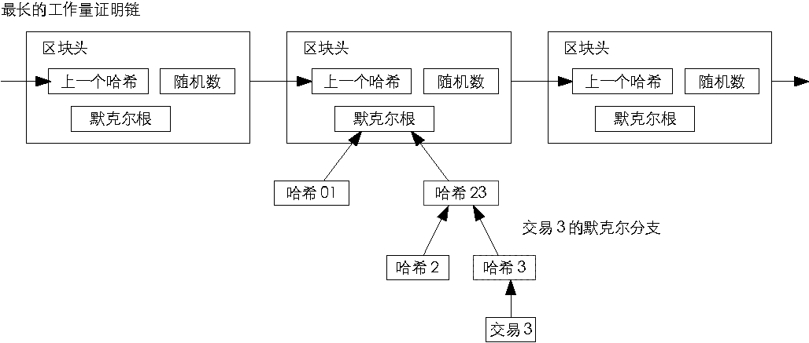
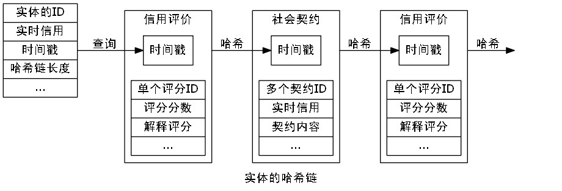
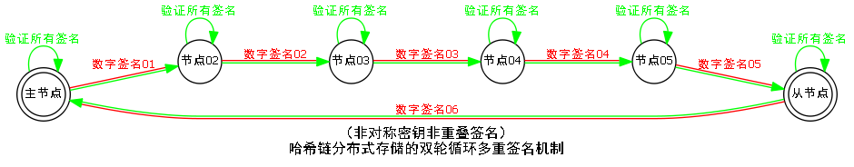

### 区块链的核心概念

——摘录自《图说区块链：神一样的金融科技与未来社会》ISBN:978-7-5086-7750-7，徐明星/田颖/李霁月

*技术创新：从比特币到区块链*

我们都知道，区块链是比特币的底层技术，可以说它是一种分布式数据存储模式，也可以说它是储存加密货币（例如比特币）的交易记录的公共账本。它的记录是加密的，被所有运行这个软件的机器所持有。

要说区块链就必然会讲到数字货币，毕竟区块链是为了满足比特币独特的需求才被创造出来的。而比特币则源于一个神秘的人物——中本聪。2008年，中本聪发表了一篇论文《比特币：一种点对点的电子现金系统》，这篇论文堪称区块链技术和加密数字货币发明的基础。

在这篇论文中提出了比特币的几个基本原则：

1. 一个纯粹的点对点电子现金系统，使在线支付能够直接由一方发起并支付给另一个人，中间不需要通过任何金融机构。
2. 不需要授信的第三方支持就能防止双重支付，点对点的网络环境是解决双重支付的一种方案。
3. 对全部交易加上时间戳，并将他们并入一个不断延展的基于哈希算法的工作量证明的链条作为交易记录。除非重新完成全部的工作量证明，形成的交易记录将不可更改。
4. 最长的链条不仅将作为被观察的事件序列的证明，而且被视为来自CPU（中央处理器）的计算能力最大的池。只要大多数CPU的计算能力不被合作攻击的节点所控制，那么就会生成最长的、长度超过攻击者的链条。
5. 这个系统本身需要的基础设施非常少，节点尽最大努力在全网传播信息即可，节点可以随时离开和重新加入网络，并将最长的工作量证明作为该节点离线期间发生的交易的证明。

*区块*

区块作为区块链的基本结构单元，由包含元数据的区块头和包含交易数据的区块主体构成。

区块头包含三组元数据：

1. 用于连接前面的区块、索引自父区块哈希值的数据；
2. 挖矿难度、Nonce（随机数，用于工作量证明算法的计数器）、时间戳；
3. 能够总结并快速归纳校验区块中所有交易数据的Merkle（默克尔）树根数据。

区块链系统大约每10分钟会创建一个区块，其中包含了这段时间里全网范围内发生的所有交易。每个区块中也包含了前一个区块的ID（识别码），这使得每个区块都能找到其前一个节点，这样一直倒推就形成了一条完整的交易链条。从诞生之初到运行至今，全网随之形成了一条唯一的主区块链。

*哈希算法*

哈希算法是区块链中保证交易信息不被篡改的单向密码机制。哈希算法接收一段明文后，以一种不可逆的方式将其转化为一段长度较短、位数固定的散列数据。

它有两个特点：

1. 加密过程不可逆，意味着我们无法通过输出的散列数据倒推原本的明文是什么；
2. 输入的明文与输出的散列数据一一对应，任何一个输入信息的变化，都必将导致最终输出的散列数据的变化。

在区块链中，通常使用SHA-256（安全散列算法）进行区块加密，这种算法的输入长度为256位，输出的是一串长度为32字节的随机散列数据。区块链通过哈希算法对一个交易区块中的交易信息进行加密，并把信息压缩成由一串数字和字母组成的散列字符串。区块链的哈希值能够唯一而准确地标识一个区块，区块链中任意节点通过简单的哈希计算都可以获得这个区块的哈希值，计算出的哈希值没有变化也就意味着区块中的信息没有被篡改。

*公钥和私钥*

在区块链的话题中，我们还经常听到这样的词汇——公钥和私钥。这就是俗称的不对称加密方式，是对以前的对称加密方式（使用用户名与密码）的提高。

我们用电子邮件加密的模型来简单介绍一下：公钥就是给大家用的，你可以通过电子邮件发布，可以通过网站让别人下载，公钥其实是用来加密/验证的。私钥就是自己的，必须非常小心保存，最好加上密码，私钥用来解密/签章，私钥由个人拥有。

在比特币的系统中，私钥本质上是32个字节组成的数组，公钥和地址生成都依赖私钥，有了私钥就能生成公钥和地址，就能够花费对应地址上面的比特币。私钥花费比特币的方式就是对这个私钥所对应的未花费的交易进行签名。

在区块链中，使用公钥和私钥来标志身份，我们假设区块链中有两个人，分别为小白和小黑，小白想向小黑证明自己是真实的小白，那么小白只需要使用私钥对文件进行签名并发送给小黑，小黑使用小白的公钥对文件进行签名验证，如果验证成功，那么就证明这个文件一定是小白用私钥加密过的。由于小白的私钥只有小白才能持有，那么，就可以验证小白确实是小白。

在区块链系统中，公钥和私钥还可以保证分布式网络点对点信息传递的安全。在区块链信息传递中，信息传递双方的公钥和私钥的加密与解密往往是不成对出现的。

信息发送者：用私钥对信息进行签名，使用信息接收方的公钥对信息加密。

信息接收方：用信息发送者的公钥验证信息发送者的身份，使用私钥对加密信息解密。

*时间戳*

区块链中的时间戳从区块生成的一刻起就存在于区块之中，它对应的是每一次交易记录的认证，证明交易记录的真实性。

时间戳是直接写在区块链中的，而区块链中已经生成的区块不可篡改，生成的哈希值就会变化，从而变成一个无效的数据。每一个时间戳会将前一个时间戳也纳入其随机哈希值中，这一过程不断重复，依次相连，最后生成一个完整的链条。

*Merkle树结构*

区块链利用Merkle树的数据结构存放所有叶子节点的值，并以此为基础生成一个统一的哈希值。Merkle树的叶子节点存储的是数据信息的哈希值，非叶子节点存储的是对其下面所有叶子节点的组合进行哈希计算后得到的哈希值。

同样地，区块中任意一个数据的变更都会导致Merkle树结构发生变化，在交易信息验证比对的过程中，Merkle树结构能够大大减少数据的计算量，毕竟，我们只需验证Merkle树结构生成的统一哈希值就可以了。

*区块链的工作原理*

我们假设A和B之间要发起一笔交易，A先发起一个请求——我要创建一个新的区块，这个区块就会被广播给网络里的所有用户，所有用户验证同意后该区块就被添加到主链上。这条链上拥有永久和透明可查的交易记录。全球一本账，每个人都可以查找。

区块链技术实际上是一个分布式数据库，在这个数据库中记账不是由个人或者某个中心化的主体来控制的，而是由所有节点共同维护、共同记账的。所有的单一节点都无法篡改它。

如果你想篡改一个记录，你需要同时控制整个网络超过51%的节点或计算能力才可以，而区块链中的节点无限多且无时无刻都在增加新的节点，这基本上是不可能完成的事情，而且篡改的成本非常高，几乎任何人都承担不起。

*区块链的四大特点*

经过无数次的记账，区块链就成为一个可信赖、超容量的公共账本。它具有以下几个特征：

1. 去中心化：在一个去中心化的金融系统中，没有中介机构，所有节点的权利和义务都相等，任意节点停止工作都不会影响系统整体的运作。
2. 去信任：系统中所有节点之间无须信任也可以进行交易，因为数据库和整个系统的运作是公开透明的，在系统的规则和时间范围内，节点之间无法欺骗彼此。
3. 集体维护：系统是由其中具有维护功能的所有节点共同维护的，系统中所有人共同参与维护工作。
4. 可靠的数据库：系统中每一个节点都拥有最新的完整数据库拷贝，修改单个节点的数据库是无效的，因为系统会自动比较，认为最多次出现的相同的数据记录为真。

*凭什么帮你记账*

凭什么你对着天空大喊一声，别人就要帮你记账，别人的时间不要钱吗？别人的小本子不要钱吗？于是，为了让大家都帮我记账，我增加了一条新的规则，我决定给第一个听到我喊话并且将其记录在小本子上的人奖励。奖励机制也很简单，第一个听到我喊话并记录下来的人，可以得到一个巴拉拉能量的奖励。

这个巴拉拉能量不是自给的，是对你劳动的报酬，就像打工可以挣钱一样，你帮我记账，整个系统都会给你报酬。你要做的事情，有这样几点：首先，你要抢在所有人之前听到了我的喊话并记在了自己的小本子上；记录之后，你还要马上告诉整个城市里的人——这句话我记录完了，你们再记录也没有用了，别人就会放弃这笔赚钱的生意；与此同时，你还要对一件事，就是给自己的记录加一个独一无二的编号，然后把记录和编号一起喊出来，于是，下一个再记录的时候，就会带着这个记录和独一无二的编号继续下去。

在这条新的规则开始实行之后，一定会有这样一些人，他们为了得到巴拉拉能量，开始屏气监听周围发出的各种声音，只为了能在第一时间记下一条新的记录。

这个时候，对区块链有所了解的读者是不是想到了这样的名词——“比特币挖矿”。没错，这就是比特币挖矿的简单说明。

关于比特币挖矿的话题，知乎用户“玲珑邪僧”的一篇文章举过一个更生动的例子，大致是这样的：单身男士们要找女朋友，“国民岳母”说，我有好多肤白貌美、乖巧可爱的女儿，这样吧，我给你们出一个旷世难题，解出一个就给你们其中一个姑娘的微信号。

于是，单身男士们疯狂竞争，想破脑袋去解这道旷世难题。只要其中一位单身男士解出一道题，就立马得意扬扬地昭告天下，示威全部单身男士，这个姑娘的微信号是我的啦，先到先得，你们放弃吧。其他单身男士虽然已经算到一半了，但是没有办法，速度不够快啊，只好立马去解下一道题。同时，首个成功破解旷世难题的幸运的单身男士不仅不用付一二十万元的彩礼，被其才华征服的“国民岳母”还会给这位单身男士一笔巨额财产做嫁妆，也就是比特币挖矿中的比特币奖励。

*双花问题*

双花问题是指一笔数字现金在交易中被重复使用的现象。如果我同时向B和C都喊了一句，我给你一个巴拉拉能量，怎么办呢？巴拉拉能量只有一个，如何保证一个巴拉拉能量在实际的交易中只被支付了一次呢？

我们以比特币为例，中本聪在《比特币白皮书》第五小节中是这样说的，运行比特币网络的步骤如下：

1. 新的交易向全网进行广播；
2. 每一个节点都将收到的交易信息纳入一个区块中；
3. 每个节点都尝试在自己的区块中找到一个具有足够难度的工作量证明；
4. 当一个节点找到了一个工作量证明，它就会向全网进行广播；
5. 当且仅当包含在该区块中的所有交易都是有效的且之前未存在过的，其他节点才认同该区块的有效性；
6. 其他节点表示他们接受该区块，而接受的方法则是跟随在该区块的末尾，制造新的区块以延长该链条，并将该区块的随机散列值视为新区块的随机散列值。

也就是说，交易发生的一刻起，比特币的交易数据就被盖上了时间戳；而当这笔交易数据被打包到一个区块中后，就算完成了一次确认；在连续进行6次确认之后，这笔交易就不可逆转了；在比特币中，每一次确认都需要“解决一个复杂的难题”，也就是说每一次确认都需要一定的时间。

在这种情况下，当我试图于把一笔资金进行两次支付交易的时候，因为确认时间较长，后一笔交易想要与前一笔交易同时得到确认几乎是不可能的，而这笔资金在第一次交易确认有效后，第二次交易时就无法得到确认。区块链的全网记账需要在整个网络中达成共识，双花问题是无法产生的。

### 比特币

区块链最初是为比特币专门创建的存储结构，狭义的区块链是指网络中每个节点上的数据存储，广义的区块链是指网络中所有节点上的区块链都将保持同步。比特币客户端可分为标准客户端与轻量级客户端，标准客户端包含完整的区块链数据库，轻量级客户端也就是钱包，仅包含部分的区块链数据库。区块链作为所有比特币交易的中心账本，分布式地存储在网络中所有的节点上，每个节点上的区块链都是同一个中心账本的复制。也就是说区块链是非常冗余的存储结构，而作为中心账本的区块链将变得非常庞大。在同一时间段内，网络中所有节点按工作量证明这种共识机制，集中全网的算力来为区块添加区块。工作量证明就是让节点做一定难度的工作任务，只有完成该工作任务后，节点才可以向区块链中添加区块，并向网络中其它所有节点广播这个新添加的区块，其它节点在收到新添加的区块后，便放弃当前正在进行的工作任务，并准备好为添加下一个区块而重新开始做一定难度的工作任务。也就是说工作量证明机制是非常消耗算力资源的共识机制。

区块链为每个区块盖上时间戳，狭义的时间戳是指区块被创建的时刻，广义的时间戳是指包括被创建时刻在内的整个区块的哈希值，哈希值就相当于该区块的指纹。每个区块中存储有前个区块的哈希值，前后区块之间通过链表的方式串联成区块链，因此每个区块的哈希值都与该区块之前的所有区块相关。如果改动区块链中的任意一个区块，那么该区块之后的所有区块中存储的哈希值都将改变，只要检测区块的头部区块的哈希值是否发生改变，就能得知该区块链是否发生改动，因此区块链具有不可伪造的特点。

总之，区块链是分布式存储，但有共同的中心账本，网络中所有通过工作量证明机制达成共识。

### 哈希链的核心概念

#### 狭义的哈希链

哈希链类似于区块链，但没有区块链中每个区块都有的梅克尔树。哈希链中的每个区块，或者用于存储信用评价，或者用于存储社会契约，信用评价区块与社会契约区块的存储结构不一定完全相同。信用评价区块中至少包含3项数据，即单个评分ID/评分分数/解释评分，其中单个评分ID是指对该哈希链所有者做出评分的ID，评分分数是指评分ID所作出的评分分数，解释评分是指评分ID对该次评分所作出的解释，解释评分也有可能是附加文件。社会契约区块中至少包含3项数据，即多个契约ID/实时信用/契约内容，其中多个契约ID是指共同签订契约的多个ID，实时信用是指契约达成之时该哈希链所有者的实时信用，契约内容是指该契约的文本内容，契约内容也有可能是附加文件。社会契约发生在多个实体之间，由单个实体发起，需要每个实体确认才能达成。信用评价发生在两个实体之间，由单个实体发起，不需要另一实体确认便可达成。

哈希链中的每个区块按创建时间被盖上时间戳，时间戳是指广义的时间戳。时间戳至少包含2项数据，即该区块创建的时刻/前个区块的哈希值，时间戳就相当于区块的指纹。后个区块中的时间戳存储有前个区块的哈希值，前后区块之间通过链表的方式串联成哈希链。哈希链的头部区块至少存储4项数据，即实体的ID/实时信用/时间戳/哈希链的长度，其中实体的ID是指该哈希链所有者的ID，实时信用是指该哈希链所有者在当前时刻的信用，时间戳仅仅简单复制哈希链中最新区块的时间戳，哈希链长度是指该哈希链中所存储的区块数目。

实体的ID即实体在网络中的唯一身份标志，实体的ID可通过实体的指纹与DNA等等生物特征唯一确定，但至少需要满足3个要求，即可自定义/简单易记/全网唯一确定。比如，刚出生的婴儿，他的父母可为他获得一个ID为19930905&19950522，这个ID经过查询全网未被发现存在，那么这个ID就可以作为实体的ID，任何遇见该实体的公民，都能通过该实体的ID去查询该实体的哈希链。头部区块中实时信用随着实体被实时评分而实时变动，实时信用是实体最重要的数据。头部区块中的时间戳与哈希链长度，主要用于当新客户端加入网络时校验哈希链。

#### 广义的哈希链

网络中与哈希链存储相关的节点至少可分为3种类型，即服务器/手机客户端/智能身份证，其中服务器存储着完整的哈希链，手机客户端至少存储着哈希链的头部区块，智能身份证至少存储着哈希链的头部区块中的实时信用。网络中的每个服务器节点存储着不定数量的实体的哈希链，每个实体的哈希链至少存储在6个服务器节点上。网络中的每个服务器是对等的，不存在统一协调的中心服务器。随着实体接入网络的次数增多，每个实体的哈希链将存储在远远超过6个服务器节点上，哈希链存储在越多的服务器节点上，就越能抵抗黑客攻击。也就是说广义的哈希链就是一个完全分布式的数据库，这个数据库由网络中所有服务器节点组成，并通过冗余数据存储的方式来保证平稳运行。没有统一的中心服务器也就没有协调统一的时间，每个对等的服务器按照自己的时间为哈希链中的区块加盖时间戳。因此时间戳里的时间并不是特别精确的时间，这个时间主要用于校验同一实体的哈希链中前后区块的次序。

对于哈希链中的存储机制，信用评价比社会契约稍微简单一些。为简化问题，假设主节点上存储有实体ID1的哈希链，实体ID1收到实体ID2的信用评价，最终将在实体ID1的哈希链中添加信用评价区块。由主节点生成信用评价，在单个评分ID中填入ID2，在评分分数中填入ID2对ID1的评分分数，在评分解释中填入ID2对ID1的评分解释，并以主节点上的时间加盖时间戳。主节点将哈希链的头部区块附加在信用评价上，再用自己的私钥对这份信用评价进行数字签名，接着将这份信用评价发往从节点。这份信用评价必须先后随机历经至少4个不同的服务器节点，这些服务器节点必须满足的条件是存储有ID1的哈希链。每个服务器节点将检查信用评价上的时间戳与本服务器上的时间是否矛盾，并校验哈希链的头部区块是否一致。再用自己的私钥对这份信用评价单独进行数字签名，每次数字签名都可以采用不同的非对称密钥算法，并将所采用非对称密钥算法附加在数字签名上。从节点在对信用评价进行数字签名后，便将信用评价发回主节点。主节点根据信用评价上数字签名附加的非对称密钥算法，依次验证所有6个服务器的数字签名。如果6个数字签名全都验证成功，就意味着该信用评价被包括主节点在内的6个服务器成功接收，主节点就可以将该信用评价区块加入到ID1的哈希链中，其余服务器节点依次验证完所有数字签名后，也将该信用评价区块加入到ID1的哈希链中。

### 社会信用评价系统

社会信用评价系统

第三方中介，双重支付，更改记录，黑客攻击。

荒唐中介，信息泄露，手续繁琐，丢失遗忘。
