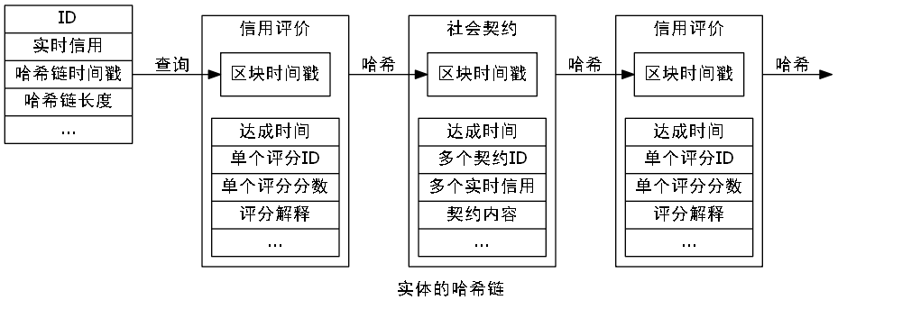

### 区块链的核心原理

——摘录自《图说区块链：神一样的金融科技与未来社会》ISBN:978-7-5086-7750-7，徐明星/田颖/李霁月

*区块*

区块作为区块链的基本结构单元，由包含元数据的区块头和包含交易数据的区块主体构成。

区块头包含三组元数据：

1. 用于连接前面的区块、索引自父区块哈希值的数据；
2. 挖矿难度、Nonce（随机数，用于工作量证明算法的计数器）、时间戳；
3. 能够总结并快速归纳校验区块中所有交易数据的Merkle（默克尔）树根数据。

区块链系统大约每10分钟会创建一个区块，其中包含了这段时间里全网范围内发生的所有交易。每个区块中也包含了前一个区块的ID（识别码），这使得每个区块都能找到其前一个节点，这样一直倒推就形成了一条完整的交易链条。从诞生之初到运行至今，全网随之形成了一条唯一的主区块链。

*哈希算法*

哈希算法是区块链中保证交易信息不被篡改的单向密码机制。哈希算法接收一段明文后，以一种不可逆的方式将其转化为一段长度较短、位数固定的散列数据。

它有两个特点：

1. 加密过程不可逆，意味着我们无法通过输出的散列数据倒推原本的明文是什么；
2. 输入的明文与输出的散列数据一一对应，任何一个输入信息的变化，都必将导致最终输出的散列数据的变化。

在区块链中，通常使用SHA-256（安全散列算法）进行区块加密，这种算法的输入长度为256位，输出的是一串长度为32字节的随机散列数据。区块链通过哈希算法对一个交易区块中的交易信息进行加密，并把信息压缩成由一串数字和字母组成的散列字符串。区块链的哈希值能够唯一而准确地标识一个区块，区块链中任意节点通过简单的哈希计算都可以获得这个区块的哈希值，计算出的哈希值没有变化也就意味着区块中的信息没有被篡改。

*公钥和私钥*

在区块链的话题中，我们还经常听到这样的词汇——公钥和私钥。这就是俗称的不对称加密方式，是对以前的对称加密方式（使用用户名与密码）的提高。

我们用电子邮件加密的模型来简单介绍一下：公钥就是给大家用的，你可以通过电子邮件发布，可以通过网站让别人下载，公钥其实是用来加密/验证的。私钥就是自己的，必须非常小心保存，最好加上密码，私钥用来解密/签章，私钥由个人拥有。

在比特币的系统中，私钥本质上是32个字节组成的数组，公钥和地址生成都依赖私钥，有了私钥就能生成公钥和地址，就能够花费对应地址上面的比特币。私钥花费比特币的方式就是对这个私钥所对应的未花费的交易进行签名。

在区块链中，使用公钥和私钥来标志身份，我们假设区块链中有两个人，分别为小白和小黑，小白想向小黑证明自己是真实的小白，那么小白只需要使用私钥对文件进行签名并发送给小黑，小黑使用小白的公钥对文件进行签名验证，如果验证成功，那么就证明这个文件一定是小白用私钥加密过的。由于小白的私钥只有小白才能持有，那么，就可以验证小白确实是小白。

在区块链系统中，公钥和私钥还可以保证分布式网络点对点信息传递的安全。在区块链信息传递中，信息传递双方的公钥和私钥的加密与解密往往是不成对出现的。

信息发送者：用私钥对信息进行签名，使用信息接收方的公钥对信息加密。

信息接收方：用信息发送者的公钥验证信息发送者的身份，使用私钥对加密信息解密。

*时间戳*

区块链中的时间戳从区块生成的一刻起就存在于区块之中，它对应的是每一次交易记录的认证，证明交易记录的真实性。

时间戳是直接写在区块链中的，而区块链中已经生成的区块不可篡改，生成的哈希值就会变化，从而变成一个无效的数据。每一个时间戳会将前一个时间戳也纳入其随机哈希值中，这一过程不断重复，依次相连，最后生成一个完整的链条。

*Merkle树结构*

区块链利用Merkle树的数据结构存放所有叶子节点的值，并以此为基础生成一个统一的哈希值。Merkle树的叶子节点存储的是数据信息的哈希值，非叶子节点存储的是对其下面所有叶子节点的组合进行哈希计算后得到的哈希值。

同样地，区块中任意一个数据的变更都会导致Merkle树结构发生变化，在交易信息验证比对的过程中，Merkle树结构能够大大减少数据的计算量，毕竟，我们只需验证Merkle树结构生成的统一哈希值就可以了。

*区块链的工作原理*

我们假设A和B之间要发起一笔交易，A先发起一个请求——我要创建一个新的区块，这个区块就会被广播给网络里的所有用户，所有用户验证同意后该区块就被添加到主链上。这条链上拥有永久和透明可查的交易记录。全球一本账，每个人都可以查找。

区块链技术实际上是一个分布式数据库，在这个数据库中记账不是由个人或者某个中心化的主体来控制的，而是由所有节点共同维护、共同记账的。所有的单一节点都无法篡改它。

如果你想篡改一个记录，你需要同时控制整个网络超过51%的节点或计算能力才可以，而区块链中的节点无限多且无时无刻都在增加新的节点，这基本上是不可能完成的事情，而且篡改的成本非常高，几乎任何人都承担不起。

*区块链的四大特点*

经过无数次的记账，区块链就成为一个可信赖、超容量的公共账本。它具有以下几个特征：

1. 去中心化：在一个去中心化的金融系统中，没有中介机构，所有节点的权利和义务都相等，任意节点停止工作都不会影响系统整体的运作。
2. 去信任：系统中所有节点之间无须信任也可以进行交易，因为数据库和整个系统的运作是公开透明的，在系统的规则和时间范围内，节点之间无法欺骗彼此。
3. 集体维护：系统是由其中具有维护功能的所有节点共同维护的，系统中所有人共同参与维护工作。
4. 可靠的数据库：系统中每一个节点都拥有最新的完整数据库拷贝，修改单个节点的数据库是无效的，因为系统会自动比较，认为最多次出现的相同的数据记录为真。

### 比特币

区块链最初是专为比特币创建的底层存储结构，

比特币作为匿名的加密数字货币，以区块链作为底层的存储结构，但呈现在用户面前的是比特币的客户端，也就是人们所说的钱包。区块链是记录着全世界所有的比特币交易的中心账本，在网络中分布式地存储在所有网络节点上，所有网络节点存储的区块链都一样，也就是说区块链是非常非常冗余的存储方式。在同一时间段内，全网所有节点按工作量证明这种共识机制，集中全网的算力来为区块链添加区块，也就是说工作量证明是非常非常消耗算力资源的方法。区块链通过哈希指针串联成链表，每个区块都被盖上时间戳，通过这些方式区块链便具有不可伪造的特性。如果区块链上任意地方的数据被篡改，则区块链中头部指针的哈希值将发生改变，通过检测头部指针的哈希值便可知道区块链上的数据是否被篡改。区块链是分布式存储，但有共同的中心账本。

### 哈希链的核心概念

在比特币网络中，交易和区块信息的传播是通过洪水算法进行的。简单地说，就是每一个收到信息的节点，向与它相连的所有节点推送该信息。下一个收到信息的节点继续这个过程，信息很快就会像洪水一样覆盖全网络。可见，传播速度是呈指数增长的。通常在一两秒内，交易或者区块的信息就可以传遍全网。

### 社会信用评价系统

第三方中介，双重支付，更改记录，黑客攻击。

荒唐中介，信息泄露，手续繁琐，丢失遗忘。

