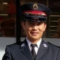
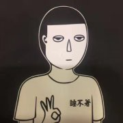

### Twitter

| **头像**                                                | **账号**                                                     | **注册** | **地址**       | **简介**                                                     | **网站**                                                     |
| :------------------------------------------------------ | :----------------------------------------------------------- | :------- | :------------- | :----------------------------------------------------------- | :----------------------------------------------------------- |
|  | [Vanessa 姗@Vanessa_ZhangUK](https://twitter.com/Vanessa_ZhangUK) | 2017-05  | United Kingdom | 假如这个世界堕入黑暗，那么，吹灭最后一盏灯的，不是坏人的嚣张气焰，而是好人的忍气吞声。和大家一起，传播真相。 |                                                              |
|    | [西域雄鷹@TiQ9O30b1qhw73O](https://twitter.com/TiQ9O30b1qhw73O) | 2017-09  |                | 時事政治，分享國內及世界突發新聞與時評 強力支持中國民眾，剷除國內最大最惡的黑社會犯罪團伙 — 中國共產黨，推翻習共封建兲朝！ Strongly support the Chinese people and eradicate the largest and worst criminal gang as the CCP |                                                              |
|      | [黄子茵 雾亭 🗽@wutingzy](https://twitter.com/wutingzy)       | 2016-12  |                | China Issues 三种罪 统治别人 接受统治 和帮助统治 对统治者三不 不合作 不承认 不上当 中国人的事情 只有中国人努力 才有希望 自救者得救 团结或死亡 [#全民共振](https://twitter.com/hashtag/%E5%85%A8%E6%B0%91%E5%85%B1%E6%8C%AF?src=hash) [#全民立约](https://twitter.com/hashtag/%E5%85%A8%E6%B0%91%E7%AB%8B%E7%BA%A6?src=hash) 共振交流群 [https://t.me/QMGZ2019 ](https://t.co/lBtPGl6yrv) 共振电报频道 [https://t.me/QMGZ2018 | [雾亭黄子茵 - YouTube](https://www.youtube.com/channel/UCFjKZM-6dADQG1CXNjzac2A) |

### 微博

| **头像**                                             | **账号**                                                     | **性别** | **生日**          | **地区**     | **注册**   | **简介**                                                     | **背景**                                                     | **博客** |
| :--------------------------------------------------- | :----------------------------------------------------------- | :------- | :---------------- | :----------- | :--------- | :----------------------------------------------------------- | :----------------------------------------------------------- | :------- |
|                     | [@-熊吹](https://weibo.com/p/1005051292292547/)              | 女       |                   | 北京市海淀区 | 2011-07-09 | 将我温柔豢养。                                               | 北京大学信息科学技术学院，2016》重庆大学计算机学院，2012》郑州外国语学校，2009 |          |
|               | [@_一只都放假](https://weibo.com/p/1005051256810972/)        | 女       | 2013-02-03 金牛座 | 其他         | 2013-02-03 | 日拱一卒，功不唐捐。                                         | 中国科学院大学电子学研究所，2016》电子科技大学电子工程学院，2012》郑州外国语学校，2009 |          |
|  | [@不出这么多年你就别改名了](https://weibo.com/p/1005053918318566/) | 女       | 1987-08-12        | 其他         | 2013-12-04 | 黄泉路上愉快地走                                             |                                                              |          |
|          | [@八月长安就是二熊](https://weibo.com/p/1035051739998217/)   | 女       | 1987-08-12        | 上海         | 2010-11-08 | 作家、编剧：八月长安，作品《你好，旧时光》//他们都在向前奔跑，只有她和狗一起原地衰老。他们的前方也许很美，可是她俩觉得，这里已经很好很好。 | 北京大学光华管理学院，早稻田大学，2006                       |          |
|                  | [@格拉苏cc](https://weibo.com/p/1005053770014175/)           | 女       | 巨蟹座            | 广东省珠海市 | 2013-09-04 | ٩۹(๑•̀ω•́ ๑)۶奋斗的🐰                                           |                                                              |          |
|              | [@老郑爱吃枣儿](https://weibo.com/p/1005052162732201/)       | 男       |                   | 北京         | 2011-06-05 |                                                              |                                                              |          |
|                     | [@覃晔Q](https://weibo.com/p/1005051845023791/)              | 女       | 10-13             | 美国         | 2010-11-02 | 友邻优课签约教师 美国盖洛普优势教练 哥伦比亚大学认知心理学硕士 CATTI二级口译 | Columbia University，2015                                    |          |
|               | [@也要楚天阔](https://weibo.com/p/1005051267831823/)         | 女       | 04-11             | 陕西省西安市 | 2010-10-09 | 也要楚天阔，也要大江流，也要望不见前后，才能对月再下酒。     |                                                              |          |
